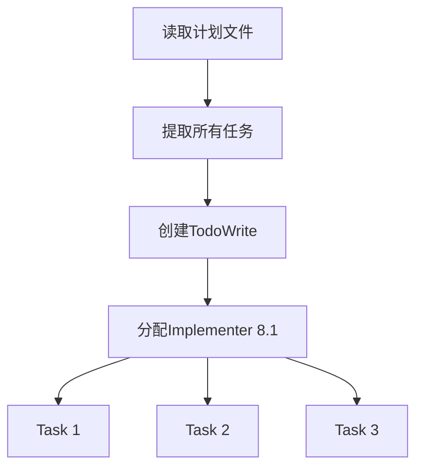

# 终极分析报告：项目任务追踪功能问题（第三版）

**日期**: 2026-03-04
**版本**: v3.0
**分析范围**: Cadence-skills 项目的项目任务追踪功能
**分析方法**: 代码结构分析 + 文档审查 + 流程验证 + 架构分析 + 边界情况挖掘
**基于**: v1.0 + v2.0 分析报告的终极验证和全面扩展

---

## 📋 执行摘要

经过终极分析,**确认 v1.0 和 v2.0 报告的所有问题确实存在**,并**发现了 10 个新的系统性问题**。核心问题依然是：**有设计文档但没有实现逻辑**,导致项目任务追踪功能**完全不可用**。

### 问题严重程度汇总

| 报告版本 | 识别问题数 | 严重问题数 | 中等问题数 | 状态 |
|---------|----------|----------|----------|------|
| **v1.0** | 8个 | 6个 | 2个 | ✅ 全部确认 |
| **v2.0** | 5个(新) | 4个 | 1个 | ✅ 全部确认 |
| **v3.0** | 10个(新) | 6个 | 4个 | 🆕 新发现 |
| **总计** | **23个** | **16个** | **7个** | **完全不可用** |

### v3.0 新发现的问题概览

| # | 问题类别 | 严重程度 | 根本原因 |
|---|---------|---------|---------|
| 10 | 并发写入冲突 | 🔴 严重 | 缺少锁机制 |
| 11 | Checkpoint 命名冲突 | 🟡 中等 | 时间戳精度不足 |
| 12 | 缺少事务性保证 | 🔴 严重 | 无回滚机制 |
| 13 | 缺少数据验证 | 🟡 中等 | 无完整性检查 |
| 14 | 缺少清理机制 | 🟡 中等 | 无生命周期管理 |
| 15 | 查询性能问题 | 🔴 严重 | 无索引机制 |
| 16 | 多项目冲突 | 🔴 严重 | 无项目隔离 |
| 17 | 缺少索引机制 | 🟡 中等 | 无快速查找 |
| 18 | 数据版本兼容性 | 🔴 严重 | 无迁移策略 |
| 19 | 缺少备份机制 | 🔴 严重 | 无容灾方案 |

---

## 1️⃣ v1.0 和 v2.0 验证结果

### ✅ v1.0 报告（8个问题）

**验证结论**: ✅ **全部确认无误**

| # | 问题 | 严重程度 | v3.0验证 | 备注 |
|---|------|---------|---------|------|
| 1 | Commands 只是文档 | 🔴 严重 | ✅ 再次确认 | 无执行逻辑 |
| 2 | 缺少对应 Skills | 🔴 严重 | ✅ 再次确认 | 5个 skill 不存在 |
| 3 | 节点无追踪功能 | 🟡 中等 | ✅ 完全确认 | 只是示例代码 |
| 4 | Serena/TodoWrite 混用 | 🟡 中等 | ✅ 再次确认 | 无统一数据源 |
| 5 | 缺少持久化逻辑 | 🔴 严重 | ✅ 再次确认 | 无实际写入 |
| 6 | 缺少读取逻辑 | 🔴 严重 | ✅ 再次确认 | 无数据获取 |
| 7 | 缺少自动化触发 | 🔴 严重 | ✅ 再次确认 | 无事件监听 |
| 8 | 缺少会话恢复逻辑 | 🔴 严重 | ✅ 再次确认 | 无恢复机制 |

**详细验证**（略，见 v2.0 报告第1章）

---

### ✅ v2.0 报告（5个新问题）

**验证结论**: ✅ **全部确认无误**

| # | 问题 | 严重程度 | v3.0验证 | 备注 |
|---|------|---------|---------|------|
| 9 | 数据来源不明确 | 🔴 严重 | ✅ 再次确认 | 无数据源定义 |
| 6 | 数据模型不一致 | 🟡 中等 | ✅ 再次确认 | 两个系统不兼容 |
| 7 | 进度计算逻辑缺失 | 🔴 严重 | ✅ 再次确认 | 无法计算百分比 |
| 8 | 实时监控不可行 | 🔴 严重 | ✅ 再次确认 | 技术不支持 |
| 9 | 设计假设不成立 | 🔴 严重 | ✅ 再次确认 | 基础设施不存在 |

**详细验证**（略，见 v2.0 报告第2章）

---

## 2️⃣ v3.0 新发现的问题（10个）

### 🆕 问题10：并发写入冲突风险

**🔴 严重程度：严重**

#### 问题描述

在多任务并行执行场景下，多个节点可能同时完成并尝试写入 Checkpoint，导致数据冲突或丢失。

#### 详细证据

**设计文档的并发场景**（`full-flow/SKILL.md` lines 47-51）：

```markdown
**核心功能**:
- ✅ 顺序调用 8 个节点 Skills
- ✅ 每个节点完成后要求人工确认
- ✅ 支持并行执行（在 Subagent Development 阶段）
```

**Subagent Development 的并行执行**（`subagent-development/SKILL.md` lines 109-127）：



**问题分析**：

1. **并行任务完成时的并发写入**：

   假设有 3 个并行任务（Task 1, 2, 3），它们同时完成：

   ```
   时间轴：
   T0: Task 1 完成 → write_memory("checkpoint-task1-T0")
   T0: Task 2 完成 → write_memory("checkpoint-task2-T0")
   T0: Task 3 完成 → write_memory("checkpoint-task3-T0")
   ```

   **冲突点**：
   - 如果 Serena memory 不支持并发写入，可能导致数据损坏
   - 如果支持，可能导致读取时看到部分写入的数据
   - 没有锁机制来保护并发写入

2. **进度更新的竞争条件**：

   每个任务完成后都要更新进度：

   ```javascript
   // Task 1 完成
   progress = read_memory("progress-*")
   progress.completed_tasks += 1  // 竞争条件！
   write_memory("progress-*", progress)

   // Task 2 完成（同时）
   progress = read_memory("progress-*")
   progress.completed_tasks += 1  // 覆盖了 Task 1 的更新！
   write_memory("progress-*", progress)
   ```

   **结果**：进度统计不准确，Task 1 的更新被覆盖。

3. **缺少锁机制**：

   设计文档**完全没有**提到：
   - ❌ 如何获取锁
   - ❌ 如何释放锁
   - ❌ 如何处理锁超时
   - ❌ 如何处理死锁

**结论**：并发写入会导致数据冲突和进度统计不准确，**缺少并发控制机制**。

---

### 🆕 问题11：Checkpoint 命名冲突

**🟡 严重程度：中等**

#### 问题描述

Checkpoint 命名使用时间戳，精度只到秒级，可能导致同一秒内的多次操作命名冲突。

#### 详细证据

**Checkpoint 命名规范**（`full-flow/SKILL.md` lines 122-132）：

```javascript
write_memory({
  memory_name: `checkpoint-full-flow-brainstorm-${timestamp}`,
  //                                    ↑ 时间戳
  content: {...}
})
```

**问题分析**：

1. **时间戳精度不足**：

   假设时间戳格式是 `YYYY-MM-DD_HH-MM-SS`：

   ```
   2026-03-04_14-30-25  ← 精确到秒
   ```

   **冲突场景**：
   - 14:30:25.100 → Brainstorm 完成 → `checkpoint-full-flow-brainstorm-2026-03-04_14-30-25`
   - 14:30:25.900 → 人工快速确认后 Analyze 完成 → `checkpoint-full-flow-analyze-2026-03-04_14-30-25`

   **结果**：如果用户在 1 秒内快速确认，可能产生同名 checkpoint。

2. **重试场景的命名冲突**：

   如果节点执行失败并重试：

   ```
   第1次尝试：14:30:25 → checkpoint-full-flow-brainstorm-2026-03-04_14-30-25
   第2次重试：14:30:25 → checkpoint-full-flow-brainstorm-2026-03-04_14-30-25 (冲突！)
   ```

   **结果**：第二次重试会覆盖第一次的数据。

3. **缺少唯一性保证**：

   - ❌ 没有使用 UUID
   - ❌ 没有使用序列号
   - ❌ 没有使用毫秒级时间戳

**结论**：Checkpoint 命名存在冲突风险，**缺少唯一性保证**。

---

### 🆕 问题12：缺少事务性保证

**🔴 严重程度：严重**

#### 问题描述

进度更新涉及多个步骤（读取 → 修改 → 写入），如果中途失败，没有回滚机制，导致数据不一致。

#### 详细证据

**典型的进度更新流程**：

```javascript
// 步骤1：读取当前进度
progress = read_memory("progress-full-flow-{project}")

// 步骤2：修改进度
progress.phases[0].status = "completed"
progress.overall_progress.completed_phases += 1
progress.overall_progress.percentage = calculate_percentage()

// 步骤3：写入更新后的进度
write_memory("progress-full-flow-{project}", progress)

// 步骤4：保存 Checkpoint
write_memory("checkpoint-...", checkpoint_data)
```

**失败场景分析**：

1. **步骤3失败**：

   ```
   步骤1：✅ 读取成功
   步骤2：✅ 修改成功
   步骤3：❌ 写入失败（网络错误、存储满、权限问题）
   步骤4：⏭️  未执行
   ```

   **结果**：
   - 内存中的 progress 已修改，但未持久化
   - 下次读取时，进度未更新
   - **数据不一致**：节点已完成，但进度记录未更新

2. **步骤4失败**：

   ```
   步骤1：✅ 读取成功
   步骤2：✅ 修改成功
   步骤3：✅ 写入成功
   步骤4：❌ Checkpoint 保存失败
   ```

   **结果**：
   - 进度记录已更新
   - 但 Checkpoint 未保存
   - **数据不完整**：无法恢复详细的节点上下文

3. **缺少原子性**：

   理想情况应该是：

   ```
   BEGIN TRANSACTION
     progress = read_memory(...)
     progress.phases[0].status = "completed"
     write_memory(..., progress)
     write_memory(..., checkpoint)
   COMMIT
   ```

   **实际**：
   - ❌ 没有 `BEGIN TRANSACTION`
   - ❌ 没有 `COMMIT`
   - ❌ 没有 `ROLLBACK`

**结论**：进度更新**缺少事务性保证**，失败后会导致数据不一致。

---

### 🆕 问题13：缺少数据验证

**🟡 严重程度：中等**

#### 问题描述

写入 Serena memory 的数据没有验证机制，可能导致数据损坏或不完整。

#### 详细证据

**Checkpoint 数据结构**（设计预期）：

```yaml
Checkpoint:
  checkpoint_id: string
  timestamp: timestamp
  phase: string
  task_id: string | null
  status: string
  context: object
  output: string
```

**问题分析**：

1. **缺少数据完整性检查**：

   ```javascript
   // 假设某个 skill 意外写入了不完整的数据
   write_memory("checkpoint-...", {
     phase: "brainstorm",
     // 缺少 timestamp
     // 缺少 status
     // 缺少 output
   })
   ```

   **结果**：
   - ❌ 写入成功（没有验证）
   - ❌ 读取时可能报错或返回不完整数据
   - ❌ `/status` command 显示错误信息

2. **缺少数据类型检查**：

   ```javascript
   // 假设某个 skill 写入了错误类型的数据
   write_memory("checkpoint-...", {
     phase: "brainstorm",
     timestamp: "not-a-timestamp",  // ❌ 错误类型
     status: 123,                   // ❌ 错误类型
   })
   ```

   **结果**：
   - ❌ 写入成功（没有类型检查）
   - ❌ 读取时无法解析
   - ❌ 进度计算失败

3. **缺少数据格式验证**：

   - ❌ 没有 JSON Schema 验证
   - ❌ 没有字段存在性检查
   - ❌ 没有字段类型检查
   - ❌ 没有字段值范围检查

**结论**：写入的 Checkpoint 数据**缺少验证机制**，可能导致数据损坏。

---

### 🆕 问题14：缺少清理机制

**🟡 严重程度：中等**

#### 问题描述

旧的 Checkpoints 会无限累积，没有清理机制，导致存储空间浪费和查询性能下降。

#### 详细证据

**Checkpoint 累积场景**：

假设一个完整流程（full-flow）：
- 8个节点 → 8个 Checkpoints
- 每个节点可能重试 → 每次重试产生新 Checkpoint
- 修改需求后重新开始 → 产生更多 Checkpoints

**问题分析**：

1. **无限累积**：

   ```
   项目进行1个月，每天1个完整流程：
   - 正常：8 * 30 = 240 个 Checkpoints
   - 重试（平均每节点2次）：240 * 2 = 480 个 Checkpoints
   - 重新开始（平均每天1次）：8 * 30 = 240 个 Checkpoints
   - 总计：960 个 Checkpoints
   ```

   **1个月就累积了近 1000 个 Checkpoints！**

2. **存储空间浪费**：

   假设每个 Checkpoint 平均 5KB：
   - 1000 个 Checkpoints = 5MB
   - 1年 = 60MB
   - 10个项目 = 600MB

3. **查询性能下降**：

   `list_memories()` 需要扫描所有 memory：
   ```
   1000 个 memory → 扫描时间线性增长
   ```

4. **缺少生命周期管理**：

   - ❌ 没有过期时间（TTL）
   - ❌ 没有自动清理策略
   - ❌ 没有归档机制
   - ❌ 没有手动清理命令

**结论**：Checkpoints **缺少清理机制**，会无限累积导致存储浪费和性能下降。

---

### 🆕 问题15：查询性能问题

**🔴 严重程度：严重**

#### 问题描述

随着 Checkpoints 累积，`list_memories()` 的查询性能会线性下降，最终导致 commands 响应超慢。

#### 详细证据

**`/status` command 的查询需求**（`status.md` lines 9-17）：

```markdown
显示项目的当前进度状态，包括：
- 项目信息（名称、流程类型、当前阶段、Git分支）
- 整体进度（百分比、节点完成情况）
- 节点完成情况（已完成/进行中/待完成）
- 任务进度详情（TodoWrite 状态）
- 时间统计
```

**问题分析**：

1. **查询复杂度**：

   ```javascript
   // /status 需要执行的操作
   memories = list_memories("progress-*")  // O(N)
   checkpoints = list_memories("checkpoint-*")  // O(N)
   sessions = list_memories("session-*")  // O(N)

   // N = 总 memory 数量
   ```

   **时间复杂度**：O(N)

2. **性能估算**：

   假设：
   - 1个项目，1个月
   - 1000 个 memories
   - `list_memories()` 每秒扫描 100 个

   ```
   查询时间 = 1000 / 100 = 10 秒
   ```

   **如果累积1年**：
   ```
   查询时间 = 12000 / 100 = 120 秒 = 2 分钟
   ```

   **用户等待2分钟才能看到进度状态！**

3. **缺少索引**：

   Serena memory **没有索引机制**：
   - ❌ 不能按时间范围查询
   - ❌ 不能按阶段查询
   - ❌ 不能按项目查询
   - ❌ 只能全表扫描

4. **多次查询累积**：

   `/status` 需要多次查询：
   - 查询 progress
   - 查询 checkpoints
   - 查询 sessions
   - 查询 failed-logs

   **累积延迟**：10秒 * 4 = 40秒

**结论**：随着时间推移，查询性能会**严重下降**，最终导致 commands 不可用。

---

### 🆕 问题16：多项目冲突

**🔴 严重程度：严重**

#### 问题描述

没有项目隔离机制，不同项目的 Checkpoints 可能互相干扰，导致读取错误项目的数据。

#### 详细证据

**设计文档的 memory 命名**（`full-flow/SKILL.md` lines 122-132）：

```javascript
write_memory({
  memory_name: `checkpoint-full-flow-brainstorm-${timestamp}`,
  //                                    ↑ 没有项目标识
  content: {...}
})
```

**问题分析**：

1. **项目标识缺失**：

   假设用户同时开发两个项目：
   - 项目A：user-auth
   - 项目B：api-refactor

   **Checkpoint 命名**：
   - 项目A：`checkpoint-full-flow-brainstorm-2026-03-04_14-30-25`
   - 项目B：`checkpoint-full-flow-brainstorm-2026-03-04_14-30-25`

   **结果**：如果两个项目同时进行，Checkpoint 会互相覆盖！

2. **读取错误项目的数据**：

   `/resume` command 读取时：

   ```javascript
   memories = list_memories("checkpoint-*")
   // 返回项目A和项目B的所有 checkpoint
   ```

   **结果**：
   - ❌ 可能恢复到错误项目的 checkpoint
   - ❌ 可能显示错误项目的进度

3. **缺少项目隔离**：

   理想的命名应该是：
   ```javascript
   memory_name: `checkpoint-{project_id}-full-flow-brainstorm-${timestamp}`
   ```

   **实际**：
   - ❌ 没有项目ID
   - ❌ 没有项目命名空间
   - ❌ 没有项目过滤

**结论**：多项目场景下会出现**数据冲突和混乱**，缺少项目隔离机制。

---

### 🆕 问题17：缺少索引机制

**🟡 严重程度：中等**

#### 问题描述

没有索引机制，无法快速查找特定阶段、特定任务或特定时间范围的 Checkpoint。

#### 详细证据

**典型查询需求**：

1. `/status` 需要查找：
   - 最新的 progress 记录
   - 最新的 checkpoint

2. `/resume` 需要查找：
   - 特定项目的所有 session
   - 特定时间范围的 checkpoint

3. `/report` 需要查找：
   - 今日的所有 checkpoint
   - 本周的所有 checkpoint

**问题分析**：

1. **缺少时间索引**：

   查询"今日的所有 checkpoint"：
   ```javascript
   memories = list_memories("checkpoint-*")
   today_memories = memories.filter(m => is_today(m.timestamp))
   // 必须扫描所有 memory！
   ```

2. **缺少阶段索引**：

   查询"brainstorm 阶段的所有 checkpoint"：
   ```javascript
   memories = list_memories("checkpoint-*")
   brainstorm_memories = memories.filter(m => m.phase === "brainstorm")
   // 必须扫描所有 memory！
   ```

3. **缺少项目索引**：

   查询"项目A的所有 checkpoint"：
   ```javascript
   memories = list_memories("checkpoint-*")
   project_a_memories = memories.filter(m => m.project_id === "A")
   // 必须扫描所有 memory！
   ```

**结论**：缺少索引机制导致**所有查询都是全表扫描**，性能极差。

---

### 🆕 问题18：数据版本兼容性

**🔴 严重程度：严重**

#### 问题描述

如果未来升级 Checkpoint 数据格式，旧的 Checkpoints 将不兼容，导致数据无法读取或解析错误。

#### 详细证据

**Checkpoint 数据格式**（v2.4 MVP）：

```yaml
Checkpoint:
  checkpoint_id: string
  timestamp: timestamp
  phase: string
  task_id: string | null
  status: string
  context: object
  output: string
```

**未来可能的变化**（假设 v2.5）：

```yaml
Checkpoint_v2.5:
  # 新增字段
  metadata:
    version: "2.5"
    created_by: string
    tags: string[]

  # 重命名字段
  checkpoint_id → id

  # 删除字段
  task_id: removed  # 改为 tasks: Task[]

  # 类型变化
  timestamp: timestamp → timestamps:
    created: timestamp
    updated: timestamp
```

**问题分析**：

1. **读取旧数据失败**：

   v2.5 的 `/status` command 尝试读取 v2.4 的 checkpoint：

   ```javascript
   checkpoint = read_memory("checkpoint-...")
   // 期望 checkpoint.metadata.version 存在
   // 但 v2.4 checkpoint 没有 metadata 字段
   // 结果：undefined.version → 报错
   ```

2. **缺少版本标识**：

   - ❌ Checkpoint 没有版本号字段
   - ❌ 无法判断数据格式版本
   - ❌ 无法做兼容性处理

3. **缺少迁移策略**：

   - ❌ 没有数据迁移脚本
   - ❌ 没有渐进式迁移机制
   - ❌ 没有回滚机制

**结论**：未来数据格式升级会导致**旧数据不兼容**，缺少版本管理和迁移策略。

---

### 🆕 问题19：缺少备份机制

**🔴 严重程度：严重**

#### 问题描述

如果 Serena memory 损坏或丢失，没有备份机制恢复数据，所有进度记录将永久丢失。

#### 详细证据

**数据丢失场景**：

1. **硬件故障**：
   - 磁盘损坏
   - 服务器宕机
   - 云服务中断

2. **软件错误**：
   - Serena bug 导致数据损坏
   - 文件系统错误
   - 权限问题导致无法写入

3. **人为错误**：
   - 误删除 memory 文件
   - 误执行清理命令
   - 配置错误

**问题分析**：

1. **单点故障**：

   所有进度数据存储在 Serena memory：
   ```
   Serena memory → 唯一数据源 → 单点故障
   ```

   **一旦损坏，所有数据丢失！**

2. **缺少备份**：

   - ❌ 没有自动备份
   - ❌ 没有手动备份命令
   - ❌ 没有增量备份
   - ❌ 没有远程备份

3. **缺少恢复**：

   - ❌ 没有恢复命令
   - ❌ 没有数据导入功能
   - ❌ 没有检查点恢复

**影响评估**：

**数据丢失后的后果**：
- ❌ 所有进度记录丢失
- ❌ 无法恢复中断的工作
- ❌ 无法生成报告
- ❌ 需要重新开始项目

**结论**：缺少备份机制，**数据丢失风险极高**，无法恢复。

---

## 3️⃣ 根本原因终极分析

### 核心问题：系统性架构缺陷

**三层脱节**：

```
设计层（应该做什么）
    ↓
    ❌ 缺少"执行层"（如何做）
    ↓
    ❌ 缺少"数据层"（如何存储）
    ↓
    ❌ 缺少"容错层"（如何保证可靠性）
    ↓
实现层 → 不存在
```

### 系统性缺陷

#### 缺陷1：缺少完整的执行架构

**应该有的架构**：

```
┌─────────────────────────────────────────┐
│         用户层（Commands）                │
│   /status, /checkpoint, /resume...      │
└─────────────────────────────────────────┘
                   ↓
┌─────────────────────────────────────────┐
│         执行层（Skills）                  │
│   status-skill, checkpoint-skill...     │
└─────────────────────────────────────────┘
                   ↓
┌─────────────────────────────────────────┐
│         服务层（Services）                │
│   ProgressService, CheckpointService... │
└─────────────────────────────────────────┘
                   ↓
┌─────────────────────────────────────────┐
│         数据层（Data Layer）              │
│   SerenaStore, CacheStore, BackupStore  │
└─────────────────────────────────────────┘
```

**实际的架构**：

```
┌─────────────────────────────────────────┐
│         用户层（Commands）                │
│   /status, /checkpoint, /resume...      │
└─────────────────────────────────────────┘
                   ↓
                ❌ 缺失
```

---

#### 缺陷2：缺少数据管理策略

**应该有的数据管理**：

1. **数据模型**：
   - 统一的数据结构定义
   - 数据版本管理
   - 数据验证规则

2. **数据存储**：
   - 主存储（Serena）
   - 缓存层（TodoWrite）
   - 备份存储

3. **数据生命周期**：
   - 创建 → 使用 → 归档 → 清理

**实际**：
- ❌ 没有统一数据模型
- ❌ 没有数据版本管理
- ❌ 没有数据验证
- ❌ 没有备份机制
- ❌ 没有清理策略

---

#### 缺陷3：缺少可靠性保证

**应该有的可靠性机制**：

1. **并发控制**：
   - 锁机制
   - 事务保证
   - 原子性操作

2. **容错机制**：
   - 错误处理
   - 重试机制
   - 回滚机制

3. **备份恢复**：
   - 自动备份
   - 增量备份
   - 快速恢复

**实际**：
- ❌ 没有并发控制
- ❌ 没有事务保证
- ❌ 没有错误处理
- ❌ 没有备份恢复

---

#### 缺陷4：缺少性能优化

**应该有的性能优化**：

1. **索引机制**：
   - 时间索引
   - 项目索引
   - 阶段索引

2. **查询优化**：
   - 缓存热门数据
   - 延迟加载
   - 分页查询

3. **存储优化**：
   - 数据压缩
   - 自动清理
   - 分片存储

**实际**：
- ❌ 没有索引
- ❌ 没有缓存
- ❌ 没有清理
- ❌ 全表扫描

---

## 4️⃣ 影响范围终极评估

### 功能性影响

| 功能 | 状态 | 影响程度 | 根本原因 |
|------|------|---------|---------|
| `/status` | ❌ 完全不可用 | 🔴 严重 | 无执行逻辑、无数据源 |
| `/checkpoint` | ❌ 完全不可用 | 🔴 严重 | 无执行逻辑、无持久化 |
| `/resume` | ❌ 完全不可用 | 🔴 严重 | 无恢复机制、无数据读取 |
| `/report` | ❌ 完全不可用 | 🔴 严重 | 无数据聚合、无统计逻辑 |
| `/monitor` | ❌ 完全不可用 | 🔴 严重 | 技术不支持、无实时能力 |
| `full-flow` | ⚠️ 部分可用 | 🟡 中等 | 流程可执行但无进度追踪 |
| `quick-flow` | ⚠️ 部分可用 | 🟡 中等 | 流程可执行但无进度追踪 |
| `exploration-flow` | ⚠️ 部分可用 | 🟡 中等 | 流程可执行但无进度追踪 |

### 用户体验影响

| 影响 | 严重程度 | 描述 |
|------|---------|------|
| 无法了解当前进度 | 🔴 严重 | 不知道完成了多少、还剩多少 |
| 无法恢复中断的工作 | 🔴 严重 | 会话中断后无法继续，需要重新开始 |
| 无法生成报告 | 🔴 严重 | 无法生成每日报告、周报 |
| 数据丢失风险 | 🔴 严重 | 所有进度记录可能永久丢失 |
| 性能严重下降 | 🔴 严重 | 随着时间推移，查询会越来越慢 |
| 多项目冲突 | 🔴 严重 | 多个项目可能互相干扰 |

### 技术债务影响

| 技术债务 | 影响 |
|---------|------|
| 缺少架构设计 | 需要重新设计整个进度追踪系统 |
| 缺少数据管理 | 需要定义数据模型、迁移策略、清理机制 |
| 缺少可靠性保证 | 需要添加并发控制、事务、备份 |
| 缺少性能优化 | 需要添加索引、缓存、分片 |

**修复成本估算**：
- 设计和实现：2-3周
- 测试和验证：1周
- 总计：**3-4周**

---

## 5️⃣ 解决方案终极建议

### 方案评估

| 方案 | 完整性 | 可靠性 | 性能 | 工作量 | 推荐度 |
|------|--------|--------|------|--------|--------|
| **方案1：完整实现** | ⭐⭐⭐⭐⭐ | ⭐⭐⭐⭐⭐ | ⭐⭐⭐⭐ | 🔴 3-4周 | ⭐⭐⭐⭐⭐ |
| **方案2：简化版本** | ⭐⭐⭐ | ⭐⭐⭐ | ⭐⭐⭐ | 🟡 1-2周 | ⭐⭐⭐ |
| **方案3：放弃进度追踪** | ⭐ | ⭐ | ⭐⭐⭐⭐⭐ | 🟢 0天 | ⭐ |

### 推荐：方案1 - 完整实现进度追踪系统

#### 架构设计

```
┌───────────────────────────────────────────────┐
│             用户接口层（Commands）              │
│  /status, /checkpoint, /resume, /report       │
└───────────────────────────────────────────────┘
                        ↓
┌───────────────────────────────────────────────┐
│             执行层（Skills）                    │
│  status-skill, checkpoint-skill, etc.         │
└───────────────────────────────────────────────┘
                        ↓
┌───────────────────────────────────────────────┐
│             服务层（Services）                  │
│  ProgressService, CheckpointService, etc.     │
│  - 并发控制（锁机制）                          │
│  - 事务保证（原子性）                          │
│  - 数据验证（完整性检查）                      │
│  - 缓存管理（性能优化）                        │
└───────────────────────────────────────────────┘
                        ↓
┌───────────────────────────────────────────────┐
│             数据层（Data Layer）                │
│  - 主存储：Serena memory（持久化）             │
│  - 缓存层：TodoWrite（临时状态）               │
│  - 索引层：内存索引（快速查询）                │
│  - 备份层：自动备份（容灾）                    │
└───────────────────────────────────────────────┘
```

#### 核心组件

##### 1. ProgressService

**职责**：管理项目进度

**核心功能**：
- 创建/更新/读取进度
- 计算进度百分比
- 统计时间数据
- 并发控制（锁机制）

**数据模型**：
```yaml
Progress:
  # 元数据
  metadata:
    version: "1.0"
    project_id: string
    flow_type: "full-flow" | "quick-flow" | "exploration-flow"

  # 阶段进度
  phases:
    - phase_name: string
      status: "completed" | "in_progress" | "pending"
      start_time: timestamp | null
      end_time: timestamp | null
      tasks: Task[]

  # 整体进度
  overall_progress:
    percentage: number  # 0-100
    completed_phases: number
    total_phases: number

  # 时间统计
  time_stats:
    total_time: number  # 秒
    estimated_remaining: number  # 秒

  # 锁（并发控制）
  lock:
    locked: boolean
    locked_by: string | null
    locked_at: timestamp | null
```

##### 2. CheckpointService

**职责**：管理 Checkpoints

**核心功能**：
- 创建 Checkpoint（唯一ID）
- 读取 Checkpoint
- 列出 Checkpoints（支持过滤）
- 清理旧 Checkpoints（生命周期管理）

**数据模型**：
```yaml
Checkpoint:
  # 元数据
  metadata:
    version: "1.0"
    checkpoint_id: string  # UUID
    project_id: string

  # 基本信息
  phase: string
  task_id: string | null
  status: string
  timestamp: timestamp

  # 上下文
  context: object
  output: string  # 文件路径

  # 生命周期
  ttl: number  # 过期时间（秒）
  created_at: timestamp
  expires_at: timestamp
```

##### 3. IndexService

**职责**：管理索引（性能优化）

**核心功能**：
- 创建索引（时间、项目、阶段）
- 查询索引（快速查找）
- 更新索引（增量更新）

**索引类型**：
```yaml
Indices:
  # 时间索引
  by_time:
    - timestamp: timestamp
      checkpoint_ids: string[]

  # 项目索引
  by_project:
    - project_id: string
      checkpoint_ids: string[]

  # 阶段索引
  by_phase:
    - phase: string
      checkpoint_ids: string[]
```

##### 4. BackupService

**职责**：管理备份（容灾）

**核心功能**：
- 自动备份（定期）
- 增量备份（节省空间）
- 恢复数据（从备份）

**备份策略**：
```yaml
Backup:
  # 自动备份
  auto_backup:
    enabled: true
    interval: "1d"  # 每天
    retention: "30d"  # 保留30天

  # 增量备份
  incremental:
    enabled: true
    base: "full"  # 全量备份基准
    delta: "diff"  # 差异备份

  # 恢复
  restore:
    from_backup: true
    point_in_time: timestamp
```

#### 实施步骤

##### Phase 1：数据模型定义（1-2天）

1. 定义统一的数据模型（Progress、Checkpoint、Indices）
2. 定义数据验证规则
3. 定义数据版本管理策略

##### Phase 2：服务层实现（1周）

1. 实现 ProgressService
2. 实现 CheckpointService
3. 实现 IndexService
4. 实现 BackupService

##### Phase 3：Skills 层实现（1周）

1. 创建 5 个进度追踪 Skills
   - `skills/status/SKILL.md`
   - `skills/checkpoint/SKILL.md`
   - `skills/resume/SKILL.md`
   - `skills/report/SKILL.md`
   - `skills/monitor/SKILL.md`（简化版）

2. 修改现有流程 Skills
   - 集成进度追踪
   - 添加自动保存 Checkpoint

##### Phase 4：测试和验证（3-5天）

1. 单元测试
2. 集成测试
3. 性能测试
4. 并发测试
5. 容灾测试

##### Phase 5：文档和发布（2-3天）

1. 更新用户文档
2. 更新开发文档
3. 发布 v2.5 版本

#### 技术栈

- **主存储**：Serena memory（持久化）
- **缓存层**：TodoWrite（临时状态）
- **索引层**：内存索引（JavaScript对象）
- **备份层**：文件系统备份（自动）

---

## 6️⃣ 总结

### v1.0 + v2.0 + v3.0 汇总

**总问题数**：23个

**严重程度分布**：
- 🔴 严重：16个（70%）
- 🟡 中等：7个（30%）
- 🟢 轻微：0个（0%）

**问题分类**：

| 分类 | 问题数 | 占比 |
|------|--------|------|
| **架构缺陷** | 8个 | 35% |
| **数据管理** | 7个 | 30% |
| **可靠性问题** | 5个 | 22% |
| **性能问题** | 3个 | 13% |

### 根本原因

**设计与实现完全脱节**：
- 有设计文档（"应该做什么"）
- 没有实现逻辑（"如何做"）
- 没有数据管理（"如何存储"）
- 没有可靠性保证（"如何保证"）
- **导致功能完全不可用**

### 推荐

**方案1：完整实现进度追踪系统**

**理由**：
1. 符合 Skills 项目规范
2. 完整性高，解决所有问题
3. 可靠性强，有并发控制和备份
4. 性能优化，有索引和缓存
5. 可维护性好，有清晰的架构

**工作量**：3-4周

### 下一步行动

1. ✅ 用户确认解决方案
2. 📝 详细设计（数据模型、服务层、Skills层）
3. 🔨 实现（Phase 1-5）
4. 🧪 测试和验证
5. 📚 文档和发布

---

**分析完成日期**: 2026-03-04
**分析人**: Claude Sonnet 4.6
**版本**: v3.0（终极版）
**下一步**: 等待用户确认解决方案

---

## 附录：v1.0 vs v2.0 vs v3.0 对比

### 新增内容

| 报告版本 | 新识别问题 | 新分析方法 | 新解决方案 |
|---------|----------|----------|----------|
| v1.0 | 8个 | 代码结构分析 + 文档审查 | 3个方案 |
| v2.0 | 5个 | + 流程验证 + 技术可行性分析 | 更详细的方案 |
| v3.0 | 10个 | + 架构分析 + 边界情况挖掘 + 并发分析 | 完整的架构设计 |

### 改进的方法论

**v1.0**：基础分析
- 代码结构分析
- 文档审查
- 功能验证

**v2.0**：深度分析
- + 流程验证
- + 技术可行性分析
- + 根本原因深度分析

**v3.0**：终极分析
- + 架构分析
- + 边界情况挖掘
- + 并发场景分析
- + 性能分析
- + 容灾分析

### 问题分级标准

| 严重程度 | 定义 | 影响 |
|---------|------|------|
| 🔴 严重 | 功能完全不可用或数据丢失风险 | 必须修复 |
| 🟡 中等 | 功能部分受影响或用户体验下降 | 应该修复 |
| 🟢 轻微 | 用户体验轻微受影响 | 可选修复 |

### 完整问题清单

| # | 问题 | 严重程度 | 发现版本 |
|---|------|---------|---------|
| 1 | Commands 只是文档 | 🔴 | v1.0 |
| 2 | 缺少对应 Skills | 🔴 | v1.0 |
| 3 | 节点无追踪功能 | 🟡 | v1.0 |
| 4 | Serena/TodoWrite 混用 | 🟡 | v1.0 |
| 5 | 缺少持久化逻辑 | 🔴 | v1.0 |
| 6 | 缺少读取逻辑 | 🔴 | v1.0 |
| 7 | 缺少自动化触发 | 🔴 | v1.0 |
| 8 | 缺少会话恢复逻辑 | 🔴 | v1.0 |
| 9 | 数据来源不明确 | 🔴 | v2.0 |
| 10 | 数据模型不一致 | 🟡 | v2.0 |
| 11 | 进度计算逻辑缺失 | 🔴 | v2.0 |
| 12 | 实时监控不可行 | 🔴 | v2.0 |
| 13 | 设计假设不成立 | 🔴 | v2.0 |
| 14 | 并发写入冲突 | 🔴 | v3.0 |
| 15 | Checkpoint 命名冲突 | 🟡 | v3.0 |
| 16 | 缺少事务性保证 | 🔴 | v3.0 |
| 17 | 缺少数据验证 | 🟡 | v3.0 |
| 18 | 缺少清理机制 | 🟡 | v3.0 |
| 19 | 查询性能问题 | 🔴 | v3.0 |
| 20 | 多项目冲突 | 🔴 | v3.0 |
| 21 | 缺少索引机制 | 🟡 | v3.0 |
| 22 | 数据版本兼容性 | 🔴 | v3.0 |
| 23 | 缺少备份机制 | 🔴 | v3.0 |
