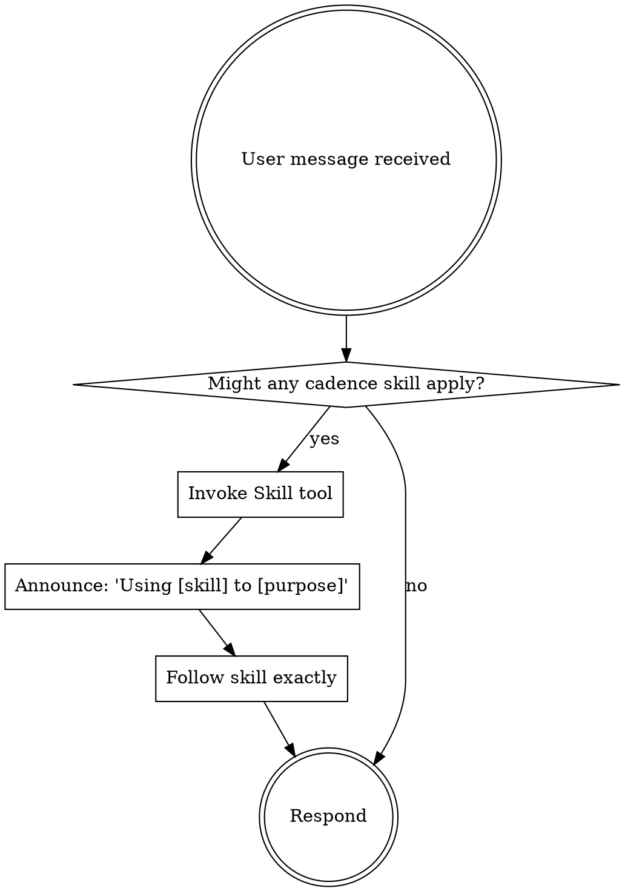

# 使用 Claude Code Subagent 和 Skills 的 AI 自动化开发方案

> 设计日期: 2026-02-24
> 版本: v1.10（修正：templates/ 子目录改为平铺文件）
> 设计目标: 基于 Claude Code 的 Skills 和 Subagent 能力，构建 AI 自动化开发系统

---

## 1. 概述

### 1.1 背景

利用 Claude Code 现有的 Skills 和 Subagent 能力，构建一套 AI 自动化开发环境，覆盖需求整理、方案设计、代码生成、单元测试等关键环节。

### 1.2 设计原则

- **基于现有能力**：利用 Claude Code 的 Skills + Subagent 模式，不自建 Agent 调度系统
- **参考 superpowers**：完全参考 superpowers 项目的标准化 Skill 模式
- **参考 superpowers:subagent-driven-development**：使用 Task 工具调度 Subagent，两阶段审查机制
- **关键节点确认**：仅在设计评审、代码审查等节点暂停人工确认
- **状态存储**：使用文件系统存储（`.claude/state/`），支持跨会话持久化
- **Plugin 形式发布**：作为 Claude Code 插件发布，通过 marketplace 安装

---

## 2. 完整目录结构（参考 superpowers）

```
cadence-skills/                    # Plugin 根目录
├── .claude-plugin/               # Plugin 配置（新增）
│   ├── plugin.json              # Plugin 元信息
│   └── marketplace.json          # Marketplace 配置
├── skills/                       # Skills 目录
│   ├── using-cadence/            # 元 Skill（核心！必须）
│   │   └── SKILL.md
│   ├── cadence-init/
│   │   ├── SKILL.md
│   │   └── setup.sh             # 脚本平铺
│   ├── cadence-requirement/
│   │   ├── SKILL.md
│   │   ├── prd-analysis.md      # 平铺
│   │   └── rule-extraction.md   # 平铺
│   ├── cadence-design/
│   │   ├── SKILL.md
│   │   ├── architecture.md      # 平铺
│   │   └── existing-code-analysis.md  # 平铺
│   ├── cadence-analyze/
│   │   ├── SKILL.md
│   │   ├── analysis.md          # 平铺
│   │   ├── scope-api.md         # 平铺
│   │   ├── scope-model.md       # 平铺
│   │   └── analyze-prompt.md    # 平铺
│   ├── cadence-code/
│   │   ├── SKILL.md
│   │   ├── code-generation.md   # 平铺
│   │   ├── frontend.md           # 平铺
│   │   ├── backend.md            # 平铺
│   │   ├── java.md               # 平铺
│   │   ├── python.md             # 平铺
│   │   ├── javascript.md         # 平铺
│   │   ├── implementer-prompt.md # 平铺
│   │   ├── spec-reviewer-prompt.md  # 平铺
│   │   └── code-reviewer-prompt.md  # 平铺
│   ├── cadence-unit-test/
│   │   ├── SKILL.md
│   │   ├── test-generation.md    # 平铺
│   │   ├── java-junit.md         # 平铺
│   │   ├── python-pytest.md       # 平铺
│   │   └── javascript-jest.md    # 平铺
│   ├── cadence-integration-test/
│   │   ├── SKILL.md
│   │   └── integration-test.md   # 平铺
│   └── cadence-workflow/
│       ├── SKILL.md
│       └── workflow-management.md  # 平铺
├── commands/                     # 命令目录
│   ├── init.md
│   ├── requirement.md
│   ├── design.md
│   ├── analyze.md
│   ├── code.md
│   ├── unittest.md
│   ├── integration.md
│   ├── approve.md
│   ├── reject.md
│   ├── status.md
│   ├── resume.md
│   └── pause.md
├── agents/                       # 独立 Agents
│   └── code-reviewer.md
├── hooks/                       # Hooks（新增）
│   ├── hooks.json              # Hook 配置
│   ├── session-start           # Session 启动 Hook
│   └── run-hook.cmd
├── docs/                        # 文档（新增）
├── lib/                         # 库
├── tests/                       # 测试
├── README.md                    # 说明文档
├── LICENSE                      # 许可证
└── .gitignore
```

---

## 3. Plugin 配置（新增）

### 3.1 plugin.json

```json
{
  "name": "cadence-skills",
  "description": "AI 自动化开发 Skills：需求分析、方案设计、代码生成、测试生成",
  "version": "1.0.0",
  "author": {
    "name": "Your Name",
    "email": "your@email.com"
  },
  "homepage": "https://github.com/yourorg/cadence-skills",
  "repository": "https://github.com/yourorg/cadence-skills",
  "license": "MIT",
  "keywords": ["skills", "ai", "automation", "development", "workflow"]
}
```

### 3.2 marketplace.json

```json
{
  "name": "cadence-skills-dev",
  "description": "Cadence Skills - AI 自动化开发环境",
  "owner": {
    "name": "Your Name",
    "email": "your@email.com"
  },
  "plugins": [
    {
      "name": "cadence-skills",
      "description": "AI 自动化开发 Skills：需求分析、方案设计、代码生成、测试生成",
      "version": "1.0.0",
      "source": "./",
      "author": {
        "name": "Your Name",
        "email": "your@email.com"
      }
    }
  ]
}
```

---

## 4. Hooks 配置（新增）

### 4.1 hooks.json

```json
{
  "hooks": {
    "SessionStart": [
      {
        "matcher": "startup|resume|clear|compact",
        "hooks": [
          {
            "type": "command",
            "command": "'${CLAUDE_PLUGIN_ROOT}/hooks/run-hook.cmd' session-start",
            "async": false
          }
        ]
      }
    ]
  }
}
```

### 4.2 session-start Hook

Session 启动时加载 Skills：

```bash
#!/usr/bin/env bash
# SessionStart hook for cadence-skills

SCRIPT_DIR="$(cd "$(dirname "${BASH_SOURCE[0]:-$0}")" && pwd)"
PLUGIN_ROOT="$(cd "${SCRIPT_DIR}/.." && pwd)"

# 加载 using-cadence skill 内容
using_cadence_content=$(cat "${PLUGIN_ROOT}/skills/using-cadence/SKILL.md" 2>&1 || echo "")

# 输出 context injection
echo '{"additional_context": "..."}'
```

---

## 5. 安装方式

### 5.1 通过 Plugin Marketplace 安装

```bash
# 添加 marketplace
/plugin marketplace add yourorg/cadence-skills-marketplace

# 安装 plugin
/plugin install cadence-skills@yourorg/cadence-skills-marketplace
```

### 5.2 验证安装

```bash
# 开始新会话
# 输入：帮我开发用户登录功能
# 应该自动触发 cadence:requirement Skill
```

---

## 6. 元 Skill：using-cadence（核心！）

参考 superpowers 的 `using-superpowers`，这是核心机制：

### 6.1 using-cadence/SKILL.md

```yaml
---
name: using-cadence
description: Use when starting any conversation - establishes how to find and use cadence skills, requiring Skill tool invocation before ANY response including clarifying questions
---

<EXTREMELY_IMPORTANT>
If you think there is even a 1% chance a cadence skill might apply to what you are doing, you ABSOLUTELY MUST invoke the skill.

IF A SKILL APPLIES TO YOUR TASK, YOU DO NOT HAVE A CHOICE. YOU MUST USE IT.
</EXTREMELY_IMPORTANT>

## How to Access Skills

**In Claude Code:** Use the `Skill` tool. When you invoke a skill, its content is loaded and presented to you—follow it directly.

# Using Cadence Skills

## The Rule

**Invoke relevant or requested skills BEFORE any response or action.**



## Trigger Patterns

自动触发关键词：
- "开发" + 功能 → cadence:requirement
- "设计方案" → cadence:design
- "生成代码" → cadence:code
- "单元测试" → cadence:unit-test
- "集成测试" → cadence:integration-test

## Commands

手动触发命令：
- `/cadence:requirement` - 需求分析
- `/cadence:design` - 方案设计
- `/cadence:analyze` - 存量分析
- `/cadence:code` - 代码生成
- `/cadence:unittest` - 单元测试
- `/cadence:integration` - 集成测试
```

---

## 7. 自动触发机制

### 7.1 触发方式

superpowers 主要通过**自然语言自动触发**，命令触发是辅助：

| 触发方式 | 说明 |
|---------|------|
| **自然语言** | 基于 Skill 描述自动匹配（如"帮我开发功能"触发 requirement） |
| **命令触发** | 显式使用 `/cadence:xxx` 命令 |

### 7.2 自动触发示例

```
用户：帮我开发一个用户登录功能
      ↓
自动触发 cadence:requirement Skill
      ↓
用户：帮我设计一下技术方案
      ↓
自动触发 cadence:design Skill

用户：/cadence:code user-login
      ↓
显式触发 cadence:code Skill
```

### 7.3 触发关键词映射

| 关键词 | 触发 Skill |
|--------|-----------|
| "开发" + 功能描述 | cadence:requirement |
| "设计方案" / "技术方案" | cadence:design |
| "分析" + 模块名 | cadence:analyze |
| "生成代码" / "写代码" | cadence:code |
| "单元测试" / "测试用例" | cadence:unit-test |
| "集成测试" / "E2E" | cadence:integration-test |

---

## 8. 命令文件示例

每个命令对应一个 `.md` 文件（参考 superpowers）：

```yaml
# commands/init.md
---
description: "初始化项目，创建目录结构、更新 .gitignore、生成存量分析报告"
disable-model-invocation: true
---

Invoke the cadence:init skill and follow it exactly as presented to you
```

```yaml
# commands/code.md
---
description: "生成业务代码，支持 --type frontend/backend 和 --lang python/java/javascript"
disable-model-invocation: true
---

Invoke the cadence:code skill and follow it exactly as presented to you
```

---

## 7. Skill 文件结构（修正）

### 3.2 SKILL.md 标准格式

```yaml
---
name: cadence-requirement
description: 分析 PRD 文档，提取结构化需求
trigger:
  commands:
    - /cadence:requirement
  patterns:
    - "开发.*功能"
    - "实现.*需求"
allowed-tools: Read, Grep, Glob, Bash, mcp__serena_*
---
# Cadence Requirement Skill

## 说明
[技能说明]

## 触发条件
[何时使用此技能]

## 输入
[需要什么输入]

## 输出
[产出什么结果]

## 人工确认点
[是否需要人工确认]

## 状态存储
[Serena Memory 操作]
```

### 3.3 命令文件示例（参考 superpowers）

每个命令对应一个 `.md` 文件，通过 `disable-model-invocation: true` 调用对应的 Skill：

```yaml
# commands/init.md
---
description: "初始化项目，创建目录结构、更新 .gitignore、生成存量分析报告"
disable-model-invocation: true
---

Invoke the cadence:init skill and follow it exactly as presented to you
```

```yaml
# commands/code.md
---
description: "生成业务代码，支持 --type frontend/backend 和 --lang python/java/javascript"
disable-model-invocation: true
---

Invoke the cadence:code skill and follow it exactly as presented to you
```

### 3.4 命令触发规则

| 命令 | 说明 | 触发方式 |
|------|------|---------|
| `/cadence:init` | 初始化项目 | 手动 |
| `/cadence:requirement [topic]` | 需求分析 | 手动/自动 |
| `/cadence:design [topic]` | 方案设计 | 手动/自动 |
| `/cadence:analyze [target]` | 存量代码分析 | 手动/自动 |
| `/cadence:code [topic]` | 代码生成 | 手动/自动 |
| `/cadence:unittest [topic]` | 单元测试 | 手动/自动 |
| `/cadence:integration [topic]` | 集成测试 | 手动/自动 |
| `/cadence:approve [phase]` | 确认阶段 | 手动 |
| `/cadence:reject [phase] [reason]` | 拒绝 | 手动 |
| `/cadence:status` | 查看当前状态 | 手动 |
| `/cadence:resume` | 恢复工作流 | 手动 |
| `/cadence:pause` | 暂停工作流 | 手动 |

### 3.4 语言参数支持

代码生成和测试生成支持通过参数指定语言：

| 参数 | 说明 | 示例 |
|------|------|------|
| `--lang` | 指定语言 | `/cadence:code user-api --lang python` |
| `--framework` | 指定框架 | `/cadence:unittest --lang java --framework spring` |

**语言自动识别：**
- 检测 `package.json` → JavaScript/TypeScript
- 检测 `requirements.txt` → Python
- 检测 `pom.xml` / `build.gradle` → Java

---

## 4. 初始化项目 Skill (cadence-init)

### 4.1 概述

在项目首次使用 Cadence Skills 时，需要进行初始化配置。

### 4.2 触发条件

- 用户输入 `/cadence:init`
- 首次使用 Cadence Skills 时自动触发

### 4.3 执行操作

```
/cadence:init
```

**初始化操作：**

1. **创建项目目录结构**
   ```
   .claude/
   ├── skills/              # 从 .skills/ 复制 Skills
   └── configs/             # 项目配置
   ```

2. **更新 .gitignore**
   ```
   # Cadence Skills 状态文件
   .claude/state/
   .claude/state/*
   .claude/**/*.lock
   ```

3. **初始化存量代码分析**（可选）
   ```
   /cadence:analyze --scope all --depth medium
   ```
   - 分析项目整体代码结构
   - 生成存量代码分析报告
   - 存储到 `.claude/analysis/`

4. **创建项目配置文件**
   ```
   .claude/config.json
   ```

### 4.4 存量分析报告

初始化后生成的分析报告：

```
.claude/
└── analysis/
    └── 2026-02-24_存量代码分析_v1.0.md
```

报告包含：
- 项目整体结构
- 模块划分
- API 接口列表
- 数据模型
- 集成点

### 4.5 输出示例

```
✓ 已创建 .claude/skills/ 目录
✓ 已更新 .gitignore
✓ 已创建 .claude/state/ 目录
✓ 已创建 .claude/config.json
✓ 已完成存量代码分析
  - 分析报告: .claude/analysis/2026-02-24_存量代码分析_v1.0.md

初始化完成！可以使用 /cadence:requirement 开始开发。
```

### 4.1 命令文件示例（参考 superpowers）

每个命令是一个 `.md` 文件，放在 `commands/` 目录：

```yaml
# commands/code.md
---
description: "生成业务代码，不包含测试。使用 cadence-code Skill。"
disable-model-invocation: true
---

Invoke the cadence:code skill and follow it exactly as presented to you
```

```yaml
# commands/unittest.md
---
description: "生成单元测试代码。使用 cadence-unit-test Skill。"
disable-model-invocation: true
---

Invoke the cadence:unit-test skill and follow it exactly as presented to you
```

### 4.2 Subagent 文件结构

参考 superpowers，Subagent 提示词模板平铺在 Skills 目录下：

```
skills/
└── cadence-code/
    ├── SKILL.md
    ├── code-generation.md   # 提示词模板
    ├── implementer-prompt.md    # 平铺
    ├── spec-reviewer-prompt.md  # 平铺
    └── code-reviewer-prompt.md  # 平铺
```

### 4.3 Subagent 调用方式

使用 Claude Code 的 Task 工具调度 Subagent：

```bash
Task tool:
  description: "实现代码生成任务"
  prompt: |
    # 来自 subagents/implementer-prompt.md 的内容
    你是一个代码实现 Agent，负责...

    任务：{task_description}

    输入：
    - 设计方案：{design_json}
    - 语言：{lang}
    - 类型：{type}

    请生成代码...
```

### 4.4 独立 Agents（参考 superpowers）

部分 Agent 可以作为独立文件放在 `agents/` 目录：

```
agents/
└── code-reviewer.md
```

```yaml
# agents/code-reviewer.md
---
name: Code Reviewer
description: 代码审查 Agent，检查代码质量
allowed-tools: Read, Grep, Bash
color: red
---

# Code Reviewer

## 职责
- 检查代码是否符合规范
- 查找潜在 bug
- 提供优化建议
```

### 4.2 Agent 标准格式

```yaml
---
name: Cadence Requirement Agent
description: 需求分析 Subagent
allowed-tools: Read, Grep, Glob, Bash, mcp__serena_*
color: blue
---
# Cadence Requirement Agent

## 职责
[Agent 职责描述]

## 工作流程
[详细工作流程]

## 输出格式
[输出格式要求]
```

---

## 5. 需求分析 Skill (cadence-requirement)

### 5.1 触发条件

- 用户输入 `/cadence:requirement`
- 用户描述需要开发的功能（自动识别）

### 5.2 输入

- PRD 文档路径
- 业务规则文档（可选）
- 项目背景知识

### 5.3 输出（结构化需求）

```json
{
  "requirement_id": "REQ-2026-001",
  "title": "功能标题",
  "business_rules": [
    {
      "rule_id": "BR-001",
      "description": "规则描述",
      "priority": "high|medium|low"
    }
  ],
  "business_flows": [...],
  "modules": [...],
  "acceptance_criteria": [...]
}
```

### 5.4 输出文档位置

```
.claude/docs/2026-02-24_需求文档_功能名称_v1.0.md
```

---

## 6. 方案设计 Skill (cadence-design)

### 6.1 触发条件

- 用户输入 `/cadence:design`
- 需求分析完成后自动触发

### 6.2 输入

- 需求分析结果（来自 Serena 状态存储）
- 设计规范文档路径（项目已有）
- 实现思路（用户输入）

### 6.3 输出（设计文档）

```json
{
  "design_id": "DES-2026-001",
  "based_on_requirement": "REQ-2026-001",
  "architecture": {...},
  "data_model": {...},
  "api_design": {...},
  "file_changes": {...}
}
```

### 6.4 输出文档位置

```
.claude/designs/2026-02-24_技术方案_功能名称_v1.0.md
```

---

## 7. 代码生成 Skill (cadence-code)

### 7.1 触发条件

- 用户输入 `/cadence:code`
- 方案设计确认后自动触发

### 7.2 输入

- 方案设计结果
- 代码规范配置
- 项目模板路径
- 类型参数（可选）：`--type frontend|backend`
- 语言参数（可选）：`--lang java|python|javascript`

### 7.3 前端/后端切换机制

代码生成 Skill 使用**类型参数 + 语言参数**双维度切换：

#### 7.3.1 参数组合

| 参数 | 选项 | 说明 |
|------|------|------|
| `--type` | `frontend` | 前端开发模式 |
| `--type` | `backend` | 后端开发模式 |
| `--lang` | `javascript` | JavaScript/TypeScript |
| `--lang` | `python` | Python |
| `--lang` | `java` | Java |

#### 7.3.2 模式矩阵

```
                    │ JavaScript/TypeScript │ Python  │ Java   │
────────────────────┼──────────────────────┼─────────┼────────┤
前端 (--type=f)     │ React/Vue/Angular    │ -       │ -      │
后端 (--type=b)     │ Node.js Express      │ FastAPI │ Spring │
```

#### 7.3.3 提示词模板结构（平铺）

```
cadence-code/
├── SKILL.md                    # 主 Skill 定义
├── code-generation.md           # 通用生成逻辑
├── frontend.md                 # 前端通用规则
├── frontend-react.md           # React 特定
├── frontend-vue.md             # Vue 特定
├── frontend-common.md          # 前端通用
├── backend.md                  # 后端通用规则
├── backend-nodejs.md           # Node.js 特定
├── backend-python.md           # Python/FastAPI 特定
├── backend-java-spring.md      # Java/Spring 特定
├── backend-common.md           # 后端通用
├── javascript.md               # JS 语言规则
├── python.md                   # Python 语言规则
├── java.md                     # Java 语言规则
├── template-frontend-react.md  # React 组件模板
├── template-frontend-vue.md    # Vue 组件模板
├── template-backend-api.md     # API 路由模板
├── template-backend-model.md   # 数据模型模板
└── template-test.md           # 测试模板
```

#### 7.3.4 自动检测

如用户未指定类型，系统自动检测：

1. **方案设计中的类型标识**
2. **项目目录结构**：
   - 存在 `src/components/` → 前端
   - 存在 `src/api/` → 后端
3. **用户描述关键词**：如"页面"、"组件" → 前端

#### 7.3.5 参数校验

为防止无效组合，添加参数校验：

| 参数组合 | 处理方式 |
|---------|---------|
| `--type frontend --lang java` | 报错：Java 不适用于前端 |
| `--type frontend --lang python` | 报错：Python 不适用于前端 |
| `--type backend --lang java` | ✓ 有效 |
| `--type frontend --lang javascript` | ✓ 有效 |
| `--lang python`（未指定 type） | 自动检测或提示选择 |

**校验失败提示示例：**
```
错误：--type frontend 与 --lang java 不兼容
前端开发仅支持 JavaScript/TypeScript
```

### 7.4 输出

- **仅生成业务代码**，不包含测试
- Git 提交（可选）

### 7.5 输出位置

```
# 前端 (--type frontend)
src/
├── components/
├── pages/
├── hooks/
└── ...

# 后端 (--type backend)
src/
├── controllers/
├── services/
├── models/
└── ...
```

### 7.6 使用示例

```bash
# 前端 React 组件
/cadence:code user-dashboard --type frontend --lang javascript

# 后端 Python API
/cadence:code user-api --type backend --lang python

# 后端 Java Spring
/cadence:code order-service --type backend --lang java
```

---

## 8. 测试生成 Skills（拆分：单元测试 + 集成测试）

根据 superpowers 的"单一职责"原则，将测试拆分为两个独立的 Skills：

### 8.1 单元测试 Skill (cadence-unit-test)

#### 8.1.1 触发条件

- 用户输入 `/cadence:unittest`
- 代码生成后自动触发

#### 8.1.2 输入

- 需求分析结果
- 方案设计结果
- 代码文件
- 语言参数（可选）：`--lang java|python|javascript`

#### 8.1.3 语言支持

单元测试支持以下语言和框架：

| 语言 | 测试框架 | 提示词模板 | 优先级 |
|------|---------|-----------|--------|
| JavaScript/TypeScript | Jest/Vitest | javascript-jest.md | 最高 |
| Python | pytest | python-pytest.md | 最高 |
| Java | JUnit/TestNG | java-junit.md | 最高 |
| 其他语言 | ... | 后续扩展 | 低 |

#### 8.1.4 输出

- 单元测试用例文件
- 测试覆盖报告

---

### 8.2 集成测试 Skill (cadence-integration-test)

#### 8.2.1 触发条件

- 用户输入 `/cadence:integration`
- 方案设计确认后触发

#### 8.2.2 输入

- 需求分析结果
- 方案设计结果（包含 API 设计、数据模型）
- 测试环境配置

#### 8.2.3 输出

- 集成测试用例
- API 测试脚本
- E2E 测试脚本（如需要）

---

### 8.3 测试命令汇总

| 命令 | 说明 | 适用阶段 |
|------|------|---------|
| `/cadence:unittest [topic]` | 单元测试 | 代码生成后 |
| `/cadence:unittest --lang python` | 指定语言 | 代码生成后 |
| `/cadence:integration [topic]` | 集成测试 | 方案设计后 |

---

## 9. 状态存储（文件系统持久化）

### 9.1 存储位置

使用文件系统存储，支持跨会话持久化：

```
.claude/
└── state/
    ├── workflows/              # 工作流状态
    │   └── {workflow_id}.json
    ├── context/                # 上下文缓存
    │   └── {workflow_id}/
    └── locks/                  # 锁文件（防止并发冲突）
        └── {workflow_id}.lock
```

### 9.2 状态结构

```json
{
  "workflow_id": "WF-2026-001",
  "created_at": "2026-02-24T10:00:00Z",
  "updated_at": "2026-02-24T14:30:00Z",
  "current_phase": "requirement|design|code|unit-test|integration-test",
  "status": "in_progress|paused|completed|error",
  "context": {
    "requirement": {
      "requirement_id": "REQ-2026-001",
      "title": "用户登录功能",
      "status": "pending|approved|rejected",
      "doc_path": ".claude/docs/2026-02-24_需求文档_用户登录_v1.0.md"
    },
    "design": {
      "design_id": "DES-2026-001",
      "status": "pending|approved|rejected",
      "doc_path": ".claude/designs/2026-02-24_技术方案_用户登录_v1.0.md"
    },
    "code": {
      "files": ["src/auth/login.ts", "src/auth/service.ts"],
      "status": "pending|approved|rejected"
    },
    "unit_test": { "status": "pending|in_progress|completed" },
    "integration_test": { "status": "pending|in_progress|completed" }
  },
  "pending_confirmations": [
    { "phase": "requirement", "status": "pending", "message": "等待确认" }
  ],
  "metadata": {
    "user": "user_id",
    "project": "project_id",
    "language": "python",
    "frontend_type": "react"  // 如适用
  }
}
```

### 9.3 持久化机制

| 场景 | 操作 | 文件 |
|------|------|------|
| 创建工作流 | 写入 | `state/workflows/{workflow_id}.json` |
| 更新状态 | 写入 | `state/workflows/{workflow_id}.json` |
| 保存上下文 | 写入 | `state/context/{workflow_id}/requirement.json` |
| 恢复工作流 | 读取 | `state/workflows/{workflow_id}.json` |
| 并发控制 | 锁文件 | `state/locks/{workflow_id}.lock` |

### 9.4 恢复工作流

使用 `/cadence:resume` 命令恢复：

```
/cadence:resume                    # 恢复最近的工作流
/cadence:resume WF-2026-001       # 恢复指定工作流
```

恢复流程：
1. 读取 `state/workflows/{workflow_id}.json`
2. 加载上下文到当前会话
3. 继续执行当前阶段

### 9.5 状态存储设计

#### 9.5.1 为什么使用文件系统而非 Serena MCP

| 因素 | 文件系统 `.claude/state/` | Serena MCP |
|------|------------------------|------------|
| **写入频率** | 高（每个阶段多次更新） | ❌ 不适合高频 |
| **多 Subagent 并发** | 可用文件锁控制 | ❌ 有竞争风险 |
| **Token 开销** | 零额外成本 | 每次读写都要 token |
| **实现复杂度** | 简单（Read/Write 文件） | 需要 MCP 调用 |

**结论**：工作流状态使用文件系统，Serena MCP 仅用于元数据和记忆。

#### 9.5.2 存储位置

```
.claude/state/                    # 项目内状态目录
├── workflows/
│   └── {workflow_id}.json    # 工作流状态
├── context/
│   └── {workflow_id}/        # 上下文数据
│       ├── requirement.json
│       ├── design.json
│       └── code.json
└── locks/
    └── {workflow_id}.lock    # 锁文件（24h 超时）
```

#### 9.5.3 Serena MCP 用途

Serena MCP 仅存储**元数据**和**记忆**（低频操作）：

- `cadence-workflow-index` - 工作流索引列表
- `cadence-project-{id}` - 项目配置记忆
- `cadence-session-{id}` - 会话上下文

#### 9.5.4 锁机制

- **创建锁**：开始工作时创建 `.claude/state/locks/{workflow_id}.lock`
- **删除锁**：工作完成后删除
- **超时机制**：锁文件包含创建时间，超过 24 小时自动失效
- **检查锁**：恢复工作流前检查锁是否存在及是否超时

### 9.6 工作流暂停与恢复

#### 9.6.1 暂停 (/cadence:pause)

```
/cadence:pause [workflow_id]
```

**执行操作：**
1. 保存工作流状态 → `.claude/state/workflows/{workflow_id}.json`
2. 保存上下文 → `.claude/state/context/{workflow_id}/`
   - `requirement.json` - 需求分析结果
   - `design.json` - 方案设计结果
   - `code.json` - 代码生成结果
3. 更新状态为 paused → `"status": "paused"`
4. 创建锁文件 → `.claude/state/locks/{workflow_id}.lock`（带时间戳）

#### 9.6.2 恢复 (/cadence:resume)

```
/cadence:resume                    # 恢复最近的工作流
/cadence:resume WF-2026-001       # 恢复指定工作流
```

**恢复流程：**
1. 读取状态文件
2. 加载所有上下文到当前会话
3. 继续执行当前阶段
4. 删除锁文件

#### 9.6.3 使用场景

```
第一天：
用户：帮我开发用户登录功能
→ /cadence:requirement 用户登录
→ /cadence:design
→ /cadence:code user-api --type backend --lang python
（到这里要下班了）

用户：/cadence:pause
→ ✓ 已保存状态到 .claude/state/

第二天：
用户：/cadence:resume
→ ✓ 已恢复状态，继续执行
→ /cadence:unittest
→ /cadence:approve code
```

### 9.7 人工确认流程（交互形式）

通过交互形式进入下一阶段，用户反馈决定流程走向：

```
┌──────────────┐
│ 需求分析完成  │
└──────┬───────┘
       │
       ▼
┌──────────────────────────────┐
│ 展示需求分析结果               │
│ 询问："需求分析完成，有问题吗？" │
└──────────────────────────────┘
       │
       ├── 用户反馈"没问题" ──▶ 进入下一阶段（方案设计）
       │
       ├── 用户反馈"有问题" ──▶ 重新进行需求分析
       │                           │
       │                           ▼
       │                   重新输出需求分析
       │                           │
       │                           ▼
       │                   再次询问"有问题吗？"
       │
       └── 用户使用 /cadence:approve requirement

（方案设计、代码生成流程同理）
```

#### 9.7.1 确认命令（辅助）

除交互形式外，也支持命令确认：

- `/cadence:approve requirement` - 确认需求
- `/cadence:approve design` - 确认方案
- `/cadence:approve code` - 确认代码
- `/cadence:reject <reason>` - 拒绝并说明原因

#### 9.7.2 交互流程示例

```
Cadence：需求分析完成。主要内容包括：
- 业务规则：3 条
- 业务流程：2 个
- 模块划分：用户模块、收藏模块
有问题吗？

用户：没有，方案设计吧

Cadence：好的，进入方案设计阶段...

[方案设计完成后]

Cadence：方案设计完成。主要内容包括：
- 技术选型：Spring Boot + MySQL
- API 设计：5 个接口
- 数据模型：新增 Favorite 表
有问题吗？

用户：API 设计那部分，第3个接口的参数不太合理

Cadence：好的，我来重新设计第3个接口...

[重新设计后]

Cadence：已重新设计第3个接口，改为：
- 新参数：startDate, endDate（时间范围）
- 移除：pageSize, pageNum（改为默认分页）
有问题吗？

用户：这样没问题了，继续吧

Cadence：好的，进入代码生成阶段...
```

---

## 10. 存量代码分析 Skill (cadence-analyze)

### 10.1 概述

存量代码分析作为独立的 Skill，可以单独使用，也可以在方案设计阶段自动调用。

### 10.2 触发条件

**手动触发：**
- `/cadence:analyze user-service` - 分析用户服务相关代码
- `/cadence:analyze --scope api` - 分析 API 层代码
- `/cadence:analyze --depth deep` - 深度分析

**自动触发：**
- 方案设计阶段
- 模块类型为 `existing`（存量功能）
- 需要与现有系统集成

### 10.3 命令参数

| 参数 | 说明 | 示例 |
|------|------|------|
| `target` | 分析目标（模块/功能名） | `/cadence:analyze order` |
| `--scope` | 分析范围 | `--scope api\|model\|service\|all` |
| `--depth` | 分析深度 | `--depth shallow\|medium\|deep` |
| `--format` | 输出格式 | `--format json\|markdown` |

### 10.4 分析深度

| 深度 | 说明 | 耗时 | 适用场景 |
|------|------|------|---------|
| `shallow` | 快速扫描，获取文件列表和结构 | < 30s | 初步了解 |
| `medium` | 分析调用关系、API 接口、数据模型 | 1-3 min | 常规设计 |
| `deep` | 完整分析，包括业务逻辑、边界条件 | 5-10 min | 复杂存量改造 |

### 10.5 分析流程

```
用户输入 /cadence:analyze user-service
         │
         ▼
┌───────────────────┐
│ 1. 代码定位       │
│ • 搜索相关文件    │
│ • 识别模块边界    │
└───────────────────┘
         │
         ▼
┌───────────────────┐
│ 2. 结构分析       │
│ • Context7 MCP   │
│   - 代码概览      │
│   - 依赖关系      │
└───────────────────┘
         │
         ▼
┌───────────────────┐
│ 3. 符号分析       │
│ • Serena MCP     │
│   - 函数定义      │
│   - 类结构        │
│   - 接口签名      │
└───────────────────┘
         │
         ▼
┌───────────────────┐
│ 4. 集成点分析    │
│ • API 接口       │
│ • 数据模型       │
│ • 事件/消息      │
└───────────────────┘
         │
         ▼
┌───────────────────┐
│ 5. 输出分析报告   │
└───────────────────┘
```

### 10.6 工具选择策略

| 分析目标 | 工具 | 用途 |
|---------|------|------|
| 代码结构理解 | Context7 MCP | 获取代码概览、依赖关系 |
| 符号定位 | Serena MCP | 查找函数、类定义 |
| API 分析 | Context7 MCP | 理解接口调用方式 |
| 数据模型 | Serena MCP | 查找数据库模型定义 |

### 10.7 Skill 文件结构（平铺）

```
cadence-analyze/
├── SKILL.md
├── analysis.md                # 通用分析逻辑
├── scope-api.md              # API 层分析
├── scope-model.md            # 数据模型分析
├── scope-service.md          # 服务层分析
├── depth-shallow.md          # 浅度分析模板
└── agents/
    └── cadence-analyze-agent.md
```

### 10.8 输出格式

```json
{
  "analysis_id": "ANA-2026-001",
  "target": "user-service",
  "scope": "all",
  "depth": "medium",
  "results": {
    "overview": {
      "files": ["src/user/*.ts"],
      "lines": 2500,
      "dependencies": ["auth-service", "database"]
    },
    "apis": [
      {
        "path": "/api/users",
        "method": "GET",
        "handler": "UserController.getUsers"
      }
    ],
    "models": [
      {
        "name": "User",
        "fields": ["id", "name", "email"],
        "relations": ["Order"]
      }
    ],
    "integration_points": [
      {
        "type": "api",
        "target": "auth-service",
        "calls": ["validateToken"]
      }
    ]
  },
  "recommendations": [
    "建议使用现有的 UserService，避免重复定义",
    "新功能应调用现有 /api/users 接口"
  ]
}
```

### 10.9 与方案设计集成

#### 10.9.1 初始化阶段分析

项目初始化时进行全面的存量代码分析：

```
/cadence:init
    │
    ▼
/cadence:analyze --scope all --depth medium
    │
    ▼
生成分析报告 → .claude/analysis/2026-02-24_存量代码分析_v1.0.md
```

#### 10.9.2 方案设计阶段分析

当进行新需求的方案设计时：

```
需求：开发"用户收藏商品"功能
    │
    ▼
检测是否涉及存量代码
    │
    ├─ 是 → 加载存量分析报告
    │       │
    │       ▼
    │   分析涉及哪些存量模块
    │       │
    │       ▼
    │   如需更详细分析，运行 /cadence:analyze <target> --depth deep
    │       │
    │       ▼
    │   结合存量分析报告设计技术方案
    │
    └─ 否 → 按全新功能设计
```

#### 10.9.3 方案设计 Skill 中的集成

在 cadence-design SKILL.md 中：

```markdown
## 存量代码分析

1. 加载已有分析报告：.claude/analysis/存量代码分析_v*.md
2. 识别需求涉及的存量模块
3. 如需要更详细信息，提示用户运行：
   - /cadence:analyze <module> --depth deep
4. 在技术方案中包含：
   - 存量集成点
   - 改造建议
   - 注意事项
```

### 10.10 降级策略

当存量分析失败时的处理：

| 失败原因 | 降级策略 |
|---------|---------|
| Context7 无法访问 | 使用 Serena MCP 符号搜索 |
| Serena 未索引 | 提示用户手动提供代码位置 |
| 分析超时 | 返回浅度分析结果 |
| 权限不足 | 提示用户检查权限 |

---

## 11. 文档输出规范

按 CLAUDE.md 规范存储：

```
.claude/
├── docs/                    # 需求文档
│   └── 2026-02-24_需求文档_功能名称_v1.0.md
├── designs/                 # 方案设计
│   └── 2026-02-24_技术方案_功能名称_v1.0.md
├── notes/                   # 临时记录
│   └── 2026-02-24_开发日志_功能名称.md
└── test/                   # 测试用例
    └── 2026-02-24_测试用例_功能名称_v1.0.md
```

---

## 12. 实施计划

### 12.1 阶段划分

| 阶段 | 目标 | 内容 | 周期 |
|------|------|------|------|
| **第一阶段** | 初始化 Skill | cadence-init + 参数校验 + 命令触发框架 | 1 周 |
| **第二阶段** | 需求+方案 Skill | cadence-requirement、cadence-design | 1-2 周 |
| **第三阶段** | 存量分析 Skill | cadence-analyze + Context7/Serena 集成 | 1 周 |
| **第四阶段** | 代码生成 Skill | cadence-code + 前端/后端 + 多语言 + Subagent | 1-2 周 |
| **第五阶段** | 单元测试 Skill | cadence-unit-test + JS/Python/Java | 1-2 周 |
| **第六阶段** | 集成测试 Skill | cadence-integration-test | 1 周 |
| **第七阶段** | 整合优化 | 交互确认流程、/resume 恢复、全流程测试 | 1 周 |

### 12.2 实施顺序

```
阶段一：框架搭建
├── 创建 .claude/skills/ 目录结构
├── 创建 .claude/agents/ 目录结构
├── 创建 .claude/state/ 状态存储目录
├── 定义命令触发规则
└── 配置状态持久化机制

阶段二：需求+方案 Skill
├── cadence-requirement SKILL.md
├── cadence-requirement-agent.md
├── cadence-design SKILL.md
├── cadence-design-agent.md
└── 与状态存储集成

阶段三：存量代码分析 Skill（新增）
├── cadence-analyze SKILL.md
├── cadence-analyze-agent.md
├── analysis.md                  # 通用分析逻辑
├── scope-api.md                 # API 层分析
├── scope-model.md               # 数据模型分析
└── Context7 + Serena MCP 集成

阶段四：代码生成 Skill
├── cadence-code SKILL.md
├── cadence-code-agent.md
├── frontend.md                  # 前端规则
├── backend.md                   # 后端规则
├── java.md                      # Java 规则
├── python.md                    # Python 规则
└── javascript.md                # JS 规则

阶段五：单元测试 Skill
├── cadence-unit-test SKILL.md
├── cadence-unit-test-agent.md
├── javascript-jest.md           # 最高优先级
├── python-pytest.md             # 最高优先级
├── java-junit.md                # 最高优先级
└── 测试执行逻辑

阶段六：集成测试 Skill
├── cadence-integration-test SKILL.md
├── cadence-integration-test-agent.md
├── integration-test.md          # 集成测试逻辑
└── API/E2E 测试逻辑

阶段七：整合优化
├── 命令触发配置
├── 人工确认流程
├── /cadence:resume 恢复机制
└── 全流程测试
```

### 12.3 语言支持优先级

| 优先级 | 语言 | 测试框架 | 实施顺序 |
|--------|------|---------|---------|
| 1 | JavaScript/TypeScript | Jest/Vitest | 阶段四第一批 |
| 2 | Python | pytest | 阶段四第一批 |
| 3 | Java | JUnit/TestNG | 阶段四第一批 |
| 4+ | 其他语言 | 后续扩展 | 后续迭代 |

---

## 13. 风险评估与应对

### 13.1 风险清单

| 风险 | 影响 | 应对措施 |
|------|------|---------|
| **存量代码分析复杂度** | 高 | 使用 Context7 + Serena MCP，先在简单模块验证 |
| **Claude Code 调用限制** | 中 | 控制 Subagent 并发数量，分批处理 |
| **状态存储一致性** | 中 | 锁文件防止并发，失败回滚 |
| **文档格式统一** | 低 | 定义严格模板，自动化校验 |
| **Skill 触发冲突** | 低 | 定义优先级，手动命令优先 |
| **跨会话持久化** | 中 | 定期保存，检查点机制 |

### 13.2 质量保障

- **代码生成**：仅生成业务代码，两阶段审查（Spec + Code Review）
- **测试覆盖**：Subagent 完成后自测验证
- **人工确认**：关键节点必须确认才能继续
- **版本管理**：所有输出文档使用 Git 管理
- **持久化**：使用 `/cadence:pause` 保存状态，`/cadence:resume` 恢复

---

## 14. Subagent 驱动开发模式

### 14.1 参考 superpowers:subagent-driven-development

参考 superpowers 项目的 subagent-driven-development 模式，每个任务使用独立的 Subagent 执行：

### 14.2 两阶段审查机制

每个 Subagent 完成后进行两阶段审查：

```
┌─────────────────────────────────────────────────────────────┐
│                    Subagent 执行流程                          │
└─────────────────────────────────────────────────────────────┘

  1. 调度 Implementer Subagent
           │
           ▼
  ┌─────────────────┐
  │ Subagent 执行   │ ← Task 工具调用
  │ • 实现任务      │
  │ • 自我审查      │
  └─────────────────┘
           │
           ▼
  ┌─────────────────┐
  │ Spec Review     │ ← 规范合规性审查
  │ • 需求是否满足  │
  │ • 是否有遗漏    │
  └─────────────────┘
           │ 通过
           ▼ 不通过
     ┌─────┴─────┐
     │ 修复      │ ──▶ 重新审查
     └───────────┘
           │ 通过
           ▼
  ┌─────────────────┐
  │ Code Review     │ ← 代码质量审查
  │ • 风格一致      │
  │ • 安全性        │
  └─────────────────┘
           │ 通过
           ▼
     ┌─────┴─────┐
     │ 标记完成   │
     └───────────┘
```

### 14.3 Subagent 提示词模板

参考 superpowers 的提示词结构：

```yaml
# agents/cadence-code-agent.md
---
name: Cadence Code Agent
description: 代码生成 Subagent
allowed-tools: Read, Edit, Write, Bash
color: green
---

# Cadence Code Agent

## 任务
根据设计方案生成业务代码。

## 输入
- 设计方案 JSON
- 语言参数 (--lang)
- 类型参数 (--type)

## 工作流程
1. 读取设计方案
2. 生成业务代码（不含测试）
3. 自我审查代码质量
4. 报告完成

## 输出格式
{
  "files": [...],
  "review": "self-review 结果"
}
```

### 14.4 状态持久化与恢复

参考 superpowers:subagent-driven-development，使用文件系统存储状态：

- 工作流暂停时保存完整上下文
- 使用 `/cadence:resume` 恢复
- Subagent 失败时重新调度（不手动修复，避免上下文污染）

---

## 15. 总结

本方案的核心要点：

1. **完整架构**（完全参考 superpowers）：
   - `.claude-plugin/` - Plugin 配置
   - `skills/` - Skills 目录（含 using-cadence 元 Skill）
   - `commands/` - 命令目录
   - `agents/` - 独立 Agents
   - `hooks/` - Hooks 配置
   - `docs/` - 文档
2. **核心机制**：using-cadence SKILL.md 是元 Skill，通过 session-start hook 加载
3. **目录平铺**：prompts 和 subagents 内容平铺在 Skill 目录下，不是子目录
4. **双重触发**：
   - 自然语言自动触发（Skill 描述匹配）
   - 命令触发（/cadence:xxx）
5. **Subagent 模式**：使用 Task 工具调度
6. **命令列表**：
   - `/cadence:init` - 初始化项目
   - `/cadence:requirement` - 需求分析
   - `/cadence:design` - 方案设计
   - `/cadence:analyze` - 存量代码分析
   - `/cadence:code` - 代码生成（支持前端/后端 + 语言切换）
   - `/cadence:unittest` - 单元测试
   - `/cadence:integration` - 集成测试
   - `/cadence:approve` - 确认
   - `/cadence:reject` - 拒绝
   - `/cadence:status` - 状态查看
   - `/cadence:resume` - 工作流恢复
   - `/cadence:pause` - 工作流暂停
6. **初始化项目**：`/cadence:init` 创建目录、更新 .gitignore、生成存量分析报告
7. **参数校验**：无效参数组合（如 frontend + java）报错提示
8. **交互确认**：通过交互形式确认，有问题则重新处理
9. **状态存储**：文件系统 `.claude/state/`，支持跨会话持久化
10. **前端/后端切换**：类型参数 + 语言参数双维度
11. **代码生成**：仅生成业务代码，不含测试
12. **测试拆分**：单元测试 + 集成测试
13. **多语言支持**：JS、Python、Java 均为最高优先级
14. **存量分析**：初始化时全面分析 + 方案设计时按需分析
