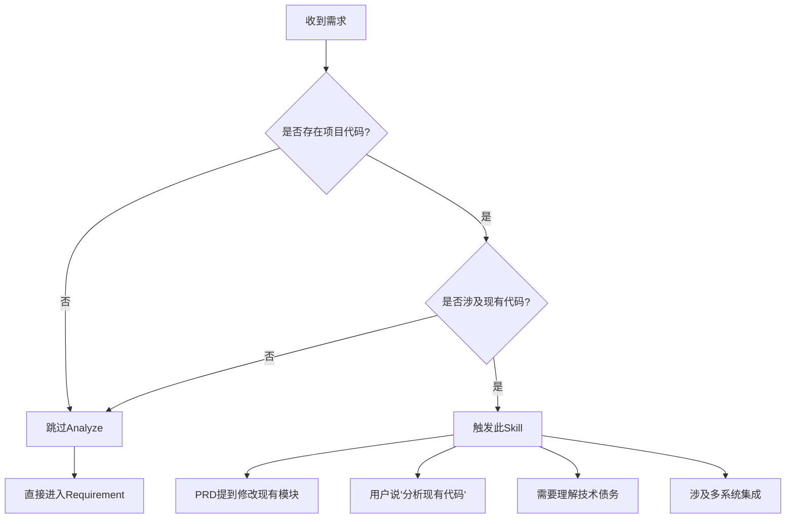
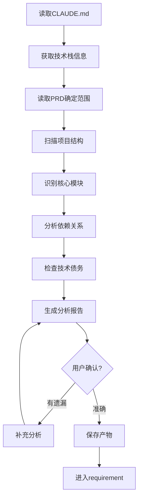

# Analyze - 存量分析

## Overview

在需求设计和方案设计之前，分析存量代码，理解现有架构和依赖关系。这是**需求分析的先决条件**。

## When to Use

### 前置条件
- ✅ 存在可分析的项目结构（非全新项目）
- ✅ 项目包含代码文件（非纯文档项目）
- ✅ 已读取 CLAUDE.md 了解技术栈

### 触发条件
当：
- 用户说"分析现有代码..."
- 用户说"理解一下当前架构..."
- PRD 涉及现有系统修改
- 需要了解技术债务

### 判断流程



## The Process

### 详细流程



### 步骤说明

0. **读取 CLAUDE.md** ⭐
   - 获取项目编程语言
   - 获取框架和库信息
   - 获取架构风格
   - 获取构建工具

1. **读取 PRD 确定范围**
   - 了解要做什么功能
   - 确定需要分析的模块范围
   - 识别可能涉及的文件

2. **扫描项目结构**
   - 使用 Serena MCP 的 list_dir 扫描目录
   - 使用 get_symbols_overview 获取符号概览
   - 记录关键文件和目录

3. **识别核心模块**
   - 找到需要修改的核心文件
   - 识别模块边界和职责
   - 记录模块功能说明

4. **分析依赖关系**
   - 使用 find_referencing_symbols 分析调用链
   - 识别上游依赖（被谁调用）
   - 识别下游依赖（调用谁）

5. **检查技术债务**
   - 识别代码异味
   - 识别过时依赖
   - 识别性能瓶颈
   - 识别安全风险

6. **生成分析报告**
   - 包含架构图
   - 包含依赖图
   - 包含风险提示

7. **用户确认**
   - 确保分析准确无遗漏

### 工具使用

**Serena MCP**:
- `list_dir` - 扫描项目结构
- `get_symbols_overview` - 获取文件符号概览
- `find_referencing_symbols` - 分析依赖关系
- `search_for_pattern` - 搜索特定模式

**项目上下文获取**:
- 读取 `CLAUDE.md` - 获取技术栈、架构信息
- 读取项目配置文件（package.json/requirements.txt 等）- 辅助验证

## 输入来源
1. **CLAUDE.md**：获取技术栈和项目信息（必须）
2. **PRD 文档**：了解要做什么功能（来自 brainstorm）
3. **用户指定**：用户指定要分析的模块或文件
4. **项目结构**：自动扫描项目目录结构

## 动态时间预估

| 复杂度 | 时间范围 | 说明 |
|-------|---------|------|
| 🟢 简单 | 10-20分钟 | 单一模块，无复杂依赖 |
| 🟡 中等 | 20-40分钟 | 多模块，少量外部依赖 |
| 🔴 复杂 | 40-80分钟 | 多系统交互，大量存量代码 |

## 输出产物

**文件：** `.claude/docs/{date}_存量分析_{模块名称}_v1.0.md`

**内容结构：**
```markdown
# 存量分析报告

## 1. 技术栈概览
- 编程语言：[从 CLAUDE.md 读取]
- 框架和库：[从 CLAUDE.md 读取]
- 架构风格：[从 CLAUDE.md 读取]
- 构建工具：[从 CLAUDE.md 读取]

## 2. 架构概览
[架构描述和架构图]

## 3. 核心模块
[需要修改的核心模块清单]

## 4. 依赖关系
[模块间依赖关系图]

## 5. 接口清单
[需要适配的接口列表]

## 6. 技术约束
[技术债务和限制]

## 7. 风险提示
[潜在风险点]
```

## 关键检查清单 ✅

- [ ] CLAUDE.md：是否已读取并理解技术栈？
- [ ] 架构概览：是否清晰描述了现有系统架构？
- [ ] 核心模块：是否识别了需要修改的核心模块？
- [ ] 依赖关系：是否分析了模块间的依赖关系？
- [ ] 接口清单：是否列出了需要适配的接口？
- [ ] 技术约束：是否识别了技术债务和限制？
- [ ] 风险提示：是否标注了潜在风险点？

## Red Flags ⚠️

| 错误做法 | 正确做法 |
|---------|---------|
| ❌ 跳过 Analyze 直接做 Design | ✅ 必须先理解现有代码再做设计 |
| ❌ 只分析表面代码，忽略深层依赖 | ✅ 需要深入理解数据流和调用链 |
| ❌ 在未完全理解存量时强行设计 | ✅ 有疑问时及时与用户确认 |
| ❌ 忽略 CLAUDE.md 中的技术栈信息 | ✅ 必须先读取 CLAUDE.md 了解项目上下文 |

## Integration

- **前置**: cadence-brainstorm（可选：全流程时）
- **下一步**: cadence-requirement（需求分析）
- **替代**: 全新项目或独立模块可跳过此节点
- **需要**: CLAUDE.md（技术栈）、PRD 文档（分析范围）

## 确认机制

生成存量分析后：
展示技术栈信息
展示关键发现（3-5 个）
展示需要改动的文件清单
展示技术约束和风险提示

询问："分析是否准确？有没有遗漏？"
├── ✅ 准确 → 保存产物，进入 requirement
├── ⚠️ 有遗漏 → 补充分析
└── ❌ 不对 → 重新分析

## 跳过条件
- 全新项目（无存量代码）
- 独立模块（不涉及现有代码）
- 纯文档项目（无代码文件）
- 用户明确表示不需要
