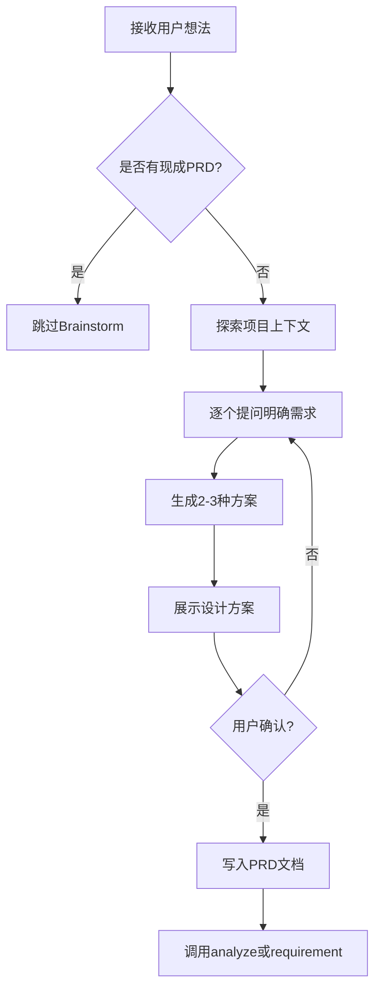

# Brainstorm - 需求探索

## Overview

通过对话式探索，帮助用户明确需求，生成PRD文档。

## When to Use

### 触发条件
当用户说：
- "我想做个..."
- "可能需要..."
- "能不能做一个..."
- 需求不明确的功能

### 判断流程

```mermaid
graph TD
    A[用户提出想法] --> B{需求是否明确?}
    B -->|是| C[跳过Brainstorm]
    B -->|否| D[触发此Skill]

    D --> D1[用户说"想做个..."]
    D --> D2[用户说"可能需要..."]
    D --> D3[用户说"能不能做..."]
    D --> D4[用户说"我要开发..."]
```

## The Process

### 详细流程



### 步骤说明
1. **探索项目上下文** - 查看现有文件、文档、最近提交
2. **逐个提问** - 一次只问一个问题，明确目的/约束/成功标准
3. **提出2-3种方案** - 包含权衡和你的推荐
4. **展示设计方案** - 分阶段展示，获得用户确认
5. **写入PRD文档** - 保存到 `.claude/docs/`
6. **进入下一阶段** - 根据情况调用analyze或requirement

## 输入来源
1. 用户对话：用户描述想做什么功能
2. 已有文档：如果已有 PRD，则跳过此节点
3. 无输入：全新项目，从零开始探索

## 动态时间预估

| 复杂度 | 时间范围 | 说明 |
|-------|---------|------|
| 🟢 简单 | 10-15分钟 | 需求较明确，对话轮数少 |
| 🟡 中等 | 15-30分钟 | 需求较复杂，需要多轮对话 |
| 🔴 复杂 | 30-60分钟 | 需求不明确，需要深入探索 |

## 关键检查清单 ✅

- [ ] 核心功能：是否清晰描述了要解决的核心问题？
- [ ] 用户故事：是否包含主要用户故事（3-5条）？
- [ ] 验收标准：是否包含可验证的验收标准？
- [ ] 边界条件：是否识别了主要边界条件和异常场景？
- [ ] 依赖说明：是否说明了与现有系统的关系？
- [ ] 优先级：是否区分了核心功能和扩展功能？

## Red Flags ⚠️

| 错误做法 | 正确做法 |
|---------|---------|
| ❌ 只记录功能点，忽略用户故事 | ✅ 优先理解用户想要完成的任务 |
| ❌ 跳过验收标准，直接进入设计 | ✅ 必须有可验证的验收标准 |
| ❌ 在需求不明确时强行进入下一阶段 | ✅ 需求明确后才能确认 |
| ❌ 不探索项目上下文就开始设计 | ✅ 先了解现有代码和架构 |

## Integration

- **下一步**: cadence-analyze（如果需要存量分析）或 cadence-requirement
- **替代**: 如果已有PRD，直接进入需求分析
- **需要**: 项目上下文（通过Serena读取）

## 输出产物

**文件：** `.claude/docs/{date}_PRD_{功能名称}_v1.0.md`

## 确认机制

生成 PRD 后：
展示需求要点（3-5 条核心需求）
询问："这是您想实现的功能吗？"
├── ✅ 是 → 保存产物，进入 analyze
├── ⚠️ 需要调整 → 继续对话，调整需求
└── ❌ 不是 → 重新开始 brainstorm

## 跳过条件
- 已存在 PRD 或需求文档
- 用户明确表示不需要
