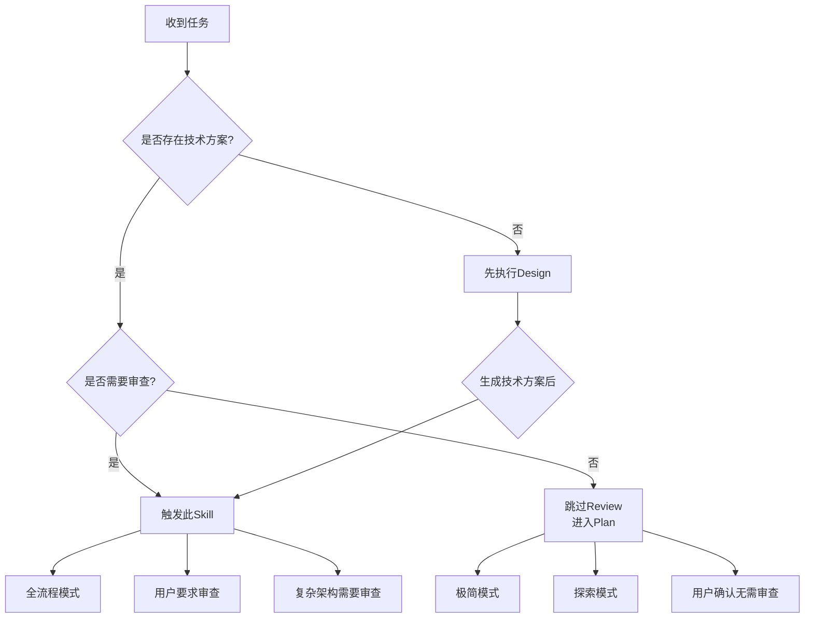
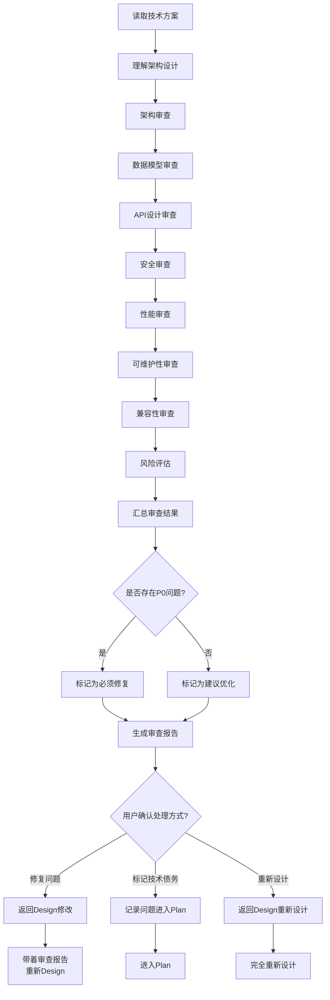
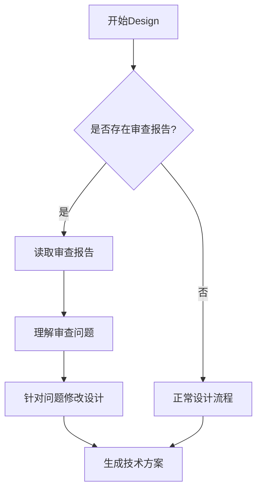

# Design Review - 设计审查

## Overview

对技术方案进行系统性审查，确保方案的可行性、完整性、安全性。审查包含 8 个维度（架构、数据模型、API、安全、性能、可维护性、兼容性、风险），分为 P0/P1/P2 三个优先级。Design Review 只生成审查报告，不生成修复后的技术方案。发现问题时返回 Design 节点修改。

## When to Use

### 前置条件
- ✅ 已存在技术方案文档（来自 Design 或用户已有文档）

### 触发条件

**必须进行 Design Review 的情况：**
1. 全流程模式下必须进行
2. 用户明确要求进行审查

**可以跳过 Design Review 的情况：**
1. 已有技术方案文档，用户确认无需审查
2. 极简模式下（简单功能）
3. 探索模式下（原型开发）
4. 用户明确表示不需要

### 判断流程



### 流程模式说明

| 流程模式 | 是否需要 Design Review | 说明 |
|---------|---------------------|------|
| **全流程模式** | ✅ 必须 | 标准完整流程，必须审查 |
| **极简模式** | ❌ 跳过 | 简单功能，快速实现 |
| **探索模式** | ❌ 跳过 | 原型开发，快速验证 |
| **用户指定** | ✅ 必须 | 用户明确要求审查 |

## The Process

### 详细流程



### 步骤说明

1. **读取技术方案** ⭐
   - 读取 Design 阶段生成的技术方案
   - 或读取用户提供的已有技术方案
   - 理解架构设计、数据模型、API 设计等

2. **架构审查**（P0）
   - 检查分层是否合理
   - 检查模块职责是否清晰
   - 检查依赖关系是否正确
   - 检查设计模式是否合适
   - 检查是否符合项目规范（CLAUDE.md）

3. **数据模型审查**（P0）
   - 检查表结构设计是否合理
   - 检查索引设计是否完整
   - 检查约束设计是否正确
   - 检查 ER 图是否清晰
   - 检查是否有数据冗余
   - 检查分库分表策略（如需要）

4. **API 设计审查**（P0）
   - 检查是否符合 RESTful 规范
   - 检查接口幂等性
   - 检查版本控制策略
   - 检查请求/响应格式
   - 检查错误码设计

5. **安全审查**（P0）
   - 检查权限验证机制
   - 检查注入防护（SQL、XSS、命令注入）
   - 检查数据加密（传输、存储）
   - 检查敏感数据处理
   - 检查认证授权流程

6. **性能审查**（P1）
   - 检查 N+1 查询问题
   - 检查缓存策略
   - 检查索引优化
   - 检查数据库查询优化
   - 检查接口性能

7. **可维护性审查**（P1）
   - 检查代码规范
   - 检查文档完整性
   - 检查测试策略
   - 检查日志规范

8. **兼容性审查**（P2）
   - 检查向后兼容性
   - 检查数据迁移方案
   - 检查接口兼容性

9. **风险评估**（P1）
   - 识别技术风险
   - 评估风险影响
   - 检查应对措施

10. **汇总审查结果**
    - 按优先级分类问题（P0/P1/P2）
    - 记录问题描述和修复建议
    - 不生成修复后的技术方案

11. **用户确认处理方式**
    - 修复问题：返回 Design 修改（带着审查报告）
    - 标记技术债务：记录问题，进入 Plan
    - 重新设计：返回 Design 完全重新设计

### 工具使用

**Serena MCP**:
- `read_file` - 读取技术方案
- `write_file` - 保存审查报告

**Mermaid**:
- 绘制审查流程图（如需要）

## 输入来源

1. **技术方案文档**：来自 Design 阶段或用户已有文档（必须）
2. **CLAUDE.md**：获取项目规范和技术栈约束
3. **用户对话**：用户补充审查重点和关注点

## 动态时间预估

| 复杂度 | 时间范围 | 说明 |
|-------|---------|------|
| 🟢 简单 | 10-15分钟 | 架构简单，快速审查，问题较少 |
| 🟡 中等 | 15-30分钟 | 多模块，需要详细审查，问题适中 |
| 🔴 复杂 | 30-60分钟 | 复杂架构，全面审查，问题较多 |

## 输出产物

**文件：** `.claude/docs/{date}_设计审查_{功能名称}_v1.0.md`

**内容结构：**
```markdown
# 设计审查报告

## 1. 审查概览
- 审查对象：[技术方案文档路径]
- 审查时间：[日期]
- 审查结论：[通过/需要修复/需要重新设计]

## 2. 审查结果汇总

### 2.1 问题统计
| 优先级 | 问题数量 | 说明 |
|-------|---------|------|
| P0（必须修复） | X 个 | [问题类型列表] |
| P1（建议修复） | Y 个 | [问题类型列表] |
| P2（可选优化） | Z 个 | [问题类型列表] |

### 2.2 审查维度结果
| 维度 | 优先级 | 结果 | 问题数量 |
|-----|-------|------|---------|
| 架构审查 | P0 | ✅ 通过 / ❌ 有问题 | X 个 |
| 数据模型审查 | P0 | ✅ 通过 / ❌ 有问题 | X 个 |
| API 设计审查 | P0 | ✅ 通过 / ❌ 有问题 | X 个 |
| 安全审查 | P0 | ✅ 通过 / ❌ 有问题 | X 个 |
| 性能审查 | P1 | ✅ 通过 / ⚠️ 建议优化 | X 个 |
| 可维护性审查 | P1 | ✅ 通过 / ⚠️ 建议优化 | X 个 |
| 兼容性审查 | P2 | ✅ 通过 / 💡 可选优化 | X 个 |
| 风险评估 | P1 | ✅ 通过 / ⚠️ 有风险 | X 个 |

## 3. 问题详细清单

### 3.1 P0 问题（必须修复）

#### 问题 1：[问题标题]
- **维度**：[架构/数据模型/API/安全]
- **位置**：[技术方案中的具体位置]
- **问题描述**：[详细描述]
- **影响**：[问题影响]
- **修复建议**：[具体修复方案]
- **优先级**：P0

### 3.2 P1 问题（建议修复）
[同上格式]

### 3.3 P2 问题（可选优化）
[同上格式]

## 4. 技术债务记录

### 4.1 已标记技术债务
| 问题编号 | 问题描述 | 标记原因 | 计划修复时间 |
|---------|---------|---------|------------|
| P0-001 | [问题描述] | [原因] | [时间] |

## 5. 处理建议

### 5.1 处理方式建议
- [ ] ✅ 修复所有 P0 问题后进入 Plan
- [ ] ⚠️ 标记部分 P0 为技术债务后进入 Plan
- [ ] ❌ 重新设计技术方案

### 5.2 修复优先级建议
1. [优先修复的问题]
2. [其次修复的问题]
3. [可以延后的优化]

## 6. 审查总结
[总体评价和建议]
```

## 审查维度详解

### P0 维度（必须通过）

#### 1. 架构审查
- ✅ 分层是否合理？
- ✅ 模块职责是否清晰？
- ✅ 依赖关系是否正确？
- ✅ 设计模式是否合适？
- ✅ 是否符合项目规范？

#### 2. 数据模型审查
- ✅ 表结构设计是否合理？
- ✅ 索引设计是否完整？
- ✅ 约束设计是否正确？
- ✅ 是否有数据冗余？
- ✅ 分库分表策略是否合理？（如需要）

#### 3. API 设计审查
- ✅ 是否符合 RESTful 规范？
- ✅ 接口幂等性是否保证？
- ✅ 版本控制策略是否清晰？
- ✅ 请求/响应格式是否规范？
- ✅ 错误码设计是否完整？

#### 4. 安全审查
- ✅ 权限验证机制是否完整？
- ✅ 注入防护是否到位？
- ✅ 数据加密是否合理？
- ✅ 敏感数据处理是否安全？
- ✅ 认证授权流程是否正确？

### P1 维度（建议通过）

#### 5. 性能审查
- ⚠️ 是否有 N+1 查询问题？
- ⚠️ 缓存策略是否合理？
- ⚠️ 索引优化是否到位？
- ⚠️ 接口性能是否达标？

#### 6. 可维护性审查
- ⚠️ 代码规范是否清晰？
- ⚠️ 文档是否完整？
- ⚠️ 测试策略是否合理？
- ⚠️ 日志规范是否明确？

#### 7. 风险评估
- ⚠️ 技术风险是否识别？
- ⚠️ 风险影响是否评估？
- ⚠️ 应对措施是否设计？

### P2 维度（可选优化）

#### 8. 兼容性审查
- 💡 向后兼容性是否考虑？
- 💡 数据迁移方案是否完整？
- 💡 接口兼容性是否保证？

## 关键检查清单 ✅

- [ ] 技术方案读取：是否已读取并理解技术方案？
- [ ] P0 审查：架构、数据模型、API、安全是否全部通过？
- [ ] P1 审查：性能、可维护性、风险是否已审查？
- [ ] P2 审查：兼容性是否已审查？
- [ ] 问题分类：问题是否按 P0/P1/P2 正确分类？
- [ ] 修复建议：每个问题是否有明确的修复建议？
- [ ] 处理建议：是否有明确的处理方式建议？

## Red Flags ⚠️

| 错误做法 | 正确做法 |
|---------|---------|
| ❌ 跳过 Design Review 进入开发（全流程模式） | ✅ 全流程模式下必须进行设计审查 |
| ❌ 只关注功能，忽略安全 | ✅ 安全审查是必须的（P0） |
| ❌ 发现 P0 问题不修复就继续 | ✅ P0 问题必须修复或标记为技术债务 |
| ❌ 生成修复后的技术方案 | ✅ 只生成审查报告，不生成修复后的方案 |
| ❌ 审查报告缺少修复建议 | ✅ 每个问题必须有明确的修复建议 |

## Integration

### 前置依赖
- **cadence-design**（可选）：提供技术方案，但不是必须，已有技术方案文档也可直接审查

### 下一步
- **cadence-plan**：审查通过后进入实现计划阶段
- **cadence-design**：发现问题后返回 Design 修改（带着审查报告）

### 替代方案
- 如果已有技术方案且无需审查，可直接进入 Plan
- 极简模式、探索模式可跳过此节点

### 需要的输入
- 技术方案文档（来自 Design 或用户已有文档，必须）
- CLAUDE.md（项目规范，推荐）

## 确认机制

设计审查后：
展示审查结果摘要
必须修复问题：X 个（P0）
建议优化问题：Y 个（P1/P2）
展示关键问题列表

询问："如何处理审查结果？"
├── ✅ 修复所有 P0 问题 → 返回 Design 修改（带着审查报告）
├── ⚠️ 标记部分 P0 为技术债务 → 记录问题，进入 Plan
└── ❌ 设计不可行 → 返回 Design 完全重新设计

## 跳过条件

- 已有技术方案文档，用户确认无需审查
- 极简模式（简单功能，无需正式审查）
- 探索模式（原型开发）
- 用户明确表示不需要

## 与 Design 的交互

**Design Review 发现问题后：**

1. **返回 Design 修改**
   - Design 节点支持带着审查报告重新设计
   - Design 应读取审查报告，理解问题
   - Design 修改技术方案，解决审查问题
   - 修改后重新进入 Design Review

2. **完全重新设计**
   - 如果技术方案有重大问题
   - 返回 Design 完全重新设计
   - 不保留原有设计

3. **标记技术债务**
   - 允许将 P0 问题标记为技术债务
   - 需要记录标记原因和计划修复时间
   - 进入 Plan 继续开发

**Design 节点需要支持的逻辑：**


## P0 问题处理策略

**P0 问题必须解决，但允许标记为技术债务：**

| 处理方式 | 适用条件 | 后续动作 |
|---------|---------|---------|
| **立即修复** | 问题影响核心功能，必须修复 | 返回 Design 修改 |
| **标记技术债务** | 问题可以延后修复，不影响核心功能 | 记录原因和计划，进入 Plan |
| **重新设计** | 技术方案有重大缺陷 | 返回 Design 完全重新设计 |

**标记技术债务的条件：**
- ✅ 问题不影响核心功能
- ✅ 有明确的修复计划和时间
- ✅ 用户同意延后修复
- ✅ 风险可控

## 与 Plan 的边界

**Design Review 阶段负责：**
- ✅ 审查技术方案
- ✅ 识别问题和风险
- ✅ 生成审查报告
- ✅ 提供修复建议

**Plan 阶段负责：**
- ✅ 制定实现计划
- ✅ 任务分解
- ✅ 考虑技术债务的处理时间

**关键区别：**
- Design Review 关注"技术方案是否可行"
- Plan 关注"如何实现技术方案"
- Design Review 输出审查报告
- Plan 输出实现计划
