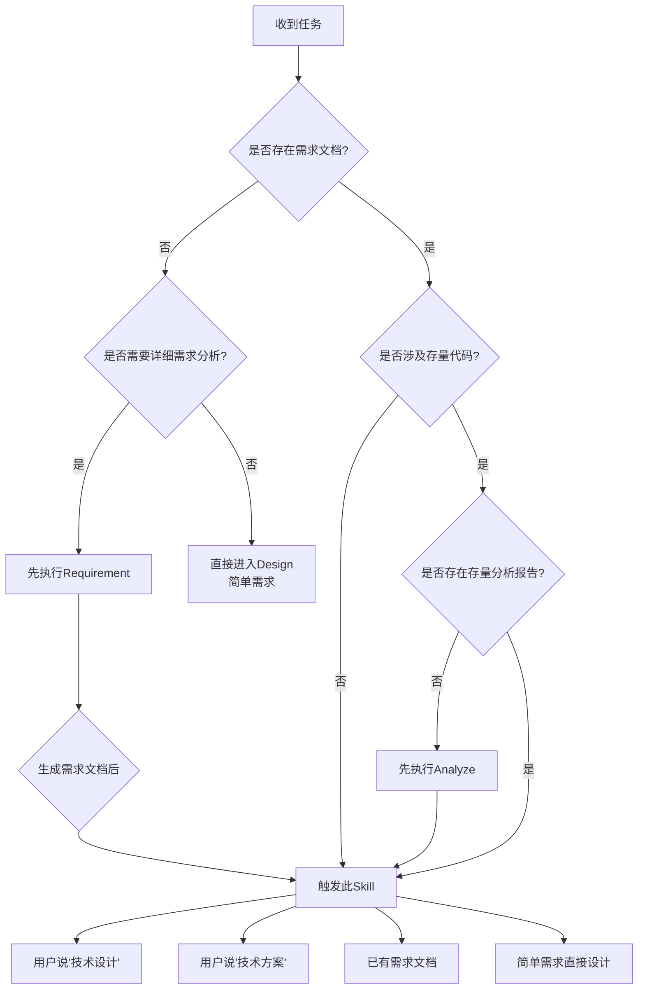
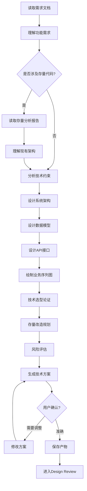

# Design - 技术设计

## Overview

基于需求文档（如存在）和存量分析（如涉及存量代码），设计完整的技术方案。技术方案包含系统架构、数据模型、API 设计、技术选型、风险评估等内容。注意：Design 阶段只生成技术方案，不生成实现计划（实现计划在 Plan 节点生成）。

## When to Use

### 前置条件
- ✅ 已存在需求文档（来自 Requirement 或用户已有文档）
- ✅ 如果涉及存量代码，已有存量分析报告（来自 Analyze 或用户已有文档）

### 触发条件
当：
- 用户说"技术设计..."
- 用户说"技术方案..."
- 用户说"架构设计..."
- 已有需求文档，准备进入设计阶段
- 用户直接提供需求，需要技术方案

### 判断流程



### 灵活性说明

**可跳过前置节点：**
- ✅ 如果已有需求文档（如 `{date}_需求文档_{功能名称}_v1.0.md`），可直接进入 Design
- ✅ 如果已有存量分析报告（如涉及存量代码），可直接使用，无需重新执行 Analyze
- ✅ 简单需求可以直接进入 Design，无需 Requirement 阶段

## The Process

### 详细流程



### 步骤说明

1. **读取需求文档** ⭐
   - 读取 Requirement 阶段生成的需求文档（如存在）
   - 或读取用户提供的已有需求文档
   - 理解功能需求、业务规则、验收标准

2. **读取存量分析报告**（可选）
   - 如果涉及存量代码，读取 Analyze 阶段的分析报告（如存在）
   - 或读取用户提供的已有存量分析
   - 理解现有架构、依赖关系、技术债务

3. **分析技术约束**
   - 识别技术栈约束（从 CLAUDE.md 读取）
   - 识别性能要求
   - 识别安全要求
   - 识别兼容性要求

4. **设计系统架构** ⭐
   - 设计系统整体架构（分层、模块划分）
   - 绘制架构图（使用 Mermaid）
   - 说明模块职责和依赖关系
   - 设计模式选择

5. **设计数据模型** ⭐
   - 设计表结构（字段、类型、长度）
   - 设计索引（主键、唯一索引、普通索引）
   - 设计约束（外键、检查约束、默认值）
   - 绘制 ER 图（实体关系图）
   - 考虑分库分表策略（如需要）
   - 考虑数据迁移方案（如涉及存量改造）

6. **设计 API 接口**
   - 定义接口规范（RESTful/GraphQL）
   - 定义请求参数（路径、查询、请求体）
   - 定义响应格式（成功、失败）
   - 定义错误码
   - 考虑版本控制

7. **绘制业务序列图**
   - 使用 Mermaid 绘制核心业务流程的序列图
   - 标注关键交互和时序
   - 识别性能瓶颈

8. **技术选型论证**
   - 选择技术栈和库
   - 说明选择理由
   - 对比备选方案

9. **存量改造规划**（涉及存量代码时）
   - 识别需要改造的模块
   - 设计改造策略（渐进式/一次性）
   - 评估改造风险
   - 设计回滚方案

10. **风险评估**
    - 识别技术风险
    - 评估风险影响
    - 设计应对措施

11. **生成技术方案**
    - 汇总为完整的技术方案文档
    - 不包含实现计划（实现计划在 Plan 节点生成）

12. **用户确认**
    - 确保技术方案准确可行

### 工具使用

**Serena MCP**:
- `read_file` - 读取需求文档和存量分析报告
- `write_file` - 保存技术方案

**Mermaid**:
- 绘制架构图
- 绘制 ER 图
- 绘制序列图

## 输入来源

1. **需求文档**：来自 Requirement 阶段或用户已有文档（可选但推荐）
2. **存量分析报告**：来自 Analyze 阶段或用户已有文档（涉及存量代码时）
3. **CLAUDE.md**：获取技术栈、架构信息（必须）
4. **用户对话**：用户补充技术约束和需求细节

## 动态时间预估

| 复杂度 | 时间范围 | 说明 |
|-------|---------|------|
| 🟢 简单 | 15-30分钟 | 单层架构，直接实现，无存量依赖 |
| 🟡 中等 | 30-60分钟 | 多层架构，需要详细设计，涉及少量存量代码 |
| 🔴 复杂 | 60-120分钟 | 分布式架构，系统交互复杂，涉及大量存量代码 |

## 输出产物

**文件：** `.claude/designs/{date}_技术方案_{功能名称}_v1.0.md`

**内容结构：**
```markdown
# 技术方案

## 1. 架构设计
### 1.1 系统架构图
[Mermaid 架构图]

### 1.2 模块划分
[模块职责说明]

### 1.3 设计模式
[使用的设计模式及理由]

## 2. 数据模型设计
### 2.1 表结构设计
[表名、字段、类型、长度]

### 2.2 索引设计
[主键、唯一索引、普通索引]

### 2.3 约束设计
[外键、检查约束、默认值]

### 2.4 ER 图
[Mermaid ER 图]

### 2.5 分库分表策略（如需要）
[分库分表规则、路由算法]

## 3. API 设计
### 3.1 接口列表
[接口路径、方法、描述]

### 3.2 接口详细设计
#### 接口 1：[接口路径]
- 请求方法：[GET/POST/PUT/DELETE]
- 请求参数：[参数列表]
- 响应格式：[响应结构]
- 错误码：[错误码列表]

## 4. 业务序列图
[Mermaid 序列图]

## 5. 技术选型
### 5.1 技术栈
[使用的技术栈]

### 5.2 选型理由
[选择理由和备选方案对比]

## 6. 存量改造方案（涉及存量代码时）
### 6.1 改造模块
[需要改造的模块清单]

### 6.2 改造策略
[渐进式/一次性改造方案]

### 6.3 回滚方案
[回滚策略]

## 7. 风险评估
### 7.1 技术风险
[风险列表和影响评估]

### 7.2 应对措施
[风险应对策略]

## 8. 非功能性设计
### 8.1 性能设计
[性能优化策略]

### 8.2 安全设计
[安全措施]

### 8.3 兼容性设计
[兼容性保障]
```

## 关键检查清单 ✅

- [ ] 需求理解：是否已读取并理解需求文档（如存在）？
- [ ] 架构设计：是否包含系统架构图和模块划分？
- [ ] 数据模型：是否设计了表结构、索引、约束、ER 图？
- [ ] API 设计：是否定义了接口规范（请求/响应/错误码）？
- [ ] 流程设计：是否绘制了核心业务序列图？
- [ ] 存量改造：是否规划了存量代码的改造方案？（涉及存量代码时）
- [ ] 技术选型：是否说明了技术选型的理由？
- [ ] 风险评估：是否标注了技术风险和应对措施？
- [ ] CLAUDE.md：是否已读取并遵循技术栈约束？

## Red Flags ⚠️

| 错误做法 | 正确做法 |
|---------|---------|
| ❌ 没有需求文档就做复杂设计 | ✅ 简单需求可直接设计，复杂需求应有需求文档 |
| ❌ 涉及存量代码但未分析影响 | ✅ 必须先完成存量分析或使用已有分析报告 |
| ❌ 技术方案过于笼统 | ✅ 需要足够详细才能指导开发 |
| ❌ 在 Design 阶段生成实现计划 | ✅ 实现计划应在 Plan 阶段生成 |
| ❌ 数据模型只做概念设计 | ✅ 数据模型必须包含物理设计（表结构、索引、约束等） |
| ❌ 忽略 CLAUDE.md 中的技术栈约束 | ✅ 必须遵循项目技术栈规范 |

## Integration

### 前置依赖
- **cadence-requirement**（可选）：提供需求文档，但不是必须，已有需求文档或简单需求可直接进入
- **cadence-analyze**（可选）：涉及存量代码时，提供存量分析报告，可用已有报告

### 下一步
- **cadence-design-review**：对技术方案进行系统性审查

### 替代方案
- 如果已有技术方案，可直接进入 Design Review
- 简单功能可跳过 Design Review（需用户确认）

### 需要的输入
- 需求文档（来自 Requirement 或用户已有文档，推荐但非必须）
- 存量分析报告（来自 Analyze 或用户已有文档，涉及存量代码时）
- CLAUDE.md（必须：技术栈约束）

## 确认机制

生成技术方案后：
展示技术方案摘要（3-5 个关键决策）
展示数据模型设计（表结构、ER 图）
展示存量改造计划（涉及存量代码时）
展示风险评估

询问："这个技术方案可行吗？有什么要调整的？"
├── ✅ 可行 → 保存产物，进入 design-review
├── ⚠️ 需要调整 → 修改方案
└── ❌ 不可行 → 重新设计

## 跳过条件

- 已存在完整的技术方案文档
- 极简单功能（如配置修改、简单查询）
- 纯原型开发（探索阶段）
- 用户明确表示不需要

## 与 Requirement 的边界

**Requirement 阶段负责：**
- ✅ 功能清单和用户故事
- ✅ 业务流程和业务规则
- ✅ 验收标准（清晰到可推导测试用例）
- ✅ 存量复用规划（识别可复用模块）

**Design 阶段负责：**
- ✅ 系统架构设计
- ✅ 数据模型设计（物理设计：表结构、索引、约束、ER 图）
- ✅ API 设计（接口规范）
- ✅ 技术选型论证
- ✅ 存量改造方案（详细的改造策略）
- ✅ 风险评估

**关键区别：**
- Requirement 关注"做什么"（业务视角）
- Design 关注"怎么做"（技术视角）
- Design 的数据模型是物理设计，不是概念模型
- Design 不生成实现计划（实现计划在 Plan 阶段）

## 与 Plan 的边界

**Design 阶段负责：**
- ✅ 技术方案（架构、数据模型、API、技术选型）

**Plan 阶段负责：**
- ✅ 实现计划（任务分解、依赖关系、优先级排序、时间估计）

**关键区别：**
- Design 输出：技术方案（1 个文档）
- Plan 输出：实现计划（1 个文档）
- Design 关注技术选型和架构设计
- Plan 关注任务分解和执行计划
