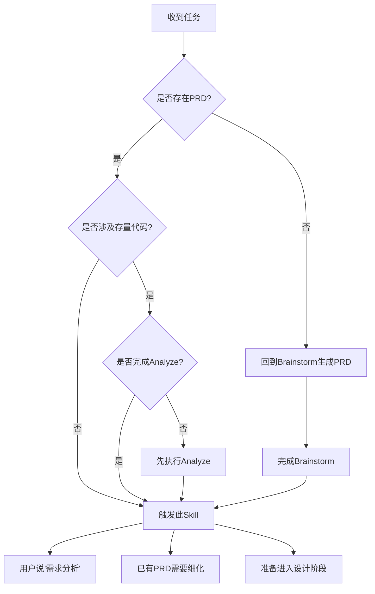
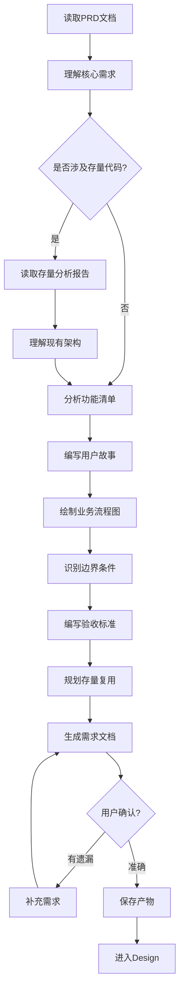

# Requirement - 需求分析

## Overview

基于 PRD 和存量分析（如涉及存量代码），进行详细的需求分析，生成完整的需求文档。需求文档包含功能清单、用户故事、业务流程、验收标准、存量复用规划等内容。

## When to Use

### 前置条件
- ✅ 已存在 PRD 文档（来自 brainstorm）
- ✅ 如果涉及存量代码，已完成 Analyze

### 触发条件
当：
- 用户说"需求分析..."
- 用户说"详细需求..."
- 用户说"业务规则..."
- 已有 PRD，需要细化为详细需求
- 准备进入设计阶段

### 判断流程



## The Process

### 详细流程



### 步骤说明

1. **读取 PRD 文档** ⭐
   - 读取 brainstorm 阶段生成的 PRD
   - 理解核心需求和用户故事
   - 识别核心功能和扩展功能

2. **读取存量分析报告**（可选）
   - 如果涉及存量代码，读取 analyze 阶段的分析报告
   - 理解现有架构和依赖关系
   - 识别可复用的模块和接口

3. **分析功能清单**
   - 将 PRD 拆解为具体功能点
   - 区分核心功能和扩展功能
   - 识别功能间的依赖关系

4. **编写用户故事**
   - 每个功能转换为用户故事格式
   - 包含：作为...我想要...以便于...
   - 标注优先级（P0/P1/P2）

5. **绘制业务流程图**
   - 使用 Mermaid 绘制核心业务流程
   - 标注关键决策点
   - 识别异常流程

6. **识别边界条件**
   - 识别异常场景和边界情况
   - 识别数据边界（最大值、最小值、空值）
   - 识别权限边界

7. **编写验收标准** ⭐
   - 每个功能编写可测试的验收标准
   - 验收标准必须**足够清晰，能够推导测试用例**
   - 使用 Given-When-Then 格式
   - 标注验收标准的优先级

8. **规划存量复用**
   - 识别可以复用的存量代码模块
   - 识别需要改造的存量代码
   - 评估复用风险和改造成本

9. **生成需求文档**
   - 汇总为完整的需求文档
   - 包含功能清单、用户故事、业务流程、验收标准、存量复用规划

10. **用户确认**
    - 确保需求准确无遗漏

### 工具使用

**Serena MCP**:
- `read_file` - 读取 PRD 和存量分析报告
- `write_file` - 保存需求文档

**Mermaid**:
- 绘制业务流程图
- 绘制数据流图

## 输入来源

1. **PRD 文档**：来自 brainstorm 阶段（必须）
2. **存量分析报告**：来自 analyze 阶段（涉及存量代码时必须）
3. **用户对话**：用户补充需求细节
4. **项目上下文**：通过 Serena 读取项目结构

## 动态时间预估

| 复杂度 | 时间范围 | 说明 |
|-------|---------|------|
| 🟢 简单 | 10-15分钟 | 功能单一，规则明确，无存量依赖 |
| 🟡 中等 | 15-30分钟 | 功能较多，需要详细规则，涉及少量存量代码 |
| 🔴 复杂 | 30-60分钟 | 复杂业务，众多边界条件，涉及大量存量代码 |

## 输出产物

**文件：** `.claude/docs/{date}_需求文档_{功能名称}_v1.0.md`

**内容结构：**
```markdown
# 需求文档

## 1. 功能概览
- 核心功能：[核心功能列表]
- 扩展功能：[扩展功能列表]

## 2. 用户故事
### 用户故事 1
- 作为：[角色]
- 我想要：[功能]
- 以便于：[价值]
- 优先级：P0

## 3. 业务流程
[Mermaid 业务流程图]

## 4. 功能详细说明
### 功能 1：[功能名称]
- 功能描述：[描述]
- 业务规则：[规则]
- 边界条件：[边界]

## 5. 验收标准
### 功能 1 验收标准
- Given：[前置条件]
- When：[触发动作]
- Then：[预期结果]
- 优先级：P0

## 6. 存量复用规划
- 可复用模块：[模块列表]
- 需改造模块：[改造清单]
- 复用风险：[风险评估]

## 7. 非功能性需求
- 性能要求：[性能指标]
- 安全要求：[安全要求]
- 兼容性要求：[兼容性]
```

## 关键检查清单 ✅

- [ ] PRD 读取：是否已读取并理解 PRD？
- [ ] 功能清单：是否列出了所有功能点？
- [ ] 用户故事：是否包含完整的用户故事？
- [ ] 业务流程：是否绘制了核心业务流程图？
- [ ] 边界条件：是否识别了所有边界和异常？
- [ ] 验收标准：验收标准是否足够清晰，能够推导测试用例？
- [ ] 存量复用：是否规划了存量代码的复用方式？（涉及存量代码时）
- [ ] 优先级：是否区分了核心功能和扩展功能？

## Red Flags ⚠️

| 错误做法 | 正确做法 |
|---------|---------|
| ❌ 没有 PRD 就做 Requirement | ✅ 必须先完成 Brainstorm 生成 PRD |
| ❌ 涉及存量代码但未完成 Analyze | ✅ 必须先完成 Analyze |
| ❌ 验收标准模糊，无法测试 | ✅ 验收标准必须足够清晰，能推导测试用例 |
| ❌ 忽略存量代码的改造影响 | ✅ 需要评估存量影响和复用方案 |
| ❌ 在 Requirement 阶段设计数据模型 | ✅ 数据模型应在 Design 阶段完成 |
| ❌ 验收标准包含具体测试用例 | ✅ 验收标准只需达到"能推导测试用例"的清晰度 |

## Integration

### 前置依赖
- **cadence-brainstorm**（必须）：提供 PRD 文档
- **cadence-analyze**（可选）：涉及存量代码时，提供存量分析报告

### 下一步
- **cadence-design**：基于需求文档进行技术设计

### 替代方案
- 如果已有详细需求文档，可直接进入 Design
- 纯原型开发（探索阶段）可跳过此节点

### 需要的输入
- PRD 文档（来自 brainstorm）
- 存量分析报告（来自 analyze，涉及存量代码时）

## 确认机制

生成需求文档后：
展示需求文档摘要（3-5 条核心需求）
展示验收标准清单（按优先级分组）
展示存量代码复用计划（涉及存量代码时）

询问："需求是否完整？有没有遗漏？"
├── ✅ 完整 → 保存产物，进入 design
├── ⚠️ 有遗漏 → 补充需求
└── ❌ 不对 → 重新分析

## 跳过条件

- 已存在详细需求文档
- 功能极简单，无需详细分析（如简单的配置修改）
- 纯原型开发（探索阶段）
- 用户明确表示不需要

## 与 Design 的边界

**Requirement 阶段负责：**
- ✅ 功能清单和用户故事
- ✅ 业务流程和业务规则
- ✅ 验收标准（清晰到可推导测试用例）
- ✅ 存量复用规划（识别可复用模块）

**Design 阶段负责：**
- ✅ 技术方案和架构设计
- ✅ 数据模型设计（表结构、索引、约束）
- ✅ API 设计（接口规范）
- ✅ 详细的技术选型和实现细节

**关键区别：**
- Requirement 关注"做什么"（业务视角）
- Design 关注"怎么做"（技术视角）
- Requirement 不包含数据模型设计
- 验收标准不包含具体测试用例
