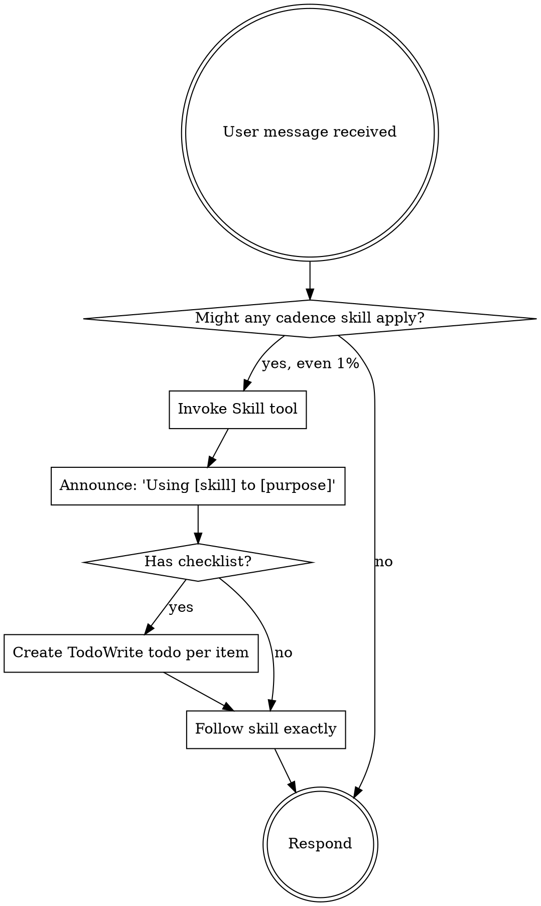

# 使用 Claude Code Skills 的 AI 自动化开发方案

> 设计日期: 2026-02-25
> 版本: v1.12（完全参考 superpowers 实现）
> 设计目标: 基于 Claude Code 的 Skills 和 Subagent 能力，构建 AI 自动化开发系统

---

## 1. 概述

### 1.1 背景

利用 Claude Code 现有的 Skills 和 Subagent 能力，构建一套 AI 自动化开发环境，覆盖需求整理、方案设计、代码生成、单元测试等关键环节。

### 1.2 设计原则

- **基于现有能力**：利用 Claude Code 的 Skills + Subagent 模式，不自建 Agent 调度系统
- **完全参考 superpowers**：复刻 superpowers 项目的标准化 Skill 模式
- **使用 Task 工具调度 Subagent**：参考 superpowers:subagent-driven-development
- **关键节点确认**：仅在设计评审、代码审查等节点暂停人工确认
- **状态存储**：使用文件系统存储（`.claude/state/`），支持跨会话持久化
- **Plugin 形式发布**：作为 Claude Code 插件发布，通过 marketplace 安装

---

## 2. 完整目录结构（完全参考 superpowers）

```
cadence-skills/                    # Plugin 根目录
├── .claude-plugin/               # Plugin 配置
│   ├── plugin.json              # Plugin 元信息
│   └── marketplace.json          # Marketplace 配置
├── skills/                       # Skills 目录
│   ├── using-cadence/            # 元 Skill（核心！必须）
│   │   └── SKILL.md
│   ├── cadence-init/
│   │   └── SKILL.md
│   ├── cadence-requirement/
│   │   └── SKILL.md
│   ├── cadence-design/
│   │   └── SKILL.md
│   ├── cadence-analyze/
│   │   └── SKILL.md
│   ├── cadence-code/
│   │   ├── SKILL.md
│   │   ├── implementer-prompt.md    # Subagent 提示词
│   │   ├── spec-reviewer-prompt.md  # 规范审查提示词
│   │   └── code-reviewer-prompt.md  # 代码审查提示词
│   ├── cadence-unit-test/
│   │   └── SKILL.md
│   └── cadence-integration-test/
│       └── SKILL.md
├── commands/                     # 命令目录
│   ├── init.md
│   ├── requirement.md
│   ├── design.md
│   ├── analyze.md
│   ├── code.md
│   ├── unittest.md
│   ├── integration.md
│   ├── approve.md
│   ├── reject.md
│   ├── status.md
│   ├── resume.md
│   └── pause.md
├── hooks/                       # Hooks
│   ├── hooks.json              # Hook 配置
│   ├── session-start           # Session 启动 Hook（bash 脚本）
│   └── run-hook.cmd            # Hook 入口脚本
├── docs/                        # 文档
├── lib/                         # 库
├── tests/                       # 测试
├── README.md                    # 说明文档
├── LICENSE                      # 许可证
└── .gitignore
```

---

## 3. Plugin 配置

### 3.1 plugin.json

```json
{
  "name": "cadence-skills",
  "description": "AI 自动化开发 Skills：需求分析、方案设计、代码生成、测试生成",
  "version": "1.0.0",
  "author": {
    "name": "Your Name",
    "email": "your@email.com"
  },
  "homepage": "https://github.com/yourorg/cadence-skills",
  "repository": "https://github.com/yourorg/cadence-skills",
  "license": "MIT",
  "keywords": ["skills", "ai", "automation", "development", "workflow"]
}
```

### 3.2 marketplace.json

```json
{
  "name": "cadence-skills-dev",
  "description": "Cadence Skills - AI 自动化开发环境",
  "owner": {
    "name": "Your Name",
    "email": "your@email.com"
  },
  "plugins": [
    {
      "name": "cadence-skills",
      "description": "AI 自动化开发 Skills：需求分析、方案设计、代码生成、测试生成",
      "version": "1.0.0",
      "source": "./",
      "author": {
        "name": "Your Name",
        "email": "your@email.com"
      }
    }
  ]
}
```

---

## 4. Hooks 配置

### 4.1 hooks.json（完全参考 superpowers）

```json
{
  "hooks": {
    "SessionStart": [
      {
        "matcher": "startup|resume|clear|compact",
        "hooks": [
          {
            "type": "command",
            "command": "'${CLAUDE_PLUGIN_ROOT}/hooks/run-hook.cmd' session-start",
            "async": false
          }
        ]
      }
    ]
  }
}
```

### 4.2 session-start Hook 脚本（完全参考 superpowers）

Session 启动时，将 using-cadence Skill 内容注入到上下文中：

```bash
#!/usr/bin/env bash
# SessionStart hook for cadence-skills

set -euo pipefail

# Determine plugin root directory
SCRIPT_DIR="$(cd "$(dirname "${BASH_SOURCE[0]:-$0}")" && pwd)"
PLUGIN_ROOT="$(cd "${SCRIPT_DIR}/.." && pwd)"

# Read using-cadence skill content
using_cadence_content=$(cat "${PLUGIN_ROOT}/skills/using-cadence/SKILL.md" 2>&1 || echo "Error reading using-cadence skill")

# Escape string for JSON embedding
escape_for_json() {
    local s="$1"
    s="${s//\\/\\\\}"
    s="${s//\"/\\\"}"
    s="${s//$'\n'/\\n}"
    s="${s//$'\r'/\\r}"
    s="${s//$'\t'/\\t}"
    printf '%s' "$s"
}

using_cadence_escaped=$(escape_for_json "$using_cadence_content")
session_context="<EXTREMELY_IMPORTANT>\nYou have cadence-skills.\n\n**Below is the full content of your 'cadence:using-cadence' skill - your introduction to using cadence skills. For all other skills, use the 'Skill' tool:**\n\n${using_cadence_escaped}\n</EXTREMELY_IMPORTANT>"

# Output context injection as JSON
cat <<EOF
{
  "additional_context": "${session_context}",
  "hookSpecificOutput": {
    "hookEventName": "SessionStart",
    "additionalContext": "${session_context}"
  }
}
EOF

exit 0
```

**关键说明**：Hook 不是"加载"Skill，而是将 Skill 内容作为 `additional_context` 注入到会话上下文中。Claude Code 会读取这个上下文并自动使用其中的 Skill 规则。

---

## 5. 元 Skill：using-cadence（核心！）

完全参考 superpowers 的 `using-superpowers`：

### 5.1 using-cadence/SKILL.md

```yaml
---
name: using-cadence
description: Use when starting any conversation - establishes how to find and use cadence skills, requiring Skill tool invocation before ANY response including clarifying questions
---

<EXTREMELY_IMPORTANT>
If you think there is even a 1% chance a cadence skill might apply to what you are doing, you ABSOLUTELY MUST invoke the skill.

IF A SKILL APPLIES TO YOUR TASK, YOU DO NOT HAVE A CHOICE. YOU MUST USE IT.
</EXTREMELY_IMPORTANT>

## How to Access Skills

**In Claude Code:** Use the `Skill` tool. When you invoke a skill, its content is loaded and presented to you—follow it directly. Never use the Read tool on skill files.

# Using Cadence Skills

## The Rule

**Invoke relevant or requested skills BEFORE any response or action.**



## Red Flags

These thoughts mean STOP—you're rationalizing:

| Thought | Reality |
|---------|---------|
| "This is just a simple question" | Questions are tasks. Check for skills. |
| "I need more context first" | Skill check comes BEFORE clarifying questions. |
| "Let me explore the codebase first" | Skills tell you HOW to explore. Check first. |
| "I can check git/files quickly" | Files lack conversation context. Check for skills. |

## Commands

手动触发命令：
- `/cadence:requirement` - 需求分析
- `/cadence:design` - 方案设计
- `/cadence:analyze` - 存量分析
- `/cadence:code` - 代码生成
- `/cadence:unittest` - 单元测试
- `/cadence:integration` - 集成测试
```

---

## 6. 命令文件格式（完全参考 superpowers）

每个命令对应一个 `.md` 文件，放在 `commands/` 目录：

```yaml
# commands/requirement.md
---
description: "分析 PRD 文档，提取结构化需求"
disable-model-invocation: true
---

Invoke the cadence:requirement skill and follow it exactly as presented to you
```

### 6.1 命令列表

| 命令 | 说明 |
|------|------|
| `/cadence:init` | 初始化项目 |
| `/cadence:requirement [topic]` | 需求分析 |
| `/cadence:design [topic]` | 方案设计 |
| `/cadence:analyze [target]` | 存量代码分析 |
| `/cadence:code [topic]` | 代码生成 |
| `/cadence:unittest [topic]` | 单元测试 |
| `/cadence:integration [topic]` | 集成测试 |
| `/cadence:approve [phase]` | 确认阶段 |
| `/cadence:reject [phase] [reason]` | 拒绝 |
| `/cadence:status` | 查看当前状态 |
| `/cadence:resume` | 恢复工作流 |
| `/cadence:pause` | 暂停工作流 |

---

## 7. Skill 标准格式

### 7.1 SKILL.md 格式

```yaml
---
name: cadence-requirement
description: 分析 PRD 文档，提取结构化需求
allowed-tools: Read, Grep, Glob, Bash, mcp__serena_*
---

# Cadence Requirement Skill

## 触发条件
[何时使用此技能]

## 执行步骤
[详细步骤]

## 输入
[需要什么输入]

## 输出
[产出什么结果]

## 人工确认点
[是否需要人工确认]

## 状态存储
[Serena Memory / 文件系统操作]
```

### 7.2 Subagent 提示词模板（平铺）

对于需要 Subagent 的 Skill（如 cadence-code），将提示词模板平铺在 skills 目录下：

```
skills/
└── cadence-code/
    ├── SKILL.md
    ├── implementer-prompt.md           # 代码实现 Subagent
    ├── spec-reviewer-prompt.md        # 规范审查 Subagent
    └── code-reviewer-prompt.md # 代码质量审查 Subagent
```

---

## 8. 初始化项目 Skill (cadence-init)

### 8.1 概述

在项目首次使用 Cadence Skills 时，需要进行初始化配置。

### 8.2 触发条件

- 用户输入 `/cadence:init`
- 首次使用 Cadence Skills 时自动触发

### 8.3 执行操作

**初始化操作：**

1. **创建项目目录结构**
   ```
   .claude/
   ├── skills/              # 从 Skills 目录复制
   └── configs/             # 项目配置
   ```

2. **更新 .gitignore**
   ```
   # Cadence Skills 状态文件
   .claude/state/
   .claude/state/*
   .claude/**/*.lock
   ```

3. **初始化存量代码分析**（可选）
   - 分析项目整体代码结构
   - 生成存量代码分析报告
   - 存储到 `.claude/analysis/`

4. **创建项目配置文件**
   ```
   .claude/config.json
   ```

### 8.4 输出示例

```
✓ 已创建 .claude/skills/ 目录
✓ 已更新 .gitignore
✓ 已创建 .claude/state/ 目录
✓ 已创建 .claude/config.json
✓ 已完成存量代码分析
  - 分析报告: .claude/analysis/2026-02-25_存量代码分析_v1.0.md

初始化完成！可以使用 /cadence:requirement 开始开发。
```

---

## 9. 需求分析 Skill (cadence-requirement)

### 9.1 触发条件

- 用户输入 `/cadence:requirement`
- 用户描述需要开发的功能（自动识别）

### 9.2 输入

- PRD 文档路径
- 业务规则文档（可选）
- 项目背景知识

### 9.3 输出（结构化需求）

```json
{
  "requirement_id": "REQ-2026-001",
  "title": "功能标题",
  "business_rules": [
    {
      "rule_id": "BR-001",
      "description": "规则描述",
      "priority": "high|medium|low"
    }
  ],
  "business_flows": [...],
  "modules": [...],
  "acceptance_criteria": [...]
}
```

### 9.4 输出文档位置

```
.claude/docs/2026-02-25_需求文档_功能名称_v1.0.md
```

---

## 10. 方案设计 Skill (cadence-design)

### 10.1 触发条件

- 用户输入 `/cadence:design`
- 需求分析完成后自动触发

### 10.2 输入

- 需求分析结果（来自状态存储）
- 设计规范文档路径（项目已有）
- 实现思路（用户输入）

### 10.3 输出（设计文档）

```json
{
  "design_id": "DES-2026-001",
  "based_on_requirement": "REQ-2026-001",
  "architecture": {...},
  "data_model": {...},
  "api_design": {...},
  "file_changes": {...}
}
```

### 10.4 输出文档位置

```
.claude/designs/2026-02-25_技术方案_功能名称_v1.0.md
```

---

## 11. 代码生成 Skill (cadence-code)

### 11.1 触发条件

- 用户输入 `/cadence:code`
- 方案设计确认后自动触发

### 11.2 输入

- 方案设计结果
- 代码规范配置
- 项目模板路径
- 类型参数（可选）：`--type frontend|backend`
- 语言参数（可选）：`--lang java|python|javascript`

### 11.3 前端/后端切换机制

代码生成 Skill 使用**类型参数 + 语言参数**双维度切换：

| 参数 | 选项 | 说明 |
|------|------|------|
| `--type` | `frontend` | 前端开发模式 |
| `--type` | `backend` | 后端开发模式 |
| `--lang` | `javascript` | JavaScript/TypeScript |
| `--lang` | `python` | Python |
| `--lang` | `java` | Java |

### 11.4 参数校验

| 参数组合 | 处理方式 |
|---------|---------|
| `--type frontend --lang java` | 报错：Java 不适用于前端 |
| `--type frontend --lang python` | 报错：Python 不适用于前端 |
| `--type backend --lang java` | ✓ 有效 |
| `--type frontend --lang javascript` | ✓ 有效 |

### 11.5 输出

- **仅生成业务代码**，不包含测试
- Git 提交（可选）

### 11.6 使用示例

```bash
# 前端 React 组件
/cadence:code user-dashboard --type frontend --lang javascript

# 后端 Python API
/cadence:code user-api --type backend --lang python

# 后端 Java Spring
/cadence:code order-service --type backend --lang java
```

---

## 12. 测试生成 Skills

### 12.1 单元测试 Skill (cadence-unit-test)

**触发条件**：
- 用户输入 `/cadence:unittest`
- 代码生成后自动触发

**语言支持**：

| 语言 | 测试框架 |
|------|---------|
| JavaScript/TypeScript | Jest/Vitest |
| Python | pytest |
| Java | JUnit/TestNG |

### 12.2 集成测试 Skill (cadence-integration-test)

**触发条件**：
- 用户输入 `/cadence:integration`
- 方案设计确认后触发

---

## 13. 存量代码分析 Skill (cadence-analyze)

### 13.1 概述

存量代码分析作为独立的 Skill，可以单独使用，也可以在方案设计阶段自动调用。

### 13.2 触发条件

**手动触发**：
- `/cadence:analyze user-service` - 分析用户服务相关代码
- `/cadence:analyze --scope api` - 分析 API 层代码
- `/cadence:analyze --depth deep` - 深度分析

**自动触发**：
- 方案设计阶段
- 模块类型为 `existing`（存量功能）
- 需要与现有系统集成

### 13.3 命令参数

| 参数 | 说明 | 示例 |
|------|------|------|
| `target` | 分析目标 | `/cadence:analyze order` |
| `--scope` | 分析范围 | `--scope api|model|service|all` |
| `--depth` | 分析深度 | `--depth shallow|medium|deep` |

### 13.4 分析深度

| 深度 | 说明 | 耗时 |
|------|------|------|
| `shallow` | 快速扫描 | < 30s |
| `medium` | 分析调用关系 | 1-3 min |
| `deep` | 完整分析 | 5-10 min |

### 13.5 与方案设计集成

```
需求：开发"用户收藏商品"功能
    │
    ▼
检测是否涉及存量代码
    │
    ├─ 是 → 加载存量分析报告
    └─ 否 → 按全新功能设计
```

---

## 14. 状态存储（文件系统持久化）

### 14.1 存储位置

```
.claude/
└── state/
    ├── workflows/
    │   └── {workflow_id}.json
    ├── context/
    │   └── {workflow_id}/
    └── locks/
        └── {workflow_id}.lock
```

### 14.2 状态结构

```json
{
  "workflow_id": "WF-2026-001",
  "current_phase": "requirement|design|code|unit-test|integration-test",
  "status": "in_progress|paused|completed|error",
  "context": {
    "requirement": {...},
    "design": {...},
    "code": {...}
  }
}
```

### 14.3 持久化机制

| 场景 | 操作 | 文件 |
|------|------|------|
| 创建工作流 | 写入 | `state/workflows/{workflow_id}.json` |
| 更新状态 | 写入 | `state/workflows/{workflow_id}.json` |
| 保存上下文 | 写入 | `state/context/{workflow_id}/` |
| 恢复工作流 | 读取 | `state/workflows/{workflow_id}.json` |
| 并发控制 | 锁文件 | `state/locks/{workflow_id}.lock` |

### 14.4 暂停与恢复

```
# 暂停
/cadence:pause

# 恢复
/cadence:resume
/cadence:resume WF-2026-001
```

---

## 15. 人工确认流程

### 15.1 交互形式

通过交互形式进入下一阶段：

```
┌──────────────┐
│ 需求分析完成  │
└──────┬───────┘
       │
       ▼
┌──────────────────────────────┐
│ 展示需求分析结果               │
│ 询问："有问题吗？"             │
└──────────────────────────────┘
       │
       ├── 没问题 → 进入下一阶段
       └── 有问题 → 重新处理
```

### 15.2 命令确认（辅助）

- `/cadence:approve requirement` - 确认需求
- `/cadence:approve design` - 确认方案
- `/cadence:approve code` - 确认代码
- `/cadence:reject <reason>` - 拒绝并说明原因

---

## 16. Subagent 驱动开发模式

### 16.1 两阶段审查机制

完全参考 superpowers:subagent-driven-development：

```
  1. 调度 Implementer Subagent
           │
           ▼
  2. Spec Review（规范审查）
           │
           ├─ 不通过 → 修复 → 重新审查
           └─ 通过
           ▼
  3. Code Review（代码审查）
           │
           ├─ 不通过 → 修复 → 重新审查
           └─ 通过
           ▼
  4. 标记完成
```

### 16.2 Subagent 提示词模板

```yaml
# skills/cadence-code/implementer-prompt.md
---
name: Cadence Code Implementer
description: 代码实现 Subagent
allowed-tools: Read, Edit, Write, Bash
---

# Cadence Code Implementer

## 任务
根据设计方案生成业务代码。

## 工作流程
1. 读取设计方案
2. 生成业务代码
3. 自我审查
4. 报告完成
```

---

## 17. 文档输出规范

按 CLAUDE.md 规范存储：

```
.claude/
├── docs/                    # 需求文档
├── designs/                 # 方案设计
├── notes/                   # 临时记录
└── analysis/               # 存量分析
```

---

## 18. 安装方式

### 18.1 通过 Plugin Marketplace 安装

```bash
# 添加 marketplace
/plugin marketplace add yourorg/cadence-skills-marketplace

# 安装 plugin
/plugin install cadence-skills@yourorg/cadence-skills-marketplace
```

### 18.2 验证安装

```bash
# 开始新会话
# 输入：帮我开发用户登录功能
# 应该自动触发 cadence:requirement Skill
```

---

## 19. 实施计划

### 19.1 阶段划分

| 阶段 | 目标 | 内容 |
|------|------|------|
| **第一阶段** | 框架搭建 | Plugin 配置 + Hook + 命令触发 |
| **第二阶段** | 需求+方案 | cadence-requirement、cadence-design |
| **第三阶段** | 存量分析 | cadence-analyze + Context7/Serena |
| **第四阶段** | 代码生成 | cadence-code + Subagent |
| **第五阶段** | 测试生成 | cadence-unit-test、cadence-integration-test |
| **第六阶段** | 整合优化 | 交互确认、恢复、全流程测试 |

### 19.2 语言支持优先级

| 优先级 | 语言 | 测试框架 |
|--------|------|---------|
| 1 | JavaScript/TypeScript | Jest/Vitest |
| 2 | Python | pytest |
| 3 | Java | JUnit |

---

## 20. 风险评估

| 风险 | 影响 | 应对措施 |
|------|------|---------|
| 存量代码分析复杂度 | 高 | 使用 Context7 + Serena MCP |
| Claude Code 调用限制 | 中 | 控制 Subagent 并发数量 |
| 状态存储一致性 | 中 | 锁文件防止并发 |

---

## 21. 总结

本方案完全参考 superpowers 项目的实现，核心要点：

1. **Plugin 结构**：`.claude-plugin/` 配置目录
2. **Hooks 机制**：SessionStart hook 注入 Skill 内容到上下文
3. **Skills 目录**：`skills/` 包含所有 Skill（每个 Skill 一个 SKILL.md）
4. **Commands**：`commands/` 目录，通过 `disable-model-invocation: true` 触发 Skill
5. **双重触发**：
   - Hook 注入的元 Skill 自动触发
   - 命令触发（/cadence:xxx）
6. **Subagent 模式**：使用 Task 工具调度，提示词模板平铺
7. **状态存储**：文件系统 `.claude/state/`，支持跨会话持久化
8. **代码生成**：仅生成业务代码，不含测试
9. **测试拆分**：单元测试 + 集成测试
10. **多语言支持**：JS、Python、Java
