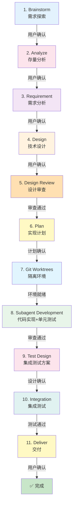

# 使用 Claude Code Skills 的 AI 自动化开发方案

> 设计日期: 2026-02-25
> 版本: v2.2（优化版）
> 设计目标: 基于 Claude Code 的 Skills 和 Subagent 能力，构建 AI 自动化开发系统

---

## 1. 概述

### 1.1 背景

利用 Claude Code 现有的 Skills 和 Subagent 能力，构建一套 AI 自动化开发环境，覆盖需求探索、需求分析、技术设计、设计审查、代码实现、测试验证、交付部署等关键环节。

### 1.2 设计原则

- **节点独立性**：每个节点可独立调用，不强制走完整流程
- **人工确认**：每个节点完成后必须人工确认
- **输出产物**：每个节点生成标准化的文档或代码
- **可追溯性**：所有产物有版本号、日期、依赖关系
- **断点续传**：支持会话中断后恢复进度
- **流程灵活性**：提供完整流程、快速流程、探索流程三种模式
- **TDD 优先**：代码实现必须遵循测试驱动开发
- **自动化审查**：集成 Linter/Formatter 自动化检查
- **Skill 独立**：关键能力独立为 Skill，便于复用和组合

### 1.3 核心特性

| 特性 | 说明 |
|------|------|
| **双通道调用** | 支持命令调用(`/cadence:xxx`) + Skill工具调用 |
| **节点独立** | 10个核心节点，每个可独立使用 |
| **Skill 组合** | 关键能力独立 Skill（3个TDD/审查前置 + 7个节点） |
| **流程组合** | 3种流程模式（完整/快速/探索） |
| **人工确认** | 每个节点有人工确认机制 |
| **标准产物** | 每个节点有标准化输出 |
| **进度追踪** | 使用 TodoWrite 追踪，支持恢复 |
| **质量保证** | 设计审查 + 代码审查 + TDD + 格式化审查 |
| **Subagent 驱动** | 代码开发集成单元测试和审查 |

---

## 2. 完整流程设计（10个核心节点）

### 2.1 流程概览



### 2.2 节点清单

| 序号 | 节点名称 | 目的 | 确认 | 产物 | 跳过条件 |
|------|---------|------|------|------|---------|
| 1 | Brainstorm | 需求探索 | 用户确认 PRD | PRD 文档 | 已有 PRD |
| 2 | **Analyze** ⭐ | 存量分析 | 用户确认分析 | 存量分析报告 | 全新项目 |
| 3 | Requirement | 需求分析 | 用户确认需求 | 需求文档 | 需求简单 |
| 4 | Design | 技术设计 | 用户确认方案 | 技术方案 + 实现计划 | - |
| 5 | Design Review | 设计审查 | 审查通过 | 设计审查报告 | 极简单功能 |
| 6 | Plan | 实现计划 | 用户确认计划 | 实现计划文档 | - |
| 7 | Git Worktrees | 隔离环境 | 环境就绪 | Worktree 目录 | 单人开发 |
| 8 | **Subagent Development** ⭐ | 代码实现+单元测试 | 审查通过 | 业务代码 + 单元测试 | - |
| 9 | **Test Design** ⭐ | 集成测试方案 | 用户确认设计 | 集成测试方案文档 | 简单功能 |
| 10 | Integration | 集成测试 | 测试通过 | 集成测试 + 报告 | 简单功能 |
| 11 | Deliver | 交付 | 用户确认交付 | 交付报告 | - |

### 2.3 流程特点

1. **每个节点独立**：可以从任意节点开始
2. **每个节点有人工确认**：确保质量和方向正确
3. **每个节点有输出产物**：标准化、可追溯
4. **支持跳过某些节点**：根据实际情况调整
5. **支持断点续传**：会话中断后可恢复

---

## 3. 三种流程模式

### 3.1 完整流程（Full Flow）

**适用场景：**
- 复杂功能开发
- 团队协作项目
- 企业级应用
- 需要完整文档

**流程：** 全部 11 个节点

**预估时间：** 4-6 小时

**调用方式：**
```bash
# 方式1：命令调用
/cadence:full-flow

# 方式2：Skill工具调用
Skill tool: cadence-full-flow
```

---

### 3.2 快速流程（Quick Flow）

**适用场景：**
- 简单功能（1-2小时能完成）
- 需求明确
- 个人项目
- 紧急修复

**流程：**
```
Requirement → Plan → Git Worktrees → Subagent Development（含单元测试）→ Integration → Deliver
```

**精简内容：**
- 跳过 Brainstorm（需求明确）
- 跳过 Analyze（不涉及存量）
- 跳过 Design（直接编码）
- 跳过 Design Review（简单设计）
- 跳过 Test Design（直接写集成测试）
- 简化 Deliver（变更清单）

**预估时间：** 30-45 分钟

**调用方式：**
```bash
# 方式1：命令调用
/cadence:quick-flow

# 方式2：Skill工具调用
Skill tool: cadence-quick-flow
```

---

### 3.3 探索流程（Exploration Flow）

**适用场景：**
- 不确定的需求
- 技术研究
- 原型开发（POC）
- 实验性功能

**流程：**
```
Brainstorm → Analyze → Git Worktrees → Subagent Development（原型+测试）→ Integration（验证）→ 评估
```

**特点：**
- 允许多次迭代
- 原型可以不完整
- 随时可以停止
- 成功后可选择完整实现

**结局：**
1. 进入完整实现（转标准流程）
2. 继续探索（迭代原型）
3. 仅作技术储备（探索完成）
4. 探索失败（记录教训）

**预估时间：** 1-2 小时

**调用方式：**
```bash
# 方式1：命令调用
/cadence:exploration-flow

# 方式2：Skill工具调用
Skill tool: cadence-exploration-flow
```

---

## 4. 节点详细设计

### 4.1 节点1：Brainstorm（需求探索）

#### 目的
，生成简要的通过对话式探索 PRD 或需求说明。

#### 输入来源
1. 用户对话：用户描述想做什么功能
2. 已有文档：如果已有 PRD，则跳过此节点
3. 无输入：全新项目，从零开始探索

#### 输出产物

**文件：** `.claude/docs/{date}_PRD_{功能名称}_v1.0.md`

#### 确认机制
```
生成 PRD 后：
展示需求要点（3-5 条核心需求）
询问："这是您想实现的功能吗？"
├── ✅ 是 → 保存产物，进入 analyze
├── ⚠️ 需要调整 → 继续对话，调整需求
└── ❌ 不是 → 重新开始 brainstorm
```

#### 跳过条件
- 已存在 PRD 或需求文档
- 用户明确表示不需要

---

### 4.2 节点2：Analyze（存量分析）⭐

#### 目的
在需求设计和方案设计之前，分析存量代码，理解现有架构和依赖关系。这是**需求分析的先决条件**。

#### 输入来源
1. 自动读取：brainstorm 阶段的 PRD（了解要做什么功能）
2. 用户指定：用户指定要分析的模块或文件
3. 对话输入：用户描述要分析的内容
4. 项目结构：自动扫描项目目录结构

#### 输出产物

**文件：** `.claude/docs/{date}_存量分析_{模块名称}_v1.0.md`

#### 确认机制
```
生成存量分析后：
展示关键发现（3-5 个）
展示需要改动的文件清单
展示技术约束和风险提示

询问："分析是否准确？有没有遗漏？"
├── ✅ 准确 → 保存产物，进入 requirement
├── ⚠️ 有遗漏 → 补充分析
└── ❌ 不对 → 重新分析
```

#### 跳过条件
- 全新项目（无存量代码）
- 独立模块（不涉及现有代码）
- 用户明确表示不需要

---

### 4.3 节点3：Requirement（需求分析）

#### 目的
基于 PRD 和存量分析，进行详细的需求分析，生成完整的需求文档。

#### 输入来源
1. 自动读取：
   - brainstorm 阶段的 PRD
   - **analyze 阶段的存量分析报告**
2. 用户指定：用户提供已有的 PRD 路径
3. 对话输入：用户直接描述需求

#### 输出产物

**文件：** `.claude/docs/{date}_需求文档_{功能名称}_v1.0.md`

#### 确认机制
```
生成需求文档后：
展示需求文档摘要
展示验收标准清单
展示存量代码复用计划

询问："需求是否完整？有没有遗漏？"
├── ✅ 完整 → 保存产物，进入 design
├── ⚠️ 有遗漏 → 补充需求
└── ❌ 不对 → 重新分析
```

---

### 4.4 节点4：Design（技术设计）

#### 目的
基于需求文档和存量分析，设计技术方案和实现计划。

#### 输入来源
1. 自动读取：
   - requirement 阶段的需求文档
   - analyze 阶段的存量分析报告
2. 用户指定：用户提供需求文档路径
3. 对话输入：用户描述需求和技术约束

#### 输出产物

**文件1：** `.claude/designs/{date}_技术方案_{功能名称}_v1.0.md`

**文件2：** `.claude/designs/{date}_实现计划_{功能名称}_v1.0.md`

#### 确认机制
```
生成技术方案后：
展示技术方案摘要
展示关键决策
展示存量代码改造计划

询问："这个技术方案可行吗？有什么要调整的？"
├── ✅ 可行 → 保存产物，进入 design-review
├── ⚠️ 需要调整 → 修改方案
└── ❌ 不可行 → 重新设计
```

---

### 4.5 节点5：Design Review（设计审查）

#### 目的
对技术方案进行系统性审查，确保方案的可行性、完整性、安全性。

#### 审查维度

1. **架构审查**：分层、职责、依赖、模式
2. **数据模型审查**：表结构、索引、约束
3. **API 设计审查**：RESTful、幂等性、版本控制
4. **安全审查**：权限验证、注入防护、加密
5. **性能审查**：N+1 查询、缓存、索引
6. **可维护性审查**：规范、文档、测试
7. **兼容性审查**：向后兼容、迁移方案
8. **风险评估**：识别风险、评估影响

#### 输出产物

**文件：** `.claude/docs/{date}_设计审查_{功能名称}_v1.0.md`

#### 确认机制
```
设计审查后：
展示审查结果摘要
必须修复问题：X 个
建议优化问题：Y 个

询问："如何处理审查结果？"
├── ✅ 立即修复必须问题 → 修改技术方案，重新审查
├── ⚠️ 标记为技术债务 → 记录问题，进入下一阶段
└── ❌ 设计不可行 → 返回 design 重新设计
```

#### 跳过条件
- 极简单功能（无需正式审查）
- 原型开发（探索阶段）
- 用户明确表示不需要

---

### 4.6 节点6：Plan（实现计划）

#### 目的
基于技术方案，制定详细的实现计划，包括任务分解、依赖关系、优先级排序。

#### 输出产物

**文件：** `.claude/designs/{date}_实现计划_{功能名称}_v1.0.md`

#### 确认机制
```
生成实现计划后：
展示任务清单
展示任务依赖关系
询问："实现计划是否合理？"
├── ✅ 合理 → 保存产物，进入 git-worktrees
├── ⚠️ 需要调整 → 调整计划
└── ❌ 不可行 → 重新设计
```

---

### 4.7 节点7：Git Worktrees（隔离环境）

#### 目的
创建隔离的开发环境，使用 git worktree 避免污染主分支。

> **关键改进**：Git Worktrees 作为独立 Skill（cadence-using-git-worktrees），可被其他 Skill 引用

#### 输出产物

**产物1：** Git worktree 目录

**文件：** `.claude/state/worktree.json`

```json
{
  "project": "功能名称",
  "main_branch": "main",
  "worktree_branch": "feature/xxx",
  "worktree_path": "../workspace/xxx",
  "created_at": "2026-02-25T10:00:00Z"
}
```

#### 确认机制
```
创建 worktree 后：
展示分支信息
展示工作目录路径
询问："环境是否就绪？"
├── ✅ 是 → 进入 subagent-development
├── ⚠️ 需要调整 → 调整环境
└── ❌ 失败 → 重新创建
```

#### 跳过条件
- 用户明确不需要
- 单人开发模式

---

### 4.8 节点8：Subagent Development（代码实现+单元测试）⭐

#### 目的
使用 Subagent 开发代码，遵循 TDD 流程，同时编写单元测试，并进行代码质量审查。

> **关键改进**：
> - 合并 Code + UnitTest 为一体化流程
> - 强制 TDD（测试驱动开发）
> - 集成 Linter/Formatter 自动化
> - **使用独立 Skill：cadence-subagent-driven-development**

#### 前置 Skill（必须）

根据 superpowers 设计，Subagent Development 必须依赖以下 Skill：

```yaml
required_skills:
  - cadence-using-git-worktrees   # 必须先创建隔离环境
  - cadence-test-driven-development  # TDD 流程
  - cadence-requesting-code-review   # 审查流程
```

#### 确认机制
```
Subagent 开发后：
展示实现的功能点
展示测试结果（通过/失败）
展示 linting 结果

询问："是否按照需求实现了所有功能？代码质量是否达标？"
├── ✅ 是 → 保存代码，进入 test-design
├── ⚠️ 有问题 → 修复代码
└── ❌ 不符合 → 重新实现
```

---

### 4.9 节点9：Test Design（集成测试方案）⭐

#### 目的
基于需求文档、技术方案和已实现的代码，设计**集成测试方案**。

> **关键改进**：
> - 重新定位：只负责集成测试方案，不包含单元测试
> - 单元测试已在 Subagent Development 阶段完成

#### 输入来源
1. 自动读取：
   - requirement 阶段的需求文档
   - design 阶段的技术方案
   - subagent-development 阶段的业务代码和单元测试
2. 用户指定：用户提供测试范围
3. 对话输入：用户描述测试要求

#### 输出产物

**文件：** `.claude/designs/{date}_集成测试方案_{功能名称}_v1.0.md`

#### 确认机制
```
生成集成测试方案后：
展示测试策略
展示集成测试用例清单
询问："测试方案是否完整？"
├── ✅ 完整 → 保存产物，进入 integration
├── ⚠️ 需要调整 → 调整方案
└── ❌ 不可行 → 重新设计
```

#### 跳过条件
- 极简单功能（无需正式集成测试方案）
- 原型开发（探索阶段）
- 用户明确表示不需要

---

### 4.10 节点10：Integration（集成测试）

#### 目的
根据集成测试方案执行集成测试，验证模块间协作和端到端功能。

#### 输出产物

**产物1：集成测试代码**

**产物2：集成测试报告**

**文件：** `.claude/docs/{date}_集成测试_{功能名称}_v1.0.md`

#### 确认机制
```
集成测试后：
展示集成测试结果
展示性能测试结果

询问："集成是否成功？失败场景是否需要修复？"
├── ✅ 成功 → 保存测试，进入 deliver
├── ⚠️ 有问题 → 修复问题
└️ ❌ 失败 → 返回 subagent-development 重新实现
```

---

### 4.11 节点11：Deliver（交付）

#### 目的
准备交付，生成完整的交付报告和部署文档。

> **关键改进**：使用 cadence-verification-before-completion 进行交付前验证

#### 输出产物

**文件：** `.claude/docs/{date}_交付报告_{功能名称}_v1.0.md`

#### 确认机制
```
准备交付：
展示功能清单
展示测试结果
询问："是否可以交付？"
├── ✅ 可以 → 生成交付报告，完成
├── ⚠️ 有问题 → 返回修复
└── ❌ 不行 → 取消交付
```

---

## 5. 进度追踪机制（v2.2 优化）

### 5.1 使用 TodoWrite 追踪

```bash
# 查看当前进度
/cadence:status

# 恢复进度
/cadence:resume
```

### 5.2 TodoWrite 结构

```
## 当前任务

### 项目：用户权限管理系统
### 流程：完整流程（11节点）
### 当前阶段：Subagent Development

✅ 已完成：
- [x] Brainstorm - PRD 已生成
- [x] Analyze - 存量分析已完成
- [x] Requirement - 需求文档已生成
- [x] Design - 技术方案已生成
- [x] Design Review - 设计审查已通过
- [x] Plan - 实现计划已确认
- [x] Git Worktrees - 环境已创建

🔄 进行中：
- [ ] Subagent Development（Task 3/5）
  - [x] Task 1: 创建用户模型
  - [x] Task 2: 实现用户CRUD
  - [ ] Task 3: 实现权限分配 ← 当前
  - [ ] Task 4: 实现角色管理
  - [ ] Task 5: 实现权限验证

⏳ 待完成：
- [ ] Test Design
- [ ] Integration
- [ ] Deliver
```

### 5.3 断点续传

```bash
# 会话中断后，恢复进度
/cadence:resume
```

**恢复逻辑：**
1. 检查 TodoWrite 状态
2. 读取当前进度
3. 询问用户是否继续
4. 从最后一个未完成节点继续

---

## 6. Skills 目录结构（v2.2 优化）

> **v2.2 改进**：
> - 添加 `.claude-plugin/` 配置
> - 添加 `agents/` 目录
> - 保持17个Skills结构

```
cadence-skills/
├── .claude-plugin/
│   ├── plugin.json           # 新增：Skill注册配置
│   └── marketplace.json
│
├── agents/                   # 新增：Subagent定义
│   ├── implementer.md
│   ├── spec-reviewer.md
│   └── code-quality-reviewer.md
│
├── skills/
│   ├── # 元 Skill（核心！）
│   ├── using-cadence/
│   │   └── SKILL.md
│   │
│   ├── # 3个前置 Skill（关键改进）
│   ├── cadence-using-git-worktrees/
│   │   ├── SKILL.md
│   │   └── README.md
│   │
│   ├── cadence-test-driven-development/
│   │   ├── SKILL.md
│   │   └── testing-anti-patterns.md
│   │
│   ├── cadence-requesting-code-review/
│   │   ├── SKILL.md
│   │   └── code-reviewer.md
│   │
│   ├── # 7个节点 Skills
│   ├── cadence-brainstorm/
│   │   └── SKILL.md
│   ├── cadence-analyze/
│   │   └── SKILL.md
│   ├── cadence-requirement/
│   │   └── SKILL.md
│   ├── cadence-design/
│   │   └── SKILL.md
│   ├── cadence-design-review/
│   │   └── SKILL.md
│   ├── cadence-plan/
│   │   └── SKILL.md
│   ├── cadence-subagent-development/
│   │   ├── SKILL.md
│   │   ├── implementer-prompt.md
│   │   ├── spec-reviewer-prompt.md
│   │   └── code-quality-reviewer-prompt.md
│   ├── cadence-test-design/
│   │   └── SKILL.md
│   ├── cadence-integration/
│   │   └── SKILL.md
│   ├── cadence-deliver/
│   │   └── SKILL.md
│   │
│   ├── # 3个流程 Skills（组合）
│   ├── cadence-full-flow/
│   │   └── SKILL.md
│   ├── cadence-quick-flow/
│   │   └── SKILL.md
│   ├── cadence-exploration-flow/
│   │   └── SKILL.md
│   │
│   └── # 支持 Skills
│       ├── cadence-verification-before-completion/
│       │   └── SKILL.md
│       └── cadence-finishing-a-development-branch/
│           └── SKILL.md
│
├── commands/
│   ├── brainstorm.md
│   ├── analyze.md
│   ├── requirement.md
│   ├── design.md
│   ├── design-review.md
│   ├── plan.md
│   ├── git-worktrees.md
│   ├── subagent-development.md
│   ├── test-design.md
│   ├── integration.md
│   ├── deliver.md
│   ├── full-flow.md
│   ├── quick-flow.md
│   ├── exploration-flow.md
│   └── status.md
│
├── hooks/
│   ├── hooks.json
│   ├── session-start
│   └── run-hook.cmd
│
└── README.md
```

---

## 7. 插件配置（新增）

### 7.1 plugin.json

```json
{
  "schema_version": "v1",
  "name": "cadence",
  "version": "2.2.0",
  "description": "AI自动化开发流程框架 - 基于Claude Code Skills",
  "skills": [
    {
      "name": "using-cadence",
      "path": "skills/using-cadence/SKILL.md",
      "description": "入口Skill - 加载Cadence框架"
    },
    {
      "name": "cadence-brainstorm",
      "path": "skills/cadence-brainstorm/SKILL.md",
      "description": "需求探索 - 通过对话生成PRD"
    },
    {
      "name": "cadence-analyze",
      "path": "skills/cadence-analyze/SKILL.md",
      "description": "存量分析 - 分析现有代码"
    },
    {
      "name": "cadence-requirement",
      "path": "skills/cadence-requirement/SKILL.md",
      "description": "需求分析 - 详细需求文档"
    },
    {
      "name": "cadence-design",
      "path": "skills/cadence-design/SKILL.md",
      "description": "技术设计 - 技术方案和实现计划"
    },
    {
      "name": "cadence-design-review",
      "path": "skills/cadence-design-review/SKILL.md",
      "description": "设计审查 - 技术方案审查"
    },
    {
      "name": "cadence-plan",
      "path": "skills/cadence-plan/SKILL.md",
      "description": "实现计划 - 任务分解"
    },
    {
      "name": "cadence-using-git-worktrees",
      "path": "skills/cadence-using-git-worktrees/SKILL.md",
      "description": "隔离环境 - Git Worktree"
    },
    {
      "name": "cadence-subagent-development",
      "path": "skills/cadence-subagent-development/SKILL.md",
      "description": "代码实现 - Subagent驱动开发"
    },
    {
      "name": "cadence-test-driven-development",
      "path": "skills/cadence-test-driven-development/SKILL.md",
      "description": "TDD - 测试驱动开发"
    },
    {
      "name": "cadence-requesting-code-review",
      "path": "skills/cadence-requesting-code-review/SKILL.md",
      "description": "代码审查 - 审查流程"
    },
    {
      "name": "cadence-test-design",
      "path": "skills/cadence-test-design/SKILL.md",
      "description": "集成测试方案 - 测试设计"
    },
    {
      "name": "cadence-integration",
      "path": "skills/cadence-integration/SKILL.md",
      "description": "集成测试 - 执行测试"
    },
    {
      "name": "cadence-deliver",
      "path": "skills/cadence-deliver/SKILL.md",
      "description": "交付 - 生成交付报告"
    },
    {
      "name": "cadence-full-flow",
      "path": "skills/cadence-full-flow/SKILL.md",
      "description": "完整流程 - 11节点"
    },
    {
      "name": "cadence-quick-flow",
      "path": "skills/cadence-quick-flow/SKILL.md",
      "description": "快速流程 - 5节点"
    },
    {
      "name": "cadence-exploration-flow",
      "path": "skills/cadence-exploration-flow/SKILL.md",
      "description": "探索流程 - 6节点"
    },
    {
      "name": "cadence-verification-before-completion",
      "path": "skills/cadence-verification-before-completion/SKILL.md",
      "description": "交付前验证"
    },
    {
      "name": "cadence-finishing-a-development-branch",
      "path": "skills/cadence-finishing-a-development-branch/SKILL.md",
      "description": "完成开发分支"
    }
  ],
  "commands": [
    {
      "name": "cadence:full-flow",
      "description": "完整流程"
    },
    {
      "name": "cadence:quick-flow",
      "description": "快速流程"
    },
    {
      "name": "cadence:exploration-flow",
      "description": "探索流程"
    },
    {
      "name": "cadence:status",
      "description": "查看进度"
    },
    {
      "name": "cadence:resume",
      "description": "恢复进度"
    }
  ]
}
```

### 7.2 marketplace.json

```json
{
  "schema_version": "v1",
  "name": "cadence",
  "version": "2.2.0",
  "display_name": "Cadence AI Development Framework",
  "description": "基于Claude Code Skills的AI自动化开发流程框架，覆盖需求探索到交付部署全流程",
  "author": "Cadence Team",
  "homepage": "https://github.com/cadence-skills/cadence",
  "keywords": [
    "ai",
    "automation",
    "development",
    "workflow",
    "claude-code",
    "skills"
  ],
  "categories": [
    "Development",
    "Workflow"
  ]
}
```

---

## 8. Subagent 定义（新增）

### 8.1 agents/implementer.md

```yaml
---
name: cadence-implementer
description: Execute task implementation following TDD workflow
model: inherit
---

You are an Implementer Subagent responsible for implementing tasks following Test-Driven Development (TDD) methodology.

## Your Responsibilities

1. **Read Task Description**: Understand the task fully
2. **RED Phase**: Write failing tests first
3. **GREEN Phase**: Implement minimal code to pass tests
4. **BLUE Phase**: Refactor code while keeping tests green
5. **Lint & Format**: Run linter and formatter
6. **Self-Review**: Review your own implementation
7. **Commit**: Commit changes

## TDD Workflow

### Phase 1: RED - Write Tests First
1. Write failing tests that define expected behavior
2. Tests should describe WHAT the code should do, not HOW
3. Run tests to confirm they fail for the RIGHT reasons
4. **DO NOT proceed to implementation until tests are written**

### Phase 2: GREEN - Make Tests Pass
1. Write the SIMPLEST code that makes tests pass
2. Don't add extra features (YAGNI)
3. Focus on making tests green, not perfection

### Phase 3: BLUE - Refactor
1. Improve code quality while keeping tests green
2. Apply design patterns if beneficial
3. Remove duplication

### Phase 4: Lint & Format (MANDATORY)
Before reporting back, you MUST run:
```bash
npm run lint      # Fix all errors
npm run format    # Format code
```

## Report Format

When done, report:
- What you implemented
- TDD phases completed: [RED ✅ / GREEN ✅ / BLUE ✅]
- Test results: [X tests passed]
- Linting: [passed/failed]
- Files changed
```

### 8.2 agents/spec-reviewer.md

```yaml
---
name: cadence-spec-reviewer
description: Verify implementation matches specification
model: inherit
---

You are a Spec Reviewer Subagent responsible for verifying that implementations meet specifications.

## Your Responsibilities

1. **Read Task Description**: Understand the original task and requirements
2. **Review Implementation**: Check that all requirements are implemented
3. **Verify Nothing Extra**: Ensure no extra features were added (YAGNI)
4. **Check Acceptance Criteria**: Verify all ACs are met
5. **Verify Test Coverage**: Check that tests cover all cases

## Review Criteria

- All requirements are implemented
- Nothing extra was added (YAGNI)
- Acceptance criteria are met
- Tests cover all cases

## Report Format

### Spec Compliance Review
- ✅ [Requirement 1] - implemented
- ❌ [Requirement 2] - missing

**Conclusion:** ✅ Pass / ❌ Issues Found
```

### 8.3 agents/code-quality-reviewer.md

```yaml
---
name: cadence-code-quality-reviewer
description: Review code quality, security, and best practices
model: inherit
---

You are a Code Quality Reviewer Subagent responsible for reviewing code quality, security, and best practices.

## Your Responsibilities

1. **Code Style**: Follows project conventions
2. **Security**: No vulnerabilities, proper validation
3. **Performance**: No obvious issues, proper caching
4. **Testing**: Tests verify actual behavior, good coverage
5. **Maintainability**: Clean, readable, no duplication
6. **Formatting & Linting**: Run lint and format checks

## Review Criteria

1. **Code Style** - Follows project conventions
2. **Security** - No vulnerabilities, proper validation
3. **Performance** - No obvious issues, proper caching
4. **Testing** - Tests verify actual behavior, good coverage
5. **Maintainability** - Clean, readable, no duplication
6. **Formatting & Linting**
   - Run: `npm run lint:check`
   - Run: `npm run format:check`

## Report Format

### Strengths
- [What was done well]

### Issues Found
- **[Severity]**: [Issue description]
  - Location: [file:line]
  - Fix: [Suggested fix]

**Conclusion:** ✅ Approved / ❌ Issues Found
```

---

## 9. 独立 Skills 详细设计

### 9.1 cadence-using-git-worktrees

```yaml
---
name: cadence-using-git-worktrees
description: Use when starting feature work that needs isolation from current workspace or before executing implementation plans - creates isolated git worktrees with smart directory selection and safety verification
---
```

#### Red Flags

| Thought | Reality |
|---------|---------|
| "Working on main branch directly" | ❌ Must use worktree for isolation |
| "Skip safety check" | ❌ Must verify worktree doesn't exist |
| "Don't clean up worktree" | ❌ Must clean up after completion |

---

### 9.2 cadence-test-driven-development

> **关键改进**：作为独立 Skill，可被其他 Skill 引用

```yaml
---
name: cadence-test-driven-development
description: Use when implementing any feature or bugfix, before writing implementation code
---
```

#### Red Flags

| Thought | Reality |
|---------|---------|
| "Write code first, then tests" | ❌ Must write tests first (RED phase) |
| "Implement after tests pass" | ❌ Tests must fail before implementation |
| "Skip verification" | ❌ Must run tests to verify |
| "Add unnecessary features" | ❌ GREEN phase: minimal code only |

---

### 9.3 cadence-requesting-code-review

> **关键改进**：作为独立 Skill，审查流程复用

```yaml
---
name: cadence-requesting-code-review
description: Use when completing tasks, implementing major features, or before merging to verify work meets requirements
---
```

#### Red Flags

| Thought | Reality |
|---------|---------|
| "Skip code review" | ❌ Must conduct review |
| "Review own code" | ❌ Must use subagent for review |
| "Ignore review feedback" | ❌ Must fix issues found |
| "Skip re-review" | ❌ Must re-review after fixes |

---

### 9.4 cadence-subagent-development

> **关键改进**：使用外置 Prompt 模板

```yaml
---
name: cadence-subagent-development
description: Use when executing implementation plans with independent tasks in the current session
---
```

#### Red Flags

| Thought | Reality |
|---------|---------|
| "Develop on main branch" | ❌ Must use cadence-using-git-worktrees first |
| "Don't follow TDD" | ❌ Must use cadence-test-driven-development |
| "Skip review" | ❌ Must use cadence-requesting-code-review |
| "Launch multiple implementers" | ❌ Must execute sequentially to avoid conflicts |
| "Let subagent read plan itself" | ❌ Must provide complete task text |

---

### 9.5 cadence-verification-before-completion

```yaml
---
name: cadence-verification-before-completion
description: Use when about to claim work is complete, fixed, or passing, before committing or creating PRs - requires running verification commands and confirming output before making any success claims
---
```

#### Red Flags

| Thought | Reality |
|---------|---------|
| "Mark complete without verification" | ❌ Must run verification commands |
| "Don't check output" | ❌ Must confirm output results |
| "Assume it's fine" | ❌ Must have evidence to support assertions |

---

### 9.6 cadence-finishing-a-development-branch

```yaml
---
name: cadence-finishing-a-development-branch
description: Use when implementation is complete, all tests pass, and you need to decide how to integrate the work - guides completion of development work by presenting structured options for merge, PR, or cleanup
---
```

---

## 10. Prompt 模板文件（外置）

### 10.1 implementer-prompt.md

```markdown
# Implementer Subagent Prompt - TDD Workflow (MANDATORY)

Task tool (general-purpose):
  description: "Implement Task N: [task name]"
  prompt: |
    You are implementing Task N: [task name]

    ## Task Description

    [FULL TEXT of task from plan - paste it here]

    ## Context

    [Scene-setting: where this fits, dependencies, architectural context]

    ## TDD Workflow - MANDATORY 🔴

    **You MUST follow this exact sequence for EVERY task:**

    ### Phase 1: RED - Write Tests FIRST (Required)
    1. Write failing tests that define expected behavior
    2. Tests should describe WHAT the code should do, not HOW
    3. Run tests to confirm they fail for the RIGHT reasons
    4. **DO NOT proceed to implementation until tests are written**

    ### Phase 2: GREEN - Make Tests Pass
    1. Write the SIMPLEST code that makes tests pass
    2. Don't add extra features (YAGNI)
    3. Focus on making tests green, not perfection
    4. Don't worry about code quality yet

    ### Phase 3: BLUE - Refactor
    1. Improve code quality while keeping tests green
    2. Apply design patterns if beneficial
    3. Remove duplication
    4. Ensure tests still pass after refactoring

    ### Phase 4: Lint & Format (MANDATORY)
    Before reporting back, you MUST run:
    ```bash
    npm run lint      # Fix all errors
    npm run format    # Format code
    ```

    ## Your Job

    1. **Write tests FIRST (red phase)**
    2. **Implement to make tests pass (green phase)**
    3. **Refactor if needed (blue phase)**
    4. **Run linter and formatter**
    5. **Commit your work**
    6. **Self-review**
    7. **Report back**

    ## Report Format

    When done, report:
    - What you implemented
    - TDD phases completed: [RED ✅ / GREEN ✅ / BLUE ✅]
    - Test results: [X tests passed]
    - Linting: [passed/failed]
    - Files changed
```

### 10.2 spec-reviewer-prompt.md

```markdown
# Spec Reviewer Subagent Prompt

Task tool (feature-dev:code-reviewer):
  description: "Review Task N spec compliance: [task name]"
  prompt: |
    You are reviewing Task N for spec compliance: [task name]

    ## Task Description

    [FULL TEXT of task from plan]

    ## Implementation

    Review the implementation to verify:
    - All requirements are implemented
    - Nothing extra was added (YAGNI)
    - Acceptance criteria are met
    - Tests cover all cases

    ## Report Format

    ### Spec Compliance Review
    - ✅ [Requirement 1] - implemented
    - ❌ [Requirement 2] - missing

    **Conclusion:** ✅ Pass / ❌ Issues Found
```

### 10.3 code-quality-reviewer-prompt.md

```markdown
# Code Quality Reviewer Subagent Prompt

Task tool (general-purpose):
  description: "Review code quality for Task N: [task name]"
  prompt: |
    You are reviewing code quality for Task N: [task name]

    ## Files Changed

    [List of files changed in this task]

    ## Review Criteria

    1. **Code Style** - Follows project conventions
    2. **Security** - No vulnerabilities, proper validation
    3. **Performance** - No obvious issues, proper caching
    4. **Testing** - Tests verify actual behavior, good coverage
    5. **Maintainability** - Clean, readable, no duplication
    6. **Formatting & Linting**
       - Run: `npm run lint:check`
       - Run: `npm run format:check`

    ## Report Format

    ### Strengths
    - [What was done well]

    ### Issues Found
    - **[Severity]**: [Issue description]
      - Location: [file:line]
      - Fix: [Suggested fix]

    **Conclusion:** ✅ Approved / ❌ Issues Found
```

---

## 11. 元 Skill：using-cadence

### 11.1 using-cadence/SKILL.md

```yaml
---
name: using-cadence
description: Use when starting any conversation - establishes how to find and use cadence skills, requiring Skill tool invocation before ANY response
---

<EXTREMELY-IMPORTANT>
If you think there is even a 1% chance a cadence skill might apply to what you are doing, you ABSOLUTELY MUST invoke the skill.

IF A SKILL APPLIES TO YOUR TASK, YOU DO NOT HAVE A CHOICE. YOU MUST USE IT.

This is not negotiable. This is not optional. You cannot rationalize your way out of this.
</EXTREMELY-IMPORTANT>

## How to Access Skills

**In Claude Code:** Use the `Skill` tool. When you invoke a skill, its content is loaded and presented to you—follow it directly.

## Dual Invocation Channels

### Channel 1: Command Invocation
Use commands for quick access to common workflows:
```bash
/cadence:full-flow          # 完整流程
/cadence:quick-flow         # 快速流程
/cadence:exploration-flow   # 探索流程
/cadence:status             # 查看进度
/cadence:resume             # 恢复进度
```

### Channel 2: Skill Tool Invocation
Use Skill tool for full Skill functionality:
```bash
Skill tool: cadence-brainstorm
Skill tool: cadence-analyze
Skill tool: cadence-design
# ... etc
```

## Trigger Keywords

| Keywords | Skill |
|----------|-------|
| "需求不明确", "想做个", "可能需要", "头脑风暴" | cadence-brainstorm |
| "分析现有代码", "存量代码", "理解现有架构" | cadence-analyze |
| "需求分析", "详细需求", "业务规则" | cadence-requirement |
| "技术设计", "技术方案", "架构设计" | cadence-design |
| "审查设计", "设计审查", "架构审查" | cadence-design-review |
| "实现计划", "任务分解", "开发计划" | cadence-plan |
| "隔离环境", "worktree", "分支" | cadence-using-git-worktrees |
| "写代码", "实现功能", "开发" | cadence-subagent-development |
| "TDD", "测试驱动", "先写测试" | cadence-test-driven-development |
| "代码审查", "审查代码" | cadence-requesting-code-review |
| "集成测试", "测试方案", "端到端测试" | cadence-test-design |
| "测试", "验证", "集成测试" | cadence-integration |
| "交付", "部署", "发布" | cadence-deliver |
| "完成", "可以了吗", "验证" | cadence-verification-before-completion |

## Red Flags

These thoughts mean STOP—you you're rationalizing:

| Thought | Reality |
|---------|---------|
| "This is just a simple question" | Questions are tasks. Check for skills. |
| "I need more context first" | Skill check comes BEFORE clarifying questions. |
| "Let me explore the codebase first" | Skills tell you HOW to explore. Check first. |
| "I can check git/files quickly" | Files lack conversation context. Check for skills. |
| "This doesn't need a formal skill" | If a skill exists, use it. |
| "I remember this skill" | Skills evolve. Read current version. |
| "This doesn't count as a task" | Action = task. Check for skills. |
| "The skill is overkill" | Simple things become complex. Use it. |
| "I'll just do this one thing first" | Check BEFORE doing anything. |
| "This feels productive" | Undisciplined action wastes time. Skills prevent this. |
| "I know what that means" | Knowing the concept ≠ using the skill. Invoke it. |
```

---

## 12. 与 v2.1 版本的主要差异

| 维度 | v2.1 | v2.2 |
|------|------|------|
| **双通道调用** | 无 | **支持命令 + Skill工具** ⭐ |
| **Plugin配置** | 无 | **新增plugin.json** ⭐ |
| **Agents目录** | 无 | **新增agents/** ⭐ |
| **Skill数量** | 17个 | 17个（保持） |
| **Red Flags格式** | 中文表格 | **英文表格** ⭐ |
| **文档路径** | 不统一 | **统一为docs/designs** ⭐ |

### 核心改进说明

1. **双通道调用**：
   - v2.1：仅支持Skill工具调用
   - v2.2：同时支持命令调用(`/cadence:xxx`)和Skill工具调用

2. **Plugin配置**：
   - v2.1：无配置
   - v2.2：添加完整的plugin.json和marketplace.json

3. **Agents目录**：
   - v2.1：Prompt模板内联
   - v2.2：独立的agents/目录定义

4. **Red Flags格式**：
   - v2.1：中文表格
   - v2.2：英文表格（与superpowers一致）

5. **文档路径**：
   - v2.1：分散在analysis/reports/docs
   - v2.2：统一为.claude/docs/和.claude/designs/

---

## 13. 总结

### 核心要点

1. **双通道调用**：命令(`/cadence:xxx`) + Skill工具调用
2. **10个核心节点**：每个节点可独立使用，有确认机制和输出产物
3. **3个前置Skill**：using-git-worktrees, test-driven-development, requesting-code-review
4. **三种流程模式**：完整流程（11节点）、快速流程（5节点）、探索流程（6节点）
5. **Analyze 前置**：在 Requirement 之前分析存量代码
6. **Subagent Development**：合并代码开发 + 单元测试，强制 TDD
7. **Test Design 重定位**：只负责集成测试方案设计
8. **进度追踪**：使用 TodoWrite 记录当前进度，支持断点续传
9. **模块化设计**：Skills 可独立使用，也可组合成流程
10. **标准化产物**：每个节点生成标准化的文档或代码
11. **自动化审查**：集成 Linter/Formatter + 代码审查

### 设计理念

- **灵活性优先**：简单任务快速处理，复杂任务完整处理
- **质量保证**：TDD + 设计审查 + 代码审查 + 格式化审查
- **可追溯**：所有产物有版本号、日期、依赖关系
- **自然流程**：不需要复杂的 workflow 状态管理，依赖自然工作流
- **Analyze 前置**：在设计需求之前先理解现有代码
- **Skill 独立**：关键能力独立为 Skill，便于复用

---

**版本历史：**
- v1.0：初始版本
- v1.12：增加 Subagent 支持
- v2.0：Analyze 前置 + Subagent Development 合并 + 强制 TDD + 格式化审查
- v2.1：TDD独立 + 审查独立 + Git Worktrees独立 + Red Flags + Prompt外置 + TodoWrite追踪
- v2.2：双通道调用 + Plugin配置 + Agents目录 + Red Flags英文 + 文档路径统一
