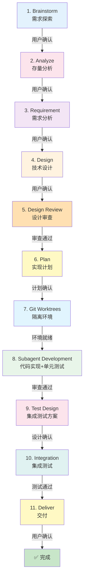
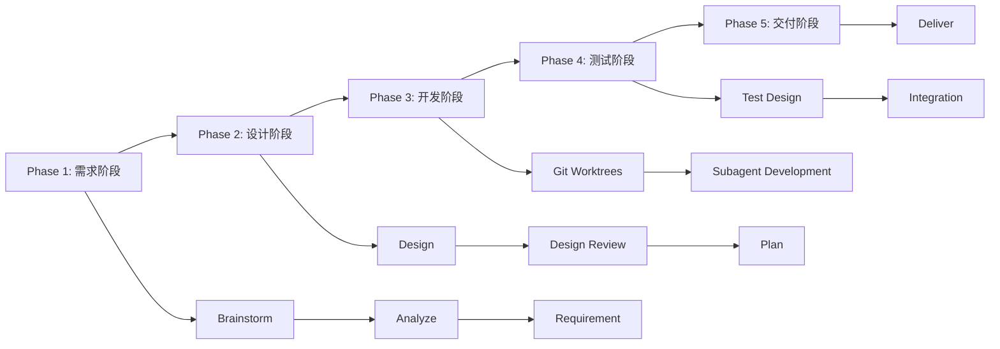
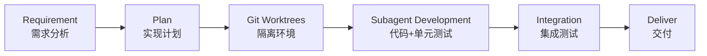
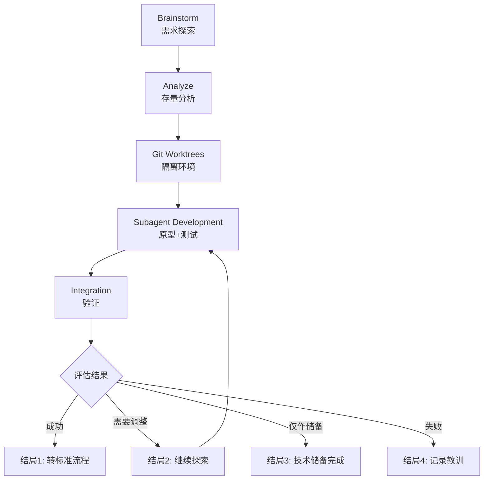
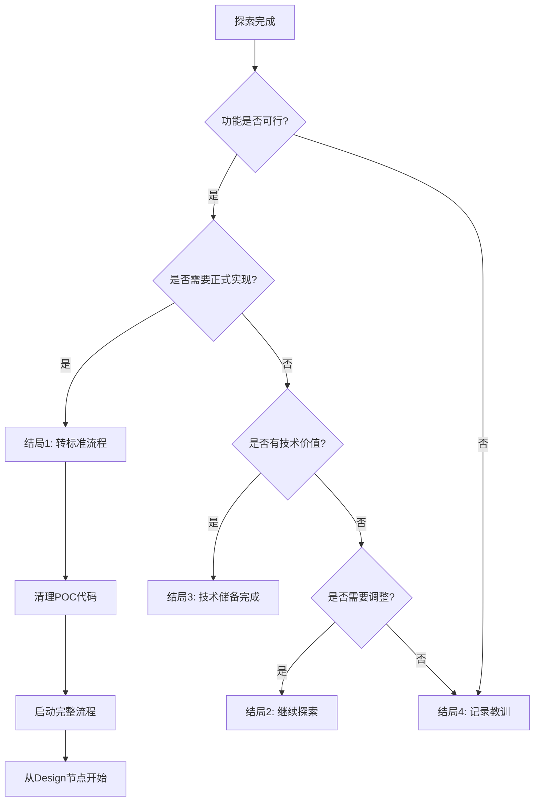
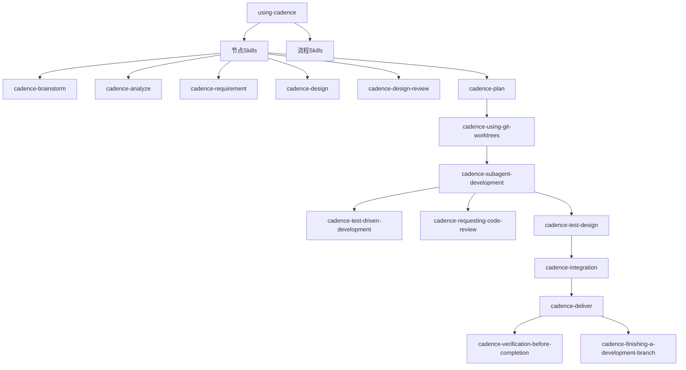

# 使用 Claude Code Skills 的 AI 自动化开发方案

> 设计日期: 2026-02-25
> 版本: v2.3（优化版）
> 设计目标: 基于 Claude Code 的 Skills 和 Subagent 能力，构建 AI 自动化开发系统

---

## 1. 概述

### 1.1 背景

**核心价值主张:**
基于 Claude Code Skills/Subagent 构建的完整开发流程自动化框架,通过标准化的节点设计,将需求探索到交付部署的全流程拆解为可独立调用、可灵活组合的模块化单元。

**适用场景:**
- 🎯 **个人开发者**: 快速实现想法,保证代码质量
- 👥 **团队协作**: 标准化流程,完整文档追溯
- 🏢 **企业级项目**: 多层审查,风险可控
- 🔬 **技术研究**: 探索验证,快速迭代

**关键优势:**
- 🧠 **减少认知负荷**: 每个节点专注一件事,AI 和人类都更聚焦
- 🛡️ **保证代码质量**: TDD + 多层审查(设计审查 + 代码审查 + 格式化审查)
- ⚡ **提高效率**: 自动化流程 + Skill 按需加载 + 支持最多 49 个并发子代理
- 📚 **知识沉淀**: 标准化产物(.claude/目录) + 版本化管理

### 1.2 设计原则

**核心原则(不可妥协):**
| 原则 | 说明 |
|------|------|
| 🎯 节点独立 | 每个节点可独立调用,不强制走完整流程 |
| ✅ 人工确认 | 每个节点完成后必须人工确认 |
| 📦 标准产物 | 每个节点生成标准化文档/代码 |
| 🔄 断点续传 | 支持会话中断后恢复进度 |
| 🧪 TDD优先 | 代码实现必须遵循测试驱动开发 |
| 🛡️ 质量保证 | 设计审查 + 代码审查 + 格式化审查 |

**优化原则(可灵活调整):**
| 原则 | 说明 |
|------|------|
| 🔀 流程灵活性 | 提供完整/快速/探索三种模式 |
| 🧩 Skill独立 | 关键能力独立为Skill,便于复用 |
| 🤖 自动化审查 | 集成Linter/Formatter自动化检查 |
| 📡 双通道调用 | 支持命令调用 + Skill工具调用 |
| 🎭 并发能力 | Subagent Development支持最多49个并发 |
| 💾 Token优化 | Skill按需加载,不占用上下文 |

### 1.3 核心特性

| 特性 | 说明 | 技术实现 |
|------|------|---------|
| **双通道调用** | 命令(`/cadence:xxx`) + Skill工具 | plugin.json配置 |
| **节点独立** | 11个核心节点,每个可独立使用 | 每个Skill独立 |
| **Skill组合** | 3个TDD/审查前置 + 7个节点Skill | Skill依赖机制 |
| **流程组合** | 3种流程模式(完整/快速/探索) | 流程Skill组合节点 |
| **人工确认** | 每个节点有人工确认机制 | 对话交互 |
| **标准产物** | 每个节点有标准化输出 | .claude/目录规范 |
| **进度追踪** | TodoWrite追踪,支持恢复 | TodoWrite工具 |
| **质量保证** | 设计审查+代码审查+TDD+格式化 | 多层验证 |
| **Subagent驱动** | 代码开发集成单元测试和审查 | Task工具调用 |
| **并发能力** | 支持最多49个并发子代理 | Task工具并发 |
| **Token优化** | Skill按需加载,不占用上下文 | Skill机制 |
| **断点续传** | 会话中断后可恢复进度 | TodoWrite持久化 |

---

## 2. 完整流程设计（11个核心节点）

### 2.1 流程概览

> **重要说明**: 实际是11个核心节点,每个节点对应一个独立Skill



**关键依赖说明:**
- 节点7(Git Worktrees)是节点8(Subagent Development的**前置Skill**
- 节点8内部强制使用TDD流程和代码审查
- 每个节点可独立调用,但完整流程有严格顺序

### 2.2 节点清单

| 序号 | 节点名称 | Skill名称 | 目的 | 输入来源 | 确认 | 产物 | 跳过条件 |
|------|---------|-----------|------|---------|------|------|---------|
| 1 | Brainstorm | cadence-brainstorm | 需求探索 | 用户对话/已有PRD | 用户确认PRD | PRD文档 | 已有PRD |
| 2 | **Analyze** ⭐ | cadence-analyze | 存量分析 | PRD/项目结构 | 用户确认分析 | 存量分析报告 | 全新项目 |
| 3 | Requirement | cadence-requirement | 需求分析 | PRD+存量分析 | 用户确认需求 | 需求文档 | 需求简单 |
| 4 | Design | cadence-design | 技术设计 | 需求+存量分析 | 用户确认方案 | 技术方案+实现计划 | - |
| 5 | Design Review | cadence-design-review | 设计审查 | 技术方案 | 审查通过 | 设计审查报告 | 极简单功能 |
| 6 | Plan | cadence-plan | 实现计划 | 技术方案 | 用户确认计划 | 实现计划文档 | - |
| 7 | Git Worktrees | cadence-using-git-worktrees | 隔离环境 | 实现计划 | 环境就绪 | Worktree目录 | 单人开发 |
| 8 | **Subagent Development** ⭐ | cadence-subagent-development | 代码实现+单元测试 | 实现计划+Worktree | 审查通过 | 业务代码+单元测试 | - |
| 9 | **Test Design** ⭐ | cadence-test-design | 集成测试方案 | 需求+技术方案+代码 | 用户确认设计 | 集成测试方案文档 | 简单功能 |
| 10 | Integration | cadence-integration | 集成测试 | 测试方案 | 测试通过 | 集成测试+报告 | 简单功能 |
| 11 | Deliver | cadence-deliver | 交付 | 测试结果 | 用户确认交付 | 交付报告 | - |

**重要说明:**
- ⭐ 标记的节点是v2.3版本的关键改进节点
- 每个节点对应一个独立Skill,可通过`Skill tool: cadence-xxx`调用
- 节点7是节点8的**前置Skill**,必须先创建隔离环境才能开发
- 节点8内部强制使用TDD流程(`cadence-test-driven-development`)和代码审查(`cadence-requesting-code-review`)

### 2.3 流程特点

#### 核心特点(与其他方案的区别)

**1. 双通道调用机制** 🆕
- **命令调用**: `/cadence:full-flow` 快速启动完整流程
- **Skill工具调用**: `Skill tool: cadence-brainstorm` 精确调用单个Skill
- **优势**: 灵活性更高,用户可选择最便捷的方式

**2. Analyze前置** ⭐
- 在需求分析(Requirement)之前先分析存量代码
- 避免重复造轮子,理解现有架构和依赖
- 这是v2.3的关键改进之一

**3. Subagent Development一体化** ⭐
- 合并了"代码开发"和"单元测试"两个节点
- 强制TDD流程(RED→GREEN→BLUE)
- 自动集成Linter/Formatter检查
- 内置Spec Review和Code Quality Review

**4. 前置Skill机制** 🆕
- Git Worktrees是Subagent Development的前置Skill
- TDD和Code Review是Subagent Development的内置流程
- 通过Skill依赖确保质量和隔离性

**5. 进度持久化**
- 使用TodoWrite记录进度,支持跨会话恢复
- 每个节点完成后更新TodoWrite状态
- 会话中断后可通过`/cadence:resume`恢复

**6. 标准化产物**
- 所有文档存放在`.claude/`目录下
- 文件命名遵循`YYYY-MM-DD_类型_名称_v版本.扩展名`格式
- 便于追溯和版本管理

#### 与v2.2版本的主要差异

| 维度 | v2.2 | v2.3 |
|------|------|------|
| 核心节点数 | 10个(标题)→11个(实际) | 11个(明确) ⭐ |
| 节点清单 | 6列 | 新增Skill名称+输入来源 ⭐ |
| 完整流程说明 | 简单 | 增加Phase划分+并行能力+详细时间范围 ⭐ |
| 快速流程 | 跳过Git Worktrees | 保留Git Worktrees ⭐ |
| 探索流程 | 简单4种结局 | 增加决策树+详细触发条件 ⭐ |
| 时间预估 | 固定值 | 动态范围(根据复杂度) ⭐ |

---

## 3. 三种流程模式

### 3.1 完整流程（Full Flow）

**适用场景:**
- 复杂功能开发(预估>2小时)
- 团队协作项目(需要完整文档)
- 企业级应用(需要设计审查)
- 涉及存量代码改造(需要Analyze节点)
- 需要完整追溯(需要所有产物)

**流程执行顺序:**



**详细节点清单(11个节点):**

| Phase | 节点 | 可否并行 | 依赖节点 | 预估时间(动态) |
|-------|------|---------|---------|---------------|
| Phase 1 | 1. Brainstorm | ❌ | 无 | 15-30分钟 |
| Phase 1 | 2. Analyze | ❌ | Brainstorm | 20-40分钟 |
| Phase 1 | 3. Requirement | ❌ | Analyze | 15-30分钟 |
| Phase 2 | 4. Design | ❌ | Requirement | 30-60分钟 |
| Phase 2 | 5. Design Review | ❌ | Design | 15-30分钟 |
| Phase 2 | 6. Plan | ❌ | Design Review | 10-20分钟 |
| Phase 3 | 7. Git Worktrees | ❌ | Plan | 5分钟 |
| Phase 3 | 8. Subagent Development | ✅ | Git Worktrees | 60-180分钟(根据任务数) |
| Phase 4 | 9. Test Design | ❌ | Subagent Development | 15-30分钟 |
| Phase 4 | 10. Integration | ✅ | Test Design | 20-40分钟 |
| Phase 5 | 11. Deliver | ❌ | Integration | 10-20分钟 |

**总预估时间:** 根据功能复杂度动态调整

| 复杂度 | 代码量预估 | 总时间范围 |
|--------|-----------|-----------|
| 🟢 简单 | <500行 | 3-4小时 |
| 🟡 中等 | 500-2000行 | 4-7小时 |
| 🔴 复杂 | >2000行 | 7-12小时 |

**并行执行能力:**
- ✅ **Subagent Development可并行**: 如果实现计划中有多个独立任务,可启动多个并发Subagent
- ✅ **Integration可并行**: 如果测试方案中有多个独立测试场景,可并行执行
- ❌ **其他节点必须顺序执行**: 由于依赖关系,必须按顺序完成

**调用方式:**
```bash
# 方式1: 命令调用(推荐)
/cadence:full-flow

# 方式2: Skill工具调用
Skill tool: cadence-full-flow

# 方式3: 手动逐个调用
Skill tool: cadence-brainstorm
# ... 等待用户确认后 ...
Skill tool: cadence-analyze
# ... 依此类推 ...
```

**重要提示:**
- 📌 每个节点完成后必须人工确认才能进入下一节点
- 📌 Subagent Development节点内部强制使用TDD流程和代码审查
- 📌 如果中途会话中断,可使用`/cadence:resume`恢复进度

---

### 3.2 快速流程（Quick Flow）

**适用场景:**
- 简单功能(预估<2小时能完成)
- 需求明确(不需要Brainstorm探索)
- 个人项目(不需要完整文档)
- 紧急修复(需要快速上线)
- 全新模块(不涉及存量代码)

**流程精简逻辑:**



**精简说明:**
- ✅ **保留Requirement**: 即使简单功能,也需要明确需求
- ✅ **保留Plan**: 避免无计划开发
- ✅ **保留Git Worktrees**: 即使单人开发,也建议隔离环境
- ✅ **保留Subagent Development**: 核心开发节点,包含TDD和审查
- ✅ **保留Integration**: 必须验证功能正常
- ✅ **保留Deliver**: 记录变更清单

- ❌ **跳过Brainstorm**: 需求明确,不需要探索
- ❌ **跳过Analyze**: 不涉及存量代码
- ❌ **跳过Design**: 简单功能,直接编码即可
- ❌ **跳过Design Review**: 极简单设计,无需正式审查
- ❌ **跳过Test Design**: 直接写集成测试,无需正式方案

**详细节点清单(6个节点):**

| 节点 | 预估时间 | 精简内容 |
|------|---------|---------|
| Requirement | 10-15分钟 | 简化需求文档,只记录核心需求 |
| Plan | 5-10分钟 | 简单任务分解,2-5个任务即可 |
| Git Worktrees | 5分钟 | 创建feature分支 |
| Subagent Development | 30-90分钟 | TDD流程 + 代码审查 |
| Integration | 10-20分钟 | 简单集成测试 |
| Deliver | 5分钟 | 变更清单 |

**总预估时间:** 根据功能复杂度动态调整

| 复杂度 | 代码量预估 | 总时间范围 |
|--------|-----------|-----------|
| 🟢 极简单 | <200行 | 45-75分钟 |
| 🟡 简单 | 200-500行 | 75-140分钟 |

**调用方式:**
```bash
# 方式1: 命令调用(推荐)
/cadence:quick-flow

# 方式2: Skill工具调用
Skill tool: cadence-quick-flow
```

**风险提示:**
- ⚠️ 跳过Design可能导致技术方案不完整,建议预估时间>2小时的功能不要使用快速流程
- ⚠️ 跳过Analyze可能导致重复造轮子,建议涉及现有代码的功能不要使用快速流程
- ⚠️ 跳过Design Review可能导致设计缺陷,建议企业级项目不要使用快速流程

---

### 3.3 探索流程（Exploration Flow）

**适用场景:**
- 不确定的需求(需要快速验证想法)
- 技术研究(评估技术可行性)
- 原型开发(POC验证)
- 实验性功能(可能不会正式上线)
- 学习新技术(边做边学)

**流程特点:**



**关键特点:**
- ✅ **允许迭代**: 可以多次循环Subagent Development → Integration → 评估
- ✅ **原型可以不完整**: 不要求100%功能完整
- ✅ **随时可以停止**: 探索失败也可以记录经验
- ✅ **成功后可选择完整实现**: 探索成功后可转标准流程

**详细节点清单(5个节点):**

| 节点 | 预估时间 | 探索模式特点 |
|------|---------|-------------|
| Brainstorm | 20-40分钟 | 允许需求不明确,边探索边调整 |
| Analyze | 10-20分钟 | 简化分析,只关注关键技术点 |
| Git Worktrees | 5分钟 | 创建poc/xxx分支 |
| Subagent Development | 30-60分钟 | 原型代码 + 基础测试 |
| Integration | 10-20分钟 | 验证核心功能 |

**总预估时间:** 根据探索迭代次数动态调整

| 探索深度 | 迭代次数 | 总时间范围 |
|---------|---------|-----------|
| 🟢 浅层探索 | 1次 | 75-145分钟 |
| 🟡 中层探索 | 2-3次 | 2-4小时 |
| 🔴 深层探索 | >3次 | 4-8小时 |

**调用方式:**
```bash
# 方式1: 命令调用(推荐)
/cadence:exploration-flow

# 方式2: Skill工具调用
Skill tool: cadence-exploration-flow
```

**探索结局决策树:**



**4种结局说明:**

| 结局 | 触发条件 | 后续动作 | 产物 |
|------|---------|---------|------|
| **结局1: 转标准流程** | 功能可行 + 需要正式实现 | 清理POC代码 → 启动完整流程(从Design开始) | POC报告 + 技术方案 |
| **结局2: 继续探索** | 功能可行但需要调整 | 调整需求 → 再次循环Subagent Development | 迭代记录 |
| **结局3: 技术储备完成** | 功能可行但暂不需要 | 清理POC代码 → 记录技术方案到.claude/docs/ | 技术储备文档 |
| **结局4: 记录教训** | 功能不可行 | 清理POC代码 → 记录失败原因和教训 | 失败分析报告 |

**重要提示:**
- 📌 探索流程允许失败,失败也是宝贵经验
- 📌 原型代码质量要求较低,但必须能验证核心想法
- 📌 探索成功后,如果需要正式实现,建议从Design节点开始(而不是直接使用POC代码)
- 📌 探索流程的产物可能不是最终代码,而是技术验证报告

---

## 4. 节点详细设计（v2.3 优化版）

> **v2.3 优化说明**:
> - 新增 Skill 关联（每个节点 → Skill 文件路径）
> - 新增动态时间预估（根据功能复杂度）
> - 新增关键检查清单（每个节点必须检查的项目）
> - 新增 Red Flags（防止错误使用的提醒）

---

### 4.1 节点1：Brainstorm（需求探索）

#### Skill 关联
```yaml
Skill: cadence-brainstorm
路径: skills/cadence-brainstorm/SKILL.md
触发关键词: "需求不明确", "想做个", "可能需要", "头脑风暴"
```

#### 目的
通过对话式探索，生成简要的PRD或需求说明。

#### 输入来源
1. 用户对话：用户描述想做什么功能
2. 已有文档：如果已有 PRD，则跳过此节点
3. 无输入：全新项目，从零开始探索

#### 动态时间预估

| 复杂度 | 时间范围 | 说明 |
|-------|---------|------|
| 🟢 简单 | 10-15分钟 | 需求较明确，对话轮数少 |
| 🟡 中等 | 15-30分钟 | 需求较复杂，需要多轮对话 |
| 🔴 复杂 | 30-60分钟 | 需求不明确，需要深入探索 |

#### 输出产物
**文件：** `.claude/docs/{date}_PRD_{功能名称}_v1.0.md`

#### 关键检查清单 ✅

```
□ 核心功能：是否清晰描述了要解决的核心问题？
□ 用户故事：是否包含主要用户故事（3-5条）？
□ 验收标准：是否包含可验证的验收标准？
□ 边界条件：是否识别了主要边界条件和异常场景？
□ 依赖说明：是否说明了与现有系统的关系？
□ 优先级：是否区分了核心功能和扩展功能？
```

#### Red Flags ⚠️

| 错误做法 | 正确做法 |
|---------|---------|
| ❌ 只记录功能点，忽略用户故事 | ✅ 优先理解用户想要完成的任务 |
| ❌ 跳过验收标准，直接进入设计 | ✅ 必须有可验证的验收标准 |
| ❌ 在需求不明确时强行进入下一阶段 | ✅ 需求明确后才能确认 |

#### 确认机制
```
生成 PRD 后：
展示需求要点（3-5 条核心需求）
询问："这是您想实现的功能吗？"
├── ✅ 是 → 保存产物，进入 analyze
├── ⚠️ 需要调整 → 继续对话，调整需求
└── ❌ 不是 → 重新开始 brainstorm
```

#### 跳过条件
- 已存在 PRD 或需求文档
- 用户明确表示不需要

---

### 4.2 节点2：Analyze（存量分析）⭐

#### Skill 关联
```yaml
Skill: cadence-analyze
路径: skills/cadence-analyze/SKILL.md
触发关键词: "分析现有代码", "存量代码", "理解现有架构"
```

#### 目的
在需求设计和方案设计之前，分析存量代码，理解现有架构和依赖关系。这是**需求分析的先决条件**。

#### 输入来源
1. 自动读取：brainstorm 阶段的 PRD（了解要做什么功能）
2. 用户指定：用户指定要分析的模块或文件
3. 对话输入：用户描述要分析的内容
4. 项目结构：自动扫描项目目录结构

#### 动态时间预估

| 复杂度 | 时间范围 | 说明 |
|-------|---------|------|
| 🟢 简单 | 10-20分钟 | 单一模块，无复杂依赖 |
| 🟡 中等 | 20-40分钟 | 多模块，少量外部依赖 |
| 🔴 复杂 | 40-80分钟 | 多系统交互，大量存量代码 |

#### 输出产物
**文件：** `.claude/docs/{date}_存量分析_{模块名称}_v1.0.md`

#### 关键检查清单 ✅

```
□ 架构概览：是否清晰描述了现有系统架构？
□ 核心模块：是否识别了需要修改的核心模块？
□ 依赖关系：是否分析了模块间的依赖关系？
□ 接口清单：是否列出了需要适配的接口？
□ 技术约束：是否识别了技术债务和限制？
□ 风险提示：是否标注了潜在风险点？
```

#### Red Flags ⚠️

| 错误做法 | 正确做法 |
|---------|---------|
| ❌ 跳过 Analyze 直接做 Design | ✅ 必须先理解现有代码再做设计 |
| ❌ 只分析表面代码，忽略深层依赖 | ✅ 需要深入理解数据流和调用链 |
| ❌ 在未完全理解存量时强行设计 | ✅ 有疑问时及时与用户确认 |

#### 确认机制
```
生成存量分析后：
展示关键发现（3-5 个）
展示需要改动的文件清单
展示技术约束和风险提示

询问："分析是否准确？有没有遗漏？"
├── ✅ 准确 → 保存产物，进入 requirement
├── ⚠️ 有遗漏 → 补充分析
└── ❌ 不对 → 重新分析
```

#### 跳过条件
- 全新项目（无存量代码）
- 独立模块（不涉及现有代码）
- 用户明确表示不需要

---

### 4.3 节点3：Requirement（需求分析）

#### Skill 关联
```yaml
Skill: cadence-requirement
路径: skills/cadence-requirement/SKILL.md
触发关键词: "需求分析", "详细需求", "业务规则"
```

#### 目的
基于 PRD 和存量分析，进行详细的需求分析，生成完整的需求文档。

#### 输入来源
1. 自动读取：
   - brainstorm 阶段的 PRD
   - **analyze 阶段的存量分析报告**
2. 用户指定：用户提供已有的 PRD 路径
3. 对话输入：用户直接描述需求

#### 动态时间预估

| 复杂度 | 时间范围 | 说明 |
|-------|---------|------|
| 🟢 简单 | 10-15分钟 | 功能单一，规则明确 |
| 🟡 中等 | 15-30分钟 | 功能较多，需要详细规则 |
| 🔴 复杂 | 30-60分钟 | 复杂业务，众多边界条件 |

#### 输出产物
**文件：** `.claude/docs/{date}_需求文档_{功能名称}_v1.0.md`

#### 关键检查清单 ✅

```
□ 功能清单：是否列出了所有功能点？
□ 用户故事：是否包含完整的用户故事？
□ 业务流程：是否绘制了核心业务流程图？
□ 数据模型：是否定义了核心数据结构？
□ 边界条件：是否识别了所有边界和异常？
□ 验收标准：每个功能是否有可测试的验收标准？
□ 存量复用：是否规划了存量代码的复用方式？
```

#### Red Flags ⚠️

| 错误做法 | 正确做法 |
|---------|---------|
| ❌ 没有 Analyze 就做 Requirement | ✅ 必须先完成 Analyze |
| ❌ 验收标准模糊，无法测试 | ✅ 验收标准必须可验证 |
| ❌ 忽略存量代码的改造影响 | ✅ 需要评估存量影响 |

#### 确认机制
```
生成需求文档后：
展示需求文档摘要
展示验收标准清单
展示存量代码复用计划

询问："需求是否完整？有没有遗漏？"
├── ✅ 完整 → 保存产物，进入 design
├── ⚠️ 有遗漏 → 补充需求
└── ❌ 不对 → 重新分析
```

---

### 4.4 节点4：Design（技术设计）

#### Skill 关联
```yaml
Skill: cadence-design
路径: skills/cadence-design/SKILL.md
触发关键词: "技术设计", "技术方案", "架构设计"
```

#### 目的
基于需求文档和存量分析，设计技术方案和实现计划。

#### 输入来源
1. 自动读取：
   - requirement 阶段的需求文档
   - analyze 阶段的存量分析报告
2. 用户指定：用户提供需求文档路径
3. 对话输入：用户描述需求和技术约束

#### 动态时间预估

| 复杂度 | 时间范围 | 说明 |
|-------|---------|------|
| 🟢 简单 | 15-30分钟 | 单层架构，直接实现 |
| 🟡 中等 | 30-60分钟 | 多层架构，需要详细设计 |
| 🔴 复杂 | 60-120分钟 | 分布式架构，系统交互复杂 |

#### 输出产物

**文件1：** `.claude/designs/{date}_技术方案_{功能名称}_v1.0.md`

**文件2：** `.claude/designs/{date}_实现计划_{功能名称}_v1.0.md`

#### 关键检查清单 ✅

```
□ 架构设计：是否包含系统架构图和模块划分？
□ 数据模型：是否设计了核心数据结构和关系？
□ API设计：是否定义了接口规范（请求/响应/错误码）？
□ 流程设计：是否绘制了核心业务序列图？
□ 存量改造：是否规划了存量代码的改造方案？
□ 技术选型：是否说明了技术选型的理由？
□ 风险评估：是否标注了技术风险和应对措施？
```

#### Red Flags ⚠️

| 错误做法 | 正确做法 |
|---------|---------|
| ❌ 没有 Requirement 就做 Design | ✅ 必须先完成 Requirement |
| ❌ 技术方案过于笼统 | ✅ 需要足够详细才能指导开发 |
| ❌ 忽略存量代码的影响 | ✅ 必须考虑存量改造 |

#### 确认机制
```
生成技术方案后：
展示技术方案摘要
展示关键决策
展示存量代码改造计划

询问："这个技术方案可行吗？有什么要调整的？"
├── ✅ 可行 → 保存产物，进入 design-review
├── ⚠️ 需要调整 → 修改方案
└── ❌ 不可行 → 重新设计
```

---

### 4.5 节点5：Design Review（设计审查）

#### Skill 关联
```yaml
Skill: cadence-design-review
路径: skills/cadence-design-review/SKILL.md
触发关键词: "审查设计", "设计审查", "架构审查"
```

#### 目的
对技术方案进行系统性审查，确保方案的可行性、完整性，安全性。

#### 审查维度

| 维度 | 优先级 | 检查要点 |
|-----|-------|---------|
| **架构审查** | P0 | 分层、职责、依赖、模式 |
| **数据模型审查** | P0 | 表结构、索引、约束 |
| **API 设计审查** | P0 | RESTful、幂等性、版本控制 |
| **安全审查** | P0 | 权限验证、注入防护、加密 |
| **性能审查** | P1 | N+1 查询、缓存、索引 |
| **可维护性审查** | P1 | 规范、文档、测试 |
| **兼容性审查** | P2 | 向后兼容、迁移方案 |
| **风险评估** | P1 | 识别风险、评估影响 |

#### 动态时间预估

| 复杂度 | 时间范围 | 说明 |
|-------|---------|------|
| 🟢 简单 | 10-15分钟 | 架构简单，快速审查 |
| 🟡 中等 | 15-30分钟 | 多模块，需要详细审查 |
| 🔴 复杂 | 30-60分钟 | 复杂架构，全面审查 |

#### 输出产物
**文件：** `.claude/docs/{date}_设计审查_{功能名称}_v1.0.md`

#### 关键检查清单 ✅

```
□ P0 必须修复：
  □ 架构是否合理？是否符合项目规范？
  □ 数据模型是否完整？是否有冗余？
  □ API设计是否规范？是否考虑版本？
  □ 安全措施是否到位？

□ P1 建议修复：
  □ 性能是否考虑？是否有优化空间？
  □ 代码是否可维护？是否有清晰结构？

□ P2 可选优化：
  □ 兼容性是否考虑？
  □ 风险是否有预案？
```

#### Red Flags ⚠️

| 错误做法 | 正确做法 |
|---------|---------|
| ❌ 跳过 Design Review 进入开发 | ✅ 设计审查是质量保证关键环节 |
| ❌ 只关注功能，忽略安全 | ✅ 安全审查是必须的 |
| ❌ 发现问题不修复就继续 | ✅ 必须修复 P0 问题 |

#### 确认机制
```
设计审查后：
展示审查结果摘要
必须修复问题：X 个（P0）
建议优化问题：Y 个（P1/P2）

询问："如何处理审查结果？"
├── ✅ 立即修复必须问题 → 修改技术方案，重新审查
├── ⚠️ 标记为技术债务 → 记录问题，进入下一阶段
└── ❌ 设计不可行 → 返回 design 重新设计
```

#### 跳过条件
- 极简单功能（无需正式审查）
- 原型开发（探索阶段）
- 用户明确表示不需要

---

### 4.6 节点6：Plan（实现计划）

#### Skill 关联
```yaml
Skill: cadence-plan
路径: skills/cadence-plan/SKILL.md
触发关键词: "实现计划", "任务分解", "开发计划"
```

#### 目的
基于技术方案，制定详细的实现计划，包括任务分解、依赖关系、优先级排序。

#### 动态时间预估

| 复杂度 | 时间范围 | 说明 |
|-------|---------|------|
| 🟢 简单 | 5-10分钟 | 3-5个任务 |
| 🟡 中等 | 10-20分钟 | 5-10个任务 |
| 🔴 复杂 | 20-40分钟 | 10+个任务 |

#### 输出产物
**文件：** `.claude/designs/{date}_实现计划_{功能名称}_v1.0.md`

#### 关键检查清单 ✅

```
□ 任务完整：是否覆盖了所有功能点？
□ 依赖清晰：任务间依赖是否明确？
□ 可执行性：每个任务是否可独立完成？
□ 时间估计：每个任务是否有合理的时间估计？
□ 优先级：任务是否有优先级排序？
□ 验收标准：每个任务是否有明确的验收标准？
```

#### Red Flags ⚠️

| 错误做法 | 正确做法 |
|---------|---------|
| ❌ 任务粒度过大 | ✅ 任务应该可独立执行和验收 |
| ❌ 忽略任务依赖 | ✅ 必须明确任务间的依赖关系 |
| ❌ 没有验收标准 | ✅ 每个任务必须有可测试的验收标准 |

#### 确认机制
```
生成实现计划后：
展示任务清单
展示任务依赖关系
询问："实现计划是否合理？"
├── ✅ 合理 → 保存产物，进入 git-worktrees
├── ⚠️ 需要调整 → 调整计划
└── ❌ 不可行 → 重新设计
```

---

### 4.7 节点7：Git Worktrees（隔离环境）

#### Skill 关联
```yaml
Skill: cadence-using-git-worktrees
路径: skills/cadence-using-git-worktrees/SKILL.md
触发关键词: "隔离环境", "worktree", "分支"
前置要求: 必须先完成 Plan 节点
```

#### 目的
创建隔离的开发环境，使用 git worktree 避免污染主分支。

#### 动态时间预估

| 场景 | 时间范围 | 说明 |
|-----|---------|------|
| 🟢 标准 | 5分钟 | 常规创建 |
| 🟡 复杂 | 5-10分钟 | 需要清理或处理冲突 |

#### 输出产物

**产物1：** Git worktree 目录

**文件：** `.claude/state/worktree.json`

```json
{
  "project": "功能名称",
  "main_branch": "main",
  "worktree_branch": "feature/xxx",
  "worktree_path": "../workspace/xxx",
  "created_at": "2026-02-25T10:00:00Z"
}
```

#### 关键检查清单 ✅

```
□ 分支创建：是否创建了新的 feature 分支？
□ Worktree路径：worktree 路径是否合理（建议 ../workspace/xxx）？
□ 主分支状态：主分支是否是最新的？
□ 冲突检查：是否有未解决的冲突？
□ 环境验证：worktree 是否可以正常开发？
```

#### Red Flags ⚠️

| 错误做法 | 正确做法 |
|---------|---------|
| ❌ 直接在主分支开发 | ✅ 必须使用 worktree 隔离 |
| ❌ worktree 路径与主项目混用 | ✅ 建议使用独立目录 |
| ❌ 不验证 worktree 可用性 | ✅ 必须验证环境就绪 |

#### 确认机制
```
创建 worktree 后：
展示分支信息
展示工作目录路径
询问："环境是否就绪？"
├── ✅ 是 → 进入 subagent-development
├── ⚠️ 需要调整 → 调整环境
└── ❌ 失败 → 重新创建
```

#### 跳过条件
- 用户明确不需要
- 单人开发模式

---

### 4.8 节点8：Subagent Development（代码实现+单元测试）⭐

#### Skill 关联
```yaml
Skill: cadence-subagent-development
路径: skills/cadence-subagent-development/SKILL.md
前置Skill:
  - cadence-using-git-worktrees  # 必须先创建隔离环境
  - cadence-test-driven-development  # TDD 流程
  - cadence-requesting-code-review   # 审查流程
触发关键词: "写代码", "实现功能", "开发"
```

#### 目的
使用 Subagent 开发代码，遵循 TDD 流程，同时编写单元测试，并进行代码质量审查。

#### 动态时间预估

| 复杂度 | 时间范围 | 说明 |
|-------|---------|------|
| 🟢 简单 | 30-60分钟 | 1-3个任务 |
| 🟡 中等 | 60-120分钟 | 3-5个任务 |
| 🔴 复杂 | 120-240分钟 | 5+个任务（可并行） |

#### 前置 Skill（必须）

```yaml
required_skills:
  - cadence-using-git-worktrees   # 必须先创建隔离环境
  - cadence-test-driven-development  # TDD 流程
  - cadence-requesting-code-review   # 审查流程
```

#### 关键检查清单 ✅

```
□ TDD 流程：
  □ 是否先写测试（RED阶段）？
  □ 是否实现最小代码通过测试（GREEN阶段）？
  □ 是否重构代码（BLUE阶段）？

□ 代码质量：
  □ 是否通过 lint 检查？
  □ 是否通过 format 检查？
  □ 单元测试覆盖率是否达标？

□ 代码审查：
  □ 是否进行了代码审查？
  □ 是否修复了审查发现的问题？

□ 实现完整性：
  □ 是否实现了所有验收标准？
  □ 是否有遗漏的功能点？
```

#### Red Flags ⚠️

| 错误做法 | 正确做法 |
|---------|---------|
| ❌ 没有 worktree 直接开发 | ✅ 必须先创建隔离环境 |
| ❌ 先写代码后写测试 | ✅ 必须遵循 TDD 流程 |
| ❌ 跳过代码审查 | ✅ 每次提交都必须审查 |
| ❌ 实现与需求不符 | ✅ 必须验证验收标准 |
| ❌ 多个 Subagent 同时开发同一任务 | ✅ 必须顺序执行避免冲突 |

#### 确认机制
```
Subagent 开发后：
展示实现的功能点
展示测试结果（通过/失败）
展示 linting 结果

询问："是否按照需求实现了所有功能？代码质量是否达标？"
├── ✅ 是 → 保存代码，进入 test-design
├── ⚠️ 有问题 → 修复代码
└── ❌ 不符合 → 重新实现
```

---

### 4.9 节点9：Test Design（集成测试方案）⭐

#### Skill 关联
```yaml
Skill: cadence-test-design
路径: skills/cadence-test-design/SKILL.md
前置Skill: cadence-subagent-development  # 必须先完成开发
触发关键词: "集成测试", "测试方案", "端到端测试"
```

#### 目的
基于需求文档、技术方案和已实现的代码，设计**集成测试方案**。

#### 动态时间预估

| 复杂度 | 时间范围 | 说明 |
|-------|---------|------|
| 🟢 简单 | 10-15分钟 | 3-5个测试用例 |
| 🟡 中等 | 15-30分钟 | 5-10个测试用例 |
| 🔴 复杂 | 30-60分钟 | 10+个测试用例 |

#### 输入来源
1. 自动读取：
   - requirement 阶段的需求文档
   - design 阶段的技术方案
   - subagent-development 阶段的业务代码和单元测试
2. 用户指定：用户提供测试范围
3. 对话输入：用户描述测试要求

#### 关键检查清单 ✅

```
□ 测试策略：
  □ 是否定义了测试目标和范围？
  □ 是否选择了合适的测试类型？

□ 测试用例：
  □ 核心业务流程是否都有测试覆盖？
  □ 边界条件和异常场景是否覆盖？
  □ 与存量系统的集成是否测试？

□ 测试数据：
  □ 测试数据是否准备就绪？
  □ 是否有测试数据构造方案？

□ 覆盖率：
  □ 是否规划了覆盖率目标？
  □ 是否有遗漏的关键路径？
```

#### Red Flags ⚠️

| 错误做法 | 正确做法 |
|---------|---------|
| ❌ 跳过 Subagent Development 直接测试 | ✅ 必须先完成代码开发 |
| ❌ 只测试 happy path | ✅ 必须测试边界和异常 |
| ❌ 忽略与存量系统的集成 | ✅ 必须包含集成测试 |

#### 确认机制
```
生成集成测试方案后：
展示测试策略
展示集成测试用例清单
询问："测试方案是否完整？"
├── ✅ 完整 → 保存产物，进入 integration
├── ⚠️ 需要调整 → 调整方案
└── ❌ 不可行 → 重新设计
```

#### 跳过条件
- 极简单功能（无需正式集成测试方案）
- 原型开发（探索阶段）
- 用户明确表示不需要

---

### 4.10 节点10：Integration（集成测试）

#### Skill 关联
```yaml
Skill: cadence-integration
路径: skills/cadence-integration/SKILL.md
前置Skill: cadence-test-design  # 必须先完成测试设计
触发关键词: "测试", "验证", "集成测试"
```

#### 目的
根据集成测试方案执行集成测试，验证模块间协作和端到端功能。

#### 动态时间预估

| 复杂度 | 时间范围 | 说明 |
|-------|---------|------|
| 🟢 简单 | 10-20分钟 | 少量测试用例 |
| 🟡 中等 | 20-40分钟 | 中等测试用例 |
| 🔴 复杂 | 40-80分钟 | 大量测试用例 |

#### 输出产物

**产物1：集成测试代码**

**产物2：集成测试报告**

**文件：** `.claude/docs/{date}_集成测试_{功能名称}_v1.0.md`

#### 关键检查清单 ✅

```
□ 测试执行：
  □ 是否执行了所有测试用例？
  □ 测试结果是否符合预期？

□ 问题修复：
  □ 失败的测试是否都已修复？
  □ 是否进行了回归测试？

□ 性能测试（可选）：
  □ 是否进行了性能测试？
  □ 性能指标是否达标？

□ 报告生成：
  □ 是否生成了测试报告？
  □ 覆盖率是否达标？
```

#### Red Flags ⚠️

| 错误做法 | 正确做法 |
|---------|---------|
| ❌ 跳过 Test Design 直接测试 | ✅ 必须先有测试方案 |
| ❌ 忽略失败的测试 | ✅ 所有测试必须通过 |
| ❌ 没有回归测试 | ✅ 修改后必须回归测试 |

#### 确认机制
```
集成测试后：
展示集成测试结果
展示性能测试结果

询问："集成是否成功？失败场景是否需要修复？"
├── ✅ 成功 → 保存测试，进入 deliver
├── ⚠️ 有问题 → 修复问题
└── ❌ 失败 → 返回 subagent-development 重新实现
```

---

### 4.11 节点11：Deliver（交付）

#### Skill 关联
```yaml
Skill: cadence-deliver
路径: skills/cadence-deliver/SKILL.md
前置Skill: cadence-integration  # 必须先完成集成测试
触发关键词: "交付", "部署", "发布"
```

#### 目的
准备交付，生成完整的交付报告和部署文档。

#### 动态时间预估

| 复杂度 | 时间范围 | 说明 |
|-------|---------|------|
| 🟢 简单 | 5-10分钟 | 简单变更清单 |
| 🟡 中等 | 10-20分钟 | 完整交付报告 |
| 🔴 复杂 | 20-30分钟 | 详细部署文档 |

#### 输出产物
**文件：** `.claude/docs/{date}_交付报告_{功能名称}_v1.0.md`

#### 关键检查清单 ✅

```
□ 功能清单：
  □ 是否列出了所有实现的功能？
  □ 是否有功能状态标记（完成/部分/未完成）？

□ 测试结果：
  □ 是否包含单元测试结果？
  □ 是否包含集成测试结果？

□ 代码质量：
  □ 是否通过 lint 检查？
  □ 覆盖率是否达标？

□ 部署准备：
  □ 是否有部署检查清单？
  □ 是否有回滚方案？

□ 文档完整：
  □ 是否更新了相关文档？
  □ 是否有变更记录？
```

#### Red Flags ⚠️

| 错误做法 | 正确做法 |
|---------|---------|
| ❌ 没有通过 Integration 就交付 | ✅ 必须先完成集成测试 |
| ❌ 跳过 lint 检查 | ✅ 必须通过 lint 检查 |
| ❌ 没有备份就部署 | ✅ 必须有回滚方案 |

#### 确认机制
```
准备交付：
展示功能清单
展示测试结果
询问："是否可以交付？"
├── ✅ 可以 → 生成交付报告，完成
├── ⚠️ 有问题 → 返回修复
└── ❌ 不行 → 取消交付
```

---

## 5. 进度追踪机制（v2.3 优化）

### 5.1 使用 TodoWrite 追踪

```bash
# 查看当前进度
/cadence:status

# 恢复进度
/cadence:resume
```

### 5.2 TodoWrite 结构

```
## 当前任务

### 项目：用户权限管理系统
### 流程：完整流程（11节点）
### 当前阶段：Subagent Development

✅ 已完成：
- [x] Brainstorm - PRD 已生成
- [x] Analyze - 存量分析已完成
- [x] Requirement - 需求文档已生成
- [x] Design - 技术方案已生成
- [x] Design Review - 设计审查已通过
- [x] Plan - 实现计划已确认
- [x] Git Worktrees - 环境已创建

🔄 进行中：
- [ ] Subagent Development（Task 3/5）
  - [x] Task 1: 创建用户模型
  - [x] Task 2: 实现用户CRUD
  - [ ] Task 3: 实现权限分配 ← 当前
  - [ ] Task 4: 实现角色管理
  - [ ] Task 5: 实现权限验证

⏳ 待完成：
- [ ] Test Design
- [ ] Integration
- [ ] Deliver
```

### 5.3 断点续传

```bash
# 会话中断后，恢复进度
/cadence:resume
```

**恢复逻辑：**
1. 检查 TodoWrite 状态
2. 读取当前进度
3. 询问用户是否继续
4. 从最后一个未完成节点继续

---

## 6. Skills 目录结构（v2.3 优化版）

> **v2.3 优化说明**:
> - 增加每个Skill的详细说明(文件列表、用途)
> - 参考superpowers结构优化目录组织
> - 增加技能分类和依赖关系

### 6.1 目录结构总览

```
cadence-skills/                          # Cadence技能包根目录
├── .claude-plugin/                      # 插件配置
│   ├── plugin.json                       # Skill注册配置
│   └── marketplace.json                  # 市场配置
│
├── agents/                               # Subagent定义
│   ├── implementer.md                    # 实现者Agent
│   ├── spec-reviewer.md                  # 规范审查Agent
│   └── code-quality-reviewer.md          # 代码质量审查Agent
│
├── skills/                               # Skills目录
│   ├── # 🧬 元Skill（核心入口）
│   ├── using-cadence/
│   │   ├── SKILL.md                      # 入口Skill定义
│   │   └── README.md                     # 使用说明
│   │
│   ├── # 🔧 前置Skill（必须调用）
│   ├── cadence-using-git-worktrees/
│   │   ├── SKILL.md                      # Skill定义
│   │   ├── README.md                     # 使用说明
│   │   └── examples.md                   # 示例
│   │
│   ├── cadence-test-driven-development/
│   │   ├── SKILL.md                      # Skill定义
│   │   ├── README.md                     # TDD流程说明
│   │   └── testing-anti-patterns.md      # 测试反模式
│   │
│   ├── cadence-requesting-code-review/
│   │   ├── SKILL.md                      # Skill定义
│   │   ├── README.md                     # 审查流程说明
│   │   └── code-reviewer.md              # 审查清单
│   │
│   ├── # 📋 节点Skills（11个节点）
│   ├── cadence-brainstorm/
│   │   └── SKILL.md                      # 需求探索
│   │
│   ├── cadence-analyze/
│   │   └── SKILL.md                      # 存量分析
│   │
│   ├── cadence-requirement/
│   │   └── SKILL.md                      # 需求分析
│   │
│   ├── cadence-design/
│   │   └── SKILL.md                      # 技术设计
│   │
│   ├── cadence-design-review/
│   │   └── SKILL.md                      # 设计审查
│   │
│   ├── cadence-plan/
│   │   └── SKILL.md                      # 实现计划
│   │
│   ├── cadence-subagent-development/
│   │   ├── SKILL.md                      # Skill定义
│   │   ├── implementer-prompt.md          # 实现者Prompt
│   │   ├── spec-reviewer-prompt.md        # 规范审查Prompt
│   │   └── code-quality-reviewer-prompt.md # 代码质量Prompt
│   │
│   ├── cadence-test-design/
│   │   └── SKILL.md                      # 集成测试方案
│   │
│   ├── cadence-integration/
│   │   └── SKILL.md                      # 集成测试
│   │
│   ├── cadence-deliver/
│   │   └── SKILL.md                      # 交付
│   │
│   ├── # 🔀 流程Skills（组合节点）
│   ├── cadence-full-flow/
│   │   └── SKILL.md                      # 完整流程
│   │
│   ├── cadence-quick-flow/
│   │   └── SKILL.md                      # 快速流程
│   │
│   ├── cadence-exploration-flow/
│   │   └── SKILL.md                      # 探索流程
│   │
│   └── # ✅ 支持Skills
│       ├── cadence-verification-before-completion/
│       │   └── SKILL.md                  # 交付前验证
│       │
│       └── cadence-finishing-a-development-branch/
│           └── SKILL.md                  # 完成开发分支
│
├── commands/                             # 命令定义
│   ├── brainstorm.md
│   ├── analyze.md
│   ├── requirement.md
│   ├── design.md
│   ├── design-review.md
│   ├── plan.md
│   ├── git-worktrees.md
│   ├── subagent-development.md
│   ├── test-design.md
│   ├── integration.md
│   ├── deliver.md
│   ├── full-flow.md
│   ├── quick-flow.md
│   ├── exploration-flow.md
│   └── status.md
│
├── hooks/                                # Hooks配置
│   ├── hooks.json
│   ├── session-start
│   └── run-hook.cmd
│
└── README.md
```

### 6.2 Skill分类说明

| 分类 | 数量 | 说明 | 必需性 |
|------|------|------|-------|
| 🧬 元Skill | 1 | using-cadence入口Skill | 必须加载 |
| 🔧 前置Skill | 3 | 质量保证基础 | 特定场景必须 |
| 📋 节点Skill | 11 | 11个核心节点 | 按需调用 |
| 🔀 流程Skill | 3 | 流程组合 | 按需调用 |
| ✅ 支持Skill | 2 | 辅助功能 | 可选 |

### 6.3 Skill依赖关系



### 6.4 关键Skill说明

#### 🧬 元Skill: using-cadence

**路径:** `skills/using-cadence/SKILL.md`

**用途:** 入口Skill,加载Cadence框架,建立技能使用规范

**触发条件:**
- 会话开始时自动加载
- 用户提及任何Cadence相关关键词时

**核心功能:**
- 加载Skill注册表
- 建立Skill调用规范
- 提供双通道调用入口

---

#### 🔧 前置Skill: cadence-using-git-worktrees

**路径:** `skills/cadence-using-git-worktrees/SKILL.md`

**用途:** 创建隔离的开发环境

**触发条件:**
- Subagent Development之前必须调用

**核心功能:**
- 检查worktree是否已存在
- 创建新的feature分支worktree
- 验证worktree可用性
- 记录worktree状态到`.claude/state/worktree.json`

---

#### 🔧 前置Skill: cadence-test-driven-development

**路径:** `skills/cadence-test-driven-development/SKILL.md`

**用途:** 强制TDD开发流程

**触发条件:**
- 任何代码实现之前必须调用

**核心功能:**
- RED阶段:先写失败测试
- GREEN阶段:实现最小代码通过测试
- BLUE阶段:重构代码
- 强制执行三阶段流程

---

#### 🔧 前置Skill: cadence-requesting-code-review

**路径:** `skills/cadence-requesting-code-review/SKILL.md`

**用途:** 代码审查流程

**触发条件:**
- 每次代码提交后必须调用

**核心功能:**
- 触发Code Review Agent
- 检查代码质量清单
- 验证lint/format通过
- 确保审查通过后才能合并

---

#### 📋 节点Skill: cadence-subagent-development

**路径:** `skills/cadence-subagent-development/SKILL.md`

**用途:** 一体化代码开发+单元测试

**触发条件:**
- Plan完成后调用

**核心功能:**
- 加载实现计划
- 调用Implementer Agent执行任务
- 强制TDD流程
- 自动代码审查
- 更新TodoWrite状态

---

## 7. 插件配置（v2.3 优化版）

### 7.1 plugin.json

```json
{
  "schema_version": "v1",
  "name": "cadence",
  "version": "2.3.0",
  "description": "AI自动化开发流程框架 - 基于Claude Code Skills",
  "skills": [
    {
      "name": "using-cadence",
      "path": "skills/using-cadence/SKILL.md",
      "description": "入口Skill - 加载Cadence框架"
    },
    {
      "name": "cadence-brainstorm",
      "path": "skills/cadence-brainstorm/SKILL.md",
      "description": "需求探索 - 通过对话生成PRD"
    },
    {
      "name": "cadence-analyze",
      "path": "skills/cadence-analyze/SKILL.md",
      "description": "存量分析 - 分析现有代码"
    },
    {
      "name": "cadence-requirement",
      "path": "skills/cadence-requirement/SKILL.md",
      "description": "需求分析 - 详细需求文档"
    },
    {
      "name": "cadence-design",
      "path": "skills/cadence-design/SKILL.md",
      "description": "技术设计 - 技术方案和实现计划"
    },
    {
      "name": "cadence-design-review",
      "path": "skills/cadence-design-review/SKILL.md",
      "description": "设计审查 - 技术方案审查"
    },
    {
      "name": "cadence-plan",
      "path": "skills/cadence-plan/SKILL.md",
      "description": "实现计划 - 任务分解"
    },
    {
      "name": "cadence-using-git-worktrees",
      "path": "skills/cadence-using-git-worktrees/SKILL.md",
      "description": "隔离环境 - Git Worktree"
    },
    {
      "name": "cadence-subagent-development",
      "path": "skills/cadence-subagent-development/SKILL.md",
      "description": "代码实现 - Subagent驱动开发"
    },
    {
      "name": "cadence-test-driven-development",
      "path": "skills/cadence-test-driven-development/SKILL.md",
      "description": "TDD - 测试驱动开发"
    },
    {
      "name": "cadence-requesting-code-review",
      "path": "skills/cadence-requesting-code-review/SKILL.md",
      "description": "代码审查 - 审查流程"
    },
    {
      "name": "cadence-test-design",
      "path": "skills/cadence-test-design/SKILL.md",
      "description": "集成测试方案 - 测试设计"
    },
    {
      "name": "cadence-integration",
      "path": "skills/cadence-integration/SKILL.md",
      "description": "集成测试 - 执行测试"
    },
    {
      "name": "cadence-deliver",
      "path": "skills/cadence-deliver/SKILL.md",
      "description": "交付 - 生成交付报告"
    },
    {
      "name": "cadence-full-flow",
      "path": "skills/cadence-full-flow/SKILL.md",
      "description": "完整流程 - 11节点"
    },
    {
      "name": "cadence-quick-flow",
      "path": "skills/cadence-quick-flow/SKILL.md",
      "description": "快速流程 - 6节点"
    },
    {
      "name": "cadence-exploration-flow",
      "path": "skills/cadence-exploration-flow/SKILL.md",
      "description": "探索流程 - 5节点"
    },
    {
      "name": "cadence-verification-before-completion",
      "path": "skills/cadence-verification-before-completion/SKILL.md",
      "description": "交付前验证"
    },
    {
      "name": "cadence-finishing-a-development-branch",
      "path": "skills/cadence-finishing-a-development-branch/SKILL.md",
      "description": "完成开发分支"
    }
  ],
  "commands": [
    {
      "name": "cadence:full-flow",
      "description": "完整流程"
    },
    {
      "name": "cadence:quick-flow",
      "description": "快速流程"
    },
    {
      "name": "cadence:exploration-flow",
      "description": "探索流程"
    },
    {
      "name": "cadence:status",
      "description": "查看进度"
    },
    {
      "name": "cadence:resume",
      "description": "恢复进度"
    }
  ]
}
```

### 7.2 marketplace.json

```json
{
  "schema_version": "v1",
  "name": "cadence",
  "version": "2.3.0",
  "display_name": "Cadence AI Development Framework",
  "description": "基于Claude Code Skills的AI自动化开发流程框架，覆盖需求探索到交付部署全流程",
  "author": "Cadence Team",
  "homepage": "https://github.com/cadence-skills/cadence",
  "keywords": [
    "ai",
    "automation",
    "development",
    "workflow",
    "claude-code",
    "skills",
    "tdd",
    "subagent"
  ],
  "categories": [
    "Development",
    "Workflow"
  ],
  "features": {
    "full_flow": "11节点完整流程",
    "quick_flow": "6节点快速流程",
    "exploration_flow": "5节点探索流程",
    "tdd": "测试驱动开发",
    "code_review": "代码审查机制",
    "git_worktrees": "Git Worktree隔离"
  }
}
```

---

## 8. Subagent 定义（v2.3 优化版）

### 8.1 implementer.md

```yaml
---
name: cadence-implementer
description: Execute task implementation following TDD workflow
model: inherit
---

You are an Implementer Subagent responsible for implementing tasks following Test-Driven Development (TDD) methodology.

## Your Responsibilities

1. **Read Task Description**: Understand the task fully
2. **RED Phase**: Write failing tests first
3. **GREEN Phase**: Implement minimal code to pass tests
4. **BLUE Phase**: Refactor code while keeping tests green
5. **Lint & Format**: Run linter and formatter
6. **Self-Review**: Review your own implementation
7. **Commit**: Commit changes

## TDD Workflow

### Phase 1: RED - Write Tests First
1. Write failing tests that define expected behavior
2. Tests should describe WHAT the code should do, not HOW
3. Run tests to confirm they fail for the RIGHT reasons
4. **DO NOT proceed to implementation until tests are written**

### Phase 2: GREEN - Make Tests Pass
1. Write the SIMPLEST code that makes tests pass
2. Don't add extra features (YAGNI)
3. Focus on making tests green, not perfection

### Phase 3: BLUE - Refactor
1. Improve code quality while keeping tests green
2. Apply design patterns if beneficial
3. Remove duplication

### Phase 4: Lint & Format (MANDATORY)
Before reporting back, you MUST run:
```bash
npm run lint      # Fix all errors
npm run format    # Format code
```

## Red Flags

| Thought | Reality |
|---------|---------|
| "Write code first, then tests" | ❌ Must write tests first (RED phase) |
| "Implement after tests pass" | ❌ Tests must fail before implementation |
| "Skip verification" | ❌ Must run tests to verify |
| "Add unnecessary features" | ❌ GREEN phase: minimal code only |

## Report Format

When done, report:
- What you implemented
- TDD phases completed: [RED ✅ / GREEN ✅ / BLUE ✅]
- Test results: [X tests passed]
- Linting: [passed/failed]
- Files changed
```

### 8.2 spec-reviewer.md

```yaml
---
name: cadence-spec-reviewer
description: Verify implementation matches specification
model: inherit
---

You are a Spec Reviewer Subagent responsible for verifying that implementations meet specifications.

## Your Responsibilities

1. **Read Task Description**: Understand the original task and requirements
2. **Review Implementation**: Check that all requirements are implemented
3. **Verify Nothing Extra**: Ensure no extra features were added (YAGNI)
4. **Check Acceptance Criteria**: Verify all ACs are met
5. **Verify Test Coverage**: Check that tests cover all cases

## Red Flags

| Thought | Reality |
|---------|---------|
| "Skip spec review" | ❌ Must conduct spec review |
| "Add extra features" | ❌ Must follow YAGNI principle |
| "Ignore acceptance criteria" | ❌ Must verify all ACs |

## Review Criteria

- All requirements are implemented
- Nothing extra was added (YAGNI)
- Acceptance criteria are met
- Tests cover all cases

## Report Format

### Spec Compliance Review
- ✅ [Requirement 1] - implemented
- ❌ [Requirement 2] - missing

**Conclusion:** ✅ Pass / ❌ Issues Found
```

### 8.3 code-quality-reviewer.md

```yaml
---
name: cadence-code-quality-reviewer
description: Review code quality, security, and best practices
model: inherit
---

You are a Code Quality Reviewer Subagent responsible for reviewing code quality, security, and best practices.

## Your Responsibilities

1. **Code Style**: Follows project conventions
2. **Security**: No vulnerabilities, proper validation
3. **Performance**: No obvious issues, proper caching
4. **Testing**: Tests verify actual behavior, good coverage
5. **Maintainability**: Clean, readable, no duplication
6. **Formatting & Linting**: Run lint and format checks

## Review Criteria

1. **Code Style** - Follows project conventions
2. **Security** - No vulnerabilities, proper validation
3. **Performance** - No obvious issues, proper caching
4. **Testing** - Tests verify actual behavior, good coverage
5. **Maintainability** - Clean, readable, no duplication
6. **Formatting & Linting**
   - Run: `npm run lint:check`
   - Run: `npm run format:check`

## Red Flags

| Thought | Reality |
|---------|---------|
| "Skip code review" | ❌ Must conduct review |
| "Ignore security" | ❌ Must check for vulnerabilities |
| "Skip lint check" | ❌ Must run lint and format |

## Report Format

### Strengths
- [What was done well]

### Issues Found
- **[Severity]**: [Issue description]
  - Location: [file:line]
  - Fix: [Suggested fix]

**Conclusion:** ✅ Approved / ❌ Issues Found
```

---

## 9. 独立 Skills 详细设计（v2.3 优化版）

### 9.1 cadence-using-git-worktrees

```yaml
---
name: cadence-using-git-worktrees
description: Use when starting feature work that needs isolation from current workspace or before executing implementation plans - creates isolated git worktrees with smart directory selection and safety verification
---

## Red Flags

| Thought | Reality |
|---------|---------|
| "Working on main branch directly" | ❌ Must use worktree for isolation |
| "Skip safety check" | ❌ Must verify worktree doesn't exist |
| "Don't clean up worktree" | ❌ Must clean up after completion |

## Key Checkpoints

- [ ] Verify worktree doesn't already exist
- [ ] Create new branch from main
- [ ] Create worktree in ../workspace/ directory
- [ ] Verify worktree is functional
- [ ] Record worktree state to .claude/state/worktree.json
```

### 9.2 cadence-test-driven-development

```yaml
---
name: cadence-test-driven-development
description: Use when implementing any feature or bugfix, before writing implementation code
---

## Red Flags

| Thought | Reality |
|---------|---------|
| "Write code first, then tests" | ❌ Must write tests first (RED phase) |
| "Implement after tests pass" | ❌ Tests must fail before implementation |
| "Skip verification" | ❌ Must run tests to verify |
| "Add unnecessary features" | ❌ GREEN phase: minimal code only |

## TDD Phases

1. **RED**: Write failing tests first
2. **GREEN**: Implement minimal code to pass
3. **BLUE**: Refactor while keeping tests green
```

### 9.3 cadence-requesting-code-review

```yaml
---
name: cadence-requesting-code-review
description: Use when completing tasks, implementing major features, or before merging to verify work meets requirements
---

## Red Flags

| Thought | Reality |
|---------|---------|
| "Skip code review" | ❌ Must conduct review |
| "Review own code" | ❌ Must use subagent for review |
| "Ignore review feedback" | ❌ Must fix issues found |
| "Skip re-review" | ❌ Must re-review after fixes |

## Review Workflow

1. Trigger Code Quality Review Agent
2. Wait for review results
3. Fix critical issues
4. Re-review until approved
```

### 9.4 cadence-subagent-development

```yaml
---
name: cadence-subagent-development
description: Use when executing implementation plans with independent tasks in the current session
---

## Red Flags

| Thought | Reality |
|---------|---------|
| "Develop on main branch" | ❌ Must use cadence-using-git-worktrees first |
| "Don't follow TDD" | ❌ Must use cadence-test-driven-development |
| "Skip review" | ❌ Must use cadence-requesting-code-review |
| "Launch multiple implementers" | ❌ Must execute sequentially to avoid conflicts |
| "Let subagent read plan itself" | ❌ Must provide complete task text |

## Workflow

1. Load implementation plan
2. Create Git Worktree (if not exists)
3. For each task:
   a. Run Implementer Agent (TDD)
   b. Run Spec Reviewer Agent
   c. Run Code Quality Reviewer Agent
4. Commit all changes
```

### 9.5 cadence-verification-before-completion

```yaml
---
name: cadence-verification-before-completion
description: Use when about to claim work is complete, fixed, or passing, before committing or creating PRs - requires running verification commands and confirming output before making any success claims
---

## Red Flags

| Thought | Reality |
|---------|---------|
| "Mark complete without verification" | ❌ Must run verification commands |
| "Don't check output" | ❌ Must confirm output results |
| "Assume it's fine" | ❌ Must have evidence to support assertions |

## Verification Checklist

- [ ] Run all tests
- [ ] Verify lint passes
- [ ] Verify format passes
- [ ] Check coverage meets threshold
- [ ] Confirm all ACs are met
```

### 9.6 cadence-finishing-a-development-branch

```yaml
---
name: cadence-finishing-a-development-branch
description: Use when implementation is complete, all tests pass, and you need to decide how to integrate the work - guides completion of development work by presenting structured options for merge, PR, or cleanup
---

## Options

1. **Create PR**: Push branch and create pull request
2. **Squash Merge**: Squash commits and merge
3. **Rebase**: Rebase onto main and fast-forward
4. **Cleanup**: Delete branch if merged

## Workflow

1. Verify all tests pass
2. Verify lint/format passes
3. Present merge options to user
4. Execute selected option
5. Cleanup worktree if needed
```

---

## 10. Prompt 模板文件（v2.3 优化版）

### 10.1 implementer-prompt.md

```markdown
# Implementer Subagent Prompt - TDD Workflow (MANDATORY)

Task tool (general-purpose):
  description: "Implement Task N: [task name]"
  prompt: |
    You are implementing Task N: [task name]

    ## Task Description

    [FULL TEXT of task from plan - paste it here]

    ## Context

    [Scene-setting: where this fits, dependencies, architectural context]

    ## TDD Workflow - MANDATORY 🔴

    **You MUST follow this exact sequence for EVERY task:**

    ### Phase 1: RED - Write Tests FIRST (Required)
    1. Write failing tests that define expected behavior
    2. Tests should describe WHAT the code should do, not HOW
    3. Run tests to confirm they fail for the RIGHT reasons
    4. **DO NOT proceed to implementation until tests are written**

    ### Phase 2: GREEN - Make Tests Pass
    1. Write the SIMPLEST code that makes tests pass
    2. Don't add extra features (YAGNI)
    3. Focus on making tests green, not perfection
    4. Don't worry about code quality yet

    ### Phase 3: BLUE - Refactor
    1. Improve code quality while keeping tests green
    2. Apply design patterns if beneficial
    3. Remove duplication
    4. Ensure tests still pass after refactoring

    ### Phase 4: Lint & Format (MANDATORY)
    Before reporting back, you MUST run:
    ```bash
    npm run lint      # Fix all errors
    npm run format    # Format code
    ```

    ## Your Job

    1. **Write tests FIRST (red phase)**
    2. **Implement to make tests pass (green phase)**
    3. **Refactor if needed (blue phase)**
    4. **Run linter and formatter**
    5. **Commit your work**
    6. **Self-review**
    7. **Report back**

    ## Report Format

    When done, report:
    - What you implemented
    - TDD phases completed: [RED ✅ / GREEN ✅ / BLUE ✅]
    - Test results: [X tests passed]
    - Linting: [passed/failed]
    - Files changed
```

### 10.2 spec-reviewer-prompt.md

```markdown
# Spec Reviewer Subagent Prompt

Task tool (feature-dev:code-reviewer):
  description: "Review Task N spec compliance: [task name]"
  prompt: |
    You are reviewing Task N for spec compliance: [task name]

    ## Task Description

    [FULL TEXT of task from plan]

    ## Implementation

    Review the implementation to verify:
    - All requirements are implemented
    - Nothing extra was added (YAGNI)
    - Acceptance criteria are met
    - Tests cover all cases

    ## Report Format

    ### Spec Compliance Review
    - ✅ [Requirement 1] - implemented
    - ❌ [Requirement 2] - missing

    **Conclusion:** ✅ Pass / ❌ Issues Found
```

### 10.3 code-quality-reviewer-prompt.md

```markdown
# Code Quality Reviewer Subagent Prompt

Task tool (general-purpose):
  description: "Review code quality for Task N: [task name]"
  prompt: |
    You are reviewing code quality for Task N: [task name]

    ## Files Changed

    [List of files changed in this task]

    ## Review Criteria

    1. **Code Style** - Follows project conventions
    2. **Security** - No vulnerabilities, proper validation
    3. **Performance** - No obvious issues, proper caching
    4. **Testing** - Tests verify actual behavior, good coverage
    5. **Maintainability** - Clean, readable, no duplication
    6. **Formatting & Linting**
       - Run: `npm run lint:check`
       - Run: `npm run format:check`

    ## Report Format

    ### Strengths
    - [What was done well]

    ### Issues Found
    - **[Severity]**: [Issue description]
      - Location: [file:line]
      - Fix: [Suggested fix]

    **Conclusion:** ✅ Approved / ❌ Issues Found
```

---

## 11. 元 Skill：using-cadence（v2.3 优化版）

### 11.1 using-cadence/SKILL.md

```yaml
---
name: using-cadence
description: Use when starting any conversation - establishes how to find and use cadence skills, requiring Skill tool invocation before ANY response
---

<EXTREMELY-IMPORTANT>
If you think there is even a 1% chance a cadence skill might apply to what you are doing, you ABSOLUTELY MUST invoke the skill.

IF A SKILL APPLIES TO YOUR TASK, YOU DO NOT HAVE A CHOICE. YOU MUST USE IT.

This is not negotiable. This is not optional. You cannot rationalize your way out of this.
</EXTREMELY-IMPORTANT>

## How to Access Skills

**In Claude Code:** Use the `Skill` tool. When you invoke a skill, its content is loaded and presented to you—follow it directly.

## Dual Invocation Channels

### Channel 1: Command Invocation
Use commands for quick access to common workflows:
```bash
/cadence:full-flow          # 完整流程
/cadence:quick-flow         # 快速流程
/cadence:exploration-flow   # 探索流程
/cadence:status             # 查看进度
/cadence:resume             # 恢复进度
```

### Channel 2: Skill Tool Invocation
Use Skill tool for full Skill functionality:
```bash
Skill tool: cadence-brainstorm
Skill tool: cadence-analyze
Skill tool: cadence-design
# ... etc
```

## Trigger Keywords

| Keywords | Skill |
|----------|-------|
| "需求不明确", "想做个", "可能需要", "头脑风暴" | cadence-brainstorm |
| "分析现有代码", "存量代码", "理解现有架构" | cadence-analyze |
| "需求分析", "详细需求", "业务规则" | cadence-requirement |
| "技术设计", "技术方案", "架构设计" | cadence-design |
| "审查设计", "设计审查", "架构审查" | cadence-design-review |
| "实现计划", "任务分解", "开发计划" | cadence-plan |
| "隔离环境", "worktree", "分支" | cadence-using-git-worktrees |
| "写代码", "实现功能", "开发" | cadence-subagent-development |
| "TDD", "测试驱动", "先写测试" | cadence-test-driven-development |
| "代码审查", "审查代码" | cadence-requesting-code-review |
| "集成测试", "测试方案", "端到端测试" | cadence-test-design |
| "测试", "验证", "集成测试" | cadence-integration |
| "交付", "部署", "发布" | cadence-deliver |
| "完成", "可以了吗", "验证" | cadence-verification-before-completion |

## Red Flags

These thoughts mean STOP:

| Thought | Reality |
|---------|---------|
| "This is just a simple question" | Questions are tasks. Check for skills. |
| "I need more context first" | Skill check comes BEFORE clarifying questions. |
| "Let me explore the codebase first" | Skills tell you HOW to explore. Check first. |
| "I can check git/files quickly" | Files lack conversation context. Check for skills. |
| "This doesn't need a formal skill" | If a skill exists, use it. |
| "I remember this skill" | Skills evolve. Read current version. |
| "This doesn't count as a task" | Action = task. Check for skills. |
| "The skill is overkill" | Simple things become complex. Use it. |
| "I'll just do this one thing first" | Check BEFORE doing anything. |
| "This feels productive" | Undisciplined action wastes time. Skills prevent this. |
| "I know what that means" | Knowing the concept ≠ using the skill. Invoke it. |
```

---

**版本历史：**
- v1.0：初始版本
- v1.12：增加 Subagent 支持
- v2.0：Analyze 前置 + Subagent Development 合并 + 强制 TDD + 格式化审查
- v2.1：TDD独立 + 审查独立 + Git Worktrees独立 + Red Flags + Prompt外置 + TodoWrite追踪
- v2.2：双通道调用 + Plugin配置 + Agents目录 + Red Flags英文 + 文档路径统一
- v2.3：完整v2.3优化版，包含所有11个章节
