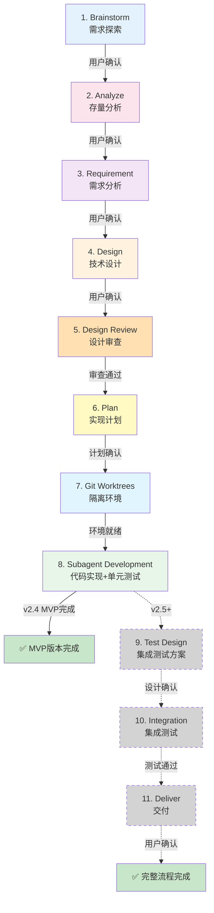
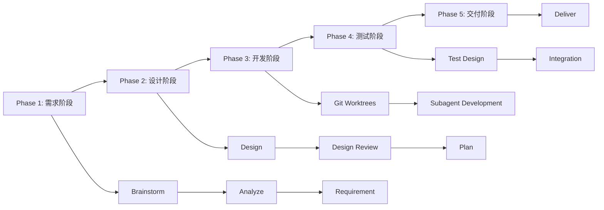
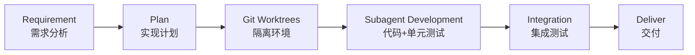
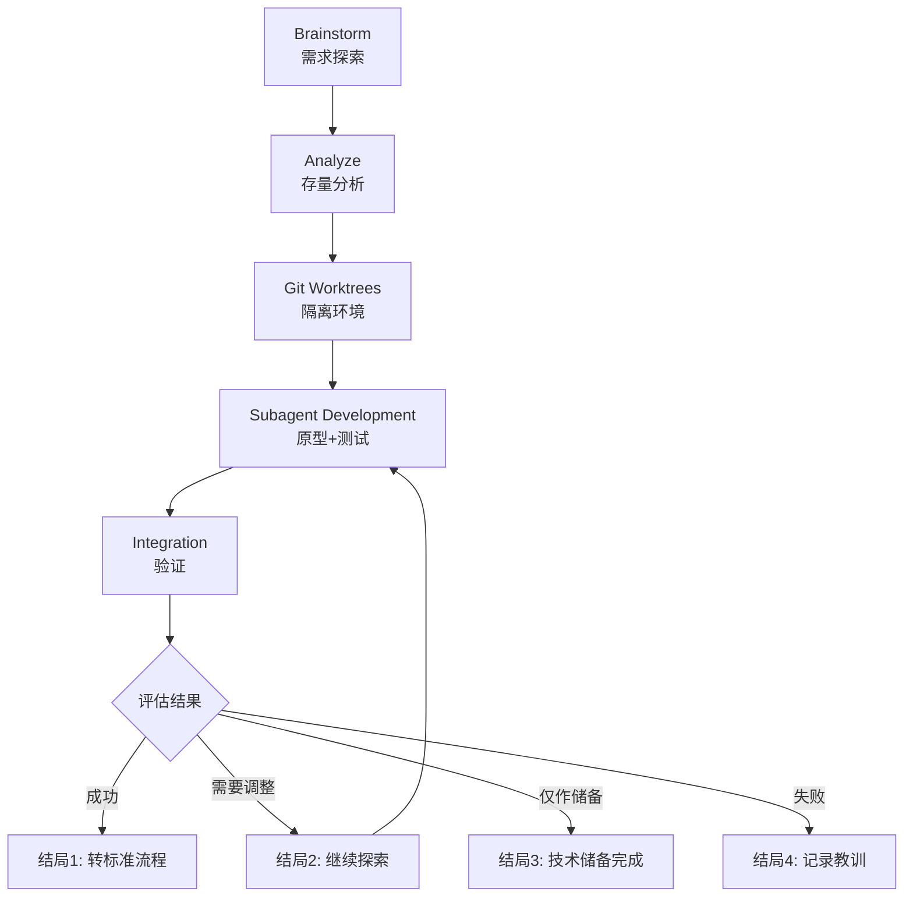
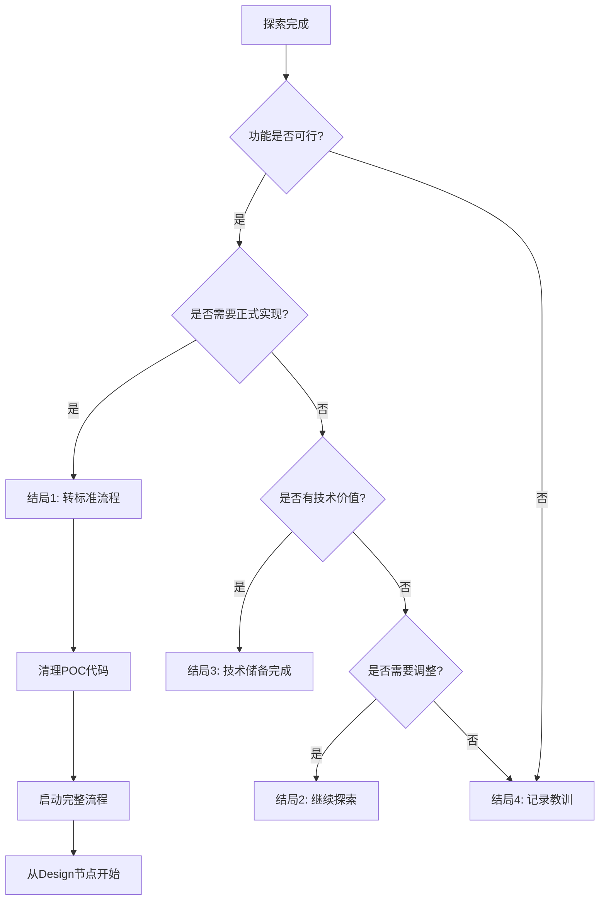

# 使用 Claude Code Skills 的 AI 自动化开发方案

> 设计日期: 2026-02-25
> 版本: v2.4（Skill完整定义优化版）
> 设计目标: 基于 Claude Code 的 Skills 和 Subagent 能力，构建 AI 自动化开发系统

---

## 1. 概述

### 1.1 背景

**核心价值主张:**
基于 Claude Code Skills/Subagent 构建的完整开发流程自动化框架,通过标准化的节点设计,将需求探索到交付部署的全流程拆解为可独立调用、可灵活组合的模块化单元。

**适用场景:**
- 🎯 **个人开发者**: 快速实现想法,保证代码质量
- 👥 **团队协作**: 标准化流程,完整文档追溯
- 🏢 **企业级项目**: 多层审查,风险可控
- 🔬 **技术研究**: 探索验证,快速迭代

**关键优势:**
- 🧠 **减少认知负荷**: 每个节点专注一件事,AI 和人类都更聚焦
- 🛡️ **保证代码质量**: TDD + 多层审查(设计审查 + 代码审查 + 格式化审查)
- ⚡ **提高效率**: 自动化流程 + Skill 按需加载 + 支持最多 49 个并发子代理
- 📚 **知识沉淀**: 标准化产物(.claude/目录) + 版本化管理

### 1.2 设计原则

**核心原则(不可妥协):**
| 原则 | 说明 |
|------|------|
| 🎯 节点独立 | 每个节点可独立调用,不强制走完整流程 |
| ✅ 人工确认 | 每个节点完成后必须人工确认 |
| 📦 标准产物 | 每个节点生成标准化文档/代码 |
| 🔄 断点续传 | 支持会话中断后恢复进度 |
| 🧪 TDD优先 | 代码实现必须遵循测试驱动开发 |
| 🛡️ 质量保证 | 设计审查 + 代码审查 + 格式化审查 |

**优化原则(可灵活调整):**
| 原则 | 说明 |
|------|------|
| 🔀 流程灵活性 | 提供完整/快速/探索三种模式 |
| 🧩 Skill独立 | 关键能力独立为Skill,便于复用 |
| 🤖 自动化审查 | 集成Linter/Formatter自动化检查 |
| 📡 双通道调用 | 支持命令调用 + Skill工具调用 |
| 🎭 并发能力 | Subagent Development支持最多49个并发 |
| 💾 Token优化 | Skill按需加载,不占用上下文 |

### 1.3 核心特性

| 特性 | 说明 | 技术实现 |
|------|------|---------|
| **双通道调用** | 命令(`/cadence:xxx`) + Skill工具 | plugin.json配置 |
| **节点独立** | 11个核心节点,每个可独立使用 | 每个Skill独立 |
| **Skill组合** | 3个TDD/审查前置 + 7个节点Skill | Skill依赖机制 |
| **流程组合** | 3种流程模式(完整/快速/探索) | 流程Skill组合节点 |
| **人工确认** | 每个节点有人工确认机制 | 对话交互 |
| **标准产物** | 每个节点有标准化输出 | .claude/目录规范 |
| **进度追踪** | TodoWrite追踪,支持恢复 | TodoWrite工具 |
| **质量保证** | 设计审查+代码审查+TDD+格式化 | 多层验证 |
| **Subagent驱动** | 代码开发集成单元测试和审查 | Task工具调用 |
| **并发能力** | 支持最多49个并发子代理 | Task工具并发 |
| **Token优化** | Skill按需加载,不占用上下文 | Skill机制 |
| **断点续传** | 会话中断后可恢复进度 | TodoWrite持久化 |

---

## 2. 完整流程设计（11个核心节点）

### 2.1 流程概览

> **重要说明**:
> - **v2.4 MVP 版本**：实现 4.1-4.8 节点（共 8 个核心节点）
> - **v2.5+ 版本**：将实现 4.9-4.11 节点（Test Design、Integration、Deliver）



**关键依赖说明:**
- 节点7(Git Worktrees)是节点8(Subagent Development)的**前置Skill**
- 节点8内部强制使用TDD流程和代码审查
- 每个节点可独立调用,但完整流程有严格顺序
- **v2.4 MVP 版本**：4.9-4.11 节点用虚线表示，待 v2.5+ 版本实现

### 2.2 节点清单

**v2.4 MVP 版本节点**（已实现 ✅）：
| 序号 | 节点名称 | Skill名称 | 目的 | 输入来源 | 确认 | 产物 | 跳过条件 |
|------|---------|-----------|------|---------|------|------|---------|
| 1 | Brainstorm | cadence-brainstorm | 需求探索 | 用户对话/已有PRD | 用户确认PRD | PRD文档 | 已有PRD |
| 2 | **Analyze** ⭐ | cadence-analyze | 存量分析 | PRD/项目结构 | 用户确认分析 | 存量分析报告 | 全新项目 |
| 3 | Requirement | cadence-requirement | 需求分析 | PRD+存量分析 | 用户确认需求 | 需求文档 | 需求简单 |
| 4 | Design | cadence-design | 技术设计 | 需求+存量分析 | 用户确认方案 | 技术方案+实现计划 | - |
| 5 | Design Review | cadence-design-review | 设计审查 | 技术方案 | 审查通过 | 设计审查报告 | 极简单功能 |
| 6 | Plan | cadence-plan | 实现计划 | 技术方案 | 用户确认计划 | 实现计划文档 | - |
| 7 | Git Worktrees | cadence-using-git-worktrees | 隔离环境 | 实现计划 | 环境就绪 | Worktree目录 | 单人开发 |
| 8 | **Subagent Development** ⭐ | cadence-subagent-development | 代码实现+单元测试 | 实现计划+Worktree | 审查通过 | 业务代码+单元测试 | - |

**v2.5+ 版本节点**（待实现 ⏳）：
| 序号 | 节点名称 | Skill名称 | 目的 | 输入来源 | 确认 | 产物 | 跳过条件 |
|------|---------|-----------|------|---------|------|------|---------|
| 9 | **Test Design** ⭐ | cadence-test-design | 集成测试方案 | 需求+技术方案+代码 | 用户确认设计 | 集成测试方案文档 | 简单功能 |
| 10 | Integration | cadence-integration | 集成测试 | 测试方案 | 测试通过 | 集成测试+报告 | 简单功能 |
| 11 | Deliver | cadence-deliver | 交付 | 测试结果 | 用户确认交付 | 交付报告 | - |

**重要说明:**
- ⭐ 标记的节点是关键改进节点
- 每个节点对应一个独立Skill,可通过`Skill tool: cadence-xxx`调用
- 节点7是节点8的**前置Skill**,必须先创建隔离环境才能开发
- 节点8内部强制使用TDD流程(`cadence-test-driven-development`)和代码审查(`cadence-requesting-code-review`)
- **v2.4 MVP 版本**：只包含 4.1-4.8 节点，已全部实现
- **v2.5+ 版本**：将实现 4.9-4.11 节点（Test Design、Integration、Deliver）

### 2.3 流程特点

#### 核心特点(与其他方案的区别)

**1. 双通道调用机制** 🆕
- **命令调用**: `/cadence:full-flow` 快速启动完整流程
- **Skill工具调用**: `Skill tool: cadence-brainstorm` 精确调用单个Skill
- **优势**: 灵活性更高,用户可选择最便捷的方式

**2. Analyze前置** ⭐
- 在需求分析(Requirement)之前先分析存量代码
- 避免重复造轮子,理解现有架构和依赖
- 这是v2.3的关键改进之一

**3. Subagent Development一体化** ⭐
- 合并了"代码开发"和"单元测试"两个节点
- 强制TDD流程(RED→GREEN→BLUE)
- 自动集成Linter/Formatter检查
- 内置Spec Review和Code Quality Review

**4. 前置Skill机制** 🆕
- Git Worktrees是Subagent Development的前置Skill
- TDD和Code Review是Subagent Development的内置流程
- 通过Skill依赖确保质量和隔离性

**5. 进度持久化**
- 使用TodoWrite记录进度,支持跨会话恢复
- 每个节点完成后更新TodoWrite状态
- 会话中断后可通过`/cadence:resume`恢复

**6. 标准化产物**
- 所有文档存放在`.claude/`目录下
- 文件命名遵循`YYYY-MM-DD_类型_名称_v版本.扩展名`格式
- 便于追溯和版本管理

#### 与v2.2版本的主要差异

| 维度 | v2.2 | v2.3 |
|------|------|------|
| 核心节点数 | 10个(标题)→11个(实际) | 11个(明确) ⭐ |
| 节点清单 | 6列 | 新增Skill名称+输入来源 ⭐ |
| 完整流程说明 | 简单 | 增加Phase划分+并行能力+详细时间范围 ⭐ |
| 快速流程 | 跳过Git Worktrees | 保留Git Worktrees ⭐ |
| 探索流程 | 简单4种结局 | 增加决策树+详细触发条件 ⭐ |
| 时间预估 | 固定值 | 动态范围(根据复杂度) ⭐ |

---

## 3. 三种流程模式

### 3.1 完整流程（Full Flow）

**适用场景:**
- 复杂功能开发(预估>2小时)
- 团队协作项目(需要完整文档)
- 企业级应用(需要设计审查)
- 涉及存量代码改造(需要Analyze节点)
- 需要完整追溯(需要所有产物)

**流程执行顺序:**



**详细节点清单:**

**v2.4 MVP 版本节点**（已实现 ✅）：
| Phase | 节点 | 可否并行 | 依赖节点 | 预估时间(动态) |
|-------|------|---------|---------|---------------|
| Phase 1 | 1. Brainstorm | ❌ | 无 | 15-30分钟 |
| Phase 1 | 2. Analyze | ❌ | Brainstorm | 20-40分钟 |
| Phase 1 | 3. Requirement | ❌ | Analyze | 15-30分钟 |
| Phase 2 | 4. Design | ❌ | Requirement | 30-60分钟 |
| Phase 2 | 5. Design Review | ❌ | Design | 15-30分钟 |
| Phase 2 | 6. Plan | ❌ | Design Review | 10-20分钟 |
| Phase 3 | 7. Git Worktrees | ❌ | Plan | 5分钟 |
| Phase 3 | 8. Subagent Development | ✅ | Git Worktrees | 60-180分钟(根据任务数) |

**v2.5+ 版本节点**（待实现 ⏳）：
| Phase | 节点 | 可否并行 | 依赖节点 | 预估时间(动态) |
|-------|------|---------|---------|---------------|
| Phase 4 | 9. Test Design | ❌ | Subagent Development | 15-30分钟 |
| Phase 4 | 10. Integration | ✅ | Test Design | 20-40分钟 |
| Phase 5 | 11. Deliver | ❌ | Integration | 10-20分钟 |

**总预估时间:**

**v2.4 MVP 版本**（4.1-4.8 节点）：
| 复杂度 | 代码量预估 | 总时间范围 |
|--------|-----------|-----------|
| 🟢 简单 | <500行 | 2-3小时 |
| 🟡 中等 | 500-2000行 | 3-5小时 |
| 🔴 复杂 | >2000行 | 5-8小时 |

**v2.5+ 完整版本**（4.1-4.11 节点）：
| 复杂度 | 代码量预估 | 总时间范围 |
|--------|-----------|-----------|
| 🟢 简单 | <500行 | 3-4小时 |
| 🟡 中等 | 500-2000行 | 4-7小时 |
| 🔴 复杂 | >2000行 | 7-12小时 |

**并行执行能力:**
- ✅ **Subagent Development可并行**: 如果实现计划中有多个独立任务,可启动多个并发Subagent
- ✅ **Integration可并行**（v2.5+）: 如果测试方案中有多个独立测试场景,可并行执行
- ❌ **其他节点必须顺序执行**: 由于依赖关系,必须按顺序完成

**调用方式:**
```bash
# 方式1: 命令调用(推荐)
/cadence:full-flow

# 方式2: Skill工具调用
Skill tool: cadence-full-flow

# 方式3: 手动逐个调用
Skill tool: cadence-brainstorm
# ... 等待用户确认后 ...
Skill tool: cadence-analyze
# ... 依此类推 ...
```

**重要提示:**
- 📌 每个节点完成后必须人工确认才能进入下一节点
- 📌 Subagent Development节点内部强制使用TDD流程和代码审查
- 📌 如果中途会话中断,可使用`/cadence:resume`恢复进度

---

### 3.2 快速流程（Quick Flow）

**适用场景:**
- 简单功能(预估<2小时能完成)
- 需求明确(不需要Brainstorm探索)
- 个人项目(不需要完整文档)
- 紧急修复(需要快速上线)
- 全新模块(不涉及存量代码)

**流程精简逻辑:**



**精简说明:**
- ✅ **保留Requirement**: 即使简单功能,也需要明确需求
- ✅ **保留Plan**: 避免无计划开发
- ✅ **保留Git Worktrees**: 即使单人开发,也建议隔离环境
- ✅ **保留Subagent Development**: 核心开发节点,包含TDD和审查
- ✅ **保留Integration**: 必须验证功能正常
- ✅ **保留Deliver**: 记录变更清单

- ❌ **跳过Brainstorm**: 需求明确,不需要探索
- ❌ **跳过Analyze**: 不涉及存量代码
- ❌ **跳过Design**: 简单功能,直接编码即可
- ❌ **跳过Design Review**: 极简单设计,无需正式审查
- ❌ **跳过Test Design**: 直接写集成测试,无需正式方案

**详细节点清单(6个节点):**

| 节点 | 预估时间 | 精简内容 |
|------|---------|---------|
| Requirement | 10-15分钟 | 简化需求文档,只记录核心需求 |
| Plan | 5-10分钟 | 简单任务分解,2-5个任务即可 |
| Git Worktrees | 5分钟 | 创建feature分支 |
| Subagent Development | 30-90分钟 | TDD流程 + 代码审查 |
| Integration | 10-20分钟 | 简单集成测试 |
| Deliver | 5分钟 | 变更清单 |

**总预估时间:** 根据功能复杂度动态调整

| 复杂度 | 代码量预估 | 总时间范围 |
|--------|-----------|-----------|
| 🟢 极简单 | <200行 | 45-75分钟 |
| 🟡 简单 | 200-500行 | 75-140分钟 |

**调用方式:**
```bash
# 方式1: 命令调用(推荐)
/cadence:quick-flow

# 方式2: Skill工具调用
Skill tool: cadence-quick-flow
```

**风险提示:**
- ⚠️ 跳过Design可能导致技术方案不完整,建议预估时间>2小时的功能不要使用快速流程
- ⚠️ 跳过Analyze可能导致重复造轮子,建议涉及现有代码的功能不要使用快速流程
- ⚠️ 跳过Design Review可能导致设计缺陷,建议企业级项目不要使用快速流程

---

### 3.3 探索流程（Exploration Flow）

**适用场景:**
- 不确定的需求(需要快速验证想法)
- 技术研究(评估技术可行性)
- 原型开发(POC验证)
- 实验性功能(可能不会正式上线)
- 学习新技术(边做边学)

**流程特点:**



**关键特点:**
- ✅ **允许迭代**: 可以多次循环Subagent Development → Integration → 评估
- ✅ **原型可以不完整**: 不要求100%功能完整
- ✅ **随时可以停止**: 探索失败也可以记录经验
- ✅ **成功后可选择完整实现**: 探索成功后可转标准流程

**详细节点清单(5个节点):**

| 节点 | 预估时间 | 探索模式特点 |
|------|---------|-------------|
| Brainstorm | 20-40分钟 | 允许需求不明确,边探索边调整 |
| Analyze | 10-20分钟 | 简化分析,只关注关键技术点 |
| Git Worktrees | 5分钟 | 创建poc/xxx分支 |
| Subagent Development | 30-60分钟 | 原型代码 + 基础测试 |
| Integration | 10-20分钟 | 验证核心功能 |

**总预估时间:** 根据探索迭代次数动态调整

| 探索深度 | 迭代次数 | 总时间范围 |
|---------|---------|-----------|
| 🟢 浅层探索 | 1次 | 75-145分钟 |
| 🟡 中层探索 | 2-3次 | 2-4小时 |
| 🔴 深层探索 | >3次 | 4-8小时 |

**调用方式:**
```bash
# 方式1: 命令调用(推荐)
/cadence:exploration-flow

# 方式2: Skill工具调用
Skill tool: cadence-exploration-flow
```

**探索结局决策树:**



**4种结局说明:**

| 结局 | 触发条件 | 后续动作 | 产物 |
|------|---------|---------|------|
| **结局1: 转标准流程** | 功能可行 + 需要正式实现 | 清理POC代码 → 启动完整流程(从Design开始) | POC报告 + 技术方案 |
| **结局2: 继续探索** | 功能可行但需要调整 | 调整需求 → 再次循环Subagent Development | 迭代记录 |
| **结局3: 技术储备完成** | 功能可行但暂不需要 | 清理POC代码 → 记录技术方案到.claude/docs/ | 技术储备文档 |
| **结局4: 记录教训** | 功能不可行 | 清理POC代码 → 记录失败原因和教训 | 失败分析报告 |

**重要提示:**
- 📌 探索流程允许失败,失败也是宝贵经验
- 📌 原型代码质量要求较低,但必须能验证核心想法
- 📌 探索成功后,如果需要正式实现,建议从Design节点开始(而不是直接使用POC代码)
- 📌 探索流程的产物可能不是最终代码,而是技术验证报告

---

## 4. 节点详细设计（v2.4 Skill完整定义优化版）

> **v2.4 优化说明**:
> - 新增 When to Use（使用场景判断逻辑，含流程图）
> - 新增 The Process（详细流程，含Mermaid流程图）
> - 新增 Skill 完整定义（完整的SKILL.md格式）
> - 新增 Integration（与其他Skill的集成说明）

> **v2.3 优化说明**:
> - 新增 Skill 关联（每个节点 → Skill 文件路径）
> - 新增动态时间预估（根据功能复杂度）
> - 新增关键检查清单（每个节点必须检查的项目）
> - 新增 Red Flags（防止错误使用的提醒）

---

### 4.1 节点1：Brainstorm（需求探索）

**Skill 文档**：[2026-02-25_Skill_Brainstorm_v1.0.md](./2026-02-25_Skill_Brainstorm_v1.0.md)

**简要说明**：通过对话式探索，帮助用户明确需求，生成PRD文档。

---

### 4.2 节点2：Analyze（存量分析）⭐

**Skill 文档**：[2026-02-25_Skill_Analyze_v1.0.md](./2026-02-25_Skill_Analyze_v1.0.md)

**简要说明**：在需求设计和方案设计之前，分析存量代码，理解现有架构和依赖关系。

---


### 4.3 节点3：Requirement（需求分析）

**Skill 文档**：[2026-02-25_Skill_Requirement_v1.0.md](./2026-02-25_Skill_Requirement_v1.0.md)

**简要说明**：基于 PRD 和存量分析（如涉及存量代码），进行详细的需求分析，生成完整的需求文档。

---

### 4.4 节点4：Design（技术设计）

**Skill 文档**：[2026-02-25_Skill_Design_v1.0.md](./2026-02-25_Skill_Design_v1.0.md)

**简要说明**：基于需求文档和存量分析（如存在），设计完整的技术方案，包含系统架构、数据模型（物理设计）、API 设计、技术选型、风险评估等。

---

### 4.5 节点5：Design Review（设计审查）

**Skill 文档**：[2026-02-25_Skill_Design_Review_v1.0.md](./2026-02-25_Skill_Design_Review_v1.0.md)

**简要说明**：对技术方案进行系统性审查（8 个维度），确保方案的可行性、完整性、安全性。全流程模式下必须进行，极简模式和探索模式可跳过。发现问题后返回 Design 修改。

---

### 4.6 节点6：Plan（实现计划）

**Skill 文档**：[2026-02-26_Skill_Plan_v1.0.md](./2026-02-26_Skill_Plan_v1.0.md)

**简要说明**：基于技术方案（必须）和审查报告（如已完成 Design Review），制定详细的实现计划，包括任务分解、任务依赖关系、并行任务识别、时间估计、验收标准等内容。支持 Subagent Development 的任务分配和并发执行。

---

### 4.7 节点7：Git Worktrees（隔离环境）

**Skill 文档**：[2026-02-26_Skill_Git_Worktrees_v1.0.md](./2026-02-26_Skill_Git_Worktrees_v1.0.md)

**简要说明**：创建隔离的开发环境，使用 git worktree 避免污染主分支。负责环境准备、分支创建（`feature/{feature-name}`）、路径管理（`../workspace/{feature-name}`）和环境验证。不负责依赖安装和代码开发（由 Subagent Development 负责）。

---

### 4.8 节点8：Subagent Development（代码实现+单元测试）⭐

**Skill 文档**：[2026-02-26_Skill_Subagent_Development_v1.0.md](./2026-02-26_Skill_Subagent_Development_v1.0.md)

**简要说明**：使用 Subagent 开发代码，强制遵循 TDD 流程（RED-GREEN-BLUE），同时编写单元测试，并进行代码质量审查。支持并行执行（最多 49 个并发）、自动审查、覆盖率检查（P0 ≥ 80%）、验收标准验证。不可跳过此节点。

---

### 4.9 节点9：Test Design（集成测试方案）⭐

> **⚠️ v2.5+ 待实现**：此节点在 v2.4 MVP 版本中不包含，将在 v2.5+ 版本中实现。
>
> **当前状态**：⏳ 规划中 | **计划版本**：v2.5+

#### Skill 关联

#### Skill 关联
```yaml
Skill: cadence-test-design
路径: skills/cadence-test-design/SKILL.md
前置Skill: cadence-subagent-development  # 必须先完成开发
触发关键词: "集成测试", "测试方案", "端到端测试"
```

#### 目的
基于需求文档、技术方案和已实现的代码，设计**集成测试方案**。

#### 动态时间预估

| 复杂度 | 时间范围 | 说明 |
|-------|---------|------|
| 🟢 简单 | 10-15分钟 | 3-5个测试用例 |
| 🟡 中等 | 15-30分钟 | 5-10个测试用例 |
| 🔴 复杂 | 30-60分钟 | 10+个测试用例 |

#### 输入来源
1. 自动读取：
   - requirement 阶段的需求文档
   - design 阶段的技术方案
   - subagent-development 阶段的业务代码和单元测试
2. 用户指定：用户提供测试范围
3. 对话输入：用户描述测试要求

#### 关键检查清单 ✅

```
□ 测试策略：
  □ 是否定义了测试目标和范围？
  □ 是否选择了合适的测试类型？

□ 测试用例：
  □ 核心业务流程是否都有测试覆盖？
  □ 边界条件和异常场景是否覆盖？
  □ 与存量系统的集成是否测试？

□ 测试数据：
  □ 测试数据是否准备就绪？
  □ 是否有测试数据构造方案？

□ 覆盖率：
  □ 是否规划了覆盖率目标？
  □ 是否有遗漏的关键路径？
```

#### Red Flags ⚠️

| 错误做法 | 正确做法 |
|---------|---------|
| ❌ 跳过 Subagent Development 直接测试 | ✅ 必须先完成代码开发 |
| ❌ 只测试 happy path | ✅ 必须测试边界和异常 |
| ❌ 忽略与存量系统的集成 | ✅ 必须包含集成测试 |

#### 确认机制
```
生成集成测试方案后：
展示测试策略
展示集成测试用例清单
询问："测试方案是否完整？"
├── ✅ 完整 → 保存产物，进入 integration
├── ⚠️ 需要调整 → 调整方案
└── ❌ 不可行 → 重新设计
```

#### 跳过条件
- 极简单功能（无需正式集成测试方案）
- 原型开发（探索阶段）
- 用户明确表示不需要

---

### 4.10 节点10：Integration（集成测试）

> **⚠️ v2.5+ 待实现**：此节点在 v2.4 MVP 版本中不包含，将在 v2.5+ 版本中实现。
>
> **当前状态**：⏳ 规划中 | **计划版本**：v2.5+

#### Skill 关联

#### Skill 关联
```yaml
Skill: cadence-integration
路径: skills/cadence-integration/SKILL.md
前置Skill: cadence-test-design  # 必须先完成测试设计
触发关键词: "测试", "验证", "集成测试"
```

#### 目的
根据集成测试方案执行集成测试，验证模块间协作和端到端功能。

#### 动态时间预估

| 复杂度 | 时间范围 | 说明 |
|-------|---------|------|
| 🟢 简单 | 10-20分钟 | 少量测试用例 |
| 🟡 中等 | 20-40分钟 | 中等测试用例 |
| 🔴 复杂 | 40-80分钟 | 大量测试用例 |

#### 输出产物

**产物1：集成测试代码**

**产物2：集成测试报告**

**文件：** `.claude/docs/{date}_集成测试_{功能名称}_v1.0.md`

#### 关键检查清单 ✅

```
□ 测试执行：
  □ 是否执行了所有测试用例？
  □ 测试结果是否符合预期？

□ 问题修复：
  □ 失败的测试是否都已修复？
  □ 是否进行了回归测试？

□ 性能测试（可选）：
  □ 是否进行了性能测试？
  □ 性能指标是否达标？

□ 报告生成：
  □ 是否生成了测试报告？
  □ 覆盖率是否达标？
```

#### Red Flags ⚠️

| 错误做法 | 正确做法 |
|---------|---------|
| ❌ 跳过 Test Design 直接测试 | ✅ 必须先有测试方案 |
| ❌ 忽略失败的测试 | ✅ 所有测试必须通过 |
| ❌ 没有回归测试 | ✅ 修改后必须回归测试 |

#### 确认机制
```
集成测试后：
展示集成测试结果
展示性能测试结果

询问："集成是否成功？失败场景是否需要修复？"
├── ✅ 成功 → 保存测试，进入 deliver
├── ⚠️ 有问题 → 修复问题
└── ❌ 失败 → 返回 subagent-development 重新实现
```

---

### 4.11 节点11：Deliver（交付）

> **⚠️ v2.6+ 待实现**：此节点在 v2.4 MVP 版本中不包含，将在 v2.6+ 版本中实现。
>
> **当前状态**：⏳ 规划中 | **计划版本**：v2.6+

#### Skill 关联

#### Skill 关联
```yaml
Skill: cadence-deliver
路径: skills/cadence-deliver/SKILL.md
前置Skill: cadence-integration  # 必须先完成集成测试
触发关键词: "交付", "部署", "发布"
```

#### 目的
准备交付，生成完整的交付报告和部署文档。

#### 动态时间预估

| 复杂度 | 时间范围 | 说明 |
|-------|---------|------|
| 🟢 简单 | 5-10分钟 | 简单变更清单 |
| 🟡 中等 | 10-20分钟 | 完整交付报告 |
| 🔴 复杂 | 20-30分钟 | 详细部署文档 |

#### 输出产物
**文件：** `.claude/docs/{date}_交付报告_{功能名称}_v1.0.md`

#### 关键检查清单 ✅

```
□ 功能清单：
  □ 是否列出了所有实现的功能？
  □ 是否有功能状态标记（完成/部分/未完成）？

□ 测试结果：
  □ 是否包含单元测试结果？
  □ 是否包含集成测试结果？

□ 代码质量：
  □ 是否通过 lint 检查？
  □ 覆盖率是否达标？

□ 部署准备：
  □ 是否有部署检查清单？
  □ 是否有回滚方案？

□ 文档完整：
  □ 是否更新了相关文档？
  □ 是否有变更记录？
```

#### Red Flags ⚠️

| 错误做法 | 正确做法 |
|---------|---------|
| ❌ 没有通过 Integration 就交付 | ✅ 必须先完成集成测试 |
| ❌ 跳过 lint 检查 | ✅ 必须通过 lint 检查 |
| ❌ 没有备份就部署 | ✅ 必须有回滚方案 |

#### 确认机制
```
准备交付：
展示功能清单
展示测试结果
询问："是否可以交付？"
├── ✅ 可以 → 生成交付报告，完成
├── ⚠️ 有问题 → 返回修复
└── ❌ 不行 → 取消交付
```

---

## 5. 进度追踪与状态管理

> **📄 完整文档**: [进度追踪与状态管理_v1.0.md](./2026-02-26_进度追踪与状态管理_v1.0.md)

本部分已独立为详细文档，包含完整的进度追踪和状态管理机制。

### 5.1 核心组件概览

| 组件 | 说明 | 关键特性 |
|------|------|---------|
| **TodoWrite 任务结构** | 任务管理核心 | 标准字段、依赖管理、并行识别 |
| **验证机制** | 完成验证铁律 | 独立 Skill、5步门控、验证场景 |
| **失败处理机制** | 自动重试策略 | 固定重试（测试3次/审查2次）、人工介入 |
| **会话记忆系统** | 跨会话持久化 | Session Summary、Checkpoint（基于 Serena MCP） |
| **断点续传** | 进度恢复 | 5种恢复场景、上下文重建 |
| **进度可视化** | 状态监控 | `/cadence:status`、进度报告、实时监控 |

### 5.2 关键命令

```bash
/cadence:status      # 查看当前进度
/cadence:resume      # 恢复进度
/cadence:checkpoint  # 创建检查点
/cadence:report      # 生成报告（每日/周报）
/cadence:monitor     # 实时监控
```

> **📌 详细内容**: 请查看 [进度追踪与状态管理_v1.0.md](./2026-02-26_进度追踪与状态管理_v1.0.md)

---

## 6. Skills 目录结构

> **📄 完整文档**: [Skills目录结构设计文档](./2026-02-26_技术方案_Skills目录结构_v1.0.md)

本部分已独立为详细文档，包含完整的目录结构定义、Skill 分类说明、依赖关系图、文件组织规范等。

### 6.1 Skill 分类总览

| 分类 | 数量 | 说明 | 必需性 |
|------|------|------|-------|
| 🧬 **元Skill** | 1 | using-cadence入口Skill | 必须加载 |
| 🔧 **前置Skill** | 5 | 质量保证基础（含2个新增） | 特定场景必须 |
| 📋 **节点Skill** | 11 | 11个核心节点 | 按需调用 |
| 🔀 **流程Skill** | 3 | 流程组合 | 按需调用 |
| ✅ **支持Skill** | 2 | 辅助功能 | 可选 |

### 6.2 v2.4 优化亮点

- ✨ **新增前置Skill（2个）**: `cadence-receiving-code-review`、`cadence-self-review`
- ⭐ **增强的 Subagent Development**: 两阶段审查机制（Spec Review → Quality Review）
- 📚 **增强 TDD 支持**: testing-anti-patterns、red-green-refactor、examples
- 📖 **文档完整性**: SKILL.md + README.md + examples.md + 支持文件

> **📌 详细内容**: 请查看 [Skills目录结构设计文档](./2026-02-26_技术方案_Skills目录结构_v1.0.md)

---

## 7. 插件配置

> **📄 完整文档**: [插件配置设计文档](./2026-02-26_技术方案_插件配置_v1.0.md)

本部分已独立为详细文档，包含完整的配置文件定义、Skill 注册、依赖关系、Hooks 配置、Subagent 定义等。

### 7.1 配置文件清单

| 文件 | 用途 | 必需性 | 说明 |
|------|------|-------|------|
| `plugin.json` | Skill 注册和插件元数据 | ✅ 必须 | 22个 Skill + 25个 Command |
| `marketplace.json` | 市场展示信息 | ✅ 必须 | 完整的功能特性描述 |
| `dependencies.json` | Skill 依赖关系 | ✅ 必须 | 质量门禁定义 |
| `hooks.json` | Hooks 配置 | ⭐ 推荐 | 6个 Hook 定义 |
| `agents.json` | Subagent 定义 | ✅ 必须 | 3个 Subagent + 工作流 |

### 7.2 v2.4 优化亮点

- ✨ **完善的元数据**: 完整的 author、license、repository、版本兼容性声明
- 📊 **完整的 Skill 注册**: 22个 Skill（含2个新增）、25个 Command
- 🔗 **完整的依赖管理**: Skill 依赖、Flow 依赖、质量门禁（before/during/after）
- 🪝 **Hooks 系统**: session-start、task-complete、node-complete、code-review-complete、pre-commit、pre-push
- 🤖 **Subagent 定义**: implementer、spec-reviewer、code-quality-reviewer + 工作流

> **📌 详细内容**: 请查看 [插件配置设计文档](./2026-02-26_技术方案_插件配置_v1.0.md)

---

## 8. Subagent 定义

> **详细文档**：[2026-02-26_技术方案_Subagent定义_v1.0.md](./2026-02-26_技术方案_Subagent定义_v1.0.md)

### 8.1 架构概览

Cadence 使用三层 Subagent 协作模式，由 `cadence-subagent-development` Skill 统一协调：

1. **Implementer Subagent** - 执行 TDD 工作流
2. **Spec Reviewer Subagent** - 验证实现符合规范
3. **Code Quality Reviewer Subagent** - 审查代码质量

### 8.2 核心特性

**多语言支持：**
- 支持 6 种主流语言（JavaScript/TypeScript、Python、Java、Go、Rust）
- 三层检测机制（Plan配置 → CLAUDE.md → 自动检测）
- 自动识别项目类型并使用对应命令

**TDD 强制执行：**
- RED 阶段：先写失败的测试
- GREEN 阶段：编写最小代码通过测试
- BLUE 阶段：重构代码
- Coverage Check：验证覆盖率 ≥ 阈值
- Lint & Format：自动运行代码检查

**两阶段审查：**
- Spec Review：验证符合需求（不多不少）
- Code Quality Review：审查质量、安全、性能

### 8.3 使用方式

详细的 Subagent 定义、Prompt 模板、多语言配置和使用示例请参考：

**👉[2026-02-26_技术方案_Subagent定义_v1.0.md](./2026-02-26_技术方案_Subagent定义_v1.0.md)**

---

## 9. 独立 Skills 详细设计（v2.3 优化版）

### 9.1 cadence-using-git-worktrees

```yaml
---
name: cadence-using-git-worktrees
description: Use when starting feature work that needs isolation from current workspace or before executing implementation plans - creates isolated git worktrees with smart directory selection and safety verification
---

## Red Flags

| Thought | Reality |
|---------|---------|
| "Working on main branch directly" | ❌ Must use worktree for isolation |
| "Skip safety check" | ❌ Must verify worktree doesn't exist |
| "Don't clean up worktree" | ❌ Must clean up after completion |

## Key Checkpoints

- [ ] Verify worktree doesn't already exist
- [ ] Create new branch from main
- [ ] Create worktree in ../workspace/ directory
- [ ] Verify worktree is functional
- [ ] Record worktree state to .claude/state/worktree.json
```

### 9.2 cadence-test-driven-development

```yaml
---
name: cadence-test-driven-development
description: Use when implementing any feature or bugfix, before writing implementation code
---

## Red Flags

| Thought | Reality |
|---------|---------|
| "Write code first, then tests" | ❌ Must write tests first (RED phase) |
| "Implement after tests pass" | ❌ Tests must fail before implementation |
| "Skip verification" | ❌ Must run tests to verify |
| "Add unnecessary features" | ❌ GREEN phase: minimal code only |

## TDD Phases

1. **RED**: Write failing tests first
2. **GREEN**: Implement minimal code to pass
3. **BLUE**: Refactor while keeping tests green
```

### 9.3 cadence-requesting-code-review

```yaml
---
name: cadence-requesting-code-review
description: Use when completing tasks, implementing major features, or before merging to verify work meets requirements
---

## Red Flags

| Thought | Reality |
|---------|---------|
| "Skip code review" | ❌ Must conduct review |
| "Review own code" | ❌ Must use subagent for review |
| "Ignore review feedback" | ❌ Must fix issues found |
| "Skip re-review" | ❌ Must re-review after fixes |

## Review Workflow

1. Trigger Code Quality Review Agent
2. Wait for review results
3. Fix critical issues
4. Re-review until approved
```

### 9.4 cadence-subagent-development

```yaml
---
name: cadence-subagent-development
description: Use when executing implementation plans with independent tasks in the current session
---

## Red Flags

| Thought | Reality |
|---------|---------|
| "Develop on main branch" | ❌ Must use cadence-using-git-worktrees first |
| "Don't follow TDD" | ❌ Must use cadence-test-driven-development |
| "Skip review" | ❌ Must use cadence-requesting-code-review |
| "Launch multiple implementers" | ❌ Must execute sequentially to avoid conflicts |
| "Let subagent read plan itself" | ❌ Must provide complete task text |

## Workflow

1. Load implementation plan
2. Create Git Worktree (if not exists)
3. For each task:
   a. Run Implementer Agent (TDD)
   b. Run Spec Reviewer Agent
   c. Run Code Quality Reviewer Agent
4. Commit all changes
```

### 9.5 cadence-verification-before-completion

```yaml
---
name: cadence-verification-before-completion
description: Use when about to claim work is complete, fixed, or passing, before committing or creating PRs - requires running verification commands and confirming output before making any success claims
---

## Red Flags

| Thought | Reality |
|---------|---------|
| "Mark complete without verification" | ❌ Must run verification commands |
| "Don't check output" | ❌ Must confirm output results |
| "Assume it's fine" | ❌ Must have evidence to support assertions |

## Verification Checklist

- [ ] Run all tests
- [ ] Verify lint passes
- [ ] Verify format passes
- [ ] Check coverage meets threshold
- [ ] Confirm all ACs are met
```

### 9.6 cadence-finishing-a-development-branch

```yaml
---
name: cadence-finishing-a-development-branch
description: Use when implementation is complete, all tests pass, and you need to decide how to integrate the work - guides completion of development work by presenting structured options for merge, PR, or cleanup
---

## Options

1. **Create PR**: Push branch and create pull request
2. **Squash Merge**: Squash commits and merge
3. **Rebase**: Rebase onto main and fast-forward
4. **Cleanup**: Delete branch if merged

## Workflow

1. Verify all tests pass
2. Verify lint/format passes
3. Present merge options to user
4. Execute selected option
5. Cleanup worktree if needed
```

---

## 10. Prompt 模板文件（v2.3 优化版）

### 10.1 implementer-prompt.md

```markdown
# Implementer Subagent Prompt - TDD Workflow (MANDATORY)

Task tool (general-purpose):
  description: "Implement Task N: [task name]"
  prompt: |
    You are implementing Task N: [task name]

    ## Task Description

    [FULL TEXT of task from plan - paste it here]

    ## Context

    [Scene-setting: where this fits, dependencies, architectural context]

    ## TDD Workflow - MANDATORY 🔴

    **You MUST follow this exact sequence for EVERY task:**

    ### Phase 1: RED - Write Tests FIRST (Required)
    1. Write failing tests that define expected behavior
    2. Tests should describe WHAT the code should do, not HOW
    3. Run tests to confirm they fail for the RIGHT reasons
    4. **DO NOT proceed to implementation until tests are written**

    ### Phase 2: GREEN - Make Tests Pass
    1. Write the SIMPLEST code that makes tests pass
    2. Don't add extra features (YAGNI)
    3. Focus on making tests green, not perfection
    4. Don't worry about code quality yet

    ### Phase 3: BLUE - Refactor
    1. Improve code quality while keeping tests green
    2. Apply design patterns if beneficial
    3. Remove duplication
    4. Ensure tests still pass after refactoring

    ### Phase 4: Lint & Format (MANDATORY)
    Before reporting back, you MUST run:
    ```bash
    npm run lint      # Fix all errors
    npm run format    # Format code
    ```

    ## Your Job

    1. **Write tests FIRST (red phase)**
    2. **Implement to make tests pass (green phase)**
    3. **Refactor if needed (blue phase)**
    4. **Run linter and formatter**
    5. **Commit your work**
    6. **Self-review**
    7. **Report back**

    ## Report Format

    When done, report:
    - What you implemented
    - TDD phases completed: [RED ✅ / GREEN ✅ / BLUE ✅]
    - Test results: [X tests passed]
    - Linting: [passed/failed]
    - Files changed
```

### 10.2 spec-reviewer-prompt.md

```markdown
# Spec Reviewer Subagent Prompt

Task tool (feature-dev:code-reviewer):
  description: "Review Task N spec compliance: [task name]"
  prompt: |
    You are reviewing Task N for spec compliance: [task name]

    ## Task Description

    [FULL TEXT of task from plan]

    ## Implementation

    Review the implementation to verify:
    - All requirements are implemented
    - Nothing extra was added (YAGNI)
    - Acceptance criteria are met
    - Tests cover all cases

    ## Report Format

    ### Spec Compliance Review
    - ✅ [Requirement 1] - implemented
    - ❌ [Requirement 2] - missing

    **Conclusion:** ✅ Pass / ❌ Issues Found
```

### 10.3 code-quality-reviewer-prompt.md

```markdown
# Code Quality Reviewer Subagent Prompt

Task tool (general-purpose):
  description: "Review code quality for Task N: [task name]"
  prompt: |
    You are reviewing code quality for Task N: [task name]

    ## Files Changed

    [List of files changed in this task]

    ## Review Criteria

    1. **Code Style** - Follows project conventions
    2. **Security** - No vulnerabilities, proper validation
    3. **Performance** - No obvious issues, proper caching
    4. **Testing** - Tests verify actual behavior, good coverage
    5. **Maintainability** - Clean, readable, no duplication
    6. **Formatting & Linting**
       - Run: `npm run lint:check`
       - Run: `npm run format:check`

    ## Report Format

    ### Strengths
    - [What was done well]

    ### Issues Found
    - **[Severity]**: [Issue description]
      - Location: [file:line]
      - Fix: [Suggested fix]

    **Conclusion:** ✅ Approved / ❌ Issues Found
```

---

## 11. 元 Skill：using-cadence（v2.3 优化版）

### 11.1 using-cadence/SKILL.md

```yaml
---
name: using-cadence
description: Use when starting any conversation - establishes how to find and use cadence skills, requiring Skill tool invocation before ANY response
---

<EXTREMELY-IMPORTANT>
If you think there is even a 1% chance a cadence skill might apply to what you are doing, you ABSOLUTELY MUST invoke the skill.

IF A SKILL APPLIES TO YOUR TASK, YOU DO NOT HAVE A CHOICE. YOU MUST USE IT.

This is not negotiable. This is not optional. You cannot rationalize your way out of this.
</EXTREMELY-IMPORTANT>

## How to Access Skills

**In Claude Code:** Use the `Skill` tool. When you invoke a skill, its content is loaded and presented to you—follow it directly.

## Dual Invocation Channels

### Channel 1: Command Invocation
Use commands for quick access to common workflows:
```bash
/cadence:full-flow          # 完整流程
/cadence:quick-flow         # 快速流程
/cadence:exploration-flow   # 探索流程
/cadence:status             # 查看进度
/cadence:resume             # 恢复进度
```

### Channel 2: Skill Tool Invocation
Use Skill tool for full Skill functionality:
```bash
Skill tool: cadence-brainstorm
Skill tool: cadence-analyze
Skill tool: cadence-design
# ... etc
```

## Trigger Keywords

| Keywords | Skill |
|----------|-------|
| "需求不明确", "想做个", "可能需要", "头脑风暴" | cadence-brainstorm |
| "分析现有代码", "存量代码", "理解现有架构" | cadence-analyze |
| "需求分析", "详细需求", "业务规则" | cadence-requirement |
| "技术设计", "技术方案", "架构设计" | cadence-design |
| "审查设计", "设计审查", "架构审查" | cadence-design-review |
| "实现计划", "任务分解", "开发计划" | cadence-plan |
| "隔离环境", "worktree", "分支" | cadence-using-git-worktrees |
| "写代码", "实现功能", "开发" | cadence-subagent-development |
| "TDD", "测试驱动", "先写测试" | cadence-test-driven-development |
| "代码审查", "审查代码" | cadence-requesting-code-review |
| "集成测试", "测试方案", "端到端测试" | cadence-test-design |
| "测试", "验证", "集成测试" | cadence-integration |
| "交付", "部署", "发布" | cadence-deliver |
| "完成", "可以了吗", "验证" | cadence-verification-before-completion |

## Red Flags

These thoughts mean STOP:

| Thought | Reality |
|---------|---------|
| "This is just a simple question" | Questions are tasks. Check for skills. |
| "I need more context first" | Skill check comes BEFORE clarifying questions. |
| "Let me explore the codebase first" | Skills tell you HOW to explore. Check first. |
| "I can check git/files quickly" | Files lack conversation context. Check for skills. |
| "This doesn't need a formal skill" | If a skill exists, use it. |
| "I remember this skill" | Skills evolve. Read current version. |
| "This doesn't count as a task" | Action = task. Check for skills. |
| "The skill is overkill" | Simple things become complex. Use it. |
| "I'll just do this one thing first" | Check BEFORE doing anything. |
| "This feels productive" | Undisciplined action wastes time. Skills prevent this. |
| "I know what that means" | Knowing the concept ≠ using the skill. Invoke it. |
```

---

**版本历史：**
- v1.0：初始版本
- v1.12：增加 Subagent 支持
- v2.0：Analyze 前置 + Subagent Development 合并 + 强制 TDD + 格式化审查
- v2.1：TDD独立 + 审查独立 + Git Worktrees独立 + Red Flags + Prompt外置 + TodoWrite追踪
- v2.2：双通道调用 + Plugin配置 + Agents目录 + Red Flags英文 + 文档路径统一
- v2.3：完整v2.3优化版，包含所有11个章节
