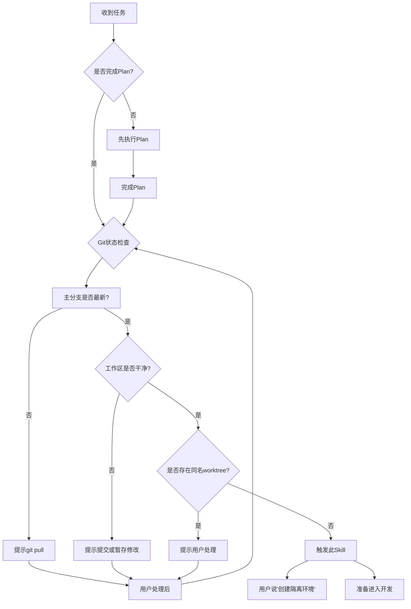
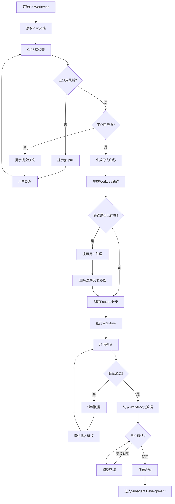
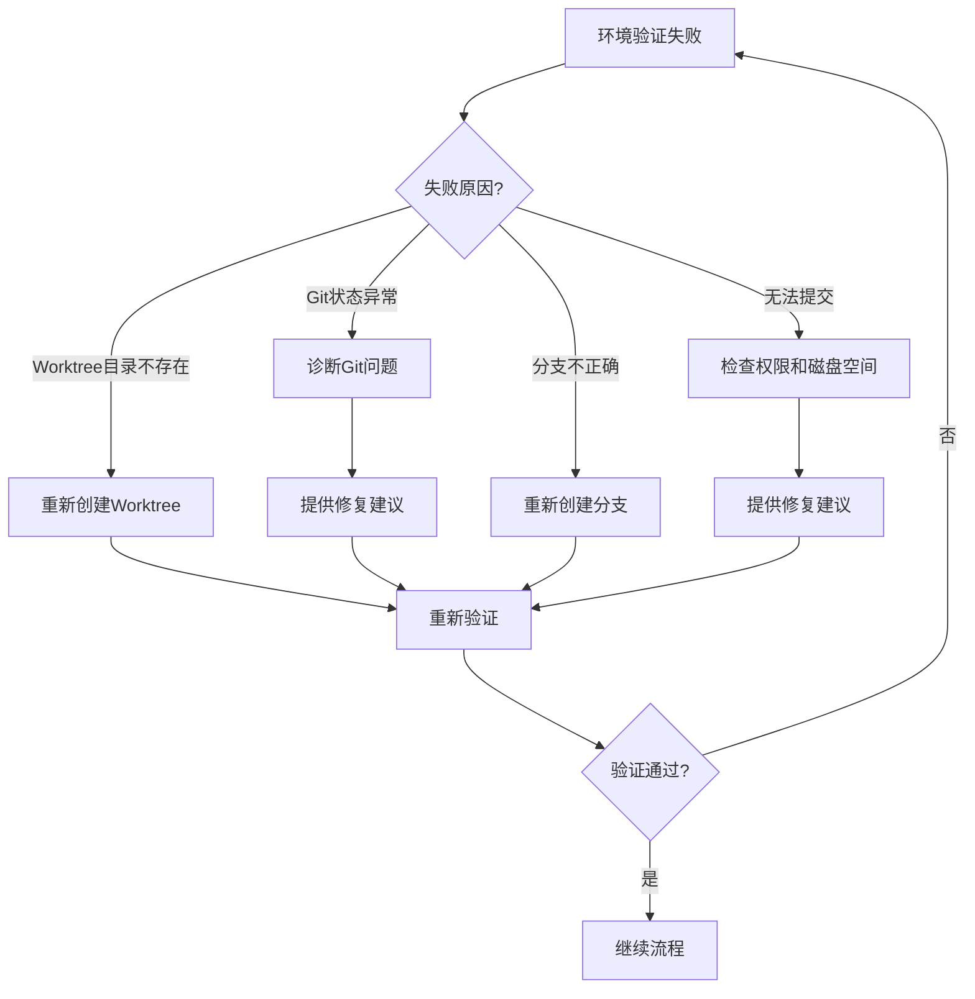

# Git Worktrees - 隔离开发环境

## Overview

使用 git worktree 创建隔离的开发环境，避免污染主分支。Git worktree 允许在同一仓库中同时检出多个分支到不同目录，支持并行开发而不互相干扰。Worktree 节点负责环境准备、分支创建、路径管理和环境验证。

**关键职责：**
- ✅ 创建隔离的 worktree 目录
- ✅ 创建 feature 分支
- ✅ 验证环境就绪
- ✅ 记录 worktree 元数据
- ❌ 不负责代码开发（由 Subagent Development 负责）

## When to Use

### 前置条件
- ✅ 已完成 Plan 节点（已有实现计划）
- ✅ Git 仓库状态检查：
  - 主分支是最新的（建议 `git pull`）
  - 工作区干净（无未提交的修改）
  - 没有未推送的提交（可选提醒）
- ✅ 检查是否已存在同名 worktree（避免冲突）

### 触发条件
当：
- 用户说"创建隔离环境..."
- 用户说"创建 worktree..."
- 用户说"准备开发环境..."
- 已有实现计划，准备进入开发阶段

### 判断流程



### 灵活性说明

**可跳过此节点：**
- ✅ 用户明确不需要隔离环境
- ✅ 单人开发模式，愿意直接在主分支开发（不推荐）
- ✅ 已有合适的开发分支，无需创建新 worktree

**不可跳过：**
- ❌ 团队协作项目（强烈建议使用 worktree）
- ❌ 需要并行开发多个功能（必须隔离）

## The Process

### 详细流程



### 步骤说明

1. **读取 Plan 文档** ⭐
   - 读取 Plan 阶段生成的实现计划（必须）
   - 获取功能名称（用于分支命名）
   - 获取任务优先级（决定分支创建顺序）

2. **Git 状态检查** ⭐
   - **主分支检查**：
     - 检查当前是否在主分支（如 `main`、`master`）
     - 检查主分支是否最新（`git fetch` + `git status`）
     - 如果不是最新，提示用户 `git pull`
   - **工作区检查**：
     - 检查是否有未提交的修改（`git status`）
     - 如果有修改，提示用户：
       - 选项 1：提交修改（`git add . && git commit`）
       - 选项 2：暂存修改（`git stash`）
       - 选项 3：取消操作
   - **冲突检查**：
     - 检查是否有未解决的冲突
     - 如果有冲突，提示用户先解决冲突

3. **生成分支名称**
   - **命名格式**：`feature/{feature-name}`
   - **命名来源**：从 Plan 文档的功能名称自动生成
   - **命名规则**：
     - 使用小写字母和连字符
     - 避免特殊字符和空格
     - 示例：`feature/user-authentication`、`feature/order-management`
   - **冲突处理**：
     - 检查分支是否已存在（`git branch --list "feature/xxx"`）
     - 如果已存在，提示用户：
       - 选项 1：切换到已存在的分支
       - 选项 2：使用其他分支名称
       - 选项 3：删除旧分支并重新创建

4. **生成 Worktree 路径**
   - **默认路径**：`../workspace/{feature-name}`
     - 例如：`../workspace/user-authentication`
   - **路径命名规则**：
     - 使用 feature 分支名称（去除 `feature/` 前缀）
     - 使用小写字母和连字符
     - 避免特殊字符和空格
   - **路径验证**：
     - 检查路径是否已存在
     - 检查父目录是否存在（如 `../workspace/`）
     - 如果父目录不存在，询问用户是否自动创建
   - **冲突处理**：
     - 如果路径已存在，提示用户：
       - 选项 1：删除已存在的目录
       - 选项 2：使用其他路径
       - 选项 3：取消操作

5. **创建 Feature 分支**
   - 从主分支创建新的 feature 分支
   - 命令：`git branch feature/{feature-name}`
   - 验证分支创建成功

6. **创建 Worktree** ⭐
   - 命令：`git worktree add {path} feature/{feature-name}`
   - 示例：`git worktree add ../workspace/user-auth feature/user-auth`
   - 验证 worktree 创建成功

7. **环境验证** ⭐
   - **自动验证**：
     - ✅ Worktree 目录存在
     - ✅ Git 状态正常（`cd {path} && git status`）
     - ✅ 分支正确（`cd {path} && git branch`）
     - ✅ 可以正常提交（测试提交 `git commit --allow-empty -m "test"`，然后撤销）
   - **手动验证**（可选）：
     - 依赖已安装（如 `npm install`、`pip install`）- 可能耗时较长
     - 开发环境可用（如编译通过）- 可能耗时较长
   - **验证失败处理**：
     - 诊断问题（检查 Git 版本、权限、磁盘空间等）
     - 提供修复建议
     - 允许用户手动修复后重新验证

8. **记录 Worktree 元数据**
   - 创建 `.claude/state/worktree.json`
   - 记录分支、路径、创建时间等信息
   - 记录关联的 Plan 文档和 Design 文档

9. **用户确认**
   - 展示 worktree 信息（分支、路径）
   - 展示环境验证结果
   - 询问用户是否就绪

### 工具使用

**Git 命令**:
- `git status` - 检查工作区状态
- `git fetch` - 获取远程更新
- `git branch` - 分支管理
- `git worktree` - worktree 管理

**Serena MCP**:
- `read_file` - 读取 Plan 文档
- `write_file` - 保存 worktree.json

## 输入来源

1. **实现计划**：来自 Plan 阶段（必须：提供功能名称和任务优先级）
2. **技术方案**：来自 Design 阶段（可选：提供技术约束）
3. **Git 仓库状态**：当前分支、工作区状态、远程分支状态
4. **用户对话**：用户自定义分支名称或路径

## 动态时间预估

| 场景 | 时间范围 | 说明 |
|-----|---------|------|
| 🟢 标准 | 5分钟 | 常规创建，Git 状态正常，无冲突 |
| 🟡 复杂 | 5-10分钟 | 需要清理、处理冲突或解决环境问题 |
| 🔴 异常 | 10-20分钟 | Git 版本不支持、权限问题、磁盘空间不足 |

## 输出产物

**产物1：** Git worktree 目录
- **路径**：`../workspace/{feature-name}`
- **内容**：完整的代码仓库副本，已切换到 feature 分支

**产物2：** Worktree 元数据文件
- **文件**：`.claude/state/worktree.json`
- **内容**：

```json
{
  "project_name": "用户认证功能",
  "main_branch": "main",
  "worktree_branch": "feature/user-authentication",
  "worktree_path": "../workspace/user-authentication",
  "created_at": "2026-02-26T10:00:00Z",
  "status": "in_progress",
  "plan_document": ".claude/designs/2026-02-26_实现计划_用户认证_v1.0.md",
  "design_document": ".claude/designs/2026-02-26_技术方案_用户认证_v1.0.md"
}
```

**字段说明**：
- `project_name`：功能名称（来自 Plan）
- `main_branch`：主分支名称（如 `main`、`master`）
- `worktree_branch`：Feature 分支名称
- `worktree_path`：Worktree 目录路径（相对路径）
- `created_at`：创建时间（ISO 8601 格式）
- `status`：Worktree 状态（`in_progress`、`completed`、`failed`）
- `plan_document`：关联的实现计划文档路径
- `design_document`：关联的技术方案文档路径

## 关键检查清单 ✅

- [ ] Plan 文档读取：是否已读取并理解实现计划？
- [ ] Git 状态检查：主分支是否最新？工作区是否干净？
- [ ] 分支创建：是否创建了新的 feature 分支？
- [ ] Worktree 路径：路径是否合理（建议 `../workspace/xxx`）？
- [ ] Worktree 创建：是否成功创建 worktree？
- [ ] 环境验证：是否验证 Git 状态正常？
- [ ] 冲突检查：是否有未解决的冲突？
- [ ] 元数据记录：是否创建了 worktree.json？

## Red Flags ⚠️

| 错误做法 | 正确做法 |
|---------|---------|
| ❌ 直接在主分支开发 | ✅ 必须使用 worktree 隔离 |
| ❌ Worktree 路径与主项目混用 | ✅ 建议使用独立目录（`../workspace/xxx`） |
| ❌ 不验证 worktree 可用性 | ✅ 必须验证环境就绪 |
| ❌ 跳过 Git 状态检查 | ✅ 必须检查主分支最新和工作区干净 |
| ❌ 不处理冲突就创建 worktree | ✅ 必须先解决冲突 |
| ❌ Git 版本不支持仍强行创建 | ✅ 检查 Git 版本（>=2.5），不支持则报错 |

## Integration

### 前置依赖
- **cadence-plan**（必须）：提供实现计划和功能名称

### 下一步
- **cadence-subagent-development**：在 worktree 中进行代码开发

### 替代方案
- 如果已有合适的开发分支，可直接进入 Subagent Development
- 用户明确不需要隔离环境，可跳过此节点（不推荐）

### 需要的输入
- 实现计划（来自 Plan，必须：提供功能名称）
- 技术方案（来自 Design，可选：提供技术约束）
- Git 仓库状态（必须：分支、工作区状态）

### 与 Plan 的衔接

**Plan 节点的输出支持 Git Worktrees：**
- ✅ 功能名称（用于分支命名）
- ✅ 任务优先级（决定分支创建顺序）
- ✅ 任务依赖（决定分支创建顺序）

**Git Worktrees 的输入来自 Plan：**
- ✅ 功能名称（用于生成 `feature/{feature-name}`）
- ✅ 实现计划文档路径（记录到 worktree.json）

### 与 Subagent Development 的衔接

**Git Worktrees 节点的输出支持 Subagent Development：**
- ✅ Worktree 路径（Subagent 在此目录工作）
- ✅ 分支名称（Subagent 在此分支开发）
- ✅ Worktree 元数据（记录在 worktree.json）

**Subagent Development 的输入来自 Git Worktrees：**
- ✅ Worktree 路径（Subagent 的工作目录）
- ✅ Feature 分支名称（Subagent 的开发分支）
- ✅ Worktree.json（提供项目上下文）

## 确认机制

创建 worktree 后：
展示 worktree 信息（分支、路径）
展示环境验证结果
展示关联的 Plan 文档和 Design 文档

询问："环境是否就绪？"
├── ✅ 是 → 保存产物，进入 subagent-development
├── ⚠️ 需要调整 → 调整环境（如重新创建、修改路径）
└── ❌ 失败 → 诊断问题，提供修复建议

## Worktree 清理策略

### 清理时机
- ✅ Subagent Development 完成
- ✅ 代码合并到主分支后
- ✅ 用户手动触发清理

### 清理步骤
1. **切换回主项目目录**
   - 确保不在 worktree 目录中操作

2. **验证合并状态** ⭐
   - 确认代码已合并到主分支（`git log main..feature/xxx`）
   - 或确认代码已推送到远程分支
   - 如果未合并，提示用户是否继续清理

3. **删除 Worktree**
   - 命令：`git worktree remove {path}`
   - 示例：`git worktree remove ../workspace/user-auth`
   - 验证 worktree 目录已删除

4. **删除 Feature 分支**（可选）
   - 命令：`git branch -d feature/{feature-name}`
   - 如果分支已合并，使用 `-d`（安全删除）
   - 如果分支未合并，使用 `-D`（强制删除，需用户确认）

5. **更新 Worktree 元数据**
   - 更新 worktree.json 中的 `status` 为 `completed`
   - 记录完成时间：`"completed_at": "2026-02-26T15:00:00Z"`

### 清理验证
- [ ] Worktree 目录已删除
- [ ] Git worktree 列表中不再显示
- [ ] Feature 分支已删除（可选）
- [ ] Worktree.json 状态已更新

## 冲突处理策略

### 常见失败场景

| 场景 | 诊断方法 | 处理策略 |
|------|---------|---------|
| **路径已存在** | `ls -la ../workspace/xxx` | 选项 1：删除已存在目录<br/>选项 2：使用其他路径<br/>选项 3：取消操作 |
| **分支已存在** | `git branch --list "feature/xxx"` | 选项 1：切换到已存在分支<br/>选项 2：使用其他分支名称<br/>选项 3：删除旧分支并重新创建 |
| **主分支有未提交修改** | `git status` | 选项 1：提交修改（`git add . && git commit`）<br/>选项 2：暂存修改（`git stash`）<br/>选项 3：取消操作 |
| **主分支不是最新** | `git fetch && git status` | 选项 1：拉取更新（`git pull`）<br/>选项 2：跳过此检查（不推荐）<br/>选项 3：取消操作 |
| **Git 版本不支持** | `git --version`（需要 >=2.5） | 报错并提示升级 Git 版本 |
| **权限不足** | 尝试创建目录失败 | 检查权限，提示用户使用 `sudo` 或修改目录权限 |
| **磁盘空间不足** | `df -h` | 提示用户清理磁盘空间 |

### 自动处理 vs 手动处理

**自动处理（无需用户确认）：**
- ❌ 不自动删除已存在的目录（风险较高）
- ❌ 不自动删除已存在的分支（可能丢失代码）

**手动处理（需用户确认）：**
- ✅ 所有冲突场景都提供选项让用户选择
- ✅ 提供清晰的诊断信息和修复建议
- ✅ 允许用户取消操作

## 环境验证策略

### 自动验证（必须）
- ✅ Worktree 目录存在（`ls -la {path}`）
- ✅ Git 状态正常（`cd {path} && git status`）
- ✅ 分支正确（`cd {path} && git branch`）
- ✅ 可以正常提交（测试提交，然后撤销）

### 手动验证（可选）
- ⏳ 依赖已安装（如 `npm install`、`pip install`）
- ⏳ 开发环境可用（如编译通过）
- ⏳ 测试通过（如 `npm test`）

**说明**：
- 自动验证快速完成（<1 分钟）
- 手动验证可能耗时较长（几分钟到几十分钟）
- 建议只执行自动验证，依赖安装和编译由 Subagent Development 负责

### 验证失败处理



## 跳过条件

- ✅ 用户明确不需要隔离环境
- ✅ 单人开发模式，愿意直接在主分支开发（不推荐）
- ✅ 已有合适的开发分支，无需创建新 worktree
- ❌ 团队协作项目（强烈建议使用 worktree）

## 与 Plan 的边界

**Plan 阶段负责：**
- ✅ 任务分解和优先级排序
- ✅ 功能名称定义
- ✅ 实现计划文档

**Git Worktrees 阶段负责：**
- ✅ 分支名称生成（基于功能名称）
- ✅ Worktree 路径生成
- ✅ 环境准备和验证
- ✅ 元数据记录

**关键区别：**
- Plan 输出：实现计划（"做什么任务"）
- Git Worktrees 输出：开发环境（"在哪里做"）
- Plan 关注任务分解
- Git Worktrees 关注环境隔离

## 与 Subagent Development 的边界

**Git Worktrees 阶段负责：**
- ✅ 创建隔离的开发环境
- ✅ 创建 feature 分支
- ✅ 环境验证（Git 状态）
- ❌ 不负责依赖安装（由 Subagent Development 负责）
- ❌ 不负责代码开发（由 Subagent Development 负责）

**Subagent Development 阶段负责：**
- ✅ 在 worktree 中开发代码
- ✅ 安装依赖（如 `npm install`）
- ✅ 编译和测试
- ✅ 代码审查

**关键区别：**
- Git Worktrees 提供环境（"在哪里做"）
- Subagent Development 提供实现（"做什么"）
- Git Worktrees 只验证 Git 环境
- Subagent Development 负责完整的开发环境（依赖、编译、测试）
