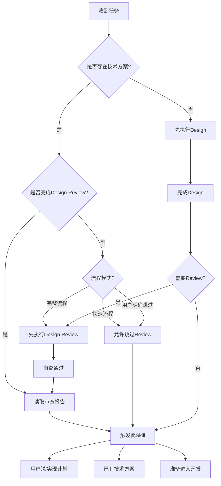
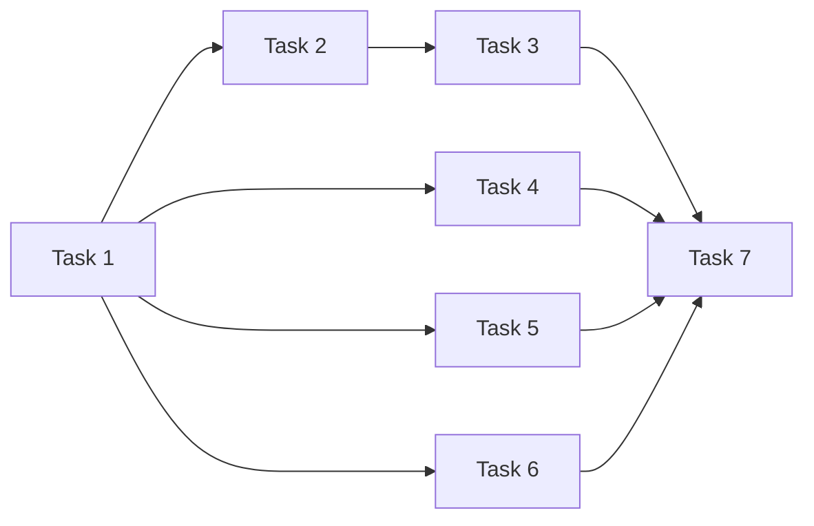

# Plan - 实现计划

## Overview

基于技术方案（必须）和审查报告（如已完成 Design Review），制定详细的实现计划。实现计划包含任务分解、任务依赖关系、并行任务识别、时间估计、验收标准等内容。注意：Plan 阶段不识别风险（风险已在 Design Review 阶段完成）。

**关键职责：**
- ✅ 将技术方案分解为可执行的任务
- ✅ 识别任务依赖关系和并行执行机会
- ✅ 为每个任务提供时间估计和验收标准
- ✅ 支持 Subagent Development 的任务分配
- ❌ 不负责风险识别（已在 Design Review 完成）

## When to Use

### 前置条件
- ✅ 已存在技术方案文档（来自 Design 或用户已有文档）
- ✅ 如果是完整流程，已通过 Design Review（可选：快速流程可跳过）

### 触发条件
当：
- 用户说"实现计划..."
- 用户说"任务分解..."
- 用户说"开发计划..."
- 已有技术方案，准备进入开发阶段
- 技术方案已通过 Design Review（完整流程）

### 判断流程



### 灵活性说明

**可跳过 Design Review：**
- ✅ 快速流程：简单功能（预估 <2 小时），可跳过 Design Review
- ✅ 用户明确要求：用户已有技术方案，明确要求跳过 Design Review
- ✅ 探索流程：原型开发，可跳过 Design Review

**不可跳过 Design Review：**
- ❌ 完整流程：复杂功能（预估 >2 小时），必须通过 Design Review
- ❌ 企业级项目：需要严格审查的项目

## The Process

### 详细流程

```mermaid
graph TB
    A[开始Plan] --> A1{是否完成Design Review?}

    A1 -->|是| B[读取审查报告]
    A1 -->|否| C[读取技术方案]

    B --> B1[理解审查要点]
    B1 --> C

    C --> C1[理解技术架构]
    C1 --> C2[读取技术栈配置] ⭐

    C2 --> C3{CLAUDE.md存在配置?}
    C3 -->|是| C4[使用CLAUDE.md配置]
    C3 -->|否| C5[自动检测+用户确认]

    C5 --> C6[建议写入CLAUDE.md]
    C4 --> D
    C6 --> D

    D[识别功能模块] --> E[拆分为任务]
    E --> F[分析任务依赖]
    F --> G[识别并行任务]
    G --> H[估计任务时间]
    H --> I[编写验收标准]
    I --> J[生成实现计划]
    J --> K{用户确认?}

    K -->|需要调整| L[调整计划]
    L --> J
    K -->|准确| M[保存产物]
    M --> N[进入Git Worktrees]
```

### 步骤说明

1. **读取审查报告**（可选）
   - 如果已完成 Design Review，读取审查报告
   - 理解审查要点和关键问题
   - 标注需要在实现中注意的事项
   - 确认 P0 问题已在设计中解决

2. **读取技术方案** ⭐
   - 读取 Design 阶段生成的技术方案（必须）
   - 或读取用户提供的已有技术方案
   - 理解系统架构、数据模型、API 设计
   - 理解技术选型和约束

3. **读取技术栈配置** ⭐⭐（新增）
   - **步骤 1：检查 CLAUDE.md**
     - 读取项目根目录的 `CLAUDE.md` 文件
     - 查找 `project_tech_stack` 配置
     - 如果存在 → 直接使用
   - **步骤 2：如果 CLAUDE.md 没有配置**
     - 自动检测项目类型（package.json、requirements.txt 等）
     - **与用户确认技术栈配置**
     - 建议用户将配置写入 CLAUDE.md
   - **步骤 3：整理输出**
     - 将技术栈信息输出到 Plan 文档的"技术栈配置"章节
     - 每个任务继承项目技术栈配置

4. **识别功能模块**
   - 将技术方案按模块划分
   - 识别核心模块和扩展模块
   - 识别模块间的依赖关系
   - 确定模块优先级（P0/P1/P2）

5. **拆分为任务** ⭐
   - 将每个模块拆分为具体任务
   - **任务粒度标准**：
     - 每个任务可独立完成（1-4 小时）
     - 每个任务有明确的验收标准
     - 每个任务可以分配给单个开发者
   - 标注任务优先级（P0/P1/P2）
   - 标注任务复杂度（简单/中等/复杂）

6. **分析任务依赖** ⭐
   - 识别任务间的依赖关系
   - 标注前置任务
   - 绘制依赖关系图（使用 Mermaid）
   - 识别关键路径

7. **识别并行任务** ⭐
   - 识别可以并行执行的任务
   - 标注并行任务组
   - 提供并行执行建议
   - 为 Subagent Development 提供并发能力支持

8. **估计任务时间**
   - 每个任务给出时间范围（如 1-2 小时）
   - 基于任务复杂度（简单/中等/复杂）
   - 考虑存量代码改造的影响
   - 计算总时间（串行路径 + 并行最长路径）

9. **编写验收标准** ⭐
   - 每个任务必须有可测试的验收标准
   - 验收标准清晰、具体、可验证
   - 验收标准与需求文档的验收标准对应
   - 标注验收标准的优先级

9. **生成实现计划**
   - 汇总为完整的实现计划文档
   - 包含任务清单、依赖关系、并行建议、时间估计
   - 不包含风险评估（已在 Design Review 完成）

10. **用户确认**
    - 确保实现计划合理可行
    - 确认任务分解是否完整

### 工具使用

**Serena MCP**:
- `read_file` - 读取技术方案和审查报告
- `write_file` - 保存实现计划

**Mermaid**:
- 绘制任务依赖关系图
- 绘制任务执行甘特图

## 输入来源

1. **技术方案**：来自 Design 阶段或用户已有文档（必须）
2. **审查报告**：来自 Design Review 阶段（可选：完整流程需要）
3. **需求文档**：来自 Requirement 阶段（可选：提供验收标准参考）
4. **用户对话**：用户补充任务细节和优先级调整

## 动态时间预估

| 复杂度 | 时间范围 | 说明 |
|-------|---------|------|
| 🟢 简单 | 5-10分钟 | 3-5个任务，依赖关系简单 |
| 🟡 中等 | 10-20分钟 | 5-10个任务，有一定依赖关系 |
| 🔴 复杂 | 20-40分钟 | 10+个任务，复杂依赖关系和并行任务 |

## 输出产物

**文件：** `.claude/designs/{date}_实现计划_{功能名称}_v1.0.md`

**内容结构：**
```markdown
# 实现计划

## 1. 任务概览
- 总任务数：X 个
- 预计总时间：X-Y 小时
- 并行任务数：X 个
- 关键路径：Task 1 → Task 2 → Task 3

## 2. 任务清单

### Phase 1：基础任务（P0）
#### Task 1：[任务名称]
- **优先级**：P0
- **复杂度**：中等
- **时间估计**：2-3 小时
- **依赖**：无
- **描述**：[任务详细描述]
- **技术约束**：[来自技术方案的约束]
- **验收标准**：
  - ✅ 标准 1：[具体可验证的标准]
  - ✅ 标准 2：[具体可验证的标准]

#### Task 2：[任务名称]
- **优先级**：P0
- **复杂度**：简单
- **时间估计**：1-2 小时
- **依赖**：Task 1
- **描述**：[任务详细描述]
- **验收标准**：
  - ✅ 标准 1
  - ✅ 标准 2

### Phase 2：核心任务（P0）
...

### Phase 3：扩展任务（P1/P2）
...

## 3. 任务依赖关系

### 依赖关系图
[Mermaid 依赖关系图]



### 关键路径
- **关键路径**：Task 1 → Task 2 → Task 3 → Task 7
- **关键路径时间**：8-12 小时

## 4. 并行执行建议

### 可并行任务组
#### 并行组 1（Phase 1 完成后）
- Task 4（预计 2-3 小时）
- Task 5（预计 1-2 小时）
- Task 6（预计 2-3 小时）
- **并行执行时间**：3 小时（取最长）
- **串行执行时间**：6-8 小时
- **节省时间**：3-5 小时

### 串行任务链
- Task 1 → Task 2 → Task 3（必须串行）

### 并行执行策略
- **策略 1**：优先执行关键路径任务（Task 1-3-7）
- **策略 2**：并行执行非关键路径任务（Task 4-5-6）
- **策略 3**：Task 7 等待所有前置任务完成

## 5. Subagent Development 支持

### 任务分配建议
- **Task 1**：可分配给 Subagent-1（独立任务）
- **Task 4、5、6**：可并行分配给 Subagent-1、2、3（并行任务组）
- **Task 7**：需等待 Task 4、5、6 完成后分配

### 任务优先级排序
1. Task 1（P0，无依赖）
2. Task 2（P0，依赖 Task 1）
3. Task 3（P0，依赖 Task 2）
4. Task 4、5、6（P0，可并行）
5. Task 7（P0，依赖 Task 3、4、5、6）

### 任务描述格式（供 Subagent 使用）
```yaml
task_id: task-1
task_name: "实现用户登录 API"
priority: P0
complexity: 中等
estimated_time: "2-3 小时"
dependencies: []
description: |
  实现用户登录 API，支持用户名/密码登录，返回 JWT token
technical_constraints:
  - 使用 Express.js 框架
  - 使用 JWT 进行身份验证
  - 密码使用 bcrypt 加密
tech_stack:
  language: "javascript"
  test_command: "npm test"
  test_coverage_command: "npm run test:coverage"
  lint_command: "npm run lint"
  format_command: "npm run format"
  coverage_threshold: 80
acceptance_criteria:
  - ✅ 支持用户名/密码登录
  - ✅ 返回有效的 JWT token
  - ✅ 错误处理完善（用户不存在、密码错误）
  - ✅ 单元测试覆盖率 > 80%
```

## 6. 技术栈配置（新增）⭐

### 6.1 读取项目技术栈

**步骤 1：检查 CLAUDE.md**

读取项目根目录的 `CLAUDE.md` 文件，查找 `project_tech_stack` 配置：

```yaml
# CLAUDE.md 示例
project_tech_stack:
  language: "python"
  test_command: "pytest tests/"
  test_coverage_command: "pytest --cov=src --cov-report=term-missing --cov-fail-under=80"
  lint_command: "flake8 src/"
  format_command: "black src/"
  coverage_threshold: 80
```

**步骤 2：如果 CLAUDE.md 没有配置**

1. **自动检测项目类型**：
   - 检查 `package.json` → JavaScript/TypeScript
   - 检查 `requirements.txt` / `pyproject.toml` → Python
   - 检查 `pom.xml` / `build.gradle` → Java
   - 检查 `go.mod` → Go
   - 检查 `Cargo.toml` → Rust

2. **与用户确认**：
   ```
   检测到您的项目是 [Python] 项目。

   建议的技术栈配置：
   - 语言：Python
   - 测试命令：pytest tests/
   - 覆盖率命令：pytest --cov=src --cov-report=term-missing
   - Lint 命令：flake8 src/
   - Format 命令：black src/
   - 覆盖率标准：80%

   是否确认使用此配置？
   [ ] 确认使用
   [ ] 手动指定
   ```

3. **建议用户写入 CLAUDE.md**：
   ```
   💡 建议：将以下配置添加到项目根目录的 CLAUDE.md 文件，
      避免每次创建 Plan 都要确认：

   # 项目技术栈配置
   project_tech_stack:
     language: "python"
     test_command: "pytest tests/"
     test_coverage_command: "pytest --cov=src --cov-report=term-missing --cov-fail-under=80"
     lint_command: "flake8 src/"
     format_command: "black src/"
     coverage_threshold: 80
   ```

### 6.2 输出到 Plan 文档

将技术栈信息整理并输出到 Plan 文档的 "技术栈配置" 章节：

```yaml
tech_stack:
  source: "CLAUDE.md"  # 或 "auto-detect"
  language: "python"
  test_command: "pytest tests/"
  test_coverage_command: "pytest --cov=src --cov-report=term-missing --cov-fail-under=80"
  lint_command: "flake8 src/"
  lint_check_command: "flake8 src/ --exit-zero"
  format_command: "black src/"
  format_check_command: "black --check src/"
  coverage_threshold: 80
```

### 6.3 任务中的技术栈

每个任务继承项目技术栈，可以针对任务覆盖特定配置：

```yaml
task_id: task-1
task_name: "实现用户登录 API"
tech_stack:
  language: "python"  # 继承自项目
  test_command: "pytest tests/test_auth.py"  # 覆盖为任务特定的测试命令
  # 其他配置继承自项目
```

### 6.4 Subagent 使用技术栈的优先级

Subagent 执行任务时，按以下优先级获取技术栈信息：

**Priority 1: Task Description（最高优先级）**
- 任务描述中包含 `tech_stack` 部分
- 来自 Plan 的任务配置
- 可以覆盖项目级配置

**Priority 2: CLAUDE.md（次优先级）**
- 项目根目录的 `CLAUDE.md` 文件
- 包含 `project_tech_stack` 配置
- 项目级默认配置

**Priority 3: Auto-Detect + User Confirm（兜底）**
- 检测项目文件（package.json、requirements.txt 等）
- **必须与用户确认**
- 建议用户将配置写入 CLAUDE.md

**检测流程**：
```
1. 检查任务描述中是否有 tech_stack
   ↓ 如果没有
2. 检查 CLAUDE.md 中是否有 project_tech_stack
   ↓ 如果还没有
3. 自动检测 → 询问用户确认 → 建议写入 CLAUDE.md
```

### 6.5 多语言配置示例

#### JavaScript/TypeScript 项目
```yaml
project_tech_stack:
  language: "typescript"
  test_command: "npm test"
  test_coverage_command: "npm run test:coverage"
  lint_command: "npm run lint"
  lint_check_command: "npm run lint:check"
  format_command: "npm run format"
  format_check_command: "npm run format:check"
  coverage_threshold: 80
```

#### Python 项目
```yaml
project_tech_stack:
  language: "python"
  test_command: "pytest tests/"
  test_coverage_command: "pytest --cov=src --cov-report=term-missing --cov-fail-under=80"
  lint_command: "flake8 src/"
  lint_check_command: "flake8 src/ --exit-zero"
  format_command: "black src/"
  format_check_command: "black --check src/"
  coverage_threshold: 80
```

#### Java (Maven) 项目
```yaml
project_tech_stack:
  language: "java"
  test_command: "mvn test"
  test_coverage_command: "mvn test jacoco:report"
  lint_command: "mvn checkstyle:check"
  format_command: "mvn spotless:apply"
  format_check_command: "mvn spotless:check"
  coverage_threshold: 80
```

#### Java (Gradle) 项目
```yaml
project_tech_stack:
  language: "java"
  test_command: "./gradlew test"
  test_coverage_command: "./gradlew test jacocoTestReport"
  lint_command: "./gradlew checkstyleMain"
  format_command: "./gradlew spotlessApply"
  format_check_command: "./gradlew spotlessCheck"
  coverage_threshold: 80
```

#### Go 项目
```yaml
project_tech_stack:
  language: "go"
  test_command: "go test ./..."
  test_coverage_command: "go test -coverprofile=coverage.out ./... && go tool cover -func=coverage.out"
  lint_command: "golint ./..."
  format_command: "gofmt -w ."
  format_check_command: "gofmt -l ."
  coverage_threshold: 80
```

#### Rust 项目
```yaml
project_tech_stack:
  language: "rust"
  test_command: "cargo test"
  test_coverage_command: "cargo tarpaulin --out Stdout --fail-under 80"
  lint_command: "cargo clippy"
  format_command: "cargo fmt"
  format_check_command: "cargo fmt -- --check"
  coverage_threshold: 80
```

## 7. 验收清单

### 功能验收
- [ ] 所有 P0 任务完成
- [ ] 所有验收标准通过
- [ ] 单元测试覆盖率 ≥ 项目标准
- [ ] 集成测试通过

### 代码质量验收
- [ ] 代码通过 Linter 检查
- [ ] 代码通过 Formatter 检查
- [ ] 代码通过 Code Review

### 文档验收
- [ ] API 文档完整
- [ ] README 更新（如需要）

## 8. 实现注意事项

### 来自 Design Review 的要点
- **要点 1**：[来自审查报告的关键注意事项]
- **要点 2**：[来自审查报告的关键注意事项]

### 技术约束
- **约束 1**：[来自技术方案的约束]
- **约束 2**：[来自技术方案的约束]

### 存量代码改造
- **改造 1**：[需要改造的存量代码]
- **改造 2**：[需要改造的存量代码]
```

## 关键检查清单 ✅

- [ ] 技术方案读取：是否已读取并理解技术方案？
- [ ] 任务完整性：是否覆盖了所有功能点？
- [ ] 任务粒度：每个任务是否可独立完成（1-4 小时）？
- [ ] 依赖关系：任务间依赖是否清晰标注？
- [ ] 并行识别：是否识别了可并行执行的任务？
- [ ] 时间估计：每个任务是否有合理的时间估计？
- [ ] 验收标准：每个任务是否有明确可测试的验收标准？
- [ ] 优先级排序：任务是否有优先级排序（P0/P1/P2）？
- [ ] Subagent 支持：任务描述是否足够支持 Subagent 执行？

## Red Flags ⚠️

| 错误做法 | 正确做法 |
|---------|---------|
| ❌ 没有技术方案就做 Plan | ✅ 必须先完成 Design 或使用已有技术方案 |
| ❌ 任务粒度过大（>4 小时） | ✅ 任务应该可独立执行，1-4 小时 |
| ❌ 任务粒度过小（<30 分钟） | ✅ 合并过小任务，保持合理粒度 |
| ❌ 忽略任务依赖 | ✅ 必须明确任务间的依赖关系 |
| ❌ 没有验收标准 | ✅ 每个任务必须有可测试的验收标准 |
| ❌ 未识别并行任务 | ✅ 必须识别可并行执行的任务 |
| ❌ 在 Plan 阶段识别风险 | ✅ 风险已在 Design Review 阶段识别 |
| ❌ 时间估计过于乐观 | ✅ 给出合理的时间范围 |

## Integration

### 前置依赖
- **cadence-design**（必须）：提供技术方案
- **cadence-design-review**（可选）：完整流程需要，快速流程可跳过

### 下一步
- **cadence-using-git-worktrees**：创建隔离的开发环境

### 替代方案
- 如果已有实现计划，可直接进入 Git Worktrees
- 极简单功能可跳过此节点（需用户确认）

### 需要的输入
- 技术方案（来自 Design 或用户已有文档，必须）
- 审查报告（来自 Design Review，可选：完整流程需要）
- 需求文档（来自 Requirement，可选：提供验收标准参考）

### 与 Design Review 的关系

**完整流程：**
```
Design → Design Review → Plan（带着审查报告）
```

**快速流程：**
```
Design → Plan（跳过 Design Review）
```

**Plan 节点处理审查报告：**
- ✅ 如果存在审查报告，读取并理解审查要点
- ✅ 在实现计划中标注来自审查的关键注意事项
- ✅ 确认 P0 问题已在设计中解决
- ❌ 不重新识别风险（风险已在 Design Review 完成）

## 确认机制

生成实现计划后：
展示任务清单（按优先级分组）
展示任务依赖关系图
展示并行执行建议
展示总时间估计
**如果存在审查报告，展示来自审查的关键注意事项**

询问："实现计划是否合理？有没有遗漏？"
├── ✅ 合理 → 保存产物，进入 git-worktrees
├── ⚠️ 需要调整 → 调整计划
└── ❌ 不可行 → 重新设计

## 跳过条件

- 已存在详细的实现计划文档
- 极简单功能（1-2 个任务，无需详细计划）
- 纯原型开发（探索阶段）
- 用户明确表示不需要

## 与 Design 的边界

**Design 阶段负责：**
- ✅ 技术方案（架构、数据模型、API、技术选型）
- ✅ 技术方案的可行性分析
- ✅ 技术方案的详细设计

**Plan 阶段负责：**
- ✅ 任务分解（将技术方案拆分为具体任务）
- ✅ 任务依赖关系和并行识别
- ✅ 任务时间估计和验收标准
- ✅ Subagent Development 的任务分配支持

**关键区别：**
- Design 输出：技术方案（1 个文档，"怎么做"）
- Plan 输出：实现计划（1 个文档，"做什么任务"）
- Design 关注技术选型和架构设计
- Plan 关注任务分解和执行计划
- Plan 不改变技术方案，只负责拆解和规划

## 与 Git Worktrees 的衔接

**Plan 节点的输出支持 Git Worktrees：**
- ✅ 任务清单明确，可创建对应的 feature 分支
- ✅ 优先级清晰，可按优先级创建分支（P0 优先）
- ✅ 依赖关系明确，可按依赖顺序创建分支

**Git Worktrees 的输入来自 Plan：**
- ✅ 功能名称（来自实现计划）
- ✅ 任务优先级（决定分支创建顺序）
- ✅ 任务依赖（决定分支创建顺序）

## 与 Subagent Development 的衔接

**Plan 节点的输出支持 Subagent Development：**
- ✅ 每个任务可以直接分配给 Subagent
- ✅ 任务描述包含：目标、约束、验收标准、依赖、时间
- ✅ 并行任务识别支持 Subagent 并发执行
- ✅ 优先级排序支持任务执行顺序

**Subagent Development 的输入来自 Plan：**
- ✅ 任务清单（Task 1、Task 2、Task 3...）
- ✅ 任务描述（YAML 格式，可直接使用）
- ✅ 并行执行建议（可并发执行的 Subagent）
- ✅ 验收标准（用于 Code Review）
