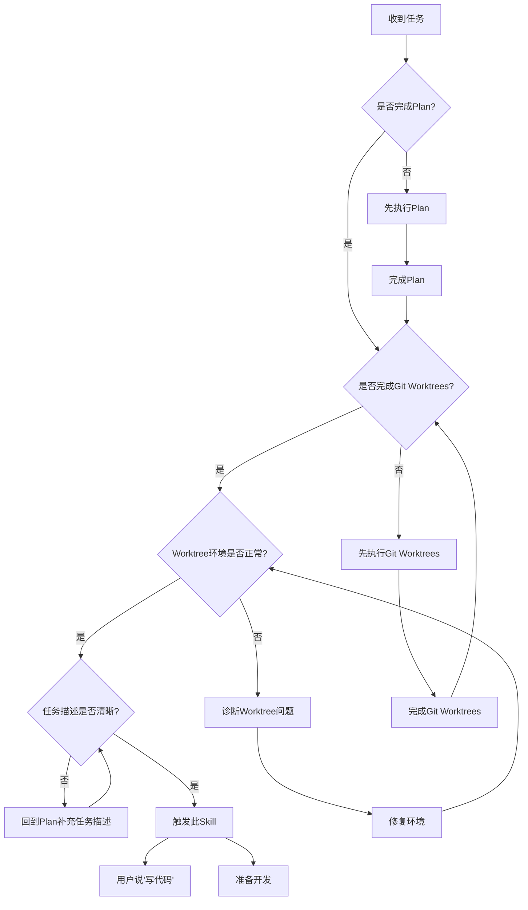
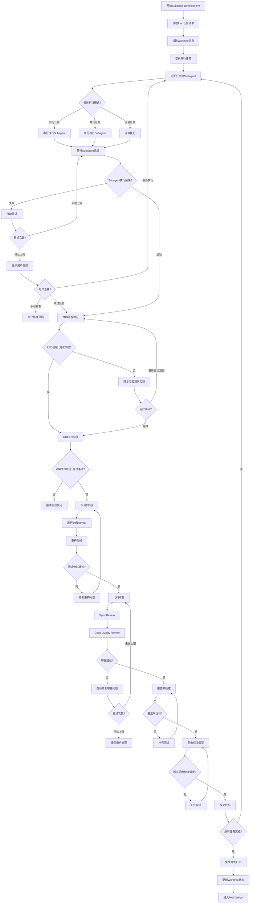

# Subagent Development - 代码实现与单元测试

## Overview

使用 Subagent（子代理）开发代码，强制遵循 TDD（测试驱动开发）流程，同时编写单元测试，并进行代码质量审查。Subagent Development 是整个流程的核心执行节点，负责将技术方案和实现计划转化为可运行的代码。

**关键职责：**
- ✅ 使用 Subagent 开发代码
- ✅ 强制执行 TDD 流程（RED → GREEN → BLUE）
- ✅ 编写单元测试并验证覆盖率
- ✅ 自动运行 lint 和 format 检查
- ✅ 触发代码审查（Spec Review + Code Quality Review）
- ✅ 验证所有验收标准
- ❌ 不负责集成测试（由 Integration 节点负责）

**核心特性：**
- 🤖 **Subagent 驱动**：使用 Task 工具调用 Subagent 开发代码
- 🧪 **TDD 强制执行**：严格遵循 RED-GREEN-BLUE 三阶段
- 📊 **并行执行能力**：支持最多 49 个 Subagent 并发执行
- 🔍 **自动审查**：每个任务完成后自动触发代码审查
- ✅ **验收标准验证**：确保所有验收标准全部满足

## When to Use

### 前置条件
- ✅ 已完成 Plan 节点（已有任务清单和验收标准）
- ✅ 已完成 Git Worktrees 节点（已有隔离的开发环境）
- ✅ Worktree 环境验证通过（Git 状态正常）
- ✅ 任务描述清晰（包含技术约束和验收标准）

### 触发条件
当：
- 用户说"写代码..."
- 用户说"实现功能..."
- 用户说"开发..."
- 已有实现计划和隔离环境，准备开发

### 判断流程



### 灵活性说明

**不可跳过此节点：**
- ❌ 所有开发任务都必须通过此节点执行
- ❌ 不允许直接在主分支开发（必须使用 worktree）
- ❌ 不允许跳过 TDD 流程（必须先写测试）
- ❌ 不允许跳过代码审查（必须通过审查）

**可调整的参数：**
- ✅ 并发 Subagent 数量（默认最多 5 个，可调整到 49 个）
- ✅ 测试覆盖率标准（默认 80%，可根据任务优先级调整）
- ✅ 自动重试次数（默认 3 次，可调整）

## The Process

### 详细流程



### 步骤说明

#### 1. **读取 Plan 任务清单** ⭐
- 读取 Plan 阶段生成的实现计划（必须）
- 获取任务清单（包含任务名称、描述、优先级、依赖关系）
- 获取验收标准（每个任务必须满足的验收标准）
- 获取技术约束（来自 Design 的技术选型和约束）
- 获取时间估计（用于超时提醒）

#### 2. **读取 Worktree 信息** ⭐
- 读取 `.claude/state/worktree.json`
- 获取 worktree 路径（Subagent 的工作目录）
- 获取 feature 分支名称（Subagent 的开发分支）
- 验证 worktree 环境是否正常：
  - Worktree 目录存在
  - Git 状态正常
  - 分支正确

#### 3. **识别并行任务**
- 从 Plan 任务清单中识别可并行执行的任务
- 识别依据：
  - 任务间无依赖关系
  - 任务操作不同的文件（避免冲突）
  - Plan 节点已标注为并行任务组
- 并发限制：
  - 最多同时运行 5 个 Subagent（默认）
  - 可根据项目需求调整（最多 49 个）
  - 如果任务数 > 并发限制，分批执行

#### 4. **分配任务给 Subagent**
- **任务分配格式**：
  ```yaml
  task_id: task-1
  task_name: "实现用户登录 API"
  priority: P0
  complexity: 中等
  estimated_time: "2-3 小时"
  dependencies: []
  worktree_path: "../workspace/user-auth"
  feature_branch: "feature/user-auth"
  description: |
    实现用户登录 API，支持用户名/密码登录，返回 JWT token
  technical_constraints:
    - 使用 Express.js 框架
    - 使用 JWT 进行身份验证
    - 密码使用 bcrypt 加密
  acceptance_criteria:
    - ✅ 支持用户名/密码登录
    - ✅ 返回有效的 JWT token
    - ✅ 错误处理完善（用户不存在、密码错误）
    - ✅ 单元测试覆盖率 > 80%
  ```
- **任务分配策略**：
  - 串行任务：按 Plan 的顺序依次分配
  - 并行任务：同时分配给多个 Subagent
  - 混合任务：先串行，后并行

#### 5. **Subagent 执行任务**
- 使用 Task 工具调用 Subagent
- Subagent 在 worktree 目录中工作
- Subagent 在 feature 分支上开发
- **执行模式**：
  - **串行执行**：Task 1 → Task 2 → Task 3
  - **并行执行**：Task 4 || Task 5 || Task 6
  - **混合执行**：Task 1 → Task 2 → [Task 4 || Task 5 || Task 6] → Task 7

#### 6. **TDD 流程强制执行** ⭐⭐⭐
- **RED 阶段**：先写失败的测试
  - Subagent 编写测试文件
  - 验证测试失败（确保测试有效）
  - 提交测试文件（commit message: `test: add test for {feature}`）
  - 如果测试通过 → 提示可能测试无效，询问用户是否继续
- **GREEN 阶段**：编写最小代码通过测试
  - Subagent 编写最小实现代码
  - 验证测试通过
  - 提交实现代码（commit message: `feat: implement {feature}`）
  - 如果测试失败 → 提示代码实现不完整，继续实现
- **BLUE 阶段**：重构代码，保持测试通过
  - Subagent 重构代码（优化性能、提升可读性）
  - 运行 lint 和 format 检查
  - 验证测试仍然通过
  - 提交重构代码（commit message: `refactor: optimize {feature}`）
  - 如果测试失败 → 提示重构引入了 bug，修复问题

#### 7. **代码审查** ⭐
- **审查触发时机**：每个 Subagent 完成一个任务后，立即审查
- **审查类型**：
  - **Spec Review**：验证实现是否符合需求文档
  - **Code Quality Review**：验证代码质量（lint、format、复杂度）
  - **Test Coverage Review**：验证测试覆盖率
- **审查流程**：
  1. Subagent 提交代码
  2. 自动运行 lint、format、测试
  3. 触发 Code Review（使用 `cadence-requesting-code-review`）
  4. 审查通过 → 标记任务完成
  5. 审查失败 → Subagent 自动修复，最多重试 2 次

#### 8. **覆盖率检查** ⭐
- **覆盖率标准**：
  - 🟢 优秀：≥ 80%
  - 🟡 合格：60-80%
  - 🔴 不合格：< 60%
- **强制要求**：
  - ✅ P0 任务：覆盖率必须 ≥ 80%（强制）
  - ✅ P1 任务：覆盖率建议 ≥ 70%（推荐）
  - ✅ P2 任务：覆盖率建议 ≥ 60%（可选）
- **覆盖率检查流程**：
  - 自动运行测试覆盖率工具（如 `jest --coverage`、`pytest --cov`）
  - 覆盖率不达标 → 提示 Subagent 补充测试，最多重试 2 次
  - 覆盖率达标 → 通过检查

#### 9. **验收标准验证** ⭐
- 读取任务的验收标准（来自 Plan）
- 逐项验证验收标准是否满足
- **验证方式**：
  - 自动验证：测试通过、lint 通过、覆盖率达标
  - 手动验证：用户确认功能符合预期
- 未满足的标准 → 提示 Subagent 补充实现
- 所有标准满足 → 标记任务完成

#### 10. **提交代码**
- **提交时机**：
  - RED 阶段：提交测试文件
  - GREEN 阶段：提交实现代码
  - BLUE 阶段：提交重构代码
- **提交信息格式**：
  - 遵循 Conventional Commits 规范
  - 格式：`<type>(<scope>): <subject>`
  - 示例：
    - `feat(auth): implement user login API`
    - `test(auth): add test for user login API`
    - `refactor(auth): optimize password validation`
- **提交验证**：
  - 提交前自动运行 lint、format、测试
  - 提交信息格式检查
  - 提交后验证提交成功

#### 11. **失败处理** ⭐
- **失败类型**：
  - **测试失败**：单元测试未通过
  - **审查失败**：代码审查发现问题
  - **覆盖率不足**：测试覆盖率未达标
  - **验收失败**：未满足所有验收标准
  - **超时失败**：任务执行时间超过预期
- **自动重试**：
  - ✅ 测试失败 → Subagent 自动修复，最多重试 3 次
  - ✅ 审查失败 → Subagent 自动修复，最多重试 2 次
  - ✅ 覆盖率不足 → Subagent 自动补充测试，最多重试 2 次
  - ❌ 验收失败 → 提示用户手动处理（可能需求不明确）
  - ❌ 超时失败 → 提示用户是否继续或跳过
- **人工介入**：
  - 自动重试次数用尽后，提示用户
  - 选项：
    - 选项 1：手动修复代码
    - 选项 2：调整验收标准
    - 选项 3：跳过此任务
    - 选项 4：重新执行 Subagent

#### 12. **生成开发日志**
- 记录每个任务的执行情况：
  - 任务名称、开始时间、结束时间
  - 提交记录（commit hash、commit message）
  - 测试覆盖率、审查状态
- 保存到 `.claude/state/development_log.json`

#### 13. **更新 Worktree 状态**
- 更新 worktree.json 中的 `status` 为 `completed`
- 记录完成时间：`"completed_at": "2026-02-26T15:00:00Z"`

### 工具使用

**Task 工具**:
- 调用 Subagent 执行开发任务
- 支持并行调用多个 Subagent

**Bash 工具**:
- 运行测试（`npm test`、`pytest`）
- 运行 lint（`npm run lint`、`eslint`）
- 运行 format（`npm run format`、`prettier`）
- Git 操作（`git add`、`git commit`、`git push`）

**Serena MCP**:
- `read_file` - 读取 Plan 文档、worktree.json
- `write_file` - 保存开发日志

## 输入来源

1. **实现计划**：来自 Plan 阶段（必须：任务清单、验收标准）
2. **Worktree 信息**：来自 Git Worktrees 阶段（必须：工作目录、分支）
3. **技术方案**：来自 Design 阶段（可选：技术约束）
4. **需求文档**：来自 Requirement 阶段（可选：验收标准参考）
5. **用户对话**：用户补充任务细节、确认验收

## 动态时间预估

| 复杂度 | 时间范围 | 说明 |
|-------|---------|------|
| 🟢 简单 | 30-60分钟 | 1-3个任务，无并行 |
| 🟡 中等 | 60-120分钟 | 3-5个任务，部分并行 |
| 🔴 复杂 | 120-240分钟 | 5+个任务，大量并行 |

**时间计算**：
- 串行任务时间 = Sum(每个任务的时间)
- 并行任务时间 = Max(并行任务中最长的时间)
- 总时间 = 串行任务时间 + 并行任务时间 + 审查时间

## 输出产物

### 产物1：业务代码和测试代码
- **位置**：Worktree 目录中
- **内容**：
  - 业务代码（实现功能）
  - 单元测试代码（测试业务代码）
  - 配置文件（如需要）

### 产物2：Git 提交记录
- **位置**：Feature 分支上
- **内容**：
  - 测试提交（RED 阶段）
  - 实现提交（GREEN 阶段）
  - 重构提交（BLUE 阶段）

### 产物3：开发日志
- **文件**：`.claude/state/development_log.json`
- **内容**：

```json
{
  "project_name": "用户认证功能",
  "worktree_path": "../workspace/user-auth",
  "feature_branch": "feature/user-authentication",
  "started_at": "2026-02-26T10:00:00Z",
  "completed_at": "2026-02-26T15:00:00Z",
  "total_tasks": 5,
  "completed_tasks": 5,
  "tasks": [
    {
      "task_id": "task-1",
      "task_name": "实现用户登录 API",
      "priority": "P0",
      "complexity": "中等",
      "estimated_time": "2-3 小时",
      "actual_time": "2.5 小时",
      "status": "completed",
      "started_at": "2026-02-26T10:00:00Z",
      "completed_at": "2026-02-26T12:30:00Z",
      "tdd_stages": {
        "red": {
          "status": "completed",
          "commit": "abc1234",
          "commit_message": "test(auth): add test for user login API"
        },
        "green": {
          "status": "completed",
          "commit": "def5678",
          "commit_message": "feat(auth): implement user login API"
        },
        "blue": {
          "status": "completed",
          "commit": "ghi9012",
          "commit_message": "refactor(auth): optimize password validation"
        }
      },
      "test_coverage": "85%",
      "review_status": "passed",
      "review_issues": [],
      "acceptance_criteria": [
        {
          "criterion": "支持用户名/密码登录",
          "status": "passed"
        },
        {
          "criterion": "返回有效的 JWT token",
          "status": "passed"
        },
        {
          "criterion": "错误处理完善",
          "status": "passed"
        },
        {
          "criterion": "单元测试覆盖率 > 80%",
          "status": "passed"
        }
      ]
    }
  ],
  "summary": {
    "total_commits": 15,
    "total_test_coverage": "83%",
    "total_review_issues": 2,
    "resolved_review_issues": 2
  }
}
```

### 产物4：Worktree 状态更新
- **文件**：`.claude/state/worktree.json`
- **更新**：`"status": "completed"`

## 关键检查清单 ✅

### TDD 流程检查
- [ ] RED 阶段：是否先写测试？
- [ ] RED 阶段：测试是否失败（验证测试有效）？
- [ ] GREEN 阶段：测试是否通过？
- [ ] BLUE 阶段：重构后测试是否仍然通过？

### 代码质量检查
- [ ] 是否通过 lint 检查？
- [ ] 是否通过 format 检查？
- [ ] 单元测试覆盖率是否达标（P0 ≥ 80%）？
- [ ] 代码复杂度是否合理？

### 代码审查检查
- [ ] 是否进行了代码审查？
- [ ] 是否修复了审查发现的问题？
- [ ] 审查是否通过？

### 实现完整性检查
- [ ] 是否实现了所有验收标准？
- [ ] 是否有遗漏的功能点？
- [ ] 是否符合需求文档？

### Git 提交检查
- [ ] 是否在 feature 分支上提交？
- [ ] 提交信息是否符合 Conventional Commits 规范？
- [ ] 是否提交了测试代码和业务代码？

## Red Flags ⚠️

| 错误做法 | 正确做法 |
|---------|---------|
| ❌ 没有 worktree 直接开发 | ✅ 必须先创建隔离环境 |
| ❌ 先写代码后写测试 | ✅ 必须遵循 TDD 流程（RED → GREEN → BLUE） |
| ❌ 跳过代码审查 | ✅ 每个任务完成后都必须审查 |
| ❌ 实现与需求不符 | ✅ 必须验证所有验收标准 |
| ❌ 多个 Subagent 同时开发同一任务 | ✅ 必须确保任务隔离，避免冲突 |
| ❌ 跳过 lint/format 检查 | ✅ 必须通过 lint 和 format 检查 |
| ❌ 测试覆盖率不足仍标记完成 | ✅ P0 任务必须达到 80% 覆盖率 |
| ❌ 提交信息格式不规范 | ✅ 必须遵循 Conventional Commits 规范 |

## Integration

### 前置依赖
- **cadence-plan**（必须）：提供任务清单和验收标准
- **cadence-using-git-worktrees**（必须）：提供隔离的开发环境
- **cadence-design**（可选）：提供技术约束和方案

### 内置流程
- **cadence-test-driven-development**：TDD 流程（RED → GREEN → BLUE）
- **cadence-requesting-code-review**：代码审查流程

### 下一步
- **cadence-test-design**：设计集成测试方案

### 替代方案
- 无替代方案（必须通过此节点开发代码）

### 需要的输入
- 实现计划（来自 Plan，必须：任务清单、验收标准）
- Worktree 信息（来自 Git Worktrees，必须：工作目录、分支）
- 技术方案（来自 Design，可选：技术约束）
- 需求文档（来自 Requirement，可选：验收标准参考）

### 与 Plan 的衔接

**Plan 节点的输出支持 Subagent Development：**
- ✅ 任务清单（每个任务可独立分配给 Subagent）
- ✅ 任务描述（包含目标、约束、验收标准）
- ✅ 并行任务识别（支持 Subagent 并发执行）
- ✅ 优先级排序（P0 任务优先执行）

**Subagent Development 的输入来自 Plan：**
- ✅ 任务名称和描述
- ✅ 技术约束（来自 Design）
- ✅ 验收标准（必须全部实现）
- ✅ 依赖任务（必须先完成）
- ✅ 预计时间（用于超时提醒）

### 与 Git Worktrees 的衔接

**Git Worktrees 节点的输出支持 Subagent Development：**
- ✅ Worktree 路径（Subagent 的工作目录）
- ✅ Feature 分支名称（Subagent 的开发分支）
- ✅ Worktree 元数据（记录在 worktree.json）

**Subagent Development 的输入来自 Git Worktrees：**
- ✅ Worktree 路径（Subagent 在此目录工作）
- ✅ Feature 分支（Subagent 在此分支开发）
- ✅ Worktree.json（提供项目上下文）

### 与 Test Design 的衔接

**Subagent Development 的输出支持 Test Design：**
- ✅ 业务代码（已实现的功能）
- ✅ 单元测试（已通过的测试）
- ✅ 开发日志（记录实现细节）

**Test Design 的输入来自 Subagent Development：**
- ✅ 业务代码（设计集成测试的依据）
- ✅ 单元测试（避免重复测试）
- ✅ 开发日志（了解实现细节）

## 确认机制

Subagent 开发后：
展示实现的功能点
展示测试结果（通过/失败）
展示 lint/format 结果
展示测试覆盖率
展示代码审查结果
展示验收标准完成情况

询问："是否按照需求实现了所有功能？代码质量是否达标？"
├── ✅ 是 → 保存代码，生成开发日志，进入 test-design
├── ⚠️ 有问题 → 修复代码（自动重试或手动修复）
└── ❌ 不符合 → 重新实现（重新执行 Subagent）

## 并行执行策略

### 任务分配原则
- **串行任务**：任务间有依赖关系，必须顺序执行
  - 示例：Task 1 → Task 2 → Task 3
- **并行任务**：任务间无依赖关系，可同时执行
  - 示例：Task 4 || Task 5 || Task 6
- **混合任务**：部分串行、部分并行
  - 示例：Task 1 → Task 2 → [Task 4 || Task 5 || Task 6] → Task 7

### 并发限制
- **默认限制**：最多同时运行 5 个 Subagent
- **可调整范围**：1-49 个（根据 Task 工具限制）
- **分批执行**：如果任务数 > 并发限制，分批执行

### 任务隔离
- **文件隔离**：确保并行任务操作不同的文件（避免冲突）
- **目录隔离**：每个 Subagent 在独立的进程/线程中运行
- **分支隔离**：所有 Subagent 在同一个 feature 分支上工作（已通过 worktree 隔离）

### 进度追踪
- 使用 TodoWrite 追踪每个 Subagent 的进度
- 记录每个任务的开始时间、结束时间、状态
- 实时显示并行任务的执行情况

### 失败处理
- 如果一个 Subagent 失败，不影响其他 Subagent
- 记录失败的 Subagent 和原因
- 允许重新执行失败的 Subagent

## 失败处理策略

### 自动重试策略

| 失败类型 | 重试次数 | 重试条件 | 处理方式 |
|---------|---------|---------|---------|
| **测试失败** | 3 次 | 测试未通过 | Subagent 自动修复代码 |
| **审查失败** | 2 次 | 代码审查发现问题 | Subagent 自动修复问题 |
| **覆盖率不足** | 2 次 | 覆盖率未达标 | Subagent 自动补充测试 |
| **验收失败** | 0 次 | 未满足所有验收标准 | 提示用户手动处理 |
| **超时失败** | 0 次 | 执行时间超过预期 | 提示用户是否继续 |

### 人工介入选项

自动重试次数用尽后，提示用户：
1. **手动修复代码**：用户手动修复代码
2. **调整验收标准**：用户调整验收标准（可能需求不明确）
3. **跳过此任务**：跳过当前任务，继续执行其他任务
4. **重新执行 Subagent**：重新执行当前任务的 Subagent

## TDD 流程详细说明

### RED 阶段（先写失败的测试）

**目的**：明确需求，编写失败的测试

**步骤**：
1. Subagent 编写测试文件（如 `auth.test.js`）
2. 运行测试，验证测试失败
3. 提交测试文件

**验证**：
- ✅ 测试文件存在
- ✅ 测试失败（确保测试有效）
- ✅ 提交成功

**失败处理**：
- 如果测试通过 → 提示可能测试无效，询问用户是否继续

### GREEN 阶段（编写最小代码通过测试）

**目的**：编写最小实现代码，通过测试

**步骤**：
1. Subagent 编写最小实现代码（如 `auth.js`）
2. 运行测试，验证测试通过
3. 提交实现代码

**验证**：
- ✅ 实现代码存在
- ✅ 测试通过
- ✅ 提交成功

**失败处理**：
- 如果测试失败 → 提示代码实现不完整，继续实现

### BLUE 阶段（重构代码）

**目的**：优化代码质量，保持测试通过

**步骤**：
1. Subagent 重构代码（优化性能、提升可读性）
2. 运行 lint 和 format 检查
3. 运行测试，验证测试仍然通过
4. 提交重构代码

**验证**：
- ✅ Lint 检查通过
- ✅ Format 检查通过
- ✅ 测试仍然通过
- ✅ 提交成功

**失败处理**：
- 如果 lint/format 失败 → 自动修复，重新检查
- 如果测试失败 → 提示重构引入了 bug，修复问题

## 代码提交规范

### 提交时机
- **RED 阶段**：提交测试文件
- **GREEN 阶段**：提交实现代码
- **BLUE 阶段**：提交重构代码

### 提交信息格式

**遵循 Conventional Commits 规范**：
```
<type>(<scope>): <subject>

<body>

<footer>
```

**Type 类型**：
- `feat`: 新功能
- `test`: 测试相关
- `refactor`: 重构代码
- `fix`: 修复 bug
- `docs`: 文档更新
- `style`: 代码格式（不影响代码运行的变动）
- `perf`: 性能优化
- `chore`: 构建过程或辅助工具的变动

**示例**：
```
feat(auth): implement user login API

- Add user login endpoint
- Support username/password authentication
- Return JWT token on success

Closes #123
```

### 提交验证
- 提交前自动运行 lint、format、测试
- 提交信息格式检查
- 提交后验证提交成功

## 跳过条件

**不可跳过此节点：**
- ❌ 所有开发任务都必须通过此节点执行
- ❌ 不允许跳过 TDD 流程
- ❌ 不允许跳过代码审查

**可调整的参数：**
- ✅ 并发 Subagent 数量（默认最多 5 个，可调整到 49 个）
- ✅ 测试覆盖率标准（默认 80%，可根据任务优先级调整）
- ✅ 自动重试次数（默认 3 次，可调整）

## 与 Plan 的边界

**Plan 阶段负责：**
- ✅ 任务分解和优先级排序
- ✅ 验收标准定义
- ✅ 技术约束说明

**Subagent Development 阶段负责：**
- ✅ 代码实现
- ✅ 单元测试编写
- ✅ TDD 流程执行
- ✅ 代码质量保证
- ✅ 代码审查

**关键区别：**
- Plan 输出：实现计划（"做什么任务"）
- Subagent Development 输出：业务代码（"做出来的东西"）
- Plan 关注任务分解
- Subagent Development 关注代码实现

## 与 Git Worktrees 的边界

**Git Worktrees 阶段负责：**
- ✅ 创建隔离的开发环境
- ✅ 创建 feature 分支
- ✅ 环境验证（Git 状态）

**Subagent Development 阶段负责：**
- ✅ 在 worktree 中开发代码
- ✅ 在 feature 分支上提交代码
- ✅ 安装依赖（如 `npm install`）
- ✅ 编译和测试

**关键区别：**
- Git Worktrees 提供环境（"在哪里做"）
- Subagent Development 提供实现（"做什么"）
- Git Worktrees 只验证 Git 环境
- Subagent Development 负责完整的开发环境（依赖、编译、测试）

## 与 Test Design 的边界

**Subagent Development 阶段负责：**
- ✅ 单元测试（测试单个函数/模块）
- ✅ 代码实现
- ✅ 代码质量审查

**Test Design 阶段负责：**
- ✅ 集成测试方案（测试多个模块集成）
- ✅ 端到端测试方案（测试完整业务流程）
- ✅ 测试用例设计

**关键区别：**
- Subagent Development 关注单元测试（"模块是否正确"）
- Test Design 关注集成测试（"系统是否正确"）
- 单元测试由 Subagent 编写
- 集成测试由 Integration 节点执行
