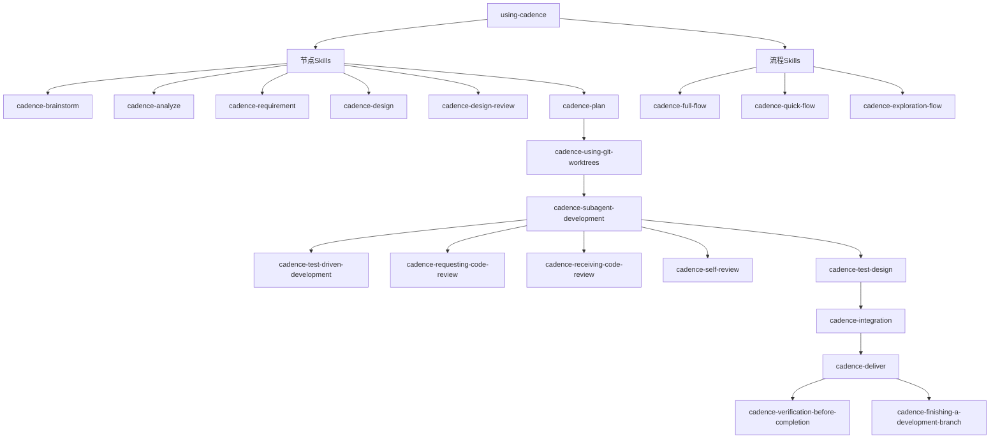

# Skills 目录结构设计文档

> **文档版本**: v1.0
> **创建日期**: 2026-02-26
> **所属方案**: 使用 Claude Code Skills 的 AI 自动化开发方案 v2.4
> **参考项目**: superpowers (https://github.com/obra/superpowers)

---

## 1. 概述

本文档详细定义了 Cadence 技能包的目录结构、Skill 分类、文件组织和依赖关系。设计参考了 superpowers 项目的最佳实践，特别是 Subagent 驱动开发、TDD 流程和 Code Review 机制。

### 1.1 设计原则

| 原则 | 说明 |
|------|------|
| 📁 **模块化** | 每个 Skill 独立目录，包含完整文档和支持文件 |
| 🔄 **可复用** | 前置 Skill 可被多个节点 Skill 调用 |
| 📚 **自文档化** | SKILL.md + README.md + examples.md 三层文档 |
| 🎯 **职责单一** | 每个 Skill 专注一个明确的职责 |
| 🔗 **依赖明确** | 通过依赖图清晰表达 Skill 间关系 |

---

## 2. 目录结构总览

### 2.1 当前实现结构

```
cadence-skills/                          # Cadence技能包根目录
├── .claude-plugin/                      # 插件配置
│   ├── plugin.json                       # Skill注册配置
│   ├── marketplace.json                  # 市场配置
│   └── dependencies.json                 # 依赖关系
│
├── skills/                               # Skills目录
│   │
│   ├── # ================================
│   ├── # 🚪 入口Skill（核心入口）
│   ├── # ================================
│   │
│   ├── using-cadence/
│   │   └── SKILL.md                      # 入口Skill定义
│   │
│   ├── # ================================
│   ├── # 🚀 项目初始化Skill
│   ├── # ================================
│   │
│   ├── cadencing/
│   │   └── SKILL.md                      # 项目初始化Skill
│   │
│   └── # 其他 Skills 待实现...
│
├── hooks/                                # Hooks配置
│   ├── hooks.json                        # Hooks配置
│   └── session-start                     # SessionStart hook脚本
│
├── agents/                               # ⚠️ 已废弃 - Subagent使用Task tool动态调用
│
├── commands/                             # ⚠️ 暂时不需要 - 使用Skill工具直接调用
│
└── README.md
```

### 2.2 MVP v2.4 目标结构（规划）

```
cadence-skills/
├── skills/
│   │
│   ├── # 入口Skill
│   ├── using-cadence/
│   │   └── SKILL.md                      ✅ 已实现
│   │
│   ├── # 项目初始化
│   ├── cadencing/
│   │   └── SKILL.md                      ✅ 已实现
│   │
│   ├── # 流程Skills（流程组合）
│   ├── cadence-full-flow/
│   │   └── SKILL.md                      ⏳ 待实现
│   ├── cadence-quick-flow/
│   │   └── SKILL.md                      ⏳ 待实现
│   ├── cadence-exploration-flow/
│   │   └── SKILL.md                      ⏳ 待实现
│   │
│   ├── # 节点Skills（8个MVP节点）
│   ├── cadence-brainstorm/
│   │   └── SKILL.md                      ⏳ 待实现
│   ├── cadence-analyze/
│   │   └── SKILL.md                      ⏳ 待实现
│   ├── cadence-requirement/
│   │   └── SKILL.md                      ⏳ 待实现
│   ├── cadence-design/
│   │   └── SKILL.md                      ⏳ 待实现
│   ├── cadence-design-review/
│   │   └── SKILL.md                      ⏳ 待实现
│   ├── cadence-plan/
│   │   └── SKILL.md                      ⏳ 待实现
│   ├── cadence-git-worktrees/
│   │   └── SKILL.md                      ⏳ 待实现
│   ├── cadence-subagent-development/
│   │   └── SKILL.md                      ⏳ 待实现
│   │
│   └── # 辅助Skills
│       ├── cadence-test-driven-development/
│       ├── cadence-requesting-code-review/
│       ├── cadence-verification-before-completion/
│       └── cadence-finishing-a-development-branch/
│
└── hooks/
    ├── hooks.json                        ✅ 已实现
    └── session-start                     ✅ 已实现
```

---

## 3. Skill 分类说明

### 3.1 分类总览

| 分类 | 数量 | 说明 | 使用场景 |
|------|------|------|---------|
| 🚪 **入口Skill** | 1 | using-cadence入口Skill | 会话开始时 |
| 🔀 **流程Skill** | 3 | 流程组合 | 完整流程执行 |
| 📋 **节点Skill** | 11 | 11个核心节点 | 流程节点 |
| 🛠️ **辅助Skill** | 5 | 质量保证和辅助功能 | 特定场景 |

### 3.2 详细分类

#### 🚪 入口Skill

**用途**: 入口 Skill，加载 Cadence 框架，建立技能使用规范

| Skill | 触发条件 | 核心功能 |
|-------|---------|---------|
| `using-cadence` | 会话开始时自动加载 | 加载 Skill 注册表、建立调用规范、提供双通道入口 |

#### 🔀 流程Skill（组合节点）

**用途**: 组合多个节点 Skill，提供完整的开发流程

| Skill | 包含节点 | 适用场景 |
|-------|---------|---------|
| `cadence-full-flow` | 1-8 全部节点（v2.4 MVP） | 企业级项目、完整流程 |
| `cadence-quick-flow` | 3,6,7,8 | 快速迭代、小型功能 |
| `cadence-exploration-flow` | 1,2,7,8 | 技术探索、原型开发 |

#### 📋 节点Skill（11个核心节点）

**用途**: 对应开发流程的11个核心节点

| 节点 | Skill | 用途 |
|------|-------|------|
| 1 | `cadence-brainstorm` | 需求探索 |
| 2 | `cadence-analyze` | 存量分析 |
| 3 | `cadence-requirement` | 需求分析 |
| 4 | `cadence-design` | 技术设计 |
| 5 | `cadence-design-review` | 设计审查 |
| 6 | `cadence-plan` | 实现计划 |
| 7 | `cadence-git-worktrees` | 隔离环境 |
| 8 | `cadence-subagent-development` | 代码实现+单元测试 ⭐ |
| 9 | `cadence-test-design` | 集成测试方案（v2.5+） |
| 10 | `cadence-integration` | 集成测试（v2.5+） |
| 11 | `cadence-deliver` | 交付（v2.6+） |

#### 🛠️ 辅助Skill（质量保证和辅助功能）

**用途**: 提供质量保证机制和辅助功能

| Skill | 用途 | 使用场景 |
|-------|------|---------|
| `cadence-using-git-worktrees` | 创建隔离的开发环境 | Subagent Development 之前 |
| `cadence-test-driven-development` | TDD 流程指导 | 代码开发时 |
| `cadence-requesting-code-review` | 请求代码审查 | 完成开发后 |
| `cadence-verification-before-completion` | 交付前验证 | 完成前最后检查 |
| `cadence-finishing-a-development-branch` | 完成开发分支 | 开发完成后 |

---

## 4. Skill 依赖关系

### 4.1 依赖图



### 4.2 依赖说明

#### 前置依赖（必须先完成）

| Skill | 前置依赖 | 说明 |
|-------|---------|------|
| `cadence-subagent-development` | `cadence-using-git-worktrees` | 必须先创建隔离环境 |
| `cadence-test-design` | `cadence-subagent-development` | 必须先完成开发 |
| `cadence-integration` | `cadence-test-design` | 必须先有测试方案 |

#### 质量保证依赖（开发过程中按需调用）

| Skill | 调用时机 | 说明 |
|-------|---------|------|
| `cadence-test-driven-development` | 编写代码时 | TDD 流程指导 |
| `cadence-self-review` | 每个 task 完成后 | 自我审查 |
| `cadence-requesting-code-review` | 开发完成后 | 请求外部审查 |
| `cadence-receiving-code-review` | 收到审查意见后 | 响应审查反馈 |

---

## 5. 关键 Skill 详细说明

### 5.1 🚪 入口Skill: using-cadence

**路径**: `skills/using-cadence/SKILL.md`

**用途**: 入口 Skill，加载 Cadence 框架，建立技能使用规范

**文件列表**:
```
using-cadence/
├── SKILL.md                      # Skill定义（必须）
└── README.md                     # 使用说明（推荐）
```

**触发条件**:
- 会话开始时自动加载
- 用户提及任何 Cadence 相关关键词时

**核心功能**:
- 加载 Skill 注册表
- 建立 Skill 调用规范
- 提供双通道调用入口（命令 + Skill 工具）

---

### 5.2 🛠️ 辅助Skill: cadence-using-git-worktrees

**路径**: `skills/cadence-using-git-worktrees/SKILL.md`

**用途**: 创建隔离的开发环境，使用 git worktree 避免污染主分支

**文件列表**:
```
cadence-using-git-worktrees/
├── SKILL.md                      # Skill定义
├── README.md                     # 使用说明
└── examples.md                   # 示例
```

**触发条件**:
- Subagent Development 之前必须调用
- 用户明确要求隔离环境

**核心功能**:
- Git 状态检查（主分支最新、工作区干净）
- 分支创建（`feature/{feature-name}`）
- Worktree 路径管理（`../workspace/{feature-name}`）
- 环境验证（自动 + 手动）

**参考**: superpowers/skills/using-git-worktrees/SKILL.md

---

### 5.3 🛠️ 辅助Skill: cadence-test-driven-development

**路径**: `skills/cadence-test-driven-development/SKILL.md`

**用途**: TDD 流程指导，确保代码质量

**文件列表**:
```
cadence-test-driven-development/
├── SKILL.md                      # Skill定义
├── README.md                     # TDD流程说明
├── testing-anti-patterns.md      # 测试反模式
├── red-green-refactor.md         # TDD循环详解
└── examples/
    ├── good-test-example.md      # 好的测试示例
    └── bad-test-example.md       # 坏的测试示例
```

**触发条件**:
- 任何代码开发任务
- Bug 修复
- 重构

**核心功能**:
- RED-GREEN-REFACTOR 循环
- 测试优先原则
- 反模式识别

**参考**: superpowers/skills/test-driven-development/SKILL.md

---

### 5.4 🛠️ 辅助Skill: cadence-requesting-code-review

**路径**: `skills/cadence-requesting-code-review/SKILL.md`

**用途**: 请求代码审查，确保代码符合规范

**文件列表**:
```
cadence-requesting-code-review/
├── SKILL.md                      # Skill定义
├── README.md                     # 审查流程说明
└── code-reviewer.md              # 审查清单模板
```

**触发条件**:
- 完成开发后
- 每个 task 完成后（Subagent Development）
- 合并到主分支前

**核心功能**:
- 准备审查材料（git SHAs、描述）
- 调用 code-reviewer subagent
- 处理审查反馈

**参考**: superpowers/skills/requesting-code-review/SKILL.md

---

### 5.5 🛠️ 辅助Skill: cadence-receiving-code-review

**路径**: `skills/cadence-receiving-code-review/SKILL.md`

**用途**: 接收审查反馈，正确响应审查意见

**文件列表**:
```
cadence-receiving-code-review/
├── SKILL.md                      # Skill定义
└── README.md                     # 响应审查指南
```

**触发条件**:
- 收到代码审查反馈后
- 实现审查建议前

**核心功能**:
- 理解审查反馈
- 技术验证而非情感响应
- 正确的回复方式
- 有理有据的 push back

**参考**: superpowers/skills/receiving-code-review/SKILL.md

**核心原则**:
```
核心原则：验证后再实现。提问而非假设。技术正确性优于社交舒适度。
```

---

### 5.6 🛠️ 辅助Skill: cadence-self-review

**路径**: `skills/cadence-self-review/SKILL.md`

**用途**: 自我审查，在提交前发现并修复问题

**文件列表**:
```
cadence-self-review/
├── SKILL.md                      # Skill定义
├── checklist.md                  # 自审清单
└── examples.md                   # 示例
```

**触发条件**:
- 每个 task 完成后
- 提交代码前

**核心功能**:
- 完整性检查（是否完全实现需求）
- 质量检查（代码是否清晰、可维护）
- 纪律检查（是否遵循 YAGNI、现有模式）
- 测试检查（测试是否真实、全面）

**参考**: superpowers/skills/subagent-driven-development/implementer-prompt.md（self-review 部分）

---

### 5.7 📋 节点Skill: cadence-subagent-development（⭐核心）

**路径**: `skills/cadence-subagent-development/SKILL.md`

**用途**: 使用 Subagent 开发代码，强制遵循 TDD 流程，同时编写单元测试，并进行代码质量审查

**文件列表**:
```
cadence-subagent-development/
├── SKILL.md                      # Skill定义
├── README.md                     # 使用说明
├── implementer-prompt.md         # 实现者Prompt模板
├── spec-reviewer-prompt.md       # 规范审查Prompt模板
├── code-quality-reviewer-prompt.md # 代码质量Prompt模板
├── self-review-checklist.md      # 自审清单
└── examples/
    ├── task-implementation-example.md
    └── review-cycle-example.md
```

**触发条件**:
- 完成 Plan 节点后
- Git Worktrees 环境准备完成后

**核心功能**:
- TDD 流程强制执行（RED-GREEN-BLUE）
- 代码审查（Spec Review + Code Quality Review）
- 覆盖率标准（P0 ≥ 80%、P1 ≥ 70%、P2 ≥ 60%）
- 并行执行（支持并发 Subagent 执行）
- 失败处理（自动重试 + 人工介入）

**两阶段审查机制**:
```
1. Spec Compliance Review（规范审查）
   - 验证是否实现了需求（不多不少）
   - 检查是否有遗漏或多余的功能

2. Code Quality Review（质量审查）
   - 验证代码质量（清晰、可维护、测试完善）
   - 检查最佳实践和反模式
```

**参考**: superpowers/skills/subagent-driven-development/SKILL.md

---

## 6. 文件组织规范

### 6.1 SKILL.md 文件结构

每个 Skill 必须包含 `SKILL.md` 文件，结构如下：

```markdown
---
name: skill-name
description: 简短描述（用于显示）
---

# Skill 标题

## 概述
简要说明 Skill 的用途和核心原则。

## 触发条件
说明何时应该使用此 Skill。

## 流程图
使用 Mermaid 或 Graphviz 绘制流程图。

## 详细流程
逐步说明如何使用此 Skill。

## 检查清单
列出必须完成的事项。

## 反模式（可选）
列出常见的错误做法。

## 示例
提供具体的使用示例。

## 集成关系
说明与其他 Skill 的关系。

## 参考（可选）
参考文档或项目。
```

### 6.2 README.md 文件结构

README.md 应该包含：

```markdown
# Skill 名称 - 使用说明

## 快速开始
如何快速使用此 Skill。

## 使用场景
适合使用的场景列表。

## 前置条件
使用此 Skill 前需要满足的条件。

## 使用步骤
详细的使用步骤。

## 常见问题
FAQ。

## 示例
具体示例。
```

### 6.3 支持文件规范

| 文件类型 | 用途 | 示例 |
|---------|------|------|
| `*-prompt.md` | Subagent prompt 模板 | `implementer-prompt.md` |
| `*-anti-patterns.md` | 反模式文档 | `testing-anti-patterns.md` |
| `checklist.md` | 检查清单 | `self-review-checklist.md` |
| `examples.md` | 示例集合 | `examples.md` |
| `*-example.md` | 单个示例 | `good-test-example.md` |

---

## 7. 与 superpowers 的对比

### 7.1 借鉴的实践

| 实践 | superpowers | Cadence | 说明 |
|------|-------------|---------|------|
| **两阶段审查** | ✅ | ✅ | Spec Review → Quality Review |
| **TDD 严格执行** | ✅ | ✅ | RED-GREEN-REFACTOR 循环 |
| **Code Review 双向** | ✅ | ✅ | Requesting + Receiving |
| **Self-Review** | ✅ | ✅ | 每个 task 完成后自审 |
| **Fresh Subagent** | ✅ | ✅ | 每个 task 使用新的 subagent |
| **Prompt Templates** | ✅ | ✅ | 标准化的 subagent prompt |

### 7.2 差异化设计

| 项目 | superpowers | Cadence | 差异原因 |
|------|-------------|---------|---------|
| **节点数量** | 无固定节点 | 11个核心节点 | Cadence 定义了完整的开发流程 |
| **流程组合** | 无 | 3种流程模式 | 支持不同场景的流程组合 |
| **进度追踪** | 简单 | 完整（TodoWrite + Checkpoint） | Cadence 强调断点续传 |
| **记忆系统** | 无 | Serena MCP 集成 | Cadence 需要跨会话持久化 |

---

## 8. 实施计划

### 8.1 MVP 版本（v2.4）范围

**必须实现**:
- ✅ 所有前置 Skill（5个）
- ✅ 节点 1-8 的 Skill
- ✅ 流程 Skill（3个）
- ✅ 支持 Skill（2个）

**后续版本**（v2.5+）:
- ⏳ 节点 9-11 的 Skill

### 8.2 优先级

| 优先级 | Skill | 原因 |
|-------|-------|------|
| **P0** | `cadence-subagent-development` | 核心开发节点 |
| **P0** | `cadence-test-driven-development` | 质量保证基础 |
| **P0** | `cadence-requesting-code-review` | 代码审查流程 |
| **P1** | `cadence-receiving-code-review` | 审查响应流程 |
| **P1** | `cadence-self-review` | 自审机制 |
| **P2** | 其他节点 Skill | 流程节点 |

---

## 9. 版本历史

| 版本 | 日期 | 变更内容 |
|------|------|---------|
| v1.0 | 2026-02-26 | 初始版本，参考 superpowers 优化目录结构 |

---

## 10. 参考资料

### 10.1 superpowers 项目

- **项目地址**: https://github.com/obra/superpowers
- **关键 Skills**:
  - `skills/subagent-driven-development/` - Subagent 驱动开发
  - `skills/test-driven-development/` - TDD 流程
  - `skills/requesting-code-review/` - 请求代码审查
  - `skills/receiving-code-review/` - 接收审查反馈
  - `skills/brainstorming/` - 头脑风暴
  - `skills/writing-plans/` - 编写计划

### 10.2 Claude Code 文档

- **Skills 官方文档**: https://docs.claude.com/claude-code/skills
- **Subagent 文档**: https://docs.claude.com/claude-code/subagents

---

## 附录：完整文件清单

### A.1 必须文件（MVP v2.4）

```
cadence-skills/
├── .claude-plugin/
│   ├── plugin.json                       ✅ 必须
│   └── marketplace.json                  ✅ 必须
│
├── agents/
│   ├── implementer.md                    ✅ 必须
│   ├── spec-reviewer.md                  ✅ 必须
│   └── code-quality-reviewer.md          ✅ 必须
│
├── skills/
│   ├── using-cadence/
│   │   ├── SKILL.md                      ✅ 必须
│   │   └── README.md                     ⭐ 推荐
│   │
│   ├── cadence-using-git-worktrees/
│   │   ├── SKILL.md                      ✅ 必须
│   │   ├── README.md                     ⭐ 推荐
│   │   └── examples.md                   ⭐ 推荐
│   │
│   ├── cadence-test-driven-development/
│   │   ├── SKILL.md                      ✅ 必须
│   │   ├── README.md                     ⭐ 推荐
│   │   ├── testing-anti-patterns.md      ⭐ 推荐
│   │   ├── red-green-refactor.md         ⭐ 推荐
│   │   └── examples/                     ⭐ 推荐
│   │
│   ├── cadence-requesting-code-review/
│   │   ├── SKILL.md                      ✅ 必须
│   │   ├── README.md                     ⭐ 推荐
│   │   └── code-reviewer.md              ✅ 必须
│   │
│   ├── cadence-receiving-code-review/
│   │   ├── SKILL.md                      ✅ 必须
│   │   └── README.md                     ⭐ 推荐
│   │
│   ├── cadence-self-review/
│   │   ├── SKILL.md                      ✅ 必须
│   │   ├── checklist.md                  ✅ 必须
│   │   └── examples.md                   ⭐ 推荐
│   │
│   ├── cadence-brainstorm/
│   │   └── SKILL.md                      ✅ 必须
│   │
│   ├── cadence-analyze/
│   │   └── SKILL.md                      ✅ 必须
│   │
│   ├── cadence-requirement/
│   │   └── SKILL.md                      ✅ 必须
│   │
│   ├── cadence-design/
│   │   └── SKILL.md                      ✅ 必须
│   │
│   ├── cadence-design-review/
│   │   └── SKILL.md                      ✅ 必须
│   │
│   ├── cadence-plan/
│   │   └── SKILL.md                      ✅ 必须
│   │
│   ├── cadence-git-worktrees/
│   │   └── SKILL.md                      ✅ 必须
│   │
│   ├── cadence-subagent-development/
│   │   ├── SKILL.md                      ✅ 必须
│   │   ├── README.md                     ⭐ 推荐
│   │   ├── implementer-prompt.md         ✅ 必须
│   │   ├── spec-reviewer-prompt.md       ✅ 必须
│   │   ├── code-quality-reviewer-prompt.md ✅ 必须
│   │   ├── self-review-checklist.md      ✅ 必须
│   │   └── examples/                     ⭐ 推荐
│   │
│   ├── cadence-full-flow/
│   │   └── SKILL.md                      ✅ 必须
│   │
│   ├── cadence-quick-flow/
│   │   └── SKILL.md                      ✅ 必须
│   │
│   ├── cadence-exploration-flow/
│   │   └── SKILL.md                      ✅ 必须
│   │
│   ├── cadence-verification-before-completion/
│   │   └── SKILL.md                      ✅ 必须
│   │
│   └── cadence-finishing-a-development-branch/
│       └── SKILL.md                      ✅ 必须
│
├── commands/                             ✅ 必须目录
│   └── ... (15个命令文件)
│
├── hooks/                                ⭐ 推荐目录
│   ├── hooks.json
│   ├── session-start
│   └── run-hook.cmd
│
└── README.md                             ✅ 必须文件
```

**图例**:
- ✅ 必须 - MVP v2.4 必须包含
- ⭐ 推荐 - 强烈推荐但非必须
- ⏳ 后续 - v2.5+ 版本实现
