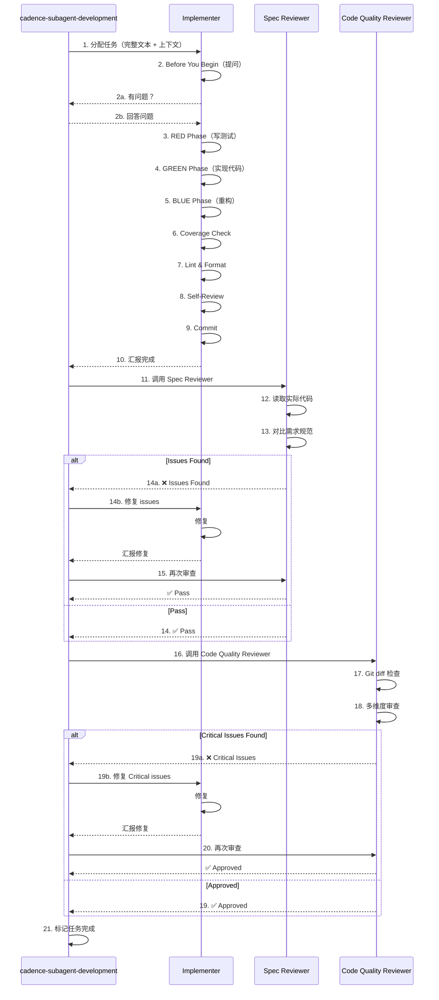
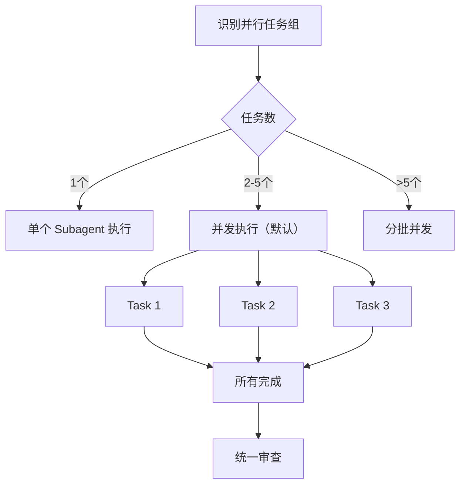

# Subagent 定义文档（v1.1 增强版）

> 创建日期：2026-02-26
> 更新日期：2026-02-27
> 版本：v1.1
> 用途：定义 cadence-subagent-development Skill 使用的三个 Subagent
> 关联主文档：[技术方案 v2.4](./2026-02-25_技术方案_使用Claude_Code_Skills的AI自动化开发方案_v2.4.md)

---

## 目录

- [架构关系说明](#架构关系说明)
- [完整调用时序](#完整调用时序)
- [并发 Subagent 管理](#并发-subagent-管理)
- [Subagent 失败处理](#subagent-失败处理)
- [多语言支持机制](#多语言支持机制)
- [Implementer Subagent](#81-implementermd)
- [Spec Reviewer Subagent](#82-spec-reviewermd)
- [Code Quality Reviewer Subagent](#83-code-quality-reviewermd)

---

## 架构关系说明

### Subagent 与 Skill 的关系

```
┌──────────────────────────────────────────────────┐
│   cadence-subagent-development (Skill - 管理者)  │
│                                                  │
│  职责：                                          │
│  - 读取 Plan 任务清单                            │
│  - 识别并行任务                                  │
│  - 分配任务给 Subagent                           │
│  - 协调 TDD 流程                                 │
│  - 触发代码审查                                  │
│  - 检查覆盖率                                    │
│  - 验证验收标准                                  │
└──────────────┬───────────────────────────────────┘
               │
               │ 使用 Task 工具调用
               │
    ┌──────────┴──────────┬────────────────────┐
    │                     │                    │
    ▼                     ▼                    ▼
┌─────────┐         ┌─────────┐        ┌─────────┐
│Implementer│        │Spec     │        │Code     │
│Subagent  │        │Reviewer │        │Quality  │
│          │        │Subagent │        │Reviewer │
│【执行者】 │        │【审查者】│        │【审查者】│
│          │        │         │        │         │
│- 实现 TDD│        │- 验证符 │        │- 审查代 │
│- 写测试  │        │  合规范 │        │  码质量 │
│- 写代码  │        │- 检查缺 │        │- 检查安 │
│- 运行lint│        │  失需求 │        │  全性   │
│- 提交代码│        │- 检查多 │        │- 检查性 │
│          │        │  余功能 │        │  能     │
└─────────┘         └─────────┘        └─────────┘
```

**调用关系：**
- `cadence-subagent-development` Skill 是**管理者/协调者**
- 三个 Subagent 是**执行者**，被 Skill 调用
- 每个任务完成后，Skill 会依次调用 Spec Reviewer 和 Code Quality Reviewer

---

## 完整调用时序

### 单个任务的完整流程



### 关键流程说明

**1. Before You Begin（提问机制）**
- Implementer 可以在开始前提问
- Skill 必须回答问题后才能继续
- 避免方向性错误（做错了再改成本很高）

**2. 审查循环（Review Loop）**
- Spec Reviewer 发现问题 → Implementer 修复 → **必须再次审查**
- Code Quality Reviewer 发现 Critical 问题 → Implementer 修复 → **必须再次审查**
- 禁止跳过二次审查（不能假设修复成功）

**3. 顺序保证**
- **先完成 Spec Review**（确保符合规范）
- **再进行 Code Quality Review**（确保代码质量）
- 不能颠倒顺序

---

## 并发 Subagent 管理

### 并行任务识别

从 Plan 中识别 `can_parallel: true` 的任务组。

### 并发执行策略



### 并发限制

- **默认最大并发**：5 个（可根据项目需求调整）
- **原因**：
  - 避免资源耗尽（API 限流）
  - 控制上下文切换开销
  - 降低冲突风险

### 冲突处理

如果并行任务有文件冲突：
1. 🛑 检测到冲突
2. 🔄 改为顺序执行冲突任务
3. ✅ 无冲突任务继续并行

### 示例

```yaml
并行任务组：
  - Task 1: 用户注册 API (can_parallel: true)
  - Task 2: 登录 API (can_parallel: true)
  - Task 3: 密码重置 API (can_parallel: true)

执行方式：
  Task 1 → Implementer A
  Task 2 → Implementer B  （并发）
  Task 3 → Implementer C

完成后：
  等待所有完成 → 统一 Spec Review → 统一 Code Quality Review
```

---

## Subagent 失败处理

### Implementer 失败

**场景**：Implementer 无法完成任务（技术障碍、需求不明确）

**处理**：
1. 🛑 Implementer 汇报失败原因
2. 🤔 用户评估：
   - 如果是需求不明确 → 回到 Plan 重新规划
   - 如果是技术障碍 → 寻求帮助或调整方案
   - 如果是实现者能力不足 → 分配给其他 subagent

### Spec Reviewer 失败

**场景**：连续 3 次审查仍未通过

**处理**：
1. 🛑 汇报连续失败
2. 🤔 用户评估：
   - 如果是规范本身有问题 → 回到 Design 修改
   - 如果是实现者理解有问题 → 提供更清晰的上下文
   - 如果是审查者过于严格 → 调整审查标准

### Code Quality Reviewer 失败

**场景**：连续 3 次审查仍有 Critical Issues

**处理**：
1. 🛑 汇报连续失败
2. 🤔 用户评估：
   - 如果是代码确实有问题 → Implementer 重新实现
   - 如果是 Lint/Format 配置问题 → 修复配置
   - 如果是审查标准不合理 → 调整标准

⚠️ **禁止手动修复**：不要尝试手动修复 subagent 的问题（会导致上下文污染）

---

## 多语言支持机制

### 技术栈配置机制

**技术栈流转路径**：
```
CLAUDE.md (用户维护)
    ↓ Plan Skill 读取
实现计划 (tech_stack 配置)
    ↓ Subagent 使用
代码实现 (test/lint/format)
```

**配置优先级**：

```
┌─────────────────────────────────────────────┐
│  Priority 1: 用户对话指定（最高优先级）     │
│  - 如果用户在对话中明确指定技术栈           │
│  - 示例："使用 Python + pytest + black"     │
└─────────────────────────────────────────────┘
                    ↓
        如果用户没有指定？
                    ↓
┌─────────────────────────────────────────────┐
│  Priority 2: CLAUDE.md配置（默认）          │
│  - 项目根目录的 CLAUDE.md 文件              │
│  - 包含 tech_stack 配置                     │
│  - 项目级默认配置                           │
└─────────────────────────────────────────────┘
                    ↓
        如果 CLAUDE.md 没有配置？
                    ↓
┌─────────────────────────────────────────────┐
│  Missing Configuration（缺失）              │
│  - ⚠️ 提示用户配置 CLAUDE.md                │
│  - 提供配置模板和示例                       │
│  - DO NOT 猜测或自动检测                    │
└─────────────────────────────────────────────┘
```

**⚠️ 重要：不自动检测**
- ❌ 不使用 auto-detect 逻辑
- ✅ 必须从用户对话或 CLAUDE.md 获取配置
- ✅ 如果缺失，提示用户配置

### 多语言命令参考表

| 语言/框架 | 检测文件 | 测试命令 | 覆盖率命令 | Lint 命令 | Format 命令 |
|----------|---------|---------|-----------|----------|------------|
| **JavaScript/TypeScript** | `package.json` | `npm test` | `npm run test:coverage` | `npm run lint` | `npm run format` |
| **Python** | `requirements.txt`<br>`pyproject.toml` | `pytest tests/` | `pytest --cov=src --cov-report=term-missing` | `flake8 src/` | `black src/` |
| **Java (Maven)** | `pom.xml` | `mvn test` | `mvn test jacoco:report` | `mvn checkstyle:check` | `mvn spotless:apply` |
| **Java (Gradle)** | `build.gradle` | `./gradlew test` | `./gradlew test jacocoTestReport` | `./gradlew checkstyleMain` | `./gradlew spotlessApply` |
| **Go** | `go.mod` | `go test ./...` | `go test -coverprofile=coverage.out ./...` | `golint ./...` | `gofmt -w .` |
| **Rust** | `Cargo.toml` | `cargo test` | `cargo tarpaulin --out Stdout` | `cargo clippy` | `cargo fmt` |

---

## 8.1 Implementer Subagent

**完整定义**：[8.1_implementer.md](./8.1_implementer.md)

### 核心职责
- ✅ 执行 TDD 工作流（RED → GREEN → BLUE）
- ✅ 覆盖率检查（≥ threshold）
- ✅ Lint & Format 自动化检查
- ✅ Self-Review 自检（5个维度）
- ✅ 提交代码

### v1.1 新增特性 ⭐
- ✨ **Before You Begin 提问机制**（开始前提问，避免方向性错误）
- ✨ **工作期间提问**（随时提问，禁止猜测）
- ✨ **工作目录明确指定**（避免修改错误位置）
- ✨ **增强 Self-Review**（5个维度完整性检查）

---

## 8.2 Spec Reviewer Subagent

**完整定义**：[8.2_spec-reviewer.md](./8.2_spec-reviewer.md)

### 核心职责
- ✅ 验证实现符合规范（不多不少）
- ✅ 检查缺失需求
- ✅ 检查多余功能（YAGNI）
- ✅ 验证验收标准
- ✅ 检查测试覆盖

### v1.1 新增特性 ⭐
- ✨ **强化怀疑态度**（默认怀疑 → 验证 → 确认）
- ✨ **审查循环机制**（发现 → 修复 → 再审查）
- ✨ **Checklist 表格化**（更清晰的检查清单）

---

## 8.3 Code Quality Reviewer Subagent

**完整定义**：[8.3_code-quality-reviewer.md](./8.3_code-quality-reviewer.md)

### 核心职责
- ✅ 代码风格审查（Lint Check）
- ✅ 安全漏洞检查（Security）
- ✅ 性能问题检查（Performance）
- ✅ 测试覆盖检查（Coverage）
- ✅ 可维护性检查（Maintainability）
- ✅ 格式化检查（Format Check）

### v1.1 新增特性 ⭐
- ✨ **Git SHA 范围指定**（只审查变更部分）
- ✨ **Issue Severity 详细分级**（Critical/Important/Minor 详细定义）
- ✨ **Strengths 优点部分**（先肯定再指出问题，4个维度）

---

## 使用说明

### 如何使用这些 Subagent

这些 Subagent 定义用于 `cadence-subagent-development` Skill，通过 Task 工具调用：

```python
# 调用 Implementer
Task(
    subagent_type="general-purpose",
    description="Implement Task 1: User Login API",
    prompt=implementer_prompt_with_context
)

# 调用 Spec Reviewer
Task(
    subagent_type="general-purpose",
    description="Review spec compliance for Task 1",
    prompt=spec_reviewer_prompt_with_context
)

# 调用 Code Quality Reviewer
Task(
    subagent_type="general-purpose",
    description="Review code quality for Task 1",
    prompt=code_quality_reviewer_prompt_with_context
)
```

**完整 Prompt 模板**：
- Implementer: [8.1_implementer.md](./8.1_implementer.md)
- Spec Reviewer: [8.2_spec-reviewer.md](./8.2_spec-reviewer.md)
- Code Quality Reviewer: [8.3_code-quality-reviewer.md](./8.3_code-quality-reviewer.md)

### 技术栈配置示例

在 Plan 输出或 CLAUDE.md 中配置：

```yaml
tech_stack:
  language: "python"
  test_command: "pytest tests/"
  test_coverage_command: "pytest --cov=src --cov-report=term-missing --cov-fail-under=80"
  lint_command: "flake8 src/ tests/"
  lint_check_command: "flake8 src/ tests/ --exit-zero"
  format_command: "black src/ tests/ && isort src/ tests/"
  format_check_command: "black --check src/ tests/ && isort --check-only src/ tests/"
  coverage_threshold: 80
```

### 调用示例

**完整调用流程**：

```python
# Step 1: 调用 Implementer
implementer_prompt = f"""
{read_file('8.1_implementer.md')}

## Task Description
{task_description}

## Context
{scene_setting}

## Work Directory
{worktree_path}
"""

Task(
    subagent_type="general-purpose",
    description=f"Implement {task_name}",
    prompt=implementer_prompt
)

# Step 2: 调用 Spec Reviewer
spec_reviewer_prompt = f"""
{read_file('8.2_spec-reviewer.md')}

## Task Description
{task_description}

## Implementation Report
{implementer_report}
"""

Task(
    subagent_type="general-purpose",
    description=f"Review spec compliance for {task_name}",
    prompt=spec_reviewer_prompt
)

# Step 3: 调用 Code Quality Reviewer
base_sha = get_base_sha()
head_sha = get_head_sha()

code_quality_prompt = f"""
{read_file('8.3_code-quality-reviewer.md')}

## Git Commit Range
- base_sha: {base_sha}
- head_sha: {head_sha}
"""

Task(
    subagent_type="general-purpose",
    description=f"Review code quality for {task_name}",
    prompt=code_quality_prompt
)
```

---

## 版本历史

### v1.1（2026-02-27）- 增强版
**优化亮点**：
- ✨ **Implementer Subagent 增强**
  - 新增"Before You Begin"提问机制（开始前提问，避免方向性错误）
  - 增强 Self-Review 自检机制（5个维度完整性检查）
  - 新增"工作期间提问"机制（随时提问，禁止猜测）
  - 新增"工作目录"明确指定（避免修改错误位置）

- ✨ **Spec Reviewer Subagent 增强**
  - 强化"Do Not Trust the Report"怀疑态度（默认怀疑→验证→确认）
  - 新增"审查循环机制"明确化（发现→修复→再审查，禁止跳过）
  - 优化 Checklist 格式（表格化，更清晰）

- ✨ **Code Quality Reviewer Subagent 增强**
  - 新增"Git SHA 范围指定"（只审查变更部分，避免噪音）
  - 增强"Issue Severity 分级"（Critical/Important/Minor 详细定义）
  - 新增"Strengths 优点部分"（先肯定再指出问题，具体化）

- ✨ **架构层面增强**
  - 新增"完整调用时序图"（Mermaid sequenceDiagram，清晰展示流程）
  - 新增"并发 Subagent 管理"（并行策略、冲突处理、示例）
  - 新增"Subagent 失败处理"（3种失败场景及处理方式）

**对比 v1.0 的改进**：
- 📊 **更系统化**：从单点优化到全流程优化
- 🎯 **更明确**：从模糊描述到明确规则
- 🔄 **更严谨**：从单次审查到循环审查
- 🤝 **更人性化**：从冷冰冰的规则到有温度的协作

### v1.0（2026-02-26）- 初始版本
- 简化技术栈配置机制（用户对话指定 → CLAUDE.md配置）
- 支持 6 种语言（JavaScript/TypeScript、Python、Java、Go、Rust）
- 增强 Spec Reviewer 的怀疑态度
- 增加 Code Quality Reviewer 的严重性分级
- 增加覆盖率检查流程
- 基于主文档 v2.3 的 Subagent 定义进行优化

---

## 相关文档

- [主方案文档](./2026-02-25_技术方案_使用Claude_Code_Skills的AI自动化开发方案_v2.4.md)
- [Skill Plan 文档](./2026-02-26_Skill_Plan_v1.0.md)
- [Skill Subagent Development 文档](./2026-02-26_Skill_Subagent_Development_v1.0.md)
- [superpowers 项目参考](https://github.com/obra/superpowers)
