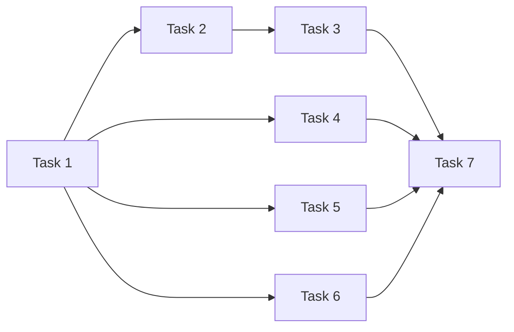

# 实现计划

## 1. 任务概览
- 总任务数：X 个
- 预计总时间：X-Y 小时
- 并行任务数：X 个
- 关键路径：Task 1 → Task 2 → Task 3

## 2. 任务清单

### Phase 1：基础任务（P0）
#### Task 1：[任务名称]
- **优先级**：P0
- **复杂度**：中等
- **时间估计**：2-3 小时
- **依赖**：无
- **描述**：[任务详细描述]
- **技术约束**：[来自技术方案的约束]
- **验收标准**：
  - ✅ 标准 1：[具体可验证的标准]
  - ✅ 标准 2：[具体可验证的标准]

#### Task 2：[任务名称]
- **优先级**：P0
- **复杂度**：简单
- **时间估计**：1-2 小时
- **依赖**：Task 1
- **描述**：[任务详细描述]
- **验收标准**：
  - ✅ 标准 1
  - ✅ 标准 2

### Phase 2：核心任务（P0）
...

### Phase 3：扩展任务（P1/P2）
...

## 3. 任务依赖关系

### 依赖关系图



### 关键路径
- **关键路径**：Task 1 → Task 2 → Task 3 → Task 7
- **关键路径时间**：8-12 小时

## 4. 并行执行建议

### 可并行任务组
#### 并行组 1（Phase 1 完成后）
- Task 4（预计 2-3 小时）
- Task 5（预计 1-2 小时）
- Task 6（预计 2-3 小时）
- **并行执行时间**：3 小时（取最长）
- **串行执行时间**：6-8 小时
- **节省时间**：3-5 小时

### 串行任务链
- Task 1 → Task 2 → Task 3（必须串行）

### 并行执行策略
- **策略 1**：优先执行关键路径任务（Task 1-3-7）
- **策略 2**：并行执行非关键路径任务（Task 4-5-6）
- **策略 3**：Task 7 等待所有前置任务完成

## 5. Subagent Development 支持

### 任务分配建议
- **Task 1**：可分配给 Subagent-1（独立任务）
- **Task 4、5、6**：可并行分配给 Subagent-1、2、3（并行任务组）
- **Task 7**：需等待 Task 4、5、6 完成后分配

### 任务优先级排序
1. Task 1（P0，无依赖）
2. Task 2（P0，依赖 Task 1）
3. Task 3（P0，依赖 Task 2）
4. Task 4、5、6（P0，可并行）
5. Task 7（P0，依赖 Task 3、4、5、6）

### 任务描述格式（供 Subagent 使用）

```yaml
task_id: task-1
task_name: "实现用户登录 API"
priority: P0
complexity: 中等
estimated_time: "2-3 小时"
dependencies: []
description: |
  实现用户登录 API，支持用户名/密码登录，返回 JWT token
technical_constraints:
  - 使用 Express.js 框架
  - 使用 JWT 进行身份验证
  - 密码使用 bcrypt 加密
tech_stack:
  language: "javascript"
  test_command: "npm test"
  test_coverage_command: "npm run test:coverage"
  lint_command: "npm run lint"
  format_command: "npm run format"
  coverage_threshold: 80
acceptance_criteria:
  - ✅ 支持用户名/密码登录
  - ✅ 返回有效的 JWT token
  - ✅ 错误处理完善（用户不存在、密码错误）
  - ✅ 单元测试覆盖率 > 80%
```

## 6. 技术栈配置

### 6.1 项目技术栈

**配置来源：** CLAUDE.md（或 auto-detect）

```yaml
tech_stack:
  source: "CLAUDE.md"  # 或 "auto-detect"
  language: "python"
  test_command: "pytest tests/"
  test_coverage_command: "pytest --cov=src --cov-report=term-missing --cov-fail-under=80"
  lint_command: "flake8 src/"
  lint_check_command: "flake8 src/ --exit-zero"
  format_command: "black src/"
  format_check_command: "black --check src/"
  coverage_threshold: 80
```

### 6.2 任务中的技术栈

每个任务继承项目技术栈，可以针对任务覆盖特定配置：

```yaml
task_id: task-1
task_name: "实现用户登录 API"
tech_stack:
  language: "python"  # 继承自项目
  test_command: "pytest tests/test_auth.py"  # 覆盖为任务特定的测试命令
  # 其他配置继承自项目
```

### 6.3 Subagent 使用技术栈的优先级

**Priority 1: Task Description（最高优先级）**
- 任务描述中包含 `tech_stack` 部分
- 来自 Plan 的任务配置
- 可以覆盖项目级配置

**Priority 2: CLAUDE.md（次优先级）**
- 项目根目录的 `CLAUDE.md` 文件
- 包含 `project_tech_stack` 配置
- 项目级默认配置

**Priority 3: Auto-Detect + User Confirm（兜底）**
- 检测项目文件（package.json、requirements.txt 等）
- **必须与用户确认**
- 建议用户将配置写入 CLAUDE.md

**检测流程**：
```
1. 检查任务描述中是否有 tech_stack
   ↓ 如果没有
2. 检查 CLAUDE.md 中是否有 project_tech_stack
   ↓ 如果还没有
3. 自动检测 → 询问用户确认 → 建议写入 CLAUDE.md
```

### 6.4 多语言配置示例

#### JavaScript/TypeScript 项目
```yaml
project_tech_stack:
  language: "typescript"
  test_command: "npm test"
  test_coverage_command: "npm run test:coverage"
  lint_command: "npm run lint"
  lint_check_command: "npm run lint:check"
  format_command: "npm run format"
  format_check_command: "npm run format:check"
  coverage_threshold: 80
```

#### Python 项目
```yaml
project_tech_stack:
  language: "python"
  test_command: "pytest tests/"
  test_coverage_command: "pytest --cov=src --cov-report=term-missing --cov-fail-under=80"
  lint_command: "flake8 src/"
  lint_check_command: "flake8 src/ --exit-zero"
  format_command: "black src/"
  format_check_command: "black --check src/"
  coverage_threshold: 80
```

#### Java (Maven) 项目
```yaml
project_tech_stack:
  language: "java"
  test_command: "mvn test"
  test_coverage_command: "mvn test jacoco:report"
  lint_command: "mvn checkstyle:check"
  format_command: "mvn spotless:apply"
  format_check_command: "mvn spotless:check"
  coverage_threshold: 80
```

#### Java (Gradle) 项目
```yaml
project_tech_stack:
  language: "java"
  test_command: "./gradlew test"
  test_coverage_command: "./gradlew test jacocoTestReport"
  lint_command: "./gradlew checkstyleMain"
  format_command: "./gradlew spotlessApply"
  format_check_command: "./gradlew spotlessCheck"
  coverage_threshold: 80
```

#### Go 项目
```yaml
project_tech_stack:
  language: "go"
  test_command: "go test ./..."
  test_coverage_command: "go test -coverprofile=coverage.out ./... && go tool cover -func=coverage.out"
  lint_command: "golint ./..."
  format_command: "gofmt -w ."
  format_check_command: "gofmt -l ."
  coverage_threshold: 80
```

#### Rust 项目
```yaml
project_tech_stack:
  language: "rust"
  test_command: "cargo test"
  test_coverage_command: "cargo tarpaulin --out Stdout --fail-under 80"
  lint_command: "cargo clippy"
  format_command: "cargo fmt"
  format_check_command: "cargo fmt -- --check"
  coverage_threshold: 80
```

## 7. 验收清单

### 功能验收
- [ ] 所有 P0 任务完成
- [ ] 所有验收标准通过
- [ ] 单元测试覆盖率 ≥ 项目标准
- [ ] 集成测试通过

### 代码质量验收
- [ ] 代码通过 Linter 检查
- [ ] 代码通过 Formatter 检查
- [ ] 代码通过 Code Review

### 文档验收
- [ ] API 文档完整
- [ ] README 更新（如需要）

## 8. 实现注意事项

### 来自 Design Review 的要点
- **要点 1**：[来自审查报告的关键注意事项]
- **要点 2**：[来自审查报告的关键注意事项]

### 技术约束
- **约束 1**：[来自技术方案的约束]
- **约束 2**：[来自技术方案的约束]

### 存量代码改造
- **改造 1**：[需要改造的存量代码]
- **改造 2**：[需要改造的存量代码]
