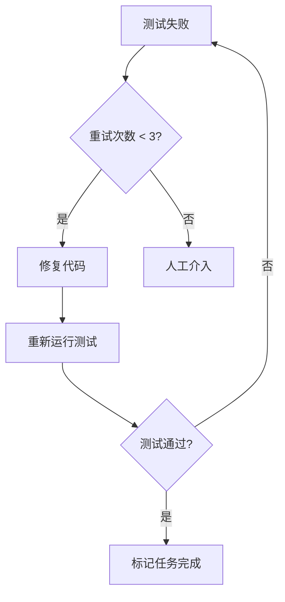
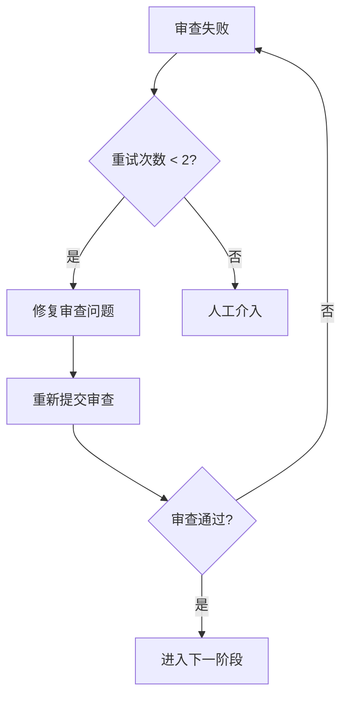
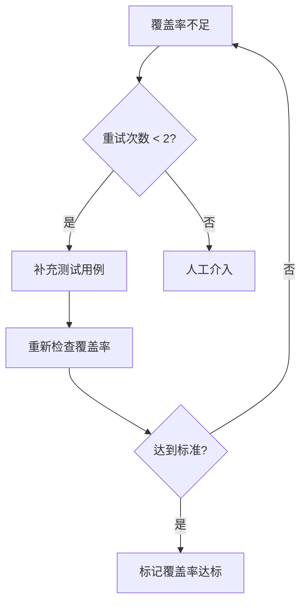
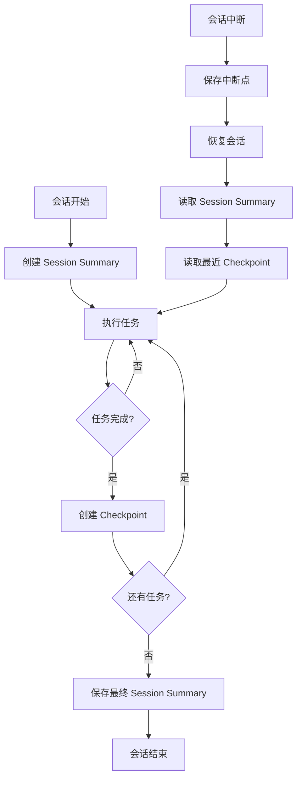

# 进度追踪与状态管理

> 版本: v1.0
> 创建日期: 2026-02-26
> 用途: 定义 Cadence 项目的进度追踪和状态管理机制

---

## 目录

1. [TodoWrite 任务结构](#1-todowrite-任务结构)
2. [验证机制](#2-验证机制)
3. [失败处理机制](#3-失败处理机制)
4. [会话记忆系统](#4-会话记忆系统基于-serena-mcp)
5. [断点续传](#5-断点续传)
6. [进度可视化](#6-进度可视化)

---

## 1. TodoWrite 任务结构

### 1.1 标准字段定义

每个任务包含以下字段：

| 字段 | 类型 | 说明 | 示例 |
|------|------|------|------|
| `taskId` | string | 任务唯一标识 | `"task-1"` |
| `subject` | string | 任务标题（祈使句） | `"创建用户模型"` |
| `description` | string | 完整任务描述（从计划提取） | `"基于 PRD 需求，创建 User 数据模型..."` |
| `status` | enum | 任务状态 | `pending` / `in_progress` / `completed` / `failed` |
| `blockedBy` | array | 依赖的任务 ID 列表 | `["task-0"]` |
| `blocks` | array | 被阻塞的任务 ID 列表 | `["task-2", "task-3"]` |
| `owner` | string | 负责人/Subagent ID | `"subagent-001"` |
| `priority` | enum | 优先级 | `P0` / `P1` / `P2` |
| `metadata` | object | 任务元数据 | 见下方 |

### 1.2 任务元数据

```json
{
  "complexity": "high",  // high / medium / low
  "timeEstimate": {
    "min": 2,  // 小时
    "max": 4
  },
  "testRetries": 0,      // 测试重试次数（最多3次）
  "reviewRetries": 0,    // 审查重试次数（最多2次）
  "coverageRetries": 0,  // 覆盖率重试次数（最多2次）
  "createdAt": "2026-02-26T10:00:00Z",
  "updatedAt": "2026-02-26T12:30:00Z"
}
```

### 1.3 任务依赖管理

#### 依赖类型

- **强依赖**（BlockedBy）：必须等待前置任务完成
- **弱依赖**（可选）：建议顺序，但不强制

#### 并行识别

- 无 `blockedBy` 的任务可以并行执行
- `blockedBy` 为空数组 = 可立即开始
- Subagent Development 支持并发执行（默认 5 个）

#### 依赖关系示例

```markdown
## 任务依赖关系

Task 1: 创建用户模型
- blockedBy: []
- 可并行: 是
- 状态: 可立即开始

Task 2: 实现用户 CRUD
- blockedBy: [task-1]  # 依赖 Task 1
- 可并行: 否
- 状态: 等待 Task 1 完成

Task 3: 实现权限验证中间件
- blockedBy: []  # 无依赖
- 可并行: 是
- 状态: 可立即开始（与 Task 1 并行）

Task 4: 实现角色管理
- blockedBy: [task-1, task-2]  # 依赖 Task 1 和 Task 2
- 可并行: 否
- 状态: 等待前置任务完成
```

---

## 2. 验证机制

> **详细文档**: [Skill_Verification_Before_Completion_v1.0.md](./2026-02-26_Skill_Verification_Before_Completion_v1.0.md)

### 2.1 独立 Skill

验证机制作为独立 Skill 实现：**cadence-verification-before-completion**

**位置**: `skills/cadence-verification-before-completion/SKILL.md`

### 2.2 验证铁律

```
NO COMPLETION CLAIMS WITHOUT FRESH VERIFICATION EVIDENCE
没有新鲜验证证据 = 不声称完成
```

**违反此规则的字面意思 = 违反规则的精神**

### 2.3 门控功能（5 步）

```
BEFORE 声称任何状态或表达满意:

1. IDENTIFY: 什么命令能证明这个声称？
   - 测试命令？（npm test / pytest / cargo test）
   - 构建命令？（npm run build / cargo build）
   - Lint 命令？（eslint / pylint）
   - 类型检查？（tsc / mypy）

2. RUN: 执行完整命令（fresh, complete）
   - 不使用缓存
   - 不使用部分检查
   - 不使用 "应该" 或 "可能"

3. READ: 读取完整输出
   - 检查退出码
   - 计算失败数
   - 确认所有检查通过

4. VERIFY: 输出是否确认声称？
   - 如果 NO: 陈述实际状态并提供证据
   - 如果 YES: 陈述声称并提供证据

5. ONLY THEN: 才能做出声称

跳过任何步骤 = 撒谎，不是验证
```

### 2.4 常见验证场景

| 声称 | 必需验证 | 不充分验证 |
|------|---------|-----------|
| 测试通过 | 测试命令输出：0 失败 | 之前的运行、"应该通过" |
| Linter 干净 | Linter 输出：0 错误 | 部分检查、推断 |
| 构建成功 | 构建命令：exit 0 | Linter 通过、日志看起来不错 |
| Bug 已修复 | 测试原始症状：通过 | 代码已修改、假设已修复 |
| 回归测试有效 | Red-Green 循环验证 | 测试通过一次 |
| Subagent 完成 | VCS diff 显示变更 | Subagent 报告 "成功" |
| 需求满足 | 逐项检查清单 | 测试通过 |

### 2.5 集成位置

**被以下 Skill 调用**：
- `cadence-subagent-development` - 每个任务完成后
- `cadence-test-design` - 集成测试方案设计后
- `cadence-integration` - 集成测试完成后
- `cadence-finishing-a-development-branch` - 完成开发分支前

---

## 3. 失败处理机制

### 3.1 固定重试策略

| 失败类型 | 最大重试次数 | 重试间隔 | 超过次数后 |
|---------|------------|---------|-----------|
| **测试失败** | 3 次 | 立即 | 人工介入 |
| **审查失败** | 2 次 | 立即 | 人工介入 |
| **覆盖率不足** | 2 次 | 立即 | 人工介入 |

### 3.2 测试失败处理流程



**详细步骤**：
1. **第 1 次失败**：
   - 读取测试输出，识别失败原因
   - 修复代码
   - 重新运行测试
   - 重试计数：`testRetries = 1`

2. **第 2 次失败**：
   - 分析失败模式
   - 调整实现方式
   - 重新运行测试
   - 重试计数：`testRetries = 2`

3. **第 3 次失败**：
   - 重新运行测试
   - 重试计数：`testRetries = 3`
   - 触发人工介入

### 3.3 审查失败处理流程



**详细步骤**：
1. **第 1 次失败**：
   - 读取审查反馈
   - 修复问题
   - 重新提交审查
   - 重试计数：`reviewRetries = 1`

2. **第 2 次失败**：
   - 重新提交审查
   - 重试计数：`reviewRetries = 2`
   - 触发人工介入

### 3.4 覆盖率不足处理流程



**覆盖率标准**：
- P0 任务：≥ 80%（强制）
- P1 任务：≥ 70%（推荐）
- P2 任务：≥ 60%（可选）

### 3.5 人工介入流程

#### 触发条件

- 测试重试 3 次后仍失败
- 审查重试 2 次后仍失败
- 覆盖率重试 2 次后仍不足

#### 人工介入选项

```markdown
任务失败：[任务名称]
失败类型：[测试/审查/覆盖率]
重试次数：[X/3] 或 [X/2]

请选择处理方式：
1. 跳过此任务（标记为技术债务）
2. 修改实现方式（提供新方案）
3. 人工修复（我手动处理）
4. 停止执行（暂停整个流程）

请输入选项编号（1-4）：
```

#### 选项说明

| 选项 | 行为 | 后果 |
|------|------|------|
| 1. 跳过任务 | 标记为 `failed`，记录技术债务 | 继续执行后续任务 |
| 2. 修改实现 | 用户提供新方案 | 重新开始任务（重置重试计数） |
| 3. 人工修复 | 用户手动修复 | 等待用户确认后继续 |
| 4. 停止执行 | 暂停整个流程 | 保存当前进度，等待用户决定 |

### 3.6 失败日志记录

使用 Serena Memory 记录失败信息：

**Memory 名称**: `failure-logs/task-{taskId}`

**内容模板**:

```json
{
  "memory_name": "failure-logs/task-{taskId}",
  "content": "# Task Failure Log\n\n## Task Info\n- Task ID: task-1\n- Subject: 创建用户模型\n- Failed At: 2026-02-26T12:30:00Z\n\n## Failure Details\n- Type: test_failure\n- Retries: 3/3\n- Error Message: [...]\n- Test Output: [...]\n\n## Resolution\n- Option Chosen: skip_task\n- Reason: 技术债务，后续版本处理\n- Resolved At: 2026-02-26T12:35:00Z\n"
}
```

---

## 4. 会话记忆系统（基于 Serena MCP）

### 4.1 系统架构



### 4.2 Session Summary 结构

**Memory 名称**: `session-{YYYY-MM-DD}-{project-name}`

**内容模板**:

```markdown
# Session Summary - {project-name}

## 会话概览
- **开始时间**：{start-time}
- **结束时间**：{end-time}
- **会话类型**：{开发/测试/文档/其他}
- **版本**：{v2.4}

## 完成的核心任务

### 1. 节点执行记录
- ✅ {节点名称} - {完成时间}
  - 关键决策：{决策内容}
  - 输出产物：{产物路径}

- ✅ {节点名称} - {完成时间}
  - 关键决策：{决策内容}
  - 输出产物：{产物路径}

### 2. Git 提交记录
```
{commit-hash} - {commit-message}
{commit-hash} - {commit-message}
```

## 关键设计决策

### 决策 1：{决策标题}
**决策**：{决策内容}
**原因**：{决策原因}
**影响**：{决策影响}

### 决策 2：{决策标题}
**决策**：{决策内容}
**原因**：{决策原因}
**影响**：{决策影响}

## 技术发现

### 发现 1：{发现标题}
{发现内容}

### 发现 2：{发现标题}
{发现内容}

## 会话统计

### 文档创建
- 独立节点文档：{数量} 个
- 主文档更新：{数量} 处
- 会话记忆文件：{数量} 个

### Git 操作
- 提交次数：{数量} 次
- 推送次数：{数量} 次
- 分支：{branch-name}

### 时间统计
- 节点讨论：约 {X} 小时
- 文档编写：约 {X} 小时
- Git 操作：约 {X} 分钟
- **总计**：约 {X} 小时

## 待办事项（下次会话）

### 下一步工作
- [ ] {待办事项 1}
- [ ] {待办事项 2}
- [ ] {待办事项 3}

## 会话恢复指南

### 快速恢复
1. 读取记忆：`read_memory("session-{YYYY-MM-DD}-{project-name}")`
2. 检查进度：`read_memory("checkpoint-{taskId}")`
3. 查看文档：`{文档路径}`

### 上下文要点
- {关键要点 1}
- {关键要点 2}
- {关键要点 3}

### 继续工作
如果继续 {版本}：
1. 从 {节点名称} 开始
2. 参考 {文档名称}
3. 遵循 {设计模式}

## 会话状态
- ✅ 所有任务已完成
- ✅ 文档已推送到远程仓库
- ✅ 会话记忆已保存
- ✅ 检查点已创建
- ✅ 可以安全结束会话

## 备注
{其他备注信息}
```

### 4.3 Checkpoint 结构

**Memory 名称**: `checkpoint-{taskId}-{timestamp}`

**内容模板**:

```markdown
# Checkpoint - Task {taskId}

## 任务信息
- **Task ID**：{taskId}
- **Subject**：{任务标题}
- **Status**：{completed/failed}
- **Created At**：{timestamp}

## 任务上下文
- **Blocked By**：[{taskId}, ...]
- **Blocks**：[{taskId}, ...]
- **Priority**：{P0/P1/P2}

## 完成情况

### 实现内容
- {实现内容 1}
- {实现内容 2}
- {实现内容 3}

### 验证结果
- **测试**：{通过/失败} ({重试次数}/3)
- **审查**：{通过/失败} ({重试次数}/2)
- **覆盖率**：{XX%} ({重试次数}/2)

### 输出产物
- 代码文件：{文件路径}
- 测试文件：{文件路径}
- 文档文件：{文件路径}

## 关键决策
- {决策 1}：{决策原因}
- {决策 2}：{决策原因}

## 遇到的问题
- **问题 1**：{问题描述} → 解决方案：{解决方案}
- **问题 2**：{问题描述} → 解决方案：{解决方案}

## Git 提交
```
{commit-hash} - {commit-message}
```

## 下一步
- 下一个任务：{taskId} - {任务标题}
- 前置条件：{前置条件}
```

### 4.4 Memory 操作 API

#### 创建 Session Summary

```javascript
// 使用 Serena write_memory
write_memory({
  memory_name: `session-${date}-${projectName}`,
  content: sessionSummaryContent
})
```

#### 创建 Checkpoint

```javascript
// 使用 Serena write_memory
write_memory({
  memory_name: `checkpoint-${taskId}-${timestamp}`,
  content: checkpointContent
})
```

#### 读取 Session Summary

```javascript
// 使用 Serena read_memory
read_memory({
  memory_name: `session-${date}-${projectName}`
})
```

#### 列出所有 Checkpoints

```javascript
// 使用 Serena list_memories
list_memories({
  topic: "checkpoint"
})
```

### 4.5 会话恢复流程

#### 步骤 1：检测中断

```bash
# 检查是否有未完成的任务
/cadence:status

# 输出示例
当前状态：会话中断
最后更新：2026-02-26T12:30:00Z
未完成任务：3 个
```

#### 步骤 2：读取会话记忆

```javascript
// 读取最近的 Session Summary
read_memory({
  memory_name: "session-2026-02-26-Cadence-skills"
})

// 列出所有 Checkpoints
list_memories({
  topic: "checkpoint"
})
```

#### 步骤 3：恢复上下文

```markdown
会话恢复确认：

上次会话信息：
- 日期：2026-02-26
- 项目：Cadence-skills
- 分支：feature/user-auth
- 完成任务：5/8
- 未完成任务：3 个

未完成任务：
1. Task 6: 实现权限分配（待执行）
2. Task 7: 实现角色管理（阻塞：Task 6）
3. Task 8: 实现权限验证（阻塞：Task 6）

是否继续上次会话？
- 输入 "yes" 继续
- 输入 "no" 开始新会话
```

#### 步骤 4：重建上下文

```javascript
// 读取最近 Checkpoint
read_memory({
  memory_name: "checkpoint-task-5-20260226-123000"
})

// 读取失败日志（如果有）
read_memory({
  memory_name: "failure-logs/task-5"
})
```

#### 步骤 5：继续执行

```markdown
上下文重建完成！

继续执行：
- 当前任务：Task 6 - 实现权限分配
- 前置依赖：已完成（Task 1-5）
- 工作目录：/path/to/worktree
- Git 分支：feature/user-auth

准备就绪，开始执行 Task 6...
```

---

## 5. 断点续传

### 5.1 恢复场景分类

| 场景 | 触发条件 | 恢复策略 |
|------|---------|---------|
| **正常中断** | 用户主动结束会话 | 保存 Session Summary + 最后 Checkpoint |
| **异常中断** | 网络/系统故障 | 自动保存的 Checkpoint |
| **任务失败** | 重试次数耗尽 | 失败日志 + 人工介入记录 |
| **依赖阻塞** | 前置任务未完成 | 等待依赖完成 |
| **外部变更** | 计划/需求变更 | 回滚到变更点重新开始 |

### 5.2 恢复逻辑

#### 步骤 1：检测恢复场景

```bash
/cadence:resume
```

#### 步骤 2：扫描可用记忆

```javascript
// 列出所有 session summaries
list_memories({ topic: "session" })

// 列出所有 checkpoints
list_memories({ topic: "checkpoint" })

// 列出失败日志
list_memories({ topic: "failure-logs" })
```

#### 步骤 3：确定恢复点

```markdown
发现可恢复会话：

1. Session: 2026-02-26-Cadence-skills
   - 状态：正常中断
   - 完成任务：5/8
   - 最后更新：2 小时前

2. Session: 2026-02-25-Cadence-skills
   - 状态：任务失败
   - 完成任务：3/8
   - 最后更新：1 天前

选择要恢复的会话（输入编号）：
```

#### 步骤 4：重建上下文

```javascript
// 读取选择的 session
const session = read_memory({
  memory_name: "session-2026-02-26-Cadence-skills"
})

// 读取最后一个 checkpoint
const checkpoint = read_memory({
  memory_name: "checkpoint-task-5-20260226-123000"
})

// 恢复 Git 状态
// 恢复工作目录
// 恢复 TodoWrite 状态
```

#### 步骤 5：继续执行

```markdown
✅ 会话恢复成功！

恢复信息：
- 会话日期：2026-02-26
- 项目：Cadence-skills
- 分支：feature/user-auth
- 工作目录：/path/to/worktree
- 完成任务：Task 1-5
- 当前任务：Task 6 - 实现权限分配
- 待完成任务：Task 6, 7, 8

准备继续执行...
```

### 5.3 上下文重建

#### 重建内容

1. **Git 状态**：
   - 当前分支
   - 工作目录
   - 未提交的变更

2. **TodoWrite 状态**：
   - 所有任务列表
   - 任务依赖关系
   - 重试计数器

3. **项目上下文**：
   - 已完成节点
   - 输出产物路径
   - 关键设计决策

4. **会话上下文**：
   - Session Summary
   - 最近的 Checkpoint
   - 失败日志（如果有）

---

## 6. 进度可视化

### 6.1 状态查询命令

**命令**：`/cadence:status`

**输出格式**：

```markdown
# Cadence 项目进度

## 项目信息
- **项目名称**：用户权限管理系统
- **流程类型**：完整流程（11 节点）
- **当前阶段**：Subagent Development
- **Git 分支**：feature/user-auth
- **工作目录**：/path/to/worktree

## 整体进度
```
[████████░░░] 72% (8/11 节点)
```

## 节点完成情况

### ✅ 已完成（5/11）
- [x] Brainstorm - PRD 已生成
- [x] Analyze - 存量分析已完成
- [x] Requirement - 需求文档已生成
- [x] Design - 技术方案已生成
- [x] Design Review - 设计审查已通过

### 🔄 进行中（1/11）
- [ ] **Plan - 实现计划** ← 当前
  - 任务进度：3/5
  - 当前任务：Task 3 - 实现权限分配
  - 状态：in_progress

### ⏳ 待完成（5/11）
- [ ] Git Worktrees
- [ ] Subagent Development
- [ ] Test Design
- [ ] Integration
- [ ] Deliver

## 任务进度详情

### Subagent Development
```
[██████░░░░] 60% (3/5 任务)

✅ Task 1: 创建用户模型
   - 测试：✅ 通过（0/3 重试）
   - 审查：✅ 通过（0/2 重试）
   - 覆盖率：✅ 85%

✅ Task 2: 实现用户 CRUD
   - 测试：✅ 通过（1/3 重试）
   - 审查：✅ 通过（0/2 重试）
   - 覆盖率：✅ 78%

🔄 Task 3: 实现权限分配 ← 当前
   - 状态：in_progress
   - 开始时间：2 小时前
   - 测试：❌ 失败（2/3 重试）
   - 审查：待执行
   - 覆盖率：待执行

⏳ Task 4: 实现角色管理
   - 依赖：Task 3
   - 状态：blocked

⏳ Task 5: 实现权限验证
   - 依赖：Task 3, Task 4
   - 状态：blocked
```

## 时间统计
- **已用时间**：6.5 小时
- **预估剩余**：3.5 小时
- **总计预估**：10 小时

## Git 提交记录（最近 5 次）
```
a1b2c3d - feat: 实现用户 CRUD 功能
e4f5g6h - test: 添加用户模型测试
i7j8k9l - feat: 创建用户数据模型
m0n1o2p - docs: 生成技术方案文档
q3r4s5t - docs: 生成需求分析文档
```

## 会话记忆
- **Session Summary**：session-2026-02-26-user-auth
- **最近 Checkpoint**：checkpoint-task-2-20260226-140000
- **失败日志**：无

## 下一步行动
1. 修复 Task 3 测试失败（剩余重试：1/3）
2. 提交 Task 3 审查
3. 开始 Task 4（依赖 Task 3 完成）
```

### 6.2 进度报告格式

#### 每日报告

**命令**：`/cadence:report --daily`

```markdown
# 每日进度报告 - 2026-02-26

## 今日完成
- ✅ 完成 Design Review 节点
- ✅ 生成实现计划（Plan 节点）
- ✅ 开始 Subagent Development（完成 3/5 任务）

## 今日统计
- **工作时长**：6.5 小时
- **完成任务**：3 个
- **代码提交**：3 次
- **测试通过率**：66.7%（2/3）
- **审查通过率**：100%（2/2）

## 遇到的问题
- Task 3 测试失败（已重试 2 次）
  - 原因：权限验证逻辑错误
  - 状态：正在修复

## 明日计划
- [ ] 完成 Task 3 测试修复
- [ ] 完成 Task 4 和 Task 5
- [ ] 开始 Test Design 节点
```

#### 周报

**命令**：`/cadence:report --weekly`

```markdown
# 周进度报告 - 2026-W09

## 本周概览
- **项目**：用户权限管理系统
- **开始日期**：2026-02-24
- **结束日期**：2026-02-26
- **工作天数**：3 天

## 本周完成
- ✅ Brainstorm 节点
- ✅ Analyze 节点
- ✅ Requirement 节点
- ✅ Design 节点
- ✅ Design Review 节点
- ✅ Plan 节点
- 🔄 Subagent Development（60%）

## 本周统计
- **总工作时长**：18 小时
- **完成任务**：8 个
- **代码提交**：12 次
- **文档生成**：5 份
- **测试覆盖率**：平均 78%

## 关键决策
1. 使用 JWT 进行身份验证
2. 采用 RBAC 权限模型
3. 数据库使用 PostgreSQL

## 下周计划
- [ ] 完成 Subagent Development
- [ ] Test Design 节点
- [ ] Integration 节点
- [ ] Deliver 节点

## 风险和阻塞
- ⚠️ Task 3 测试失败（需要技术支持）
```

### 6.3 实时监控

**命令**：`/cadence:monitor`

**功能**：
- 实时显示任务执行进度
- 监控 Subagent 状态
- 显示资源使用情况
- 自动更新进度条

**输出示例**：

```
Cadence Monitor - Live

Project: 用户权限管理系统
Branch: feature/user-auth

Nodes: [████████░░░] 72% (8/11)
Tasks: [██████░░░░] 60% (3/5)

Current Task: Task 3 - 实现权限分配
Status: 🔴 Testing (Retry 2/3)
Duration: 00:45:23

Subagents:
  └─ implementer-001: Running
  └─ spec-reviewer: Waiting
  └─ quality-reviewer: Waiting

Resources:
  CPU: 45%
  Memory: 2.3GB / 8GB
  Disk: 15.2GB free

Press Ctrl+C to stop monitoring
```

---

## 7. 与其他部分的集成

### 7.1 与第4部分（节点流程）的集成

**每个节点完成后**：
1. 创建 Checkpoint
2. 更新 TodoWrite
3. 验证输出产物
4. 记录关键决策

**节点间转换时**：
1. 保存 Session Summary
2. 验证前置条件
3. 恢复下一个节点的上下文

### 7.2 与第6部分（Skills 目录）的集成

**cadence-verification-before-completion Skill**：
- 位置：`skills/cadence-verification-before-completion/SKILL.md`
- 被调用：所有需要验证的节点

**cadence-subagent-development Skill**：
- 位置：`skills/cadence-subagent-development/SKILL.md`
- 使用：TodoWrite 任务结构
- 使用：失败处理机制
- 使用：会话记忆系统

### 7.3 与第7部分（双通道调用）的集成

**命令**：`/cadence:status`
- Skill: `cadence-status`
- 功能：查询当前进度

**命令**：`/cadence:resume`
- Skill: `cadence-resume`
- 功能：恢复会话

**命令**：`/cadence:checkpoint`
- Skill: `cadence-checkpoint`
- 功能：创建检查点

**命令**：`/cadence:report`
- Skill: `cadence-report`
- 功能：生成进度报告

---

## 参考资源

- [Superpowers - verification-before-completion](https://github.com/obra/superpowers/blob/main/skills/verification-before-completion/SKILL.md)
- [Superpowers - subagent-driven-development](https://github.com/obra/superpowers/blob/main/skills/subagent-driven-development/SKILL.md)
- [Serena MCP Documentation](https://github.com/aristanetworks/serena)

---

## 版本历史

| 版本 | 日期 | 变更说明 |
|------|------|---------|
| v1.0 | 2026-02-26 | 初始版本，基于 superpowers 项目优化 |
