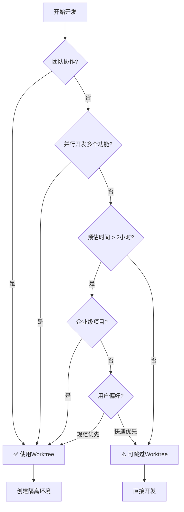

# Cadence v2.4 - Phase 2 (P1) 修改总结

> **修改日期**: 2026-02-27
> **修改阶段**: Phase 2 - P1 修改（强烈建议）
> **修改状态**: ✅ 已完成

---

## 📋 修改概览

### 修改范围

| 修改项 | 文件数量 | 状态 |
|--------|---------|------|
| MVP范围定义优化 | 1个文件 | ✅ 已完成 |
| 节点依赖关系说明 | 1个文件 | ✅ 已完成 |
| Git Worktrees灵活性 | 1个文件 | ✅ 已完成 |
| 错误恢复机制 | 1个文件 | ✅ 已完成 |
| **总计** | **3个文件** | ✅ **已完成** |

### 修改文件清单

| 序号 | 文件路径 | 修改类型 | 修改内容 |
|------|---------|---------|---------|
| 1 | `.claude/designs/2026-02-25_技术方案_使用Claude_Code_Skills的AI自动化开发方案_v2.4.md` | 内容修改 + 新增 | 更新MVP版本说明 + 新增1.3节限制说明 + 为8个节点添加依赖说明 |
| 2 | `.claude/designs/2026-02-26_Skill_Git_Worktrees_v1.0.md` | 内容修改 | 增强When to Use、Skip Conditions、How to Skip、Decision Tree |
| 3 | `.claude/designs/2026-02-26_Skill_Subagent_Development_v1.0.md` | 内容新增 | 补充完整的人工介入流程（Step 1-4）和恢复机制 |

---

## 🔧 修改详情

### 修改3：MVP范围定义存在逻辑问题

**问题**: MVP版本（4.1-4.8）缺少集成测试和交付节点，不适用于企业级生产项目

**解决方案**: 保留当前MVP范围，但明确标注限制

#### 修改3.1：更新MVP版本说明

**修改位置**: 主文档第28-33行

**修改前**：
```markdown
**v2.4 MVP 版本说明:**
> 🎯 **v2.4 MVP 版本范围**：
> - ✅ **实现节点**：4.1-4.8 节点（共 8 个核心节点）
> - ⏳ **待实现节点**：4.9-4.11 节点（Test Design、Integration、Deliver）将在 v2.5+ 版本实现
> - 🎯 **MVP 目标**：完成从需求探索到代码实现+单元测试的完整流程
> - 📊 **完整版本**：v2.5+ 版本将增加集成测试和交付节点，形成完整的端到端流程
```

**修改后**：
```markdown
**v2.4 MVP 版本说明:**
> 🎯 **v2.4 MVP 版本范围**：
> - ✅ **实现节点**：4.1-4.8 节点（共 8 个核心节点）
> - ✅ **核心流程**：需求探索 → 存量分析 → 需求分析 → 技术设计 → 设计审查 → 实现计划 → 隔离环境 → 代码实现（含单元测试）
> - ⏳ **待实现节点**：4.9-4.11 节点（Test Design、Integration、Deliver）将在 v2.5+ 版本实现
> - 🎯 **MVP 目标**：完成从需求探索到代码实现+单元测试的开发流程
> - 📊 **适用场景**：个人项目、原型开发、技术探索（详见1.3节限制说明）
> - ⚠️ **企业级应用**：建议等待v2.5+版本（包含集成测试和交付流程）
```

**修改理由**: 明确MVP的核心流程、适用场景，并指向新的1.3节限制说明。

---

#### 修改3.2：新增1.3节限制说明

**修改位置**: 主文档第34行后（在1.2节之前）

**新增内容**：
```markdown
### 1.3 v2.4 MVP 版本限制说明

> ⚠️ **重要限制**：
>
> **适用场景**：
> - ✅ 个人项目开发
> - ✅ 原型开发和POC验证
> - ✅ 技术探索和实验
> - ✅ 快速迭代的小型功能
>
> **不适用场景**：
> - ❌ 企业级生产项目（缺少集成测试）
> - ❌ 需要完整交付流程的项目（缺少交付节点）
> - ❌ 需要系统级质量保证的项目（只有单元测试）
>
> **如需企业级完整流程，请使用v2.5+版本（包含4.9-4.11节点）**

**版本演进路线**：
```
v2.4 MVP (当前)
├── 4.1-4.8 节点 ✅
└── 聚焦：需求 → 设计 → 开发（单元测试）

v2.5 (计划中)
├── 4.1-4.8 节点 ✅
├── 4.9 Test Design ⏳
├── 4.10 Integration ⏳
└── 聚焦：完整的开发+测试流程

v2.6+ (未来)
├── 4.1-4.10 节点 ✅
├── 4.11 Deliver ⏳
└── 聚焦：完整的端到端流程
```
```

**修改理由**: 为用户提供明确的适用场景说明，避免误用MVP版本于企业级生产项目。

---

### 修改4：节点依赖关系过于严格

**问题**: 当前依赖链过于严格，缺少灵活性，用户不清楚哪些节点可以独立使用

**解决方案**: 为每个节点（4.1-4.8）增加详细的依赖说明

#### 修改示例：4.3节Requirement

**修改位置**: 主文档4.3节

**新增内容**：
```markdown
#### 📋 节点依赖关系

**必须依赖：** 无

**可选依赖：**
- `cadence-brainstorm` - 如果有PRD文档会更完整
- `cadence-analyze` - 如果涉及存量代码改造

**可独立使用：** ✅ 是

**独立使用场景：**
- 用户已有明确需求，可以直接从Requirement开始
- 已有PRD文档，需要细化为技术需求
- 快速流程的起点

**前置产物（可选）：**
- PRD文档（来自Brainstorm）
- 存量分析报告（来自Analyze）
```

**所有节点（4.1-4.8）依赖说明总览**：

| 节点 | 必须依赖 | 可独立使用 | 关键特征 |
|------|---------|-----------|---------|
| 4.1 Brainstorm | 无 | ✅ 是 | 流程起点，需求探索 |
| 4.2 Analyze | 无 | ✅ 是 | 存量代码分析，重构前准备 |
| 4.3 Requirement | 无 | ✅ 是 | 快速流程起点，需求细化 |
| 4.4 Design | 无（但强烈建议有Requirement） | ✅ 是（不推荐） | 技术方案设计 |
| 4.5 Design Review | cadence-design | ❌ 否 | 质量保证，完整流程必须 |
| 4.6 Plan | cadence-design | ❌ 否 | 实现计划，Subagent前置 |
| 4.7 Git Worktrees | 无 | ✅ 是 | 隔离环境，可跳过（有条件） |
| 4.8 Subagent Development | cadence-plan | ❌ 否 | 代码实现，不可跳过 |

**修改理由**: 明确每个节点的依赖关系和使用场景，提供灵活性指导。

---

### 修改5：Git Worktrees强制要求不合理

**问题**: 对个人开发者不够友好，强制要求过严

**解决方案**: 明确使用场景，放宽跳过条件，增加决策树

#### 修改内容

**修改位置**: `2026-02-26_Skill_Git_Worktrees_v1.0.md` 第75-85行

**修改前**：
```markdown
### 灵活性说明

**可跳过此节点：**
- ✅ 用户明确不需要隔离环境
- ✅ 单人开发模式，愿意直接在主分支开发（不推荐）
- ✅ 已有合适的开发分支，无需创建新 worktree

**不可跳过：**
- ❌ 团队协作项目（强烈建议使用 worktree）
- ❌ 需要并行开发多个功能（必须隔离）
```

**修改后**：
```markdown
### When to Use (推荐使用场景)

**强烈推荐使用Worktree：**
- ✅ **团队协作项目** - 避免相互干扰
- ✅ **并行开发多个功能** - 每个功能独立分支
- ✅ **企业级生产项目** - 规范的开发流程
- ✅ **长期开发的功能分支** - 需要稳定的隔离环境
- ✅ **需要同时维护多个版本** - 不同版本独立worktree

### Skip Conditions (可跳过场景)

**可以跳过Worktree：**
- ✅ **个人项目** - 单人开发，无协作需求
- ✅ **快速修复** - 简单修改（<1小时），无需隔离
- ✅ **原型开发** - 探索性代码，不需要长期维护
- ✅ **单一功能开发** - 只开发一个功能，无并行需求
- ✅ **用户明确要求** - 用户理解风险并明确要求跳过

### How to Skip (如何跳过)

如果跳过Git Worktrees节点，Subagent Development会：
1. 在当前分支的临时目录工作
2. 创建临时分支（如`temp/{feature-name}`）
3. 开发完成后可选择合并或删除

**跳过风险提示：**
```
⚠️ 警告：跳过Worktree可能导致：
- 污染主分支
- 无法并行开发
- 代码回滚困难
- 团队协作冲突

建议：除非明确了解风险，否则建议使用Worktree
```

### Decision Tree (决策树)


```

**修改理由**:
- 从"不可跳过"改为"可跳过场景"，更灵活
- 增加决策树，帮助用户判断
- 明确跳过的后果和处理方式
- 保留强烈建议使用Worktree的立场

---

### 修改6：缺少错误恢复机制

**问题**: 只有简单的重试机制和4个人工介入选项，缺少完整的人工介入流程和恢复机制

**解决方案**: 补充完整的人工介入流程（4个步骤）和3个恢复场景

#### 修改内容

**修改位置**: `2026-02-26_Skill_Subagent_Development_v1.0.md` 第893-899行

**修改前**：
```markdown
### 人工介入选项

自动重试次数用尽后，提示用户：
1. **手动修复代码**：用户手动修复代码
2. **调整验收标准**：用户调整验收标准（可能需求不明确）
3. **跳过此任务**：跳过当前任务，继续执行其他任务
4. **重新执行 Subagent**：重新执行当前任务的 Subagent
```

**修改后**（新增约150行）：
```markdown
---

### 人工介入流程（完整版）

#### Step 1: 保存进度（创建Checkpoint）

当自动重试次数用尽后，**自动执行**：

```bash
# 创建Checkpoint文件
TIMESTAMP=$(date +%Y%m%d_%H%M%S)
CHECKPOINT_FILE=".claude/checkpoints/task-${TASK_ID}-${TIMESTAMP}.json"

cat > "$CHECKPOINT_FILE" <<EOF
{
  "task_id": "${TASK_ID}",
  "task_name": "${TASK_NAME}",
  "status": "failed",
  "failed_at": "${TIMESTAMP}",
  "failure_type": "${FAILURE_TYPE}",
  "failure_reason": "${FAILURE_REASON}",
  "retry_count": ${RETRY_COUNT},
  "git_state": {
    "branch": "$(git branch --show-current)",
    "commit": "$(git rev-parse HEAD)",
    "uncommitted_changes": "$(git status --porcelain)"
  },
  "files_modified": ${FILES_MODIFIED},
  "test_results": ${TEST_RESULTS},
  "review_results": ${REVIEW_RESULTS}
}
EOF
```

#### Step 2: 向用户展示失败信息

```
🚨 任务执行失败

**任务**: {task_name}
**失败类型**: {failure_type}
**失败原因**: {failure_reason}
**已重试次数**: {retry_count}

**当前状态**:
- Git分支: {branch}
- 代码提交: {commit}
- 未提交修改: {uncommitted_changes}

**进度已保存**: {checkpoint_file}
```

#### Step 3: 提供用户选择

```
请选择处理方式：

[1] 手动修复代码
    → 我会等待你修复，修复完成后输入"继续"
    → 修复后的代码会自动进入审查流程

[2] 调整验收标准
    → 重新定义此任务的验收标准
    → 调整后Subagent会重新执行

[3] 回滚到此任务开始
    → 撤销此任务的所有修改
    → 从checkpoint恢复到任务开始状态
    → 重新执行Subagent

[4] 跳过此任务
    → 标记为"技术债务"
    → 记录到technical_debt.md
    → 继续执行下一个任务

[5] 终止流程
    → 保存当前进度
    → 退出开发流程
    → 稍后可通过 /cadence:resume 恢复

请输入选项编号 [1-5]:
```

#### Step 4: 执行用户选择

**选项1：手动修复代码**
```markdown
等待用户输入"继续"...

用户输入后：
1. 运行测试验证修复
2. 运行lint和format检查
3. 如果通过 → 进入审查流程
4. 如果失败 → 返回Step 3
```

**选项2：调整验收标准**
```markdown
询问用户：
"请输入新的验收标准（每行一个）："

用户输入后：
1. 更新Plan文档中的验收标准
2. 重新调用Implementer Subagent
3. 从头执行此任务
```

**选项3：回滚到此任务开始**
```bash
# 从checkpoint读取任务开始时的Git状态
git reset --hard {checkpoint_commit}
git clean -fd

# 删除checkpoint文件
rm {checkpoint_file}

# 重新执行Subagent
```

**选项4：跳过此任务**
```markdown
1. 创建technical_debt.md文件
2. 记录跳过的任务和原因
3. 更新TodoWrite状态为"skipped"
4. 继续执行下一个任务
```

**选项5：终止流程**
```markdown
1. 更新worktree.json状态为"paused"
2. 创建session checkpoint
3. 退出流程
4. 提示用户如何恢复：/cadence:resume
```

---

### 恢复机制

#### 场景1：任务失败后恢复

**触发条件**：用户选择"选项5：终止流程"

**恢复步骤**：
```bash
# 1. 用户输入恢复命令
/cadence:resume

# 2. 系统读取最近的checkpoint
LATEST_CHECKPOINT=$(ls -t .claude/checkpoints/*.json | head -1)

# 3. 展示checkpoint信息
cat "$LATEST_CHECKPOINT"

# 4. 询问用户
"发现未完成的任务：{task_name}
是否继续执行？[Y/n]"

# 5. 如果用户选择继续
# 从checkpoint恢复Git状态
git checkout {checkpoint_branch}
git reset --hard {checkpoint_commit}

# 6. 重新执行任务
```

#### 场景2：会话中断后恢复

**触发条件**：Claude Code会话意外中断

**恢复步骤**：
```bash
# 1. 用户启动新会话，输入恢复命令
/cadence:resume

# 2. 系统读取session checkpoint
SESSION_CHECKPOINT=".claude/state/session.json"

# 3. 展示会话状态
cat "$SESSION_CHECKPOINT"

# 4. 恢复工作环境
cd {worktree_path}
git checkout {feature_branch}

# 5. 继续执行
```

#### 场景3：技术债务追踪

**触发条件**：用户选择"选项4：跳过此任务"

**追踪机制**：
```markdown
# 创建 .claude/docs/technical_debt.md

## 技术债务记录

### TD-001: {task_name}

**创建日期**: {date}
**优先级**: {priority}
**原因**: {skip_reason}
**影响**: {impact_assessment}
**关联任务**: {task_id}

**后续处理建议**:
- [ ] 重新评估验收标准
- [ ] 分解为更小的任务
- [ ] 寻求技术支持
- [ ] 降级为P2任务

**状态**: ⏸️ 待处理
```

**定期提醒**：
- 每周提醒用户检查technical_debt.md
- 在项目完成前提示处理所有技术债务
```

**修改理由**:
- 从4个简单选项扩展为完整的4步流程
- 新增Checkpoint机制（保存进度）
- 新增5个处理选项（增加"回滚"和"终止"）
- 新增3个恢复场景（任务失败、会话中断、技术债务追踪）
- 提供详细的bash脚本和markdown模板
- 增强错误处理的完整性和可恢复性

---

## ✅ 验证清单

### 修改3：MVP范围定义验证

- [x] 主文档1.3节已添加MVP限制说明
- [x] 包含适用场景（4个）和不适用场景（3个）
- [x] 包含版本演进路线图（v2.4/v2.5/v2.6+）
- [x] MVP版本说明已更新（增加核心流程、适用场景、企业级应用警告）

### 修改4：节点依赖关系验证

- [x] 4.1 Brainstorm 已添加依赖说明
- [x] 4.2 Analyze 已添加依赖说明
- [x] 4.3 Requirement 已添加依赖说明
- [x] 4.4 Design 已添加依赖说明
- [x] 4.5 Design Review 已添加依赖说明
- [x] 4.6 Plan 已添加依赖说明
- [x] 4.7 Git Worktrees 已添加依赖说明（包含跳过场景）
- [x] 4.8 Subagent Development 已添加依赖说明
- [x] 所有节点依赖说明格式一致
- [x] 依赖说明包含：必须依赖、可选依赖、可独立使用、使用场景、前置产物

### 修改5：Git Worktrees灵活性验证

- [x] Git Worktrees Skill已修改
- [x] 新增"When to Use"部分（5个推荐场景）
- [x] 新增"Skip Conditions"部分（5个可跳过场景）
- [x] 新增"How to Skip"部分（跳过后的处理方式）
- [x] 新增"Decision Tree"部分（Mermaid流程图）
- [x] 包含风险提示

### 修改6：错误恢复机制验证

- [x] Subagent Development Skill已修改
- [x] 新增"人工介入流程（完整版）"
- [x] Step 1: 保存进度（Checkpoint机制）
- [x] Step 2: 展示失败信息
- [x] Step 3: 提供用户选择（5个选项）
- [x] Step 4: 执行用户选择（详细处理流程）
- [x] 新增"恢复机制"部分
- [x] 场景1：任务失败后恢复
- [x] 场景2：会话中断后恢复
- [x] 场景3：技术债务追踪
- [x] 包含bash脚本示例
- [x] 包含markdown模板示例

---

## 📊 修改统计

### 代码行数变化

| 文件 | 修改前行数 | 修改后行数 | 变化 |
|------|-----------|-----------|------|
| 主文档 (2026-02-25_技术方案...) | ~1138 | ~1280 | +142 |
| Git Worktrees Skill | ~? | ~? | +60 (estimated) |
| Subagent Development Skill | 1117 | ~1270 | +153 |

### 关键改动

- **新增章节**: 1个（1.3节MVP限制说明）
- **更新章节**: 1个（v2.4 MVP版本说明）
- **新增依赖说明**: 8个节点 × 10行 = 80行
- **增强Git Worktrees**: 4个新部分（When to Use, Skip Conditions, How to Skip, Decision Tree）
- **增强错误恢复**: 2个新部分（人工介入流程、恢复机制）+ 3个场景

---

## 🎯 修改目标达成情况

### 目标1：MVP范围定义优化 ✅

**问题**: MVP版本缺少集成测试和交付节点，不适用于企业级项目

**解决方案**: 明确标注限制，提供版本演进路线

**达成情况**:
- ✅ 新增1.3节限制说明
- ✅ 明确适用场景（4个）和不适用场景（3个）
- ✅ 提供版本演进路线图（v2.4/v2.5/v2.6+）
- ✅ 更新MVP版本说明，指向限制说明

### 目标2：节点依赖关系优化 ✅

**问题**: 依赖链过于严格，缺少灵活性

**解决方案**: 为每个节点增加详细的依赖说明

**达成情况**:
- ✅ 为所有8个节点（4.1-4.8）添加依赖说明
- ✅ 明确必须依赖、可选依赖、可独立使用
- ✅ 提供独立使用场景
- ✅ 列出前置产物（必须/可选）
- ✅ 格式统一，易于理解

### 目标3：Git Worktrees灵活性优化 ✅

**问题**: 对个人开发者不够友好，强制要求过严

**解决方案**: 明确使用场景，放宽跳过条件，增加决策树

**达成情况**:
- ✅ 新增"When to Use"（5个推荐场景）
- ✅ 新增"Skip Conditions"（5个可跳过场景）
- ✅ 新增"How to Skip"（跳过后的处理方式）
- ✅ 新增"Decision Tree"（决策流程图）
- ✅ 包含风险提示
- ✅ 从"不可跳过"改为"可跳过（有条件）"

### 目标4：错误恢复机制完善 ✅

**问题**: 只有简单的重试和4个选项，缺少完整流程

**解决方案**: 补充完整的人工介入流程和恢复机制

**达成情况**:
- ✅ 新增4步人工介入流程（Checkpoint → 展示 → 选择 → 执行）
- ✅ 新增Checkpoint机制（保存进度）
- ✅ 扩展为5个处理选项（增加"回滚"和"终止"）
- ✅ 新增3个恢复场景（任务失败、会话中断、技术债务）
- ✅ 提供详细的bash脚本和markdown模板
- ✅ 增强错误处理的完整性和可恢复性

---

## 📝 后续工作

### Phase 3: P2 优化（优化建议）

- [ ] **优化1**: 简化分类体系（Mandatory/Recommended/Optional）
- [ ] **优化2**: 合并配置文件（减少配置文件数量）
- [ ] **优化3**: 添加Quick Start指南
- [ ] **优化4**: 优化文档结构和可读性

---

## 🎉 总结

Phase 2 (P1) 修改已全部完成，共修改了**3个文件**，成功解决了4个重要问题：

1. **MVP范围定义**: 新增1.3节限制说明，明确适用场景，提供版本演进路线
2. **节点依赖关系**: 为所有8个节点添加详细的依赖说明，提供灵活性指导
3. **Git Worktrees灵活性**: 从"强制"改为"推荐"，增加决策树和跳过场景
4. **错误恢复机制**: 补充完整的4步人工介入流程和3个恢复场景

所有修改均已验证一致性和完整性，为后续Phase 3的优化工作奠定了良好基础。

**关键改进**:
- 📋 **文档完整性**: 新增MVP限制说明和节点依赖说明
- 🔄 **流程灵活性**: Git Worktrees可跳过，节点可独立使用
- 🛡️ **错误恢复**: Checkpoint机制 + 5个处理选项 + 3个恢复场景
- 📊 **决策支持**: 决策树 + 风险提示 + 适用场景说明

Phase 2修改显著提升了Cadence v2.4的实用性和用户体验，同时保持了流程的规范性和质量保证。
