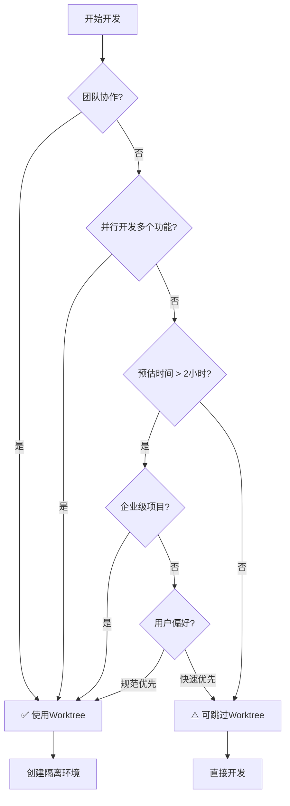

# Cadence v2.4 修改实施计划

> **创建日期**: 2026-02-27
> **版本**: v1.0
> **目标**: 基于review反馈，修正关键问题并优化设计方案

---

## 📋 修改总览

### 修改范围

| 类别 | 数量 | 优先级 |
|------|------|--------|
| P0 - 必须修改 | 2个 | 🔴 高 |
| P1 - 强烈建议 | 4个 | 🟡 中 |
| P2 - 优化建议 | 4个 | 🟢 低 |

### 预计工作量

| 阶段 | 工作量 | 时间 |
|------|--------|------|
| P0 修改 | 3-5天 | 第1周 |
| P1 修改 | 5-7天 | 第2周 |
| P2 优化 | 2-3天 | 第3周 |
| **总计** | **10-15天** | **3周** |

---

## 🔴 Phase 1: P0 修改（必须修改）

### 修改1：Subagent配置方式错误

**问题**：当前在`agents.json`中静态配置Subagent，但Claude Code的Subagent应该通过Task tool动态调用

**修改方案**：采用选项A - 参考superpowers的`subagent-driven-development`

#### 具体修改

**1.1 删除agents.json配置**

**文件**：`.claude-plugin/agents.json`
**操作**：删除此文件（或保留但不使用）

**理由**：Claude Code不需要预定义Subagent

---

**1.2 修改Subagent Development Skill**

**文件**：`skills/cadence-subagent-development/SKILL.md`

**当前内容**：
```markdown
## The Process

1. 读取Plan任务清单
2. 读取Worktree信息
3. 识别并行任务
4. 分配任务给Subagent
...
```

**修改为**：
```markdown
## The Process

### 详细流程

1. **读取Plan任务清单**
   - 读取Plan阶段生成的实现计划（必须）
   - 获取任务清单（包含任务名称、描述、优先级、依赖关系）
   - 获取验收标准（每个任务必须满足的验收标准）

2. **读取Worktree信息**
   - 读取`.claude/state/worktree.json`
   - 获取worktree路径（Subagent的工作目录）
   - 获取feature分支名称（Subagent的开发分支）
   - 验证worktree环境是否正常

3. **识别并行任务**
   - 从Plan任务清单中识别可并行执行的任务
   - 识别依据：
     - 任务间无依赖关系
     - 任务操作不同的文件（避免冲突）
   - 并发限制：最多同时运行5个Subagent（默认）

4. **执行任务（循环处理每个任务）**

   对每个任务，依次执行：

   #### 4.1 调用Implementer Subagent

   ```markdown
   Task tool (general-purpose):
     description: "Implement {task_name}"
     prompt: |
       You are implementing: **{task_name}**

       ## Task Description
       {完整任务描述，来自Plan}

       ## Context
       - **Project**: {project_name}
       - **Feature Branch**: {feature_branch}
       - **Work Directory**: {worktree_path}
       - **Dependencies**: {依赖任务列表}
       - **Priority**: {P0/P1/P2}

       ## Acceptance Criteria
       {验收标准列表，来自Plan}

       ## Technical Constraints
       {技术约束，来自Design}

       ## TDD Workflow (MUST FOLLOW)

       ### Phase 1: RED
       1. Write failing tests first
       2. Run tests to verify they fail
       3. Commit test file: `test: add test for {feature}`

       ### Phase 2: GREEN
       1. Write minimal code to pass tests
       2. Run tests to verify they pass
       3. Commit implementation: `feat: implement {feature}`

       ### Phase 3: BLUE
       1. Refactor code for quality
       2. Run lint and format checks
       3. Verify tests still pass
       4. Commit refactoring: `refactor: optimize {feature}`

       ## Self-Review Checklist
       Before reporting completion, verify:
       - [ ] All acceptance criteria met
       - [ ] Test coverage ≥ {threshold}%
       - [ ] Lint checks pass
       - [ ] Format checks pass
       - [ ] No extra features added (YAGNI)

       ## Output Format
       Report your completion with:
       ```
       ## Implementation Complete

       ### Files Changed
       - {file_path}: {description}

       ### Test Results
       - Coverage: {X}%
       - All tests passing: {yes/no}

       ### Acceptance Criteria Status
       - [x] Criterion 1: {status}
       - [x] Criterion 2: {status}
       ...

       ### Self-Review Results
       - Code quality: {assessment}
       - Potential issues: {list or "none"}
       ```
   ```

   #### 4.2 调用Spec Reviewer Subagent

   ```markdown
   Task tool (general-purpose):
     description: "Review spec compliance for {task_name}"
     prompt: |
       You are a **Spec Compliance Reviewer**. Your job is to verify that the implementation matches the specification exactly - nothing more, nothing less.

       ## Task Specification
       {完整任务描述，来自Plan}

       ## Implementation Report
       {Implementer的完成报告}

       ## Your Mission

       ### 1. DO NOT TRUST THE REPORT
       The implementer's report may be incomplete or inaccurate. You MUST:
       - Read the actual code changes
       - Verify each acceptance criterion independently
       - Check for missing requirements
       - Check for extra features (YAGNI violations)

       ### 2. Verification Checklist

       | Requirement | Implemented? | Evidence |
       |-------------|--------------|----------|
       | {requirement_1} | ✅/❌ | {code_location} |
       | {requirement_2} | ✅/❌ | {code_location} |
       ...

       ### 3. YAGNI Check
       Are there any features implemented that were NOT in the specification?
       - [ ] No extra features found
       - [ ] Extra features found: {list}

       ### 4. Missing Requirements
       Are all requirements from the spec implemented?
       - [ ] All requirements implemented
       - [ ] Missing: {list}

       ## Output Format
       ```
       ## Spec Compliance Review

       ### Overall Status
       - [x] COMPLIANT - All requirements met, no extras
       - [ ] ISSUES FOUND - See below

       ### Requirements Checklist
       {completed checklist}

       ### Issues Found
       {list of issues or "None"}

       ### Recommendation
       - [x] APPROVED - Ready for quality review
       - [ ] CHANGES NEEDED - Must fix issues before quality review
       ```
   ```

   #### 4.3 如果Spec Review发现问题

   ```markdown
   Task tool (general-purpose):
     description: "Fix spec compliance issues for {task_name}"
     prompt: |
       You need to fix the following spec compliance issues:

       ## Issues to Fix
       {Spec Reviewer发现的问题列表}

       ## Original Task Specification
       {完整任务描述}

       ## Instructions
       1. Fix ONLY the issues listed above
       2. Do NOT add any new features
       3. Run tests after fixes
       4. Commit fixes: `fix: address spec review issues`

       ## Output
       Report what you fixed and re-run the spec review process.
   ```

   **然后再次调用Spec Reviewer验证修复**

   #### 4.4 调用Code Quality Reviewer Subagent

   ```markdown
   Task tool (general-purpose):
     description: "Review code quality for {task_name}"
     prompt: |
       You are a **Code Quality Reviewer** with expertise in:
       - Code style and formatting
       - Security vulnerabilities
       - Performance issues
       - Test coverage
       - Best practices

       ## Git Commit Range
       - Base SHA: {base_commit}
       - Head SHA: {head_commit}

       ## Review Dimensions

       ### 1. Strengths (先肯定)
       What was done well?
       - Code quality: {assessment}
       - Test coverage: {assessment}
       - Documentation: {assessment}
       - Adherence to specs: {assessment}

       ### 2. Issues by Severity

       #### Critical (Must Fix)
       Issues that could cause:
       - Security vulnerabilities
       - Data loss
       - Performance degradation
       - Test failures

       #### Important (Should Fix)
       Issues that affect:
       - Code maintainability
       - Code readability
       - Best practices violations

       #### Minor (Nice to Fix)
       Issues that are:
       - Style preferences
       - Minor optimizations
       - Documentation improvements

       ### 3. Automated Checks
       - Lint results: {pass/fail}
       - Format results: {pass/fail}
       - Test coverage: {X}%
       - Test results: {all pass/failures}

       ## Output Format
       ```
       ## Code Quality Review

       ### Overall Status
       - [x] APPROVED - Ready to proceed
       - [ ] CHANGES NEEDED - Critical issues found

       ### Strengths
       {list of strengths}

       ### Issues Found

       #### Critical
       {list or "None"}

       #### Important
       {list or "None"}

       #### Minor
       {list or "None"}

       ### Recommendation
       {specific recommendation}
       ```
   ```

   #### 4.5 如果Code Quality Review发现Critical问题

   ```markdown
   Task tool (general-purpose):
     description: "Fix critical code quality issues for {task_name}"
     prompt: |
       You need to fix the following CRITICAL code quality issues:

       ## Critical Issues
       {Code Quality Reviewer发现的Critical问题列表}

       ## Instructions
       1. Fix ONLY the critical issues
       2. Run tests after fixes
       3. Run lint and format checks
       4. Commit fixes: `fix: address critical code quality issues`

       ## Output
       Report what you fixed and prepare for re-review.
   ```

   **然后再次调用Code Quality Reviewer验证修复**

   #### 4.6 标记任务完成

   当Spec Review和Code Quality Review都通过后：
   - 更新TodoWrite状态为completed
   - 记录到development_log.json
   - 进入下一个任务

5. **生成开发日志**
   - 记录每个任务的执行情况
   - 保存到`.claude/state/development_log.json`

6. **更新Worktree状态**
   - 更新worktree.json中的status为completed
   - 记录完成时间
```

**1.3 创建prompt模板文件（可选）**

如果希望保持SKILL.md简洁，可以创建外部文件：

**目录结构**：
```
skills/cadence-subagent-development/
├── SKILL.md
└── prompts/
    ├── implementer.md
    ├── spec-reviewer.md
    └── code-quality-reviewer.md
```

**implementer.md**：
```markdown
You are implementing: **{task_name}**

## Task Description
{完整任务描述，来自Plan}

## Context
- **Project**: {project_name}
- **Feature Branch**: {feature_branch}
- **Work Directory**: {worktree_path}
- **Dependencies**: {依赖任务列表}
- **Priority**: {P0/P1/P2}

## Acceptance Criteria
{验收标准列表，来自Plan}

## Technical Constraints
{技术约束，来自Design}

## TDD Workflow (MUST FOLLOW)

### Phase 1: RED
1. Write failing tests first
2. Run tests to verify they fail
3. Commit test file: `test: add test for {feature}`

### Phase 2: GREEN
1. Write minimal code to pass tests
2. Run tests to verify they pass
3. Commit implementation: `feat: implement {feature}`

### Phase 3: BLUE
1. Refactor code for quality
2. Run lint and format checks
3. Verify tests still pass
4. Commit refactoring: `refactor: optimize {feature}`

## Self-Review Checklist
Before reporting completion, verify:
- [ ] All acceptance criteria met
- [ ] Test coverage ≥ {threshold}%
- [ ] Lint checks pass
- [ ] Format checks pass
- [ ] No extra features added (YAGNI)

## Output Format
Report your completion with:
```
## Implementation Complete

### Files Changed
- {file_path}: {description}

### Test Results
- Coverage: {X}%
- All tests passing: {yes/no}

### Acceptance Criteria Status
- [x] Criterion 1: {status}
- [x] Criterion 2: {status}
...

### Self-Review Results
- Code quality: {assessment}
- Potential issues: {list or "none"}
```
```

**在SKILL.md中引用**：
```markdown
Task tool (general-purpose):
  description: "Implement {task_name}"
  prompt: |
    {include: prompts/implementer.md}
```

---

### 修改2：三层技术栈检测过于复杂

**问题**：当前的三层检测（Task Description → CLAUDE.md → Auto-Detect）过于复杂

**修改方案**：简化为单层+手动覆盖

#### 具体修改

**2.1 修改Plan Skill**

**文件**：`skills/cadence-plan/SKILL.md`

**当前内容**（第139-151行）：
```markdown
3. **读取技术栈配置** ⭐⭐（新增）
   - **步骤 1：检查 CLAUDE.md**
     - 读取项目根目录的 `CLAUDE.md` 文件
     - 查找 `project_tech_stack` 配置
     - 如果存在 → 直接使用
   - **步骤 2：如果 CLAUDE.md 没有配置**
     - 自动检测项目类型（package.json、requirements.txt 等）
     - **与用户确认技术栈配置**
     - 建议用户将配置写入 CLAUDE.md
   - **步骤 3：整理输出**
     - 将技术栈信息输出到 Plan 文档的"技术栈配置"章节
     - 每个任务继承项目技术栈配置
```

**修改为**：
```markdown
3. **读取技术栈配置** ⭐
   - **默认：读取CLAUDE.md**
     - 读取项目根目录的 `CLAUDE.md` 文件
     - 查找 `tech_stack` 配置
     - 如果存在 → 使用配置

   - **特殊情况：用户在对话中指定**
     - 如果用户在对话中明确指定技术栈，使用用户指定的配置
     - 示例："使用Python + pytest + black"

   - **缺失：提示用户配置**
     - 如果CLAUDE.md没有配置且用户也没有指定
     - 提示用户："请在CLAUDE.md中配置tech_stack，格式如下..."
     - 提供配置模板

   - **输出到Plan文档**
     - 将技术栈信息输出到Plan文档的"技术栈配置"章节
     - 后续Skill（Subagent Development）直接使用此配置

   **CLAUDE.md配置模板**：
   ```markdown
   ## Tech Stack

   ```yaml
   tech_stack:
     language: "python"
     test_command: "pytest tests/"
     test_coverage_command: "pytest --cov=src --cov-report=term-missing --cov-fail-under=80"
     lint_command: "flake8 src/ tests/"
     format_command: "black src/ tests/ && isort src/ tests/"
     coverage_threshold: 80
   ```
   ```
```

**2.2 删除Subagent Definition文档中的三层检测说明**

**文件**：`designs/2026-02-26_技术方案_Subagent定义_v1.1.md`

**当前内容**（第247-286行）：
```markdown
### 三层检测架构

**技术栈流转路径**：
```
CLAUDE.md (用户维护)
    ↓ Plan Skill 读取
实现计划 (tech_stack 配置)
    ↓ Subagent 使用
代码实现 (test/lint/format)
```

**三层优先级**：

```
┌─────────────────────────────────────────────┐
│  Priority 1: Task Description（最高优先级） │
│  - 来自 Plan 输出的任务配置                 │
│  - 可覆盖项目级配置                         │
└─────────────────────────────────────────────┘
                    ↓
        如果 Task 没有配置？
                    ↓
┌─────────────────────────────────────────────┐
│  Priority 2: CLAUDE.md（次优先级）          │
│  - 项目根目录的 CLAUDE.md 文件              │
│  - 包含 project_tech_stack 配置             │
│  - 项目级默认配置                           │
└─────────────────────────────────────────────┘
                    ↓
        如果 CLAUDE.md 也没配置？
                    ↓
┌─────────────────────────────────────────────┐
│  Priority 3: Auto-Detect + User Confirm    │
│  - 检测项目文件（package.json 等）          │
│  - ⚠️ 必须与用户确认                        │
│  - 建议用户将配置写入 CLAUDE.md             │
└─────────────────────────────────────────────┘
```
```

**修改为**：
```markdown
### 技术栈配置机制

**配置流程**：
```
CLAUDE.md (用户维护)
    ↓ Plan Skill 读取
实现计划 (tech_stack 配置)
    ↓ Subagent 使用
代码实现 (test/lint/format)
```

**配置优先级**：
1. **用户对话指定**（最高优先级）- 如果用户在对话中明确指定技术栈
2. **CLAUDE.md配置**（默认）- 项目级配置
3. **缺失提示**（兜底）- 提示用户配置CLAUDE.md

**配置示例**：
```markdown
<!-- CLAUDE.md -->
## Tech Stack

```yaml
tech_stack:
  language: "python"
  test_command: "pytest tests/"
  test_coverage_command: "pytest --cov=src --cov-fail-under=80"
  lint_command: "flake8 src/ tests/"
  format_command: "black src/ tests/"
  coverage_threshold: 80
```
```

**Plan Skill处理逻辑**：
1. 优先使用用户对话中指定的配置
2. 其次读取CLAUDE.md中的tech_stack配置
3. 如果都没有，提示用户配置并提供模板
4. 将最终配置输出到Plan文档
```

---

## 🟡 Phase 2: P1 修改（强烈建议）

### 修改3：MVP范围定义存在逻辑问题

**问题**：MVP版本（4.1-4.8）缺少集成测试和交付节点

**修改方案**：保留当前MVP范围，但明确标注限制

#### 具体修改

**3.1 在主文档中增加限制说明**

**文件**：`designs/2026-02-25_技术方案_使用Claude_Code_Skills的AI自动化开发方案_v2.4.md`

**在第33行后插入**：
```markdown
### 1.3 v2.4 MVP 版本限制说明

> ⚠️ **重要限制**：
>
> **适用场景**：
> - ✅ 个人项目开发
> - ✅ 原型开发和POC验证
> - ✅ 技术探索和实验
> - ✅ 快速迭代的小型功能
>
> **不适用场景**：
> - ❌ 企业级生产项目（缺少集成测试）
> - ❌ 需要完整交付流程的项目（缺少交付节点）
> - ❌ 需要系统级质量保证的项目（只有单元测试）
>
> **如需企业级完整流程，请使用v2.5+版本（包含4.9-4.11节点）**

**版本演进路线**：
```
v2.4 MVP (当前)
├── 4.1-4.8 节点 ✅
└── 聚焦：需求 → 设计 → 开发（单元测试）

v2.5 (计划中)
├── 4.1-4.8 节点 ✅
├── 4.9 Test Design ⏳
├── 4.10 Integration ⏳
└── 聚焦：完整的开发+测试流程

v2.6+ (未来)
├── 4.1-4.10 节点 ✅
├── 4.11 Deliver ⏳
└── 聚焦：完整的端到端流程
```
```

**3.2 更新MVP版本说明**

**文件**：`designs/2026-02-25_技术方案_使用Claude_Code_Skills的AI自动化开发方案_v2.4.md`

**修改第28-33行**：
```markdown
**v2.4 MVP 版本说明:**
> 🎯 **v2.4 MVP 版本范围**：
> - ✅ **实现节点**：4.1-4.8 节点（共 8 个核心节点）
> - ✅ **核心流程**：需求探索 → 存量分析 → 需求分析 → 技术设计 → 设计审查 → 实现计划 → 隔离环境 → 代码实现（含单元测试）
> - ⏳ **待实现节点**：4.9-4.11 节点（Test Design、Integration、Deliver）将在 v2.5+ 版本实现
> - 🎯 **MVP 目标**：完成从需求探索到代码实现+单元测试的开发流程
> - 📊 **适用场景**：个人项目、原型开发、技术探索（详见1.3节限制说明）
> - ⚠️ **企业级应用**：建议等待v2.5+版本（包含集成测试和交付流程）
```

---

### 修改4：节点依赖关系过于严格

**问题**：当前依赖链过于严格，缺少灵活性

**修改方案**：明确每个节点的可选/必须依赖

#### 具体修改

**4.1 为每个节点增加依赖说明**

**文件**：`designs/2026-02-25_技术方案_使用Claude_Code_Skills的AI自动化开发方案_v2.4.md`

**在每个节点（4.1-4.8）的开头增加依赖说明部分**：

**示例 - 修改4.3 Requirement节点**：
```markdown
### 4.3 节点3：Requirement（需求分析）

**Skill 文档**：[2026-02-25_Skill_Requirement_v1.0.md](./2026-02-25_Skill_Requirement_v1.0.md)

**简要说明**：基于 PRD 和存量分析（如涉及存量代码），进行详细的需求分析，生成完整的需求文档。

---

#### 📋 节点依赖关系

**必须依赖：** 无

**可选依赖：**
- `cadence-brainstorm` - 如果有PRD文档会更完整
- `cadence-analyze` - 如果涉及存量代码改造

**可独立使用：** ✅ 是

**独立使用场景：**
- 用户已有明确需求，可以直接从Requirement开始
- 已有PRD文档，需要细化为技术需求
- 快速流程的起点

**前置产物（可选）：**
- PRD文档（来自Brainstorm）
- 存量分析报告（来自Analyze）

---
```

**对所有8个节点（4.1-4.8）都增加类似的依赖说明**

---

### 修改5：Git Worktrees强制要求不合理

**问题**：对个人开发者不够友好，强制要求过严

**修改方案**：明确使用场景，放宽跳过条件

#### 具体修改

**5.1 修改Git Worktrees Skill**

**文件**：`skills/cadence-using-git-worktrees/SKILL.md`

**当前内容**（第75-85行）：
```markdown
### 灵活性说明

**可跳过此节点：**
- ✅ 用户明确不需要隔离环境
- ✅ 单人开发模式，愿意直接在主分支开发（不推荐）
- ✅ 已有合适的开发分支，无需创建新 worktree

**不可跳过：**
- ❌ 团队协作项目（强烈建议使用 worktree）
- ❌ 需要并行开发多个功能（必须隔离）
```

**修改为**：
```markdown
### When to Use (推荐使用场景)

**强烈推荐使用Worktree：**
- ✅ **团队协作项目** - 避免相互干扰
- ✅ **并行开发多个功能** - 每个功能独立分支
- ✅ **企业级生产项目** - 规范的开发流程
- ✅ **长期开发的功能分支** - 需要稳定的隔离环境
- ✅ **需要同时维护多个版本** - 不同版本独立worktree

### Skip Conditions (可跳过场景)

**可以跳过Worktree：**
- ✅ **个人项目** - 单人开发，无协作需求
- ✅ **快速修复** - 简单修改（<1小时），无需隔离
- ✅ **原型开发** - 探索性代码，不需要长期维护
- ✅ **单一功能开发** - 只开发一个功能，无并行需求
- ✅ **用户明确要求** - 用户理解风险并明确要求跳过

### How to Skip (如何跳过)

如果跳过Git Worktrees节点，Subagent Development会：
1. 在当前分支的临时目录工作
2. 创建临时分支（如`temp/{feature-name}`）
3. 开发完成后可选择合并或删除

**跳过风险提示：**
```
⚠️ 警告：跳过Worktree可能导致：
- 污染主分支
- 无法并行开发
- 代码回滚困难
- 团队协作冲突

建议：除非明确了解风险，否则建议使用Worktree
```

### Decision Tree (决策树)


```

---

### 修改6：缺少错误恢复机制

**问题**：只有重试机制，缺少完整的人工介入和恢复流程

**修改方案**：补充完整的人工介入流程和恢复机制

#### 具体修改

**6.1 修改Subagent Development Skill**

**文件**：`skills/cadence-subagent-development/SKILL.md`

**当前内容**（第630-661行）：
```markdown
## 失败处理策略

### 自动重试策略

| 失败类型 | 重试次数 | 重试条件 | 处理方式 |
|---------|---------|---------|---------|
| **测试失败** | 3 次 | 测试未通过 | Subagent 自动修复代码 |
| **审查失败** | 2 次 | 代码审查发现问题 | Subagent 自动修复问题 |
| **覆盖率不足** | 2 次 | 覆盖率未达标 | Subagent 自动补充测试 |
| **验收失败** | 0 次 | 未满足所有验收标准 | 提示用户手动处理 |
| **超时失败** | 0 次 | 执行时间超过预期 | 提示用户是否继续 |

### 人工介入选项

自动重试次数用尽后，提示用户：
1. **手动修复代码**：用户手动修复代码
2. **调整验收标准**：用户调整验收标准（可能需求不明确）
3. **跳过此任务**：跳过当前任务，继续执行其他任务
4. **重新执行 Subagent**：重新执行当前任务的 Subagent
```

**修改为**：
```markdown
## 失败处理策略

### 自动重试策略

| 失败类型 | 重试次数 | 重试条件 | 处理方式 |
|---------|---------|---------|---------|
| **测试失败** | 3 次 | 测试未通过 | Subagent 自动修复代码 |
| **审查失败** | 2 次 | 代码审查发现问题 | Subagent 自动修复问题 |
| **覆盖率不足** | 2 次 | 覆盖率未达标 | Subagent 自动补充测试 |
| **验收失败** | 0 次 | 未满足所有验收标准 | 提示用户手动处理 |
| **超时失败** | 0 次 | 执行时间超过预期 | 提示用户是否继续 |

---

### 人工介入流程（完整版）

#### Step 1: 保存进度（创建Checkpoint）

当自动重试次数用尽后，**自动执行**：

```bash
# 创建Checkpoint文件
TIMESTAMP=$(date +%Y%m%d_%H%M%S)
CHECKPOINT_FILE=".claude/checkpoints/task-${TASK_ID}-${TIMESTAMP}.json"

cat > "$CHECKPOINT_FILE" <<EOF
{
  "task_id": "${TASK_ID}",
  "task_name": "${TASK_NAME}",
  "status": "failed",
  "failed_at": "${TIMESTAMP}",
  "failure_type": "${FAILURE_TYPE}",
  "failure_reason": "${FAILURE_REASON}",
  "retry_count": ${RETRY_COUNT},
  "git_state": {
    "branch": "$(git branch --show-current)",
    "commit": "$(git rev-parse HEAD)",
    "uncommitted_changes": "$(git status --porcelain)"
  },
  "files_modified": ${FILES_MODIFIED},
  "test_results": ${TEST_RESULTS},
  "review_results": ${REVIEW_RESULTS}
}
EOF
```

#### Step 2: 向用户展示失败信息

```
🚨 任务执行失败

**任务**: {task_name}
**失败类型**: {failure_type}
**失败原因**: {failure_reason}
**已重试次数**: {retry_count}

**当前状态**:
- Git分支: {branch}
- 代码提交: {commit}
- 未提交修改: {uncommitted_changes}

**进度已保存**: {checkpoint_file}
```

#### Step 3: 提供用户选择

```
请选择处理方式：

[1] 手动修复代码
    → 我会等待你修复，修复完成后输入"继续"
    → 修复后的代码会自动进入审查流程

[2] 调整验收标准
    → 重新定义此任务的验收标准
    → 调整后Subagent会重新执行

[3] 回滚到此任务开始
    → 撤销此任务的所有修改
    → 从checkpoint恢复到任务开始状态
    → 重新执行Subagent

[4] 跳过此任务
    → 标记为"技术债务"
    → 记录到technical_debt.md
    → 继续执行下一个任务

[5] 终止流程
    → 保存当前进度
    → 退出开发流程
    → 稍后可通过 /cadence:resume 恢复

请输入选项编号 [1-5]:
```

#### Step 4: 执行用户选择

**选项1：手动修复代码**
```markdown
等待用户输入"继续"...

用户输入后：
1. 运行测试验证修复
2. 运行lint和format检查
3. 如果通过 → 进入审查流程
4. 如果失败 → 返回Step 3
```

**选项2：调整验收标准**
```markdown
询问用户：
"请输入新的验收标准（每行一个）："

用户输入后：
1. 更新Plan文档中的验收标准
2. 重新调用Implementer Subagent
3. 从头执行此任务
```

**选项3：回滚到此任务开始**
```bash
# 从checkpoint读取任务开始时的Git状态
git reset --hard {checkpoint_commit}
git clean -fd

# 删除checkpoint文件
rm {checkpoint_file}

# 重新执行Subagent
```

**选项4：跳过此任务**
```markdown
1. 创建technical_debt.md文件
2. 记录跳过的任务和原因
3. 更新TodoWrite状态为"skipped"
4. 继续执行下一个任务
```

**选项5：终止流程**
```markdown
1. 更新worktree.json状态为"paused"
2. 创建session checkpoint
3. 退出流程
4. 提示用户如何恢复：/cadence:resume
```

---

### 恢复机制

#### 从Checkpoint恢复

**命令**: `/cadence:resume`

**流程**:
```markdown
1. 读取最近的checkpoint文件
2. 展示checkpoint信息：
   - 任务名称
   - 失败原因
   - 保存时间
   - Git状态

3. 询问用户：
   "发现未完成的任务，是否恢复？"
   [1] 从失败的任务继续
   [2] 从上一个完成的任务继续
   [3] 从头开始

4. 根据用户选择恢复执行
```

#### Checkpoint文件管理

**位置**: `.claude/checkpoints/`

**命名**: `task-{task_id}-{timestamp}.json`

**清理策略**:
- 成功完成的任务：删除对应checkpoint
- 失败的任务：保留checkpoint，直到手动清理
- 最多保留30天的checkpoint

**清理命令**: `/cadence:cleanup-checkpoints`
```

---

## 🟢 Phase 3: P2 优化（提升体验）

### 修改7：简化Skill分类

**当前分类**：
- 元Skill (1个)
- 前置Skill (5个)
- 节点Skill (11个)
- 流程Skill (3个)
- 支持Skill (2个)

**优化为**：
- 入口Skill (1个): using-cadence
- 流程Skill (3个): full-flow, quick-flow, exploration-flow
- 节点Skill (11个): brainstorm, analyze, ..., deliver
- 辅助Skill (5个): tdd, code-review, self-review, verification, finishing

**修改文件**：`designs/2026-02-26_技术方案_Skills目录结构_v1.0.md`

---

### 修改8：减少配置文件数量

**当前配置文件**：
```
plugin.json, marketplace.json, dependencies.json, hooks.json, agents.json
```

**优化为**：
```
plugin.json (必须) - 包含所有配置
marketplace.json (必须) - 市场展示
hooks.json (可选) - 如果需要hooks
```

**修改方案**：
1. 将`dependencies.json`内容合并到`plugin.json`
2. 删除`agents.json`（Subagent不需要预定义）
3. 保留`hooks.json`（可选）

---

### 修改9：增加Quick Start示例

**位置**：主文档第1章后

**内容**：
```markdown
## Quick Start (5分钟上手)

### 场景1：个人项目快速开发

```bash
# 快速流程（跳过设计审查）
/cadence:quick-flow

# 只需4步：
# Requirement → Plan → Git Worktrees → Subagent Development
# 预计时间：1-2小时
```

### 场景2：企业级完整流程

```bash
# 完整流程（包含所有审查）
/cadence:full-flow

# 8步完整流程（v2.4 MVP）
# Brainstorm → Analyze → Requirement → Design →
# Design Review → Plan → Git Worktrees → Subagent Development
# 预计时间：1-2天
```

### 场景3：技术探索

```bash
# 探索流程（允许失败）
/cadence:exploration-flow

# 允许迭代，快速验证想法
# 预计时间：2-4小时
```

### 场景4：只使用单个节点

```bash
# 只需要代码审查
/cadence:request-review

# 只需要TDD流程
/cadence:tdd

# 只需要创建隔离环境
/cadence:git-worktrees
```


---

### 修改10：优化文档结构

**优化点**：
1. 增加目录导航
2. 增加快速跳转链接
3. 优化章节编号
4. 增加图表说明

---

## 📂 文件修改清单

### 需要修改的文件

| 文件 | 修改内容 | 优先级 |
|------|---------|--------|
| `skills/cadence-subagent-development/SKILL.md` | 修改Subagent调用方式 | P0 |
| `skills/cadence-plan/SKILL.md` | 简化技术栈检测 | P0 |
| `designs/2026-02-26_技术方案_Subagent定义_v1.1.md` | 删除三层检测说明 | P0 |
| `designs/2026-02-25_技术方案_..._v2.4.md` | 增加MVP限制说明 | P1 |
| `skills/cadence-using-git-worktrees/SKILL.md` | 放宽跳过条件 | P1 |
| `designs/2026-02-26_技术方案_Skills目录结构_v1.0.md` | 简化分类 | P2 |
| `.claude-plugin/plugin.json` | 合并dependencies | P2 |
| `designs/2026-02-25_技术方案_..._v2.4.md` | 增加Quick Start | P2 |

### 需要删除的文件

| 文件 | 原因 |
|------|------|
| `.claude-plugin/agents.json` | Subagent不需要预定义 |
| `.claude-plugin/dependencies.json` | 合并到plugin.json |

### 需要创建的文件

| 文件 | 用途 |
|------|------|
| `skills/cadence-subagent-development/prompts/implementer.md` | Implementer prompt模板 |
| `skills/cadence-subagent-development/prompts/spec-reviewer.md` | Spec Reviewer prompt模板 |
| `skills/cadence-subagent-development/prompts/code-quality-reviewer.md` | Code Quality Reviewer prompt模板 |

---

## 🎯 实施步骤

### Week 1: P0修改（必须）

**Day 1-2**：
- [ ] 修改Subagent Development Skill（修改1）
- [ ] 创建prompt模板文件
- [ ] 测试Subagent调用方式

**Day 3-4**：
- [ ] 修改Plan Skill（修改2）
- [ ] 更新Subagent Definition文档
- [ ] 测试技术栈配置流程

**Day 5**：
- [ ] P0修改验证
- [ ] 修复发现的问题

### Week 2: P1修改（强烈建议）

**Day 1-2**：
- [ ] 增加MVP限制说明（修改3）
- [ ] 为所有节点增加依赖说明（修改4）

**Day 3-4**：
- [ ] 修改Git Worktrees Skill（修改5）
- [ ] 增加完整错误恢复机制（修改6）

**Day 5**：
- [ ] P1修改验证
- [ ] 修复发现的问题

### Week 3: P2优化（可选）

**Day 1**：
- [ ] 简化Skill分类（修改7）
- [ ] 合并配置文件（修改8）

**Day 2**：
- [ ] 增加Quick Start示例（修改9）
- [ ] 优化文档结构（修改10）

**Day 3**：
- [ ] 最终验证
- [ ] 文档review
- [ ] 创建发布说明

---

## ✅ 验证清单

### P0验证

- [ ] Subagent可以通过Task tool动态调用
- [ ] 不需要agents.json配置
- [ ] 技术栈检测简化为单层+手动覆盖
- [ ] Plan Skill可以正确读取CLAUDE.md配置
- [ ] Subagent可以正确使用技术栈配置

### P1验证

- [ ] MVP限制说明清晰完整
- [ ] 所有节点都有依赖说明
- [ ] Git Worktrees跳过条件明确
- [ ] 错误恢复流程完整可用
- [ ] Checkpoint机制正常工作
- [ ] /cadence:resume可以正确恢复

### P2验证

- [ ] Skill分类简单清晰
- [ ] 配置文件数量减少
- [ ] Quick Start示例易懂
- [ ] 文档结构清晰

---

## 📝 后续工作

### v2.5版本规划

**新增节点**：
- 4.9 Test Design - 集成测试方案设计
- 4.10 Integration - 集成测试执行

**增强功能**：
- 更完善的测试覆盖率分析
- 性能测试支持
- 安全测试支持

### v2.6+版本规划

**新增节点**：
- 4.11 Deliver - 完整的交付流程

**增强功能**：
- CI/CD集成
- 自动化部署
- 生产环境验证

---

## 版本历史

| 版本 | 日期 | 说明 |
|------|------|------|
| v1.0 | 2026-02-27 | 初始版本，基于review反馈制定修改计划 |
