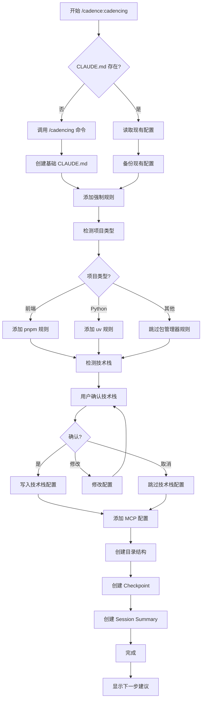

# Skill: /cadence:cadencing - 项目初始化

**版本**: v1.0
**创建日期**: 2026-02-28
**适用范围**: Cadence v2.4+
**Skill 类型**: 入口 Skill（必须加载）

---

## 📋 概述

### 目的
将已有项目初始化为 Cadence 管理的项目，自动配置项目环境、规则、文档结构和技术栈。

### 触发方式
- **命令调用**: `/cadence:cadencing`
- **触发词**: `init`、`初始化`、`initialize`、`项目初始化`

### 使用场景
- ✅ 已有项目需要引入 Cadence 工作流
- ✅ 新项目需要标准化配置
- ✅ 项目重构需要规范化管理
- ✅ 团队协作需要统一标准

---

## 🎯 核心功能

### 功能清单

| 序号 | 功能模块 | 说明 | 必需性 |
|------|---------|------|--------|
| 1 | Claude Code 初始化 | 调用 `/init` 命令 | ✅ 必须 |
| 2 | 语言规则配置 | 强制中文回答 | ✅ 必须 |
| 3 | 文档存储规则 | 配置 `.claude` 目录结构 | ✅ 必须 |
| 4 | 文档命名规范 | 标准化命名格式 | ✅ 必须 |
| 5 | 包管理器规则 | 前端 pnpm / Python uv | ⭐ 推荐 |
| 6 | Time MCP 规则 | 强制使用 time MCP 获取日期 | ✅ 必须 |
| 7 | 技术栈配置 | 生成 tech_stack 配置 | ✅ 必须 |
| 8 | MCP 配置 | 添加 time 和 serena MCP | ✅ 必须 |
| 9 | 目录结构创建 | 创建必要的目录结构 | ✅ 必须 |
| 10 | CLAUDE.md 中文化 | 使用中文重写 CLAUDE.md | ⭐ 推荐 |
| 11 | 项目类型检测 | 检测前端/后端/全栈 | ✅ 必须 |
| 12 | 进度追踪初始化 | 创建初始 checkpoint | ⭐ 推荐 |

---

## 🔧 详细设计

### 1. Claude Code 初始化

**动作**：调用 Claude Code 的 `/init` 命令

**目的**：初始化 Claude Code 基础配置

**执行逻辑**：
```
调用 /cadencing 命令
↓
等待初始化完成
↓
验证 CLAUDE.md 文件是否存在
```

**验证标准**：
- ✅ CLAUDE.md 文件已创建
- ✅ 基础配置已生成

---

### 2. 语言规则配置

**动作**：在 CLAUDE.md 中增加强制中文回答规则

**规则内容**：
```markdown
## 强制规则

> **🔴 必须遵守 - 无例外**

### 1. 语言规则

- **必须使用中文回答** - 所有响应、解释、注释和文档必须使用中文。代码本身可以使用英文（变量名、函数名等），但所有与用户的交互必须使用中文。
```

**插入位置**：CLAUDE.md 文件的 `## 强制规则` 部分

**验证标准**：
- ✅ 规则已添加
- ✅ 规则格式正确
- ✅ 规则位置正确

---

### 3. 文档存储规则

**动作**：配置 `.claude` 目录结构规则

**规则内容**：
```markdown
### 2. 文档存储规则

> **所有文档必须存放在 `.claude` 目录下，禁止在项目根目录或其他位置创建文档文件。**

#### 文档分类存储规范

| 文档类型 | 存储路径 | 说明 |
|---------|---------|------|
| 需求文档 | `.claude/docs/` | PRD、产品需求、业务需求 |
| 方案设计 | `.claude/designs/` | 技术方案、架构设计、API设计 |
| README文档 | `.claude/readmes/` | 项目说明、安装指南、使用文档 |
| 页面原型 | `.claude/modao/` | 墨刀/Figma 原型截图、设计稿 |
| 数据模型 | `.claude/model/` | 数据库表模型、ER图、schema |
| 架构文档 | `.claude/architecture/` | 系统架构分析、技术选型 |
| 开发笔记 | `.claude/notes/` | 临时记录、开发心得、TODO |
| 分析报告 | `.claude/analysis/` | 代码分析、调研报告、性能分析 |
| 开发日志 | `.claude/logs/` | 问题追踪、Bug记录、开发进度 |

#### 路径映射（跨平台）

根据当前系统自动适配：

| 系统 | 完整路径示例 |
|------|-------------|
| **macOS** | `/Users/{username}/projects/myproject/.claude/docs/` |
| **Linux** | `/home/{username}/projects/myproject/.claude/docs/` |
| **Windows** | `C:\Users\{username}\projects\myproject\.claude\docs\` |

> **注意**：在 Claude Code 中使用相对路径 `.claude/` 即可，系统会自动解析。

#### 禁止行为

❌ **禁止** 在以下位置创建文档：
- 项目根目录 (`/README.md` 除外的其他 .md 文件)
- `docs/` 目录
- `documents/` 目录
- `files/` 目录
- 任何其他非 `.claude` 的目录

❌ **禁止** 创建分散的文档文件，必须统一放在 `.claude/` 下的对应子目录。
```

**插入位置**：CLAUDE.md 文件的 `## 强制规则` 部分

**验证标准**：
- ✅ 规则已添加
- ✅ 包含所有文档类型
- ✅ 包含跨平台路径映射
- ✅ 包含禁止行为说明

---

### 4. 文档命名规范

**动作**：配置文档命名规范规则

**规则内容**：
```markdown
#### 文档命名规范

> **🔴 强制规则 - 必须遵守**

##### 标准格式

```
YYYY-MM-DD_文档类型_文档名称_v版本号.扩展名
```

##### Plan 文档格式

```
YYYY-MM-DD_计划文档_计划类型_具体内容_v版本号.md
```

##### 临时笔记格式

```
YYYY-MM-DD_简短描述.md
```

##### 示例

```
# 普通文档
2025-12-03_技术方案_用户认证_v1.0.md
2025-11-15_需求文档_订单管理_v2.0.md
2025-10-20_分析报告_性能优化_v1.0.pdf

# Plan 文档
2025-12-03_计划文档_项目开发_用户认证模块_v1.0.md
2025-12-01_计划文档_版本发布_v2.0.0发布计划.md

# 临时笔记
2025-12-03_当前任务.md
2025-11-30_调试记录.md
```

##### 命名规则

| 元素 | 规则 |
|------|------|
| 日期 | `YYYY-MM-DD` 格式，必须使用阿拉伯数字 |
| 文档类型 | 中文描述，如：`技术方案`、`需求文档`、`分析报告`、`计划文档` |
| 版本号 | `vX.Y` 格式，初版为 `v1.0`，更新为 `v1.1`、`v2.0` 等 |
| 扩展名 | 根据实际类型：`.md`、`.pdf`、`.png` 等 |
| 分隔符 | 使用 `_` 下划线连接各部分，`.` 用于扩展名 |

##### 版本号规则

- **首次创建**：`v1.0`
- **小更新**（错别字、格式调整）：`v1.1`、`v1.2`
- **重大更新**（内容大幅修改）：`v2.0`、`v3.0`

##### 检查清单

在创建任何文档前，必须确认：
- [ ] 文件名符合 `YYYY-MM-DD_类型_名称_v版本.扩展名` 格式
- [ ] 日期使用当日日期（使用 time MCP 获取）
- [ ] 版本号正确（首次为 v1.0）
- [ ] 文档存放在 `.claude/` 对应子目录
```

**插入位置**：CLAUDE.md 文件的 `### 文档命名规范` 部分

**验证标准**：
- ✅ 规则已添加
- ✅ 包含所有格式说明
- ✅ 包含示例
- ✅ 包含版本号规则
- ✅ 包含检查清单

---

### 5. 包管理器规则

**动作**：根据项目类型添加包管理器强制规则

#### 5.1 前端项目规则

**检测条件**：
- 存在 `package.json` 文件
- 存在 `node_modules` 目录
- 存在前端框架文件（如 `vite.config.js`、`next.config.js` 等）

**规则内容**：
```markdown
### 3. 前端项目规则

> **🔴 必须遵守 - 无例外**

#### 包管理器

- **必须使用 pnpm 作为包管理工具** - 禁止使用 npm 或 yarn
- 安装依赖：`pnpm install`
- 添加依赖：`pnpm add <package>`
- 添加开发依赖：`pnpm add -D <package>`
- 运行脚本：`pnpm <script>`
```

#### 5.2 Python 项目规则

**检测条件**：
- 存在 `requirements.txt` 文件
- 存在 `pyproject.toml` 文件
- 存在 `setup.py` 文件
- 存在 `.py` 文件

**规则内容**：
```markdown
### 3. Python 项目规则

> **🔴 必须遵守 - 无例外**

#### 包管理器

- **必须使用 uv 作为包管理工具** - 禁止使用 pip 直接安装
- 安装依赖：`uv pip install -r requirements.txt`
- 添加依赖：`uv pip add <package>`
- 创建虚拟环境：`uv venv`
- 同步依赖：`uv pip sync`
```

**验证标准**：
- ✅ 项目类型已正确检测
- ✅ 对应规则已添加
- ✅ 规则格式正确

---

### 6. Time MCP 规则

**动作**：添加强制使用 time MCP 获取日期的规则

**规则内容**：
```markdown
### 4. 时间获取规则

> **🔴 必须遵守 - 无例外**

#### 日期获取

- **必须使用 time MCP 获取当前日期** - 禁止手动输入日期或使用其他方式获取
- 在创建文档时，必须先调用 time MCP 获取当前日期
- 在命名文件时，必须使用 time MCP 返回的日期
```

**插入位置**：CLAUDE.md 文件的 `## 强制规则` 部分

**验证标准**：
- ✅ 规则已添加
- ✅ 规则清晰明确
- ✅ 禁止行为已说明

---

### 7. 技术栈配置

**动作**：检测项目技术栈并生成 tech_stack 配置

#### 7.1 技术栈检测逻辑

**检测流程**：
```
1. 检测项目文件
   ├── package.json → JavaScript/TypeScript
   ├── requirements.txt / pyproject.toml → Python
   ├── pom.xml / build.gradle → Java
   ├── go.mod → Go
   └── Cargo.toml → Rust

2. 检测测试命令
   ├── JavaScript: npm test / pnpm test
   ├── Python: pytest tests/
   ├── Java: mvn test / ./gradlew test
   ├── Go: go test ./...
   └── Rust: cargo test

3. 检测 Lint 命令
   ├── JavaScript: npm run lint / pnpm lint
   ├── Python: flake8 / pylint
   ├── Java: mvn checkstyle:check
   ├── Go: golint
   └── Rust: cargo clippy

4. 检测 Format 命令
   ├── JavaScript: npm run format / pnpm format
   ├── Python: black / autopep8
   ├── Java: mvn spotless:apply
   ├── Go: gofmt
   └── Rust: cargo fmt

5. 询问用户确认
   └── 展示检测结果，要求用户确认或修改
```

#### 7.2 配置模板

**JavaScript/TypeScript 项目**：
```yaml
## Tech Stack

project_tech_stack:
  language: "typescript"  # 或 "javascript"
  test_command: "pnpm test"
  test_coverage_command: "pnpm run test:coverage"
  lint_command: "pnpm run lint"
  lint_check_command: "pnpm run lint:check"
  format_command: "pnpm run format"
  format_check_command: "pnpm run format:check"
  coverage_threshold: 80
```

**Python 项目**：
```yaml
## Tech Stack

project_tech_stack:
  language: "python"
  test_command: "pytest tests/"
  test_coverage_command: "pytest --cov=src --cov-report=term-missing --cov-fail-under=80"
  lint_command: "flake8 src/"
  lint_check_command: "flake8 src/ --exit-zero"
  format_command: "black src/"
  format_check_command: "black --check src/"
  coverage_threshold: 80
```

**Java (Maven) 项目**：
```yaml
## Tech Stack

project_tech_stack:
  language: "java"
  test_command: "mvn test"
  test_coverage_command: "mvn test jacoco:report"
  lint_command: "mvn checkstyle:check"
  format_command: "mvn spotless:apply"
  format_check_command: "mvn spotless:check"
  coverage_threshold: 80
```

**Java (Gradle) 项目**：
```yaml
## Tech Stack

project_tech_stack:
  language: "java"
  test_command: "./gradlew test"
  test_coverage_command: "./gradlew test jacocoTestReport"
  lint_command: "./gradlew checkstyleMain"
  format_command: "./gradlew spotlessApply"
  format_check_command: "./gradlew spotlessCheck"
  coverage_threshold: 80
```

**Go 项目**：
```yaml
## Tech Stack

project_tech_stack:
  language: "go"
  test_command: "go test ./..."
  test_coverage_command: "go test -coverprofile=coverage.out ./... && go tool cover -func=coverage.out"
  lint_command: "golint ./..."
  format_command: "gofmt -w ."
  format_check_command: "gofmt -l ."
  coverage_threshold: 80
```

**Rust 项目**：
```yaml
## Tech Stack

project_tech_stack:
  language: "rust"
  test_command: "cargo test"
  test_coverage_command: "cargo tarpaulin --out Stdout --fail-under 80"
  lint_command: "cargo clippy"
  format_command: "cargo fmt"
  format_check_command: "cargo fmt -- --check"
  coverage_threshold: 80
```

#### 7.3 用户确认流程

```
技术栈检测结果：
- 语言：{language}
- 测试命令：{test_command}
- 覆盖率命令：{test_coverage_command}
- Lint 命令：{lint_command}
- Format 命令：{format_command}
- 覆盖率阈值：80%

是否确认以上配置？
├── ✅ 确认 → 生成配置并写入 CLAUDE.md
├── ✏️ 修改 → 询问需要修改的项
└── ❌ 取消 → 跳过技术栈配置
```

**验证标准**：
- ✅ 技术栈已正确检测
- ✅ 用户已确认配置
- ✅ 配置已写入 CLAUDE.md
- ✅ 配置格式正确

---

### 8. MCP 配置

**动作**：添加 time 和 serena MCP 配置

**配置内容**：
```json
{
  "mcpServers": {
    "time": {
      "command": "uvx",
      "args": ["mcp-server-time"]
    },
    "serena": {
      "command": "uvx",
      "args": ["serena-mcp"]
    }
  }
}
```

**插入位置**：
- Claude Desktop 配置文件（根据操作系统）
- 或项目的 `.claude/settings.local.json` 文件

**跨平台路径**：
- **macOS**: `~/Library/Application Support/Claude/claude_desktop_config.json`
- **Linux**: `~/.config/Claude/claude_desktop_config.json`
- **Windows**: `%APPDATA%\Claude\claude_desktop_config.json`

**验证标准**：
- ✅ MCP 配置已添加
- ✅ 配置格式正确
- ✅ MCP 服务可用

---

### 9. 目录结构创建

**动作**：创建必要的目录结构

**目录清单**：
```
.claude/
├── docs/           # 需求文档
├── designs/        # 方案设计
├── readmes/        # README文档
├── modao/          # 页面原型
├── model/          # 数据模型
├── architecture/   # 架构文档
├── notes/          # 开发笔记
├── analysis/       # 分析报告
└── logs/           # 开发日志
```

**创建逻辑**：
```
1. 检测当前操作系统
2. 确定项目根目录
3. 创建 .claude 目录
4. 创建所有子目录
5. 在每个子目录中创建 .gitkeep 文件（保持目录结构）
```

**验证标准**：
- ✅ 所有目录已创建
- ✅ 目录结构正确
- ✅ .gitkeep 文件已创建

---

### 10. CLAUDE.md 中文化

**动作**：使用中文重写 CLAUDE.md 文件（可选）

**执行条件**：
- 用户明确要求中文化
- 或 CLAUDE.md 文件内容为英文

**重写逻辑**：
```
1. 读取现有 CLAUDE.md 内容
2. 使用 AI 翻译为中文（保留代码块和技术术语）
3. 保留原有配置和规则
4. 添加新的强制规则
5. 写入文件
```

**验证标准**：
- ✅ 文件已翻译为中文
- ✅ 技术术语保持原样
- ✅ 配置和规则完整

---

### 11. 项目类型检测

**动作**：检测项目类型（前端/后端/全栈/其他）

**检测逻辑**：

**前端项目**：
- 存在 `package.json`
- 存在前端框架配置（vite.config.js、next.config.js、vue.config.js 等）
- 存在 `src/` 目录且包含 `.jsx`、`.tsx`、`.vue` 等文件

**后端项目**：
- 存在后端语言文件（`.py`、`.java`、`.go`、`.rs` 等）
- 存在后端框架文件（`app.py`、`main.py`、`Application.java` 等）
- 存在 API 路由定义

**全栈项目**：
- 同时满足前端和后端项目条件
- 存在 `frontend/` 和 `backend/` 目录
- 或 monorepo 结构

**其他项目**：
- 纯文档项目
- 配置项目
- 工具项目

**输出结果**：
```
项目类型检测结果：
- 类型：{frontend|backend|fullstack|other}
- 语言：{language}
- 框架：{framework}
- 包管理器：{package_manager}

是否确认？
├── ✅ 确认 → 继续
└── ✏️ 修改 → 手动指定项目类型
```

**验证标准**：
- ✅ 项目类型已正确检测
- ✅ 用户已确认
- ✅ 检测结果已记录

---

### 12. 进度追踪初始化

**动作**：创建初始 checkpoint 和 session summary

**创建内容**：

**Checkpoint**：
```markdown
# Checkpoint: 项目初始化完成

**创建时间**: {current_time}
**会话ID**: session-{date}-init
**状态**: ✅ 完成

---

## 🎯 会话目标

将项目初始化为 Cadence 管理的项目，配置所有必要的规则和结构。

---

## ✅ 完成的工作

### 1. Claude Code 初始化
- ✅ 调用 /cadencing 命令
- ✅ 创建 CLAUDE.md 文件

### 2. 语言规则配置
- ✅ 添加强制中文回答规则

### 3. 文档存储规则
- ✅ 配置 .claude 目录结构
- ✅ 创建所有子目录

### 4. 文档命名规范
- ✅ 配置标准命名格式
- ✅ 配置 Plan 文档格式
- ✅ 配置临时笔记格式

### 5. 包管理器规则
- ✅ 检测项目类型：{project_type}
- ✅ 添加对应包管理器规则

### 6. Time MCP 规则
- ✅ 添加强制使用 time MCP 规则

### 7. 技术栈配置
- ✅ 检测技术栈
- ✅ 用户确认配置
- ✅ 写入 CLAUDE.md

### 8. MCP 配置
- ✅ 添加 time MCP
- ✅ 添加 serena MCP

### 9. 目录结构创建
- ✅ 创建 .claude 目录
- ✅ 创建 9 个子目录

### 10. 项目类型检测
- ✅ 检测项目类型
- ✅ 用户确认

---

## 📊 配置统计

- **添加规则数**: {rule_count}
- **创建目录数**: {dir_count}
- **配置 MCP 数**: 2
- **项目类型**: {project_type}
- **技术栈**: {language}

---

## 🚀 下一步

项目初始化完成，可以开始使用 Cadence 工作流：

1. **快速开始**: 使用 `/cadence:quick-flow` 进行快速开发
2. **完整流程**: 使用 `/cadence:full-flow` 进行完整开发
3. **技术探索**: 使用 `/cadence:exploration-flow` 进行技术探索
4. **查看状态**: 使用 `/cadence:status` 查看项目状态

---

**Checkpoint创建时间**: {current_time}
**验证状态**: ✅ 完成
**可恢复**: ✅ 是
```

**Session Summary**：
```markdown
# 会话总结：项目初始化

## 会话概览
- **日期**: {date}
- **任务**: 将项目初始化为 Cadence 管理的项目
- **状态**: ✅ 完成

---

## 🎯 核心成果

### 1. 项目环境配置
- ✅ 配置 Claude Code 环境
- ✅ 添加强制规则（中文回答、文档存储、命名规范）
- ✅ 配置包管理器规则
- ✅ 配置 Time MCP 规则

### 2. 技术栈配置
- ✅ 检测项目类型：{project_type}
- ✅ 检测技术栈：{language}
- ✅ 生成 tech_stack 配置
- ✅ 用户确认并写入

### 3. MCP 配置
- ✅ 添加 time MCP
- ✅ 添加 serena MCP

### 4. 目录结构
- ✅ 创建 .claude 目录
- ✅ 创建 9 个子目录
- ✅ 创建 .gitkeep 文件

---

## 📝 配置详情

### 项目信息
- **项目类型**: {project_type}
- **编程语言**: {language}
- **包管理器**: {package_manager}
- **测试命令**: {test_command}
- **覆盖率阈值**: 80%

### 规则清单
1. 语言规则：强制中文回答
2. 文档存储规则：.claude 目录
3. 文档命名规范：YYYY-MM-DD_类型_名称_v版本
4. 包管理器规则：{package_manager}
5. Time MCP 规则：强制使用 time MCP

---

## 🔄 恢复信息

### 如需恢复此会话
```
读取记忆: session-{date}-init
读取检查点: checkpoint-{date}-init
```

---

**会话完成时间**: {current_time}
**配置状态**: ✅ 完成
```

**保存位置**：
- Checkpoint: Serena MCP memory (`checkpoint-{date}-init`)
- Session Summary: Serena MCP memory (`session-{date}-init`)

**验证标准**：
- ✅ Checkpoint 已创建
- ✅ Session Summary 已创建
- ✅ 内容完整准确

---

## 🔄 执行流程

### 完整流程



### 简化流程

```
1. 调用 /init
2. 添加强制规则（语言、文档存储、命名规范）
3. 检测项目类型 → 添加包管理器规则
4. 检测技术栈 → 用户确认 → 写入配置
5. 添加 MCP 配置（time、serena）
6. 创建目录结构
7. 创建 Checkpoint 和 Session Summary
8. 完成
```

---

## 📋 输入输出

### 输入

| 参数 | 类型 | 必需 | 说明 |
|------|------|------|------|
| `--skip-cadencing` | flag | 否 | 跳过 /cadencing 命令调用 |
| `--skip-tech-stack` | flag | 否 | 跳过技术栈检测和配置 |
| `--skip-mcp` | flag | 否 | 跳过 MCP 配置 |
| `--chinese` | flag | 否 | 强制中文化 CLAUDE.md |
| `--project-type` | string | 否 | 手动指定项目类型（frontend/backend/fullstack/other） |

### 输出

**成功输出**：
```
✅ 项目初始化完成！

## 配置摘要

- **项目类型**: {project_type}
- **编程语言**: {language}
- **包管理器**: {package_manager}

## 已完成的配置

1. ✅ Claude Code 基础初始化
2. ✅ 强制规则配置（中文回答、文档存储、命名规范）
3. ✅ 包管理器规则（{package_manager}）
4. ✅ Time MCP 规则
5. ✅ 技术栈配置
6. ✅ MCP 配置（time、serena）
7. ✅ 目录结构创建
8. ✅ 进度追踪初始化

## 下一步建议

1. **快速开始**: 使用 `/cadence:quick-flow` 进行快速开发
2. **完整流程**: 使用 `/cadence:full-flow` 进行完整开发
3. **技术探索**: 使用 `/cadence:exploration-flow` 进行技术探索
4. **查看状态**: 使用 `/cadence:status` 查看项目状态

## 查看配置

- 配置文件: `CLAUDE.md`
- 目录结构: `.claude/`
- Checkpoint: `checkpoint-{date}-init`
```

**失败输出**：
```
❌ 项目初始化失败

## 错误信息

{error_message}

## 失败步骤

{failed_step}

## 建议

{suggestion}

## 重试

请修复上述问题后，重新运行 `/cadence:cadencing`
```

---

## ⚠️ 注意事项

### 重要提醒

1. **备份现有配置**
   - 如果 CLAUDE.md 已存在，建议备份
   - 询问用户是否覆盖现有配置

2. **用户确认是必须的**
   - 技术栈检测必须用户确认
   - 项目类型检测必须用户确认
   - 不能自动跳过用户确认

3. **跨平台兼容性**
   - 路径分隔符必须根据操作系统调整
   - 命令必须根据操作系统调整（如 `./gradlew` vs `gradlew.bat`）

4. **错误处理**
   - 每个步骤都要有错误处理
   - 提供清晰的错误信息
   - 提供修复建议

5. **幂等性**
   - 重复执行 `/cadence:cadencing` 应该是安全的
   - 不应该重复添加已存在的配置
   - 应该检测并跳过已完成的步骤

### 常见问题

**Q1: CLAUDE.md 已存在，是否覆盖？**
```
A: 询问用户选择：
- 覆盖现有配置
- 合并配置（保留现有内容，添加新规则）
- 取消初始化
```

**Q2: 技术栈检测不准确怎么办？**
```
A: 提供手动指定选项：
- 使用 `--project-type` 参数手动指定
- 在确认环节选择"修改"
- 稍后手动编辑 CLAUDE.md
```

**Q3: MCP 配置失败怎么办？**
```
A: 提供手动配置指南：
- 显示配置内容
- 显示配置文件路径
- 提供手动配置步骤
```

**Q4: 项目类型检测失败怎么办？**
```
A: 默认为"other"类型：
- 跳过包管理器规则
- 询问用户手动指定
- 提供配置模板
```

---

## 📚 相关文档

- **主方案文档**: [2026-02-25_技术方案_使用Claude_Code_Skills的AI自动化开发方案_v2.4.md](./2026-02-25_技术方案_使用Claude_Code_Skills的AI自动化开发方案_v2.4.md)
- **技术栈配置**: [cadence-skills/patterns/tech-stack-configuration](../memory/cadence-skills/patterns/tech-stack-configuration)
- **进度追踪**: [2026-02-26_进度追踪与状态管理_v1.0.md](./2026-02-26_进度追踪与状态管理_v1.0.md)

---

## 🔄 版本历史

| 版本 | 日期 | 变更内容 |
|------|------|---------|
| v1.0 | 2026-02-28 | 初始版本，包含 12 个核心功能 |

---

**文档状态**: ✅ 完成
**验证状态**: ⏳ 待验证
**实现状态**: ⏳ 待实现
