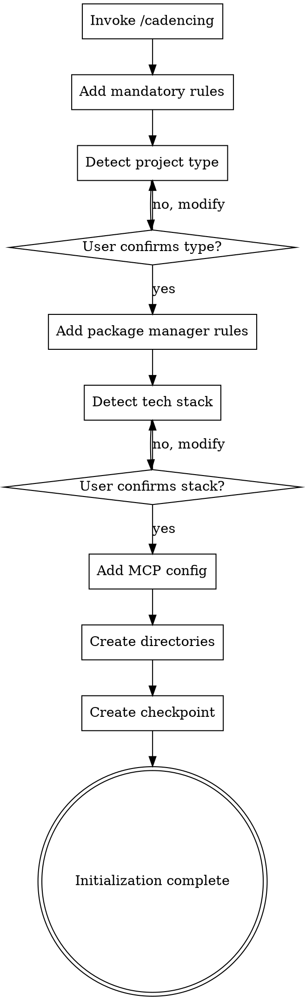

# Skill: /cadence:cadencing - 项目初始化

**版本**: v1.1
**创建日期**: 2026-02-28
**更新日期**: 2026-03-01
**适用范围**: Cadence v2.4+
**Skill 类型**: 节点 Skill（项目初始化）
**实现状态**: ✅ 已实现并测试完成

---

## 📋 概述

### 目的
将已有项目初始化为 Cadence 管理的项目，自动配置项目环境、规则、文档结构和技术栈。

### 触发方式
- **命令调用**: `/cadence:cadencing`
- **Skill 工具**: `cadence:cadencing`
- **触发词**: `初始化`、`项目初始化`、`cadencing`

### 使用场景
- ✅ 已有项目需要引入 Cadence 工作流
- ✅ 新项目需要标准化配置
- ✅ 项目重构需要规范化管理
- ✅ 团队协作需要统一标准

---

## 🎯 核心功能

### Checklist（必须完成）

1. **Claude Code 初始化** — invoke `/cadencing` command, verify CLAUDE.md created
2. **Add language rules** — configure mandatory Chinese responses
3. **Add documentation rules** — configure `.claude` directory structure and naming conventions
4. **Detect project type** — identify frontend/backend/fullstack, get user confirmation
5. **Add package manager rules** — pnpm for frontend, uv for Python (if applicable)
6. **Add Time MCP rules** — mandatory use of time MCP for date retrieval
7. **Detect tech stack** — auto-detect language, test/lint/format commands, get user confirmation
8. **Add MCP configuration** — configure time and serena MCP servers
9. **Create directory structure** — create `.claude/` subdirectories
10. **Initialize progress tracking** — create checkpoint and session summary

---

## 🔄 执行流程



**The terminal state is initialization complete.** Present a summary of what was configured and suggest next steps (quick-flow, full-flow, or exploration-flow).

---

## 🔧 详细配置

### 强制规则配置

**语言规则**:
- Add language rule: must respond in Chinese
- Add documentation storage rule: all docs in `.claude/` directory
- Add documentation naming rule: `YYYY-MM-DD_类型_名称_v版本.扩展名`
- Add Time MCP rule: must use time MCP for date retrieval

### 项目类型检测

**检测逻辑**:
- Frontend: `package.json` + frontend framework config
- Backend: backend language files + framework
- Fullstack: both frontend and backend
- Other: documentation, config, or tool projects
- Always get user confirmation before proceeding

### 技术栈检测

**支持的语言**:
- Language: JavaScript/TypeScript, Python, Java, Go, Rust
- Test command: `pnpm test`, `pytest tests/`, `mvn test`, etc.
- Lint command: `pnpm lint`, `flake8`, `mvn checkstyle:check`, etc.
- Format command: `pnpm format`, `black`, `mvn spotless:apply`, etc.
- Coverage threshold: 80% (configurable)
- Always get user confirmation before writing to CLAUDE.md

### MCP 配置

**配置内容**:
- Add time MCP: `uvx mcp-server-time`
- Add serena MCP: `uvx serena-mcp`
- Configure in `.claude/settings.local.json` or Claude Desktop config

### 目录结构创建

```
.claude/
├── docs/           # Requirements documents
├── designs/        # Design documents
├── readmes/        # README documents
├── modao/          # UI prototypes
├── model/          # Data models
├── architecture/   # Architecture docs
├── notes/          # Development notes
├── analysis/       # Analysis reports
└── logs/           # Development logs
```

---

## 📊 输出示例

### 成功输出

```
✅ 项目初始化完成！

## 配置摘要

- **项目类型**: {project_type}
- **编程语言**: {language}
- **包管理器**: {package_manager}

## 已完成的配置

1. ✅ Claude Code 基础初始化
2. ✅ 强制规则配置（中文回答、文档存储、命名规范）
3. ✅ 包管理器规则（{package_manager}）
4. ✅ Time MCP 规则
5. ✅ 技术栈配置
6. ✅ MCP 配置（time、serena）
7. ✅ 目录结构创建
8. ✅ 进度追踪初始化

## 下一步建议

1. **快速开始**: 使用 `/cadence:quick-flow` 进行快速开发
2. **完整流程**: 使用 `/cadence:full-flow` 进行完整开发
3. **技术探索**: 使用 `/cadence:exploration-flow` 进行技术探索
4. **查看状态**: 使用 `/cadence:status` 查看项目状态
```

---

## ⚠️ 关键原则

- **User confirmation required** — tech stack and project type detection MUST be confirmed
- **Cross-platform compatibility** — adapt paths and commands for macOS/Linux/Windows
- **Idempotent** — repeated execution should be safe and not duplicate configuration
- **Error handling** — each step should have clear error messages and recovery suggestions
- **No skipping** — all checklist items must be completed in order

---

## 🔗 相关文档

- **当前实现**: `skills/cadencing/SKILL.md`
- **主方案文档**: `.claude/designs/2026-02-25_技术方案_使用Claude_Code_Skills的AI自动化开发方案_v2.4.md`
- **技术栈配置**: `.serena/memories/cadence-skills/patterns/tech-stack-configuration.md`
- **进度追踪**: `.claude/designs/2026-02-26_进度追踪与状态管理_v1.0.md`

---

## 📝 版本历史

| 版本 | 日期 | 变更内容 |
|------|------|---------|
| v1.0 | 2026-02-28 | 初始版本，包含 12 个核心功能 |
| v1.1 | 2026-03-01 | 简化为 10 个 checklist，与当前实现保持一致，移除过时内容 |

---

**文档状态**: ✅ 已更新
**验证状态**: ✅ 已测试
**实现状态**: ✅ 已完成
