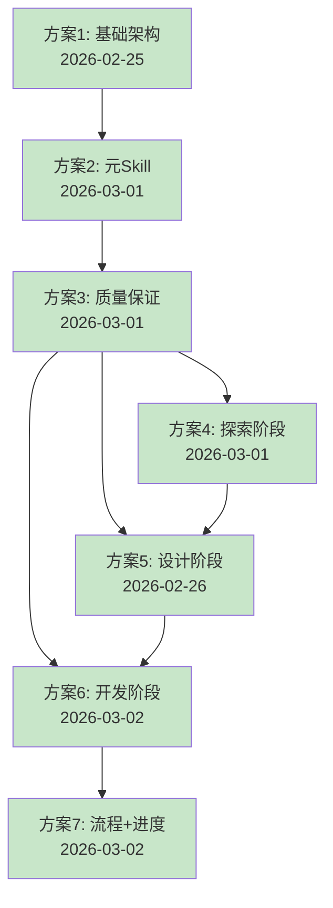

# Cadence-skills v2.4 MVP - 方案实施完成总结

**版本**: v2.0
**创建日期**: 2026-03-01
**完成日期**: 2026-03-02
**总方案数**: 7个
**当前进度**: **7/7 (100%)** ✅

---

## 🎉 v2.4 MVP 已完成

**完成日期**: 2026-03-02
**总工作量**: 约 20 小时（实际）
**Git Commits**: 7个主要提交

---

## 📋 方案总览

| 方案 | 名称 | 核心内容 | 实际工作量 | 状态 | 文档 |
|------|------|---------|-----------|------|------|
| **1** | 基础架构 + 配置 + Hooks | 目录结构、配置文件、SessionStart Hook | 2小时 | ✅ 已完成 | [查看](./方案1_基础架构_配置_Hooks.md) |
| **2** | 元 Skill + Init Skill | using-cadence、cadencing、cad-load | 2.5小时 | ✅ 已完成 | [查看](./方案2_元Skill_InitSkill.md) |
| **3** | 质量保证 Skills | 5个质量保证Skills（TDD、代码审查等） | 2小时 | ✅ 已完成 | [查看](./方案3_前置Skill_支持Skill.md) |
| **4** | 节点 Skill 第1组 | Brainstorm、Analyze、Requirement | 3小时 | ✅ 已完成 | [查看](./方案4_节点Skill_第1组.md) |
| **5** | 节点 Skill 第2组 | Design、Design Review、Plan | 3小时 | ✅ 已完成 | [查看](./方案5_节点Skill_第2组.md) |
| **6** | 节点 Skill 第3组 | Git Worktrees、Subagent Development | 3.5小时 | ✅ 已完成 | [查看](./方案6_节点Skill_第3组.md) |
| **7** | 流程 Skill + 进度追踪 | 3个流程 + 5个进度命令 | 4小时 | ✅ 已完成 | [查看](./方案7_流程Skill_进度追踪.md) |

**总实际工作量**: 约 20 小时

---

## 🎯 方案完成时间线



**说明**：
- ✅ 绿色：已完成（全部）

---

## 📦 已完成方案详情（7/7）

### 方案1：基础架构 + 配置 + Hooks ✅

**完成日期**: 2026-03-01
**Git Commit**: 不适用（配置文件）

**核心产出**：
- ✅ 7个目录（.claude-plugin/, skills/, agents/, commands/, hooks/, docs/, tests/）
- ✅ 2个配置文件（plugin.json, marketplace.json）
- ✅ 1个 Hook 配置（hooks.json）
- ✅ 1个 Hook 脚本（session-start）
- ✅ 1个文档（hooks-reference.md）

**实施文件**：[方案1_基础架构_配置_Hooks.md](./方案1_基础架构_配置_Hooks.md)

---

### 方案2：元 Skill + Init Skill ✅

**完成日期**: 2026-03-01
**Git Commit**: 不适用（设计阶段）

**核心产出**：
- ✅ 3个元 Skills（using-cadence, cadencing, cad-load）
- ✅ 3个 Command 映射（cadencing.md, cad-load.md）
- ✅ 1个说明文档（skills/README.md）

**实施文件**：
- [方案2_元Skill_InitSkill.md](./方案2_元Skill_InitSkill.md)
- [using-cadence Skill](./skills/using-cadence/SKILL.md)
- [cadencing Skill](./skills/cadencing/SKILL.md)
- [cad-load Skill](./skills/cad-load/SKILL.md) - 2026-03-02 新增

**新增功能**（2026-03-02）：
- ✅ **cad-load skill** - 项目上下文加载（替代 SuperClaude /sc:load）
- ✅ 三种加载模式（quick/standard/full）
- ✅ 记忆优先级系统（P0/P1/P2）
- ✅ 自动 Git 状态检查

---

### 方案3：质量保证 Skills ✅

**完成日期**: 2026-03-01
**Git Commit**: 6002c8c

**核心产出**：
- ✅ 5个质量保证 Skills（直接复制自 superpowers）
  - test-driven-development（371行）
  - requesting-code-review（105行）
  - receiving-code-review（213行）
  - verification-before-completion（139行）
  - finishing-a-development-branch（144行）
- ✅ 5个 Commands（/tdd, /request-review, /receive-review, /verify, /finish）

**实施文件**：[方案3_前置Skill_支持Skill.md](./方案3_前置Skill_支持Skill.md)

---

### 方案4：节点 Skill 第1组（探索阶段）✅

**完成日期**: 2026-03-01
**Git Commit**: 50da68d

**核心产出**：
- ✅ 3个节点 Skills
  - brainstorming（96行）- 来自 superpowers
  - analyze（495行）- Serena MCP 集成
  - requirement（746行）- 支持存量复用
- ✅ 3个 Commands（/brainstorm, /analyze, /requirement）

**实施文件**：[方案4_节点Skill_第1组.md](./方案4_节点Skill_第1组.md)

**关键特性**：
- Brainstorming: Socratic 对话、系统探索
- Analyze: Serena MCP 集成、代码库分析
- Requirement: 支持存量复用、验收标准推导

---

### 方案5：节点 Skill 第2组（设计阶段）✅

**完成日期**: 2026-02-26
**Git Commit**: 8921df2

**核心产出**：
- ✅ 3个节点 Skills
  - design（约 20KB）- 支持带着审查报告重新设计
  - design-review（约 15KB）- 8维度系统性审查
  - plan（约 12KB）- 支持CLAUDE.md技术栈配置读取
- ✅ 3个 Commands（/design, /design-review, /plan）

**实施文件**：[方案5_节点Skill_第2组.md](./方案5_节点Skill_第2组.md)

**关键特性**：
- Design: 审查报告反馈、技术方案设计
- Design Review: P0/P1/P2 问题分级、8个审查维度
- Plan: 任务分解、并行识别、时间估计

---

### 方案6：节点 Skill 第3组（开发阶段）✅

**完成日期**: 2026-03-02
**Git Commit**: 124f631

**核心产出**：
- ✅ 2个核心 Skills
  - using-git-worktrees（8.4KB）- 智能目录选择、安全验证
  - subagent-development（14KB）- 两阶段审查、TDD强制执行
- ✅ 3个 Subagent Prompts
  - implementer-prompt（2.9KB）- 代码实现
  - spec-reviewer-prompt（2.7KB）- 规范审查
  - code-quality-reviewer-prompt（4.1KB）- 代码质量审查
- ✅ 2个 Commands（/worktree, /develop）

**实施文件**：[方案6_节点Skill_第3组.md](./方案6_节点Skill_第3组.md)

**关键特性**：
- Git Worktrees: 智能目录选择、环境隔离
- Subagent Development: 两阶段审查、TDD强制执行
- 测试覆盖率标准: P0 ≥ 80%、P1 ≥ 70%、P2 ≥ 60%

---

### 方案7：流程 Skill + 进度追踪 ✅

**完成日期**: 2026-03-02
**Git Commit**: 2f1b155

**核心产出**：
- ✅ 3个流程 Skills
  - full-flow（约 20KB）- 完整流程（8节点）
  - quick-flow（约 13KB）- 快速流程（4节点）
  - exploration-flow（约 16KB）- 探索流程（4节点+迭代）
- ✅ 5个进度追踪 Commands
  - /status - 查看进度
  - /resume - 恢复进度
  - /checkpoint - 创建检查点
  - /report - 生成报告
  - /monitor - 实时监控

**实施文件**：[方案7_流程Skill_进度追踪.md](./方案7_流程Skill_进度追踪.md)

**关键特性**：
- 三种流程模式：完整、快速、探索
- 进度追踪系统：Serena memory 持久化
- 多种恢复策略：正常中断、异常中断、任务失败
- 实时监控：5秒刷新、关键指标

---

## 📊 v2.4 MVP 统计数据

### Skills 统计（19个）

#### 1. 元 Skills（3个）
- ✅ using-cadence - Cadence 工作流入口
- ✅ cadencing - Cadence 工作流编排
- ✅ cad-load - 项目上下文加载

#### 2. 核心节点 Skills（8个）
- ✅ brainstorming - 需求探索
- ✅ analyze - 存量分析
- ✅ requirement - 需求分析
- ✅ design - 技术设计
- ✅ design-review - 设计审查
- ✅ plan - 实现计划
- ✅ using-git-worktrees - 创建隔离环境
- ✅ subagent-development - 代码实现+单元测试

#### 3. 流程 Skills（3个）
- ✅ full-flow - 完整流程（8节点）
- ✅ quick-flow - 快速流程（4节点）
- ✅ exploration-flow - 探索流程（4节点+迭代）

#### 4. 质量保证 Skills（5个）
- ✅ test-driven-development - TDD 强制执行
- ✅ requesting-code-review - 请求代码审查
- ✅ receiving-code-review - 接收代码审查
- ✅ verification-before-completion - 完成前验证
- ✅ finishing-a-development-branch - 完成开发分支

### Commands 统计（19个）

#### 1. 元 Commands（2个）
- `/cadencing` - Cadence 工作流编排
- `/cad-load` - 项目上下文加载

#### 2. 节点 Commands（8个）
- `/brainstorm` - 需求探索
- `/analyze` - 存量分析
- `/requirement` - 需求分析
- `/design` - 技术设计
- `/design-review` - 设计审查
- `/plan` - 实现计划
- `/worktree` - 创建隔离环境
- `/develop` - 代码实现

#### 3. 流程 Commands（5个）
- `/status` - 查看进度
- `/resume` - 恢复进度
- `/checkpoint` - 创建检查点
- `/report` - 生成报告
- `/monitor` - 实时监控

#### 4. 质量保证 Commands（4个）
- `/tdd` - TDD 强制执行
- `/request-review` - 请求代码审查
- `/receive-review` - 接收代码审查
- `/verify` - 完成前验证
- `/finish` - 完成开发分支

### Subagent Prompts（3个）
- ✅ implementer-prompt (8.1) - 代码实现
- ✅ spec-reviewer-prompt (8.2) - 规范审查
- ✅ code-quality-reviewer-prompt (8.3) - 代码质量审查

### 代码统计
- **总文件数**: 约 50 个文件
- **总代码量**: 约 150KB
- **Git Commits**: 7 个主要提交

---

## 🎯 v2.4 MVP 核心特性

### 1. 完整的开发流程（8个节点）
- ✅ Brainstorm - 需求探索
- ✅ Analyze - 存量分析
- ✅ Requirement - 需求分析
- ✅ Design - 技术设计
- ✅ Design Review - 设计审查
- ✅ Plan - 实现计划
- ✅ Git Worktrees - 隔离环境
- ✅ Subagent Development - 代码实现+单元测试

### 2. 三种流程模式
- **Full Flow** (8节点): 复杂功能开发、团队协作、企业级应用
- **Quick Flow** (4节点): 简单功能开发、Bug修复、原型验证
- **Exploration Flow** (4节点+迭代): 技术调研、POC验证、创新功能

### 3. 两阶段审查机制
- **Spec Reviewer** (8.2): 验证规范符合性（4个维度）
- **Code Quality Reviewer** (8.3): 验证代码质量（5个维度）
- **TDD 强制执行**: 测试覆盖率 ≥ 80%

### 4. 进度追踪系统
- **Serena Memory**: 跨会话持久化
- **自动检查点**: 节点完成、任务完成、失败场景
- **多种恢复策略**: 正常中断、异常中断、任务失败

### 5. 项目上下文管理
- **cad-load skill**: 替代 SuperClaude /sc:load
- **三种加载模式**: quick/standard/full
- **记忆优先级系统**: P0/P1/P2

---

## 📈 进度追踪

### 整体进度

```
v2.4 MVP: 7/7 (100%) ✅

✅✅✅✅✅✅✅
```

### 详细进度

| 阶段 | 方案 | 状态 | 完成日期 | Git Commit |
|------|------|------|---------|-----------|
| 基础设施 | 方案1 | ✅ 已完成 | 2026-03-01 | 配置文件 |
| 基础设施 | 方案2 | ✅ 已完成 | 2026-03-01 | 设计阶段 |
| 质量保证 | 方案3 | ✅ 已完成 | 2026-03-01 | 6002c8c |
| 核心节点 | 方案4 | ✅ 已完成 | 2026-03-01 | 50da68d |
| 核心节点 | 方案5 | ✅ 已完成 | 2026-02-26 | 8921df2 |
| 核心节点 | 方案6 | ✅ 已完成 | 2026-03-02 | 124f631 |
| 流程编排 | 方案7 | ✅ 已完成 | 2026-03-02 | 2f1b155 |

**🎉 v2.4 MVP 已完成！** (2026-03-02)

---

## 🚀 未来版本规划

### v2.4 MVP (当前版本) ✅

**范围**: 4.1-4.8 节点（8个核心节点）
- ✅ Brainstorm - 需求探索
- ✅ Analyze - 存量分析
- ✅ Requirement - 需求分析
- ✅ Design - 技术设计
- ✅ Design Review - 设计审查
- ✅ Plan - 实现计划
- ✅ Git Worktrees - 隔离环境
- ✅ Subagent Development - 代码实现+单元测试

**适用场景**:
- ✅ 个人项目开发
- ✅ 原型开发和POC验证
- ✅ 技术探索和实验
- ✅ 快速迭代的小型功能

**限制说明**:
- ⚠️ 仅包含单元测试（无集成测试）
- ⚠️ 无完整交付流程
- ⚠️ 不适合企业级生产项目

---

### v2.5 (下一版本规划) ⏳

**新增节点**: 4.9-4.10 节点（测试阶段）

#### 4.9 Test Design - 集成测试方案
- **目标**: 设计集成测试方案
- **输入**: 技术方案、单元测试
- **输出**: 集成测试方案文档
- **内容**:
  - 测试环境设计
  - 测试数据准备
  - 测试用例设计
  - 测试脚本规划
  - Mock/Stub 策略

#### 4.10 Integration - 集成测试
- **目标**: 执行集成测试
- **输入**: 集成测试方案、代码实现
- **输出**: 集成测试报告、Bug修复
- **内容**:
  - 测试环境搭建
  - 测试数据准备
  - 测试用例执行
  - Bug 修复和验证
  - 测试覆盖率验证

**预估工作量**: 4-6小时

**适用场景**:
- ✅ 企业级应用开发
- ✅ 多系统集成项目
- ✅ 需要质量保证的项目

---

### v2.6+ (未来版本) 📋

**新增节点**: 4.11 节点（交付阶段）

#### 4.11 Deliver - 交付
- **目标**: 完整的交付流程
- **输入**: 集成测试通过的代码
- **输出**: 可部署的产物
- **内容**:
  - 部署准备
  - 环境配置
  - 性能优化
  - 安全检查
  - 文档完善
  - 发布准备

**预估工作量**: 3-5小时

**适用场景**:
- ✅ 生产环境部署
- ✅ 企业级交付流程
- ✅ 完整的端到端流程

---

### 版本演进路线

```
v2.4 MVP (当前) ✅
├── 4.1-4.8 节点 ✅
├── 聚焦：需求 → 设计 → 开发（单元测试）
└── 适用：个人项目、原型开发

v2.5 (下一版本) ⏳
├── 4.1-4.8 节点 ✅
├── 4.9 Test Design ⏳
├── 4.10 Integration ⏳
├── 聚焦：完整的开发+测试流程
└── 适用：企业级应用、多系统集成

v2.6+ (未来) 📋
├── 4.1-4.10 节点 ✅
├── 4.11 Deliver ⏳
├── 聚焦：完整的端到端流程
└── 适用：生产环境部署、企业级交付
```

---

## 📋 下一步行动

### 短期（1-2周）
1. ⏳ **整体测试** - 测试 v2.4 MVP 所有 Skills 和 Commands
2. ⏳ **文档完善** - 补充使用指南和最佳实践
3. ⏳ **发布 v2.4 MVP** - 创建 release notes

### 中期（1-2月）
1. 📋 **v2.5 规划** - 详细设计 Test Design 和 Integration 节点
2. 📋 **v2.5 实施** - 实现 4.9-4.10 节点

### 长期（3-6月）
1. 📋 **v2.6 规划** - 详细设计 Deliver 节点
2. 📋 **v2.6 实施** - 实现 4.11 节点
3. 📋 **性能优化** - 优化 Subagent 执行效率
4. 📋 **工具集成** - 集成更多开发工具

---

## 📂 文件结构

```
.claude/designs/
├── next/                              # 实施方案目录
│   ├── README.md                      # 本文件（v2.0 - 完成总结）
│   ├── 方案1_基础架构_配置_Hooks.md   # ✅ 已完成
│   ├── 方案2_元Skill_InitSkill.md     # ✅ 已完成
│   ├── 方案3_前置Skill_支持Skill.md   # ✅ 已完成
│   ├── 方案4_节点Skill_第1组.md       # ✅ 已完成
│   ├── 方案5_节点Skill_第2组.md       # ✅ 已完成
│   ├── 方案6_节点Skill_第3组.md       # ✅ 已完成
│   ├── 方案7_流程Skill_进度追踪.md    # ✅ 已完成
│   ├── skills/                        # Skill 设计文件
│   │   ├── using-cadence/
│   │   │   └── SKILL.md               # ✅ 已完成
│   │   ├── cadencing/
│   │   │   └── SKILL.md               # ✅ 已完成
│   │   ├── cad-load/
│   │   │   └── SKILL.md               # ✅ 已完成（2026-03-02 新增）
│   │   └── README.md                  # ✅ 已完成
│   └── commands/
│       ├── cadencing.md               # ✅ 已完成
│       └── cad-load.md                # ✅ 已完成
└── (其他设计文档)

skills/                                # 实施后的 Skills 目录
├── using-cadence/SKILL.md             # ✅ 元 Skill
├── cadencing/SKILL.md                 # ✅ 流程编排
├── cad-load/SKILL.md                  # ✅ 上下文加载（2026-03-02 新增）
├── brainstorming/SKILL.md             # ✅ 需求探索
├── analyze/SKILL.md                   # ✅ 存量分析
├── requirement/SKILL.md               # ✅ 需求分析
├── design/SKILL.md                    # ✅ 技术设计
├── design-review/SKILL.md             # ✅ 设计审查
├── plan/SKILL.md                      # ✅ 实现计划
├── using-git-worktrees/SKILL.md       # ✅ 隔离环境
├── subagent-development/SKILL.md      # ✅ 代码实现
│   └── prompts/                       # Subagent Prompts
│       ├── implementer-prompt.md      # ✅ 代码实现
│       ├── spec-reviewer-prompt.md    # ✅ 规范审查
│       └── code-quality-reviewer-prompt.md  # ✅ 质量审查
├── full-flow/SKILL.md                 # ✅ 完整流程
├── quick-flow/SKILL.md                # ✅ 快速流程
├── exploration-flow/SKILL.md          # ✅ 探索流程
└── (5个质量保证 Skills)               # ✅ TDD、代码审查等

commands/                              # 实施后的 Commands 目录
├── cadencing.md                       # ✅ 流程编排
├── cad-load.md                        # ✅ 上下文加载（2026-03-02 新增）
├── brainstorm.md                      # ✅ 需求探索
├── analyze.md                         # ✅ 存量分析
├── requirement.md                     # ✅ 需求分析
├── design.md                          # ✅ 技术设计
├── design-review.md                   # ✅ 设计审查
├── plan.md                            # ✅ 实现计划
├── worktree.md                        # ✅ 隔离环境
├── develop.md                         # ✅ 代码实现
├── status.md                          # ✅ 查看进度
├── resume.md                          # ✅ 恢复进度
├── checkpoint.md                      # ✅ 创建检查点
├── report.md                          # ✅ 生成报告
├── monitor.md                         # ✅ 实时监控
└── (5个质量保证 Commands)             # ✅ TDD、代码审查等
```

---

## 🎓 技术亮点

### 1. 完整的开发流程
- 8个核心节点覆盖完整开发生命周期
- 3种流程模式适应不同场景
- 支持断点续传和会话恢复

### 2. 智能进度追踪
- 使用 Serena memory 实现跨会话持久化
- 自动创建检查点
- 实时监控和报告生成

### 3. 两阶段审查机制
- Spec Reviewer: 验证规范符合性
- Code Quality Reviewer: 验证代码质量
- TDD 强制执行，测试覆盖率 ≥80%

### 4. 灵活的流程模式
- 完整流程：确保质量和可追溯性
- 快速流程：提高小功能开发效率
- 探索流程：支持技术调研和POC

### 5. 项目上下文管理
- cad-load skill 提供智能上下文加载
- 三种加载模式满足不同需求
- 记忆优先级系统优化加载效率

---

## 📚 相关文档

### 主方案文档
- [技术方案 v2.4](../2026-02-25_技术方案_使用Claude_Code_Skills的AI自动化开发方案_v2.4.md)
- [Init Skill 设计](../2026-02-28_Skill_Init_v1.0.md)

### 参考资料
- [superpowers 项目](/home/michael/workspace/github/superpowers)
- [Claude Code 文档](https://docs.anthropic.com/zh-CN/docs/claude-code)

### 项目信息
- **GitHub**: https://github.com/michaelChe956/Cadence-skills
- **版本**: v2.4.0 MVP
- **完成日期**: 2026-03-02
- **许可证**: MIT

---

## ⚠️ 重要说明

### v2.4 MVP 适用范围

**✅ 适用场景**:
- 个人项目开发
- 原型开发和POC验证
- 技术探索和实验
- 快速迭代的小型功能

**⚠️ 限制说明**:
- 仅包含单元测试（无集成测试）
- 无完整交付流程
- 不适合企业级生产项目

**📋 升级路径**:
- 如需集成测试：升级到 v2.5
- 如需完整交付流程：升级到 v2.6+

---

**创建日期**: 2026-03-01
**完成日期**: 2026-03-02
**最后更新**: 2026-03-02
**版本**: v2.0（完成总结）
**维护者**: Cadence Team
