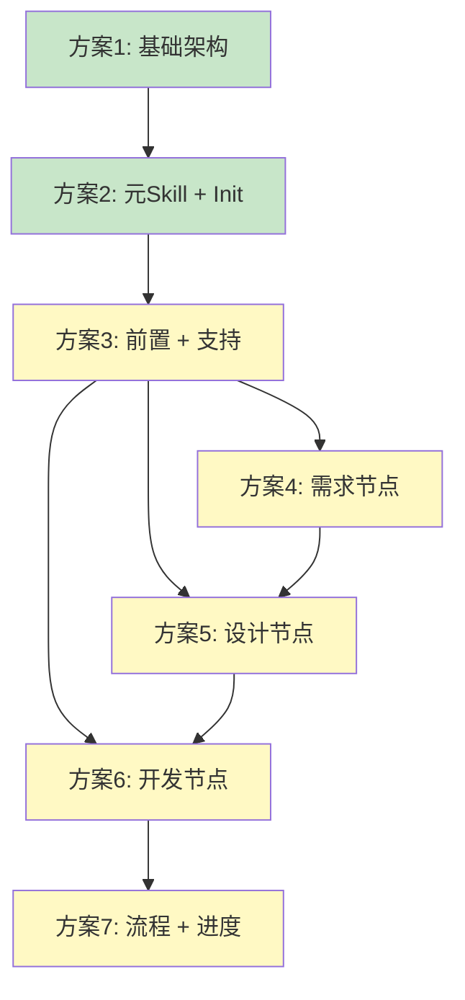

# Cadence-skills 方案实施计划

**版本**: v1.0
**创建日期**: 2026-03-01
**总方案数**: 7个
**当前进度**: 2/7

---

## 📋 方案总览

| 方案 | 名称 | 核心内容 | 预估工作量 | 状态 | 文档 |
|------|------|---------|-----------|------|------|
| **1** | 基础架构 + 配置 + Hooks | 目录结构、配置文件、SessionStart Hook | 2-3小时 | ✅ 设计完成 | [查看](./方案1_基础架构_配置_Hooks.md) |
| **2** | 元 Skill + Init Skill | using-cadence、cadence:init | 2-3小时 | ✅ 设计完成 | [查看](./方案2_元Skill_InitSkill.md) |
| **3** | 前置 Skill + 支持 Skill | 5个前置 + 1个支持 | 3-4小时 | ⏳ 待设计 | - |
| **4** | 节点 Skill 第1组 | Brainstorm、Analyze、Requirement | 3-4小时 | ⏳ 待设计 | - |
| **5** | 节点 Skill 第2组 | Design、Design Review、Plan | 3-4小时 | ⏳ 待设计 | - |
| **6** | 节点 Skill 第3组 | Git Worktrees、Subagent Development | 4-5小时 | ⏳ 待设计 | - |
| **7** | 流程 Skill + 进度追踪 | 3个流程 + 进度管理 | 2-3小时 | ⏳ 待设计 | - |

**总预估工作量**: 19-26小时

---

## 🎯 方案依赖关系



**说明**：
- ✅ 绿色：已完成设计
- ⏳ 黄色：待设计

---

## 📦 已完成方案（2/7）

### 方案1：基础架构 + 配置 + Hooks ✅

**核心产出**：
- ✅ 7个目录（.claude-plugin/, skills/, agents/, commands/, hooks/, docs/, tests/）
- ✅ 2个配置文件（plugin.json, marketplace.json）
- ✅ 1个 Hook 配置（hooks.json）
- ✅ 1个 Hook 脚本（session-start）
- ✅ 1个文档（hooks-reference.md）

**实施文件**：[方案1_基础架构_配置_Hooks.md](./方案1_基础架构_配置_Hooks.md)

**验收标准**：
- [ ] 目录结构创建完成
- [ ] 配置文件格式正确
- [ ] SessionStart hook 可以正常注入 using-cadence 内容
- [ ] hooks-reference.md 文档完整

---

### 方案2：元 Skill + Init Skill ✅

**核心产出**：
- ✅ 1个元 Skill（using-cadence/SKILL.md）
- ✅ 1个 Init Skill（cadence:init/SKILL.md）
- ✅ 1个 Command 映射（commands/init.md）
- ✅ 1个说明文档（skills/README.md）

**实施文件**：
- [方案2_元Skill_InitSkill.md](./方案2_元Skill_InitSkill.md)
- [using-cadence Skill](./skills/using-cadence/SKILL.md)
- [cadence:init Skill](./skills/init/SKILL.md)
- [init Command](./commands/init.md)

**验收标准**：
- [ ] using-cadence Skill 可以正常加载
- [ ] SessionStart hook 可以注入 using-cadence 内容
- [ ] cadence:init Skill 可以正常调用
- [ ] `/cadence:init` 命令可以正常触发

---

## 📋 待实施方案（5/7）

### 方案3：前置 Skill + 支持 Skill ⏳

**核心内容**：
- 5个前置 Skills（质量保证基础）
  - cadence-test-driven-development
  - cadence-requesting-code-review
  - cadence-receiving-code-review
  - cadence-verification-before-completion
  - cadence-self-review
- 1个支持 Skill
  - cadence-finishing-a-development-branch

**依赖**：方案1、方案2

---

### 方案4：节点 Skill 第1组（需求阶段）⏳

**核心内容**：
- cadence-brainstorm（需求探索）
- cadence-analyze（存量分析）
- cadence-requirement（需求分析）

**依赖**：方案1、方案2、方案3

---

### 方案5：节点 Skill 第2组（设计阶段）⏳

**核心内容**：
- cadence-design（技术设计）
- cadence-design-review（设计审查）
- cadence-plan（实现计划）

**依赖**：方案4

---

### 方案6：节点 Skill 第3组（开发阶段）⏳

**核心内容**：
- cadence-using-git-worktrees（隔离环境）
- cadence-subagent-development（代码实现+单元测试）
- 3个 Subagent 定义（8.1/8.2/8.3）

**依赖**：方案5

---

### 方案7：流程 Skill + 进度追踪 ⏳

**核心内容**：
- 3个流程 Skills
  - cadence-full-flow
  - cadence-quick-flow
  - cadence-exploration-flow
- 进度追踪系统
  - cadence:status
  - cadence:resume
  - cadence:checkpoint
  - cadence:report
  - cadence:monitor

**依赖**：所有前置方案

---

## 🚀 实施建议

### 实施顺序

**推荐顺序**（串行）：
1. ✅ 方案1 → 2. ✅ 方案2 → 3. ⏳ 方案3 → 4-6. ⏳ 方案4-6（可并行） → 7. ⏳ 方案7

**并行建议**：
- 方案4、5、6可以并行开发（如果有多人团队）
- 方案1-3必须串行（依赖关系强）

### 实施节奏

**第一阶段（基础设施）**：
- 方案1 + 方案2
- 预估：4-6小时
- 目标：建立基础架构和入口机制

**第二阶段（质量保证）**：
- 方案3
- 预估：3-4小时
- 目标：建立 TDD 和代码审查能力

**第三阶段（核心节点）**：
- 方案4 + 方案5 + 方案6
- 预估：10-13小时（串行）或 6-8小时（并行）
- 目标：实现 8 个核心节点

**第四阶段（流程编排）**：
- 方案7
- 预估：2-3小时
- 目标：实现流程组合和进度管理

---

## 📊 进度追踪

### 整体进度

```
总进度: 2/7 (28.6%)

✅✅⏳⏳⏳⏳⏳
```

### 详细进度

| 阶段 | 方案 | 状态 | 完成日期 |
|------|------|------|---------|
| 基础设施 | 方案1 | ✅ 设计完成 | 2026-03-01 |
| 基础设施 | 方案2 | ✅ 设计完成 | 2026-03-01 |
| 质量保证 | 方案3 | ⏳ 待设计 | - |
| 核心节点 | 方案4 | ⏳ 待设计 | - |
| 核心节点 | 方案5 | ⏳ 待设计 | - |
| 核心节点 | 方案6 | ⏳ 待设计 | - |
| 流程编排 | 方案7 | ⏳ 待设计 | - |

---

## 📂 文件结构

```
.claude/designs/
├── next/                              # 实施方案目录
│   ├── README.md                      # 本文件
│   ├── 方案1_基础架构_配置_Hooks.md   # ✅ 已完成
│   ├── 方案2_元Skill_InitSkill.md     # ✅ 已完成
│   ├── skills/                        # Skill 设计文件
│   │   ├── using-cadence/
│   │   │   └── SKILL.md               # ✅ 已完成
│   │   ├── init/
│   │   │   └── SKILL.md               # ✅ 已完成
│   │   └── README.md                  # ✅ 已完成
│   └── commands/
│       └── init.md                    # ✅ 已完成
└── (其他设计文档)
```

---

## 🎯 下一步行动

### 立即行动

1. **实施方案1**
   - 创建目录结构
   - 创建配置文件
   - 创建 Hooks 系统
   - 验证 SessionStart hook

2. **实施方案2**
   - 复制 Skill 文件到项目
   - 测试 using-cadence 注入
   - 测试 `/cadence:init` 命令

### 后续规划

3. **设计方案3**
   - 设计 5 个前置 Skills
   - 设计 1 个支持 Skill
   - 创建完整的 Skill 文件

4. **设计方案4-7**
   - 按顺序完成剩余方案设计

---

## ⚠️ 重要提醒

### 实施前检查

在开始实施方案1之前，确保：
- [ ] 已阅读主方案文档
- [ ] 理解 superpowers 项目结构
- [ ] 了解 Claude Code 插件机制
- [ ] 准备好开发环境

### 实施中注意

- [ ] 严格按照方案文档执行
- [ ] 每个方案完成后进行验收
- [ ] 遇到问题及时记录和反馈
- [ ] 保持文档和代码同步更新

### 实施后验证

- [ ] 所有验收标准通过
- [ ] 功能测试通过
- [ ] 文档完整准确
- [ ] 可以进入下一方案

---

## 📚 相关文档

### 主方案文档
- [技术方案 v2.4](../2026-02-25_技术方案_使用Claude_Code_Skills的AI自动化开发方案_v2.4.md)
- [Init Skill 设计](../2026-02-28_Skill_Init_v1.0.md)

### 参考资料
- [superpowers 项目](/home/michael/workspace/github/superpowers)
- [Claude Code 文档](https://docs.anthropic.com/zh-CN/docs/claude-code)

### 项目信息
- **GitHub**: https://github.com/michaelChe956/Cadence-skills
- **版本**: v2.4.0 MVP
- **许可证**: MIT

---

**创建日期**: 2026-03-01
**最后更新**: 2026-03-01
**维护者**: Cadence Team
