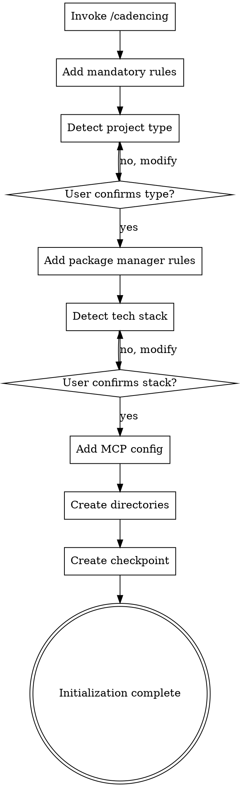

# Project Initialization

## Overview

Initialize an existing project as a Cadence-managed project with automatic configuration of environment, rules, documentation structure, and tech stack.

<HARD-GATE>
Do NOT skip any of the checklist items. Each step must be completed and verified before moving to the next. User confirmation is REQUIRED for tech stack detection and project type detection.
</HARD-GATE>

## Checklist

You MUST create a task for each of these items and complete them in order:

1. **Claude Code initialization** — invoke `/cadencing` command, verify CLAUDE.md created
2. **Add language rules** — configure mandatory Chinese responses
3. **Add documentation rules** — configure `.claude` directory structure and naming conventions
4. **Detect project type** — identify frontend/backend/fullstack, get user confirmation
5. **Add package manager rules** — pnpm for frontend, uv for Python (if applicable)
6. **Add Time MCP rules** — mandatory use of time MCP for date retrieval
7. **Detect tech stack** — auto-detect language, test/lint/format commands, get user confirmation
8. **Add MCP configuration** — configure time and serena MCP servers
9. **Create directory structure** — create `.claude/` subdirectories
10. **Initialize progress tracking** — create checkpoint and session summary

## Process Flow



**The terminal state is initialization complete.** Present a summary of what was configured and suggest next steps (quick-flow, full-flow, or exploration-flow).

## The Process

**Mandatory rules configuration:**
- Add language rule: must respond in Chinese
- Add documentation storage rule: all docs in `.claude/` directory
- Add documentation naming rule: `YYYY-MM-DD_类型_名称_v版本.扩展名`
- Add Time MCP rule: must use time MCP for date retrieval

**Project type detection:**
- Frontend: `package.json` + frontend framework config
- Backend: backend language files + framework
- Fullstack: both frontend and backend
- Other: documentation, config, or tool projects
- Always get user confirmation before proceeding

**Tech stack detection:**
- Language: JavaScript/TypeScript, Python, Java, Go, Rust
- Test command: `pnpm test`, `pytest tests/`, `mvn test`, etc.
- Lint command: `pnpm lint`, `flake8`, `mvn checkstyle:check`, etc.
- Format command: `pnpm format`, `black`, `mvn spotless:apply`, etc.
- Coverage threshold: 80% (configurable)
- Always get user confirmation before writing to CLAUDE.md

**MCP configuration:**
- Add time MCP: `uvx mcp-server-time`
- Add serena MCP: `uvx serena-mcp`
- Configure in `.claude/settings.local.json` or Claude Desktop config

**Directory structure creation:**
```
.claude/
├── docs/           # Requirements documents
├── designs/        # Design documents
├── readmes/        # README documents
├── modao/          # UI prototypes
├── model/          # Data models
├── architecture/   # Architecture docs
├── notes/          # Development notes
├── analysis/       # Analysis reports
└── logs/           # Development logs
```

**Progress tracking initialization:**
- Create checkpoint: `checkpoint-{date}-cadencing`
- Create session summary: `session-{date}-cadencing`
- Save to Serena MCP memory

## After Initialization

**Summary presentation:**
Show what was configured:
- Project type
- Programming language
- Package manager
- Test/lint/format commands
- MCP servers added
- Directories created

**Next steps:**
Suggest three workflow options:
1. **Quick flow** — `/cadence:quick-flow` for fast development (4 steps)
2. **Full flow** — `/cadence:full-flow` for complete process (8 steps)
3. **Exploration flow** — `/cadence:exploration-flow` for technical exploration (4 steps)

## Key Principles

- **User confirmation required** — tech stack and project type detection MUST be confirmed
- **Cross-platform compatibility** — adapt paths and commands for macOS/Linux/Windows
- **Idempotent** — repeated execution should be safe and not duplicate configuration
- **Error handling** — each step should have clear error messages and recovery suggestions
- **No skipping** — all checklist items must be completed in order

## Error Recovery

**Common issues:**

| Issue | Recovery |
|-------|----------|
| CLAUDE.md already exists | Ask: overwrite, merge, or cancel |
| Tech stack detection inaccurate | Allow manual specification via `--project-type` |
| MCP configuration fails | Provide manual configuration instructions |
| Project type detection fails | Default to "other" and ask for manual specification |

## Parameters

| Parameter | Type | Description |
|-----------|------|-------------|
| `--skip-cadencing` | flag | Skip `/cadencing` command invocation |
| `--skip-tech-stack` | flag | Skip tech stack detection and configuration |
| `--skip-mcp` | flag | Skip MCP configuration |
| `--chinese` | flag | Force Chinese localization of CLAUDE.md |
| `--project-type` | string | Manually specify project type (frontend/backend/fullstack/other) |
