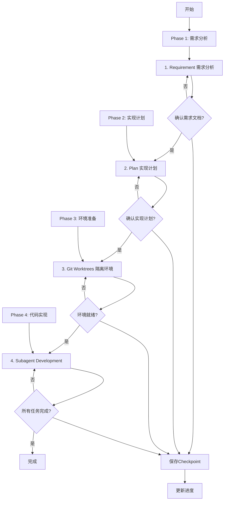

# Quick Flow - 快速开发流程

## Overview

精简的快速开发流程，只包含4个核心节点，适合简单功能开发和个人项目。

**核心原则**: 精简流程 + 快速迭代 + 保证质量 = 高效交付

**开始时宣布**: "我正在使用 quick-flow skill 来执行快速开发流程。"

## When to Use

### 使用场景判断

**应该使用**:
- ✅ 简单功能（预估 <2小时能完成）
- ✅ 需求明确（不需要 Brainstorm 探索）
- ✅ 个人项目（不需要完整文档）
- ✅ 紧急修复（需要快速上线）
- ✅ 全新模块（不涉及存量代码）

**不应该使用**:
- ❌ 复杂功能（预估 >2小时）→ 使用 full-flow
- ❌ 涉及存量代码改造 → 使用 full-flow
- ❌ 企业级项目（需要设计审查）→ 使用 full-flow
- ❌ 需求不明确 → 使用 full-flow 或 exploration-flow

### 功能复杂度预估

#### 🟢 极简单功能（预估45-75分钟）

**特征**:
- 单文件或少量文件修改（<5个文件）
- 代码量 <200行
- 1-3个函数/方法
- 非常简单的逻辑，无复杂依赖

**示例**:
- 添加一个简单的 API endpoint
- 修复一个 bug
- 添加一个配置项
- 修改 UI 文案

#### 🟡 简单功能（预估75-140分钟）

**特征**:
- 少量文件修改（5-15个文件）
- 代码量 200-500行
- 3-8个函数/方法
- 简单的业务逻辑，少量外部依赖

**示例**:
- 添加一个新的 CRUD 模块
- 实现一个简单的数据导入功能
- 添加一个报表导出功能
- 实现一个简单的定时任务

### 前置条件

- ✅ 需求明确（不需要探索）
- ✅ 不涉及存量代码（或影响很小）
- ✅ 简单功能（预估 <2小时）
- ✅ 所有节点 Skills 可用

## The Process



### 详细步骤

#### Phase 1: 需求分析（10-15分钟）

##### 1. Requirement（需求分析）

**调用 Skill**: `requirement`

**输入**:
- 用户描述的需求（明确的需求）

**输出**:
- 简化需求文档（`.claude/docs/{date}_需求文档_{功能名称}_v1.0.md`）

**精简说明**:
- ✅ 简化需求文档，只记录核心需求
- ✅ 跳过 PRD（需求明确）
- ✅ 跳过存量分析（不涉及存量代码）

**人工确认**:
```
需求文档已生成（简化版）：
- 功能需求：{核心需求列表}
- 验收标准：{标准列表}

是否确认需求文档？
├── ✅ 确认 → 进入 Plan
├── ⚠️ 需要调整 → 重新 Requirement
└── ❌ 不满意 → 重新 Requirement
```

##### 保存 Checkpoint

```javascript
write_memory({
  memory_name: `checkpoint-quick-flow-requirement-${timestamp}`,
  content: {
    phase: "requirement",
    flow: "quick-flow",
    status: "completed",
    output: "需求文档路径",
    timestamp: new Date().toISOString()
  }
})
```

---

#### Phase 2: 实现计划（5-10分钟）

##### 2. Plan（实现计划）

**调用 Skill**: `plan`

**输入**:
- 需求文档（来自 Requirement）

**输出**:
- 简单实现计划（`.claude/designs/{date}_实现计划_{功能名称}_v1.0.md`）

**精简说明**:
- ✅ 简单任务分解，2-5个任务即可
- ✅ 跳过技术方案（简单功能，直接编码）
- ✅ 跳过设计审查（极简设计）

**人工确认**:
```
实现计划已生成（简化版）：
- 任务数量：{数量}（2-5个）
- 预估时间：{时间范围}
- 并行任务：{任务列表}

是否确认实现计划？
├── ✅ 确认 → 进入 Git Worktrees
├── ⚠️ 需要调整 → 重新 Plan
└── ❌ 不满意 → 重新 Plan
```

##### 保存 Checkpoint

---

#### Phase 3: 环境准备（5分钟）

##### 3. Git Worktrees（隔离环境）

**调用 Skill**: `using-git-worktrees`

**输入**:
- 实现计划（来自 Plan）

**输出**:
- Git worktree 工作目录
- 新分支（feature/{feature-name}）
- Worktree 信息报告

**人工确认**:
```
Worktree 已创建：
- 位置：{路径}
- 分支：{分支名}
- 测试：✅ 通过

是否确认环境就绪？
├── ✅ 确认 → 进入 Subagent Development
├── ⚠️ 需要调整 → 重新 Git Worktrees
└── ❌ 不满意 → 重新 Git Worktrees
```

##### 保存 Checkpoint

---

#### Phase 4: 代码实现（根据复杂度动态调整）

##### 4. Subagent Development（代码实现+单元测试）

**调用 Skill**: `subagent-development`

**输入**:
- 实现计划（来自 Plan）
- Worktree 信息（来自 Git Worktrees）

**输出**:
- 代码实现
- 单元测试（覆盖率 ≥ 80%）
- 测试覆盖率报告
- 代码审查报告
- Git commits

**自动流程**:
- Implementer Subagent (8.1) → 实现 + 测试 + 自审 + 提交
- Spec Reviewer Subagent (8.2) → 规范合规审查
- Code Quality Reviewer Subagent (8.3) → 代码质量审查
- 循环直到所有任务完成

**人工确认**:
```
所有任务已完成：
- 完成任务：{数量}/{总数}
- 测试覆盖率：{百分比}%
- 审查结果：✅ 全部通过

是否确认开发完成？
├── ✅ 确认 → 流程完成
├── ⚠️ 需要调整 → 继续修复
└── ❌ 不满意 → 继续修复
```

##### 保存最终 Checkpoint

---

#### 完成

```
✅ 快速流程已完成！

项目信息：
- 功能名称：{名称}
- Git 分支：{分支}
- 工作目录：{路径}

完成节点：4/4
- ✅ Requirement
- ✅ Plan
- ✅ Git Worktrees
- ✅ Subagent Development

输出产物：
- 需求文档（简化版）：{路径}
- 实现计划（简化版）：{路径}
- 代码实现：{路径}
- 单元测试：{路径}

时间统计：
- 总耗时：{时间}
- 需求分析：{时间}
- 计划：{时间}
- 开发：{时间}

下一步建议：
1. 使用 /finish 完成开发分支
2. 创建 Pull Request
3. 或继续其他功能开发
```

## 精简说明

### 相比 full-flow 精简的节点

#### ❌ 跳过的节点（4个）

1. **Brainstorm（需求探索）**
   - **原因**: 需求明确，不需要探索
   - **前提**: 用户已明确知道要做什么

2. **Analyze（存量分析）**
   - **原因**: 不涉及存量代码
   - **前提**: 全新模块或独立功能

3. **Design（技术设计）**
   - **原因**: 简单功能，直接编码即可
   - **前提**: 技术方案简单，无需正式设计

4. **Design Review（设计审查）**
   - **原因**: 极简设计，无需正式审查
   - **前提**: 功能简单，风险可控

#### ✅ 保留的节点（4个）

1. **Requirement（需求分析）**
   - **原因**: 即使简单功能，也需要明确需求
   - **调整**: 简化需求文档，只记录核心需求

2. **Plan（实现计划）**
   - **原因**: 避免无计划开发
   - **调整**: 简单任务分解，2-5个任务即可

3. **Git Worktrees（隔离环境）**
   - **原因**: 即使单人开发，也建议隔离环境
   - **调整**: 无需调整，按标准流程

4. **Subagent Development（代码实现+单元测试）**
   - **原因**: 核心开发节点，包含TDD和审查
   - **调整**: 无需调整，按标准流程

## Input/Output

### 输入来源

1. **用户需求**: 明确的功能描述
2. **项目上下文**: 当前项目状态

### 输出产物

#### 产物1：项目文档（2份，简化版）
- 需求文档（简化版）
- 实现计划（简化版）

#### 产物2：代码实现
- 功能代码
- 单元测试（覆盖率 ≥ 80%）
- Git commits

#### 产物3：进度记录
- Session Summary
- 4 个 Checkpoints
- TodoWrite 任务记录

## Integration

### 前置 Skills

**依赖节点 Skills（4个）**:
- requirement (方案4)
- plan (方案5)
- using-git-worktrees (方案6)
- subagent-development (方案6)

### 后续 Skills

- **finishing-a-development-branch** - 完成开发分支

### 相关 Commands

- `/status` - 查看进度
- `/resume` - 恢复进度
- `/checkpoint` - 创建检查点
- `/report` - 生成报告

## Checklist

### 准备阶段
- [ ] 是否确认需求明确？
- [ ] 是否确认不涉及存量代码？
- [ ] 是否确认为简单功能（<2小时）？
- [ ] 是否激活了项目？

### Phase 1: 需求分析
- [ ] 需求文档（简化版）是否生成？
- [ ] 用户是否确认？
- [ ] Checkpoint 是否保存？

### Phase 2: 实现计划
- [ ] 实现计划（简化版）是否生成？
- [ ] 任务数量是否合理（2-5个）？
- [ ] 用户是否确认？

### Phase 3: 环境准备
- [ ] Worktree 是否创建成功？
- [ ] 测试基线是否通过？

### Phase 4: 代码实现
- [ ] 所有任务是否完成？
- [ ] 测试覆盖率是否 ≥ 80%？
- [ ] 审查是否全部通过？

### 完成阶段
- [ ] 所有节点是否完成？
- [ ] 代码是否可用？

## Red Flags

**绝不**:
- 用于复杂功能（>2小时）
- 用于涉及存量代码的功能
- 跳过 Requirement（即使需求明确）
- 跳过 Plan（避免无计划开发）
- 跳过测试（必须 ≥ 80% 覆盖率）

**始终**:
- 确认需求明确
- 确认功能简单
- 每个节点完成后要求人工确认
- 保存 Checkpoint
- 保证质量（TDD + 审查）

## 风险提示

⚠️ **跳过 Design 可能导致技术方案不完整**
- 建议预估时间 >2小时的功能不要使用快速流程

⚠️ **跳过 Analyze 可能导致重复造轮子**
- 建议涉及现有代码的功能不要使用快速流程

⚠️ **跳过 Design Review 可能导致设计缺陷**
- 建议企业级项目不要使用快速流程

## Example Workflow

```
你: 我正在使用 quick-flow skill 来执行快速开发流程。

[确认需求明确]
这个功能预估时间：<2小时
是否确认使用快速流程？
用户: 确认

[Phase 1: Requirement]
[调用 requirement skill]
[生成简化需求文档]

需求文档已生成（简化版）：
- 功能需求：添加用户头像上传功能
- 验收标准：用户可以上传/更换/删除头像

是否确认需求文档？
用户: 确认

[保存 Checkpoint]

[Phase 2: Plan]
[调用 plan skill]
[生成简单实现计划]

实现计划已生成（简化版）：
- 任务数量：3个
- 预估时间：60-90分钟
- 并行任务：无（顺序执行）

是否确认实现计划？
用户: 确认

[保存 Checkpoint]

[Phase 3: Git Worktrees]
[调用 using-git-worktrees skill]
[创建 worktree]

Worktree 已创建：
- 位置：.worktrees/avatar-upload
- 分支：feature/avatar-upload
- 测试：✅ 通过

是否确认环境就绪？
用户: 确认

[保存 Checkpoint]

[Phase 4: Subagent Development]
[调用 subagent-development skill]
[Implementer 8.1 实现 + 测试]
[Spec Reviewer 8.2 审查]
[Code Quality Reviewer 8.3 审查]

所有任务已完成：
- 完成任务：3/3
- 测试覆盖率：85%
- 审查结果：✅ 全部通过

是否确认开发完成？
用户: 确认

[保存最终 Checkpoint]

✅ 快速流程已完成！
```

## 时间预估

| 复杂度 | 代码量预估 | 总时间范围 |
|--------|-----------|-----------|
| 🟢 极简单 | <200行 | 45-75分钟 |
| 🟡 简单 | 200-500行 | 75-140分钟 |

**节点时间分布**:
- Phase 1: 10-15分钟
- Phase 2: 5-10分钟
- Phase 3: 5分钟
- Phase 4: 极简单30-60分钟 / 简单60-90分钟
