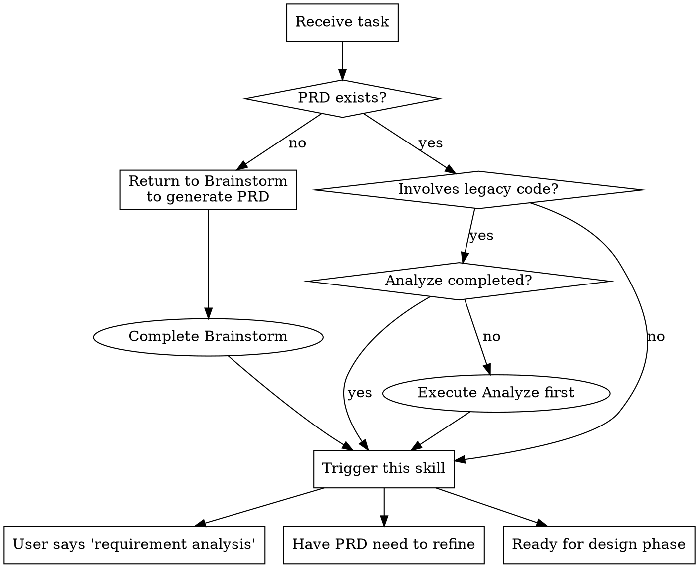
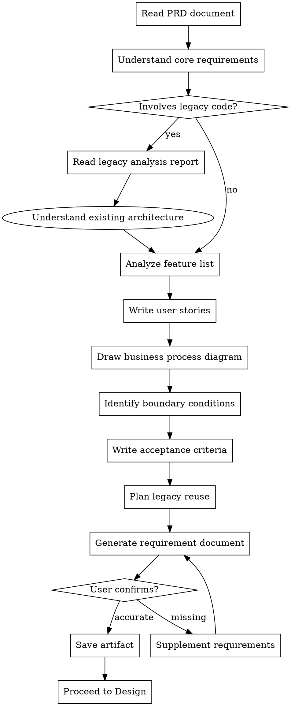
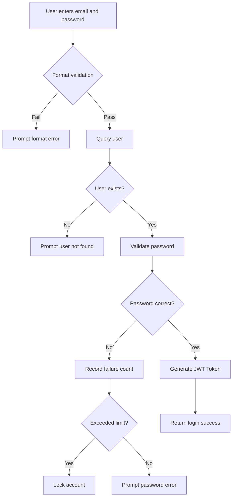
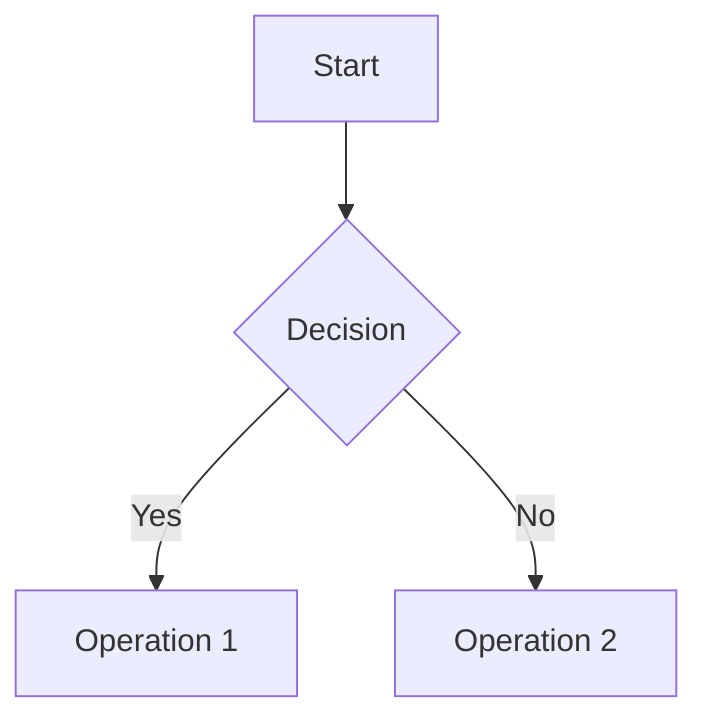
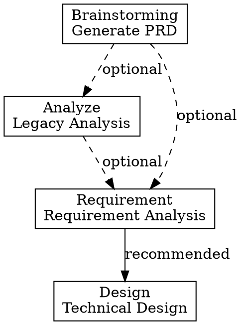

# Requirement - Requirement Analysis

## Overview

Conduct detailed requirement analysis based on PRD and legacy analysis (if involving existing code). Generate complete requirement documentation including feature list, user stories, business processes, acceptance criteria, and legacy reuse planning.

**Core Value**:
- 📋 Transform vague requirements into clear technical requirements
- ✅ Define testable acceptance criteria
- 🔄 Plan legacy code reuse strategy
- 🎯 Clarify feature priorities

**Important Boundaries**:
- ✅ Requirement focuses on "what to do" (business perspective)
- ❌ Requirement doesn't include "how to do" (technical implementation, handled by Design)
- ✅ Acceptance criteria clear enough to "derive test cases"
- ❌ Acceptance criteria don't include specific test cases

## When to Use

### Prerequisites

**Optional Prerequisites**:
- ✅ PRD document exists (from brainstorming)
- ✅ If involving legacy code, Analyze is completed

**Note**: Requirement can be used independently, can generate based on user conversation without prerequisite documents

### Trigger Conditions

Use this skill when:
- User says "requirement analysis..."
- User says "detailed requirements..."
- User says "business rules..."
- Have PRD, need to refine into detailed requirements
- Ready to enter design phase
- Quick flow starting point (can skip Brainstorm)

### Decision Flow



### Skip Conditions

Skip this node when:
- Detailed requirement document already exists
- Feature is extremely simple, no need for detailed analysis (e.g., simple config change)
- Pure prototype development (exploration phase)
- User explicitly says it's not needed

## The Process

### Detailed Workflow



### Step Details

#### Step 1: Read PRD Document ⭐

**Purpose**: Understand core requirements and user stories

**Operation**:
```bash
# Read PRD document (if exists)
Read: .claude/docs/*PRD*.md
```

**Extract Information**:
- Core feature descriptions
- User pain points
- Success criteria
- Constraints

**If PRD doesn't exist**:
- Confirm requirements through conversation with user
- Or return to `brainstorming` to generate PRD

#### Step 2: Read Legacy Analysis Report (Optional)

**Purpose**: Understand existing architecture and dependencies

**Condition**: Execute when involving legacy code

**Operation**:
```bash
# Read legacy analysis report
Read: .claude/docs/*LegacyAnalysis*.md
```

**Extract Information**:
- Reusable modules
- Modules needing modification
- Technical constraints
- Risk points

#### Step 3: Analyze Feature List

**Purpose**: Break down PRD into specific features

**Output**:
- Core feature list (P0)
- Extended feature list (P1/P2)
- Feature dependencies

**Example**:
```
Core Features (P0):
1. User login
2. Password validation
3. JWT Token generation

Extended Features (P1):
1. Remember me functionality
2. Login failure rate limiting

Extended Features (P2):
1. Multi-factor authentication
```

#### Step 4: Write User Stories

**Purpose**: Transform features into user perspective

**Format**:
```
As a [role]
I want [feature]
So that [value]
Priority: P0/P1/P2
```

**Example**:
```markdown
### User Story 1: User Login
- As a: Registered user
- I want to: Log in to the system using email and password
- So that: I can access my personal information and perform actions
- Priority: P0

### User Story 2: Password Strength Validation
- As a: System administrator
- I want to: Force users to set strong passwords
- So that: I can improve system security
- Priority: P1
```

#### Step 5: Draw Business Process Diagram

**Purpose**: Visualize business processes

**Tool**: Mermaid

**Example**:


**Include**:
- Happy path (normal flow)
- Error path (exception flow)
- Key decision points
- Data flow

#### Step 6: Identify Boundary Conditions

**Purpose**: Identify exception scenarios and edge cases

**Check Items**:

**Data Boundaries**:
- Max/min values
- Empty/null values
- Special characters
- Format errors

**Business Boundaries**:
- Permission boundaries
- State boundaries
- Time boundaries
- Concurrency boundaries

**Example**:
```markdown
### Boundary Condition List

**Data Boundaries**:
- Email: empty, format error, too long
- Password: empty, too short, insufficient strength
- Login failure count: 0, 3, >3

**Business Boundaries**:
- Account status: active, locked, inactive
- Token expiry: not expired, just expired, expired long ago
- Concurrent login: single device, multiple devices
```

#### Step 7: Write Acceptance Criteria ⭐

**Purpose**: Define testable acceptance conditions

**Key Requirements**:
- ✅ Acceptance criteria must be **clear enough to derive test cases**
- ✅ Use Given-When-Then format
- ✅ Mark priority (P0/P1/P2)
- ❌ Don't include specific test code

**Format**:
```markdown
### Feature 1 Acceptance Criteria

**Acceptance Criterion 1**: [Criterion name]
- Given: [Precondition]
- When: [Trigger action]
- Then: [Expected result]
- Priority: P0

**Acceptance Criterion 2**: [Criterion name]
- Given: [Precondition]
- When: [Trigger action]
- Then: [Expected result]
- Priority: P1
```

**Example**:
```markdown
### User Login Acceptance Criteria

**Acceptance Criterion 1**: Successful login
- Given: User is registered and account is active
- When: Enters correct email and password
- Then: Login succeeds, JWT Token returned
- Priority: P0

**Acceptance Criterion 2**: Wrong password
- Given: User is registered
- When: Enters wrong password
- Then: Login fails, prompt "password error"
- Priority: P0

**Acceptance Criterion 3**: Account locked
- Given: User has failed 3 consecutive times
- When: 4th login attempt
- Then: Login fails, prompt "account locked"
- Priority: P1

**Acceptance Criterion 4**: Email format error
- Given: User on login page
- When: Enters malformed email
- Then: Prompt "email format error"
- Priority: P1
```

#### Step 8: Plan Legacy Reuse

**Purpose**: Identify reusable legacy code

**Condition**: Execute when involving legacy code

**Planning Content**:

**Reusable Modules**:
```markdown
### Reusable Module List

1. **Password encryption module**
   - Location: `utils/password.py::hash_password`
   - Reuse method: Direct call
   - Risk: None

2. **JWT generation module**
   - Location: `services/jwt_service.py::generate_token`
   - Reuse method: Extend payload
   - Risk: Need to modify expiry time logic
```

**Modules Needing Modification**:
```markdown
### Modules Needing Modification List

1. **Login rate limiting module**
   - Location: `middleware/rate_limit.py`
   - Reason: Currently not implemented
   - Solution: Add Redis counter
   - Estimated effort: 2 hours

2. **Password strength validation**
   - Location: `validators/password.py`
   - Reason: Current validation rules too weak
   - Solution: Add regex rules
   - Estimated effort: 1 hour
```

**Reuse Risk Assessment**:
```markdown
### Reuse Risks

🟡 **Medium Risk**:
- JWT module needs modification, may affect existing token validation
- Mitigation: Maintain backward compatibility, old tokens still valid

🟢 **Low Risk**:
- Password encryption module stable, no risk
```

#### Step 9: Generate Requirement Document

**Output Artifact**: `.claude/docs/{date}_Requirement_{FeatureName}_v1.0.md`

**Document Structure**:
```markdown
# Requirement Document - [Feature Name]

**Version**: v1.0
**Date**: {date}
**Author**: Claude

---

## 1. Feature Overview

### Core Features (P0)
1. [Feature 1]
2. [Feature 2]

### Extended Features (P1)
1. [Feature 1]
2. [Feature 2]

### Extended Features (P2)
1. [Feature 1]

---

## 2. User Stories

### User Story 1: [Title]
- As a: [Role]
- I want to: [Feature]
- So that: [Value]
- Priority: P0

[More user stories...]

---

## 3. Business Process

```mermaid
[Business process diagram]
```

---

## 4. Feature Details

### Feature 1: [Feature Name]
**Description**: [Description]

**Business Rules**:
1. [Rule 1]
2. [Rule 2]

**Boundary Conditions**:
- [Boundary 1]
- [Boundary 2]

---

## 5. Acceptance Criteria

### Feature 1 Acceptance Criteria

**Acceptance Criterion 1**: [Criterion name]
- Given: [Precondition]
- When: [Trigger action]
- Then: [Expected result]
- Priority: P0

[More acceptance criteria...]

---

## 6. Legacy Reuse Planning

### Reusable Modules
1. [Module 1] - [Location] - [Reuse method]
2. [Module 2] - [Location] - [Reuse method]

### Modules Needing Modification
1. [Module 1] - [Reason] - [Solution]
2. [Module 2] - [Reason] - [Solution]

### Reuse Risks
- 🟡 [Risk description]
- 🟢 [Risk description]

---

## 7. Non-Functional Requirements

### Performance Requirements
- Response time: < 200ms
- Concurrent users: > 1000

### Security Requirements
- Password encryption: bcrypt
- Token expiry: 7 days

### Compatibility Requirements
- Browsers: Chrome 90+, Firefox 88+
- Mobile: iOS 13+, Android 10+

---

**Created**: {date}
**Last Updated**: {date}
```

#### Step 10: User Confirmation

**Confirmation Mechanism**:
```
After generating requirement document:
Show requirement summary (3-5 core requirements)
Show acceptance criteria list (grouped by priority)
Show legacy code reuse plan (when involving legacy code)

Ask: "Are requirements complete? Any missing items?"
├── ✅ Complete → Save artifact, proceed to Design
├── ⚠️ Missing → Supplement requirements
└── ❌ Incorrect → Re-analyze
```

## Tools

### Document Reading Tools

**Read PRD**:
```python
# Read PRD document
Read: .claude/docs/*PRD*.md
```

**Read Legacy Analysis**:
```python
# Read legacy analysis report
Read: .claude/docs/*LegacyAnalysis*.md
```

### Mermaid Tool

**Draw Process Diagrams**:
```markdown

```

## Time Estimation

| Complexity | Time Range | Description |
|-----------|-----------|-------------|
| 🟢 Simple | 10-15 min | Single feature, clear rules, no legacy dependencies |
| 🟡 Medium | 15-30 min | Multiple features, need detailed rules, some legacy code |
| 🔴 Complex | 30-60 min | Complex business, many boundary conditions, extensive legacy code |

**Complexity Criteria**:
- 🟢 **Simple**: 1-3 features, < 10 acceptance criteria
- 🟡 **Medium**: 3-8 features, 10-20 acceptance criteria
- 🔴 **Complex**: > 8 features, > 20 acceptance criteria

## Checklist ✅

After completing requirement analysis, ensure:

- [ ] **PRD read**: Read and understood PRD?
- [ ] **Feature list**: Listed all feature points?
- [ ] **User stories**: Included complete user stories?
- [ ] **Business process**: Drew core business process diagram?
- [ ] **Boundary conditions**: Identified all boundaries and exceptions?
- [ ] **Acceptance criteria**: Clear enough to derive test cases?
- [ ] **Legacy reuse**: Planned legacy code reuse method? (when involving legacy code)
- [ ] **Priorities**: Distinguished core and extended features?
- [ ] **User confirmation**: Obtained user confirmation?

## Red Flags ⚠️

### Must Avoid Errors

| Wrong Practice | Correct Practice |
|----------------|------------------|
| ❌ Do Requirement without PRD | ✅ Can generate based on conversation, or return to Brainstorm to generate PRD |
| ❌ Involving legacy code but didn't complete Analyze | ✅ Must complete Analyze first |
| ❌ Vague acceptance criteria, untestable | ✅ Acceptance criteria must be clear enough to derive test cases |
| ❌ Ignore legacy code modification impact | ✅ Need to assess legacy impact and reuse plan |
| ❌ Design data model in Requirement phase | ✅ Data model should be completed in Design phase |
| ❌ Include specific test cases in acceptance criteria | ✅ Acceptance criteria only need "derive test cases" clarity |
| ❌ Don't distinguish feature priorities | ✅ Must mark P0/P1/P2 priorities |

## Integration

### Prerequisites

**Optional Dependencies**:
- `brainstorming` - Provides PRD document
- `analyze` - Provides legacy analysis report when involving legacy code

**Independence**:
- ✅ Can be used independently (generate based on conversation)
- ✅ Can skip Brainstorm and use directly (quick flow)
- ✅ Can skip Analyze (brand new project)

### Next Step

**Recommended Next**:
- `design` - Conduct technical design based on requirement document

**Alternative Paths**:
- If requirements unclear, return to `brainstorming` to re-explore
- If legacy code issues found, return to `analyze` to supplement analysis

### Relationship with Other Skills



### Required Input

1. **PRD document** (optional): From brainstorming
2. **Legacy analysis report** (optional): From analyze, when involving legacy code
3. **User conversation**: User supplements requirement details

### Provided Output

1. **Requirement document**: `.claude/docs/{date}_Requirement_{FeatureName}_v1.0.md`
2. **User story list**
3. **Acceptance criteria list**
4. **Legacy reuse plan**

## Boundary with Design

### Requirement Phase Responsibility

✅ **Feature list and user stories**
✅ **Business process and business rules**
✅ **Acceptance criteria** (clear enough to derive test cases)
✅ **Legacy reuse planning** (identify reusable modules)
✅ **Non-functional requirements** (performance, security, compatibility)

### Design Phase Responsibility

✅ **Technical solution and architecture design**
✅ **Data model design** (table structure, indexes, constraints)
✅ **API design** (interface specifications)
✅ **Detailed technology selection and implementation details**
✅ **Technical risk assessment**

### Key Differences

| Dimension | Requirement | Design |
|-----------|-------------|--------|
| **Perspective** | Business perspective (what to do) | Technical perspective (how to do) |
| **Content** | Features, processes, rules | Architecture, interfaces, data models |
| **Audience** | Product, business, testing | Development, architects |
| **Data Model** | Not included | Includes physical design |
| **Testing** | Acceptance criteria (Given-When-Then) | Test strategy and technical approach |

## Example

### Example Scenario: User Login Feature

**Input**:
- PRD document: User login requirement
- Legacy analysis: Existing password encryption module

**Requirement Analysis Steps**:

1. **Feature List**:
   - P0: Email/password login
   - P1: Login failure rate limiting
   - P2: Multi-factor authentication

2. **User Story**:
   ```markdown
   As a registered user, I want to log in using email and password,
   so that I can access my personal information.
   Priority: P0
   ```

3. **Business Process**:
   - Draw login process diagram (including exception flows)

4. **Acceptance Criteria**:
   ```markdown
   Acceptance Criterion 1: Successful login
   - Given: User is registered and account is active
   - When: Enters correct email and password
   - Then: Login succeeds, JWT Token returned
   - Priority: P0
   ```

5. **Legacy Reuse**:
   - Reuse: `utils/password.py::hash_password`
   - Modify: `middleware/rate_limit.py` (add rate limiting)

6. **Generate Document**:
   - Save to: `.claude/docs/2026-03-01_Requirement_UserLogin_v1.0.md`

7. **User Confirmation**:
   - Show core requirements
   - Ask: "Are requirements complete?"

## Best Practices

### DO - Recommended

✅ **Clear acceptance criteria**: Use Given-When-Then format
✅ **Identify all boundary conditions**: Data boundaries, business boundaries
✅ **Plan legacy reuse**: Identify reusable and modules needing modification
✅ **Distinguish priorities**: Clearly mark P0/P1/P2
✅ **Confirm timely**: Confirm requirement accuracy with user

### DON'T - Avoid

❌ **Vague acceptance criteria**: Cannot derive test cases
❌ **Ignore boundary conditions**: Only consider normal flow
❌ **Skip legacy reuse**: Don't assess legacy code
❌ **No priority distinction**: All features equally important
❌ **Include technical implementation**: Design data model in requirement phase

## Summary

**Core Value of Requirement Skill**:
1. 📋 **Clarify requirements** - Transform vague ideas into clear requirements
2. ✅ **Testability** - Define clear acceptance criteria
3. 🔄 **Reuse planning** - Maximize use of existing code
4. 🎯 **Priority management** - Focus on core features

**Remember**: Good requirement analysis is the foundation of successful projects!
