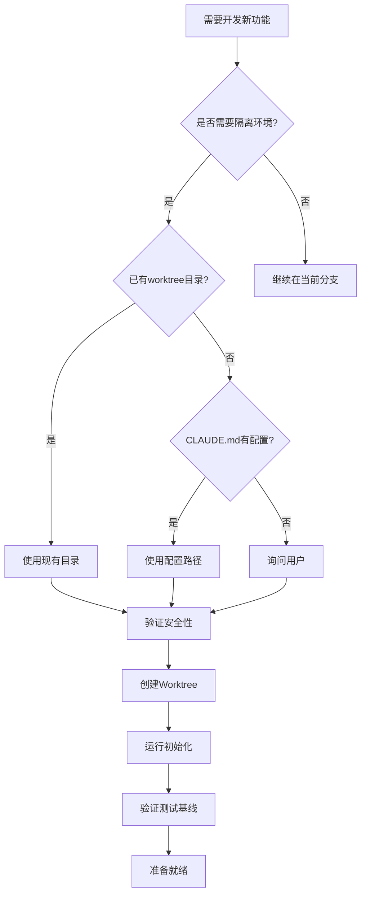
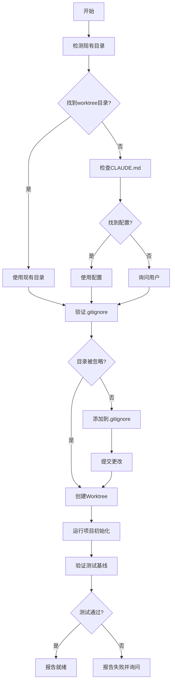

# Using Git Worktrees - 隔离开发环境

## Overview

Git worktrees 创建共享同一仓库的隔离工作空间，允许同时在多个分支上工作而无需切换。

**核心原则**: 系统化目录选择 + 安全验证 + 自动初始化 = 可靠的隔离环境

**开始时宣布**: "我正在使用 using-git-worktrees skill 来设置隔离的工作空间。"

## When to Use



### 使用场景判断

**应该使用**:
- ✅ 并行开发多个功能
- ✅ 需要避免污染主分支
- ✅ 团队协作项目
- ✅ 有实现计划准备开发

**可以跳过**:
- ⚠️ 个人项目（单人开发）
- ⚠️ 快速修复（<1小时）
- ⚠️ 原型开发（探索性代码）
- ⚠️ 用户明确表示不需要

### 前置条件

- ✅ 当前在 git 仓库中
- ✅ 有足够的磁盘空间
- ✅（可选）有实现计划（来自 plan skill）

## The Process



### 详细步骤

#### 1. 目录选择流程

按照以下优先级顺序：

##### 1.1 检查现有目录

```bash
# 按优先级检查
ls -d .worktrees 2>/dev/null     # 优先（隐藏目录）
ls -d worktrees 2>/dev/null      # 备选
```

**如果找到**: 使用该目录。如果两者都存在，`.worktrees` 优先。

##### 1.2 检查 CLAUDE.md

```bash
grep -i "worktree.*director" CLAUDE.md 2>/dev/null
```

**如果找到配置**: 直接使用，不询问。

##### 1.3 询问用户

如果既没有目录也没有配置：

```
未找到 worktree 目录。应该在哪里创建 worktrees？

1. .worktrees/ （项目本地，隐藏目录）
2. ~/.config/cadence/worktrees/<project-name>/ （全局位置）

您倾向于哪个？
```

#### 2. 安全验证

##### 对于项目本地目录（.worktrees 或 worktrees）

**必须验证目录被忽略后再创建 worktree**:

```bash
# 检查目录是否被忽略（遵守 local, global, 和 system gitignore）
git check-ignore -q .worktrees 2>/dev/null || git check-ignore -q worktrees 2>/dev/null
```

**如果未被忽略**:

按照 "立即修复损坏的东西" 原则：
1. 添加适当的行到 .gitignore
2. 提交更改
3. 继续创建 worktree

**为什么关键**: 防止意外将 worktree 内容提交到仓库。

##### 对于全局目录（~/.config/cadence/worktrees）

无需 .gitignore 验证 - 完全在项目之外。

#### 3. 创建步骤

##### 3.1 检测项目名称

```bash
project=$(basename "$(git rev-parse --show-toplevel)")
```

##### 3.2 创建 Worktree

```bash
# 确定完整路径
case $LOCATION in
  .worktrees|worktrees)
    path="$LOCATION/$BRANCH_NAME"
    ;;
  ~/.config/cadence/worktrees/*)
    path="~/.config/cadence/worktrees/$project/$BRANCH_NAME"
    ;;
esac

# 创建 worktree 和新分支
git worktree add "$path" -b "$BRANCH_NAME"
cd "$path"
```

##### 3.3 运行项目设置

自动检测并运行适当的设置：

```bash
# Node.js
if [ -f package.json ]; then npm install; fi

# Rust
if [ -f Cargo.toml ]; then cargo build; fi

# Python
if [ -f requirements.txt ]; then pip install -r requirements.txt; fi
if [ -f pyproject.toml ]; then poetry install; fi

# Go
if [ -f go.mod ]; then go mod download; fi
```

##### 3.4 验证干净的基线

运行测试以确保 worktree 以干净状态开始：

```bash
# 示例 - 使用项目适用的命令
npm test
cargo test
pytest
go test ./...
```

**如果测试失败**: 报告失败，询问是否继续或调查。

**如果测试通过**: 报告就绪。

##### 3.5 报告位置

```
Worktree 准备就绪，位于 <full-path>
测试通过（<N> 个测试，0 个失败）
准备实现 <feature-name>
```

## Input/Output

### 输入来源

1. **用户需求**: 功能名称、分支名称
2. **Plan Skill**（可选）: 实现计划（提供功能名称）
3. **CLAUDE.md**（可选）: Worktree 目录配置
4. **项目文件**: package.json、Cargo.toml 等（用于自动初始化）

### 输出产物

#### 产物1：Git Worktree

- **工作目录**: `.worktrees/{branch-name}` 或 `~/.config/cadence/worktrees/{project}/{branch-name}`
- **新分支**: `feature/{feature-name}`
- **状态**: 干净的基线（测试通过）

#### 产物2：Worktree 信息报告

```
Worktree 准备就绪，位于 /Users/jesse/myproject/.worktrees/auth
分支: feature/auth
测试通过（47 个测试，0 个失败）
准备实现 auth 功能
```

## Integration

### 被以下 Skills 调用

- **brainstorming** (Phase 4) - 当设计被批准并随后实施时必需
- **subagent-development** - 在执行任何任务之前必需
- **executing-plans** - 在执行任何任务之前必需
- 任何需要隔离工作空间的 skill

### 与以下 Skills 配对

- **finishing-a-development-branch** - 工作完成后清理必需

### 前置 Skills

- **plan**（可选）- 提供任务信息和分支名称

### 后续 Skills

- **subagent-development** - 在隔离环境中实现代码

## Checklist

### 目录选择
- [ ] 是否检查了现有目录（.worktrees, worktrees）？
- [ ] 是否检查了 CLAUDE.md 配置？
- [ ] 是否在不确定时询问了用户？

### 安全验证
- [ ] 对于项目本地目录，是否验证了 .gitignore？
- [ ] 如果未被忽略，是否添加到 .gitignore 并提交？
- [ ] 对于全局目录，是否跳过了 .gitignore 验证？

### 创建流程
- [ ] 是否检测了项目名称？
- [ ] 是否成功创建了 worktree 和分支？
- [ ] 是否自动运行了项目初始化？
- [ ] 是否验证了干净的测试基线？

### 报告
- [ ] 是否报告了 worktree 位置？
- [ ] 是否报告了测试结果？
- [ ] 是否指明了准备实现的功能？

## Red Flags

**绝不**:
- 在未验证被忽略的情况下创建 worktree（项目本地）
- 跳过基线测试验证
- 在未询问的情况下继续进行失败的测试
- 在模糊时假设目录位置
- 跳过 CLAUDE.md 检查

**始终**:
- 遵循目录优先级：现有 > CLAUDE.md > 询问
- 对于项目本地验证目录被忽略
- 自动检测并运行项目设置
- 验证干净的测试基线

## Example Workflow

```
你: 我正在使用 using-git-worktrees skill 来设置隔离的工作空间。

[检查 .worktrees/ - 存在]
[验证被忽略 - git check-ignore 确认 .worktrees/ 被忽略]
[创建 worktree: git worktree add .worktrees/auth -b feature/auth]
[运行 npm install]
[运行 npm test - 47 个通过]

Worktree 准备就绪，位于 /Users/jesse/myproject/.worktrees/auth
测试通过（47 个测试，0 个失败）
准备实现 auth 功能
```

## Common Mistakes

### 跳过 ignore 验证

- **问题**: Worktree 内容被跟踪，污染 git status
- **修复**: 在创建项目本地 worktree 之前始终使用 `git check-ignore`

### 假设目录位置

- **问题**: 造成不一致，违反项目约定
- **修复**: 遵循优先级：现有 > CLAUDE.md > 询问

### 继续进行失败的测试

- **问题**: 无法区分新 bug 和预先存在的问题
- **修复**: 报告失败，获得明确许可继续

### 硬编码设置命令

- **问题**: 在使用不同工具的项目上中断
- **修复**: 从项目文件（package.json 等）自动检测
