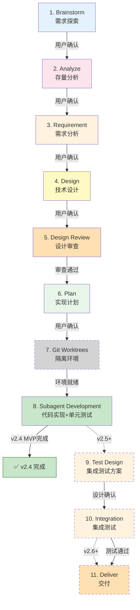

# Cadence 完整方案总览

**版本**: v2.4 MVP (已完成) → v2.5 (规划中) → v2.6 (未来)
**最后更新**: 2026-03-02
**维护者**: Cadence Team

---

## 📑 文档导航

| 文档类型 | 位置 | 说明 |
|---------|------|------|
| **方案总览** | 本文档 | 完整方案总览、Quick Start、版本规划 |
| **方案详情** | `方案1-7_*.md` | 7个具体实施方案 |
| **Skills 设计** | `skills/*/SKILL.md` | 15个 Skills 的完整设计 |
| **Commands 设计** | `commands/*.md` | 14个 Commands 的使用指南 |
| **进度追踪** | `README.md` | 项目进度和未来规划 |

---

## 🎯 核心价值主张

基于 Claude Code Skills/Subagent 构建的完整开发流程自动化框架，通过标准化的节点设计，将需求探索到交付部署的全流程拆解为可独立调用、可灵活组合的模块化单元。

**适用场景**:
- 🎯 **个人开发者**: 快速实现想法,保证代码质量
- 👥 **团队协作**: 标准化流程,完整文档追溯
- 🏢 **企业级项目**: 多层审查,风险可控
- 🔬 **技术研究**: 探索验证,快速迭代

**关键优势**:
- 🧠 **减少认知负荷**: 每个节点专注一件事,AI 和人类都更聚焦
- 🛡️ **保证代码质量**: TDD + 多层审查(设计审查 + 代码审查 + 格式化审查)
- ⚡ **提高效率**: 自动化流程 + Skill 按需加载 + 支持并发子代理执行
- 📚 **知识沉淀**: 标准化产物(.claude/目录) + 版本化管理

---

## 🚀 Quick Start (5分钟上手)

> **快速开始指南**：帮助你快速理解如何使用 Cadence

### 场景1：个人项目快速开发

**适用场景**：个人项目、小型功能、快速迭代

```bash
# 快速流程（跳过设计审查）
/cadence:quick-flow

# 只需4步：
# Requirement → Plan → Git Worktrees → Subagent Development
# 预计时间：1-2小时
```

**流程特点**：
- ✅ 跳过需求探索和存量分析（需求明确）
- ✅ 跳过设计审查（快速迭代）
- ✅ 直接进入开发
- ⚠️ 适合个人项目，不适合企业级应用

---

### 场景2：企业级完整流程

**适用场景**：企业级项目、完整流程、质量保证

```bash
# 完整流程（包含所有审查）
/cadence:full-flow

# 8步完整流程（v2.4 MVP）
# Brainstorm → Analyze → Requirement → Design →
# Design Review → Plan → Git Worktrees → Subagent Development
# 预计时间：1-2天
```

**流程特点**：
- ✅ 完整的需求探索和存量分析
- ✅ 完整的设计和设计审查
- ✅ 严格的TDD流程和代码审查
- ✅ 适合企业级生产项目
- ⚠️ v2.4 MVP版本不包含集成测试和交付（需等待v2.5+）

---

### 场景3：技术探索

**适用场景**：原型开发、技术验证、快速试错

```bash
# 探索流程（允许失败）
/cadence:exploration-flow

# 4步探索流程：
# Brainstorm → Analyze → Git Worktrees → Subagent Development
# 预计时间：2-4小时
```

**流程特点**：
- ✅ 允许需求不明确
- ✅ 允许多次迭代
- ✅ 允许失败（记录经验教训）
- ✅ 快速验证技术可行性
- ⚠️ 原型代码质量要求较低

**探索结局**：
1. ✅ **成功**：转标准流程正式实现
2. ⚠️ **需要调整**：继续探索迭代
3. 📚 **技术储备**：记录方案，暂不实现
4. ❌ **失败**：记录教训，清理代码

---

### 场景4：只使用单个节点

**适用场景**：只需要某个特定功能

```bash
# 只需要代码审查
/cadence:request-review

# 只需要TDD流程
/cadence:tdd

# 只需要创建隔离环境
/cadence:worktree

# 只需要需求分析
/cadence:requirement

# 只需要技术设计
/cadence:design

# 项目上下文加载
/cad-load
```

**使用建议**：
- 每个节点都可以独立使用
- 根据实际需求选择对应节点

---

## 🎯 设计原则

### 核心原则（不可妥协）

| 原则 | 说明 |
|------|------|
| 🎯 **节点独立** | 每个节点可独立调用,不强制走完整流程 |
| ✅ **人工确认** | 每个节点完成后必须人工确认 |
| 📦 **标准产物** | 每个节点生成标准化文档/代码 |
| 🔄 **断点续传** | 支持会话中断后恢复进度 |
| 🧪 **TDD优先** | 代码实现必须遵循测试驱动开发 |
| 🛡️ **质量保证** | 设计审查 + 代码审查 + 格式化审查 |
| 📡 **双通道调用** | 支持命令调用 + Skill工具调用（核心机制） |
| 🎭 **并发能力** | Subagent Development支持并发执行（核心特性） |

### 优化原则（可灵活调整）

| 原则 | 说明 |
|------|------|
| 🔀 **流程灵活性** | 提供完整/快速/探索三种模式 |
| 🧩 **Skill独立** | 关键能力独立为Skill,便于复用 |
| 🤖 **自动化审查** | 集成Linter/Formatter自动化检查 |
| 💾 **上下文优化** | Skill按需加载,减少上下文污染 |

---

## 📊 核心特性

| 特性 | 说明 | 技术实现 |
|------|------|---------|
| **双通道调用** | 命令(`/cadence:xxx`) + Skill工具 | plugin.json配置 |
| **节点独立** | 8个MVP节点（v2.4）/ 11个完整节点（v2.5+）,每个可独立使用 | 每个Skill独立 |
| **Skill组合** | 3个TDD/审查前置 + 8个MVP节点Skill | Skill依赖机制 |
| **流程组合** | 3种流程模式(完整/快速/探索) | 流程Skill组合节点 |
| **人工确认** | 每个节点有人工确认机制 | 对话交互 |
| **标准产物** | 每个节点有标准化输出 | .claude/目录规范 |
| **进度追踪** | TodoWrite追踪,支持恢复 | TodoWrite工具 |
| **质量保证** | 设计审查+代码审查+TDD+格式化 | 多层验证 |
| **Subagent驱动** | 代码开发集成单元测试和审查 | Task工具调用 |
| **并发能力** | 支持并发子代理执行 | Task工具并发 |
| **上下文优化** | Skill按需加载,减少上下文污染 | Skill机制 |
| **断点续传** | 会话中断后可恢复进度 | TodoWrite持久化 |

---

## 🗺️ 版本规划

### v2.4 MVP (当前版本) ✅

**范围**: 4.1-4.8 节点（8个核心节点）

**已实现节点**:
- ✅ 4.1 Brainstorm - 需求探索
- ✅ 4.2 Analyze - 存量分析
- ✅ 4.3 Requirement - 需求分析
- ✅ 4.4 Design - 技术设计
- ✅ 4.5 Design Review - 设计审查
- ✅ 4.6 Plan - 实现计划
- ✅ 4.7 Git Worktrees - 隔离环境
- ✅ 4.8 Subagent Development - 代码实现+单元测试

**核心流程**:
```
需求探索 → 存量分析 → 需求分析 → 技术设计 →
设计审查 → 实现计划 → 隔离环境 → 代码实现（含单元测试）
```

**适用场景**:
- ✅ 个人项目开发
- ✅ 原型开发和POC验证
- ✅ 技术探索和实验
- ✅ 快速迭代的小型功能

**限制说明**:
- ⚠️ 仅包含单元测试（无集成测试）
- ⚠️ 无完整交付流程
- ⚠️ 不适合企业级生产项目

**完成状态**: 7/7 方案 (100%) ✅

---

### v2.5 (下一版本规划) ⏳

**新增节点**: 4.9-4.10 节点（测试阶段）

#### 4.9 Test Design - 集成测试方案
- **目标**: 设计集成测试方案
- **输入**: 技术方案、单元测试
- **输出**: 集成测试方案文档
- **内容**:
  - 测试环境设计
  - 测试数据准备
  - 测试用例设计
  - 测试脚本规划
  - Mock/Stub 策略

#### 4.10 Integration - 集成测试
- **目标**: 执行集成测试
- **输入**: 集成测试方案、代码实现
- **输出**: 集成测试报告、Bug修复
- **内容**:
  - 测试环境搭建
  - 测试数据准备
  - 测试用例执行
  - Bug 修复和验证
  - 测试覆盖率验证

**预估工作量**: 4-6小时

**适用场景**:
- ✅ 企业级应用开发
- ✅ 多系统集成项目
- ✅ 需要质量保证的项目

---

### v2.6+ (未来版本) 📋

**新增节点**: 4.11 节点（交付阶段）

#### 4.11 Deliver - 交付
- **目标**: 完整的交付流程
- **输入**: 集成测试通过的代码
- **输出**: 可部署的产物
- **内容**:
  - 部署准备
  - 环境配置
  - 性能优化
  - 安全检查
  - 文档完善
  - 发布准备

**预估工作量**: 3-5小时

**适用场景**:
- ✅ 生产环境部署
- ✅ 企业级交付流程
- ✅ 完整的端到端流程

---

### 版本演进路线

```
v2.4 MVP (当前) ✅
├── 4.1-4.8 节点 ✅
└── 聚焦：需求 → 设计 → 开发（单元测试）

v2.5 (下一版本) ⏳
├── 4.1-4.8 节点 ✅
├── 4.9 Test Design ⏳
├── 4.10 Integration ⏳
└── 聚焦：完整的开发+测试流程

v2.6+ (未来) 📋
├── 4.1-4.10 节点 ✅
├── 4.11 Deliver ⏳
└── 聚焦：完整的端到端流程
```

---

## 📂 实施方案总览

| 方案 | 名称 | 核心内容 | 状态 | 文档 |
|------|------|---------|------|------|
| **1** | 基础架构 + 配置 + Hooks | 目录结构、配置文件、SessionStart Hook | ✅ 已完成 | [方案1](./方案1_基础架构_配置_Hooks.md) |
| **2** | 元 Skill + Init Skill | using-cadence、cadencing | ✅ 已完成 | [方案2](./方案2_元Skill_InitSkill.md) |
| **3** | 质量保证 Skills | 5个前置 + 1个支持 | ✅ 已完成 | [方案3](./方案3_前置Skill_支持Skill.md) |
| **4** | 节点 Skill 第1组 | Brainstorm、Analyze、Requirement | ✅ 已完成 | [方案4](./方案4_节点Skill_第1组.md) |
| **5** | 节点 Skill 第2组 | Design、Design Review、Plan | ✅ 已完成 | [方案5](./方案5_节点Skill_第2组.md) |
| **6** | 节点 Skill 第3组 | Git Worktrees、Subagent Development | ✅ 已完成 | [方案6](./方案6_节点Skill_第3组.md) |
| **7** | 流程 Skill + 进度追踪 | 3个流程 + 进度管理 | ✅ 已完成 | [方案7](./方案7_流程Skill_进度追踪.md) |

---

## 📦 完整的 11 节点流程



**节点说明**:
- 🟢 **绿色节点** (4.1-4.8): v2.4 MVP 已实现
- 🟡 **黄色节点** (4.9-4.10): v2.5 计划中
- 🟠 **橙色节点** (4.11): v2.6+ 未来实现

---

## 🎯 下一步行动

### 短期（1-2周）
1. ⏳ **整体测试** - 测试 v2.4 MVP 所有 Skills 和 Commands
2. ⏳ **文档完善** - 补充使用指南和最佳实践
3. ⏳ **发布 v2.4 MVP** - 创建 release notes

### 中期（1-2月）
1. 📋 **v2.5 规划** - 详细设计 Test Design 和 Integration 节点
2. 📋 **v2.5 实施** - 实现 4.9-4.10 节点

### 长期（3-6月）
1. 📋 **v2.6 规划** - 详细设计 Deliver 节点
2. 📋 **v2.6 实施** - 实现 4.11 节点
3. 📋 **性能优化** - 优化 Subagent 执行效率
4. 📋 **工具集成** - 集成更多开发工具

---

## 📚 相关文档

### 主要文档
- [方案总览](./完整方案总览.md)（本文档）
- [项目进度](./README.md)
- [7个实施方案](./方案1-7_*.md)

### Skills 和 Commands
- [15个 Skills](./skills/)
- [14个 Commands](./commands/)

### 外部资源
- [superpowers 项目](/home/michael/workspace/github/superpowers)
- [Claude Code 文档](https://docs.anthropic.com/zh-CN/docs/claude-code)

### 项目信息
- **GitHub**: https://github.com/michaelChe956/Cadence-skills
- **版本**: v2.4.0 MVP
- **许可证**: MIT

---

**创建日期**: 2026-02-25
**最后更新**: 2026-03-02
**维护者**: Cadence Team
