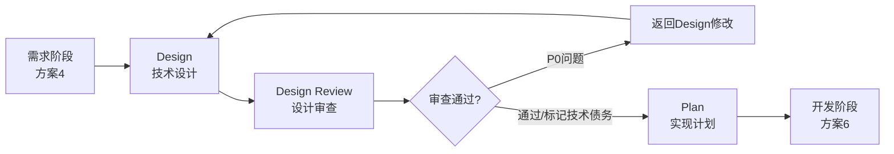
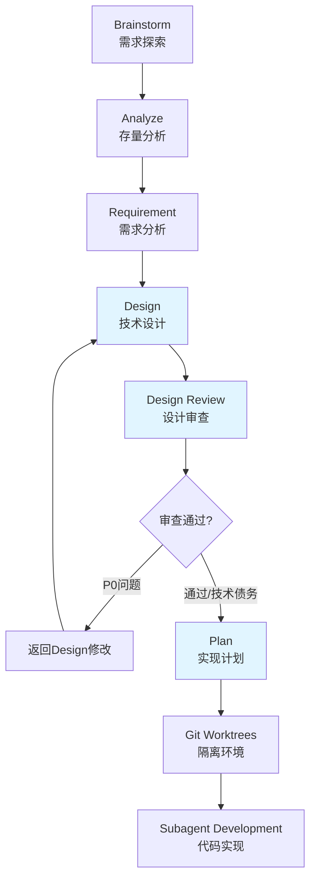

# 方案5：节点Skill第2组（设计阶段）

> **版本**: v1.0
> **日期**: 2026-03-01
> **状态**: 设计完成
> **实施进度**: 待实施

---

## 📋 概述

本方案实施 Cadence v2.4 MVP 的**设计阶段**3个核心节点Skills，包括：
- **Design** - 技术设计
- **Design Review** - 设计审查
- **Plan** - 实现计划

这3个节点承接需求阶段（方案4）的输出，为开发阶段（方案6）提供完整的技术方案和实现计划。

---

## 🎯 设计目标

### 核心目标

1. **技术设计完整性**：Design节点生成完整的技术方案（架构、数据模型、API、技术选型）
2. **设计质量保证**：Design Review节点提供系统性审查（8个维度，P0/P1/P2优先级）
3. **实现计划可行性**：Plan节点生成详细的任务分解、依赖关系、并行执行建议
4. **闭环反馈机制**：Design ↔ Design Review 形成闭环，支持带着审查报告重新设计

### 关键特性

- ✅ **灵活的依赖关系**：支持已有文档、跳过Design Review等场景
- ✅ **审查报告闭环**：Design Review → Design（带着审查报告）→ 修改 → Design Review
- ✅ **职责边界清晰**：Design（技术方案）vs Design Review（审查）vs Plan（任务分解）
- ✅ **技术栈配置集成**：从CLAUDE.md读取技术栈配置，输出到实现计划
- ✅ **Subagent支持**：Plan输出支持Subagent Development的任务分配和并发执行

---

## 📦 实施内容

### 1. Skills清单（3个）

| Skill名称 | 文件路径 | 行数（预估） | 来源 | 说明 |
|----------|---------|------------|------|------|
| **design** | `skills/design/SKILL.md` | ~450行 | 全新设计 | 技术设计节点 |
| **design-review** | `skills/design-review/SKILL.md` | ~500行 | 全新设计 | 设计审查节点 |
| **plan** | `skills/plan/SKILL.md` | ~480行 | 全新设计 | 实现计划节点 |

**总代码量**: ~1430行

### 2. Commands清单（3个）

| Command名称 | 文件路径 | 说明 |
|------------|---------|------|
| **/design** | `commands/design.md` | 调用design skill |
| **/design-review** | `commands/design-review.md` | 调用design-review skill |
| **/plan** | `commands/plan.md` | 调用plan skill |

---

## 🔄 流程设计

### 完整流程



### 灵活流程

**支持场景**：

1. **完整流程**（复杂功能）
   ```
   Requirement → Design → Design Review → Plan → Git Worktrees
   ```

2. **快速流程**（简单功能）
   ```
   Requirement → Design → Plan → Git Worktrees（跳过Design Review）
   ```

3. **已有文档流程**
   ```
   已有技术方案 → Design Review → Plan
   已有技术方案 → Plan（跳过Design Review）
   ```

4. **审查报告闭环**
   ```
   Design → Design Review（发现问题）→ Design（带着审查报告修改）→ Design Review（通过）→ Plan
   ```

---

## 📄 Skill详细设计

### 4.1 Design - 技术设计

**详细设计文档**: [skills/design/SKILL.md](./skills/design/SKILL.md)

**核心职责**：
- ✅ 基于需求文档和存量分析，设计技术方案
- ✅ 支持带着审查报告重新设计
- ✅ 输出完整的技术方案（架构、数据模型、API、技术选型）

**关键特性**：
- 输入：需求文档（可选）、存量分析报告（可选）、审查报告（可选）
- 输出：技术方案文档
- 时间估计：15-120分钟（根据复杂度）
- 工具：Serena MCP（read_file, write_file）、Mermaid（架构图、ER图、序列图）

**触发条件**：
- 用户说"技术设计..."、"技术方案..."、"架构设计..."
- 已有需求文档，准备进入设计阶段
- Design Review后返回修改（带着审查报告）

---

### 4.2 Design Review - 设计审查

**详细设计文档**: [skills/design-review/SKILL.md](./skills/design-review/SKILL.md)

**核心职责**：
- ✅ 对技术方案进行系统性审查（8个维度）
- ✅ 生成审查报告（P0/P1/P2问题分类）
- ✅ 不生成修复后的技术方案（只生成审查报告）

**关键特性**：
- 输入：技术方案文档
- 输出：审查报告
- 时间估计：10-60分钟（根据复杂度）
- 审查维度：架构（P0）、数据模型（P0）、API（P0）、安全（P0）、性能（P1）、可维护性（P1）、兼容性（P2）、风险（P1）

**触发条件**：
- 全流程模式下必须进行
- 用户明确要求进行审查
- 复杂架构需要审查

**跳过条件**：
- 极简模式（简单功能）
- 探索模式（原型开发）
- 用户明确表示不需要

---

### 4.3 Plan - 实现计划

**详细设计文档**: [skills/plan/SKILL.md](./skills/plan/SKILL.md)

**核心职责**：
- ✅ 基于技术方案，制定详细的任务分解和执行计划
- ✅ 识别任务依赖关系和并行执行机会
- ✅ 为Subagent Development提供任务分配支持

**关键特性**：
- 输入：技术方案（必须）、审查报告（可选）、需求文档（可选）
- 输出：实现计划文档
- 时间估计：5-40分钟（根据复杂度）
- 任务粒度：1-4小时，可独立完成
- 工具：Serena MCP（read_file, write_file）、Mermaid（依赖关系图、甘特图）

**触发条件**：
- 用户说"实现计划..."、"任务分解..."、"开发计划..."
- 已有技术方案，准备进入开发阶段

**技术栈配置**：
- 从CLAUDE.md读取项目技术栈配置
- 输出到实现计划的"技术栈配置"章节
- 每个任务继承项目技术栈配置

---

## 🔗 依赖关系

### 前置依赖

**方案5依赖于**：
- ✅ **方案1**：基础架构 + 配置 + Hooks
- ✅ **方案2**：元Skill + Init Skill
- ⚠️ **方案4**：节点Skill第1组（需求阶段）- **可选依赖**
  - Design可以使用已有的需求文档，不强制依赖Requirement节点
  - Design可以使用已有的存量分析报告，不强制依赖Analyze节点

### 下一步

**方案5支持**：
- ⏳ **方案6**：节点Skill第3组（开发阶段）
  - Git Worktrees：基于Plan输出创建隔离环境
  - Subagent Development：基于Plan任务清单执行开发

---

## 📋 节点依赖关系图



**说明**：蓝色节点为本方案实施的节点

---

## 🎓 设计亮点

### 1. 审查报告闭环机制

**Design ↔ Design Review 闭环**：
- Design Review发现问题 → 返回Design修改（带着审查报告）
- Design读取审查报告 → 针对问题修改设计 → 生成修改后的技术方案
- 重新进入Design Review → 确认问题已解决

**P0问题处理策略**：
- ✅ 立即修复：问题影响核心功能，必须修复
- ✅ 标记技术债务：问题可以延后修复，记录原因和计划
- ✅ 重新设计：技术方案有重大缺陷，完全重新设计

### 2. 灵活的依赖关系

**Design节点灵活性**：
- ✅ 支持已有需求文档，无需重新执行Requirement
- ✅ 支持已有存量分析报告，无需重新执行Analyze
- ✅ 简单需求可以直接进入Design，无需Requirement阶段

**Plan节点灵活性**：
- ✅ 支持跳过Design Review（快速流程、用户明确要求）
- ✅ 支持已有技术方案，无需重新执行Design
- ✅ 极简单功能可以跳过Plan（需用户确认）

### 3. 清晰的职责边界

| 节点 | 职责 | 输入 | 输出 | 关注点 |
|------|------|------|------|--------|
| **Design** | 技术设计 | 需求文档、存量分析、审查报告 | 技术方案 | "怎么做"（技术视角） |
| **Design Review** | 设计审查 | 技术方案 | 审查报告 | "技术方案是否可行" |
| **Plan** | 实现计划 | 技术方案、审查报告 | 实现计划 | "做什么任务"（执行视角） |

### 4. 技术栈配置集成

**Plan节点技术栈配置流程**：
```
CLAUDE.md (用户维护)
    ↓ Plan Skill 读取
实现计划 (tech_stack 配置)
    ↓ Subagent 使用
代码实现 (test/lint/format)
```

**配置优先级**：
1. **User Specified in Conversation**（最高优先级）：用户在对话中指定
2. **CLAUDE.md Configuration**（次优先级）：项目级默认配置
3. **Missing Configuration**（缺失）：提示用户配置CLAUDE.md

### 5. Subagent支持

**Plan输出支持Subagent Development**：
- ✅ 任务描述包含：目标、约束、验收标准、依赖、时间
- ✅ 并行任务识别支持Subagent并发执行
- ✅ 优先级排序支持任务执行顺序
- ✅ YAML格式任务描述，可直接分配给Subagent

---

## ⚠️ 关键注意事项

### 1. Design节点

- ❌ **不要**在Design阶段生成实现计划（实现计划在Plan节点生成）
- ✅ **必须**包含数据模型物理设计（表结构、索引、约束、ER图）
- ✅ **支持**带着审查报告重新设计（优先解决P0问题）

### 2. Design Review节点

- ❌ **不要**生成修复后的技术方案（只生成审查报告）
- ✅ **必须**对P0问题提供明确的修复建议
- ✅ **允许**标记P0问题为技术债务（需记录原因和计划）

### 3. Plan节点

- ❌ **不要**在Plan阶段识别风险（风险已在Design Review完成）
- ✅ **必须**识别并行任务（支持Subagent并发执行）
- ✅ **必须**从CLAUDE.md读取技术栈配置（不自动检测）

---

## 📏 验收标准

### Skills验收标准

- [ ] **Design Skill**
  - [ ] 支持读取需求文档、存量分析报告、审查报告
  - [ ] 生成完整的技术方案（架构、数据模型、API、技术选型）
  - [ ] 支持带着审查报告重新设计
  - [ ] 数据模型包含物理设计（表结构、索引、约束、ER图）
  - [ ] 使用Mermaid绘制架构图、ER图、序列图

- [ ] **Design Review Skill**
  - [ ] 支持8个审查维度（架构、数据模型、API、安全、性能、可维护性、兼容性、风险）
  - [ ] 问题按P0/P1/P2分类
  - [ ] 生成审查报告，不生成修复后的技术方案
  - [ ] 每个问题有明确的修复建议
  - [ ] 支持标记P0问题为技术债务

- [ ] **Plan Skill**
  - [ ] 支持读取技术方案、审查报告、需求文档
  - [ ] 任务粒度1-4小时，可独立完成
  - [ ] 识别任务依赖关系和并行执行机会
  - [ ] 从CLAUDE.md读取技术栈配置
  - [ ] 生成YAML格式任务描述，支持Subagent分配

### Commands验收标准

- [ ] **/design** 命令正确调用design skill
- [ ] **/design-review** 命令正确调用design-review skill
- [ ] **/plan** 命令正确调用plan skill

---

## 🚀 实施步骤

### 预估时间：40-60分钟

1. **实施Design Skill**（15-20分钟）
   - 创建 `skills/design/SKILL.md`
   - 参考：`.claude/designs/2026-02-25_Skill_Design_v1.0.md`
   - 集成Serena MCP工具
   - 实现审查报告输入逻辑

2. **实施Design Review Skill**（15-20分钟）
   - 创建 `skills/design-review/SKILL.md`
   - 参考：`.claude/designs/2026-02-25_Skill_Design_Review_v1.0.md`
   - 实现8维度审查逻辑
   - 实现P0/P1/P2问题分类

3. **实施Plan Skill**（15-20分钟）
   - 创建 `skills/plan/SKILL.md`
   - 参考：`.claude/designs/2026-02-26_Skill_Plan_v1.0.md`
   - 实现技术栈配置读取逻辑
   - 实现并行任务识别

4. **创建Commands**（5分钟）
   - 创建 `commands/design.md`
   - 创建 `commands/design-review.md`
   - 创建 `commands/plan.md`

5. **验证和提交**（5分钟）
   - 验证所有Skills和Commands
   - Git提交和推送

---

## 📚 参考文档

### 设计文档

- **Design Skill设计**: `.claude/designs/2026-02-25_Skill_Design_v1.0.md`
- **Design Review Skill设计**: `.claude/designs/2026-02-25_Skill_Design_Review_v1.0.md`
- **Plan Skill设计**: `.claude/designs/2026-02-26_Skill_Plan_v1.0.md`

### 参考资料

- **superpowers项目**: `/home/michael/workspace/github/superpowers/skills/writing-plans/SKILL.md`
- **已实施Skills**: `skills/brainstorming/SKILL.md`, `skills/analyze/SKILL.md`, `skills/requirement/SKILL.md`

### 主方案文档

- **总方案**: `.claude/designs/2026-02-25_技术方案_使用Claude_Code_Skills的AI自动化开发方案_v2.4.md`

---

## 📝 实施记录

**实施日期**: 待定
**实施人员**: 待定
**实施状态**: 设计完成，待实施

**实施日志**:
- [ ] Design Skill实施完成
- [ ] Design Review Skill实施完成
- [ ] Plan Skill实施完成
- [ ] Commands创建完成
- [ ] Git提交和推送完成

---

## 🎯 下一步

1. **确认方案5设计** - 与用户确认设计方案
2. **开始实施** - 按照实施步骤执行
3. **验证功能** - 测试设计阶段流程
4. **准备方案6** - 设计开发阶段节点Skills

---

**创建时间**: 2026-03-01
**文档版本**: v1.0
**文档状态**: 设计完成，待用户确认
