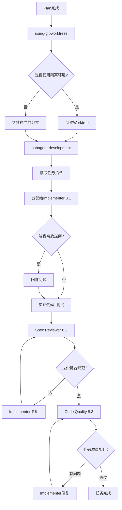
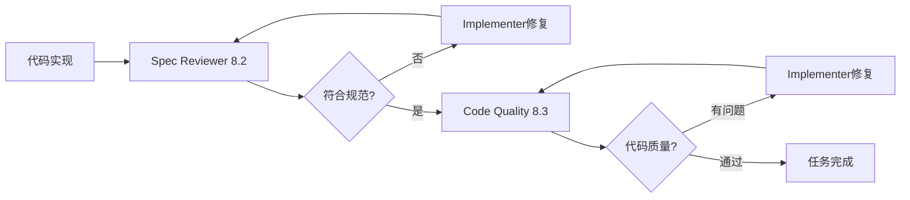

# 方案6：节点 Skill 第3组（开发阶段）

**版本**: v1.0
**创建日期**: 2026-03-02
**状态**: ✅ 设计完成
**预估工作量**: 4-5小时

---

## 📋 方案概述

方案6 包含开发阶段的 2 个核心 Skills 和 3 个 Subagent 定义，负责代码实现和单元测试。

### 核心内容

- **2个核心 Skills**:
  1. `using-git-worktrees` - 创建隔离的开发环境
  2. `subagent-development` - 代码实现 + 单元测试

- **3个 Subagent 定义**:
  1. Implementer Subagent (8.1) - 代码实现
  2. Spec Reviewer Subagent (8.2) - 规范合规审查
  3. Code Quality Reviewer Subagent (8.3) - 代码质量审查

### 依赖关系

**前置依赖**:
- 方案5（plan skill 提供任务清单）

**后续方案**:
- 方案7（流程 Skill + 进度追踪）

---

## 🎯 Skills 清单

### Skill 1: using-git-worktrees

**文档**: [skills/using-git-worktrees/SKILL.md](./skills/using-git-worktrees/SKILL.md)

**职责**: 创建隔离的开发环境，使用 git worktree 避免污染主分支

**核心功能**:
- ✅ 智能目录选择（优先级：现有目录 > CLAUDE.md 配置 > 用户询问）
- ✅ 安全验证（确保 worktree 目录在 .gitignore 中）
- ✅ 自动创建 worktree 和分支
- ✅ 自动运行项目初始化（npm install, cargo build 等）
- ✅ 验证干净的测试基线

**触发条件**:
- 用户说"创建隔离环境"、"git worktree"、"开发分支"
- 需要并行开发多个功能
- 需要避免污染主分支

**依赖关系**:
- 可选依赖：plan skill（提供任务信息）

**输出产物**:
- Git worktree 工作目录
- 新分支（feature/{feature-name}）
- Worktree 信息报告

**Command**: `/worktree`

---

### Skill 2: subagent-development

**文档**: [skills/subagent-development/SKILL.md](./skills/subagent-development/SKILL.md)

**职责**: 使用 Subagent 开发代码，强制遵循 TDD 流程，同时编写单元测试

**核心功能**:
- ✅ 读取 Plan skill 的任务清单（YAML 格式）
- ✅ 按任务分配给不同的 Subagent（8.1/8.2/8.3）
- ✅ 支持 Spec Reviewer 和 Code Quality Reviewer 两阶段审查
- ✅ 支持并行执行（多个 Subagent 同时工作）
- ✅ 自动进行代码质量审查和覆盖率检查（≥ 80%）

**触发条件**:
- 用户说"开始实现"、"执行计划"、"开发代码"
- 已有实现计划准备进入开发阶段

**依赖关系**:
- **必须依赖**: plan skill（提供任务清单和验收标准）
- **强烈建议**: using-git-worktrees skill（提供隔离环境）
- **可选依赖**: design skill（提供技术约束）

**输出产物**:
- 代码实现
- 单元测试（覆盖率 ≥ 80%）
- 测试覆盖率报告
- 代码审查报告
- Git commits

**Command**: `/develop`

---

## 🤖 Subagent 定义

### Subagent 8.1: Implementer Subagent

**Prompt**: [prompts/implementer-prompt.md](./skills/subagent-development/prompts/implementer-prompt.md)

**职责**: 代码实现 + 单元测试

**核心任务**:
- 读取任务描述（来自 Plan skill）
- 询问问题（如有必要）
- 遵循 TDD 流程（RED-GREEN-BLUE）
- 编写代码和单元测试
- 自我审查
- 提交代码

**输入**:
- 任务描述（YAML 格式）
- 技术方案（可选）
- Worktree 信息（可选）

**输出**:
- 代码实现
- 单元测试
- Git commit

---

### Subagent 8.2: Spec Reviewer Subagent

**Prompt**: [prompts/spec-reviewer-prompt.md](./skills/subagent-development/prompts/spec-reviewer-prompt.md)

**职责**: 规范合规审查（确保代码符合需求规范）

**核心任务**:
- 对比代码实现和任务描述
- 检查是否有遗漏的需求
- 检查是否有额外的功能（超出范围）
- 生成审查报告

**输入**:
- 任务描述（YAML 格式）
- 代码实现（Git SHA）

**输出**:
- 审查报告（✅ 通过 / ❌ 有问题）

**审查维度**:
1. **完整性**: 所有需求是否都实现了？
2. **准确性**: 实现是否符合需求描述？
3. **范围**: 是否有额外的功能（超出范围）？
4. **遗漏**: 是否有遗漏的需求？

---

### Subagent 8.3: Code Quality Reviewer Subagent

**Prompt**: [prompts/code-quality-reviewer-prompt.md](./skills/subagent-development/prompts/code-quality-reviewer-prompt.md)

**职责**: 代码质量审查

**核心任务**:
- 检查代码质量（命名、结构、注释）
- 检查测试覆盖率（P0 ≥ 80%）
- 检查是否有安全漏洞
- 生成审查报告

**输入**:
- 代码实现（Git SHA）
- 测试覆盖率报告

**输出**:
- 审查报告（Strengths / Issues / Approved）

**审查维度**:
1. **代码质量**: 命名、结构、注释、可读性、可维护性
2. **测试覆盖率**: 单元测试、覆盖率（≥ 80%）、测试质量
3. **安全性**: SQL注入、XSS、CSRF、敏感信息、输入验证
4. **性能**: N+1查询、内存泄漏、算法效率、资源使用
5. **最佳实践**: DRY、SOLID、YAGNI、项目规范

---

## 🔄 流程图

### 整体流程



### 两阶段审查流程



---

## ✨ 设计亮点

### 1. **两阶段审查机制**

**设计**: 先 Spec Reviewer (8.2) 检查规范合规，再 Code Quality Reviewer (8.3) 检查代码质量

**优势**:
- 避免在错误的方向上浪费时间
- 先确保做对了事情（spec），再确保把事情做好了（quality）
- 减少返工成本

**示例**:
```
Implementer 实现 → Spec Reviewer 发现遗漏需求 → Implementer 修复 →
Spec Reviewer 通过 → Code Quality Reviewer 发现性能问题 → Implementer 修复 → 通过
```

---

### 2. **智能环境隔离**

**设计**:
- 自动检测现有 worktree 目录
- 自动验证 .gitignore 配置
- 自动运行项目初始化
- 验证干净的测试基线

**优势**:
- 减少人工操作
- 提高安全性（避免污染主分支）
- 确保环境一致性

**示例**:
```
检测到 .worktrees/ 存在 → 验证 .gitignore → 创建 worktree →
自动运行 npm install → 验证测试通过 → 准备就绪
```

---

### 3. **Subagent 协作机制**

**设计**:
- Implementer (8.1) 负责实现
- Spec Reviewer (8.2) 负责规范审查
- Code Quality Reviewer (8.3) 负责质量审查

**优势**:
- 职责清晰，相互制衡
- 每个 Subagent 专注一件事
- 新鲜上下文，避免混淆

**示例**:
```
Implementer: 实现 + 测试 + 自审 + 提交
Spec Reviewer: 检查是否符合需求
Code Quality Reviewer: 检查代码质量
```

---

### 4. **TDD 强制执行**

**设计**:
- Implementer 必须遵循 RED-GREEN-BLUE
- 单元测试覆盖率 P0 ≥ 80%
- 测试必须真正验证行为

**优势**:
- 保证代码质量
- 减少回归问题
- 提高代码可维护性

---

### 5. **并行执行支持**

**设计**:
- 多个 Subagent 可以同时工作
- 基于 Plan 的并行任务识别
- Worktree 提供隔离环境

**优势**:
- 提高开发效率
- 充分利用多核 CPU
- 适合大型项目

---

## 📦 Commands 清单

### Command 1: /worktree

**文档**: [commands/worktree.md](./commands/worktree.md)

**对应 Skill**: using-git-worktrees

**使用场景**: 快速创建隔离开发环境

**输出**: Worktree 信息报告

---

### Command 2: /develop

**文档**: [commands/develop.md](./commands/develop.md)

**对应 Skill**: subagent-development

**使用场景**: 开始代码实现（使用 Subagent）

**输出**: 代码实现 + 单元测试 + 审查报告

---

## 🔗 依赖关系

### 前置依赖

**必须**:
- ✅ 方案5（plan skill 提供任务清单）

**可选**:
- 方案4（requirement skill 提供需求文档）
- 方案3（design skill 提供技术方案）

### 后续依赖

**方案7 依赖方案6**:
- full-flow skill 需要调用 subagent-development
- quick-flow skill 需要调用 subagent-development

---

## 📊 验收标准

### Skill 验收

#### using-git-worktrees
- [ ] 目录选择逻辑正确（优先级：现有 > CLAUDE.md > 询问）
- [ ] 安全验证完整（.gitignore 检查）
- [ ] 自动初始化正确（npm install, cargo build 等）
- [ ] 测试基线验证有效

#### subagent-development
- [ ] 任务分配逻辑正确（读取 Plan，提取任务）
- [ ] Implementer Subagent (8.1) 工作正常
- [ ] Spec Reviewer Subagent (8.2) 审查有效
- [ ] Code Quality Reviewer Subagent (8.3) 审查有效
- [ ] 两阶段审查流程正确
- [ ] 测试覆盖率 ≥ 80%

### Subagent 验收

#### Implementer (8.1)
- [ ] 可以提问并获得回答
- [ ] 遵循 TDD 流程
- [ ] 实现完整
- [ ] 自我审查有效

#### Spec Reviewer (8.2)
- [ ] 可以检测遗漏的需求
- [ ] 可以检测额外的功能
- [ ] 审查报告格式正确

#### Code Quality Reviewer (8.3)
- [ ] 可以检测代码质量问题
- [ ] 可以检测安全问题
- [ ] 可以检测性能问题
- [ ] 审查报告格式正确

### Command 验收

- [ ] `/worktree` 命令可以正常调用 using-git-worktrees skill
- [ ] `/develop` 命令可以正常调用 subagent-development skill

---

## 🚀 实施建议

### 实施顺序

1. **创建 Skills**（60-90分钟）
   - using-git-worktrees/SKILL.md
   - subagent-development/SKILL.md

2. **创建 Subagent Prompts**（30-45分钟）
   - prompts/implementer-prompt.md
   - prompts/spec-reviewer-prompt.md
   - prompts/code-quality-reviewer-prompt.md

3. **创建 Commands**（15-20分钟）
   - commands/worktree.md
   - commands/develop.md

4. **验证和测试**（30-45分钟）
   - 测试 using-git-worktrees skill
   - 测试 subagent-development skill
   - 测试 Subagent 协作

### 关键注意事项

1. **两阶段审查顺序**: 必须先 Spec Reviewer，再 Code Quality Reviewer
2. **测试覆盖率**: P0 要求 ≥ 80%，必须严格执行
3. **安全验证**: Worktree 目录必须在 .gitignore 中
4. **Subagent 提问**: 必须允许 Subagent 提问并回答

---

## 📝 文件清单

### Skills（2个）
- [skills/using-git-worktrees/SKILL.md](./skills/using-git-worktrees/SKILL.md)
- [skills/subagent-development/SKILL.md](./skills/subagent-development/SKILL.md)

### Subagent Prompts（3个）
- [skills/subagent-development/prompts/implementer-prompt.md](./skills/subagent-development/prompts/implementer-prompt.md)
- [skills/subagent-development/prompts/spec-reviewer-prompt.md](./skills/subagent-development/prompts/spec-reviewer-prompt.md)
- [skills/subagent-development/prompts/code-quality-reviewer-prompt.md](./skills/subagent-development/prompts/code-quality-reviewer-prompt.md)

### Commands（2个）
- [commands/worktree.md](./commands/worktree.md)
- [commands/develop.md](./commands/develop.md)

---

## 📚 相关文档

### 主方案文档
- [技术方案 v2.4](../2026-02-25_技术方案_使用Claude_Code_Skills的AI自动化开发方案_v2.4.md)

### 前置方案
- [方案5: 节点Skill第2组（设计阶段）](./方案5_节点Skill_第2组.md)

### 参考项目
- [superpowers: using-git-worktrees](/home/michael/workspace/github/superpowers/skills/using-git-worktrees/SKILL.md)
- [superpowers: subagent-driven-development](/home/michael/workspace/github/superpowers/skills/subagent-driven-development/SKILL.md)

---

**创建日期**: 2026-03-02
**最后更新**: 2026-03-02
**维护者**: Cadence Team
