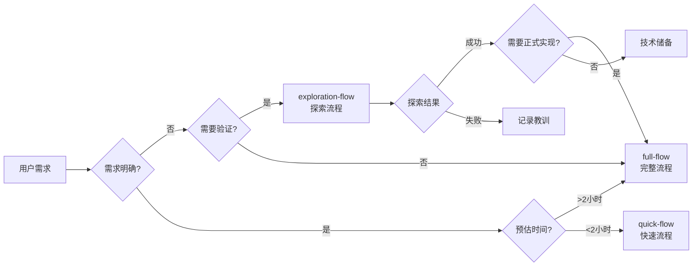

# 方案7：流程 Skill + 进度追踪

**版本**: v1.0
**创建日期**: 2026-03-02
**状态**: ✅ 设计完成
**预估工作量**: 2-3小时

---

## 📋 方案概述

方案7 包含 3 个流程 Skills 和 5 个进度追踪 Commands，负责流程编排和进度管理。

### 核心内容

- **3个流程 Skills**:
  1. `full-flow` - 完整开发流程（8个节点）
  2. `quick-flow` - 快速开发流程（4个节点）
  3. `exploration-flow` - 探索流程（4个节点 + 迭代）

- **5个进度追踪 Commands**:
  1. `/status` - 查看当前进度
  2. `/resume` - 恢复进度
  3. `/checkpoint` - 创建检查点
  4. `/report` - 生成报告（每日/周报）
  5. `/monitor` - 实时监控

### 依赖关系

**前置依赖**:
- 方案1-6（所有节点 Skills）

**后续依赖**:
- 无（最后一个方案）

---

## 🎯 Skills 清单

### Skill 1: full-flow

**文档**: [skills/full-flow/SKILL.md](./skills/full-flow/SKILL.md)

**职责**: 完整的开发流程，包含8个节点（v2.4 MVP）

**核心功能**:
- ✅ 顺序调用 8 个节点 Skills
- ✅ 每个节点完成后要求人工确认
- ✅ 支持并行执行（在 Subagent Development 阶段）
- ✅ 支持断点续传
- ✅ 保存 Checkpoint（每个节点完成后）

**触发条件**:
- 用户说"完整流程"、"完整开发"、"标准流程"
- 复杂功能开发（预估 >2小时）
- 团队协作项目
- 企业级应用

**流程节点（v2.4 MVP）**:
1. Brainstorm（需求探索）
2. Analyze（存量分析）
3. Requirement（需求分析）
4. Design（技术设计）
5. Design Review（设计审查）
6. Plan（实现计划）
7. Git Worktrees（隔离环境）
8. Subagent Development（代码实现+单元测试）

**依赖关系**:
- 依赖所有节点 Skills（方案1-6）

**输出产物**:
- 所有节点的输出产物
- 完整的项目文档
- 代码实现 + 单元测试
- 8 个 Checkpoints

**时间预估**:
- 🟢 简单（<500行）: 3-4小时
- 🟡 中等（500-2000行）: 4-7小时
- 🔴 复杂（>2000行）: 7-12小时

---

### Skill 2: quick-flow

**文档**: [skills/quick-flow/SKILL.md](./skills/quick-flow/SKILL.md)

**职责**: 快速开发流程，只包含4个核心节点

**核心功能**:
- ✅ 跳过需求探索、存量分析、设计、设计审查
- ✅ 直接从 Requirement 开始
- ✅ 适合简单功能和个人项目
- ✅ 简化需求文档和实现计划

**触发条件**:
- 用户说"快速流程"、"快速开发"、"简单功能"
- 简单功能（预估 <2小时）
- 需求明确
- 个人项目
- 紧急修复
- 全新模块

**流程节点（v2.4 MVP）**:
1. Requirement（需求分析）- 简化版
2. Plan（实现计划）- 简单任务分解
3. Git Worktrees（隔离环境）
4. Subagent Development（代码实现+单元测试）

**精简说明**:
- ❌ 跳过 Brainstorm（需求明确）
- ❌ 跳过 Analyze（不涉及存量代码）
- ❌ 跳过 Design（简单功能）
- ❌ 跳过 Design Review（极简设计）

**依赖关系**:
- 依赖节点 Skills: requirement, plan, using-git-worktrees, subagent-development

**输出产物**:
- 需求文档（简化版）
- 实现计划（简化版）
- 代码实现 + 单元测试
- 4 个 Checkpoints

**时间预估**:
- 🟢 极简单（<200行）: 45-75分钟
- 🟡 简单（200-500行）: 75-140分钟

**风险提示**:
- ⚠️ 跳过 Design 可能导致技术方案不完整（建议 >2小时的功能不要使用）
- ⚠️ 跳过 Analyze 可能导致重复造轮子（涉及存量代码不要使用）
- ⚠️ 跳过 Design Review 可能导致设计缺陷（企业级项目不要使用）

---

### Skill 3: exploration-flow

**文档**: [skills/exploration-flow/SKILL.md](./skills/exploration-flow/SKILL.md)

**职责**: 探索流程，支持迭代和4种结局

**核心功能**:
- ✅ 允许迭代（Subagent Development → 评估 → 循环）
- ✅ 支持4种结局（转标准流程、继续探索、技术储备、记录教训）
- ✅ 原型代码质量要求较低（但必须能验证核心想法）
- ✅ 聚焦核心想法验证

**触发条件**:
- 用户说"探索流程"、"原型开发"、"POC验证"、"技术研究"
- 不确定的需求
- 技术研究
- 原型开发
- 实验性功能
- 学习新技术

**流程节点（v2.4 MVP）**:
1. Brainstorm（需求探索）- 允许需求不明确
2. Analyze（存量分析）- 简化分析
3. Git Worktrees（隔离环境）- poc/{feature-name} 分支
4. Subagent Development（原型+测试）- 原型代码
5. 评估 → 4种结局

**4种结局**:

| 结局 | 触发条件 | 后续动作 | 产物 |
|------|---------|---------|------|
| **结局1: 转标准流程** | 功能可行 + 需要正式实现 | 清理POC代码 → 启动完整流程（从Design开始） | POC报告 + 技术方案 |
| **结局2: 继续探索** | 功能可行但需要调整 | 调整需求 → 再次循环 Subagent Development | 迭代记录 |
| **结局3: 技术储备完成** | 功能可行但暂不需要 | 清理POC代码 → 记录技术方案到 .claude/docs/ | 技术储备文档 |
| **结局4: 记录教训** | 功能不可行 | 清理POC代码 → 记录失败原因和教训 | 失败分析报告 |

**依赖关系**:
- 依赖节点 Skills: brainstorming, analyze, using-git-worktrees, subagent-development

**输出产物**:
- 根据结局不同，输出不同的产物
- POC报告 / 技术储备文档 / 失败分析报告

**时间预估**:
- 🟢 浅层探索（1次迭代）: 65-125分钟
- 🟡 中层探索（2-3次迭代）: 2-3.5小时
- 🔴 深层探索（>3次迭代）: 3.5-6小时

**重要提示**:
- 📌 探索流程允许失败，失败也是宝贵经验
- 📌 原型代码质量要求较低，但必须能验证核心想法
- 📌 探索成功后，如果需要正式实现，建议从Design节点开始（而不是直接使用POC代码）
- 📌 探索流程的产物可能不是最终代码，而是技术验证报告

---

## 📦 Commands 清单

### Command 1: /status

**文档**: [commands/status.md](./commands/status.md)

**对应功能**: 查看当前进度

**输出内容**:
- 项目信息（名称、流程类型、当前阶段、Git分支）
- 整体进度（百分比、节点完成情况）
- 节点完成情况（已完成/进行中/待完成）
- 任务进度详情（TodoWrite 状态）
- 时间统计
- Git 提交记录
- 会话记忆信息
- 下一步行动

---

### Command 2: /resume

**文档**: [commands/resume.md](./commands/resume.md)

**对应功能**: 恢复进度

**输出内容**:
- 检测中断场景
- 扫描可用记忆（Session Summary、Checkpoint、失败日志）
- 确定恢复点
- 重建上下文（Git状态、TodoWrite、项目上下文、会话上下文）
- 继续执行

**恢复场景**:
- 正常中断
- 异常中断
- 任务失败
- 依赖阻塞
- 外部变更

---

### Command 3: /checkpoint

**文档**: [commands/checkpoint.md](./commands/checkpoint.md)

**对应功能**: 创建检查点

**输出内容**:
- 任务信息
- 任务上下文
- 完成情况
- 验证结果
- 输出产物
- 关键决策
- Git 提交

**自动创建时机**:
- 每个节点完成后
- 每个任务完成后
- 测试失败后
- 审查失败后
- 会话中断前

---

### Command 4: /report

**文档**: [commands/report.md](./commands/report.md)

**对应功能**: 生成报告

**命令参数**:
```bash
/report [--daily | --weekly]
```

**输出内容**:

**每日报告**:
- 今日完成
- 今日统计（工作时长、完成任务、代码提交、测试覆盖率）
- 遇到的问题
- 明日计划

**周报**:
- 本周概览
- 本周完成
- 本周统计
- 关键决策
- 遇到的问题
- 下周计划
- 风险和阻塞

---

### Command 5: /monitor

**文档**: [commands/monitor.md](./commands/monitor.md)

**对应功能**: 实时监控

**命令参数**:
```bash
/monitor [--refresh <seconds> | --once]
```

**输出内容**:
- 实时任务状态
- 进度变化提醒
- 警告和阻塞提醒
- 性能指标
- 预估完成时间

**自动刷新**:
- 默认：5秒
- 可配置：自定义刷新间隔
- 可禁用：只显示一次

---

## 🔄 流程图

### 整体架构

```mermaid
graph TB
    A[方案7: 流程Skill + 进度追踪] --> B[3个流程Skills]
    A --> C[5个进度追踪Commands]

    B --> B1[full-flow<br/>完整流程]
    B --> B2[quick-flow<br/>快速流程]
    B --> B3[exploration-flow<br/>探索流程]

    B1 --> B1a[8个节点<br/>Brainstorm → Analyze → Requirement → Design → Design Review → Plan → Git Worktrees → Subagent Development]

    B2 --> B2a[4个节点<br/>Requirement → Plan → Git Worktrees → Subagent Development]

    B3 --> B3a[4个节点 + 迭代<br/>Brainstorm → Analyze → Git Worktrees → Subagent Development → 评估 → 4种结局]

    C --> C1[/status<br/>查看进度]
    C --> C2[/resume<br/>恢复进度]
    C --> C3[/checkpoint<br/>创建检查点]
    C --> C4[/report<br/>生成报告]
    C --> C5[/monitor<br/>实时监控]

    B1a --> D[基于 Serena MCP 的进度追踪系统]
    B2a --> D
    B3a --> D

    C1 --> D
    C2 --> D
    C3 --> D
    C4 --> D
    C5 --> D
```

### 3种流程对比



---

## ✨ 设计亮点

### 1. **流程灵活性**

**3种流程模式适应不同场景**:

| 流程 | 节点数 | 适用场景 | 时间预估 |
|------|--------|---------|---------|
| **完整流程** | 8个 | 企业级项目、复杂功能 | 3-12小时 |
| **快速流程** | 4个 | 个人项目、简单功能 | 45-140分钟 |
| **探索流程** | 4个+迭代 | 技术研究、原型开发 | 65分钟-6小时 |

**智能选择**:
- 根据需求明确度、功能复杂度、项目类型自动推荐
- 用户也可以手动指定

---

### 2. **进度可视化**

**5个维度全方位监控**:

1. **实时状态** (`/status`) - 全面的进度视图
2. **恢复机制** (`/resume`) - 断点续传
3. **检查点** (`/checkpoint`) - 手动保存进度
4. **报告生成** (`/report`) - 每日/周报
5. **实时监控** (`/monitor`) - 动态更新

**可视化特点**:
- 进度条显示（百分比）
- 节点完成状态（已完成/进行中/待完成）
- 任务详情（测试、审查、覆盖率）
- 时间统计（已用时间、预估剩余）
- Git 提交记录

---

### 3. **断点续传**

**基于 Serena MCP 的会话记忆系统**:

**核心组件**:
- **Session Summary** - 会话概览
- **Checkpoint** - 任务检查点
- **失败日志** - 问题追踪

**恢复流程**:
1. 检测中断场景
2. 扫描可用记忆
3. 确定恢复点
4. 重建上下文（Git状态、TodoWrite、项目上下文、会话上下文）
5. 继续执行

**支持的恢复场景**:
- 正常中断（用户主动结束）
- 异常中断（网络/系统故障）
- 任务失败（重试次数耗尽）
- 依赖阻塞（前置任务未完成）
- 外部变更（计划/需求变更）

---

### 4. **迭代支持**

**exploration-flow 支持迭代**:

**迭代机制**:
- 允许多次循环 Subagent Development
- 每次迭代记录调整和改进
- 支持深度探索（>3次迭代）

**4种结局**:
1. **转标准流程** - 功能可行 + 需要正式实现
2. **继续探索** - 功能可行但需要调整
3. **技术储备完成** - 功能可行但暂不需要
4. **记录教训** - 功能不可行

**允许失败**:
- 探索失败也是宝贵经验
- 记录失败原因和教训
- 为未来提供参考

---

### 5. **人工确认机制**

**每个节点完成后要求人工确认**:

**确认问题格式**:
```
{节点名称}已完成：
- {产物1}：{内容}
- {产物2}：{内容}

是否确认？
├── ✅ 确认 → 进入下一节点
├── ⚠️ 需要调整 → 重新执行当前节点
└── ❌ 不满意 → 重新执行当前节点
```

**优势**:
- 防止跳跃关键步骤
- 保证质量和流程完整性
- 及时发现和纠正问题

---

## 🔗 依赖关系

### 前置依赖

**必须**:
- ✅ 方案1-6（所有节点 Skills）

**具体依赖**:
- 方案4: brainstorming, analyze, requirement
- 方案5: design, design-review, plan
- 方案6: using-git-worktrees, subagent-development

---

## 📊 验收标准

### Skill 验收

#### full-flow
- [ ] 是否能顺序调用 8 个节点 Skills？
- [ ] 每个节点完成后是否要求人工确认？
- [ ] 是否保存 Checkpoint（8个）？
- [ ] 是否支持断点续传？

#### quick-flow
- [ ] 是否只调用 4 个节点 Skills？
- [ ] 是否生成简化版需求文档和实现计划？
- [ ] 是否跳过了 Brainstorm、Analyze、Design、Design Review？
- [ ] 是否保存 Checkpoint（4个）？

#### exploration-flow
- [ ] 是否能支持迭代？
- [ ] 是否支持 4 种结局？
- [ ] 是否能清理和归档 POC 代码？
- [ ] 是否能生成对应的产物（POC报告/技术储备文档/失败分析报告）？

### Command 验收

#### /status
- [ ] 是否显示完整的项目进度信息？
- [ ] 是否显示节点完成情况？
- [ ] 是否显示任务进度详情？
- [ ] 是否显示时间统计和 Git 提交记录？

#### /resume
- [ ] 是否能检测中断场景？
- [ ] 是否能扫描可用记忆？
- [ ] 是否能重建上下文？
- [ ] 是否能继续执行未完成的任务？

#### /checkpoint
- [ ] 是否能手动创建检查点？
- [ ] 是否保存任务信息、完成情况、关键决策？

#### /report
- [ ] 是否能生成每日报告？
- [ ] 是否能生成周报？
- [ ] 是否包含统计数据、遇到的问题、下一步计划？

#### /monitor
- [ ] 是否能实时监控任务状态？
- [ ] 是否能显示进度变化提醒？
- [ ] 是否能显示警告和阻塞提醒？
- [ ] 是否支持自动刷新？

---

## 🚀 实施建议

### 实施顺序

1. **创建流程 Skills**（60-90分钟）
   - full-flow/SKILL.md
   - quick-flow/SKILL.md
   - exploration-flow/SKILL.md

2. **创建进度追踪 Commands**（30-45分钟）
   - commands/status.md
   - commands/resume.md
   - commands/checkpoint.md
   - commands/report.md
   - commands/monitor.md

3. **验证和测试**（30-45分钟）
   - 测试 3 个流程 Skills
   - 测试 5 个 Commands

### 关键注意事项

1. **流程调用顺序**: 必须按节点顺序调用，不能跳过
2. **人工确认**: 每个节点完成后必须要求人工确认
3. **Checkpoint 保存**: 每个节点完成后必须保存 Checkpoint
4. **探索流程迭代**: 允许多次迭代，记录每次迭代的调整和改进
5. **POC 代码清理**: 探索流程结束后必须清理和归档 POC 代码

---

## 📝 文件清单

### Skills（3个）
- [skills/full-flow/SKILL.md](./skills/full-flow/SKILL.md)
- [skills/quick-flow/SKILL.md](./skills/quick-flow/SKILL.md)
- [skills/exploration-flow/SKILL.md](./skills/exploration-flow/SKILL.md)

### Commands（5个）
- [commands/status.md](./commands/status.md)
- [commands/resume.md](./commands/resume.md)
- [commands/checkpoint.md](./commands/checkpoint.md)
- [commands/report.md](./commands/report.md)
- [commands/monitor.md](./commands/monitor.md)

---

## 📚 相关文档

### 主方案文档
- [技术方案 v2.4](../2026-02-25_技术方案_使用Claude_Code_Skills的AI自动化开发方案_v2.4.md)
- [进度追踪与状态管理 v1.0](../2026-02-26_进度追踪与状态管理_v1.0.md)

### 前置方案
- [方案1: 基础架构 + 配置 + Hooks](./方案1_基础架构_配置_Hooks.md)
- [方案2: 元Skill + Init Skill](./方案2_元Skill_InitSkill.md)
- [方案3: 前置Skill + 支持 Skill](./方案3_前置Skill_支持Skill.md)
- [方案4: 节点Skill第1组（需求阶段）](./方案4_节点Skill_第1组.md)
- [方案5: 节点Skill第2组（设计阶段）](./方案5_节点Skill_第2组.md)
- [方案6: 节点Skill第3组（开发阶段）](./方案6_节点Skill_第3组.md)

---

## 🎉 项目完成

**方案7是最后一个方案**，完成后：
- ✅ v2.4 MVP 版本全部完成（7/7方案）
- ✅ 所有 Skills 和 Commands 可用
- ✅ 可以开始整体测试
- ✅ 准备 v2.4 MVP 发布

---

**创建日期**: 2026-03-02
**最后更新**: 2026-03-02
**维护者**: Cadence Team
