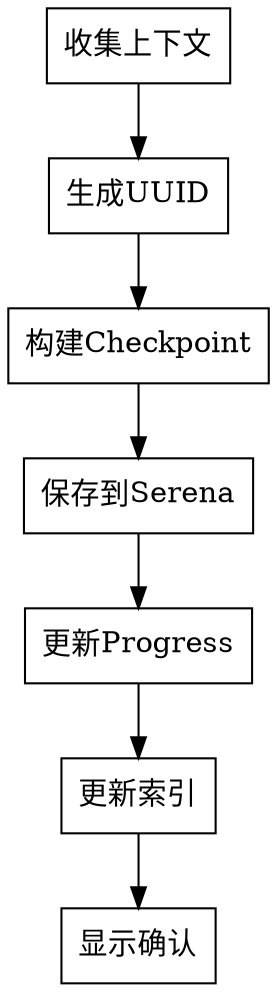

# Checkpoint - 创建检查点

## 使用场景

手动创建项目检查点,保存当前进度状态。

## 功能描述

创建检查点,保存:
- 任务信息(Task ID、标题、状态)
- 任务上下文(依赖关系、优先级)
- 完成情况(实现内容、验证结果、输出产物)
- 关键决策
- 遇到的问题和解决方案
- Git 提交

## 数据来源

此命令从以下来源收集数据

### Git 信息

```bash
# 当前分支
git branch --show-current

# 最近提交 (last 10)
git log --oneline -10

# 工作目录状态
git status --short
```

### TodoWrite 状态

```markdown
# 获取所有任务状态
TodoWrite/List

# 返回示例
[
  {
    "id": "1",
    "subject": "Design authentication flow",
    "status": "completed"
  },
  {
    "id": "2",
    "subject": "Design password hashing",
    "status": "in_progress"
  }
]
```

### 项目上下文

```markdown
# 读取项目信息
.claude/CLAUDE.md
- 项目名称
- 项目ID
- 当前阶段
- 流程类型
```

## 执行逻辑

### 流程图



### 1. 收集上下文

```markdown
1. 读取 Git 信息
   - 当前分支
   - 最近10次提交
   - 工作目录状态

2. 读取 TodoWrite 状态
   - 所有任务
   - 任务状态
   - 依赖关系

3. 读取项目上下文
   - 项目元数据
   - 当前阶段
   - 流程类型
```

### 2. 生成UUID

```bash
# 使用 Python
python3 -c 'import uuid; print(str(uuid.uuid4()))'

# 或使用 macOS
uuidgen
```

### 3. 构建Checkpoint

```yaml
metadata:
  version: "1.0"
  checkpoint_id: "{uuid}"
  project_id: "{from project}"

phase: "{current phase}"
task_id: "{current task ID or null}"
status: "{phase status}"
timestamp: "{ISO 8601}"

context:
  git_branch: "{current branch}"
  git_commits: ["{commit1}", "{commit2}", ...]
  todowrite_state: [{task1}, {task2}, ...]
  project_context: {project info}

output: "{output file path or null}"

ttl: 2592000  # 30 days
created_at: "{timestamp}"
expires_at: "{created_at + 30 days}"
```

### 4. 保存到Serena

```markdown
Call: mcp__serena__write_memory
Parameters:
  memory_name: "checkpoint-{project_id}-{phase}-{uuid}"
  content: {checkpoint YAML/JSON}
```

### 5. 更新Progress

```markdown
1. 读取 progress-{project_id}
2. 更新当前阶段信息
3. 更新 timestamp
4. 保存 progress
```

### 6. 更新索引

```markdown
1. 时间索引
   memory: index-{project_id}-checkpoints-by-time
   更新: 添加 checkpoint ID 到今天的日期

2. 阶段索引
   memory: index-{project_id}-checkpoints-by-phase
   更新: 添加 checkpoint ID 到当前阶段

3. 项目索引
   memory: index-checkpoints-by-project
   更新: 添加 checkpoint ID 到项目
```

## 工具使用

### MCP 工具

```markdown
# 写入Checkpoint
mcp__serena__write_memory
  memory_name: "checkpoint-user-auth-design-550e8400..."
  content: {checkpoint data}
  max_chars: -1

# 读取Progress
mcp__serena__read_memory
  memory_name: "progress-user-auth"

# 更新Progress
mcp__serena__write_memory
  memory_name: "progress-user-auth"
  content: {updated progress}

# 更新索引
mcp__serena__write_memory
  memory_name: "index-user-auth-checkpoints-by-time"
  content: {updated index}
```

### UUID 生成

```python
import uuid

checkpoint_id = str(uuid.uuid4())
# Example: 550e8400-e29b-41d4-a716-446655440000
```

## 输出格式

```markdown
✅ Checkpoint created successfully!

Checkpoint ID: 550e8400-e29b-41d4-a716-446655440000
Memory: checkpoint-user-auth-design-550e8400-e29b-41d4-a716-446655440000
Phase: design
Status: in_progress
Expires: 2026-04-03 15:30:00Z
```

## 自动创建时机

除了手动创建,以下情况会自动创建Checkpoint:
- 每个节点完成后
- 每个任务完成后
- 测试失败后
- 审查失败后

## 相关命令

**相关进度命令**:
- `/status` - 查看进度
- `/resume` - 恢复进度
- `/report` - 生成报告
