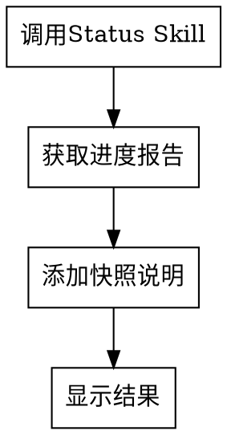

# Monitor - 状态快照

## 使用场景

快速查看当前任务状态,获取进度快照。

## 功能描述

提供快速状态检查:
- 显示当前阶段和任务
- 显示进度百分比
- 显示时间消耗
- 提供下一步行动

**⚠️ 重要**: 这是一个**一次性快照**,不是实时监控。Claude Code不支持后台任务或自动刷新。要看到更新,请再次运行 `/monitor`。

## 数据来源

此命令调用 `status` skill获取当前进度

### 调用Status Skill

```markdown
# 调用status skill
skill: status

# 获取完整进度报告
```

### 添加快照信息

```markdown
# 添加时间戳和快照说明
---
⏰ Snapshot captured at {current_timestamp}

💡 This is a one-time status snapshot. To see updates, run /monitor again.
 The status does not update in real-time.
```

## 执行逻辑

### 流程图



### 1. 调用Status Skill

```markdown
1. 调用 status skill
2. 获取完整的进度报告
3. 不修改status skill的输出格式
```

### 2. 添加快照信息

```python
# 获取当前时间戳
timestamp = datetime.now().strftime("%Y-%m-%d %H:%M:%S")

# 添加快照说明
snapshot_note = f"""
---
⏰ Snapshot captured at {timestamp}

💡 This is a one-time status snapshot. To see updates, run /monitor again.
 The status does not update in real-time.
"""
"""

# 合并输出
output = status_output + "\n" + snapshot_note
```

### 3. 显示结果

```markdown
📊 [status skill输出]
+
⏰ Snapshot captured at 2026-03-04 16:30:00
💡 This is a one-time status snapshot. To see updates, run /monitor again.
 The status does not update in real-time.
```

## 工具使用

### Skill调用

```markdown
# 调用status skill
调用 skill: status
参数: 无（使用当前项目上下文）

返回: 完整的进度报告
```

### 时间戳生成

```python
from datetime import datetime

# 生成时间戳
timestamp = datetime.now().strftime("%Y-%m-%d %H:%M:%S")
```

## 输出格式

```markdown
# Cadence 项目进度

## 项目信息
- **项目名称**: User Authentication System
- **流程类型**: full-flow
- **当前阶段**: Design (进行中)
- **Git 分支**: feature/user-auth
- **工作目录**: /projects/user-auth

## 整体进度
[████████░░░] 72% (8/11 节点)

## 当前任务
```
🔄 Task 2: 实现权限分配 ← 当前
├─ 状态: in_progress
├- 开始: 2小时前
├- 测试: ❌ 失败（2/3 重试)
├- 审查: 待执行
```

## 下一步行动
1. 修复 Task 2 测试失败
2. 提交 Task 2 审查
3. 开始 Task 3（依赖 Task 2 完成）

---
⏰ Snapshot captured at 2026-03-04 16:30:00
💡 This is a one-time status snapshot. To see updates, run /monitor again.
 The status does not update in real-time.
```

## Monitor vs Status vs Report

| 命令 | 目的 | 何时使用 |
|------|-----|---------|
| `/monitor` | 快速快照 | 快速查看当前状态 |
| `/status` | 详细状态 | 完整进度概览 |
| `/report` | 完整历史 | 记录工作成果,创建报告文件 |

## 常见误区

### ❌ 期望实时监控

```markdown
# ❌ 错误期望
这个命令会每5秒自动刷新

# ✅ 正确理解
这是一个一次性快照。要看到更新,请再次运行 /monitor
```

### ❌ 重复Status逻辑

```python
# ❌ 错误: 重复status的逻辑
def monitor():
    # 重新实现status的逻辑
    progress = read_memory(...)
    # 计算...
    # 格式化...
    print(output)

# ✅ 正确: 调用status skill
def monitor():
    output = invoke_skill("status")
    output += snapshot_note
    print(output)
```

### ❌ 不添加快照说明

```markdown
# ❌ 错误: 没有说明是快照
📊 Progress: 72%
[没有说明]

# ✅ 正确: 明确说明是快照
📊 Progress: 72%
---
⏰ Snapshot captured at 16:30:00
💡 This is a one-time status snapshot. Run /monitor again to see updates.
 The status does not update in real-time.
```

## 使用示例

### 基本使用

```bash
/monitor
```

### 输出结果

```markdown
# Cadence 项目进度

## 项目信息
- **项目名称**: User Authentication System
- **流程类型**: full-flow
- **当前阶段**: Design (进行中)
- **Git 分支**: feature/user-auth

## 整体进度
[████████░░░] 72% (8/11 节点)

## 当前任务
🔄 Task 2: 实现权限分配
├- 状态: in_progress
├- 开始: 2小时前
├- 测试: ❌ 失败（2/3 重试）

## 下一步行动
1. 修复 Task 2 测试失败
2. 提交 Task 2 审查

---
⏰ Snapshot captured at 2026-03-04 16:30:00
💡 This is a one-time status snapshot. To see updates, run /monitor again. The status does not update in real-time.
```

## 相关命令

**相关进度命令**:
- `/status` - 详细进度
- `/checkpoint` - 创建检查点
- `/resume` - 恢复进度
- `/report` - 生成报告
