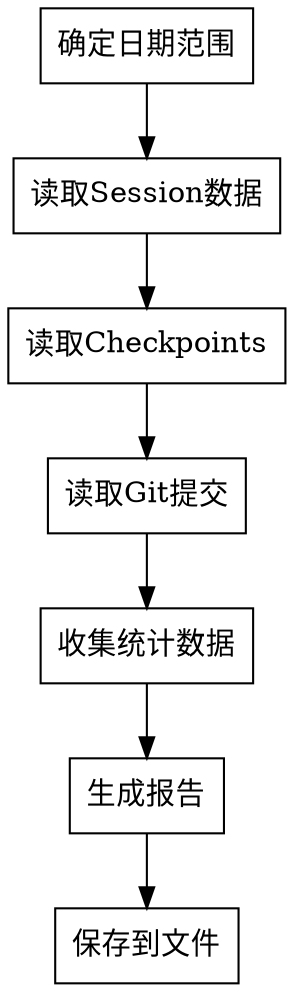
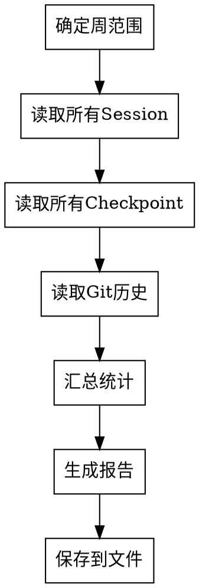

# Report - 生成报告

## 使用场景

生成项目进度报告,支持每日报告和周报。

## 功能描述

生成进度报告,包括:
- 今日/本周完成的工作
- 统计数据（工作时长、完成任务、代码提交、测试覆盖率）
- 遇到的问题
- 明日/下周计划

## 命令参数

```bash
/report [--daily | --weekly]
```

- `--daily` - 生成每日报告（默认）
- `--weekly` - 生成周报

## 数据来源

此命令从以下来源收集数据

### Session Summaries

```markdown
# 列出所有session记忆
mcp__serena__list_memories(topic: "session")

# 读取今日session
mcp__serena__read_memory(memory_name: "session-2026-03-04-user-auth")
```

### Checkpoints

```markdown
# 列出项目的checkpoints
mcp__serena__list_memories(topic: "checkpoint-user-auth")

# 读取checkpoints
for checkpoint_name in checkpoints:
    checkpoint = mcp__serena__read_memory(memory_name: checkpoint_name)
```

### Git Commits

```bash
# 今日提交
git log --oneline --since="midnight"

# 本周提交
git log --oneline --since="1 week ago"
```

### TodoWrite Tasks

```markdown
# 列出任务
TodoWrite/List

# 获取任务统计
```

## 执行逻辑

### 每日报告流程



### 周报流程



### 1. 确定时间范围

```python
# 每日报告
from datetime import datetime, time

today = datetime.now().replace(hour=0, minute=0, second=0, microsecond=0)
now = datetime.now()

# 周报
from datetime import datetime, timedelta

today = datetime.now()
start_of_week = today - timedelta(days=today.weekday())
end_of_week = start_of_week + timedelta(days=6)
```

### 2. 读取Session数据

```python
def read_sessions(start_time, end_time):
    # 列出所有session
    memories = list_memories(topic="session")

    sessions = []
    for memory_name in memories:
        session = read_memory(memory_name)

        # 检查时间范围
        session_time = parse_time(session["created_at"])
        if start_time <= session_time <= end_time:
            sessions.append(session)

    return sessions
```

### 3. 收集统计数据

```python
def collect_statistics(sessions, checkpoints, commits):
    stats = {
        "total_time": 0,
        "completed_tasks": 0,
        "code_commits": 0,
        "test_stats": {
            "total": 0,
            "passed": 0,
            "failed": 0
        },
        "review_stats": {
            "total": 0,
            "passed": 0,
            "failed": 0
        },
        "coverage_scores": []
    }

    # 统计任务
    for session in sessions:
        stats["total_time"] += session.get("duration", 0)
        stats["completed_tasks"] += len(session.get("completed_tasks", []))

    # 统计提交
    stats["code_commits"] = len(commits)

    # 统计测试
    for checkpoint in checkpoints:
        for task in checkpoint.get("tasks", []):
            if "test_result" in task:
                stats["test_stats"]["total"] += 1
                if task["test_result"] == "passed":
                    stats["test_stats"]["passed"] += 1
                else:
                    stats["test_stats"]["failed"] += 1

            if "coverage" in task:
                stats["coverage_scores"].append(task["coverage"])

    # 计算平均值
    if stats["coverage_scores"]:
        stats["avg_coverage"] = sum(stats["coverage_scores"]) / len(stats["coverage_scores"])

    return stats
```

### 4. 生成报告

```markdown
# 每日进度报告 - {date}

## 今日完成
- ✅ 完成 Design Review 节点
- ✅ 生成实现计划（Plan 节点）
- ✅ 开始 Subagent Development（完成 3/5 任务）

## 今日统计
- **工作时长**: 6.5 小时
- **完成任务**: 3 个
- **代码提交**: 3 次
- **测试通过率**: 66.7%（2/3）
- **审查通过率**: 100%（2/2）
- **平均覆盖率**: 82%

## 节点进度
- [x] Brainstorm
- [x] Analyze
- [x] Requirement
- [x] Design
- [x] Design Review
- [x] Plan
- [x] Git Worktrees
- [ ] **Subagent Development** ← 当前（60%）

## 代码变更
- 新增代码: 450 行
- 新增测试: 280 行
- 修改文件: 12 个
- 新增文件: 5 个

## 遇到的问题
- Task 3 测试失败（已重试 2 次）
  - **原因**: 权限验证逻辑错误
  - **状态**: 正在修复
  - **预计解决**: 今日

## Git 提交记录（今日）
```
a1b2c3d - feat: 实现用户 CRUD 功能
e4f5g6h - test: 添加用户模型测试
i7j8k9l - feat: 创建用户数据模型
```

## 明日计划
- [ ] 完成 Task 3 测试修复
- [ ] 完成 Task 4 和 Task 5
- [ ] 开始 Test Design 节点
- [ ] 生成集成测试方案

## 备注
无
```

### 5. 保存到文件

```python
# 生成文件名
filename = f".claude/reports/{date}_开发报告_{project_name}.md"

# 写入文件
write_file(filename, report_content)

print(f"✅ 报告已生成: {filename}")
```

## 工具使用

### MCP 工具

```markdown
# 列出session记忆
mcp__serena__list_memories
  topic: "session"

# 读取session数据
mcp__serena__read_memory
  memory_name: "session-2026-03-04-user-auth"

# 列出checkpoints
mcp__serena__list_memories
  topic: "checkpoint-user-auth"
```

### Git 命令

```bash
# 获取今日提交
git log --oneline --since="midnight"

# 获取本周提交
git log --oneline --since="1 week ago"

# 统计代码变更
git diff --shortstat origin/main HEAD
```

### TodoWrite

```markdown
# 列出任务
TodoWrite/List

# 统计任务
- 总任务数
- 已完成任务
- 进行中任务
- 失败任务
```

## 输出产物

- 报告文件（保存到 `.claude/reports/`）
- Markdown格式
- 包含统计图表
- 适合handoff和review

## 相关命令

**相关进度命令**:
- `/status` - 查看进度
- `/resume` - 恢复进度
- `/checkpoint` - 创建检查点
- `/monitor` - 状态快照
