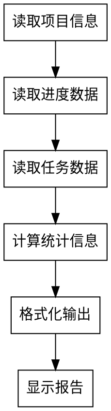

# Status - 查看当前进度

## 使用场景

查看项目的完整进度状态,包括节点完成情况、任务进度、时间统计等。

## 功能描述

显示项目的当前进度状态,包括:
- 项目信息(名称、流程类型、当前阶段、Git分支)
- 整体进度(百分比、节点完成情况)
- 节点完成情况(已完成/进行中/待完成)
- 任务进度详情(TodoWrite 状态)
- 时间统计
- Git 提交记录
- 会话记忆信息
- 下一步行动

## 数据来源

此命令从以下来源读取数据

### 主数据源: Serena Memory

**进度记录** (`progress-{project_id}`):
- 项目元数据(名称、ID、流程类型)
- 阶段信息(每个阶段的状态/时间戳)
- 整体进度(百分比、完成数量)
- 时间统计(总时间/预估剩余)

### 辅助数据源: TodoWrite

**任务状态**:
- 当前会话的任务列表
- 任务状态（pending/in_progress/completed)
- 任务依赖关系
- 任务元数据

### 外部数据源

**Git 信息**:
```bash
# 当前分支
git branch --show-current

# 最近提交
git log --oneline -5

# 工作目录状态
git status --short
```

**项目信息** (`.claude/CLAUDE.md`):
- 项目名称
- 项目描述
- 技术栈配置

## 执行逻辑

此命令的执行流程

### 流程图



### 1. 读取项目信息

```markdown
1. 读取 .claude/CLAUDE.md
2. 提取项目ID（如果定义）
3. 如果没有project_id，则使用目录名或生成
4. 读取项目元数据
```

### 2. 读取进度数据

```markdown
1. 构建memory名称: progress-{project_id}
2. 调用 mcp__serena__read_memory
3. 解析progress数据:
   - metadata: 版本、项目ID
   - project_info: 名称、当前阶段、分支
   - phases: 阶段列表和状态
   - overall_progress: 百分比、完成数
   - time_stats: 时间统计
```

### 3. 读取任务数据（可选）

```markdown
1. 调用 TodoWrite/List（可选）
2. 获取当前任务状态
3. 关联任务到当前阶段
```

### 4. 计算统计信息

```python
# 计算整体进度
percentage = (completed_phases / total_phases) * 100

# 计算时间统计
total_time = sum(phase["duration"] for phase in completed_phases)
avg_time_per_phase = total_time / completed_phases
estimated_remaining = avg_time_per_phase * (total_phases - completed_phases)
```

### 5. 格式化输出

```markdown
1. 构建项目信息部分
2. 构建整体进度条
3. 列出阶段状态
4. 显示任务详情
5. 显示时间统计
6. 显示下一步行动
```

## 工具使用

### MCP 工具

```markdown
# 读取进度数据
mcp__serena__read_memory
  memory_name: "progress-{project_id}"

# 返回示例
{
  "metadata": {
    "version": "1.0",
    "project_id": "user-auth"
  },
  "project_info": {
    "name": "User Authentication System",
    "current_phase": "design",
    "git_branch": "feature/user-auth"
  },
  "phases": [...],
  "overall_progress": {
    "percentage": 37.5,
    "completed_phases": 3,
    "total_phases": 8
  },
  "time_stats": {
    "total_time": 18000,
    "estimated_remaining": 30000
  }
}
```

### Git 命令

```bash
# 获取当前分支
git branch --show-current

# 获取最近提交
git log --oneline -5

# 获取工作目录状态
git status --short
```

### TodoWrite（可选）

```markdown
# 列出当前任务
TodoWrite/List

# 返回示例
[
  {
    "id": "1",
    "subject": "Design authentication flow",
    "status": "completed"
  },
  {
    "id": "2",
    "subject": "Design password hashing",
    "status": "in_progress"
  }
]
```

## 输出格式

```markdown
# Cadence 项目进度

## 项目信息
- **项目名称**: User Authentication System
- **流程类型**: full-flow
- **当前阶段**: design
- **Git 分支**: feature/user-auth
- **工作目录**: /projects/user-auth

## 整体进度
[████████░░░] 72% (8/11 节点)

## 节点完成情况

### ✅ 已完成 (3/8)
- [x] Brainstorm - PRD 已生成
- [x] Analyze - 存量分析已完成
- [x] Requirement - 需求分析完成

### 🔄 进行中 (1/8)
- [ ] **Design - 设计方案** ← 当前
  - 任务进度: 2/3
  - 当前任务: Task 2 - 设计密码哈希策略
  - 状态: in_progress

### ⏳ 待完成 (4/8)
- [ ] Design Review
- [ ] Plan
- [ ] Git Worktrees
- [ ] Subagent Development

## 任务进度详情

### Design Phase
[██████░░░░] 66% (2/3 任务)

✅ Task 1: 设计认证流程
   - 测试: ✅ 通过 (0/3 重试)
   - 审查: ✅ 通过 (0/2 重试)
   - 覆盖率: ✅ 85%

🔄 Task 2: 设计密码哈希策略 ← 当前
   - 状态: in_progress
   - 开始时间: 2 小时前

## 时间统计
- **已用时间**: 5h
- **预估剩余**: 8.3h
- **总计预估**: 13.3h

## Git 提交记录（最近 5 次）
a1b2c3d - feat: 实现用户 CRUD 功能
e4f5g6h - test: 添加用户模型测试
...

## 会话记忆
- **Session Summary**: session-2026-03-04-user-auth
- **最近 Checkpoint**: checkpoint-design-abc123-2026-03-04T15:00:00
- **失败日志**: 无

## 下一步行动
1. 完成 Task 2（设计密码哈希策略）
2. 提交 Design Review
3. 开始 Plan 阶段
```

## 相关命令

**相关进度命令**:
- `/resume` - 恢复进度
- `/checkpoint` - 创建检查点
- `/report` - 生成报告
- `/monitor` - 状态快照
