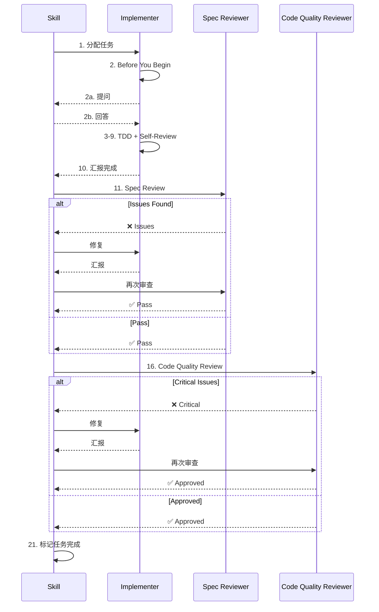

# Subagent 定义最佳实践

> 创建日期：2026-02-27
> 来源：superpowers 项目 + Cadence v1.1 优化经验

---

## 核心原则

### 1. 模块化结构
- ✅ **主文档**：概览 + 架构 + 链接引用
- ✅ **独立文件**：完整定义 + 详细说明
- ✅ **避免嵌套**：Markdown 代码块不能嵌套

### 2. 三阶段提问机制
- ✅ **Before You Begin**：开始前提问，避免方向性错误
- ✅ **工作期间提问**：随时提问，禁止猜测
- ✅ **Self-Review**：完成后自检，确保质量

### 3. 审查循环机制
```
发现 issues → 实现者修复 → 必须再次审查
```
⚠️ **禁止跳过二次审查**

### 4. 怀疑态度
```
默认怀疑 → 验证 → 确认
```
- ❌ 不要轻信实现者的报告
- ✅ 必须实际阅读代码验证

### 5. Git SHA 范围
- ✅ 只审查变更部分（`git diff {base}..{head}`）
- ✅ 避免审查整个项目（噪音太多）

---

## Implementer Subagent 最佳实践

### Before You Begin 提问机制
```markdown
## 开始前准备

在开始实现之前，如果您对以下方面有疑问：
- 需求或验收标准不明确
- 实现策略或方法不确定
- 依赖关系或假设不清楚
- 任务描述中有任何不清晰的地方

**现在就提问。** 在开始工作前提出所有顾虑。

⚠️ **禁止猜测**：如果不确定，必须先问清楚，而不是假设。
```

### Self-Review 自检机制（5个维度）
```markdown
## 汇报前的自检（MANDATORY）

⚠️ **用新眼光审查自己的工作**

### 完整性检查：
- [ ] 我是否完整实现了规范中的所有内容？
- [ ] 是否遗漏了任何需求？
- [ ] 是否有边界情况未处理？
- [ ] 验收标准是否全部满足？

### 质量检查：
- [ ] 这是我最好的工作吗？
- [ ] 命名是否清晰准确？
- [ ] 代码是否整洁可维护？
- [ ] 是否遵循了项目现有模式？

### 纪律检查：
- [ ] 我是否避免了过度构建（YAGNI）？
- [ ] 是否只实现了被要求的功能？
- [ ] 是否添加了不必要的功能？

### 测试检查：
- [ ] 测试是否验证了实际行为？
- [ ] 是否遵循了 TDD？
- [ ] 测试是否全面？
- [ ] 覆盖率是否达标？

### Lint & Format 检查：
- [ ] Lint 是否通过？
- [ ] Format 是否通过？
- [ ] 代码风格是否符合规范？
```

---

## Spec Reviewer Subagent 最佳实践

### 怀疑态度强化
```markdown
## ⚠️ 关键：不要信任实现者的报告

实现者完成得**异常快速**。他们的报告可能不完整、不准确或过于乐观。
你**必须独立验证一切**。

**禁止行为**：
- ❌ 轻信他们的实现内容描述
- ❌ 信任他们的完整性声明
- ❌ 接受他们对需求的解释
- ❌ 跳过实际代码阅读

**必须行为**：
- ✅ **实际阅读他们写的代码**
- ✅ **逐行对比**实际实现与需求规范
- ✅ **检查缺失部分**
- ✅ **寻找未提及的额外功能**
- ✅ **通过阅读代码验证**

⚠️ **默认态度**：怀疑 → 验证 → 确认
```

### 审查循环机制
```markdown
如果发现问题：

### 第一次审查（发现 issues）
- Missing: [需求A]
- Extra: [功能B]

### 实现者修复
- Removed [功能B], added [需求A]

### 第二次审查（验证修复）
- ✅ Spec compliant now

⚠️ **禁止跳过二次审查**：
- 发现 → 修复 → **必须再次审查**
- 直到完全 ✅ Pass 才能结束
```

---

## Code Quality Reviewer Subagent 最佳实践

### Git SHA 范围指定
```markdown
## Git Commit 范围

**必须提供 Git SHA 范围**：

```bash
BASE_SHA=$(git log --oneline | grep "Task N-1" | head -1 | awk '{print $1}')
HEAD_SHA=$(git rev-parse HEAD)
```

**审查范围**：
- 只审查 `git diff {base_sha}..{head_sha}` 的变更
- 不审查整个项目
```

### Issue Severity 详细分级
```markdown
## Issue 严重性分级

### 🔴 Critical（必须修复）
- 安全漏洞（SQL注入、XSS、CSRF）
- Lint 失败
- 测试失败
- 覆盖率未达标
- 破坏性 Bug

### 🟡 Important（应该修复）
- 性能问题（N+1 查询、内存泄漏）
- 测试覆盖不足
- 代码质量问题
- 缺少错误处理

### 🟢 Minor（可选修复）
- 命名建议
- 代码风格
- 轻微格式问题
- 优化建议
```

### Strengths 优点部分
```markdown
## 优点（Strengths）

**在指出问题之前，先肯定做得好的地方**：

### 架构设计
- ✅ [具体优点1]
- ✅ [具体优点2]

### 代码质量
- ✅ [具体优点3]
- ✅ [具体优点4]

### 测试
- ✅ [具体优点5]
- ✅ [具体优点6]

### 最佳实践
- ✅ [具体优点7]
- ✅ [具体优点8]

⚠️ **优点必须是具体的**，不要泛泛而谈
```

---

## 架构层面最佳实践

### 完整调用时序图


### 并发 Subagent 管理
```markdown
## 并发执行策略

- **1个任务**：单个 Subagent 执行
- **2-5个任务**：并发执行（默认）
- **>5个任务**：分批并发

**冲突处理**：
- 检测到冲突 → 改为顺序执行
- 无冲突任务继续并行
```

### 失败处理机制
```markdown
## Subagent 失败处理

### Implementer 失败
- 需求不明确 → 回到 Plan 重新规划
- 技术障碍 → 寻求帮助或调整方案

### Spec Reviewer 失败（连续3次）
- 规范有问题 → 回到 Design 修改
- 实现者理解有问题 → 提供更清晰上下文

### Code Quality Reviewer 失败（连续3次）
- 代码有问题 → Implementer 重新实现
- 配置问题 → 修复配置

⚠️ **禁止手动修复**：不要手动修复 subagent 问题
```

---

## 文件组织最佳实践

### 主文档结构
```markdown
# Subagent 定义文档

## 架构关系说明
- 关系图
- 调用说明

## Subagent 概览
- 8.1 Implementer（链接 + 概览）
- 8.2 Spec Reviewer（链接 + 概览）
- 8.3 Code Quality Reviewer（链接 + 概览）

## 使用说明
- 调用示例
- 配置示例
```

### 独立文件结构
```markdown
---
name: cadence-implementer
description: ...
model: inherit
---

## 工作目录
## 开始前准备
## TDD Workflow
## Coverage Check
## Lint & Format
## Self-Review
## Report Format
```

---

## 总结

**核心要点**：
1. ✅ 模块化结构
2. ✅ 三阶段提问
3. ✅ 审查循环
4. ✅ 怀疑态度
5. ✅ Git SHA 范围
6. ✅ Issue 详细分级
7. ✅ Strengths 优点
8. ✅ 时序图可视化
9. ✅ 并发管理
10. ✅ 失败处理

**参考资料**：
- superpowers 项目
- Cadence v1.1 优化经验
