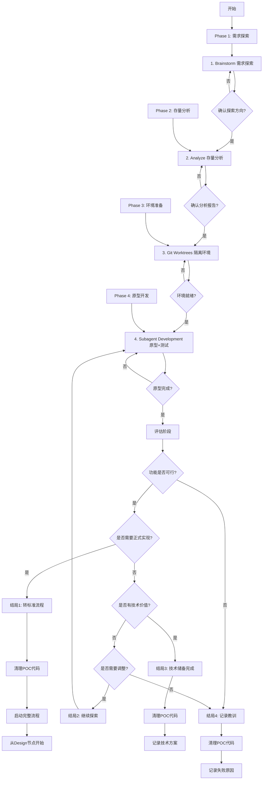
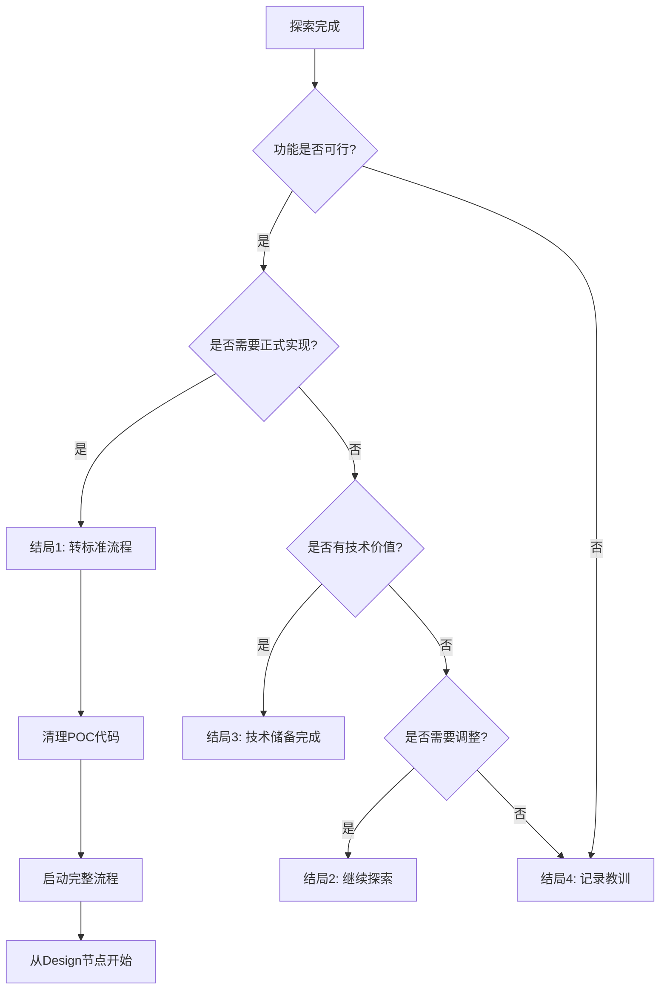

# Exploration Flow - 探索流程

## Overview

探索流程，允许迭代，支持原型开发、技术研究和 POC 验证。探索成功后可选择转标准流程、继续探索、技术储备或记录教训。

**核心原则**: 允许失败 + 迭代验证 + 灵活结局 = 技术探索

**开始时宣布**: "我正在使用 exploration-flow skill 来执行探索流程。"

## When to Use

### 使用场景判断

**应该使用**:
- ✅ 不确定的需求（需要快速验证想法）
- ✅ 技术研究（评估技术可行性）
- ✅ 原型开发（POC验证）
- ✅ 实验性功能（可能不会正式上线）
- ✅ 学习新技术（边做边学）

**不应该使用**:
- ❌ 需求明确 → 使用 quick-flow 或 full-flow
- ❌ 需要正式交付 → 使用 full-flow
- ❌ 简单功能 → 使用 quick-flow

### 前置条件

- ✅ 允许失败（探索可能不成功）
- ✅ 原型代码质量要求较低（但必须能验证核心想法）
- ✅ 所有节点 Skills 可用

## The Process

### 流程初始化（开始前自动执行）

**重要**: 流程开始前，自动执行以下初始化，无需用户干预：

#### Step 1: 获取项目信息

- 使用 `git rev-parse --show-toplevel` 获取项目根目录
- 使用 `git rev-parse --abbrev-ref HEAD` 获取当前分支
- 使用 `basename $(git rev-parse --show-toplevel)` 获取项目名称
- 生成 project_id（使用项目名称的 hash 或简化版本）

#### Step 2: 创建 Progress 记录

使用 Serena `write_memory` 创建初始进度记录：

- **记忆名称**: `progress-exploration-flow-{feature_name}`
- **内容结构**:
  ```json
  {
    "metadata": {
      "version": "1.0",
      "project_id": "{project_id}",
      "project_name": "{project_name}",
      "flow_type": "exploration-flow",
      "feature_name": "{feature_name}",
      "start_time": "{ISO8601_timestamp}",
      "git_branch": "{current_branch}",
      "iteration": 1
    },
    "phases": [
      {
        "phase_name": "brainstorm",
        "status": "pending",
        "start_time": null,
        "end_time": null,
        "duration_minutes": 0,
        "output": null
      },
      {
        "phase_name": "analyze",
        "status": "pending",
        "start_time": null,
        "end_time": null,
        "duration_minutes": 0,
        "output": null
      },
      {
        "phase_name": "git-worktrees",
        "status": "pending",
        "start_time": null,
        "end_time": null,
        "duration_minutes": 0,
        "output": null
      },
      {
        "phase_name": "subagent-development",
        "status": "pending",
        "start_time": null,
        "end_time": null,
        "duration_minutes": 0,
        "output": null
      }
    ],
    "overall_progress": {
      "percentage": 0,
      "completed_phases": 0,
      "total_phases": 4
    },
    "time_stats": {
      "start_time": "{ISO8601_timestamp}",
      "estimated_duration_minutes": 120,
      "elapsed_minutes": 0,
      "estimated_remaining_minutes": 120
    }
  }
  ```

#### Step 3: 创建查询索引

使用 Serena `write_memory` 创建查询索引：

- **记忆名称**: `index-exploration-flow`
- **内容结构**:
  ```json
  {
    "flow_type": "exploration-flow",
    "active_sessions": [
      {
        "project_id": "{project_id}",
        "feature_name": "{feature_name}",
        "current_phase": "none",
        "progress": 0,
        "start_time": "{ISO8601_timestamp}",
        "last_update": "{ISO8601_timestamp}",
        "resume_command": "/resume exploration-flow-{feature_name}"
      }
    ]
  }
  ```

#### Step 4: 显示初始化完成

向用户展示初始化结果：

```
✅ Exploration Flow 初始化完成

📋 项目信息:
- 项目名称: {project_name}
- 项目ID: {project_id}
- Git分支: {current_branch}
- 功能名称: {feature_name}

📊 流程信息:
- 流程类型: exploration-flow
- 总节点数: 4
- 预估时间: 60-180分钟
- 迭代次数: 1

💾 初始化记录:
- Progress: progress-exploration-flow-{feature_name}
- 索引: index-exploration-flow

🚀 准备开始 Phase 1: Brainstorm（需求探索）
```

---

## The Process



### 详细步骤

#### Phase 1: 需求探索（20-40分钟）

##### 1. Brainstorm（需求探索）

**调用 Skill**: `brainstorming`

**输入**:
- 用户描述的探索需求（可能不明确）

**输出**:
- 探索PRD文档（`.claude/docs/{date}_探索PRD_{功能名称}_v1.0.md`）

**探索模式特点**:
- ✅ 允许需求不明确，边探索边调整
- ✅ 聚焦核心想法验证
- ✅ 不要求完整 PRD

**人工确认**:
```
探索PRD已生成：
- 探索目标：{核心想法}
- 验证要点：{关键问题}
- 成功标准：{验证标准}

是否确认探索方向？
├── ✅ 确认 → 进入 Analyze
├── ⚠️ 需要调整 → 重新 Brainstorm
└── ❌ 不满意 → 重新 Brainstorm
```

---

#### Phase 2: 存量分析（10-20分钟）

##### 2. Analyze（存量分析）

**调用 Skill**: `analyze`

**输入**:
- 探索PRD文档（来自 Brainstorm）

**输出**:
- 简化分析报告（`.claude/analysis/{date}_简化分析_{功能名称}_v1.0.md`）

**探索模式特点**:
- ✅ 简化分析，只关注关键技术点
- ✅ 不要求完整的存量分析

**人工确认**:
```
简化分析已完成：
- 相关技术：{技术列表}
- 关键依赖：{依赖列表}
- 技术风险：{风险列表}

是否确认分析报告？
├── ✅ 确认 → 进入 Git Worktrees
├── ⚠️ 需要调整 → 重新 Analyze
└── ❌ 不满意 → 重新 Analyze
```

---

#### Phase 3: 环境准备（5分钟）

##### 3. Git Worktrees（隔离环境）

**调用 Skill**: `using-git-worktrees`

**输入**:
- 探索PRD文档（来自 Brainstorm）

**输出**:
- Git worktree 工作目录
- 新分支（poc/{feature-name}）
- Worktree 信息报告

**探索模式特点**:
- ✅ 使用 poc/{feature-name} 分支（而不是 feature/）

**人工确认**:
```
Worktree 已创建：
- 位置：{路径}
- 分支：poc/{feature-name}
- 测试：✅ 通过

是否确认环境就绪？
├── ✅ 确认 → 进入 Subagent Development
├── ⚠️ 需要调整 → 重新 Git Worktrees
└── ❌ 不满意 → 重新 Git Worktrees
```

---

#### Phase 4: 原型开发（30-60分钟）

##### 4. Subagent Development（原型+测试）

**调用 Skill**: `subagent-development`

**输入**:
- 探索PRD文档（来自 Brainstorm）
- Worktree 信息（来自 Git Worktrees）

**输出**:
- 原型代码
- 基础测试
- Git commits

**探索模式特点**:
- ✅ 原型代码质量要求较低（但必须能验证核心想法）
- ✅ 基础测试即可（不要求 ≥ 80% 覆盖率）
- ✅ 可以不完整（不要求100%功能完整）

**人工确认**:
```
原型开发已完成：
- 完成功能：{功能列表}
- 测试结果：{测试结果}
- 验证状态：{验证状态}

是否确认原型完成？
├── ✅ 确认 → 进入评估阶段
├── ⚠️ 需要调整 → 继续开发
└── ❌ 不满意 → 继续开发
```

---

#### Phase 5: 评估阶段（5-10分钟）

##### 评估决策树



##### 4种结局说明

| 结局 | 触发条件 | 后续动作 | 产物 |
|------|---------|---------|------|
| **结局1: 转标准流程** | 功能可行 + 需要正式实现 | 清理POC代码 → 启动完整流程(从Design开始) | POC报告 + 技术方案 |
| **结局2: 继续探索** | 功能可行但需要调整 | 调整需求 → 再次循环Subagent Development | 迭代记录 |
| **结局3: 技术储备完成** | 功能可行但暂不需要 | 清理POC代码 → 记录技术方案到.claude/docs/ | 技术储备文档 |
| **结局4: 记录教训** | 功能不可行 | 清理POC代码 → 记录失败原因和教训 | 失败分析报告 |

##### 评估问题

```
探索评估：

1. 功能是否可行？
   ├── ✅ 是 → 继续评估
   └── ❌ 否 → 结局4: 记录教训

2. 是否需要正式实现？
   ├── ✅ 是 → 结局1: 转标准流程
   └── ❌ 否 → 继续评估

3. 是否有技术价值？
   ├── ✅ 是 → 结局3: 技术储备完成
   └── ❌ 否 → 继续评估

4. 是否需要调整？
   ├── ✅ 是 → 结局2: 继续探索
   └── ❌ 否 → 结局4: 记录教训

请选择结局：
用户: [选择]
```

---

#### 结局1: 转标准流程

**触发条件**: 功能可行 + 需要正式实现

**动作**:
1. 清理POC代码
   ```bash
   # 保存POC代码到临时分支
   git checkout -b poc-archive/{feature-name}
   git push origin poc-archive/{feature-name}

   # 返回主分支
   git checkout main

   # 删除POC worktree
   git worktree remove .worktrees/poc-{feature-name}
   ```

2. 生成POC报告
   ```markdown
   # POC报告 - {功能名称}

   ## 探索结果
   - 功能可行性：✅ 可行
   - 技术难点：{难点列表}
   - 解决方案：{方案列表}

   ## 技术方案
   {技术方案摘要}

   ## 建议
   - 建议从Design节点开始正式实现
   - 预估时间：{时间}
   ```

3. 启动完整流程
   ```
   探索成功！建议启动完整流程：

   下一步：
   1. 调用 design skill 开始技术设计
   2. 或使用 /full-flow 启动完整流程

   是否现在开始？
   ├── ✅ 是 → 调用 design skill
   └── ❌ 否 → 保存POC报告，等待用户决定
   ```

---

#### 结局2: 继续探索

**触发条件**: 功能可行但需要调整

**动作**:
1. 调整需求
   ```markdown
   ## 迭代 {N} 调整

   ### 上次探索结果
   - 完成功能：{功能列表}
   - 验证状态：{状态}

   ### 需要调整
   - 调整1：{调整内容}
   - 调整2：{调整内容}

   ### 下次探索目标
   - 目标1：{目标}
   - 目标2：{目标}
   ```

2. 再次循环 Subagent Development
   - 迭代计数 +1
   - 返回 Phase 4

3. 保存迭代记录

   使用 Serena `write_memory` 保存迭代信息：

   - **记忆名称**：`exploration-iteration-${timestamp}`
   - **内容结构**：

   | 字段 | 类型 | 示例值 | 说明 |
   |------|------|--------|------|
   | iteration | number | N | 当前迭代次数 |
   | adjustments | array | ["调整1", "调整2"] | 本次调整内容 |
   | next_goals | array | ["目标1", "目标2"] | 下次目标 |
   | timestamp | string | ISO 8601 | 时间戳（自动生成） |

---

#### 结局3: 技术储备完成

**触发条件**: 功能可行但暂不需要

**动作**:
1. 清理POC代码
   ```bash
   # 保存POC代码到临时分支
   git checkout -b poc-archive/{feature-name}
   git push origin poc-archive/{feature-name}

   # 返回主分支
   git checkout main

   # 删除POC worktree
   git worktree remove .worktrees/poc-{feature-name}
   ```

2. 生成技术储备文档
   ```markdown
   # 技术储备 - {功能名称}

   ## 技术概述
   {技术概述}

   ## 实现方案
   {实现方案}

   ## 技术难点
   {技术难点}

   ## 代码示例
   {代码示例}

   ## 参考资料
   {参考资料}

   ## 何时使用
   {使用场景}

   ## POC代码位置
   - 分支：poc-archive/{feature-name}
   - Commit：{commit-hash}
   ```

3. 保存到 `.claude/docs/`
   - 文件名：`{date}_技术储备_{功能名称}_v1.0.md`

---

#### 结局4: 记录教训

**触发条件**: 功能不可行

**动作**:
1. 清理POC代码
   ```bash
   # 保存POC代码到临时分支
   git checkout -b poc-archive/{feature-name}-failed
   git push origin poc-archive/{feature-name}-failed

   # 返回主分支
   git checkout main

   # 删除POC worktree
   git worktree remove .worktrees/poc-{feature-name}
   ```

2. 生成失败分析报告
   ```markdown
   # 失败分析报告 - {功能名称}

   ## 探索目标
   {探索目标}

   ## 失败原因
   - 原因1：{原因}
   - 原因2：{原因}

   ## 尝试过的方案
   - 方案1：{方案} → 失败原因
   - 方案2：{方案} → 失败原因

   ## 技术限制
   {技术限制}

   ## 教训总结
   - 教训1：{教训}
   - 教训2：{教训}

   ## 替代方案
   {替代方案}

   ## POC代码位置
   - 分支：poc-archive/{feature-name}-failed
   - Commit：{commit-hash}
   ```

3. 保存到 `.claude/docs/`
   - 文件名：`{date}_失败分析_{功能名称}_v1.0.md`

---

## Input/Output

### 输入来源

1. **用户需求**: 探索性需求（可能不明确）
2. **项目上下文**: 当前项目状态

### 输出产物

#### 根据结局不同，输出不同的产物

**结局1: 转标准流程**:
- POC报告
- 技术方案摘要
- POC代码（已归档）

**结局2: 继续探索**:
- 迭代记录
- 调整需求
- 原型代码（持续迭代）

**结局3: 技术储备完成**:
- 技术储备文档
- POC代码（已归档）

**结局4: 记录教训**:
- 失败分析报告
- POC代码（已归档）

## Integration

### 前置 Skills

**依赖节点 Skills（4个）**:
- brainstorming (方案4)
- analyze (方案4)
- using-git-worktrees (方案6)
- subagent-development (方案6)

### 后续 Skills

**结局1可能调用**:
- **design** - 开始技术设计
- **full-flow** - 启动完整流程

### 相关 Commands

- `/status` - 查看进度
- `/resume` - 恢复进度
- `/checkpoint` - 创建检查点

## Checklist

### 准备阶段
- [ ] 是否确认允许失败？
- [ ] 是否理解原型代码质量要求较低？
- [ ] 是否激活了项目？

### Phase 1-2: 需求探索
- [ ] 探索PRD是否生成？
- [ ] 用户是否确认探索方向？

### Phase 3-4: 原型开发
- [ ] Worktree 是否创建成功？
- [ ] 原型是否完成？
- [ ] 核心想法是否验证？

### Phase 5: 评估阶段
- [ ] 是否完成评估？
- [ ] 是否选择结局？
- [ ] 是否执行对应动作？

### 结局1-4: 清理
- [ ] POC代码是否已归档？
- [ ] 文档是否已生成？
- [ ] Checkpoint 是否保存？

## Red Flags

**绝不**:
- 在原型未验证核心想法的情况下声称完成
- 在功能不可行的情况下强行转标准流程
- 不记录失败原因
- 不清理POC代码

**始终**:
- 允许失败，记录经验
- 聚焦核心想法验证
- 根据评估选择合适的结局
- 清理POC代码（归档）
- 保存迭代记录

## 重要提示

- 📌 **探索流程允许失败，失败也是宝贵经验**
- 📌 **原型代码质量要求较低，但必须能验证核心想法**
- 📌 **探索成功后，如果需要正式实现，建议从Design节点开始（而不是直接使用POC代码）**
- 📌 **探索流程的产物可能不是最终代码，而是技术验证报告**

## Example Workflow

```
你: 我正在使用 exploration-flow skill 来执行探索流程。

[Phase 1: Brainstorm]
[调用 brainstorming skill]
[生成探索PRD]

探索PRD已生成：
- 探索目标：验证使用WebSocket实现实时协作的可行性
- 验证要点：并发性能、消息同步、冲突解决
- 成功标准：支持10个用户同时编辑，无明显延迟

是否确认探索方向？
用户: 确认

[保存 Checkpoint]

[Phase 2: Analyze]
[调用 analyze skill]
[生成简化分析报告]

简化分析已完成：
- 相关技术：WebSocket, Operational Transformation
- 关键依赖：WebSocket库、消息队列
- 技术风险：冲突解决算法复杂

是否确认分析报告？
用户: 确认

[保存 Checkpoint]

[Phase 3: Git Worktrees]
[调用 using-git-worktrees skill]
[创建 poc/websocket-collab 分支]

Worktree 已创建：
- 位置：.worktrees/poc-websocket-collab
- 分支：poc/websocket-collab
- 测试：✅ 通过

是否确认环境就绪？
用户: 确认

[保存 Checkpoint]

[Phase 4: Subagent Development]
[调用 subagent-development skill]
[Implementer 8.1 实现 + 测试]

原型开发已完成：
- 完成功能：WebSocket连接、消息同步、基础冲突解决
- 测试结果：5个用户同时编辑，延迟<100ms
- 验证状态：部分成功（10个用户时有延迟）

是否确认原型完成？
用户: 确认

[保存 Checkpoint]

[Phase 5: 评估]

探索评估：

1. 功能是否可行？ ✅ 是
2. 是否需要正式实现？ ✅ 是

选择结局：结局1 - 转标准流程

[清理POC代码]
[归档到 poc-archive/websocket-collab]

[生成POC报告]
POC报告已生成：
- 功能可行性：✅ 可行（需要优化）
- 技术难点：冲突解决算法
- 解决方案：使用CRDT算法
- 建议：从Design节点开始正式实现

是否现在开始技术设计？
用户: 是

[调用 design skill]
→ 进入完整流程（从Design开始）
```

### 流程完成总结（结束后自动执行）

**重要**: 探索流程完成后（无论哪种结局），自动执行以下总结，无需用户干预：

#### Step 1: 生成 Session Summary

使用 Serena `write_memory` 生成会话总结：

- **记忆名称**: `session-{project_id}-{date}`
- **内容结构**:
  ```json
  {
    "session_id": "session-{project_id}-{uuid}",
    "project_id": "{project_id}",
    "project_name": "{project_name}",
    "flow_type": "exploration-flow",
    "feature_name": "{feature_name}",
    "start_time": "{ISO8601_timestamp}",
    "end_time": "{ISO8601_timestamp}",
    "duration_minutes": {number},
    "iterations": {number},
    "outcome": "{outcome_type}",
    "phases_completed": [
      {
        "phase_name": "brainstorm",
        "status": "completed",
        "duration_minutes": {number},
        "output": "{探索PRD路径}"
      },
      {
        "phase_name": "analyze",
        "status": "completed",
        "duration_minutes": {number},
        "output": "{分析报告路径}"
      },
      {
        "phase_name": "git-worktrees",
        "status": "completed",
        "duration_minutes": {number},
        "output": "{worktree信息}"
      },
      {
        "phase_name": "subagent-development",
        "status": "completed",
        "duration_minutes": {number},
        "output": "{原型代码路径}"
      }
    ],
    "exploration_result": {
      "is_feasible": {boolean},
      "needs_full_implementation": {boolean},
      "has_technical_value": {boolean},
      "needs_iteration": {boolean},
      "poc_branch": "{branch_name}",
      "poc_path": "{worktree_path}"
    },
    "deliverables": {
      "exploration_prd": "{path}",
      "analysis_report": "{path}",
      "poc_code": ["{paths}"],
      "poc_tests": ["{paths}"],
      "poc_report": "{path}"
    },
    "quality_metrics": {
      "poc_test_coverage": "{percentage}",
      "validation_status": "{status}",
      "issues_found": ["{issues}"]
    },
    "checkpoints_created": ["{uuid1}", "{uuid2}", ...],
    "git_commits": ["{commit_hash1}", "{commit_hash2}", ...],
    "next_steps": {
      "action": "{action_type}",
      "recommendation": "{recommendation}",
      "follow_up_flow": "{flow_type or null}"
    }
  }
  ```

#### Step 2: 计算统计数据

从 Progress 记录中提取：
- 总用时（从 start_time 到 end_time）
- 迭代次数
- 完成节点数（4个）
- 探索结果（可行/不可行）
- 最终结局（4种结局之一）
- POC 代码质量
- 发现的问题

#### Step 3: 更新查询索引

使用 Serena `write_memory` 更新索引：

- **时间索引**: `index-sessions-by-time`
  ```json
  {
    "sessions": [
      {
        "session_id": "{session_id}",
        "project_id": "{project_id}",
        "date": "{YYYY-MM-DD}",
        "flow_type": "exploration-flow",
        "outcome": "{outcome_type}",
        "duration_minutes": {number}
      }
    ]
  }
  ```

- **探索结果索引**: `index-exploration-outcomes`
  ```json
  {
    "explorations": [
      {
        "feature_name": "{feature_name}",
        "is_feasible": {boolean},
        "outcome": "{outcome_type}",
        "poc_branch": "{branch_name}",
        "date": "{YYYY-MM-DD}",
        "session_id": "{session_id}"
      }
    ]
  }
  ```

#### Step 4: 显示完成报告

向用户展示最终报告：

```
✅ 探索流程已完成！

📊 会话总结:
- 项目: {project_name}
- 探索目标: {feature_name}
- 开始时间: {start_time}
- 完成时间: {end_time}
- 总用时: {duration}
- 迭代次数: {iterations}

🔍 探索结果:
- 可行性: ✅ 可行 / ❌ 不可行
- 最终结局: {outcome_name}
  - 结局1: 转标准流程
  - 结局2: 继续探索
  - 结局3: 技术储备完成
  - 结局4: 记录教训

📦 交付物:
- 探索PRD: {exploration_prd}
- 分析报告: {analysis_report}
- POC代码: {poc_count} 个文件
- POC测试: {test_count} 个文件
- POC报告: {poc_report}

✅ 质量指标:
- POC测试覆盖率: {coverage}%
- 验证状态: {validation_status}
- 发现问题: {issue_count} 个

💾 进度追踪:
- Checkpoints: {checkpoint_count} 个
- Git Commits: {commit_count} 个
- POC分支: {poc_branch}
- POC路径: {poc_path}

🎯 下一步行动:
- 动作: {action}
- 建议: {recommendation}
{if follow_up_flow}➡️  后续流程: {follow_up_flow}{endif}

📝 Session Summary 已保存: session-{project_id}-{date}

🎉 探索流程完成！
```

---

## 时间预估

| 探索深度 | 迭代次数 | 总时间范围 |
|---------|---------|-----------|
| 🟢 浅层探索 | 1次 | 65-125分钟 |
| 🟡 中层探索 | 2-3次 | 2-3.5小时 |
| 🔴 深层探索 | >3次 | 3.5-6小时 |

**节点时间分布**:
- Phase 1: 20-40分钟
- Phase 2: 10-20分钟
- Phase 3: 5分钟
- Phase 4: 30-60分钟（每次迭代）
- Phase 5: 5-10分钟
