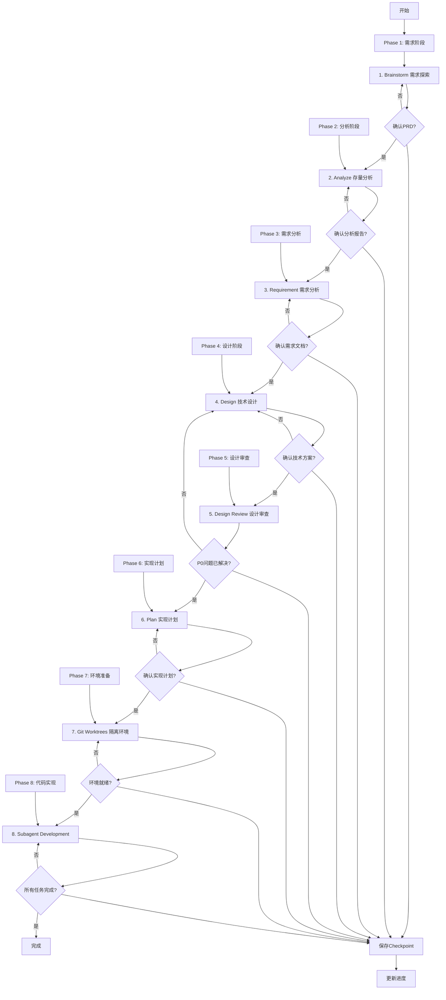

# Full Flow - 完整开发流程

## Overview

完整的开发流程，包含 v2.4 MVP 的 8 个核心节点，适合复杂功能开发、团队协作项目和企业级应用。

**核心原则**: 标准化流程 + 人工确认 + 质量保证 = 可靠交付

**开始时宣布**: "我正在使用 full-flow skill 来执行完整的开发流程。"

## When to Use

### 使用场景判断

**应该使用**:
- ✅ 复杂功能开发（预估 >2小时）
- ✅ 团队协作项目（需要完整文档）
- ✅ 企业级应用（需要设计审查）
- ✅ 涉及存量代码改造（需要 Analyze 节点）
- ✅ 需要完整追溯（需要所有产物）

**可以跳过**（使用其他流程）:
- ⚠️ 简单功能（预估 <2小时）→ 使用 quick-flow
- ⚠️ 技术研究/原型开发 → 使用 exploration-flow
- ⚠️ 需求明确且简单 → 使用 quick-flow

### 前置条件

- ✅ 已激活项目（使用 `cad-load` skill）
- ✅ 所有节点 Skills 可用（方案1-6）
- ✅ 有足够的开发时间

## The Process



### 流程初始化（开始前自动执行）

**重要**: 流程开始前， 自动执行以下初始化，无需用户干预：

#### Step 1: 获取项目信息

```yaml
# 获取项目ID
project_id = get_project_id()  # 从 CLAUDE.md 或 Git 仓库名称

# 获取项目名称
project_name = get_project_name()

# 获取当前 Git 分支
git_branch = get_current_branch()
```

#### Step 2: 创建 Progress 记录

使用 Serena `write_memory` 创建进度记录：

```yaml
# 构建 Progress 数据
progress_data = {
  metadata: {
    version: "1.0"
    project_id: project_id
    project_name: project_name
    flow_type: "full-flow"
    created_at: get_current_timestamp()
    updated_at: get_current_timestamp()

  project_info: {
    name: project_name
    current_phase: "brainstorm"
    git_branch: git_branch
  }

  phases: [
    {phase_name: "brainstorm", status: "pending", start_time: null, end_time: null, tasks: []}
    {phase_name: "analyze", status: "pending", start_time: null, end_time: null, tasks: []}
    {phase_name: "requirement", status: "pending", start_time: null, end_time: null, tasks: []}
    {phase_name: "design", status: "pending", start_time: null, end_time: null, tasks: []}
    {phase_name: "design-review", status: "pending", start_time: null, end_time: null, tasks: []}
    {phase_name: "plan", status: "pending", start_time: null, end_time: null, tasks: []}
    {phase_name: "git-worktrees", status: "pending", start_time: null, end_time: null, tasks: []}
    {phase_name: "subagent-development", status: "pending", start_time: null, end_time: null, tasks: []}
  ]

  overall_progress: {
    percentage: 0
    completed_phases: 0
    total_phases: 8
  }

  time_stats: {
    total_time: 0
    estimated_remaining: 0
  }
}

# 保存 Progress
write_memory(f"progress-{project_id}", progress_data)
```

#### Step 3: 创建查询索引

```yaml
# 创建时间索引
time_index = {}
write_memory(f"index-{project_id}-checkpoints-by-time", time_index)

# 创建阶段索引
phase_index = {
  brainstorm: []
  analyze: []
  requirement: []
  design: []
  design-review: []
  plan: []
  git-worktrees: []
  subagent-development: []
}
write_memory(f"index-{project_id}-checkpoints-by-phase", phase_index)
```

#### Step 4: 显示初始化完成

```
✅ 流程初始化完成！

项目信息:
- 项目ID: {project_id}
- 项目名称: {project_name}
- 流程类型: full-flow
- Git 分支: {git_branch}

准备开始 Phase 1: 需求阶段...
```

---

### 详细步骤

#### Phase 1: 需求阶段（20-40分钟）

##### 1. Brainstorm（需求探索）

**调用 Skill**: `brainstorming`

**输入**:
- 用户描述的需求

**输出**:
- PRD 文档（`.claude/docs/{date}_PRD_{功能名称}_v1.0.md`）

**人工确认**:
```
PRD 已生成：
- 功能概述：{概述}
- 核心需求：{需求列表}

是否确认 PRD？
├── ✅ 确认 → 进入 Analyze
├── ⚠️ 需要调整 → 重新 Brainstorm
└── ❌ 不满意 → 重新 Brainstorm
```

---

#### Phase 2: 分析阶段（15-30分钟）

##### 2. Analyze（存量分析）

**调用 Skill**: `analyze`

**输入**:
- PRD 文档（来自 Brainstorm）

**输出**:
- 存量分析报告（`.claude/analysis/{date}_存量分析_{功能名称}_v1.0.md`）

**人工确认**:
```
存量分析已完成：
- 现有架构：{架构概述}
- 相关模块：{模块列表}
- 改造影响：{影响分析}

是否确认分析报告？
├── ✅ 确认 → 进入 Requirement
├── ⚠️ 需要调整 → 重新 Analyze
└── ❌ 不满意 → 重新 Analyze
```

---

#### Phase 3: 需求分析（20-40分钟）

##### 3. Requirement（需求分析）

**调用 Skill**: `requirement`

**输入**:
- PRD 文档（来自 Brainstorm）
- 存量分析报告（来自 Analyze）

**输出**:
- 需求文档（`.claude/docs/{date}_需求文档_{功能名称}_v1.0.md`）

**人工确认**:
```
需求文档已生成：
- 功能需求：{需求列表}
- 非功能需求：{需求列表}
- 验收标准：{标准列表}

是否确认需求文档？
├── ✅ 确认 → 进入 Design
├── ⚠️ 需要调整 → 重新 Requirement
└── ❌ 不满意 → 重新 Requirement
```

---

#### Phase 4: 设计阶段（30-60分钟）

##### 4. Design（技术设计）

**调用 Skill**: `design`

**输入**:
- 需求文档（来自 Requirement）
- 存量分析报告（来自 Analyze）

**输出**:
- 技术方案（`.claude/designs/{date}_技术方案_{功能名称}_v1.0.md`）

**人工确认**:
```
技术方案已生成：
- 系统架构：{架构概述}
- 数据模型：{模型设计}
- API 设计：{API 列表}
- 技术选型：{技术栈}

是否确认技术方案？
├── ✅ 确认 → 进入 Design Review
├── ⚠️ 需要调整 → 重新 Design
└── ❌ 不满意 → 重新 Design
```

---

#### Phase 5: 设计审查（15-30分钟）

##### 5. Design Review（设计审查）

**调用 Skill**: `design-review`

**输入**:
- 技术方案（来自 Design）

**输出**:
- 审查报告（`.claude/docs/{date}_设计审查_{功能名称}_v1.0.md`）

**人工确认**:
```
设计审查已完成：
- P0 问题：{问题列表}
- P1 问题：{问题列表}
- P2 问题：{问题列表}

所有 P0 问题是否已解决？
├── ✅ 已解决 → 进入 Plan
├── ⚠️ 需要修改 → 返回 Design（带着审查报告）
└── ❌ 标记为技术债务 → 进入 Plan（记录技术债务）
```

**注意**: P0 问题必须解决，或明确标记为技术债务

---

#### Phase 6: 实现计划（15-30分钟）

##### 6. Plan（实现计划）

**调用 Skill**: `plan`

**输入**:
- 技术方案（来自 Design）
- 审查报告（来自 Design Review，可选）

**输出**:
- 实现计划（`.claude/designs/{date}_实现计划_{功能名称}_v1.0.md`）

**人工确认**:
```
实现计划已生成：
- 任务数量：{数量}
- 预估时间：{时间范围}
- 并行任务：{任务列表}

是否确认实现计划？
├── ✅ 确认 → 进入 Git Worktrees
├── ⚠️ 需要调整 → 重新 Plan
└── ❌ 不满意 → 重新 Plan
```

---

#### Phase 7: 环境准备（5-10分钟）

##### 7. Git Worktrees（隔离环境）

**调用 Skill**: `using-git-worktrees`

**输入**:
- 实现计划（来自 Plan）

**输出**:
- Git worktree 工作目录
- 新分支（feature/{feature-name}）
- Worktree 信息报告

**人工确认**:
```
Worktree 已创建：
- 位置：{路径}
- 分支：{分支名}
- 测试：✅ 通过

是否确认环境就绪？
├── ✅ 确认 → 进入 Subagent Development
├── ⚠️ 需要调整 → 重新 Git Worktrees
└── ❌ 不满意 → 重新 Git Worktrees
```

---

#### Phase 8: 代码实现（根据复杂度动态调整）

##### 8. Subagent Development（代码实现+单元测试）

**调用 Skill**: `subagent-development`

**输入**:
- 实现计划（来自 Plan）
- Worktree 信息（来自 Git Worktrees）
- 技术方案（来自 Design）

**输出**:
- 代码实现
- 单元测试（覆盖率 ≥ 80%）
- 测试覆盖率报告
- 代码审查报告
- Git commits

**自动流程**:
- Implementer Subagent (8.1) → 实现 + 测试 + 自审 + 提交
- Spec Reviewer Subagent (8.2) → 规范合规审查
- Code Quality Reviewer Subagent (8.3) → 代码质量审查
- 循环直到所有任务完成

**人工确认**:
```
所有任务已完成：
- 完成任务：{数量}/{总数}
- 测试覆盖率：{百分比}%
- 审查结果：✅ 全部通过

是否确认开发完成？
├── ✅ 确认 → 流程完成
├── ⚠️ 需要调整 → 继续修复
└── ❌ 不满意 → 继续修复
```

---

#### 完成

```
✅ 完整流程已完成！

项目信息：
- 功能名称：{名称}
- Git 分支：{分支}
- 工作目录：{路径}

完成节点：8/8
- ✅ Brainstorm
- ✅ Analyze
- ✅ Requirement
- ✅ Design
- ✅ Design Review
- ✅ Plan
- ✅ Git Worktrees
- ✅ Subagent Development

输出产物：
- PRD 文档：{路径}
- 存量分析报告：{路径}
- 需求文档：{路径}
- 技术方案：{路径}
- 审查报告：{路径}
- 实现计划：{路径}
- 代码实现：{路径}
- 单元测试：{路径}

时间统计：
- 总耗时：{时间}
- 文档编写：{时间}
- 代码开发：{时间}

下一步建议：
1. 使用 /finish 完成开发分支
2. 创建 Pull Request
3. 或继续其他功能开发
```

## Input/Output

### 输入来源

1. **用户需求**: 功能描述、业务需求
2. **项目上下文**: 当前项目状态、技术栈
3. **存量代码**: 现有代码库（如涉及）

### 输出产物

#### 产物1：项目文档（6份）
- PRD 文档
- 存量分析报告
- 需求文档
- 技术方案
- 审查报告
- 实现计划

#### 产物2：代码实现
- 功能代码
- 单元测试（覆盖率 ≥ 80%）
- Git commits

#### 产物3：进度记录
- Session Summary
- 8 个 Checkpoints
- TodoWrite 任务记录

## Integration

### 前置 Skills

**依赖所有节点 Skills（方案1-6）**:
- brainstorming (方案4)
- analyze (方案4)
- requirement (方案4)
- design (方案5)
- design-review (方案5)
- plan (方案5)
- using-git-worktrees (方案6)
- subagent-development (方案6)

### 后续 Skills

- **finishing-a-development-branch** - 完成开发分支

### 相关 Commands

- `/status` - 查看进度
- `/resume` - 恢复进度
- `/checkpoint` - 创建检查点
- `/report` - 生成报告

## Checklist

### 准备阶段
- [ ] 是否激活了项目（使用 `cad-load` skill）？
- [ ] 是否了解了项目上下文？
- [ ] 是否确认有足够的时间？

### Phase 1-2: 需求阶段
- [ ] PRD 是否生成？
- [ ] 用户是否确认 PRD？
- [ ] Checkpoint 是否保存？

### Phase 3-4: 分析阶段
- [ ] 存量分析是否完成？
- [ ] 需求文档是否生成？
- [ ] 用户是否确认？

### Phase 5-6: 设计阶段
- [ ] 技术方案是否生成？
- [ ] 设计审查是否通过？
- [ ] P0 问题是否已解决？

### Phase 7: 计划阶段
- [ ] 实现计划是否生成？
- [ ] 任务分解是否合理？
- [ ] 用户是否确认？

### Phase 8: 环境准备
- [ ] Worktree 是否创建成功？
- [ ] 测试基线是否通过？
- [ ] 环境是否就绪？

### Phase 9: 代码实现
- [ ] 所有任务是否完成？
- [ ] 测试覆盖率是否 ≥ 80%？
- [ ] 审查是否全部通过？
- [ ] Git commits 是否规范？

### 完成阶段
- [ ] 所有节点是否完成？
- [ ] 文档是否完整？
- [ ] 代码是否可用？
- [ ] Checkpoint 是否保存？

## Red Flags

**绝不**:
- 跳过任何节点（除非用户明确要求）
- 在未确认的情况下进入下一节点
- 跳过人工确认
- 忽略 P0 问题
- 不保存 Checkpoint
- 在测试未通过的情况下声称完成

**始终**:
- 每个节点完成后要求人工确认
- 保存 Checkpoint
- 更新进度（TodoWrite）
- 遵循节点 Skills 的规范
- 确保质量（TDD + 审查）

## Example Workflow

```
你: 我正在使用 full-flow skill 来执行完整的开发流程。

[Phase 1: Brainstorm]
[调用 brainstorming skill]
[生成 PRD 文档]

PRD 已生成：
- 功能概述：用户权限管理系统
- 核心需求：5个核心功能

是否确认 PRD？
用户: 确认

[保存 Checkpoint]
[更新进度]

[Phase 2: Analyze]
[调用 analyze skill]
[生成存量分析报告]

存量分析已完成：
- 现有架构：微服务架构
- 相关模块：用户服务、权限服务

是否确认分析报告？
用户: 确认

[保存 Checkpoint]

...

[Phase 8: Subagent Development]
[调用 subagent-development skill]
[Implementer 8.1 实现 + 测试]
[Spec Reviewer 8.2 审查]
[Code Quality Reviewer 8.3 审查]
[循环直到所有任务完成]

所有任务已完成：
- 完成任务：5/5
- 测试覆盖率：85%
- 审查结果：✅ 全部通过

是否确认开发完成？
用户: 确认

[保存最终 Checkpoint]

✅ 完整流程已完成！
```

### 流程完成总结（结束后自动执行）

**重要**: 所有节点完成后，自动执行以下总结，无需用户干预：

#### Step 1: 生成 Session Summary

使用 Serena `write_memory` 生成会话总结：

- **记忆名称**: `session-{project_id}-{date}`
- **内容结构**:
  ```json
  {
    "metadata": {
      "version": "1.0",
      "session_id": "{uuid}",
      "project_id": "{project_id}",
      "project_name": "{project_name}",
      "flow_type": "full-flow",
      "start_time": "{start_timestamp}",
      "end_time": "{end_timestamp}",
      "duration_minutes": "{calculated}",
      "date": "{YYYY-MM-DD}"
    },
    "phases_completed": [
      {
        "phase_name": "brainstorm",
        "status": "completed",
        "start_time": "{timestamp}",
        "end_time": "{timestamp}",
        "duration_minutes": "{calculated}",
        "output_files": ["{file_path}"],
        "checkpoint_id": "{checkpoint_uuid}"
      },
      // ... 8个节点的完成信息
    ],
    "deliverables": {
      "prd_file": "{path}",
      "analyze_report": "{path}",
      "requirement_doc": "{path}",
      "design_doc": "{path}",
      "plan_doc": "{path}",
      "code_files": ["{paths}"],
      "test_files": ["{paths}"]
    },
    "quality_metrics": {
      "test_coverage": "{percentage}",
      "spec_review": "passed",
      "code_quality_review": "passed",
      "p0_issues_resolved": true
    },
    "checkpoints_created": ["{uuid1}", "{uuid2}", ...],
    "git_commits": ["{commit_hash1}", "{commit_hash2}", ...],
    "git_worktree": {
      "worktree_path": "{path}",
      "branch_name": "{branch}",
      "status": "active"
    }
  }
  ```

#### Step 2: 计算统计数据

从 Progress 记录中提取：
- 总用时（从 start_time 到 end_time）
- 完成节点数（8个）
- 生成的文档列表
- 创建的 Checkpoint 数量
- Git commits 数量
- 测试覆盖率
- 审查结果

#### Step 3: 更新查询索引

使用 Serena `write_memory` 更新索引：

- **时间索引**: `index-sessions-by-time`
  ```json
  {
    "sessions": [
      {
        "session_id": "{session_id}",
        "project_id": "{project_id}",
        "date": "{YYYY-MM-DD}",
        "flow_type": "full-flow",
        "duration_minutes": "{calculated}",
        "status": "completed"
      },
      // ... 其他会话
    ]
  }
  ```

- **项目索引**: `index-sessions-by-project`
  ```json
  {
    "projects": {
      "{project_id}": {
        "sessions": [
          {
            "session_id": "{session_id}",
            "date": "{YYYY-MM-DD}",
            "flow_type": "full-flow",
            "status": "completed"
          },
          // ... 该项目的其他会话
        ]
      }
    }
  }
  ```

#### Step 4: 显示完成报告

输出格式：
```
✅ Full Flow 已完成！

📊 会话统计:
- 项目: {project_name}
- 总用时: {duration}
- 完成节点: 8/8 (100%)
- 创建时间: {start_time}
- 完成时间: {end_time}

📄 交付物:
- PRD: {prd_file}
- 分析报告: {analyze_report}
- 需求文档: {requirement_doc}
- 技术方案: {design_doc}
- 实现计划: {plan_doc}
- 代码文件: {count} 个
- 测试文件: {test_count} 个

✅ 质量指标:
- 测试覆盖率: {coverage}%
- 规范审查: ✅ 通过
- 代码质量审查: ✅ 通过
- P0 问题: ✅ 已解决

💾 进度追踪:
- Checkpoints: {checkpoint_count} 个
- Git Commits: {commit_count} 个
- Worktree: {worktree_path}
- 分支: {branch_name}

📝 Session Summary 已保存: session-{project_id}-{date}

🎉 项目开发流程已完成！
```

---

## 时间预估

| 复杂度 | 代码量预估 | 总时间范围 |
|--------|-----------|-----------|
| 🟢 简单 | <500行 | 3-4小时 |
| 🟡 中等 | 500-2000行 | 4-7小时 |
| 🔴 复杂 | >2000行 | 7-12小时 |

**节点时间分布**:
- Phase 1-2: 35-70分钟
- Phase 3-4: 50-100分钟
- Phase 5-6: 30-60分钟
- Phase 7: 5-10分钟
- Phase 8: 根据复杂度动态调整
