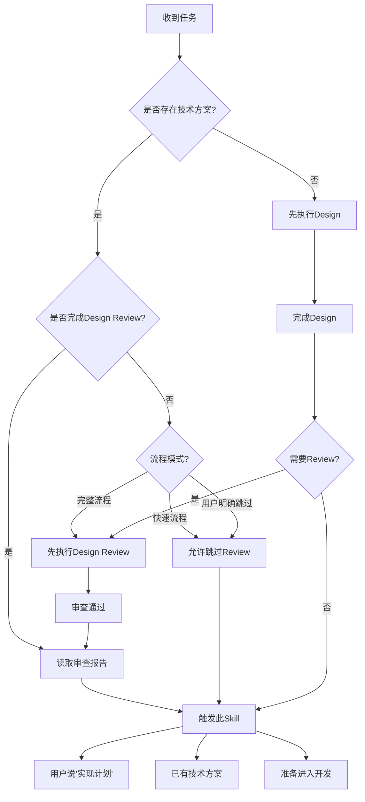
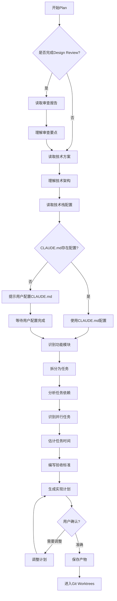

# Plan - 实现计划

## Overview

基于技术方案（必须）和审查报告（如已完成 Design Review），制定详细的实现计划。实现计划包含任务分解、任务依赖关系、并行任务识别、时间估计、验收标准等内容。注意：Plan 阶段不识别风险（风险已在 Design Review 阶段完成）。

**关键职责：**
- ✅ 将技术方案分解为可执行的任务
- ✅ 识别任务依赖关系和并行执行机会
- ✅ 为每个任务提供时间估计和验收标准
- ✅ 支持 Subagent Development 的任务分配
- ❌ 不负责风险识别（已在 Design Review 完成）

## When to Use

### 前置条件
- ✅ 已存在技术方案文档（来自 Design 或用户已有文档）
- ✅ 如果是完整流程，已通过 Design Review（可选：快速流程可跳过）

### 触发条件
当：
- 用户说"实现计划..."
- 用户说"任务分解..."
- 用户说"开发计划..."
- 已有技术方案，准备进入开发阶段
- 技术方案已通过 Design Review（完整流程）

### 判断流程



### 灵活性说明

**可跳过 Design Review：**
- ✅ 快速流程：简单功能（预估 <2 小时），可跳过 Design Review
- ✅ 用户明确要求：用户已有技术方案，明确要求跳过 Design Review
- ✅ 探索流程：原型开发，可跳过 Design Review

**不可跳过 Design Review：**
- ❌ 完整流程：复杂功能（预估 >2 小时），必须通过 Design Review
- ❌ 企业级项目：需要严格审查的项目

## The Process

### 详细流程



### 步骤说明

1. **读取审查报告**（可选）
   - 如果已完成 Design Review，读取审查报告
   - 理解审查要点和关键问题
   - 标注需要在实现中注意的事项
   - 确认 P0 问题已在设计中解决

2. **读取技术方案** ⭐
   - 读取 Design 阶段生成的技术方案（必须）
   - 或读取用户提供的已有技术方案
   - 理解系统架构、数据模型、API 设计
   - 理解技术选型和约束

3. **读取技术栈配置** ⭐⭐（新增）
   - **步骤 1：检查用户对话中是否指定**
     - 如果用户在对话中已指定技术栈配置，使用用户指定的配置
     - 示例："使用 Python + pytest"
   - **步骤 2：检查 CLAUDE.md**
     - 读取项目根目录的 `CLAUDE.md` 文件
     - 查找 `tech_stack` 配置
     - 如果存在 → 直接使用
   - **步骤 3：如果未找到配置**
     - **停止并提示用户配置 CLAUDE.md**：
       ```
       ⚠️ 技术栈配置未找到。

       请在 CLAUDE.md 中配置技术栈：

       ## Tech Stack

       ```yaml
       tech_stack:
         language: "your-language"
         test_command: "your-test-command"
         test_coverage_command: "your-coverage-command"
         lint_command: "your-lint-command"
         format_command: "your-format-command"
         coverage_threshold: 80
       ```

       示例配置：

       **JavaScript/TypeScript:**
       language: "javascript"
       test_command: "npm test"
       test_coverage_command: "npm run test:coverage"
       lint_command: "npm run lint"
       format_command: "npm run format"

       **Python:**
       language: "python"
       test_command: "pytest tests/"
       test_coverage_command: "pytest --cov=src --cov-report=term-missing"
       lint_command: "flake8 src/ tests/"
       format_command: "black src/ tests/ && isort src/ tests/"
       ```
     - **等待用户配置完成**
   - **步骤 4：整理输出**
     - 将技术栈信息输出到 Plan 文档的"技术栈配置"章节
     - 每个任务继承项目技术栈配置

4. **识别功能模块**
   - 将技术方案按模块划分
   - 识别核心模块和扩展模块
   - 识别模块间的依赖关系
   - 确定模块优先级（P0/P1/P2）

5. **拆分为任务** ⭐
   - 将每个模块拆分为具体任务
   - **任务粒度标准**：
     - 每个任务可独立完成（1-4 小时）
     - 每个任务有明确的验收标准
     - 每个任务可以分配给单个开发者
   - 标注任务优先级（P0/P1/P2）
   - 标注任务复杂度（简单/中等/复杂）

6. **分析任务依赖** ⭐
   - 识别任务间的依赖关系
   - 标注前置任务
   - 绘制依赖关系图（使用 Mermaid）
   - 识别关键路径

7. **识别并行任务** ⭐
   - 识别可以并行执行的任务
   - 标注并行任务组
   - 提供并行执行建议
   - 为 Subagent Development 提供并发能力支持

8. **估计任务时间**
   - 每个任务给出时间范围（如 1-2 小时）
   - 基于任务复杂度（简单/中等/复杂）
   - 考虑存量代码改造的影响
   - 计算总时间（串行路径 + 并行最长路径）

9. **编写验收标准** ⭐
   - 每个任务必须有可测试的验收标准
   - 验收标准清晰、具体、可验证
   - 验收标准与需求文档的验收标准对应
   - 标注验收标准的优先级

10. **生成实现计划**
    - 汇总为完整的实现计划文档
    - 包含任务清单、依赖关系、并行建议、时间估计
    - 不包含风险评估（已在 Design Review 完成）

11. **用户确认**
    - 确保实现计划合理可行
    - 确认任务分解是否完整

### 工具使用

**Serena MCP**:
- `read_file` - 读取技术方案和审查报告
- `write_file` - 保存实现计划

**Mermaid**:
- 绘制任务依赖关系图
- 绘制任务执行甘特图

## 输入来源

1. **技术方案**：来自 Design 阶段或用户已有文档（必须）
2. **审查报告**：来自 Design Review 阶段（可选：完整流程需要）
3. **需求文档**：来自 Requirement 阶段（可选：提供验收标准参考）
4. **用户对话**：用户补充任务细节和优先级调整

## 动态时间预估

| 复杂度 | 时间范围 | 说明 |
|-------|---------|------|
| 🟢 简单 | 5-10分钟 | 3-5个任务，依赖关系简单 |
| 🟡 中等 | 10-20分钟 | 5-10个任务，有一定依赖关系 |
| 🔴 复杂 | 20-40分钟 | 10+个任务，复杂依赖关系和并行任务 |

## 输出产物

**文件路径：** `cadence/designs/{date}_实现计划_{功能名称}_v1.0.md`

**生成时间：** 5-40 分钟（取决于复杂度）

### 主要内容概览

1. **任务概览**：总任务数、时间估计、关键路径
2. **任务清单**：按优先级和依赖关系组织的详细任务列表
3. **任务依赖关系**：Mermaid 图形化展示依赖关系和关键路径
4. **并行执行建议**：识别可并行任务组，优化执行效率
5. **Subagent 支持**：任务描述格式、优先级排序、分配建议
6. **技术栈配置**：项目级配置、任务级继承、两层配置优先级
7. **验收清单**：功能、质量、文档三个维度的验收标准
8. **实现注意事项**：来自 Design Review 的要点和技术约束

### 技术栈配置流程

Plan 文档会从 CLAUDE.md 读取项目技术栈配置，并输出到实现计划中：

```
CLAUDE.md (用户维护)
    ↓ Plan Skill 读取
实现计划 (tech_stack 配置)
    ↓ Subagent 使用
代码实现 (test/lint/format)
```

**技术栈配置优先级**：
1. **User Specified in Conversation**（最高优先级）：用户在对话中指定
2. **CLAUDE.md Configuration**（次优先级）：项目级默认配置
3. **Missing Configuration**（缺失）：提示用户配置 CLAUDE.md

**⚠️ 重要：不自动检测**
- ❌ 不使用 auto-detect 逻辑
- ✅ 必须从用户对话或 CLAUDE.md 获取配置
- ✅ 如果缺失，提示用户配置

## 关键检查清单 ✅

- [ ] 技术方案读取：是否已读取并理解技术方案？
- [ ] 任务完整性：是否覆盖了所有功能点？
- [ ] 任务粒度：每个任务是否可独立完成（1-4 小时）？
- [ ] 依赖关系：任务间依赖是否清晰标注？
- [ ] 并行识别：是否识别了可并行执行的任务？
- [ ] 时间估计：每个任务是否有合理的时间估计？
- [ ] 验收标准：每个任务是否有明确可测试的验收标准？
- [ ] 优先级排序：任务是否有优先级排序（P0/P1/P2）？
- [ ] Subagent 支持：任务描述是否足够支持 Subagent 执行？

## Red Flags ⚠️

| 错误做法 | 正确做法 |
|---------|---------|
| ❌ 没有技术方案就做 Plan | ✅ 必须先完成 Design 或使用已有技术方案 |
| ❌ 任务粒度过大（>4 小时） | ✅ 任务应该可独立执行，1-4 小时 |
| ❌ 任务粒度过小（<30 分钟） | ✅ 合并过小任务，保持合理粒度 |
| ❌ 忽略任务依赖 | ✅ 必须明确任务间的依赖关系 |
| ❌ 没有验收标准 | ✅ 每个任务必须有可测试的验收标准 |
| ❌ 未识别并行任务 | ✅ 必须识别可并行执行的任务 |
| ❌ 在 Plan 阶段识别风险 | ✅ 风险已在 Design Review 阶段识别 |
| ❌ 时间估计过于乐观 | ✅ 给出合理的时间范围 |

## After the Plan

完成实现计划后，自动触发以下4步逻辑：

### Step 1: 保存实现计划

**触发条件**: 用户确认实现计划合理
**执行动作**:
- 保存实现计划到 `cadence/designs/{date}_实现计划_{功能名称}_v1.0.md`
- 记录保存路径，供后续节点使用

**输出**:
```
✅ 实现计划已保存到: cadence/designs/2026-03-05_实现计划_用户认证_v1.0.md
```

### Step 2: 询问是否进入 Git Worktrees

**触发条件**: 实现计划保存成功
**执行动作**:
- 询问用户是否进入 Git Worktrees 阶段
- 提供两个选项：立即进入 / 暂不进入

**提示信息**:
```
📋 实现计划已完成！

是否进入 Git Worktrees 阶段创建隔离开发环境？

1. ✅ 立即进入 - 自动触发 using-git-worktrees
2. ⏸️ 暂不进入 - 稍后手动触发

请选择（1 或 2）：
```

### Step 3: 自动触发 Git Worktrees（可选）

**触发条件**: 用户选择"立即进入"
**执行动作**:
- 自动触发 `using-git-worktrees` Skill
- 传递必要的上下文信息：
  - 功能名称（来自实现计划）
  - 任务优先级（决定分支创建顺序）
  - 任务依赖关系（决定分支创建顺序）

**传递的上下文**:
```yaml
plan_path: "cadence/designs/2026-03-05_实现计划_用户认证_v1.0.md"
feature_name: "用户认证"
tasks:
  - name: "Task 1: 实现用户注册"
    priority: "P0"
  - name: "Task 2: 实现用户登录"
    priority: "P0"
  - name: "Task 3: 实现密码加密"
    priority: "P1"
```

### Step 4: 等待 Git Worktrees 完成（可选）

**触发条件**: 已触发 Git Worktrees
**执行动作**:
- 等待 Git Worktrees 完成环境创建
- Git Worktrees 完成后，自动提示下一步

**完成提示**:
```
✅ Git Worktrees 环境创建完成！

开发环境路径: .worktrees/feature-user-auth/
分支名称: feature/user-auth

下一步：
- 手动触发 Subagent Development 开始代码实现
- 或使用 /resume 命令恢复开发流程
```

---

## Integration

### 前置依赖
- **design**（必须）：提供技术方案
- **design-review**（可选）：完整流程需要，快速流程可跳过

### 下一步
- **using-git-worktrees**：创建隔离的开发环境

### 替代方案
- 如果已有实现计划，可直接进入 Git Worktrees
- 极简单功能可跳过此节点（需用户确认）

### 需要的输入
- 技术方案（来自 Design 或用户已有文档，必须）
- 审查报告（来自 Design Review，可选：完整流程需要）
- 需求文档（来自 Requirement，可选：提供验收标准参考）

### 与 Design Review 的关系

**完整流程：**
```
Design → Design Review → Plan（带着审查报告）
```

**快速流程：**
```
Design → Plan（跳过 Design Review）
```

**Plan 节点处理审查报告：**
- ✅ 如果存在审查报告，读取并理解审查要点
- ✅ 在实现计划中标注来自审查的关键注意事项
- ✅ 确认 P0 问题已在设计中解决
- ❌ 不重新识别风险（风险已在 Design Review 完成）

## 确认机制

生成实现计划后：
展示任务清单（按优先级分组）
展示任务依赖关系图
展示并行执行建议
展示总时间估计
**如果存在审查报告，展示来自审查的关键注意事项**

询问："实现计划是否合理？有没有遗漏？"
├── ✅ 合理 → 保存产物，进入 git-worktrees
├── ⚠️ 需要调整 → 调整计划
└── ❌ 不可行 → 重新设计

## 跳过条件

- 已存在详细的实现计划文档
- 极简单功能（1-2 个任务，无需详细计划）
- 纯原型开发（探索阶段）
- 用户明确表示不需要

## 与 Design 的边界

**Design 阶段负责：**
- ✅ 技术方案（架构、数据模型、API、技术选型）
- ✅ 技术方案的可行性分析
- ✅ 技术方案的详细设计

**Plan 阶段负责：**
- ✅ 任务分解（将技术方案拆分为具体任务）
- ✅ 任务依赖关系和并行识别
- ✅ 任务时间估计和验收标准
- ✅ Subagent Development 的任务分配支持

**关键区别：**
- Design 输出：技术方案（1 个文档，"怎么做"）
- Plan 输出：实现计划（1 个文档，"做什么任务"）
- Design 关注技术选型和架构设计
- Plan 关注任务分解和执行计划
- Plan 不改变技术方案，只负责拆解和规划

## 与 Git Worktrees 的衔接

**Plan 节点的输出支持 Git Worktrees：**
- ✅ 任务清单明确，可创建对应的 feature 分支
- ✅ 优先级清晰，可按优先级创建分支（P0 优先）
- ✅ 依赖关系明确，可按依赖顺序创建分支

**Git Worktrees 的输入来自 Plan：**
- ✅ 功能名称（来自实现计划）
- ✅ 任务优先级（决定分支创建顺序）
- ✅ 任务依赖（决定分支创建顺序）

## 与 Subagent Development 的衔接

**Plan 节点的输出支持 Subagent Development：**
- ✅ 每个任务可以直接分配给 Subagent
- ✅ 任务描述包含：目标、约束、验收标准、依赖、时间
- ✅ 并行任务识别支持 Subagent 并发执行
- ✅ 优先级排序支持任务执行顺序

**Subagent Development 的输入来自 Plan：**
- ✅ 任务清单（Task 1、Task 2、Task 3...）
- ✅ 任务描述（YAML 格式，可直接使用）
- ✅ 并行执行建议（可并发执行的 Subagent）
- ✅ 验收标准（用于 Code Review）
