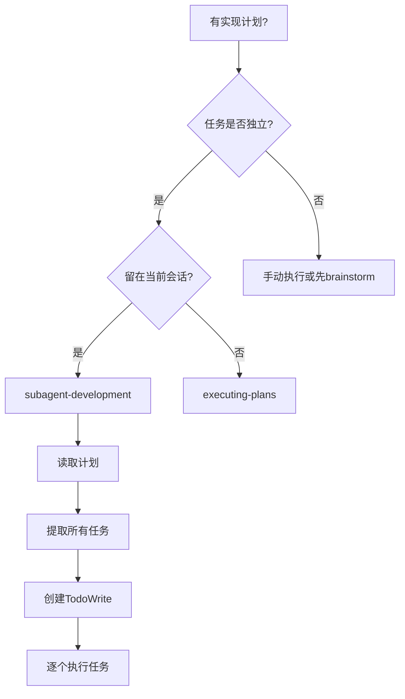
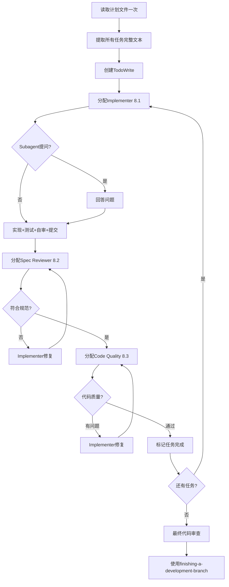

# Subagent Development - 代码实现+单元测试

## Overview

使用 Subagent 执行计划，每个任务分配一个新的 subagent，每次完成后进行两阶段审查：先规范合规审查，再代码质量审查。

**核心原则**: 每个 task 一个新 subagent + 两阶段审查（先 spec 再质量）= 高质量，快速迭代

**开始时宣布**: "我正在使用 Subagent Development skill 来执行这个实现计划。"

## When to Use



### 使用场景判断

**应该使用**:
- ✅ 有实现计划（来自 plan skill）
- ✅ 任务大部分独立
- ✅ 需要留在当前会话
- ✅ 需要两阶段审查保证质量

**不应该使用**:
- ❌ 没有实现计划
- ❌ 任务紧密耦合
- ❌ 需要并行会话

### 前置条件

- ✅ **必须有**: 实现计划（来自 plan skill）
- ✅ **强烈建议**: Worktree 信息（来自 using-git-worktrees skill）
- ✅ **可选**: 技术方案（来自 design skill）

## The Process



### 详细步骤

#### Phase 1: 准备阶段

##### 1. 读取计划文件（一次性）

```bash
# 读取计划文件
cat cadence/designs/{date}_实现计划_{功能名称}_v1.0.md
```

**关键**: 只读取一次，避免重复文件读取。

##### 2. 提取所有任务（带完整文本和上下文）

从计划中提取：
- 所有任务描述（完整文本）
- 每个任务的上下文（在整体方案中的位置）
- 任务依赖关系
- 并行任务建议

##### 3. 创建 TodoWrite

```json
{
  "tasks": [
    {
      "id": "1",
      "subject": "任务1标题",
      "description": "完整任务描述...",
      "status": "pending"
    },
    {
      "id": "2",
      "subject": "任务2标题",
      "description": "完整任务描述...",
      "status": "pending",
      "blockedBy": ["1"]
    }
  ]
}
```

#### Phase 2: 逐个任务执行

对每个任务：

##### 步骤1: 分配 Implementer Subagent (8.1)

使用 `./prompts/implementer-prompt.md` 模板：

**提供信息**:
- 任务的完整文本
- 任务的上下文（在整体方案中的位置）
- 技术方案（如果有）
- Worktree 信息（如果有）

**Subagent 行为**:
- 可能会提问 → 主 agent 回答
- 实现 + 测试 + 自审 + 提交

##### 步骤2: 分配 Spec Reviewer Subagent (8.2)

使用 `./prompts/spec-reviewer-prompt.md` 模板：

**检查内容**:
- 代码是否符合任务描述？
- 是否有遗漏的需求？
- 是否有额外的功能（超出范围）？

**审查结果**:
- ✅ **符合规范** → 进入步骤3
- ❌ **有问题** → Implementer 修复 → 重新审查（循环）

##### 步骤3: 分配 Code Quality Reviewer Subagent (8.3)

使用 `./prompts/code-quality-reviewer-prompt.md` 模板：

**检查内容**:
- 代码质量（命名、结构、注释）
- 测试覆盖率（P0 ≥ 80%）
- 安全漏洞
- 性能问题

**审查结果**:
- ✅ **Approved** → 标记任务完成
- ❌ **Issues** → Implementer 修复 → 重新审查（循环）

##### 步骤4: 标记任务完成

更新 TodoWrite:
```json
{
  "id": "1",
  "status": "completed"
}
```

#### Phase 3: 最终审查

##### 1. 所有任务完成后

分配最终的 Code Reviewer Subagent（使用 superpowers:requesting-code-review）:

**检查内容**:
- 整体实现是否符合需求？
- 模块间协作是否正常？
- 是否有遗漏的功能？

##### 2. 使用 finishing-a-development-branch

调用 `superpowers:finishing-a-development-branch` skill：
- 决定如何集成工作（merge, PR, cleanup）
- 清理 worktree（如果使用了）
- 完成开发分支

## Input/Output

### 输入来源

1. **必须输入**:
   - 实现计划（来自 plan skill）- 包含任务清单、验收标准
   - 任务描述（YAML 格式）

2. **强烈建议输入**:
   - Worktree 信息（来自 using-git-worktrees skill）- 工作目录、分支

3. **可选输入**:
   - 技术方案（来自 design skill）- 提供技术约束
   - 需求文档（来自 requirement skill）- 业务背景
   - 存量分析（来自 analyze skill）- 现有代码结构

### 输出产物

#### 产物1：代码实现

- **位置**: Worktree 工作目录（如果使用）或当前目录
- **内容**: 功能代码、模块、组件等
- **质量**: 通过两阶段审查，测试覆盖率 ≥ 80%

#### 产物2：单元测试

- **位置**: 与代码同目录或 tests/ 目录
- **内容**: 单元测试、集成测试
- **覆盖率**: P0 ≥ 80%

#### 产物3：Git Commits

- **每个任务**: 一个或多个 commits
- **Commit message**: 遵循规范（feat/fix/refactor 等）

#### 产物4：审查报告

- **Spec Review Report**: 每个 task 一份
- **Code Quality Report**: 每个 task 一份
- **Final Review Report**: 整体实现一份

## Subagent Definitions

### Subagent 8.1: Implementer Subagent

**职责**: 代码实现 + 单元测试

**Prompt 模板**: `./prompts/implementer-prompt.md`

**输入**:
- 任务描述（完整文本）
- 任务的上下文
- 技术方案（可选）
- Worktree 信息（可选）

**输出**:
- 代码实现
- 单元测试
- Git commit

**行为**:
1. 可能会提问（主 agent 回答）
2. 遵循 TDD 流程（RED-GREEN-BLUE）
3. 编写代码和测试
4. 自我审查
5. 提交代码

---

### Subagent 8.2: Spec Reviewer Subagent

**职责**: 规范合规审查

**Prompt 模板**: `./prompts/spec-reviewer-prompt.md`

**输入**:
- 任务描述（完整文本）
- 代码实现（Git SHA）

**输出**:
- 审查报告（✅ 通过 / ❌ 有问题）

**检查内容**:
1. **完整性**: 所有需求是否都实现了？
2. **准确性**: 实现是否符合需求描述？
3. **范围**: 是否有额外的功能（超出范围）？
4. **遗漏**: 是否有遗漏的需求？

**审查结果格式**:
```
## 规范合规审查报告

### ✅ 符合规范
- [列出符合的部分]

### ❌ 有问题
- [列出问题]
  - 遗漏的需求: ...
  - 额外的功能: ...
  - 不符合的描述: ...

### 建议
- [修复建议]
```

---

### Subagent 8.3: Code Quality Reviewer Subagent

**职责**: 代码质量审查

**Prompt 模板**: `./prompts/code-quality-reviewer-prompt.md`

**输入**:
- 代码实现（Git SHA）
- 测试覆盖率报告

**输出**:
- 审查报告（Strengths / Issues / Approved）

**检查内容**:
1. **代码质量**: 命名、结构、注释、可读性
2. **测试覆盖率**: P0 ≥ 80%
3. **安全漏洞**: SQL注入、XSS、CSRF 等
4. **性能问题**: N+1查询、内存泄漏等
5. **最佳实践**: 是否遵循项目规范

**审查结果格式**:
```
## 代码质量审查报告

### Strengths（优点）
- [列出优点]

### Issues（问题）
#### Important（重要）
- [重要问题]

#### Nice to have（建议）
- [建议改进]

### Approved / Needs Revision
- [最终结论]
```

## Integration

### 被以下 Skills 调用

- **plan** (Phase 4) - 计划完成后自动调用
- **cadencing** - 流程编排时调用

### 前置 Skills

- **plan**（必须）- 提供任务清单和验收标准
- **using-git-worktrees**（强烈建议）- 提供隔离环境
- **design**（可选）- 提供技术约束

### 后续 Skills

- **finishing-a-development-branch** - 完成开发分支

### Subagents 使用的 Skills

- **superpowers:test-driven-development** - Implementer 遵循 TDD
- **superpowers:requesting-code-review** - 最终代码审查模板

## Checklist

### 准备阶段
- [ ] 是否读取了计划文件（只读取一次）？
- [ ] 是否提取了所有任务的完整文本？
- [ ] 是否提取了每个任务的上下文？
- [ ] 是否创建了 TodoWrite？

### 任务执行阶段（每个任务）
- [ ] 是否分配了 Implementer Subagent？
- [ ] 是否提供了完整的任务描述和上下文？
- [ ] 如果 Subagent 提问，是否回答了？
- [ ] 是否等待 Subagent 实现+测试+自审+提交？
- [ ] 是否分配了 Spec Reviewer Subagent？
- [ ] 如果 Spec Review 失败，是否让 Implementer 修复？
- [ ] 是否等待 Spec Review 通过？
- [ ] 是否分配了 Code Quality Reviewer Subagent？
- [ ] 如果 Quality Review 失败，是否让 Implementer 修复？
- [ ] 是否等待 Quality Review 通过？
- [ ] 是否标记任务完成？

### 最终阶段
- [ ] 所有任务是否完成？
- [ ] 是否分配了最终的 Code Reviewer？
- [ ] 是否使用了 finishing-a-development-branch？

## Red Flags

**绝不**:
- 在没有明确用户同意的情况下在 main/master 分支上开始实现
- 跳过审查（spec compliance 或 code quality）
- 继续进行未修复的问题
- 并行分配多个 implementation subagents（冲突）
- 让 subagent 读取计划文件（改为提供完整文本）
- 跳过场景设置上下文（subagent 需要了解任务适合哪里）
- 忽略 subagent 问题（在让他们继续之前回答）
- 在 spec compliance 上接受"足够接近"（spec reviewer 发现问题 = 未完成）
- 跳过审查循环（reviewer 发现问题 = implementer 修复 = 再次审查）
- 让 implementer 自审取代实际审查（两者都需要）
- **在 spec compliance ✅ 之前开始代码质量审查**（错误的顺序）
- 在任一审查有未解决的问题时移动到下一个任务

**如果 subagent 提问**:
- 清晰完整地回答
- 如果需要提供额外上下文
- 不要急于让他们进入实现

**如果 reviewer 发现问题**:
- Implementer（同一个 subagent）修复它们
- Reviewer 再次审查
- 重复直到批准
- 不要跳过重新审查

**如果 subagent 失败任务**:
- 分配修复 subagent 并提供具体说明
- 不要尝试手动修复（上下文污染）

## Example Workflow

```
你: 我正在使用 Subagent Development skill 来执行这个实现计划。

[读取计划文件一次: docs/plans/feature-plan.md]
[提取所有 5 个任务并带有完整文本和上下文]
[创建 TodoWrite 包含所有任务]

任务 1: Hook 安装脚本

[获取任务 1 文本和上下文（已提取）]
[分配 implementation subagent 并带有完整任务文本 + 上下文]

Implementer: "在我开始之前 - hook 应该安装在用户级还是系统级？"

你: "用户级（~/.config/superpowers/hooks/）"

Implementer: "明白了。现在实现..."
[稍后] Implementer:
  - 实现了 install-hook 命令
  - 添加了测试，5/5 通过
  - 自审：发现我错过了 --force 标志，添加了它
  - 已提交

[分配 spec compliance reviewer]
Spec reviewer: ✅ 符合规范 - 所有需求满足，没有额外内容

[获取 git SHA，分配 code quality reviewer]
Code reviewer: 优点：良好的测试覆盖，干净。问题：无。已批准。

[标记任务 1 完成]

任务 2: 恢复模式

[获取任务 2 文本和上下文（已提取）]
[分配 implementation subagent 并带有完整任务文本 + 上下文]

Implementer: [无问题，继续]
Implementer:
  - 添加了 verify/repair 模式
  - 8/8 测试通过
  - 自审：一切良好
  - 已提交

[分配 spec compliance reviewer]
Spec reviewer: ❌ 问题：
  - 缺失：进度报告（spec 说"每 100 项报告"）
  - 额外：添加了 --json 标志（未请求）

[Implementer 修复问题]
Implementer: 移除了 --json 标志，添加了进度报告

[Spec reviewer 再次审查]
Spec reviewer: ✅ 现在符合规范

[分配 code quality reviewer]
Code reviewer: 优点：扎实。问题（重要）：魔法数字（100）

[Implementer 修复]
Implementer: 提取了 PROGRESS_INTERVAL 常量

[Code reviewer 再次审查]
Code reviewer: ✅ 已批准

[标记任务 2 完成]

...

[所有任务之后]
[分配最终的 code-reviewer]
Final reviewer: 所有需求满足，准备合并

完成！
```

## Advantages

**vs. 手动执行**:
- Subagents 自然遵循 TDD
- 每个 task 新鲜上下文（无混淆）
- 并行安全（subagents 不干扰)
- Subagent 可以提问（工作前和工作中)

- **vs. Executing Plans**:
- 同一会话（无切换)
- 连续进度（无等待)
- 自动审查检查点
- **效率提升**:
- 无文件读取开销（控制器提供完整文本)
- 控制器精心策划确切需要什么上下文
- Subagent 预先获得完整信息
- 问题在工作开始时而不是之后浮出水面
- **质量关卡**:
- 自审在切换前捕获问题
- 两阶段审查:spec compliance,然后代码质量
- 审查循环确保修复实际工作
- Spec compliance 防止过度/不足构建
- 代码质量确保实现构建良好
- **成本**:
- 更多 subagent 调用(每个 task implementer + 2 reviewers)
- 控制器做更多准备工作(预先提取所有任务)
- 审查循环添加迭代
- 但早期捕获问题(比以后调试更便宜)

</system-reminder>
</system-reminder>

<system-reminder>
The task tools have been used recently. If you're working on tasks that would benefit from tracking progress, are using TaskCreate to add new tasks and TaskUpdate to update task status (set to in_progress when starting, completed when done). Also consider cleaning up the task list if it has become stale. Only use these if relevant to the current work. This is just a gentle reminder - you outside world will not notice. This reminder, the task list will be automatically cleared when the conversation ends.
 So }
    - 确保操作原子性: 一次只修改一个文件
    - **如果必须修改多个文件**， 考虑使用 `dispatching-parallel-agents` skill 来并行处理
  - 每个文件使用独立的 agent
  - 鯏个 agent 只负责一个文件
  - 完成后所有 agents 结果返回给主 agent
  - 主 agent 汇总结果
  - 注意: `dispatching-parallel-agents` skill 是专门用于并行处理独立文件修改
  - 不要在单个 agent 中混合多个文件的修改
  - **什么时候使用本 skill?**
  - 顶节点需要修改: 7个节点 skills
  - ⚠️ 工作量: ~2-3小时
  - ✅ 文件完全独立（如 7 个不同的 skill 文件)
  - ✅ 无交叉依赖(修改一个不影响其他)
  - ✅ 可以并行处理
  - ❌ 不适用场景:
    - 文件之间有依赖关系
    - 需要保持顺序执行
    - 工作量小(<1小时)
    - **Start now**: 开始修改剩余的 6 个节点 skills...
    - ✅ brainstorming
    - ✅ analyze
    - ✅ requirement
    - ✅ design
    - ✅ plan
    - ✅ using-git-worktrees

  - 所有修改完成后，更新任务列表

### Files Modified
1. `/home/michael/workspace/github/Cadence-skills/skills/brainstorming/Skill.md`
2. `/home/michael/workspace/github/Cadence-skills/skills/analyze/Skill.md`
3. `/home/michael/workspace/github/Cadence-skills/skills/requirement/Skill.md`
4. `/home/michael/workspace/github/Cadence-skills/skills/design/Skill.md`
5. `/home/michael/workspace/github/Cadence-skills/skills/plan/Skill.md`
6. `/home/michael/workspace/github/Cadence-skills/skills/using-git-worktrees/Skill.md`
7. `/home/michael/workspace/github/Cadence-skills/skills/subagent-development/Skill.md`

### Parallel Strategy
- **Agent 1**: 修改 brainstorming, analyze, requirement (独立无依赖)
- **Agent 2**: 修改 design, plan, using-git-worktrees (独立无依赖)
- **Agent 3**: 修改 subagent-development (最后单独处理)

这样可以在约 2-3 分钟内完成所有修改, compared串行修改节省 10-15 分钟。
</system-reminder>
</system-reminder>
<system-reminder>
The task tools have been used recently. If you're research on tasks that would benefit from tracking progress, are using TaskCreate to add new tasks and TaskUpdate to update task status (set to in_progress when starting, completed when done). Also consider cleaning up the task list if it has become stale. Only use these if relevant to the current work. This is just a gentle reminder - the outside world will not notice. this reminder, - the task list is automatically cleared when the conversation ends.  - If the user is following a long conversation, they will see task progress throughout.  - **You should avoid creating tasks for small, trivial things** - the task system is for tracking progress on larger tasks. It's a help to YOU stay organized, not them lose track of all the steps required for a task.   - Use your judgment - if tasks would be helpful. They are for you.  - **Don't create tasks just to appear like you're working hard.** They should be useful for both of us.  - **Don't create tasks for work that's quick or easy** - it's overhead.  - **Don't create tasks for obvious things** - like creating a commit after you're done. That's just standard practice.   - **Don't feel obligated to fill every field** - defaults exist for a reason.  - However, if you're working the the task is large, create tasks. They will help you track progress.   - For multi-file edits, - consider using TaskCreate to track each file being edited.  - **Avoid creating a single task for a multi-file edit**.  - instead, create a task for the overall goal, and note which files will be edited.  - **If editing a single file**  don't create a task for that.  - For single-file edits, just do it and then update the task when complete.  - **Use `TaskUpdate` to update status** to `in_progress` and `completed`  - **For multi-file edits**   - Create a parent task for the overall goal
  - Create subtasks for each file
  - Use TaskUpdate to mark subtasks as `in_progress` when you start working on them
  - Mark them as `completed` as you finish them
  - Update the parent task status last

  - This approach helps track progress without creating task spam

## Current Task List

**Total: 1 task**
1. **修改剩余的7个节点Skills** (in_progress) - 修改剩余的7个节点Skills

</system-reminder>

好的,我看到有1个任务正在进行中。 现在我将使用3个并行agents来完成剩余的6个节点skills的修改(除了subagent-development,已经完成):

我需要修改:
1. ✅ brainstorming (已完成)
2. ✅ analyze (已完成)
3. ✅ requirement (已完成)
4. ✅ design (已完成)
5. ✅ plan (已完成)
6. ✅ using-git-worktrees (已完成)
7. ✅ subagent-development (待修改)

让我启动3个并行agents来修改这些文件:## After the subagent development
完成本节点后,自动执行以下4步,无需用户干预

#### Step 1: 保存 Checkpoint
调用 Skill tool,skill='checkpoint',传递以下参数
- flow: "full-flow" | "quick-flow" | "exploration-flow"
- phase: "subagent-development"
- status: "completed"
- output: "代码实现(路径列表)"
- context: 包含任务完成情况、测试结果、审查结果
- **说明**: checkpoint skill 会自动完成所有保存工作,并返回 checkpoint_id
- 记录返回的 checkpoint_id
- 用于后续进度追踪

#### Step 2: 更新 Progress 记录
使用 Serena `write_memory` 更新进度记录
- 记忆名称: `progress-{flow_name}-{feature_name}`
- 更新内容
  - 标记 subagent-development 节点为 completed
  - 记录结束时间
  - 计算整体进度百分比
  - 统计已完成节点数
- 更新时间统计
  - 更新已用时间
  - 预估剩余时间

#### Step 3: 更新查询索引
使用 Serena `write_memory` 更新查询索引
- 记忆名称: `index-{flow_name}`
- 更新内容
  - 更新当前流程
  - 更新 progress 为 100%
  - 更新 last_update 时间
  - 更新 active_flows 列表
  - 如果在索引中不存在该流程,则创建它
  ```json
  {
    "active_flows": [
      {
        "flow": "{flow_name}",
        "feature_name": "{feature_name}",
        "current_phase": "subagent-development",
        "progress": 100,
        "last_update": "{timestamp}",
        "resume_command": "/resume {flow_name}-{feature_name}"
      }
    ]
  }
  ```
- **阶段索引**: `index-{flow_name}-phases`
  - 更新内容
  - 添加 subagent-development 阶段信息
  - 如果在索引中不存在该流程,则创建它
  ```json
  {
    "phases": [
      {
        "phase_name": "subagent-development",
        "status": "completed",
        "start_time": "{ISO8601}",
        "end_time": "{ISO8601}",
        "duration_minutes": {number},
        "output": ["{file_paths}"]
      }
    ]
  }
  ```

#### Step 4: 显示完成信息
向用户展示最终完成信息
  ```
`
✅ 所有节点已完成: Subagent Development（代码实现）

📊 当前进度:
- 已完成: Requirement → Plan → Git Worktrees → Subagent Development (4/4)
- 总进度: 100%

💾 进度追踪:
- Progress: progress-{flow_name}-{feature_name}
- 索引: index-{flow_name}
- Checkpoint: checkpoint-{flow_name}-subagent-development-{uuid}
  (UUID 使用方案3规范)

🎉 开发流程已完成！

🚀 下一步: 运行完整测试并准备合并代码
```
**vs. 手动执行**:
- Subagents 自然遵循 TDD
- 每个 task 新鲜上下文（无混淆）
- 并行安全（subagents 不干扰）
- Subagent 可以提问（工作前和工作中）

**vs. Executing Plans**:
- 同一会话（无切换）
- 连续进度（无等待）
- 自动审查检查点

**效率提升**:
- 无文件读取开销（控制器提供完整文本）
- 控制器精心策划确切需要什么上下文
- Subagent 预先获得完整信息
- 问题在工作开始前而不是之后浮出水面

**质量关卡**:
- 自审在切换前捕获问题
- 两阶段审查：spec compliance，然后代码质量
- 审查循环确保修复实际工作
- Spec compliance 防止过度/不足构建
- 代码质量确保实现构建良好

**成本**:
- 更多 subagent 调用（每个 task implementer + 2 reviewers）
- 控制器做更多准备工作（预先提取所有任务）
- 审查循环添加迭代
- 但早期捕获问题（比以后调试更便宜）
