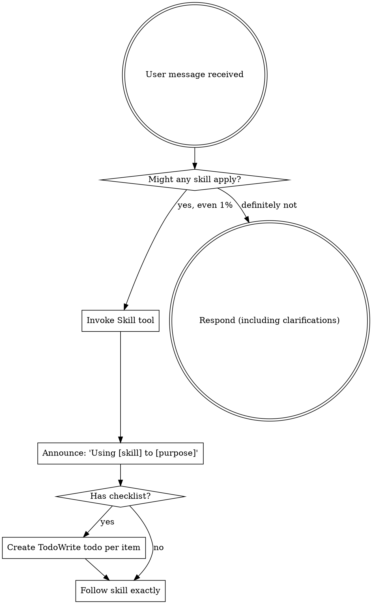

<EXTREMELY_IMPORTANT>
If you think there is even a 1% chance a Cadence skill might apply to what you are doing, you ABSOLUTELY MUST invoke the skill.

IF A SKILL APPLIES TO YOUR TASK, YOU DO NOT HAVE A CHOICE. YOU MUST USE IT.

This is not negotiable. This is not optional. You cannot rationalize your way out of this.
</EXTREMELY_IMPORTANT>

## How to Access Cadence Skills

**In Claude Code:** Use the `Skill` tool. When you invoke a skill, its content is loaded and presented to you—follow it directly. Never use the Read tool on skill files.

**In other environments:** Check your platform's documentation for how skills are loaded.

# Using Cadence Skills

## The Rule

**Invoke relevant or requested skills BEFORE any response or action.** Even a 1% chance a skill might apply means that you should invoke the skill to check. If an invoked skill turns out to be wrong for the situation, you don't need to use it.

## Red Flags

These thoughts mean STOP—you're rationalizing:

| Thought | Reality |
|---------|---------|
| "This is just a simple question" | Questions are tasks. Check for skills. |
| "I need more context first" | Skill check comes BEFORE clarifying questions. |
| "Let me explore the codebase first" | Skills tell you HOW to explore. Check first. |
| "I can check git/files quickly" | Files lack conversation context. Check for skills. |
| "Let me gather information first" | Skills tell you HOW to gather information. |
| "This doesn't need a formal skill" | If a skill exists, use it. |
| "I remember this skill" | Skills evolve. Read current version. |
| "This doesn't count as a task" | Action = task. Check for skills. |
| "The skill is overkill" | Simple things become complex. Use it. |
| "I'll just do this one thing first" | Check BEFORE doing anything. |
| "This feels productive" | Undisciplined action wastes time. Skills prevent this. |
| "I know what that means" | Knowing the concept ≠ using the skill. Invoke it. |

## Cadence Skill Priority

When multiple skills could apply, use this order:

1. **Process skills first** (brainstorming, analyze, debugging) - these determine HOW to approach the task
2. **Implementation skills second** (design, plan, development) - these guide execution

"Let's build X" → brainstorming first, then implementation skills.
"Fix this bug" → debugging first, then domain-specific skills.

## Core Cadence Skills

**Understanding Phase (P1):**
- brainstorming - Requirements exploration
- analyze - Existing code analysis
- requirement - Requirements analysis

**Planning Phase (P2):**
- design - Technical design
- design-review - Design review
- plan - Implementation planning

**Execution Phase (P3):**
- using-git-worktrees - Environment isolation
- subagent-development - Code implementation
- test-driven-development - TDD workflow
- verification-before-completion - Completion verification

**Review & Finish:**
- requesting-code-review - Code review request
- receiving-code-review - Handle review feedback
- finishing-a-development-branch - Branch completion

**Project Management:**
- status - View progress status
- resume - Resume interrupted workflow
- checkpoint - Create checkpoint
- report - Generate progress report
- monitor - Monitor active work

**Utilities:**
- pre-check - Pre-execution validation
- git-review - Git commit review

**Data Management:**
- data-validation - Validate data format
- data-cleanup - Clean up old data
- transaction-utils - Atomic write operations
- lock-utils - Concurrent write protection
- version-migration - Data version migration
- cad-load - Load session data

**Project Initialization:**
- init/project-analysis - Analyze project structure
- init/rule-config - Configure project rules
- init/mcp-configuration - Configure MCP
- init/project-rules - Setup project rules

## Skill Types

**Rigid** (TDD, debugging): Follow exactly. Don't adapt away discipline.

**Flexible** (patterns): Adapt principles to context.

The skill itself tells you which.

## User Instructions

Instructions say WHAT, not HOW. "Add X" or "Fix Y" doesn't mean skip workflows.

## Quick Reference

**Cadence Flow Modes:**

| Flow Mode | Command | Nodes | Use Case | Time |
|-----------|---------|-------|----------|------|
| Full Flow | `/cadence:full-flow` | 8 | Enterprise projects | 1-2 days |
| Quick Flow | `/cadence:quick-flow` | 4 | Fast development | 1-2 hours |
| Exploration Flow | `/cadence:exploration-flow` | 4 | Technical exploration | 2-4 hours |

**Single Node Commands:**
- `/cadence:brainstorm` - Requirements exploration
- `/cadence:analyze` - Existing code analysis
- `/cadence:requirement` - Requirements analysis
- `/cadence:design` - Technical design
- `/cadence:design-review` - Design review
- `/cadence:plan` - Implementation planning
- `/cadence:using-git-worktrees` - Environment isolation
- `/cadence:subagent-development` - Code implementation
- `/cadence:test-driven-development` - TDD workflow
- `/cadence:verification-before-completion` - Completion verification
- `/cadence:pre-check` - Pre-execution validation
- `/cadence:git-review` - Git commit review

**Review Commands:**
- `/cadence:request-review` - Request code review
- `/cadence:receive-review` - Handle review feedback
- `/cadence:finish` - Complete development branch

**Progress Management:**
- `/cadence:status` - View current progress
- `/cadence:resume` - Resume progress
- `/cadence:checkpoint` - Create checkpoint
- `/cadence:report` - Generate report
- `/cadence:monitor` - Monitor active work

**Development Commands:**
- `/cadence:worktree` - Git worktree management
- `/cadence:develop` - Start development

**Data Management:**
- `/cadence:data-validation` - Validate data
- `/cadence:data-cleanup` - Cleanup old data
- `/cadence:transaction-utils` - Atomic operations
- `/cadence:lock-utils` - Lock utilities
- `/cadence:version-migration` - Version migration
- `/cadence:cad-load` - Load session

**Project Initialization:**
- `/cadence:init:project-analysis` - Analyze project
- `/cadence:init:rule-config` - Configure rules
- `/cadence:init:mcp-configuration` - Configure MCP
- `/cadence:init:project-rules` - Setup project rules
- `/cadence:init:project-rules-examples` - Rule templates
