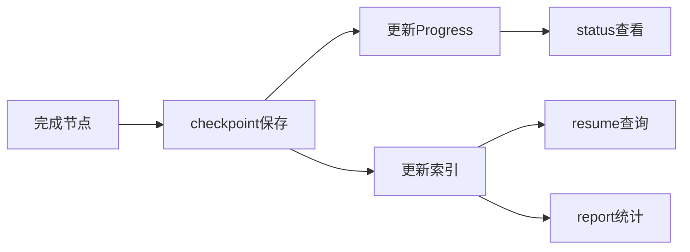

# checkpoint Skill

## 概述

`checkpoint` 是检查点创建 Skill，用于保存项目的完整快照，包括代码状态、任务进度、上下文信息等，支持会话恢复和进度追踪。

## 如何单独使用

### 命令调用

```bash
/checkpoint
```

### 自动触发

在以下场景自动创建检查点：
- 每个节点完成后
- 每个任务完成后
- 测试失败后
- 审查失败后

## 具体使用案例

### 案例 1：完成设计阶段后保存

**场景**：刚完成了design阶段，想保存当前状态

**用户输入**：
```
/checkpoint
```

**执行流程**：
1. 📦 **收集上下文**
   - Git信息（分支、最近10次提交）
   - TodoWrite状态（所有任务）
   - 项目上下文（CLAUDE.md）

2. 🔑 **生成唯一ID**
   - 使用UUID v4保证全局唯一
   - Example: `550e8400-e29b-41d4-a716-446655440000`

3. 💾 **保存到Serena Memory**
   - Memory名称: `checkpoint-{project_id}-{phase}-{uuid}`
   - Example: `checkpoint-user-auth-design-550e8400...`

4. 🔄 **更新相关记录**
   - 更新 progress-{project_id}
   - 更新时间索引
   - 更新阶段索引
   - 更新项目索引

5. ✅ **显示确认**
   ```
   ✅ Checkpoint created successfully!

   Checkpoint ID: 550e8400-e29b-41d4-a716-446655440000
   Memory: checkpoint-user-auth-design-550e8400-e29b-41d4-a716-446655440000
   Phase: design
   Status: completed
   Expires: 2026-04-03 15:30:00Z
   ```

### 案例 2：手动保存重要节点

**场景**：在关键决策点想保存状态

**用户输入**：
```
我刚做了重要的技术选型决策，保存一个checkpoint
```

**结果**：创建包含完整上下文的checkpoint，包括：
- 决策时的代码状态
- 所有任务的进度
- Git提交历史
- 项目上下文

## Checkpoint数据结构

```yaml
metadata:
  version: "1.0"
  checkpoint_id: "550e8400-e29b-41d4-a716-446655440000"  # UUID v4
  project_id: "user-auth"

phase: "design"
task_id: "task-2"
status: "completed"
timestamp: "2026-03-04T15:30:00Z"

context:
  git_branch: "feature/user-auth"
  git_commits: ["abc1234", "def5678", ...]
  todowrite_state: [{task1}, {task2}, ...]
  project_context: {project info}

output: ".claude/designs/2026-03-04_设计方案_认证流程_v1.0.md"

ttl: 2592000  # 30 days
created_at: "2026-03-04T15:30:00Z"
expires_at: "2026-04-03T15:30:00Z"
```

## 命名规范

### 格式
```
checkpoint-{project_id}-{phase}-{uuid}
```

### 示例
```
checkpoint-user-auth-design-550e8400-e29b-41d4-a716-446655440000
checkpoint-api-refactor-brainstorm-a1b2c3d4-e5f6-7890
```

### 为什么用这种格式？

1. **project_id** - 隔离不同项目的checkpoint
2. **phase** - 可以按阶段过滤查询
3. **uuid** - 保证全局唯一，避免冲突

## 索引机制

每个checkpoint创建后会更新3个索引：

### 1. 时间索引
```yaml
index-{project_id}-checkpoints-by-time:
  "2026-03-04":
    - "checkpoint-user-auth-design-uuid1"
    - "checkpoint-user-auth-analyze-uuid2"
```

### 2. 阶段索引
```yaml
index-{project_id}-checkpoints-by-phase:
  "design":
    - "checkpoint-user-auth-design-uuid1"
  "analyze":
    - "checkpoint-user-auth-analyze-uuid2"
```

### 3. 项目索引
```yaml
index-checkpoints-by-project:
  "user-auth":
    - "checkpoint-user-auth-design-uuid1"
    - "checkpoint-user-auth-analyze-uuid2"
```

## 与其他Skills的关系

### 配合使用

- **status** - status读取checkpoint显示历史
- **resume** - resume使用checkpoint恢复状态
- **report** - report使用checkpoint生成统计

### 数据流



## 最佳实践

### 1. 自动checkpoint就足够

- 大部分情况下，自动checkpoint已满足需求
- 手动checkpoint用于特殊节点

### 2. Checkpoint生命周期

- **创建**: 节点完成时
- **活跃**: 7天内
- **归档**: 7天后自动归档
- **过期**: 30天后自动删除

### 3. 恢复策略

使用 `/resume` 命令时：
- 列出最近的checkpoint
- 选择要恢复的checkpoint
- 自动重建上下文

### 4. 索引查询优势

通过索引查询checkpoint:
- **时间查询**: 查找某天的所有checkpoint
- **阶段查询**: 查找某阶段的所有checkpoint
- **项目查询**: 查找某项目的所有checkpoint

## 常见问题

### Q: Checkpoint会占用多少空间？

A: 每个checkpoint约1-5KB，包含：
- 项目元数据
- Git提交历史（最近10次）
- TodoWrite状态
- 时间戳

### Q: 如何查找特定checkpoint？

A: 使用索引快速查询：
```
# 查找今天的checkpoint
index-{project_id}-checkpoints-by-time

# 查找design阶段的checkpoint
index-{project_id}-checkpoints-by-phase
```

### Q: Checkpoint会冲突吗？

A: 不会。使用UUID v4保证全局唯一：
- 128位随机ID
- 冲突概率极低（几乎为0）

## 技术细节

完整的执行流程、工具使用、代码示例请参考：[checkpoint/SKILL.md](../../skills/checkpoint/SKILL.md)
