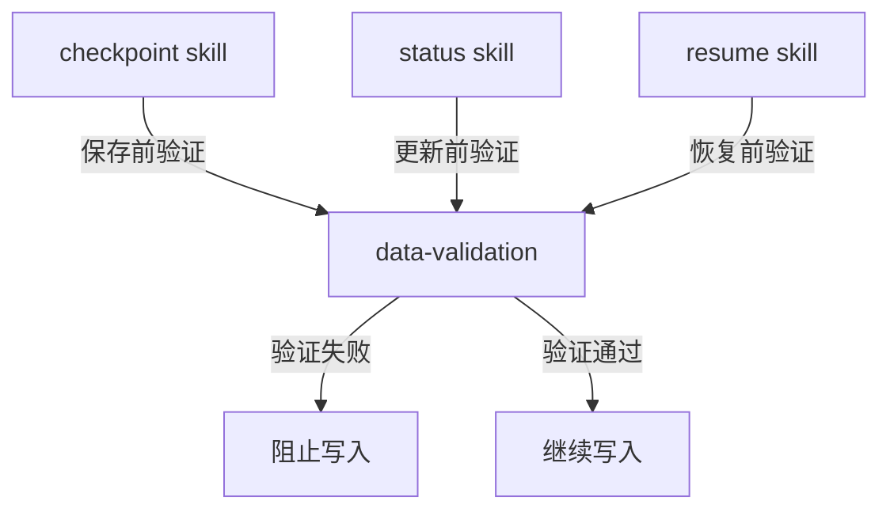

# data-validation Skill

## 概述

`data-validation` 是数据验证工具Skill，用于在写入Progress或Checkpoint数据到Serena memory之前，验证数据格式、必填字段、值范围等，确保数据质量。

**核心价值**：
- 防止格式错误的数据写入Serena
- 确保所有必填字段存在
- 验证字段类型和值范围
- 提供清晰的错误提示

## 如何单独使用

### 命令调用

```bash
# 不直接通过命令调用
# 通常由其他Skills自动调用
```

### 使用场景

1. **checkpoint skill** - 保存Checkpoint前验证
2. **status skill** - 更新Progress前验证
3. **resume skill** - 恢复数据前验证

## 具体使用案例

### 案例1：验证Progress数据

**场景**：更新项目进度时

```yaml
# 准备写入的Progress数据
progress_data:
  metadata:
    version: "1.0"
    project_id: "user-auth"
    # ❌ 缺少 project_name 字段

# data-validation执行流程
Step 1: 检查必填字段
  → 发现缺少 metadata.project_name
  → 停止验证
  → 返回错误: "缺少必填字段: metadata.project_name"

# 结果
写入操作被阻止，用户收到明确错误提示
```

### 案例2：验证Checkpoint数据

**场景**：创建Checkpoint时

```yaml
# 准备写入的Checkpoint数据
checkpoint_data:
  metadata:
    version: "1.0"
    checkpoint_id: "not-a-uuid"  # ❌ 无效的UUID格式

# data-validation执行流程
Step 1: 检查必填字段 → 通过
Step 2: 检查字段类型 → 通过
Step 3: 检查值范围 → 通过
Step 4: 检查UUID格式
  → 发现 checkpoint_id 格式无效
  → 停止验证
  → 返回错误: "无效的 UUID 格式: not-a-uuid"

# 结果
写入操作被阻止，提示使用正确的UUID格式
```

### 案例3：验证枚举值

**场景**：更新阶段状态时

```yaml
# 准备写入的数据
progress_data:
  phases:
    - phase_name: "design"
      status: "done"  # ❌ 无效的枚举值（应该是completed）

# data-validation执行流程
Step 1-4: 通过
Step 5: 检查枚举值
  → 发现 status: "done" 不在有效值列表中
  → 有效值: completed, in_progress, pending
  → 返回错误: "无效的枚举值: status, 值: done, 有效值: completed, in_progress, pending"

# 结果
写入操作被阻止，提示使用正确的枚举值
```

## 数据结构

### Progress数据验证规则

| 字段 | 类型 | 必填 | 验证规则 |
|------|------|------|---------|
| metadata.version | string | ✅ | 格式: X.Y (如1.0, 1.1) |
| metadata.project_id | string | ✅ | 非空字符串 |
| metadata.project_name | string | ✅ | 非空字符串 |
| metadata.flow_type | string | ✅ | 枚举: full-flow, quick-flow, exploration-flow |
| project_info.name | string | ✅ | 非空字符串 |
| overall_progress.percentage | number | ✅ | 范围: 0-100 |
| phases[].status | string | ✅ | 枚举: completed, in_progress, pending |

### Checkpoint数据验证规则

| 字段 | 类型 | 必填 | 验证规则 |
|------|------|------|---------|
| metadata.version | string | ✅ | 格式: X.Y |
| metadata.checkpoint_id | string | ✅ | UUID v4格式 |
| metadata.project_id | string | ✅ | 非空字符串 |
| phase | string | ✅ | 枚举: brainstorm, analyze, design, plan等 |
| status | string | ✅ | 枚举: completed, in_progress, failed |
| ttl | number | ✅ | > 0 (秒) |

## 与其他 Skills 的关系

### 被调用关系



### 协作流程

**checkpoint skill调用流程**：
```markdown
1. checkpoint收集数据
2. 调用 data-validation 验证
3. IF 验证失败:
     → 记录错误
     → 停止checkpoint创建
     → 返回错误给用户
4. IF 验证通过:
     → 保存Checkpoint到Serena
     → 更新Progress
     → 更新索引
```

## 最佳实践

### ✅ 推荐做法

1. **所有写入操作都验证**
   ```markdown
   任何写入Progress或Checkpoint的操作
   → 都先调用data-validation
   → 验证通过后才写入
   ```

2. **处理验证失败**
   ```markdown
   验证失败时
   → 不尝试自动修复
   → 返回明确错误信息
   → 让调用者修复数据
   ```

3. **记录验证日志**
   ```markdown
   验证失败时
   → 记录详细的失败原因
   → 包含字段路径、期望值、实际值
   → 便于调试和修复
   ```

### ❌ 避免的做法

1. **跳过验证**
   ```markdown
   ❌ 错误做法
   "数据很简单，不需要验证"

   ✅ 正确做法
   所有数据写入都必须验证
   ```

2. **自动修复无效数据**
   ```markdown
   ❌ 错误做法
   发现status: "done" → 自动改为 "completed"

   ✅ 正确做法
   发现无效值 → 拒绝写入 → 返回错误 → 让调用者修复
   ```

3. **忽略验证错误**
   ```markdown
   ❌ 错误做法
   验证失败 → 记录警告 → 继续写入

   ✅ 正确做法
   验证失败 → 阻止写入 → 返回错误
   ```

## 常见问题

### Q1: 为什么不在写入后验证？

**A**: 写入后验证为时已晚，错误数据已经污染Serena memory。必须在写入前验证，防止错误数据进入系统。

### Q2: 验证失败后可以自动修复吗？

**A**: 不建议自动修复。自动修复可能引入新的错误。正确做法是返回明确错误，让调用者理解问题并正确修复。

### Q3: 验证会影响性能吗？

**A**: 验证开销很小（通常<0.1秒），相比数据损坏的风险，验证成本可以忽略不计。

### Q4: 所有字段都需要验证吗？

**A**: 只验证必填字段和关键字段。可选字段如果没有值，可以跳过验证。

### Q5: 如何处理新增字段？

**A**: 新增字段时：
- 向后兼容（新增可选字段）→ 更新验证规则，允许字段缺失
- 向后不兼容（新增必填字段）→ 更新版本号，提供迁移脚本

## 错误消息示例

### 缺少必填字段

```markdown
## 数据验证失败

**验证步骤**: 必填字段检查
**失败字段**: metadata.project_id
**错误类型**: 缺少必填字段
**详细信息**: Progress 数据必须包含 project_id

**期望值**: 非空字符串
**实际值**: null

**建议操作**: 在 CLAUDE.md 中定义 project_id 或使用 Git 仓库名称生成
```

### 类型错误

```markdown
## 数据验证失败

**验证步骤**: 字段类型检查
**失败字段**: overall_progress.percentage
**错误类型**: 类型不匹配
**详细信息**: 进度百分比应为数字类型

**期望值**: number
**实际值**: string ("50")

**建议操作**: 确保percentage字段为数字类型，不要用引号包裹
```

### 值超出范围

```markdown
## 数据验证失败

**验证步骤**: 值范围检查
**失败字段**: overall_progress.percentage
**错误类型**: 值超出有效范围
**详细信息**: 进度百分比必须在0-100之间

**期望值**: 0-100
**实际值**: 150

**建议操作**: 检查进度计算逻辑，确保百分比在有效范围内
```
