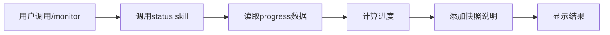

# monitor Skill

## 概述

`monitor` 是状态快照 Skill，用于快速查看当前任务状态，显示进度百分比、当前阶段、耗时等信息。**重要：这是一次性快照，不是实时监控。**

## 如何单独使用

### 命令调用

```bash
/monitor
```

### 使用场景

在以下场景建议使用：
- 快速查看当前任务状态
- 获取进度概览
- 了解正在发生什么
- 监控活跃的开发工作

## ⚠️ 重要限制

### 不是实时监控

**Claude Code 不支持**：
- ❌ 后台任务
- ❌ 定时器
- ❌ 自动刷新

**Monitor 实际做什么**：
- ✅ 调用 `/status` 一次
- ✅ 格式化输出
- ✅ 显示快照
- ✅ 立即返回

**要查看更新**：再次运行 `/monitor`

## 具体使用案例

### 案例 1：快速查看当前进度

**场景**：想快速了解项目当前状态，不需要详细报告

**用户输入**：
```
/monitor
```

**执行流程**：
1. 📊 **调用 status skill**
   - 读取项目信息
   - 读取进度数据
   - 计算进度百分比

2. ⏰ **添加快照说明**
   ```markdown
   ---
   ⏰ Snapshot captured at 2026-03-04 16:30:00

   💡 This is a one-time status snapshot. To see updates, run /monitor again.
   The status does not update in real-time.
   ```

3. 📺 **显示结果**
   ```
   📊 Project Progress: User Authentication System

   ## Current Task
   - **Task**: Design authentication architecture
   - **Status**: In Progress
   - **Started**: 2026-03-04 15:00:00
   - **Elapsed**: 1h 30m

   ## Overall Progress
   [████████░░░] 37.5% (3/8 phases)

   ⏰ Snapshot captured at 2026-03-04 16:30:00
   💡 This is a one-time status snapshot. To see updates, run /monitor again.
   The status does not update in real-time.
   ```

### 案例 2：工作中快速检查

**场景**：正在开发过程中，想快速确认当前进度

**用户输入**：
```
/monitor
```

**结果**：
- 显示当前任务和状态
- 显示整体进度
- 明确说明是一次性快照
- 提示用户如何获取更新

## Monitor vs Status vs Report

### 功能对比

| 命令 | 用途 | 何时使用 | 输出位置 |
|------|------|----------|---------|
| `/monitor` | 快速快照 | 快速查看当前状态 | 控制台 |
| `/status` | 详细状态 | 完整的进度概览 | 控制台 |
| `/report` | 完整历史 | 文档化工作成果、创建报告文件 | 文件 |

### 详细对比

**Monitor（快速快照）**：
- ✅ 调用 `/status` 获取数据
- ✅ 添加快照时间戳
- ✅ 添加使用说明
- ❌ 不创建文件
- ❌ 不保存历史

**Status（详细状态）**：
- ✅ 完整的进度信息
- ✅ 阶段状态详情
- ✅ 时间统计
- ❌ 不创建文件
- ❌ 不包含快照说明

**Report（完整报告）**：
- ✅ 完整的项目历史
- ✅ 所有checkpoint详情
- ✅ Git提交历史
- ✅ 统计分析
- ✅ 保存为Markdown文件

### 使用建议

**快速查看** → `/monitor`
```bash
/monitor  # 快速了解当前状态
```

**详细查看** → `/status`
```bash
/status  # 完整的进度信息
```

**生成报告** → `/report`
```bash
/report  # 创建文档报告
```

## 输出格式

### 标准格式

```markdown
📊 Project Progress: {project_name}

## Current Task
- **Task**: {current_task}
- **Status**: {status}
- **Started**: {start_time}
- **Elapsed**: {elapsed_time}

## Overall Progress
[████████░░░] {percentage}% ({completed}/{total} phases)

⏰ Snapshot captured at {timestamp}
💡 This is a one-time status snapshot. To see updates, run /monitor again.
The status does not update in real-time.
```

### 示例输出

```markdown
📊 Project Progress: User Authentication System

## Current Task
- **Task**: Design authentication architecture
- **Status**: In Progress
- **Started**: 2026-03-04 15:00:00
- **Elapsed**: 1h 30m

## Overall Progress
[████░░░░░░░░] 37.5% (3/8 phases)

⏰ Snapshot captured at 2026-03-04 16:30:00
💡 This is a one-time status snapshot. To see updates, run /monitor again.
The status does not update in real-time.
```

## 实现原理

### 调用流程

```python
# Step 1: 调用 status skill
status_output = invoke_skill("status")

# Step 2: 添加快照说明
timestamp = datetime.now().strftime("%Y-%m-%d %H:%M:%S")
monitor_note = f"""
---
⏰ Snapshot captured at {timestamp}

💡 This is a one-time status snapshot. To see updates, run /monitor again.
The status does not update in real-time.
"""

# Step 3: 组合并显示
output = status_output + "\n" + monitor_note
print(output)
```

### 为什么这样设计？

**重用 status skill**：
- ✅ 避免代码重复
- ✅ 保持一致性
- ✅ 易于维护

**添加快照说明**：
- ✅ 明确告知用户
- ✅ 管理用户期望
- ✅ 避免混淆

## 与其他Skills的关系

### 配合使用

- **status** - monitor内部调用status获取数据
- **checkpoint** - monitor显示的状态基于checkpoint数据
- **report** - monitor是快速查看，report是详细报告

### 数据流



## 最佳实践

### 1. 理解限制

Monitor 的限制：
- ✅ 一次性快照
- ✅ 需要手动重新运行
- ❌ 不支持实时更新
- ❌ 不支持后台任务

**正确使用**：
```bash
/monitor  # 查看当前状态
# ... 工作一段时间 ...
/monitor  # 再次查看更新后的状态
```

### 2. 选择合适的工具

根据需求选择：
- **快速查看** → `/monitor`
- **详细查看** → `/status`
- **生成报告** → `/report`

### 3. 定期检查

建议的检查频率：
- 开始工作前 → 运行一次
- 完成阶段后 → 运行一次
- 需要确认进度时 → 运行一次

### 4. 结合其他命令

Monitor 可以配合：
```bash
/monitor  # 快速查看当前状态
/status   # 需要详细信息时
/checkpoint  # 创建检查点
/report   # 生成完整报告
```

## 常见问题

### Q: 为什么状态不自动更新？

A: Claude Code 不支持后台任务或定时器，所以 monitor 只能提供一次性快照。

**解决方法**：
- 需要查看更新时，再次运行 `/monitor`

### Q: Monitor 和 Status 有什么区别？

A: 主要区别：
- **Monitor**: Status + 快照说明（一次性）
- **Status**: 完整的进度信息（详细）

**建议**：
- 快速查看 → `/monitor`
- 详细信息 → `/status`

### Q: 如何实现实时监控？

A: Claude Code 不支持实时监控。替代方案：
1. 定期运行 `/monitor`
2. 使用外部工具监控 Git 提交
3. 使用 CI/CD 系统的监控功能

### Q: Monitor 会创建文件吗？

A: 不会。Monitor 只在控制台显示输出，不创建任何文件。

**需要保存报告** → 使用 `/report`

### Q: 为什么要有 Monitor 这个 Skill？

A: Monitor 的价值：
- ✅ 快速查看（比 status 更简洁）
- ✅ 明确说明一次性特性
- ✅ 管理用户期望
- ✅ 提供使用指导

### Q: Monitor 的输出可以保存吗？

A: Monitor 本身不保存输出。如需保存：
1. 手动复制控制台输出
2. 使用 `/report` 生成报告文件

## 典型使用场景

### 场景 1：每日工作开始

```bash
# 开始工作前快速查看
/monitor

# 输出：
# 📊 Project Progress: User Authentication System
# ## Current Task
# - **Task**: Design authentication architecture
# - **Status**: In Progress
# ...
```

### 场景 2：完成阶段后确认

```bash
# 完成一个阶段后查看进度
/monitor

# 输出：
# 📊 Project Progress: User Authentication System
# ## Overall Progress
# [████████░░░] 50% (4/8 phases)
# ...
```

### 场景 3：工作中途检查

```bash
# 工作一段时间后检查进度
/monitor

# 输出：
# 📊 Project Progress: User Authentication System
# ## Current Task
# - **Elapsed**: 2h 15m
# ...
```

## 技术细节

完整的执行流程、工具使用、代码示例请参考：[monitor/SKILL.md](../../skills/monitor/SKILL.md)
