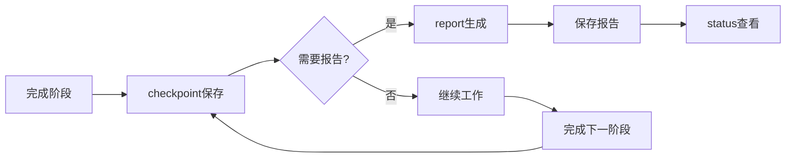

# report Skill

## 概述

`report` 是进度报告 Skill，用于生成项目的完整开发报告，包括会话摘要、检查点历史、Git提交记录、统计数据等，帮助团队了解项目进展和工作成果。

## 如何单独使用

### 命令调用

```bash
/report
```

### 使用场景

在以下场景建议使用：
- 完成项目或阶段时
- 需要文档化工作成果
- 创建交接文档
- 准备Sprint评审
- 生成发布说明

## 具体使用案例

### 案例 1：生成项目完整报告

**场景**：完成了一个功能开发，需要生成完整的项目报告

**用户输入**：
```
/report
```

**执行流程**：
1. 📊 **收集数据**
   - 从 Serena Memory 读取 progress 数据
   - 读取所有 checkpoint 数据
   - 获取 Git 提交历史
   - 识别输出文件

2. 📈 **计算统计数据**
   - 各阶段耗时
   - 平均耗时
   - 预估剩余时间
   - 测试通过率和覆盖率

3. 📝 **生成报告**
   ```markdown
   # Development Report: User Authentication System

   **Generated**: 2026-03-04 15:30:00
   **Flow Type**: full-flow

   ## Session Summary
   - **Started**: 2026-03-04 09:00:00
   - **Last Updated**: 2026-03-04 15:30:00
   - **Progress**: 37.5% (3/8 phases)
   - **Status**: In Progress

   ## Phase Breakdown
   ✅ brainstorm - Completed (2h)
   ✅ analyze - Completed (1.5h)
   ✅ requirement - Completed (1.5h)
   🔄 design - In Progress (30m)
   ⏳ design-review - Pending
   ⏳ plan - Pending
   ⏳ using-git-worktrees - Pending
   ⏳ subagent-development - Pending

   ## Statistics
   - **Total Time**: 5h
   - **Avg Time/Phase**: 1h 40m
   - **Estimated Remaining**: 8.3h
   - **Test Pass Rate**: 100%
   - **Avg Coverage**: 85%

   ## Checkpoints
   Total Checkpoints: 3
   ### brainstorm - 2026-03-04 11:00:00
   - Phase: brainstorm
   - Status: completed

   ### analyze - 2026-03-04 13:00:00
   - Phase: analyze
   - Status: completed

   ### requirement - 2026-03-04 15:00:00
   - Phase: requirement
   - Status: completed

   ## Git History
   4 commits:
   - abc1234 - Complete brainstorm: user authentication requirements
   - def5678 - Complete analyze: existing code patterns
   - ghi9012 - Complete requirement: auth specifications
   - jkl3456 - Start design: authentication architecture

   ## Output Files
   - .claude/docs/2026-03-04_需求文档_用户认证_v1.0.md
   - .claude/designs/2026-03-04_设计方案_认证流程_v1.0.md

   ## Next Steps
   1. Complete design phase
   2. Run design review
   3. Create implementation plan
   4. Start implementation
   ```

4. 💾 **保存报告**
   ```
   ✅ Report generated successfully!

   Location: .claude/reports/2026-03-04_开发报告_user-auth.md
   ```

### 案例 2：生成阶段报告

**场景**：完成了Design阶段，想生成该阶段的详细报告

**结果**：
- 包含Design阶段的详细信息
- 该阶段创建的所有checkpoint
- 该阶段的所有提交
- 该阶段的统计数据
- 下一步行动建议

## 报告类型

### 1. 完整报告（Full Report）

**包含内容**：
- 会话摘要（流程类型、完成的阶段）
- 所有检查点（完整详情）
- 所有Git提交（包含提交信息）
- 详细统计（各阶段耗时、测试覆盖率）
- 输出文件（创建的文档）
- 下一步行动

**适用场景**：
- 项目完成时
- 交接文档
- 发布说明

### 2. 阶段报告（Phase Report）

**包含内容**：
- 阶段概述（完成的工作）
- 该阶段的checkpoint
- 该阶段的提交
- 阶段统计（耗时、完成率）
- 阶段输出（创建的文档）
- 下一阶段的建议

**适用场景**：
- 完成某个阶段
- 阶段评审
- 中期检查

### 3. 会话报告（Session Report）

**包含内容**：
- 整体进度百分比
- 已完成vs待完成阶段
- 总耗时
- 预估剩余时间
- 主要成果
- 遇到的阻碍

**适用场景**：
- 日报
- 周报
- 快速查看进度

## 数据来源

### 主数据源

**Serena Memory**：
- `progress-{project_id}` - 项目进度数据
- `checkpoint-{project_id}-{phase}-{uuid}` - 检查点数据

**Git**：
- 提交历史
- 提交信息
- 时间范围

**文件系统**：
- `.claude/docs/` - 需求文档
- `.claude/designs/` - 设计方案
- 其他输出文件

## 报告结构

### 标准章节

| 章节 | 内容 |
|------|------|
| **Header** | 标题、日期、流程类型 |
| **Session Summary** | 整体进度、时间范围 |
| **Phase Breakdown** | 每个阶段的详细状态 |
| **Statistics** | 总计、平均值、预估 |
| **Checkpoints** | 所有保存的检查点 |
| **Git History** | 所有提交记录 |
| **Output Files** | 创建的文档 |
| **Next Steps** | 下一步行动 |

### 文件命名规范

**格式**：`{date}_开发报告_{project_name}.md`

**示例**：
```
.claude/reports/2026-03-04_开发报告_user-auth.md
.claude/reports/2026-03-03_开发报告_api-refactor.md
.claude/reports/2026-03-02_阶段报告_brainstorm.md
```

## 统计计算逻辑

### 阶段统计

```python
for phase in phases:
    if phase["status"] == "completed":
        # 计算耗时
        duration = end_time - start_time
        phase["duration"] = duration

        # 统计提交数
        phase["commit_count"] = count_commits(start_time, end_time)
```

### 整体统计

```python
# 总耗时
total_time = sum(phase["duration"] for phase in completed_phases)

# 平均耗时
avg_time_per_phase = total_time / completed_phases

# 预估剩余时间
estimated_remaining = avg_time_per_phase * (total_phases - completed_phases)
```

### 测试统计

```python
# 测试通过率
test_pass_rate = passed / (passed + failed) * 100

# 平均覆盖率
avg_coverage = sum(coverage_scores) / len(coverage_scores)
```

## 与其他Skills的关系

### 配合使用

- **status** - report包含status的详细信息，增加历史记录
- **checkpoint** - report使用checkpoint数据生成历史
- **resume** - resume前可以用report查看完整历史
- **monitor** - monitor提供实时状态，report提供历史报告

### 使用时机



## 最佳实践

### 1. 定期生成报告

建议在以下时机生成报告：
- 每日结束时（生成日报）
- 每周结束时（生成周报）
- 完成阶段时（生成阶段报告）
- 项目完成时（生成完整报告）

### 2. 报告内容验证

生成报告后，验证：
- ✅ 进度百分比是否准确
- ✅ 阶段状态是否正确
- ✅ 时间统计是否合理
- ✅ Checkpoint是否完整
- ✅ Git历史是否包含所有提交

### 3. 报告分享

报告可以用于：
- 团队会议（展示进度）
- 代码评审（提供上下文）
- 项目交接（完整历史）
- 发布文档（工作成果）

### 4. 结合其他工具

Report可以结合：
- `/status` - 快速查看当前进度
- `/checkpoint` - 确保有足够的历史数据
- Git工具 - 查看详细的代码变更

## 常见问题

### Q: Report生成失败怎么办？

A: Report生成失败的常见原因：
- ❌ 没有progress数据（需要先启动流程）
- ❌ 没有checkpoint（需要先创建checkpoint）
- ❌ Git历史为空（需要先提交代码）
- ❌ 输出目录不存在（需要创建`.claude/reports/`）

**解决方法**：
1. 运行 `/status` 检查是否有progress数据
2. 运行 `/checkpoint` 创建检查点
3. 提交代码到Git
4. 创建报告目录：`mkdir -p .claude/reports`

### Q: 如何生成特定时间范围的报告？

A: Report默认生成完整的项目历史。如需特定时间范围：
1. 手动编辑生成的报告文件
2. 删除不需要的时间段内容
3. 重新计算统计数据

### Q: Report和Status有什么区别？

A: 主要区别：
- **Status**: 快速查看当前进度（实时状态）
- **Report**: 生成详细的历史报告（包含所有数据）

**建议**：
- 日常查看进度 → 使用 `/status`
- 生成文档报告 → 使用 `/report`

### Q: 如何自定义报告格式？

A: Report生成Markdown格式报告。自定义方法：
1. 生成报告后，编辑`.md`文件
2. 添加自定义章节
3. 调整格式和内容
4. 保存修改后的版本

### Q: 报告文件会占用多少空间？

A: 每个报告文件约5-20KB，大小取决于：
- 项目阶段数量
- Checkpoint数量
- Git提交数量
- 输出文件数量

**建议**：定期清理旧报告，保留重要节点的报告。

## 技术细节

完整的执行流程、工具使用、代码示例请参考：[report/SKILL.md](../../skills/report/SKILL.md)
