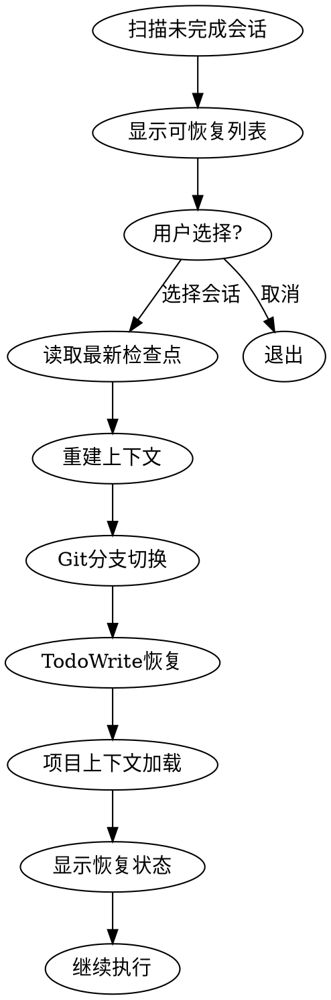
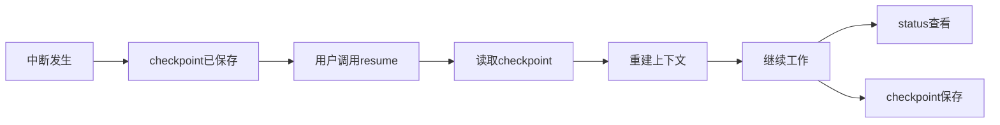

# resume Skill

## 概述

`resume` 是恢复工作 Skill，用于从中断的会话中恢复完整上下文，包括 Git 状态、任务进度、项目信息等，实现跨会话的连续工作。

## 如何单独使用

### 命令调用

```bash
/resume
```

### 使用场景

在以下场景建议使用：
- 恢复中断的工作流程
- 跨会话继续开发
- 从之前的检查点恢复
- 切换回之前的项目

## 具体使用案例

### 案例 1：恢复中断的开发工作

**场景**：昨天在开发用户认证系统时中断了，今天想继续

**用户输入**：
```
/resume
```

**执行流程**：
1. 🔍 **扫描未完成会话**
   - 列出所有进度 < 100% 的项目
   - 按最后更新时间排序（最近的在前）

2. 📋 **显示可恢复会话列表**
   ```
   ## Resumable Sessions

   1. **User Authentication System** (full-flow)
      - 当前进度: 37.5% (3/8 节点)
      - 当前阶段: Design (进行中)
      - 最后更新: 2026-03-04 15:30:00
      - Git 分支: feature/user-auth

   2. **API Refactor** (quick-flow)
      - 当前进度: 50% (2/4 节点)
      - 当前阶段: Plan (已完成)
      - 最后更新: 2026-03-03 17:00:00
      - Git 分支: refactor/api

   选择要恢复的会话 [1-2]:
   ```

3. ✅ **用户选择会话**
   - 用户输入：1

4. 📦 **读取最新检查点**
   - 查找该项目的最新 checkpoint
   - 读取完整上下文数据

5. 🔨 **重建上下文**
   - 切换到 Git 分支：`feature/user-auth`
   - 恢复 TodoWrite 状态（3 个任务）
   - 加载项目上下文（CLAUDE.md）

6. ✨ **显示恢复结果**
   ```
   ✅ 会话已恢复!

   ## Recovery Information
   - **项目**: User Authentication System
   - **流程**: full-flow
   - **恢复点**: Design (2026-03-04 15:30:00)
   - **Git 分支**: feature/user-auth
   - **下次行动**: 继续设计阶段

   ## Context Status
   - ✅ Git 分支已切换
   - ✅ TodoWrite 任务已恢复 (3 个任务)
   - ✅ 项目上下文已加载

   准备继续 **Design** 阶段...
   ```

### 案例 2：切换回之前的项目

**场景**：正在开发项目A，需要临时切换回项目B继续工作

**用户输入**：
```
/resume
```

**结果**：
- 显示所有可恢复的会话（包括项目B）
- 选择项目B的会话
- 自动切换Git分支
- 恢复项目B的完整上下文
- 继续项目B的工作

## Resume流程

### 完整流程图



### 上下文重建步骤

**Step 1: Git 分支切换**
```bash
git checkout feature/user-auth
```

**Step 2: TodoWrite 状态恢复**
```markdown
- Task 1: 完成 Design 文档 (in_progress)
- Task 2: 编写 API 接口 (pending)
- Task 3: 单元测试 (pending)
```

**Step 3: 项目上下文加载**
```markdown
- 读取 .claude/CLAUDE.md
- 加载流程类型（full-flow）
- 确认当前阶段（Design）
```

## 可恢复会话的判断标准

### 判断条件

会话可恢复需满足：
- ✅ Progress < 100%
- ✅ 有 progress 记录
- ✅ 有至少一个 checkpoint

### 过滤逻辑

```python
incomplete_sessions = []
for memory_name in memories:
    if memory_name.startswith("progress-"):
        progress = read_memory(memory_name)
        # 检查是否未完成
        if progress["overall_progress"]["percentage"] < 100:
            incomplete_sessions.append(session_info)
```

## Checkpoint选择策略

### 选择最新的Checkpoint

```python
# 查找该项目的所有checkpoint
project_checkpoints = [m for m in memories if m.startswith(f"checkpoint-{project_id}-")]

# 按时间戳排序，选择最新的
latest_checkpoint = None
for checkpoint_name in project_checkpoints:
    checkpoint = read_memory(checkpoint_name)
    if latest_checkpoint is None or checkpoint["timestamp"] > latest_checkpoint["timestamp"]:
        latest_checkpoint = checkpoint
```

### 为什么选择最新的？

- ✅ 包含最新的代码状态
- ✅ 包含最新的任务进度
- ✅ 丢失的工作最少
- ✅ 恢复后最接近中断点

## 与其他Skills的关系

### 配合使用

- **checkpoint** - resume从checkpoint恢复状态
- **status** - resume前可以用status查看进度
- **report** - resume后可以用report生成报告

### 数据流



## 最佳实践

### 1. 恢复前先查看状态

建议在恢复前先运行 `/status` 了解当前状态：
```bash
/status  # 查看当前项目进度
/resume  # 然后选择要恢复的会话
```

### 2. 定期创建Checkpoint

Resume依赖checkpoint，所以确保：
- ✅ 每个节点完成后自动创建checkpoint
- ✅ 重要决策点手动创建checkpoint
- ✅ 长时间工作中定期checkpoint

### 3. 恢复后验证上下文

Resume完成后，验证：
- ✅ Git分支是否正确
- ✅ TodoWrite任务是否完整
- ✅ 项目上下文是否加载
- ✅ 下一步行动是否明确

### 4. 理解恢复优先级

可恢复会话按以下顺序显示：
1. **最近更新时间**（最新的在前）
2. **当前项目优先**（如果在项目目录中）

## 常见问题

### Q: Resume会丢失未保存的工作吗？

A: Resume从最近的checkpoint恢复。如果中断时未创建checkpoint，最后一次checkpoint之后的工作会丢失。

**解决方法**：
- 让系统自动创建checkpoint（每个节点完成后）
- 重要节点手动创建checkpoint
- 养成定期保存的习惯

### Q: 如何查看所有可恢复的会话？

A: 直接运行 `/resume`，系统会列出所有未完成的会话（进度 < 100%）。

### Q: Resume后Git分支不对怎么办？

A: Resume会自动切换到checkpoint记录的Git分支。如果分支不对：
1. 检查checkpoint数据是否正确
2. 手动切换到正确的分支：`git checkout <branch>`
3. 重新运行 `/resume`

### Q: Resume后TodoWrite为空怎么办？

A: 正常情况下Resume会自动恢复TodoWrite状态。如果为空：
1. 检查checkpoint是否包含 `todowrite_state`
2. 手动创建缺失的任务
3. 运行 `/status` 查看任务列表

### Q: 可以跨设备恢复会话吗？

A: 可以，前提是：
- ✅ 使用相同的Serena Memory存储
- ✅ Git仓库已同步
- ✅ checkpoint数据完整

**步骤**：
1. 在新设备上克隆仓库
2. 配置相同的Serena Memory
3. 运行 `/resume`

### Q: Resume失败怎么办？

A: Resume失败的常见原因：
- ❌ 没有可恢复的会话（所有项目已完成）
- ❌ 没有checkpoint（需要先创建）
- ❌ Git分支不存在（分支被删除）
- ❌ Serena Memory访问失败

**解决方法**：
1. 运行 `/status` 检查当前状态
2. 运行 `/checkpoint` 创建检查点
3. 检查Git分支是否存在
4. 验证Serena Memory配置

## 技术细节

完整的执行流程、工具使用、代码示例请参考：[resume/SKILL.md](../../skills/resume/SKILL.md)
