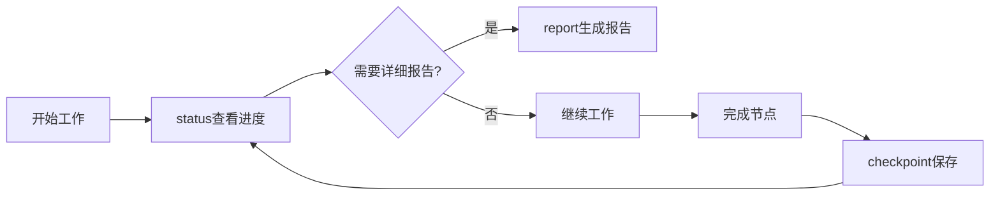

# status Skill

## 概述

`status` 是进度查看 Skill，用于查看项目的完整进度状态，包括节点完成情况、任务进度、时间统计等。

## 如何单独使用

### 命令调用

```bash
/status
```

### 自动触发

在以下场景建议使用：
- 想了解项目当前进度
- 查看哪些阶段已完成、哪些正在进行
- 查看时间统计和预估剩余时间
- 确认下一步行动

## 具体使用案例

### 案例 1：查看当前项目进度

**用户输入**：
```
/status
```

**执行流程**：
1. 📊 **读取项目信息**
   - 从 CLAUDE.md 读取项目元数据
   - 从 Git 获取当前分支和提交信息

2. 📈 **读取进度数据**
   - 从 Serena memory 读取 progress-{project_id}
   - 解析阶段状态、时间统计

3. 🎯 **计算进度**
   - 计算完成百分比：completed_phases / total_phases
   - 统计总耗时和预估剩余时间

4. 📋 **显示进度报告**
   ```
   📊 Project Progress: User Authentication System

   ## Overall Progress
   [████████░░░] 72% (8/11 phases)

   ## Current Phase
   **Design** - In Progress (30 minutes ago)

   ## Phase Status
   ✅ brainstorm - Completed (2h)
   ✅ analyze - Completed (1.5h)
   ✅ requirement - Completed (1.5h)
   🔄 design - In Progress (30m)
   ⏳ design-review - Pending
   ⏳ plan - Pending
   ⏳ git-worktrees - Pending
   ⏳ subagent-development - Pending

   ## Time Statistics
   - Total Time: 5h
   - Estimated Remaining: 8.3h

   ## Next Step
   Complete design phase
   ```

## 数据来源

### 主数据源

**Serena Memory** (`progress-{project_id}`)：
- 项目元数据（名称、ID、流程类型）
- 阶段信息（状态、开始/结束时间）
- 整体进度（百分比、完成数）
- 时间统计

### 辅助数据源

**TodoWrite**：
- 当前任务列表
- 任务状态
- 依赖关系

**Git**：
- 当前分支
- 最近提交
- 工作目录状态

**CLAUDE.md**：
- 项目名称
- 项目ID
- 技术栈

## 进度计算逻辑

### 百分比计算

```python
percentage = (completed_phases / total_phases) * 100
```

**示例**：
- full-flow: 8个节点，完成3个 → 37.5%
- quick-flow: 4个节点，完成2个 → 50%

### 时间统计

```python
# 已用时间
total_time = sum(end_time - start_time for each completed phase)

# 预估剩余时间
avg_time_per_phase = total_time / completed_phases
estimated_remaining = avg_time_per_phase * (total_phases - completed_phases)
```

## 与其他Skills的关系

### 配合使用

- **checkpoint** - 在关键节点创建检查点，status可以查看
- **resume** - 恢复工作时先查看status了解进度
- **report** - 生成详细报告，status是快速查看
- **monitor** - monitor内部调用status获取数据

### 使用时机



## 最佳实践

### 1. 定期查看进度

建议在以下时机查看：
- 每日开始工作时
- 完成一个节点后
- 创建checkpoint前
- 准备恢复工作时

### 2. 理解进度百分比

- **0-25%** - 需求和设计阶段
- **25-50%** - 规划和准备阶段
- **50-75%** - 实现阶段
- **75-100%** - 测试和完成阶段

### 3. 关注时间预估

时间预估基于：
- 已完成阶段的平均耗时
- 剩余阶段数量
- 实际进度可能因复杂度而变化

### 4. 利用下一步提示

status会告诉你：
- 当前阶段是什么
- 下一步应该做什么
- 有哪些待完成的阶段

## 常见问题

### Q: 为什么进度显示不准确？

A: 可能原因：
- progress数据未及时更新
- 节点完成后未创建checkpoint
- Git分支信息不匹配

**解决方法**：
1. 运行 `/checkpoint` 更新进度
2. 确认当前在正确的Git分支
3. 检查 progress-{project_id} 是否存在

### Q: 如何查看历史进度？

A: 使用 `/report` 生成详细报告，包含历史checkpoint和统计数据。

### Q: 多项目环境下如何切换？

A: status会自动检测当前项目（从CLAUDE.md或目录名），如需切换项目，切换到对应目录即可。

## 技术细节

完整的执行流程、工具使用、代码示例请参考：[status/SKILL.md](../../skills/status/SKILL.md)
