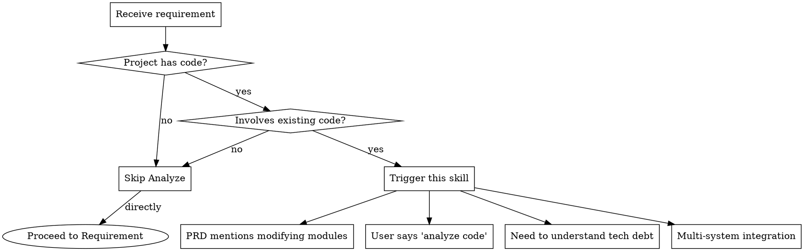
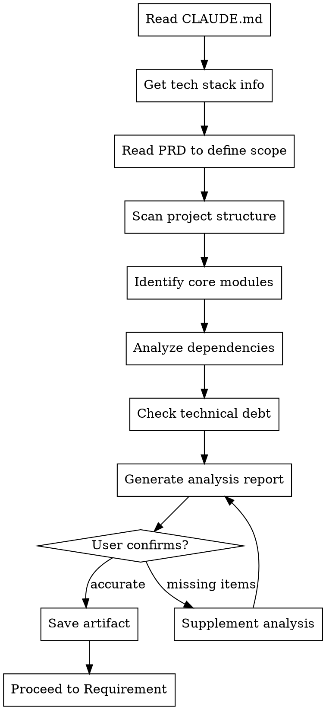
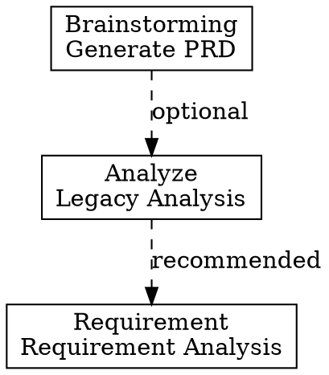

# Analyze - Legacy Code Analysis

## Overview

Analyze existing codebase before requirement and design phases. Understand current architecture, dependencies, and technical debt.

**Core Value**:
- 🎯 Avoid reinventing the wheel
- 🔍 Identify technical debt and risks
- 📊 Understand module dependencies
- 🛡️ Assess change impact scope

**Important**: This is a **necessary step when modifying existing code**.

## When to Use

### Prerequisites
- ✅ Project has existing code (not brand new)
- ✅ Project contains code files (not documentation-only)
- ✅ CLAUDE.md has been read to understand tech stack

### Trigger Conditions

Use this skill when:
- User says "analyze existing code..."
- User says "understand current architecture..."
- PRD involves modifying existing system
- Need to understand technical debt
- Involves multi-system integration

### Decision Flow



### Skip Conditions

Skip this node when:
- Brand new project (no existing code)
- Independent module (doesn't touch existing code)
- Documentation-only project (no code files)
- User explicitly says it's not needed

## The Process

### Detailed Workflow



### Step-by-Step Guide

#### Step 1: Read CLAUDE.md ⭐

**Purpose**: Get project tech stack information

**Action**:
```bash
Read: CLAUDE.md
```

**Extract**:
- Programming language (e.g., Python, JavaScript, Go)
- Frameworks and libraries (e.g., Django, React, Gin)
- Architecture style (e.g., MVC, Microservices, Monolith)
- Build tools (e.g., npm, pip, go mod)
- Project-specific rules and conventions

**Example Output**:
```
Tech Stack:
- Language: Python 3.10
- Framework: Django 4.2
- Architecture: MVC + Service Layer
- Build Tool: poetry
- Test Framework: pytest
```

#### Step 2: Read PRD to Define Scope

**Purpose**: Understand what features to build, define analysis scope

**Action**:
```bash
Read: .claude/docs/*PRD*.md
```

**Extract**:
- Core feature descriptions
- Modules involved
- Files that need modification
- Integration points

#### Step 3: Scan Project Structure

**Purpose**: Understand overall project structure

**Use Tool**:
```python
mcp__serena__list_dir(relative_path=".", recursive=False)
```

**Output**:
- Top-level directory structure
- Main module distribution
- Configuration file locations

#### Step 4: Identify Core Modules

**Purpose**: Find core files that need modification

**Use Tools**:
```python
# Get symbol overview
mcp__serena__get_symbols_overview(relative_path="path/to/file.py")

# Search for patterns
mcp__serena__search_for_pattern(
    substring_pattern="class.*Service",
    relative_path="services/"
)
```

**Identify**:
- Core classes and functions to modify
- Module boundaries and responsibilities
- Key business logic

#### Step 5: Analyze Dependencies

**Purpose**: Understand calling relationships between modules

**Use Tool**:
```python
mcp__serena__find_referencing_symbols(
    name_path="UserService",
    relative_path="services/user.py"
)
```

**Analyze**:
- Upstream dependencies (who calls this)
- Downstream dependencies (what this calls)
- Data flow direction
- Interface contracts

#### Step 6: Check Technical Debt

**Purpose**: Identify potential risks

**Check Items**:
- Code smells
- Outdated dependencies
- Performance bottlenecks
- Security risks
- Test coverage

#### Step 7: Generate Analysis Report

**Output**: `.claude/analysis-docs/{date}_LegacyAnalysis_{ModuleName}_v1.0.md`

**Report Structure**:
```markdown
# Legacy Code Analysis Report

## 1. Tech Stack Overview
- Language: [from CLAUDE.md]
- Framework: [from CLAUDE.md]
- Architecture: [from CLAUDE.md]
- Build Tool: [from CLAUDE.md]

## 2. Architecture Overview
[Architecture description and diagram]

## 3. Core Modules
### Module 1: [Name]
- Location: [path]
- Main functionality: [description]
- Required changes: [changes needed]

## 4. Dependencies
[Module dependency diagram - using Mermaid]

## 5. Interface Inventory
### Interface 1: [Name]
- Location: [file:line]
- Signature: [function signature]
- Purpose: [description]

## 6. Technical Constraints
- Technical debt: [debt list]
- Limitations: [constraints]

## 7. Risk Assessment
- 🔴 High risk: [risk description]
- 🟡 Medium risk: [risk description]
- 🟢 Low risk: [risk description]
```

#### Step 8: User Confirmation

**Confirmation Mechanism**:
```
Show analysis summary:
1. Tech stack info
2. Key findings (3-5 items)
3. Files that need changes
4. Technical constraints and risks

Ask: "Is the analysis accurate? Any missing items?"
├── ✅ Accurate → Save artifact, proceed to Requirement
├── ⚠️ Missing items → Supplement analysis
└── ❌ Incorrect → Re-analyze
```

## Tool Usage

### Serena MCP Tools

**Directory Scanning**:
```python
mcp__serena__list_dir(
    relative_path=".",
    recursive=False,
    skip_ignored_files=True
)
```

**Symbol Overview**:
```python
mcp__serena__get_symbols_overview(
    relative_path="path/to/file.py",
    depth=1  # 0=top-level only, 1=include children
)
```

**Reference Analysis**:
```python
mcp__serena__find_referencing_symbols(
    name_path="UserService",
    relative_path="services/user.py",
    include_body=False
)
```

**Pattern Search**:
```python
mcp__serena__search_for_pattern(
    substring_pattern="class.*Service",
    relative_path="services/",
    restrict_search_to_code_files=True
)
```

### Project Context Tools

**Read Tech Stack**:
```python
Read: CLAUDE.md
# Extract project_tech_stack section
```

**Read Dependency Config**:
```python
# Read based on project type
Read: package.json       # Node.js
Read: requirements.txt   # Python
Read: go.mod            # Go
Read: pom.xml           # Java
```

## Time Estimation

| Complexity | Time Range | Description |
|-----------|-----------|-------------|
| 🟢 Simple | 10-20 min | Single module, no complex dependencies |
| 🟡 Medium | 20-40 min | Multiple modules, few external dependencies |
| 🔴 Complex | 40-80 min | Multi-system integration, large legacy codebase |

**Complexity Criteria**:
- 🟢 **Simple**: < 5 files to modify, clear dependencies
- 🟡 **Medium**: 5-15 files to modify, some external dependencies
- 🔴 **Complex**: > 15 files to modify, multi-system integration

## After the Analysis

### Automatic Trigger Logic

After successfully completing the analysis (user confirms accuracy), automatically trigger the following 4 steps:

#### Step 1: Save Analysis Artifact

**Action**: Save the legacy analysis report to designated location

**Location**: `.claude/analysis-docs/{YYYY-MM-DD}_LegacyAnalysis_{ModuleName}_v1.0.md`

**Example**:
```
.claude/analysis-docs/2026-03-05_LegacyAnalysis_UserAuth_v1.0.md
```

**Content**: Complete analysis report including tech stack, architecture, dependencies, risks, and user confirmation.

#### Step 2: Update Progress Tracking

**Action**: Update progress tracking file to mark Analyze node as completed

**File**: `.claude/plans/progress.json` or equivalent tracking file

**Update Content**:
```json
{
  "current_node": "analyze",
  "status": "completed",
  "completed_at": "2026-03-05T10:30:00Z",
  "artifacts": [
    ".claude/analysis-docs/2026-03-05_LegacyAnalysis_UserAuth_v1.0.md"
  ]
}
```

#### Step 3: Provide Next Step Recommendation

**Action**: Automatically recommend the next skill node based on flow type

**Recommendation Logic**:
- **Full Flow**: Recommend `requirement` skill
- **Quick Flow**: Recommend `requirement` skill
- **Exploration Flow**: Recommend `design` skill

**Output Format**:
```
✅ Analysis completed successfully!

📋 Next recommended step: Requirement Analysis
💡 Trigger command: /cadence:requirement

Would you like to proceed to Requirement Analysis? (Y/n)
```

#### Step 4: Prepare Handoff Context

**Action**: Prepare context summary for the next skill node

**Handoff Content**:
```markdown
## Handoff from Analyze to Requirement

### Analysis Summary
- **Tech Stack**: [from CLAUDE.md]
- **Key Modules**: [modules identified]
- **Dependencies**: [critical dependencies]
- **Risks**: [high/medium risks identified]
- **Technical Debt**: [debt items]

### Key Artifacts
- Legacy Analysis Report: `.claude/analysis-docs/{date}_LegacyAnalysis_{ModuleName}_v1.0.md`

### Recommended Focus Areas for Requirement
- [Focus area 1 based on analysis findings]
- [Focus area 2 based on analysis findings]
- [Focus area 3 based on analysis findings]
```

**Purpose**: Ensure smooth transition and provide context for the next skill node.

### User Interaction

**After automatic trigger logic completes, ask user**:
```
Analysis artifact saved. Progress updated.

Would you like to:
1. ✅ Proceed to Requirement Analysis (recommended)
2. 📋 Review the analysis report first
3. 🔄 Make adjustments to the analysis
4. ⏸️ Pause and continue later

Please choose [1-4]:
```

## Checklist ✅

After completing analysis, ensure:

- [ ] **CLAUDE.md**: Read and understood tech stack?
- [ ] **Architecture overview**: Clearly described existing system architecture?
- [ ] **Core modules**: Identified modules that need modification?
- [ ] **Dependencies**: Analyzed dependencies between modules?
- [ ] **Interface inventory**: Listed interfaces that need adaptation?
- [ ] **Technical constraints**: Identified technical debt and limitations?
- [ ] **Risk assessment**: Marked potential risk points?
- [ ] **User confirmation**: Obtained user confirmation?

## Red Flags ⚠️

### Must Avoid

| Wrong Approach | Right Approach |
|---------------|----------------|
| ❌ Skip Analyze and go directly to Design | ✅ Must understand existing code before designing |
| ❌ Only analyze surface code, ignore deep dependencies | ✅ Need to deeply understand data flow and call chains |
| ❌ Force design without fully understanding legacy code | ✅ Ask user for clarification when in doubt |
| ❌ Ignore tech stack info in CLAUDE.md | ✅ Must read CLAUDE.md first to understand project context |
| ❌ Don't analyze technical debt and risks | ✅ Must identify and record technical debt |
| ❌ Generate report without confirmation | ✅ Must confirm analysis accuracy with user |

## Integration

### Dependencies

**Optional Dependencies**:
- `brainstorming` - PRD document (for full flow)

**Prerequisites**:
- Project contains code files
- CLAUDE.md exists and contains tech stack info

### Next Steps

**Recommended Next**:
- `requirement` - Conduct requirement analysis based on legacy analysis

**Alternative Paths**:
- If analysis shows implementation is not feasible, return to `brainstorming` to adjust requirements
- If brand new project, skip this node and go directly to `requirement`

### Relationship with Other Skills



### Required Input

1. **CLAUDE.md** (required): Tech stack info
2. **PRD document** (optional): Analysis scope
3. **User specification** (optional): Modules to analyze

### Provided Output

1. **Legacy Analysis Report**: `.claude/analysis-docs/{date}_LegacyAnalysis_{ModuleName}_v1.0.md`
2. **Architecture Diagram**: Mermaid format
3. **Dependency Graph**: Mermaid format
4. **Risk Assessment List**

## Example

### Example Scenario: Modifying User Authentication Module

**Trigger**:
- PRD mentions "improve user login flow"
- Involves existing code modification

**Analysis Steps**:

1. **Read CLAUDE.md**:
   ```
   Tech Stack: Python + Django + JWT
   Architecture: MVC + Service Layer
   ```

2. **Scan Project Structure**:
   ```
   Found modules:
   - auth/          # Authentication module
   - users/         # User module
   - services/      # Business logic
   ```

3. **Identify Core Modules**:
   ```
   - auth/views.py::LoginView          # Login view
   - services/auth_service.py::AuthService  # Auth service
   - users/models.py::User             # User model
   ```

4. **Analyze Dependencies**:
   ```
   LoginView → AuthService → User Model
                ↓
            JWT Handler
   ```

5. **Check Technical Debt**:
   ```
   - Weak password strength validation
   - JWT expiry time hardcoded
   - Missing login failure rate limiting
   ```

6. **Generate Report**:
   ```
   Save to: .claude/analysis-docs/2026-03-01_LegacyAnalysis_UserAuth_v1.0.md
   ```

7. **User Confirmation**:
   ```
   Show key findings, ask: "Is the analysis accurate?"
   ```

## Best Practices

### DO - Recommended

✅ **Read CLAUDE.md first**: Must understand tech stack before analyzing
✅ **Deep dependency analysis**: Don't just look at surface calls, understand data flow
✅ **Identify risks**: Proactively identify technical debt and potential risks
✅ **Confirm timely**: Ask user for confirmation when in doubt
✅ **Complete documentation**: Analysis report should include all key information

### DON'T - Avoid

❌ **Skip CLAUDE.md**: Start analyzing without understanding tech stack
❌ **Superficial analysis**: Only analyze surface, don't go deep into dependencies
❌ **Ignore risks**: Don't identify or hide technical debt
❌ **Assume**: Don't guess without confirmation when uncertain
❌ **Incomplete records**: Omit key information

## Summary

**Core Value of Analyze Skill**:
1. 🎯 **Avoid reinventing** - Identify reusable existing code
2. 🔍 **Reduce risk** - Identify technical debt and risks early
3. 📊 **Provide basis** - Provide foundation for subsequent requirement analysis and design
4. 🛡️ **Ensure quality** - Ensure changes won't break existing functionality

**Remember**: When modifying existing code, Analyze is an essential step!
