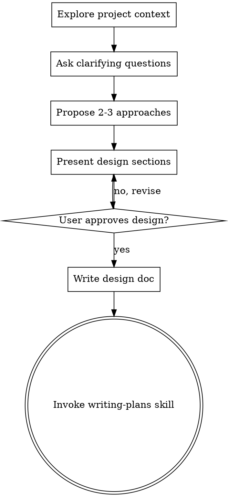

# Brainstorming Ideas Into Designs

## Overview

Help turn ideas into fully formed designs and specs through natural collaborative dialogue.

Start by understanding the current project context, then ask questions one at a time to refine the idea. Once you understand what you're building, present the design and get user approval.

<HARD-GATE>
Do NOT invoke any implementation skill, write any code, scaffold any project, or take any implementation action until you have presented a design and the user has approved it. This applies to EVERY project regardless of perceived simplicity.
</HARD-GATE>

## Anti-Pattern: "This Is Too Simple To Need A Design"

Every project goes through this process. A todo list, a single-function utility, a config change — all of them. "Simple" projects are where unexamined assumptions cause the most wasted work. The design can be short (a few sentences for truly simple projects), but you MUST present it and get approval.

## Checklist

You MUST create a task for each of these items and complete them in order:

1. **Explore project context** — check files, docs, recent commits
2. **Ask clarifying questions** — one at a time, understand purpose/constraints/success criteria
3. **Propose 2-3 approaches** — with trade-offs and your recommendation
4. **Present design** — in sections scaled to their complexity, get user approval after each section
5. **Write design doc** — save to `docs/plans/YYYY-MM-DD-<topic>-design.md` and commit
6. **Transition to implementation** — invoke writing-plans skill to create implementation plan

## Process Flow



**The terminal state is invoking writing-plans.** Do NOT invoke frontend-design, mcp-builder, or any other implementation skill. The ONLY skill you invoke after brainstorming is writing-plans.

## The Process

**Understanding the idea:**
- Check out the current project state first (files, docs, recent commits)
- Ask questions one at a time to refine the idea
- Prefer multiple choice questions when possible, but open-ended is fine too
- Only one question per message - if a topic needs more exploration, break it into multiple questions
- Focus on understanding: purpose, constraints, success criteria

**Exploring approaches:**
- Propose 2-3 different approaches with trade-offs
- Present options conversationally with your recommendation and reasoning
- Lead with your recommended option and explain why

**Presenting the design:**
- Once you believe you understand what you're building, present the design
- Scale each section to its complexity: a few sentences if straightforward, up to 200-300 words if nuanced
- Ask after each section whether it looks right so far
- Cover: architecture, components, data flow, error handling, testing
- Be ready to go back and clarify if something doesn't make sense

## After the Design

**Documentation:**
- Write the validated design to `docs/plans/YYYY-MM-DD-<topic>-design.md`
- Use elements-of-style:writing-clearly-and-concisely skill if available
- Commit the design document to git

**Implementation:**
- Invoke the writing-plans skill to create a detailed implementation plan
- Do NOT invoke any other skill. writing-plans is the next step.

## Key Principles

- **One question at a time** - Don't overwhelm with multiple questions
- **Multiple choice preferred** - Easier to answer than open-ended when possible
- **YAGNI ruthlessly** - Remove unnecessary features from all designs
- **Explore alternatives** - Always propose 2-3 approaches before settling
- **Incremental validation** - Present design, get approval before moving on
- **Be flexible** - Go back and clarify when something doesn't make sense

## After the Brainstorming

**进度追踪**（用户确认后自动执行，无需用户干预）:

完成 Brainstorming 节点后，系统将自动执行以下 4 个步骤来保存和更新进度：

### Step 1: 保存 Checkpoint

调用 `checkpoint` skill 保存进度:

```yaml
checkpoint_data = {
  phase: "brainstorming",
  status: "completed",
  output: "docs/plans/YYYY-MM-DD-<topic>-design.md",
  context: {
    git_branch: get_current_branch(),
    git_commits: get_recent_commits(),
    todowrite_state: get_todowrite_state()
  }
}

checkpoint_id = save_checkpoint(project_id, checkpoint_data)
```

### Step 2: 更新 Progress

更新 Progress 记录:

```yaml
progress_data = read_memory(f"progress-{project_id}")

# 更新阶段状态
for phase in progress_data.phases:
  if phase.phase_name == "brainstorming":
    phase.status = "completed"
    phase.end_time = get_current_timestamp()
    break

# 计算整体进度
progress_data.overall_progress.percentage = calculate_overall_progress(progress_data)
progress_data.overall_progress.completed_phases = sum(
  1 for phase in progress_data.phases
  if phase.status == "completed"
)

# 保存 Progress
write_memory(f"progress-{project_id}", progress_data)
```

### Step 3: 更新索引

更新查询索引:

```yaml
# 更新时间索引
time_index = read_memory(f"index-{project_id}-checkpoints-by-time")
today = get_current_date()
time_index[today].append(checkpoint_id)
write_memory(f"index-{project_id}-checkpoints-by-time", time_index)

# 更新阶段索引
phase_index = read_memory(f"index-{project_id}-checkpoints-by-phase")
phase_index["brainstorming"].append(checkpoint_id)
write_memory(f"index-{project_id}-checkpoints-by-phase", phase_index)
```

### Step 4: 显示当前进度

显示项目进度:

```yaml
status_data = get_project_status(project_id)

print("\n📊 项目进度:")
print(f"✅ 已完成: {status_data.completed_phases}/{status_data.total_phases} 节点")
print(f"📈 进度: {status_data.percentage:.1f}%")
print(f"⏱️  已用时: {format_duration(status_data.total_time)}")
print(f"⏳ 预估剩余: {format_duration(status_data.estimated_remaining)}\n")
```
